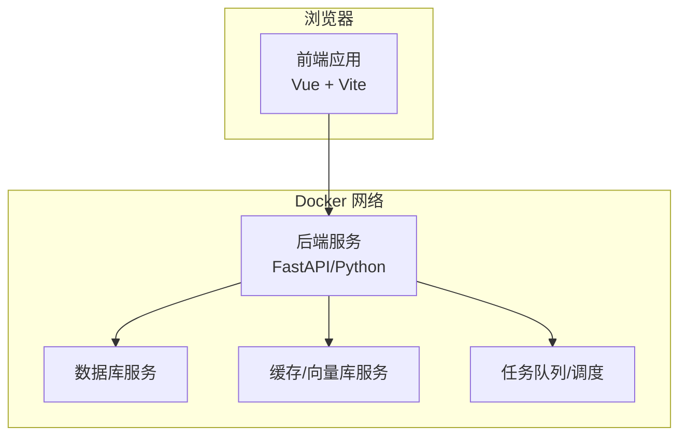
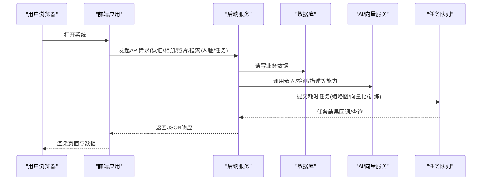
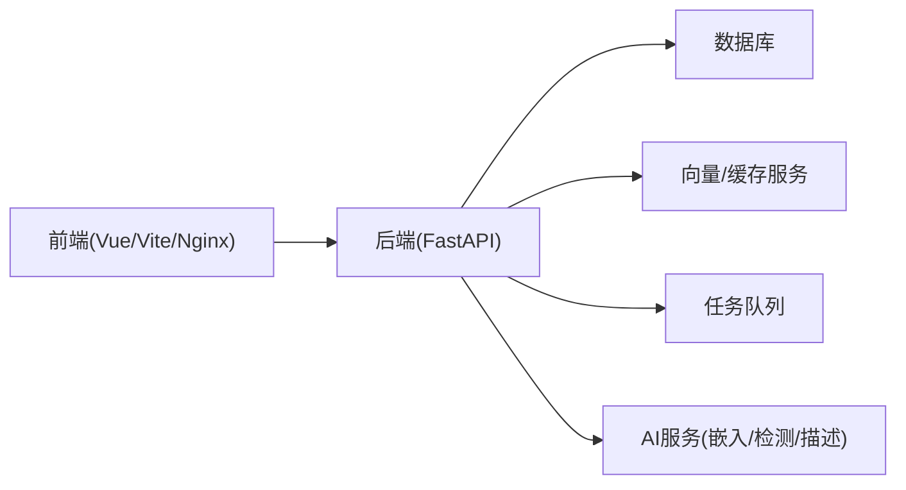

# 快速开始

<cite>
**本文引用的文件**   
- [README.md](file://README.md)
- [docker-compose.yml](file://docker-compose.yml)
- [backend/Dockerfile](file://backend/Dockerfile)
- [frontend/Dockerfile](file://frontend/Dockerfile)
- [backend/main.py](file://backend/main.py)
- [backend/app/config/settings.py](file://backend/app/config/settings.py)
- [backend/pyproject.toml](file://backend/pyproject.toml)
- [frontend/package.json](file://frontend/package.json)
- [frontend/vite.config.ts](file://frontend/vite.config.ts)
- [frontend/nginx.conf](file://frontend/nginx.conf)
</cite>

## 目录
1. [简介](#简介)
2. [项目结构](#项目结构)
3. [核心组件](#核心组件)
4. [架构总览](#架构总览)
5. [详细组件分析](#详细组件分析)
6. [依赖关系分析](#依赖关系分析)
7. [性能考虑](#性能考虑)
8. [故障排查指南](#故障排查指南)
9. [结论](#结论)
10. [附录](#附录) 

## 简介
本指南面向首次使用者，帮助你在30分钟内完成AI智能相册管理系统的环境搭建与运行。你将通过两种方式启动系统：
- Docker容器化部署（推荐）：一键拉起前后端、数据库等依赖服务
- 本地开发环境：分别安装Python与Node.js依赖并启动前后端

完成后，你将完成首次登录、上传第一张照片、创建第一个相册的完整流程体验。

## 项目结构
仓库采用前后端分离架构：
- 后端：基于Python的Web服务，提供API、任务调度、AI能力集成、数据存储访问等
- 前端：基于Vue/TS的单页应用，提供相册管理、搜索、人脸识别、地图视图、对话式助手等界面
- 容器编排：使用docker-compose统一拉起多服务

图表来源
- [docker-compose.yml](file://docker-compose.yml)
- [backend/main.py](file://backend/main.py)
- [frontend/vite.config.ts](file://frontend/vite.config.ts)

章节来源
- [README.md](file://README.md)
- [docker-compose.yml](file://docker-compose.yml)

## 核心组件
- 后端服务
  - Web入口与路由挂载
  - 配置加载与环境变量解析
  - 数据库连接与会话管理
  - 媒体处理、缩略图生成、EXIF读取
  - AI能力：人脸检测/聚类、描述生成、语义检索、Agent对话
  - 任务调度与异步处理
- 前端应用
  - 页面：首页、登录、照片、相册、搜索、人脸、地图、回收站、设置、训练、模型管理等
  - 状态管理：用户、主题、聊天、照片列表等
  - API封装：认证、相册、照片、搜索、人脸、任务、训练等
- 容器化
  - 后端镜像构建与运行
  - 前端静态资源构建与Nginx托管
  - docker-compose编排多服务

章节来源
- [backend/main.py](file://backend/main.py)
- [backend/app/config/settings.py](file://backend/app/config/settings.py)
- [frontend/package.json](file://frontend/package.json)
- [frontend/vite.config.ts](file://frontend/vite.config.ts)
- [frontend/nginx.conf](file://frontend/nginx.conf)

## 架构总览
下图展示了从浏览器到后端、再到数据与AI服务的整体交互路径。

图表来源
- [backend/main.py](file://backend/main.py)
- [docker-compose.yml](file://docker-compose.yml)

## 详细组件分析

### 前置依赖与环境要求
- 通用
  - 操作系统：Windows/macOS/Linux
  - 磁盘空间：建议至少预留数GB用于模型与图片存储
  - 网络：可访问外部AI服务或本地已部署的AI/向量服务
- Docker方式（推荐）
  - 安装Docker与Docker Compose
  - 无需额外安装Python/Node.js
- 本地开发方式
  - Python：建议使用与后端依赖兼容的版本（参考后端依赖声明）
  - Node.js：建议使用与前端脚本兼容的版本（参考package.json）
  - 包管理器：pip/pipenv/uv 或 npm/yarn/pnpm（任选其一）
  - 数据库与向量服务：按docker-compose中定义的服务准备（或使用Compose一键拉起）

章节来源
- [backend/pyproject.toml](file://backend/pyproject.toml)
- [frontend/package.json](file://frontend/package.json)
- [docker-compose.yml](file://docker-compose.yml)

### 一键启动（Docker）
- 步骤
  - 在仓库根目录执行编排命令以拉起所有服务
  - 等待服务就绪后，浏览器访问前端地址
- 说明
  - 该方式会同时构建/拉取后端与前端镜像，并启动数据库、缓存/向量库、任务队列等服务
  - 如需自定义端口或挂载数据卷，请参考编排文件的端口映射与卷挂载项

章节来源
- [docker-compose.yml](file://docker-compose.yml)
- [backend/Dockerfile](file://backend/Dockerfile)
- [frontend/Dockerfile](file://frontend/Dockerfile)

### 本地开发环境搭建
- 后端
  - 进入后端目录，根据依赖声明安装依赖
  - 配置环境变量（如数据库连接、AI服务地址、存储路径等）
  - 启动后端服务
- 前端
  - 进入前端目录，安装依赖
  - 配置Vite代理指向后端地址
  - 启动开发服务器
- 数据库与AI服务
  - 可直接使用docker-compose拉起所需服务，或在本地独立安装对应服务

章节来源
- [backend/pyproject.toml](file://backend/pyproject.toml)
- [backend/app/config/settings.py](file://backend/app/config/settings.py)
- [frontend/vite.config.ts](file://frontend/vite.config.ts)
- [frontend/package.json](file://frontend/package.json)

### 基础配置说明
- 关键配置项（示例类别）
  - 数据库连接：主机、端口、用户名、密码、库名
  - 存储路径：图片与缩略图存放目录
  - AI服务：嵌入/检测/描述等接口地址与鉴权参数
  - 任务队列：Broker/Backend地址
  - 前端代理：开发时转发至后端地址
- 配置优先级
  - 环境变量 > 配置文件 > 默认值
- 常见调整
  - 修改端口映射、挂载数据卷、切换AI服务地址

章节来源
- [backend/app/config/settings.py](file://backend/app/config/settings.py)
- [frontend/vite.config.ts](file://frontend/vite.config.ts)
- [docker-compose.yml](file://docker-compose.yml)

### 首次登录
- 打开系统后，进入登录页面
- 使用管理员账号或注册新用户进行登录
- 登录后即可进入主页，查看功能菜单

章节来源
- [frontend/src/views/LoginPage.vue](file://frontend/src/views/LoginPage.vue)
- [backend/app/api/auth.py](file://backend/app/api/auth.py)

### 上传第一张照片
- 在“照片”页面点击上传按钮，选择本地图片
- 支持批量上传；上传成功后将自动生成缩略图与元信息
- 可在详情页查看EXIF、标签、人脸等信息（取决于AI能力是否启用）

章节来源
- [frontend/src/components/photo/UploadDialog.vue](file://frontend/src/components/photo/UploadDialog.vue)
- [backend/app/api/photo.py](file://backend/app/api/photo.py)
- [backend/app/services/thumbnail.py](file://backend/app/services/thumbnail.py)
- [backend/app/services/exif_service.py](file://backend/app/services/exif_service.py)

### 创建第一个相册
- 在“相册”页面新建相册，填写名称与描述
- 将已上传的照片添加到相册，或直接在相册内上传
- 支持对相册进行分组、排序与批量操作

章节来源
- [frontend/src/views/AlbumPage.vue](file://frontend/src/views/AlbumPage.vue)
- [backend/app/api/album.py](file://backend/app/api/album.py)
- [backend/app/crud/album.py](file://backend/app/crud/album.py)

### 搜索与人脸识别（可选体验）
- 文本/语义搜索：输入关键词或自然语言描述查找照片
- 人脸识别：自动检测人脸并进行聚类，便于按人物浏览
- 地图视图：基于地理位置展示照片分布

章节来源
- [backend/app/api/search.py](file://backend/app/api/search.py)
- [backend/app/api/face.py](file://backend/app/api/face.py)
- [frontend/src/views/SearchPage.vue](file://frontend/src/views/SearchPage.vue)
- [frontend/src/views/FacePage.vue](file://frontend/src/views/FacePage.vue)
- [frontend/src/views/MapPage.vue](file://frontend/src/views/MapPage.vue)

### 任务与训练（进阶）
- 后台任务：缩略图生成、向量化、人脸检测等异步任务
- 训练模块：支持自定义模型训练与导入（需额外配置）

章节来源
- [backend/app/api/tasks.py](file://backend/app/api/tasks.py)
- [backend/app/api/training.py](file://backend/app/api/training.py)
- [frontend/src/views/TasksPage.vue](file://frontend/src/views/TasksPage.vue)
- [frontend/src/views/Training.vue](file://frontend/src/views/Training.vue)

## 依赖关系分析
- 容器编排依赖
  - 后端服务依赖数据库、缓存/向量库、任务队列
  - 前端服务由Nginx托管静态资源，开发时通过Vite代理访问后端
- 前后端通信
  - 前端通过HTTP/HTTPS调用后端REST API
  - 后端通过SDK/HTTP调用AI服务与向量库

图表来源
- [docker-compose.yml](file://docker-compose.yml)
- [backend/main.py](file://backend/main.py)
- [frontend/vite.config.ts](file://frontend/vite.config.ts)

章节来源
- [docker-compose.yml](file://docker-compose.yml)
- [backend/main.py](file://backend/main.py)
- [frontend/vite.config.ts](file://frontend/vite.config.ts)

## 性能考虑
- 存储与I/O
  - 合理设置图片存储路径与磁盘配额
  - 开启缩略图缓存以减少重复计算
- 并发与异步
  - 将耗时任务放入队列，避免阻塞主线程
  - 合理设置任务并行度与重试策略
- 缓存与索引
  - 利用缓存层减少热点数据查询
  - 为常用字段建立索引以提升检索性能
- 资源限制
  - 为容器设置CPU/内存上限，防止资源争用
  - 监控日志与指标，定位瓶颈

[本节为通用指导，不直接分析具体文件]

## 故障排查指南
- 无法访问前端
  - 检查容器是否成功启动、端口是否被占用
  - 确认浏览器访问地址与端口映射一致
- 后端报错或无法连接数据库
  - 核对数据库连接参数与服务是否可用
  - 查看后端日志定位错误堆栈
- 上传失败或无缩略图
  - 检查存储路径权限与容量
  - 确认缩略图生成任务是否正常执行
- AI能力不可用
  - 校验AI服务地址、鉴权参数与网络连通性
  - 查看相关服务日志与返回码
- 任务堆积
  - 检查任务队列服务状态与消费者数量
  - 适当扩容任务worker或优化任务粒度

章节来源
- [backend/main.py](file://backend/main.py)
- [backend/app/config/settings.py](file://backend/app/config/settings.py)
- [docker-compose.yml](file://docker-compose.yml)

## 结论
通过本指南，你已完成AI智能相册管理系统的一键部署或本地开发环境搭建，并完成了首次登录、上传照片与创建相册的核心流程。后续可根据需要扩展AI能力、调整资源配置与优化性能。

[本节为总结性内容，不直接分析具体文件]

## 附录
- 常见问题
  - 如何更换端口？在编排文件中修改端口映射
  - 如何持久化数据？将数据卷挂载到宿主机目录
  - 如何切换AI服务？更新后端配置中的服务地址与鉴权参数
- 参考文档
  - 后端依赖与版本约束
  - 前端脚本与构建配置
  - Nginx反向代理与静态资源托管

章节来源
- [backend/pyproject.toml](file://backend/pyproject.toml)
- [frontend/package.json](file://frontend/package.json)
- [frontend/nginx.conf](file://frontend/nginx.conf)
- [docker-compose.yml](file://docker-compose.yml)