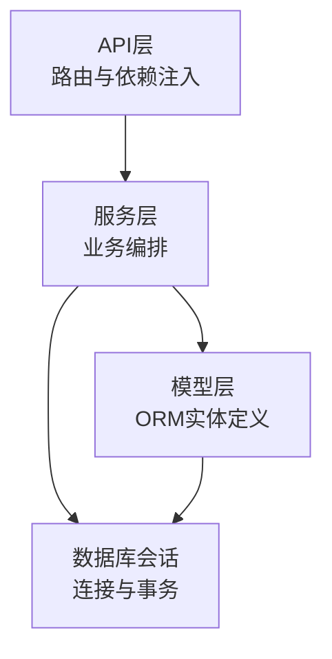
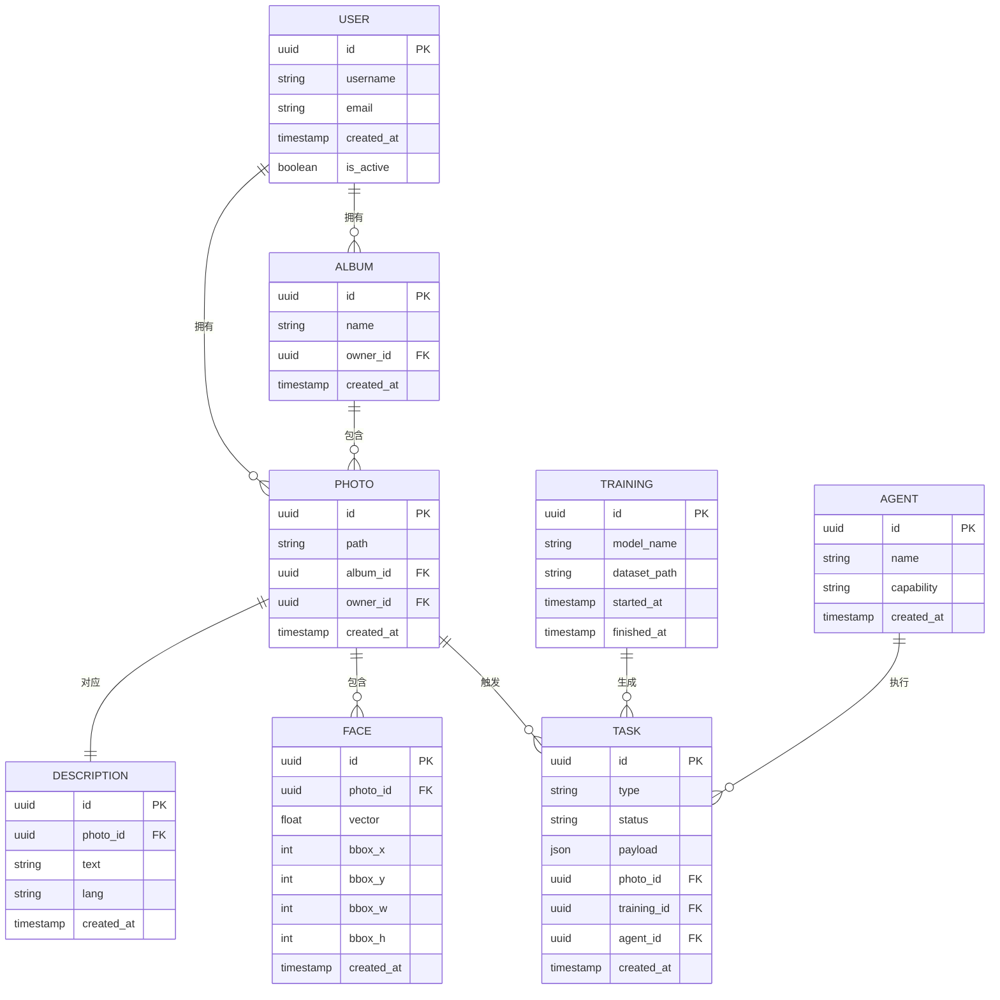
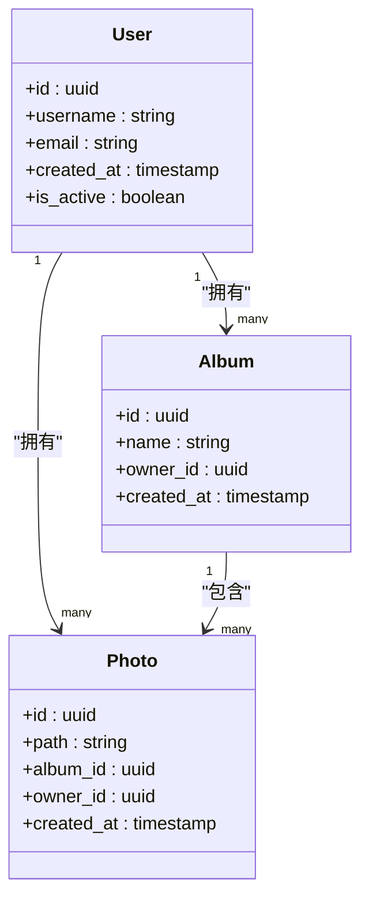
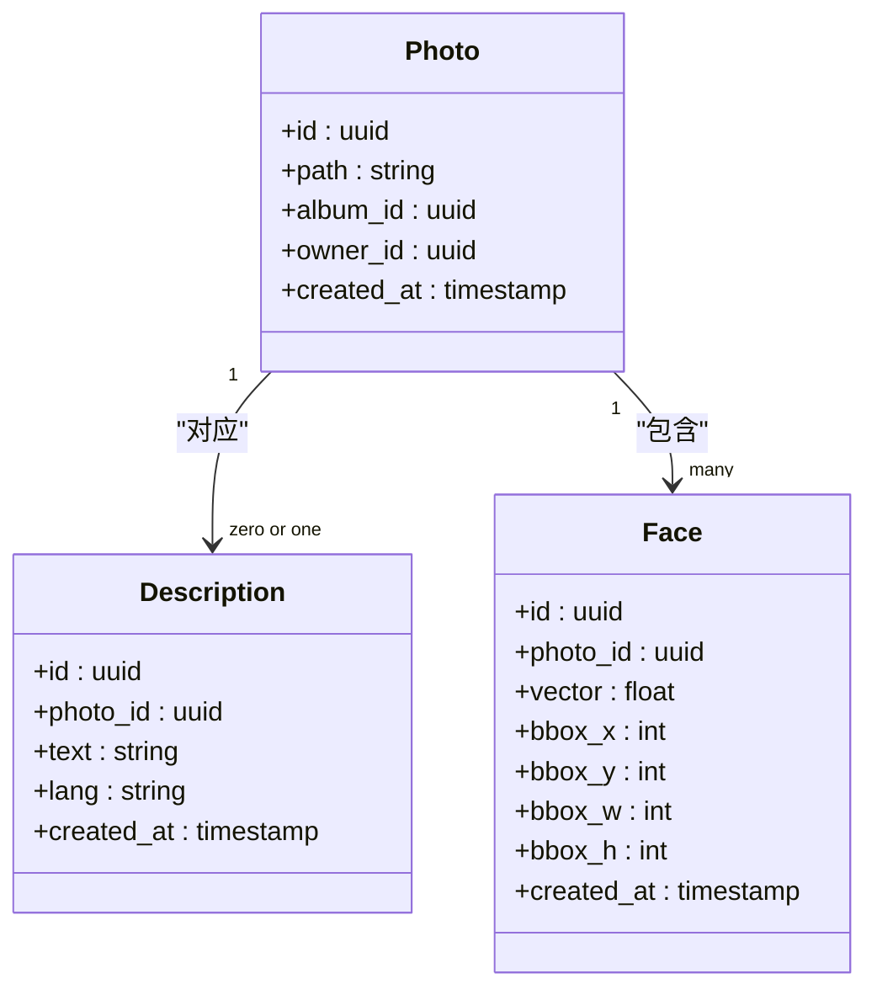
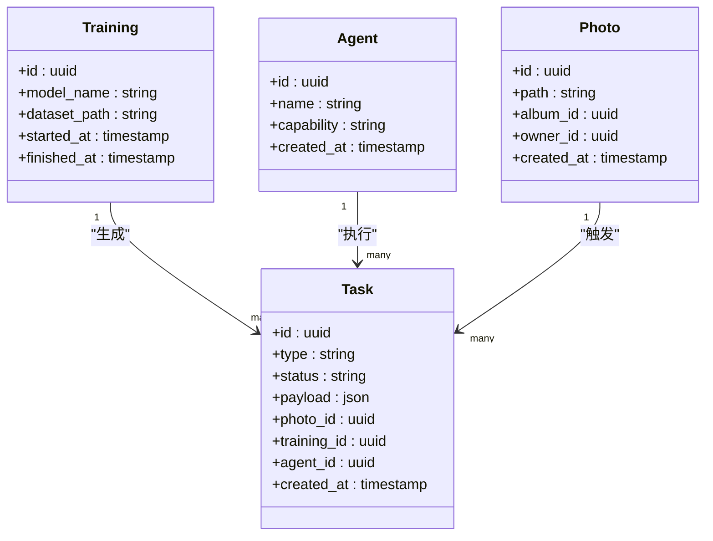
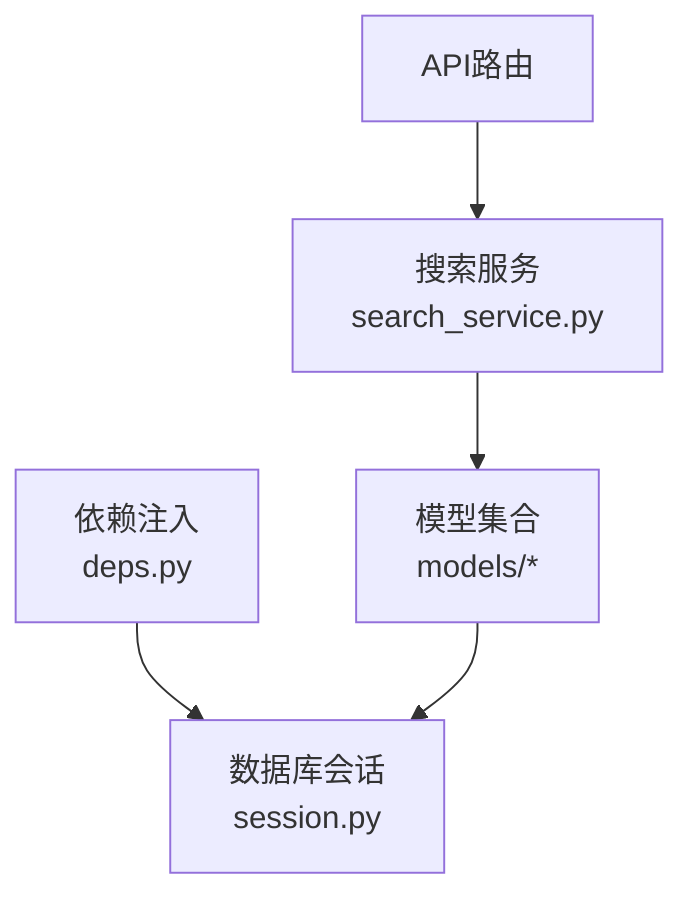

# 实体关系设计

<cite>
**本文引用的文件**   
- [backend/app/models/user.py](file://backend/app/models/user.py)
- [backend/app/models/album.py](file://backend/app/models/album.py)
- [backend/app/models/photo.py](file://backend/app/models/photo.py)
- [backend/app/models/description.py](file://backend/app/models/description.py)
- [backend/app/models/face.py](file://backend/app/models/face.py)
- [backend/app/models/task.py](file://backend/app/models/task.py)
- [backend/app/models/training.py](file://backend/app/models/training.py)
- [backend/app/models/agent.py](file://backend/app/models/agent.py)
- [backend/app/database/session.py](file://backend/app/database/session.py)
- [backend/app/services/search_service.py](file://backend/app/services/search_service.py)
- [backend/app/api/deps.py](file://backend/app/api/deps.py)
</cite>

## 目录
1. [简介](#简介)
2. [项目结构](#项目结构)
3. [核心组件](#核心组件)
4. [架构总览](#架构总览)
5. [详细组件分析](#详细组件分析)
6. [依赖分析](#依赖分析)
7. [性能考虑](#性能考虑)
8. [故障排查指南](#故障排查指南)
9. [结论](#结论)
10. [附录](#附录)

## 简介
本文件聚焦于AI相册项目的实体关系设计，系统性梳理用户、相册、照片、人脸、任务、训练与智能体等数据模型之间的关联关系，包括一对一、一对多与多对多的建模方式；解释外键约束、级联操作与引用完整性规则；提供ER图与关系矩阵；并给出复杂查询场景下的关系导航策略与性能优化建议。同时总结懒加载、预加载与连接池配置对性能的影响，以及关系维护的最佳实践与常见陷阱规避方法。

## 项目结构
后端采用分层架构：API层调用CRUD与服务层，服务层通过数据库会话访问ORM模型。数据模型集中于 models 目录，数据库会话与存储抽象位于 database 目录，服务层在 services 目录中实现业务逻辑（如搜索、检测、聚类、向量检索等）。

图表来源
- [backend/app/api/deps.py](file://backend/app/api/deps.py)
- [backend/app/database/session.py](file://backend/app/database/session.py)
- [backend/app/services/search_service.py](file://backend/app/services/search_service.py)

章节来源
- [backend/app/database/session.py](file://backend/app/database/session.py)
- [backend/app/api/deps.py](file://backend/app/api/deps.py)

## 核心组件
- 用户（User）：系统主体，拥有相册、任务、训练记录等。
- 相册（Album）：照片的容器，可被多个用户共享或私有。
- 照片（Photo）：核心资源，包含元数据、描述、人脸标注、所属相册等。
- 描述（Description）：照片的文本描述，支持多语言或多版本。
- 人脸（Face）：照片中的人脸检测结果与特征，支持跨照片聚合识别。
- 任务（Task）：异步处理单元（如检测、聚类、向量化），与照片、训练、智能体相关。
- 训练（Training）：模型训练任务与数据集信息，与任务、智能体关联。
- 智能体（Agent）：执行特定能力的代理（如对话、检测、搜索），与任务、训练关联。

章节来源
- [backend/app/models/user.py](file://backend/app/models/user.py)
- [backend/app/models/album.py](file://backend/app/models/album.py)
- [backend/app/models/photo.py](file://backend/app/models/photo.py)
- [backend/app/models/description.py](file://backend/app/models/description.py)
- [backend/app/models/face.py](file://backend/app/models/face.py)
- [backend/app/models/task.py](file://backend/app/models/task.py)
- [backend/app/models/training.py](file://backend/app/models/training.py)
- [backend/app/models/agent.py](file://backend/app/models/agent.py)

## 架构总览
下图展示各实体间的关系与主要外键指向，体现一对一、一对多与多对多的设计模式。

图表来源
- [backend/app/models/user.py](file://backend/app/models/user.py)
- [backend/app/models/album.py](file://backend/app/models/album.py)
- [backend/app/models/photo.py](file://backend/app/models/photo.py)
- [backend/app/models/description.py](file://backend/app/models/description.py)
- [backend/app/models/face.py](file://backend/app/models/face.py)
- [backend/app/models/task.py](file://backend/app/models/task.py)
- [backend/app/models/training.py](file://backend/app/models/training.py)
- [backend/app/models/agent.py](file://backend/app/models/agent.py)

## 详细组件分析

### 用户与相册、照片的关系（一对多）
- 用户到相册为一对多：一个用户可以创建多个相册。
- 用户到照片为一对多：一个用户可以拥有多张照片。
- 相册到照片为一对多：一个相册可以包含多张照片。
- 外键约束与引用完整性：
  - 相册.owner_id 引用用户.id，确保相册归属明确。
  - 照片.album_id 引用相册.id，保证照片属于有效相册。
  - 照片.owner_id 引用用户.id，确保照片归属明确。
- 级联操作建议：
  - 删除用户时，若其相册/照片仍被其他用户共享，应谨慎使用级联删除，优先软删除或迁移所有权。
  - 删除相册时，可级联删除该相册下无其他引用的照片，但需考虑回收站与审计需求。

图表来源
- [backend/app/models/user.py](file://backend/app/models/user.py)
- [backend/app/models/album.py](file://backend/app/models/album.py)
- [backend/app/models/photo.py](file://backend/app/models/photo.py)

章节来源
- [backend/app/models/user.py](file://backend/app/models/user.py)
- [backend/app/models/album.py](file://backend/app/models/album.py)
- [backend/app/models/photo.py](file://backend/app/models/photo.py)

### 照片与描述、人脸的关系（一对一与一对多）
- 照片到描述为“一对零或一”：每张照片可有至多一条描述（可扩展为多语言版本）。
- 照片到人脸为“一对多”：一张照片可包含多个人脸检测结果。
- 外键约束与引用完整性：
  - 描述.photo_id 引用照片.id，确保描述仅属于有效照片。
  - 人脸.photo_id 引用照片.id，确保人脸标注属于有效照片。
- 级联操作建议：
  - 删除照片时，可级联删除其描述与人脸，避免孤儿记录。
  - 若存在跨照片的人脸聚合（见下文多对多），需谨慎处理级联删除以避免破坏聚合索引。

图表来源
- [backend/app/models/description.py](file://backend/app/models/description.py)
- [backend/app/models/face.py](file://backend/app/models/face.py)
- [backend/app/models/photo.py](file://backend/app/models/photo.py)

章节来源
- [backend/app/models/description.py](file://backend/app/models/description.py)
- [backend/app/models/face.py](file://backend/app/models/face.py)
- [backend/app/models/photo.py](file://backend/app/models/photo.py)

### 任务、训练与智能体的关系（多对多与一对多）
- 任务到训练为“多对一”：多个任务可来源于一次训练（例如批量检测任务）。
- 任务到智能体为“多对一”：多个任务可由同一智能体执行。
- 任务到照片为“多对一”：任务通常针对某张照片进行处理。
- 多对多扩展点：
  - 若需要“训练数据集由多张照片组成”，可在训练与照片之间引入中间表（如 TrainingPhoto），形成多对多关系。
  - 若需要“智能体参与多个训练任务”，可在智能体与训练之间引入中间表（如 AgentTraining），形成多对多关系。
- 外键约束与引用完整性：
  - 任务.training_id 引用训练.id，确保任务基于有效训练。
  - 任务.agent_id 引用智能体.id，确保任务由有效智能体执行。
  - 任务.photo_id 引用照片.id，确保任务作用于有效照片。
- 级联操作建议：
  - 删除训练时，若仍有任务引用，应避免级联删除，改为状态标记或迁移任务所有者。
  - 删除智能体前，检查是否有活跃任务引用，必要时先终止或转移任务。

图表来源
- [backend/app/models/task.py](file://backend/app/models/task.py)
- [backend/app/models/training.py](file://backend/app/models/training.py)
- [backend/app/models/agent.py](file://backend/app/models/agent.py)
- [backend/app/models/photo.py](file://backend/app/models/photo.py)

章节来源
- [backend/app/models/task.py](file://backend/app/models/task.py)
- [backend/app/models/training.py](file://backend/app/models/training.py)
- [backend/app/models/agent.py](file://backend/app/models/agent.py)
- [backend/app/models/photo.py](file://backend/app/models/photo.py)

### 复杂查询场景的关系导航与性能
- 典型查询路径：
  - 按用户查找相册及其照片：User → Album → Photo
  - 按相册查找照片及人脸：Album → Photo → Face
  - 按照片查找描述与人脸：Photo → Description, Face
  - 按训练查找任务与执行智能体：Training → Task → Agent
- 关系导航建议：
  - 使用显式JOIN或ORM的joinedload/preload减少N+1查询。
  - 对高频过滤字段建立索引（如用户邮箱、相册名称、照片路径哈希、人脸向量维度等）。
  - 对于人脸相似度检索，结合向量索引（如HNSW/IVF）提升召回效率。
- 性能注意事项：
  - 大结果集分页与投影（只返回必要字段）。
  - 避免在应用层进行大量循环查询，尽量在数据库层完成聚合与过滤。
  - 合理设置连接池大小与超时，防止高并发下连接耗尽。

章节来源
- [backend/app/services/search_service.py](file://backend/app/services/search_service.py)

### 关系维护最佳实践与常见陷阱
- 最佳实践：
  - 明确外键约束与索引策略，确保引用完整性与查询性能。
  - 使用事务包裹复杂写操作，保证一致性。
  - 对敏感字段（如用户邮箱、密码）进行加密与脱敏处理。
  - 对大对象（如图片路径、向量）采用外部存储与索引分离。
- 常见陷阱：
  - 级联删除导致数据丢失：应先检查引用关系或使用软删除。
  - N+1查询导致性能退化：启用预加载或批量查询。
  - 未加索引导致慢查询：对常用过滤与排序字段建立合适索引。
  - 事务过长导致锁竞争：拆分长事务，减少持有锁的时间。

[本节为通用指导，不直接分析具体文件]

## 依赖分析
以下依赖图展示API层、服务层与模型层之间的调用关系，以及数据库会话的注入方式。

图表来源
- [backend/app/api/deps.py](file://backend/app/api/deps.py)
- [backend/app/database/session.py](file://backend/app/database/session.py)
- [backend/app/services/search_service.py](file://backend/app/services/search_service.py)

章节来源
- [backend/app/api/deps.py](file://backend/app/api/deps.py)
- [backend/app/database/session.py](file://backend/app/database/session.py)
- [backend/app/services/search_service.py](file://backend/app/services/search_service.py)

## 性能考虑
- 懒加载与预加载：
  - 懒加载按需获取关联对象，适合小对象或低频访问，但可能引发N+1问题。
  - 预加载一次性加载关联对象，适合批量读取与复杂查询，减少往返次数。
- 连接池配置：
  - 根据并发量与数据库容量调整最大连接数与最小空闲连接数。
  - 设置合理的超时与重试策略，避免长时间阻塞。
- 索引与查询优化：
  - 对外键与高频过滤字段建立索引。
  - 对人脸向量使用专用索引结构以提升相似度检索性能。
- 事务与锁：
  - 缩短事务范围，避免长时间持有行锁或表锁。
  - 在高并发写入场景下，考虑分片或队列化写入。

[本节为通用指导，不直接分析具体文件]

## 故障排查指南
- 常见问题定位：
  - 外键冲突：检查插入/更新时的引用完整性，确认父记录是否存在。
  - 级联删除异常：审查删除路径与级联策略，避免误删重要数据。
  - 慢查询：通过日志与执行计划分析瓶颈，补充索引或改写SQL。
  - 连接池耗尽：监控连接使用率，调整池大小与超时参数。
- 调试建议：
  - 开启详细日志，记录关键事务与错误堆栈。
  - 使用测试数据与回放工具复现问题。
  - 对热点接口进行压测，观察资源占用与响应时间。

章节来源
- [backend/app/database/session.py](file://backend/app/database/session.py)

## 结论
本项目围绕用户、相册、照片、描述、人脸、任务、训练与智能体构建了一套清晰的数据模型体系。通过合理的外键约束、级联策略与索引设计，保障了引用完整性与查询性能。在复杂查询场景中，推荐采用预加载与批量操作，并结合连接池与事务管理优化整体性能。遵循关系维护最佳实践与常见陷阱规避方法，有助于提升系统的稳定性与可维护性。

## 附录

### 关系矩阵图
下表列出实体间的主要关系类型与方向，便于快速理解数据模型耦合度。

| 源实体 | 目标实体 | 关系类型 | 说明 |
| --- | --- | --- | --- |
| 用户 | 相册 | 一对多 | 用户拥有多个相册 |
| 用户 | 照片 | 一对多 | 用户拥有多张照片 |
| 相册 | 照片 | 一对多 | 相册包含多张照片 |
| 照片 | 描述 | 一对一 | 照片对应至多一条描述 |
| 照片 | 人脸 | 一对多 | 照片包含多个人脸 |
| 训练 | 任务 | 一对多 | 训练生成多个任务 |
| 智能体 | 任务 | 一对多 | 智能体执行多个任务 |
| 照片 | 任务 | 一对多 | 照片触发多个任务 |

[本节为概念性汇总，不直接分析具体文件]