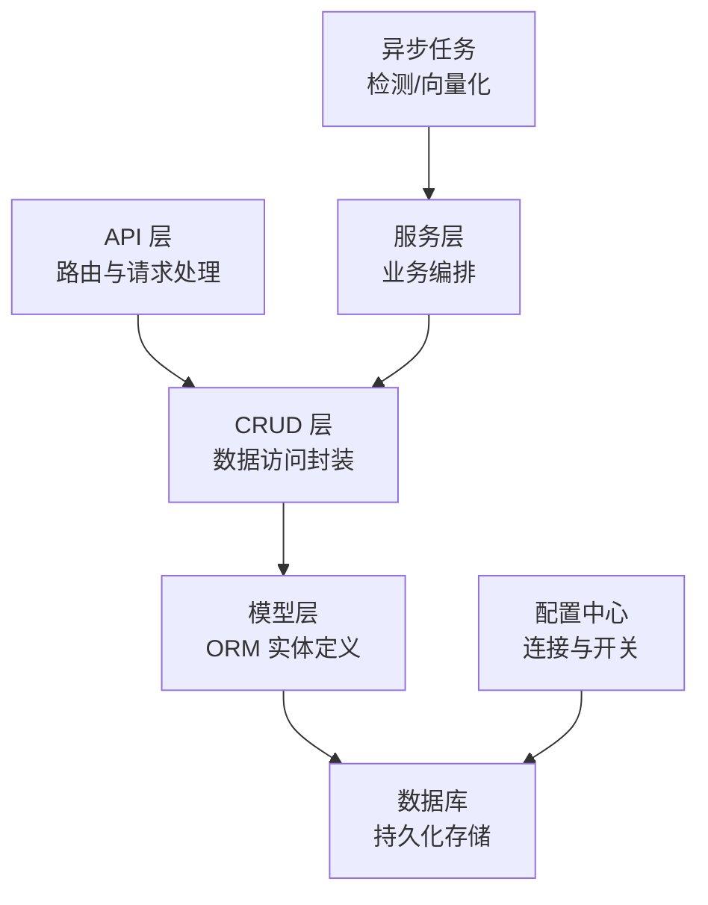
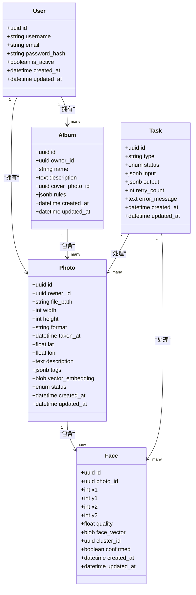
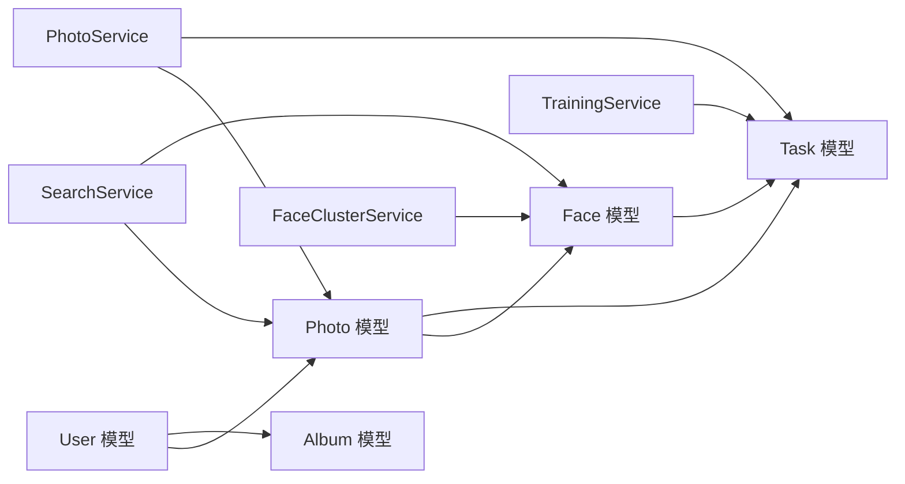

# 数据模型设计

<cite>
**本文引用的文件**   
- [backend/app/models/user.py](file://backend/app/models/user.py)
- [backend/app/models/photo.py](file://backend/app/models/photo.py)
- [backend/app/models/album.py](file://backend/app/models/album.py)
- [backend/app/models/face.py](file://backend/app/models/face.py)
- [backend/app/models/task.py](file://backend/app/models/task.py)
- [backend/app/database/session.py](file://backend/app/database/session.py)
- [backend/app/config/settings.py](file://backend/app/config/settings.py)
- [backend/app/crud/user.py](file://backend/app/crud/user.py)
- [backend/app/crud/photo.py](file://backend/app/crud/photo.py)
- [backend/app/crud/album.py](file://backend/app/crud/album.py)
- [backend/app/crud/task.py](file://backend/app/crud/task.py)
- [backend/app/api/auth.py](file://backend/app/api/auth.py)
- [backend/app/api/photo.py](file://backend/app/api/photo.py)
- [backend/app/api/album.py](file://backend/app/api/album.py)
- [backend/app/api/face.py](file://backend/app/api/face.py)
- [backend/app/api/tasks.py](file://backend/app/api/tasks.py)
- [backend/app/services/photo_service.py](file://backend/app/services/photo_service.py)
- [backend/app/services/face_cluster_service.py](file://backend/app/services/face_cluster_service.py)
- [backend/app/services/search_service.py](file://backend/app/services/search_service.py)
- [backend/app/services/training_service.py](file://backend/app/services/training_service.py)
- [backend/app/tasks/detection_tasks.py](file://backend/app/tasks/detection_tasks.py)
- [backend/app/tasks/vector_tasks.py](file://backend/app/tasks/vector_tasks.py)
</cite>

## 目录
1. [简介](#简介)
2. [项目结构](#项目结构)
3. [核心组件](#核心组件)
4. [架构总览](#架构总览)
5. [详细组件分析](#详细组件分析)
6. [依赖关系分析](#依赖关系分析)
7. [性能考虑](#性能考虑)
8. [故障排查指南](#故障排查指南)
9. [结论](#结论)
10. [附录](#附录)

## 简介
本文件面向AI相册系统的数据层，系统性梳理用户、照片、相册、人脸、任务等核心实体的数据模型与关系，说明字段定义、约束条件、索引策略、ORM映射、迁移与版本控制策略、数据访问模式、缓存策略、性能优化建议，以及数据生命周期管理、备份恢复与安全保护措施。文档同时提供ER图与表结构关系图，帮助读者快速理解并落地实施。

## 项目结构
后端采用分层架构：API层负责路由与参数校验，CRUD层封装数据库操作，服务层编排业务逻辑，模型层定义ORM实体，数据库会话与配置位于database与config模块。异步任务用于耗时处理（如检测、向量化）。



图表来源
- [backend/app/api/auth.py](file://backend/app/api/auth.py)
- [backend/app/api/photo.py](file://backend/app/api/photo.py)
- [backend/app/api/album.py](file://backend/app/api/album.py)
- [backend/app/api/face.py](file://backend/app/api/face.py)
- [backend/app/api/tasks.py](file://backend/app/api/tasks.py)
- [backend/app/crud/user.py](file://backend/app/crud/user.py)
- [backend/app/crud/photo.py](file://backend/app/crud/photo.py)
- [backend/app/crud/album.py](file://backend/app/crud/album.py)
- [backend/app/crud/task.py](file://backend/app/crud/task.py)
- [backend/app/models/user.py](file://backend/app/models/user.py)
- [backend/app/models/photo.py](file://backend/app/models/photo.py)
- [backend/app/models/album.py](file://backend/app/models/album.py)
- [backend/app/models/face.py](file://backend/app/models/face.py)
- [backend/app/models/task.py](file://backend/app/models/task.py)
- [backend/app/database/session.py](file://backend/app/database/session.py)
- [backend/app/config/settings.py](file://backend/app/config/settings.py)
- [backend/app/services/photo_service.py](file://backend/app/services/photo_service.py)
- [backend/app/services/face_cluster_service.py](file://backend/app/services/face_cluster_service.py)
- [backend/app/services/search_service.py](file://backend/app/services/search_service.py)
- [backend/app/services/training_service.py](file://backend/app/services/training_service.py)
- [backend/app/tasks/detection_tasks.py](file://backend/app/tasks/detection_tasks.py)
- [backend/app/tasks/vector_tasks.py](file://backend/app/tasks/vector_tasks.py)

章节来源
- [backend/app/database/session.py](file://backend/app/database/session.py)
- [backend/app/config/settings.py](file://backend/app/config/settings.py)

## 核心组件
本节聚焦核心数据模型及其关系，包括用户、照片、相册、人脸、任务等，并给出字段类型、约束与索引策略的说明。

- 用户(User)
  - 主要用途：身份认证、权限控制、头像与元信息。
  - 关键字段：唯一标识、用户名/邮箱、密码哈希、状态、时间戳等。
  - 约束：用户名或邮箱唯一；密码不可明文存储；软删除标记可选。
  - 索引：用户名、邮箱建立唯一索引；常用查询字段建立普通索引。
  - 安全：密码使用强哈希算法；敏感字段加密存储；访问审计日志。

- 照片(Photo)
  - 主要用途：存储图片元数据、路径、EXIF、缩略图、向量等。
  - 关键字段：唯一标识、所属用户、文件路径、尺寸、格式、拍摄时间、地理位置、描述、标签、向量嵌入、状态等。
  - 约束：文件路径唯一或加用户维度唯一；向量维度固定；状态枚举。
  - 索引：用户ID、上传时间、拍摄时间、地理位置、标签、状态；向量检索可借助外部向量库索引。
  - 扩展：支持多分辨率缩略图、原图归档、软删除。

- 相册(Album)
  - 主要用途：对照片进行分组与智能归类。
  - 关键字段：唯一标识、名称、描述、创建者、封面图、成员、规则、统计信息等。
  - 约束：名称在用户维度唯一；成员去重。
  - 索引：创建者、更新时间、标签；关联照片计数可冗余维护。

- 人脸(Face)
  - 主要用途：记录照片中检测到的人脸区域、特征向量、识别结果等。
  - 关键字段：唯一标识、所属照片、边界框、质量分、特征向量、聚类ID、确认状态等。
  - 约束：同一照片内人脸不重叠；特征向量维度固定；聚类ID可空。
  - 索引：照片ID、聚类ID、质量分阈值过滤；向量检索由外部向量库承担。

- 任务(Task)
  - 主要用途：调度与追踪后台作业（检测、向量化、训练等）。
  - 关键字段：唯一标识、类型、状态、输入输出、重试次数、错误信息、时间戳等。
  - 约束：状态机严格流转；幂等键避免重复执行。
  - 索引：类型、状态、创建时间；失败重试队列优先。

章节来源
- [backend/app/models/user.py](file://backend/app/models/user.py)
- [backend/app/models/photo.py](file://backend/app/models/photo.py)
- [backend/app/models/album.py](file://backend/app/models/album.py)
- [backend/app/models/face.py](file://backend/app/models/face.py)
- [backend/app/models/task.py](file://backend/app/models/task.py)

## 架构总览
下图展示数据模型之间的关系及关键流程：用户上传照片后触发检测与向量化任务，生成人脸与向量；相册通过规则或人工方式聚合照片；任务驱动整个流水线。

```mermaid
erDiagram
USER {
uuid id PK
string username UK
string email UK
string password_hash
boolean is_active
timestamp created_at
timestamp updated_at
}
ALBUM {
uuid id PK
uuid owner_id FK
string name
text description
uuid cover_photo_id FK
jsonb rules
timestamp created_at
timestamp updated_at
}
PHOTO {
uuid id PK
uuid owner_id FK
string file_path
int width
int height
string format
timestamp taken_at
float lat
float lon
text description
jsonb tags
blob vector_embedding
enum status
timestamp created_at
timestamp updated_at
}
FACE {
uuid id PK
uuid photo_id FK
int x1
int y1
int x2
int y2
float quality
blob face_vector
uuid cluster_id
boolean confirmed
timestamp created_at
timestamp updated_at
}
TASK {
uuid id PK
string type
enum status
jsonb input
jsonb output
int retry_count
text error_message
timestamp created_at
timestamp updated_at
}
USER ||--o{ ALBUM : "拥有"
USER ||--o{ PHOTO : "拥有"
ALBUM ||--o{ PHOTO : "包含"
PHOTO ||--o{ FACE : "包含"
TASK ..|| PHOTO : "处理"
TASK ..|| FACE : "处理"
```

图表来源
- [backend/app/models/user.py](file://backend/app/models/user.py)
- [backend/app/models/album.py](file://backend/app/models/album.py)
- [backend/app/models/photo.py](file://backend/app/models/photo.py)
- [backend/app/models/face.py](file://backend/app/models/face.py)
- [backend/app/models/task.py](file://backend/app/models/task.py)

## 详细组件分析

### 用户(User)模型
- 职责：用户身份与基础信息，支撑鉴权与会话。
- 字段要点：
  - 主键：全局唯一UUID。
  - 用户名/邮箱：唯一索引，便于登录与找回。
  - 密码哈希：不可逆存储，禁止明文。
  - 状态：启用/禁用，配合权限控制。
  - 时间戳：创建与更新时间。
- 约束与索引：
  - 用户名、邮箱唯一性约束。
  - 常用查询字段建立索引（如用户名、邮箱、状态）。
- ORM映射：
  - 使用ORM框架声明式定义，映射到对应表名与列名。
  - 密码字段设置不可序列化输出。
- 安全与合规：
  - 密码使用强哈希算法（如bcrypt/argon2）。
  - 敏感信息脱敏输出。
  - 访问审计日志记录关键操作。

章节来源
- [backend/app/models/user.py](file://backend/app/models/user.py)
- [backend/app/crud/user.py](file://backend/app/crud/user.py)
- [backend/app/api/auth.py](file://backend/app/api/auth.py)

### 照片(Photo)模型
- 职责：承载图片元数据、位置、描述、标签、向量等。
- 字段要点：
  - 主键：全局唯一UUID。
  - 所有者：外键指向用户。
  - 文件路径：指向对象存储或本地路径。
  - 尺寸与格式：宽、高、MIME类型。
  - 拍摄时间与地理位置：支持地图视图与时间线。
  - 描述与标签：文本与JSON数组，便于搜索与筛选。
  - 向量嵌入：用于相似检索，通常存于向量库，此处保留引用或短向量。
  - 状态：待处理/已处理/失败等。
- 约束与索引：
  - 用户+文件路径组合唯一，防止重复上传。
  - 索引：用户ID、上传时间、拍摄时间、地理位置、标签、状态。
  - 大字段（如向量）考虑外部存储或压缩。
- 数据流：
  - 上传后进入待处理状态，触发检测与向量化任务。
  - 成功后更新状态与元数据。

章节来源
- [backend/app/models/photo.py](file://backend/app/models/photo.py)
- [backend/app/crud/photo.py](file://backend/app/crud/photo.py)
- [backend/app/api/photo.py](file://backend/app/api/photo.py)
- [backend/app/services/photo_service.py](file://backend/app/services/photo_service.py)
- [backend/app/tasks/detection_tasks.py](file://backend/app/tasks/detection_tasks.py)
- [backend/app/tasks/vector_tasks.py](file://backend/app/tasks/vector_tasks.py)

### 相册(Album)模型
- 职责：组织照片集合，支持规则与封面。
- 字段要点：
  - 主键：全局唯一UUID。
  - 所有者：外键指向用户。
  - 名称与描述：可读性与SEO友好。
  - 封面图：外键指向某张照片。
  - 规则：JSON结构，定义自动加入条件（如标签、时间范围、地点）。
  - 统计信息：照片数量、最近更新时间（可冗余维护）。
- 约束与索引：
  - 用户+名称唯一。
  - 索引：所有者、更新时间、标签。
- 数据流：
  - 手动创建或基于规则自动聚合。
  - 变更时更新统计与封面。

章节来源
- [backend/app/models/album.py](file://backend/app/models/album.py)
- [backend/app/crud/album.py](file://backend/app/crud/album.py)
- [backend/app/api/album.py](file://backend/app/api/album.py)

### 人脸(Face)模型
- 职责：记录人脸检测与识别结果。
- 字段要点：
  - 主键：全局唯一UUID。
  - 所属照片：外键指向照片。
  - 边界框：x1,y1,x2,y2像素坐标。
  - 质量分：用于过滤低质量人脸。
  - 人脸向量：用于匹配与聚类，建议存于向量库。
  - 聚类ID：将同一个人不同照片的人脸归为一类。
  - 确认状态：人工确认后提升可信度。
- 约束与索引：
  - 照片ID索引；聚类ID索引；质量分阈值过滤。
  - 同一照片内人脸不重叠的业务约束。
- 数据流：
  - 检测任务生成人脸记录。
  - 聚类服务根据向量合并人脸。
  - 用户确认后可用于搜索与推荐。

章节来源
- [backend/app/models/face.py](file://backend/app/models/face.py)
- [backend/app/services/face_cluster_service.py](file://backend/app/services/face_cluster_service.py)
- [backend/app/api/face.py](file://backend/app/api/face.py)

### 任务(Task)模型
- 职责：统一调度与追踪后台作业。
- 字段要点：
  - 主键：全局唯一UUID。
  - 类型：检测、向量化、训练等。
  - 状态：待处理/进行中/成功/失败。
  - 输入输出：JSON结构，记录参数与结果。
  - 重试次数与错误信息：用于重试与排障。
  - 时间戳：创建与更新时间。
- 约束与索引：
  - 状态机严格流转。
  - 索引：类型、状态、创建时间。
- 数据流：
  - API或服务层创建任务。
  - 任务队列消费并更新状态。
  - 失败任务按策略重试或告警。

章节来源
- [backend/app/models/task.py](file://backend/app/models/task.py)
- [backend/app/crud/task.py](file://backend/app/crud/task.py)
- [backend/app/api/tasks.py](file://backend/app/api/tasks.py)

### 数据模型类图


图表来源
- [backend/app/models/user.py](file://backend/app/models/user.py)
- [backend/app/models/album.py](file://backend/app/models/album.py)
- [backend/app/models/photo.py](file://backend/app/models/photo.py)
- [backend/app/models/face.py](file://backend/app/models/face.py)
- [backend/app/models/task.py](file://backend/app/models/task.py)

## 依赖关系分析
- 模型依赖：Photo依赖User与Album；Face依赖Photo；Task为通用作业实体，与Photo/Face存在逻辑关联。
- 服务依赖：PhotoService协调上传、检测、向量化；FaceClusterService负责聚类；SearchService利用向量与标签检索；TrainingService管理模型训练。
- 任务依赖：DetectionTasks与VectorTasks分别处理检测与向量化，更新相应模型状态。



图表来源
- [backend/app/models/user.py](file://backend/app/models/user.py)
- [backend/app/models/photo.py](file://backend/app/models/photo.py)
- [backend/app/models/album.py](file://backend/app/models/album.py)
- [backend/app/models/face.py](file://backend/app/models/face.py)
- [backend/app/models/task.py](file://backend/app/models/task.py)
- [backend/app/services/photo_service.py](file://backend/app/services/photo_service.py)
- [backend/app/services/face_cluster_service.py](file://backend/app/services/face_cluster_service.py)
- [backend/app/services/search_service.py](file://backend/app/services/search_service.py)
- [backend/app/services/training_service.py](file://backend/app/services/training_service.py)

章节来源
- [backend/app/services/photo_service.py](file://backend/app/services/photo_service.py)
- [backend/app/services/face_cluster_service.py](file://backend/app/services/face_cluster_service.py)
- [backend/app/services/search_service.py](file://backend/app/services/search_service.py)
- [backend/app/services/training_service.py](file://backend/app/services/training_service.py)

## 性能考虑
- 索引策略
  - 高频查询字段建立索引：用户ID、时间、标签、状态、地理位置。
  - 复合索引：用户+时间、用户+标签、用户+状态。
  - 向量检索：使用专用向量库（如Milvus、Faiss、pgvector），避免在大表中直接做向量计算。
- 读写分离与缓存
  - 读多写少场景引入缓存（Redis）：相册列表、热门照片、搜索结果。
  - 缓存失效策略：基于版本号或事件驱动更新。
- 批处理与分页
  - 批量插入与更新，减少事务开销。
  - 游标分页替代偏移分页，提高大数据集性能。
- 存储优化
  - 大字段（向量、缩略图）外置存储或压缩。
  - 冷热分层：近期照片热存储，历史照片冷归档。
- 任务队列
  - 使用消息队列解耦耗时任务，保障吞吐与稳定性。
  - 任务幂等与重试退避，避免雪崩。

[本节为通用性能指导，无需特定文件来源]

## 故障排查指南
- 常见问题定位
  - 任务失败：检查Task模型的错误信息与重试次数，查看任务队列日志。
  - 人脸检测异常：核对Photo状态与Face质量分阈值，验证输入图像格式与尺寸。
  - 向量检索慢：检查向量库健康与索引重建状态，评估相似度阈值与召回数。
- 监控与告警
  - 指标：任务成功率、平均处理时长、队列积压、错误率。
  - 告警：连续失败、超时、资源不足。
- 回滚与恢复
  - 数据库快照与增量备份结合。
  - 任务幂等键确保重复执行不破坏一致性。

章节来源
- [backend/app/models/task.py](file://backend/app/models/task.py)
- [backend/app/models/photo.py](file://backend/app/models/photo.py)
- [backend/app/models/face.py](file://backend/app/models/face.py)

## 结论
本数据模型围绕用户、照片、相册、人脸、任务五大核心实体构建，形成清晰的关系与流程。通过合理的索引、缓存与任务队列策略，兼顾性能与可扩展性。建议在工程实践中完善迁移与版本控制、备份恢复与安全加固，持续提升系统的可靠性与安全性。

[本节为总结性内容，无需特定文件来源]

## 附录

### 数据迁移管理与版本控制策略
- 迁移工具：使用ORM提供的迁移工具（如Alembic）管理DDL变更。
- 版本控制：每次变更生成独立迁移脚本，提交至代码仓库，保持可追溯。
- 回滚策略：为每个迁移编写反向操作，确保可回滚。
- 灰度发布：先在小规模环境验证，再全量发布。

[本节为通用实践指导，无需特定文件来源]

### 数据访问模式与ORM映射
- 访问模式：API层调用CRUD层，CRUD层通过ORM访问数据库。
- ORM映射：模型类与表一一对应，字段类型与约束在模型中声明。
- 事务管理：写入操作包裹事务，保证一致性。

章节来源
- [backend/app/database/session.py](file://backend/app/database/session.py)
- [backend/app/config/settings.py](file://backend/app/config/settings.py)

### 数据生命周期管理
- 创建：上传照片后创建Photo记录，状态为待处理。
- 处理：检测与向量化任务完成后更新状态与元数据。
- 归档：长期未访问的照片迁移至冷存储。
- 清理：回收站机制与定期清理过期数据。

章节来源
- [backend/app/models/photo.py](file://backend/app/models/photo.py)
- [backend/app/tasks/detection_tasks.py](file://backend/app/tasks/detection_tasks.py)
- [backend/app/tasks/vector_tasks.py](file://backend/app/tasks/vector_tasks.py)

### 备份恢复与数据安全
- 备份：定期全量与增量备份，异地容灾。
- 恢复：演练恢复流程，确保RTO/RPO达标。
- 安全：传输加密（TLS）、存储加密（KMS）、最小权限原则、审计日志。

[本节为通用安全与运维指导，无需特定文件来源]