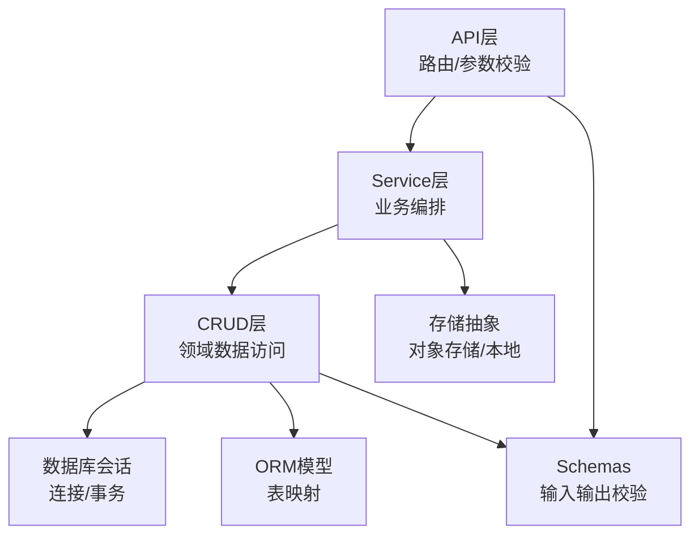
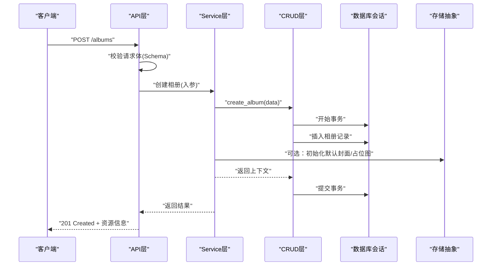
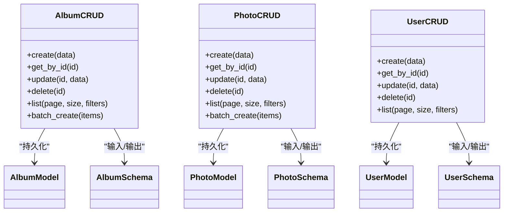
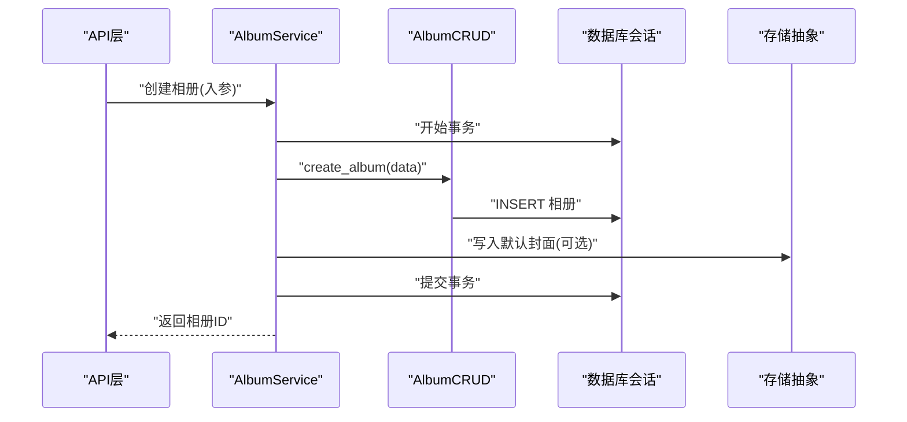
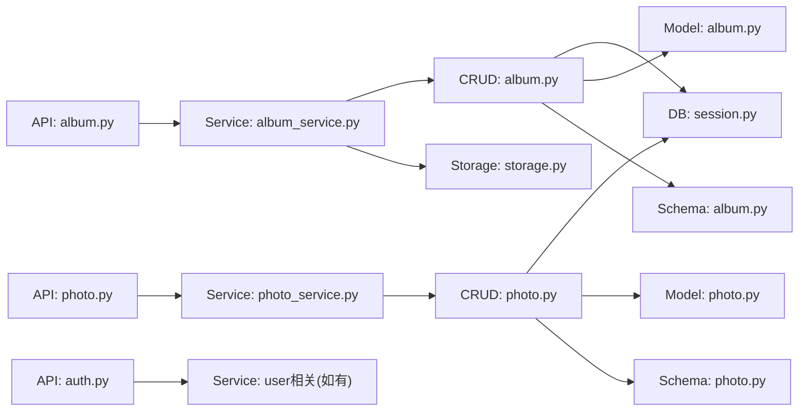

# 数据访问模式

<cite>
**本文引用的文件**   
- [backend/app/database/session.py](file://backend/app/database/session.py)
- [backend/app/database/storage.py](file://backend/app/database/storage.py)
- [backend/app/crud/album.py](file://backend/app/crud/album.py)
- [backend/app/crud/photo.py](file://backend/app/crud/photo.py)
- [backend/app/crud/user.py](file://backend/app/crud/user.py)
- [backend/app/models/album.py](file://backend/app/models/album.py)
- [backend/app/models/photo.py](file://backend/app/models/photo.py)
- [backend/app/models/user.py](file://backend/app/models/user.py)
- [backend/app/schemas/album.py](file://backend/app/schemas/album.py)
- [backend/app/schemas/photo.py](file://backend/app/schemas/photo.py)
- [backend/app/schemas/user.py](file://backend/app/schemas/user.py)
- [backend/app/api/album.py](file://backend/app/api/album.py)
- [backend/app/api/photo.py](file://backend/app/api/photo.py)
- [backend/app/api/auth.py](file://backend/app/api/auth.py)
- [backend/app/services/album_service.py](file://backend/app/services/album_service.py)
- [backend/app/services/photo_service.py](file://backend/app/services/photo_service.py)
- [backend/app/core/exceptions.py](file://backend/app/core/exceptions.py)
- [backend/app/core/logger.py](file://backend/app/core/logger.py)
</cite>

## 目录
1. [简介](#简介)
2. [项目结构](#项目结构)
3. [核心组件](#核心组件)
4. [架构总览](#架构总览)
5. [详细组件分析](#详细组件分析)
6. [依赖关系分析](#依赖关系分析)
7. [性能考虑](#性能考虑)
8. [故障排查指南](#故障排查指南)
9. [结论](#结论)
10. [附录](#附录)

## 简介
本文件聚焦于后端的数据访问模式，围绕CRUD操作、Repository模式、Service层抽象与数据访问对象职责分离展开。文档涵盖事务管理、批量操作、并发控制策略、复杂查询构建、分页处理、结果集映射、缓存策略、查询优化与性能监控，以及错误处理、重试机制和数据一致性保证方案。目标是帮助开发者在现有代码基础上理解并扩展高质量的数据访问实现。

## 项目结构
后端采用分层架构：API层负责HTTP路由与参数校验；Service层封装业务逻辑；CRUD层提供领域实体的数据访问能力；Models/Schemas分别定义ORM模型与请求/响应数据结构；Database层提供会话与存储抽象。

图表来源
- [backend/app/api/album.py](file://backend/app/api/album.py)
- [backend/app/services/album_service.py](file://backend/app/services/album_service.py)
- [backend/app/crud/album.py](file://backend/app/crud/album.py)
- [backend/app/database/session.py](file://backend/app/database/session.py)
- [backend/app/models/album.py](file://backend/app/models/album.py)
- [backend/app/schemas/album.py](file://backend/app/schemas/album.py)
- [backend/app/database/storage.py](file://backend/app/database/storage.py)

章节来源
- [backend/app/api/album.py](file://backend/app/api/album.py)
- [backend/app/services/album_service.py](file://backend/app/services/album_service.py)
- [backend/app/crud/album.py](file://backend/app/crud/album.py)
- [backend/app/database/session.py](file://backend/app/database/session.py)
- [backend/app/models/album.py](file://backend/app/models/album.py)
- [backend/app/schemas/album.py](file://backend/app/schemas/album.py)
- [backend/app/database/storage.py](file://backend/app/database/storage.py)

## 核心组件
- 数据库会话与事务
  - 通过会话管理器提供连接生命周期与事务边界，确保读写一致性与资源释放。
  - 典型用法：在CRUD或Service中开启事务，提交或回滚异常路径。
- CRUD层（Repository）
  - 以领域实体为单位组织方法，如相册、照片、用户等，提供创建、读取、更新、删除、批量操作与复杂查询。
  - 使用ORM模型进行持久化，结合Schemas进行输入输出校验。
- Service层
  - 编排跨实体的业务流程，协调多个CRUD调用，必要时组合外部服务（如向量检索、AI推理）。
- 存储抽象
  - 将媒体文件等非结构化数据与结构化数据解耦，便于替换存储后端。

章节来源
- [backend/app/database/session.py](file://backend/app/database/session.py)
- [backend/app/crud/album.py](file://backend/app/crud/album.py)
- [backend/app/crud/photo.py](file://backend/app/crud/photo.py)
- [backend/app/crud/user.py](file://backend/app/crud/user.py)
- [backend/app/services/album_service.py](file://backend/app/services/album_service.py)
- [backend/app/services/photo_service.py](file://backend/app/services/photo_service.py)
- [backend/app/database/storage.py](file://backend/app/database/storage.py)

## 架构总览
下图展示一次“创建相册”的端到端流程，体现API→Service→CRUD→DB的事务边界与数据流向。

图表来源
- [backend/app/api/album.py](file://backend/app/api/album.py)
- [backend/app/services/album_service.py](file://backend/app/services/album_service.py)
- [backend/app/crud/album.py](file://backend/app/crud/album.py)
- [backend/app/database/session.py](file://backend/app/database/session.py)
- [backend/app/database/storage.py](file://backend/app/database/storage.py)

## 详细组件分析

### 数据访问对象与CRUD模式
- 设计要点
  - 每个领域实体对应一个CRUD模块，方法命名遵循create/read/update/delete/list/batch等语义。
  - 所有写操作应在事务内执行，读操作可无事务或只读事务以提升吞吐。
  - 输入数据由Schemas校验，输出数据转换为响应Schema，避免直接暴露ORM模型。
- 最佳实践
  - 单一职责：CRUD仅关注数据存取，不承载业务编排。
  - 幂等性：对重复写入做去重或条件更新。
  - 批量操作：合并多次写入为单次事务，减少往返开销。
  - 分页：基于游标或偏移的分页接口，限制最大页大小。
  - 复杂查询：使用ORM的组合查询条件与预加载关联，避免N+1。

章节来源
- [backend/app/crud/album.py](file://backend/app/crud/album.py)
- [backend/app/crud/photo.py](file://backend/app/crud/photo.py)
- [backend/app/crud/user.py](file://backend/app/crud/user.py)
- [backend/app/schemas/album.py](file://backend/app/schemas/album.py)
- [backend/app/schemas/photo.py](file://backend/app/schemas/photo.py)
- [backend/app/schemas/user.py](file://backend/app/schemas/user.py)

#### 类关系图（CRUD与模型/Schema）

图表来源
- [backend/app/crud/album.py](file://backend/app/crud/album.py)
- [backend/app/crud/photo.py](file://backend/app/crud/photo.py)
- [backend/app/crud/user.py](file://backend/app/crud/user.py)
- [backend/app/models/album.py](file://backend/app/models/album.py)
- [backend/app/models/photo.py](file://backend/app/models/photo.py)
- [backend/app/models/user.py](file://backend/app/models/user.py)
- [backend/app/schemas/album.py](file://backend/app/schemas/album.py)
- [backend/app/schemas/photo.py](file://backend/app/schemas/photo.py)
- [backend/app/schemas/user.py](file://backend/app/schemas/user.py)

### Service层抽象
- 职责
  - 编排跨CRUD的业务流程，例如创建相册后生成缩略图、索引向量、触发任务队列。
  - 统一异常转换与日志记录，向上层返回稳定的错误码与消息。
- 并发与事务
  - 长耗时任务异步化，避免阻塞请求线程。
  - 关键路径使用事务包裹多步写操作，失败时整体回滚。
- 示例流程（创建相册）
  - 校验输入 → 开启事务 → 创建相册记录 → 可选：写入默认封面 → 提交事务 → 返回结果。

章节来源
- [backend/app/services/album_service.py](file://backend/app/services/album_service.py)
- [backend/app/services/photo_service.py](file://backend/app/services/photo_service.py)
- [backend/app/database/session.py](file://backend/app/database/session.py)

#### 序列图（Service编排）

图表来源
- [backend/app/api/album.py](file://backend/app/api/album.py)
- [backend/app/services/album_service.py](file://backend/app/services/album_service.py)
- [backend/app/crud/album.py](file://backend/app/crud/album.py)
- [backend/app/database/session.py](file://backend/app/database/session.py)
- [backend/app/database/storage.py](file://backend/app/database/storage.py)

### 事务管理与一致性
- 事务边界
  - 写操作必须包裹在事务中，确保原子性。
  - 读操作可使用只读事务提升并发性能。
- 一致性保障
  - 强一致：单库事务。
  - 最终一致：跨系统场景采用事件/任务队列补偿。
- 回滚策略
  - 捕获异常并显式回滚，记录错误上下文。

章节来源
- [backend/app/database/session.py](file://backend/app/database/session.py)
- [backend/app/core/exceptions.py](file://backend/app/core/exceptions.py)

### 批量操作与并发控制
- 批量写入
  - 合并多条记录为批量插入，减少网络往返与锁竞争。
- 并发控制
  - 乐观锁：版本号字段冲突检测。
  - 悲观锁：SELECT FOR UPDATE保护热点行。
  - 分布式锁：针对跨进程/实例的互斥场景。
- 限流与背压
  - 对高吞吐接口增加令牌桶/漏桶限流，防止雪崩。

章节来源
- [backend/app/crud/album.py](file://backend/app/crud/album.py)
- [backend/app/crud/photo.py](file://backend/app/crud/photo.py)

### 复杂查询、分页与结果映射
- 复杂查询
  - 组合过滤条件、排序、聚合与关联预加载，避免N+1问题。
- 分页
  - 支持基于偏移与基于游标的分页，限制最大页大小。
- 结果映射
  - ORM模型到响应Schema的转换，屏蔽内部结构变化。

章节来源
- [backend/app/crud/album.py](file://backend/app/crud/album.py)
- [backend/app/crud/photo.py](file://backend/app/crud/photo.py)
- [backend/app/schemas/album.py](file://backend/app/schemas/album.py)
- [backend/app/schemas/photo.py](file://backend/app/schemas/photo.py)

### 缓存策略与查询优化
- 缓存
  - 读多写少数据使用Redis缓存，设置合理TTL与失效策略。
  - 缓存穿透：布隆过滤器或空值缓存。
  - 缓存击穿：互斥锁重建热点键。
- 查询优化
  - 索引设计：高频过滤/排序字段建索引。
  - 覆盖索引与复合索引减少回表。
  - 慢查询分析与执行计划优化。

章节来源
- [backend/app/crud/album.py](file://backend/app/crud/album.py)
- [backend/app/crud/photo.py](file://backend/app/crud/photo.py)

### 错误处理、重试与监控
- 错误处理
  - 统一异常类型与错误码，区分业务异常与系统异常。
  - 对外返回友好提示，对内记录详细堆栈。
- 重试机制
  - 对瞬时故障（网络抖动、超时）实施指数退避重试。
  - 幂等键避免重复写入。
- 性能监控
  - 指标采集：QPS、延迟分位、错误率、连接池状态。
  - 链路追踪：跨服务请求ID透传。
  - 告警：阈值与趋势异常触发通知。

章节来源
- [backend/app/core/exceptions.py](file://backend/app/core/exceptions.py)
- [backend/app/core/logger.py](file://backend/app/core/logger.py)

## 依赖关系分析

图表来源
- [backend/app/api/album.py](file://backend/app/api/album.py)
- [backend/app/api/photo.py](file://backend/app/api/photo.py)
- [backend/app/api/auth.py](file://backend/app/api/auth.py)
- [backend/app/services/album_service.py](file://backend/app/services/album_service.py)
- [backend/app/services/photo_service.py](file://backend/app/services/photo_service.py)
- [backend/app/crud/album.py](file://backend/app/crud/album.py)
- [backend/app/crud/photo.py](file://backend/app/crud/photo.py)
- [backend/app/database/session.py](file://backend/app/database/session.py)
- [backend/app/models/album.py](file://backend/app/models/album.py)
- [backend/app/models/photo.py](file://backend/app/models/photo.py)
- [backend/app/schemas/album.py](file://backend/app/schemas/album.py)
- [backend/app/schemas/photo.py](file://backend/app/schemas/photo.py)
- [backend/app/database/storage.py](file://backend/app/database/storage.py)

章节来源
- [backend/app/api/album.py](file://backend/app/api/album.py)
- [backend/app/api/photo.py](file://backend/app/api/photo.py)
- [backend/app/api/auth.py](file://backend/app/api/auth.py)
- [backend/app/services/album_service.py](file://backend/app/services/album_service.py)
- [backend/app/services/photo_service.py](file://backend/app/services/photo_service.py)
- [backend/app/crud/album.py](file://backend/app/crud/album.py)
- [backend/app/crud/photo.py](file://backend/app/crud/photo.py)
- [backend/app/database/session.py](file://backend/app/database/session.py)
- [backend/app/models/album.py](file://backend/app/models/album.py)
- [backend/app/models/photo.py](file://backend/app/models/photo.py)
- [backend/app/schemas/album.py](file://backend/app/schemas/album.py)
- [backend/app/schemas/photo.py](file://backend/app/schemas/photo.py)
- [backend/app/database/storage.py](file://backend/app/database/storage.py)

## 性能考虑
- 连接池配置：根据并发与负载调整最大连接数与空闲回收策略。
- 只读副本：读多写少场景分流至从库。
- 批量化：批量插入/更新减少往返。
- 索引优化：按查询模式设计复合索引。
- 缓存命中：热点数据缓存，注意一致性。
- 异步化：非关键路径任务放入队列。
- 监控：采集关键指标并设置告警。

[本节为通用指导，无需源码引用]

## 故障排查指南
- 常见问题
  - 连接泄漏：检查会话关闭与事务提交/回滚路径。
  - 死锁：缩短事务范围，固定加锁顺序。
  - N+1查询：启用预加载或使用JOIN。
  - 缓存不一致：更新路径同步失效或采用版本控制。
- 定位手段
  - 日志：记录关键步骤与异常堆栈。
  - 指标：查看延迟、错误率、连接池使用率。
  - 追踪：通过请求ID串联上下游调用。

章节来源
- [backend/app/core/logger.py](file://backend/app/core/logger.py)
- [backend/app/core/exceptions.py](file://backend/app/core/exceptions.py)

## 结论
本项目采用清晰的分层架构与CRUD/Service职责分离，配合事务管理、批量操作、分页与结果映射，形成稳健的数据访问体系。在此基础上，建议持续完善缓存策略、索引设计与监控告警，并通过异步化与限流提升系统弹性与可用性。

[本节为总结，无需源码引用]

## 附录
- 术语
  - Repository模式：以领域为中心的数据访问抽象。
  - 事务：保证一组操作的原子性与一致性。
  - 幂等：同一请求多次执行效果等同。
- 参考实现位置
  - 会话与事务：[backend/app/database/session.py](file://backend/app/database/session.py)
  - 存储抽象：[backend/app/database/storage.py](file://backend/app/database/storage.py)
  - CRUD示例：[backend/app/crud/album.py](file://backend/app/crud/album.py)、[backend/app/crud/photo.py](file://backend/app/crud/photo.py)、[backend/app/crud/user.py](file://backend/app/crud/user.py)
  - 模型与Schema：[backend/app/models/album.py](file://backend/app/models/album.py)、[backend/app/schemas/album.py](file://backend/app/schemas/album.py) 等
  - API与服务：[backend/app/api/album.py](file://backend/app/api/album.py)、[backend/app/services/album_service.py](file://backend/app/services/album_service.py)