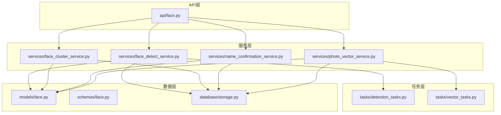
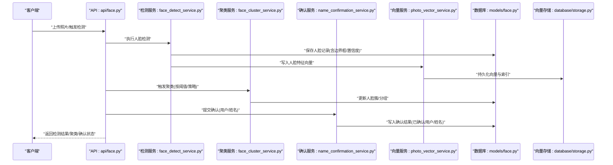
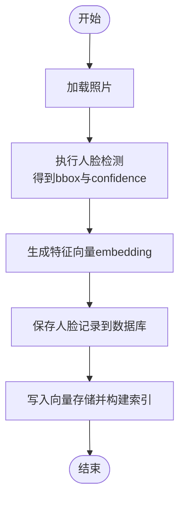
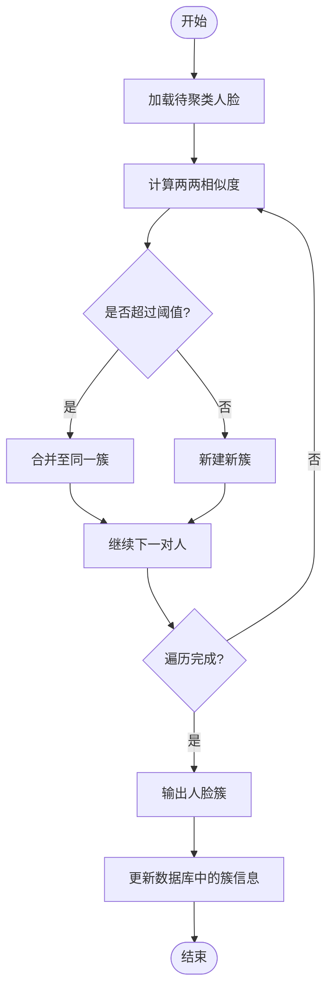
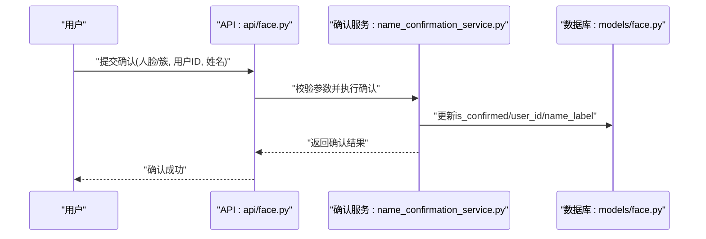
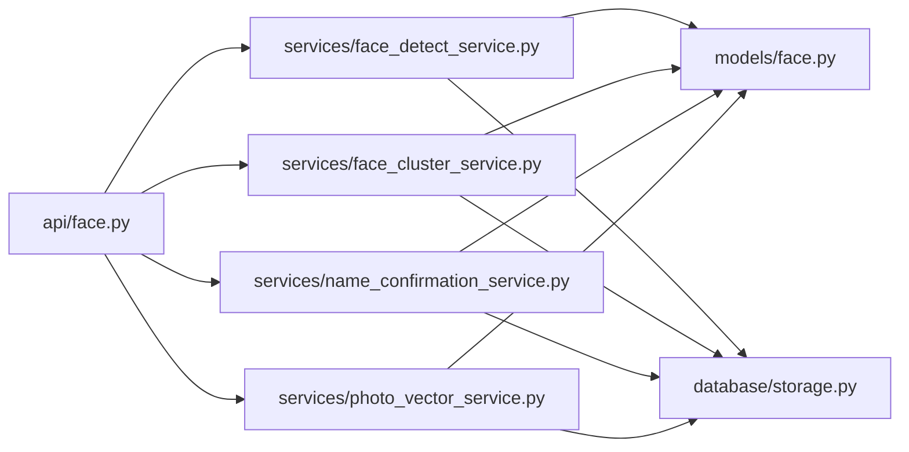
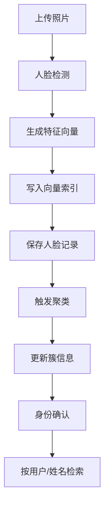

# 人脸模型(Face)

<cite>
**本文引用的文件**   
- [backend/app/models/face.py](file://backend/app/models/face.py)
- [backend/app/schemas/face.py](file://backend/app/schemas/face.py)
- [backend/app/api/face.py](file://backend/app/api/face.py)
- [backend/app/services/face_cluster_service.py](file://backend/app/services/face_cluster_service.py)
- [backend/app/services/name_confirmation_service.py](file://backend/app/services/name_confirmation_service.py)
- [backend/app/services/face_detect_service.py](file://backend/app/services/face_detect_service.py)
- [backend/app/services/photo_vector_service.py](file://backend/app/services/photo_vector_service.py)
- [backend/app/tasks/detection_tasks.py](file://backend/app/tasks/detection_tasks.py)
- [backend/app/tasks/vector_tasks.py](file://backend/app/tasks/vector_tasks.py)
- [backend/app/database/storage.py](file://backend/app/database/storage.py)
</cite>

## 目录
1. [简介](#简介)
2. [项目结构](#项目结构)
3. [核心组件](#核心组件)
4. [架构总览](#架构总览)
5. [详细组件分析](#详细组件分析)
6. [依赖关系分析](#依赖关系分析)
7. [性能考虑](#性能考虑)
8. [故障排查指南](#故障排查指南)
9. [结论](#结论)
10. [附录](#附录)

## 简介
本文件面向AI相册项目中的人脸模型(Face)，系统性阐述Face实体的字段结构、身份确认相关字段、人脸聚类算法的数据结构与流程、特征向量存储与检索优化策略，并提供端到端的数据流程图与操作示例路径。文档旨在帮助开发者快速理解并正确扩展人脸检测、聚类、确认与检索能力。

## 项目结构
围绕人脸功能的核心代码分布在以下模块：
- 数据模型与接口定义：models/face.py、schemas/face.py
- API层：api/face.py
- 业务服务：services/face_cluster_service.py、services/name_confirmation_service.py、services/face_detect_service.py、services/photo_vector_service.py
- 任务编排：tasks/detection_tasks.py、tasks/vector_tasks.py
- 持久化与向量存储：database/storage.py

图表来源
- [backend/app/api/face.py](file://backend/app/api/face.py)
- [backend/app/services/face_detect_service.py](file://backend/app/services/face_detect_service.py)
- [backend/app/services/face_cluster_service.py](file://backend/app/services/face_cluster_service.py)
- [backend/app/services/name_confirmation_service.py](file://backend/app/services/name_confirmation_service.py)
- [backend/app/services/photo_vector_service.py](file://backend/app/services/photo_vector_service.py)
- [backend/app/tasks/detection_tasks.py](file://backend/app/tasks/detection_tasks.py)
- [backend/app/tasks/vector_tasks.py](file://backend/app/tasks/vector_tasks.py)
- [backend/app/models/face.py](file://backend/app/models/face.py)
- [backend/app/schemas/face.py](file://backend/app/schemas/face.py)
- [backend/app/database/storage.py](file://backend/app/database/storage.py)

章节来源
- [backend/app/models/face.py](file://backend/app/models/face.py)
- [backend/app/schemas/face.py](file://backend/app/schemas/face.py)
- [backend/app/api/face.py](file://backend/app/api/face.py)
- [backend/app/services/face_cluster_service.py](file://backend/app/services/face_cluster_service.py)
- [backend/app/services/name_confirmation_service.py](file://backend/app/services/name_confirmation_service.py)
- [backend/app/services/face_detect_service.py](file://backend/app/services/face_detect_service.py)
- [backend/app/services/photo_vector_service.py](file://backend/app/services/photo_vector_service.py)
- [backend/app/tasks/detection_tasks.py](file://backend/app/tasks/detection_tasks.py)
- [backend/app/tasks/vector_tasks.py](file://backend/app/tasks/vector_tasks.py)
- [backend/app/database/storage.py](file://backend/app/database/storage.py)

## 核心组件
- Face实体（数据库模型）
  - 标识与归属：主键ID、所属照片ID、创建时间等
  - 检测信息：边界框坐标、置信度分数
  - 特征表示：人脸特征向量（用于相似度计算与检索）
  - 身份确认：已确认标识、用户关联、姓名标签等
- 人脸检测服务
  - 负责从图片中检出人脸，生成边界框、置信度与初始特征向量
- 人脸聚类服务
  - 基于特征向量相似度进行分组，输出人脸簇
- 身份确认服务
  - 将人脸簇与用户/姓名标签绑定，支持人工或自动确认
- 向量存储服务
  - 负责特征向量的写入、索引与近似最近邻检索
- API接口
  - 暴露人脸检测、聚类、确认、查询等能力

章节来源
- [backend/app/models/face.py](file://backend/app/models/face.py)
- [backend/app/schemas/face.py](file://backend/app/schemas/face.py)
- [backend/app/services/face_detect_service.py](file://backend/app/services/face_detect_service.py)
- [backend/app/services/face_cluster_service.py](file://backend/app/services/face_cluster_service.py)
- [backend/app/services/name_confirmation_service.py](file://backend/app/services/name_confirmation_service.py)
- [backend/app/services/photo_vector_service.py](file://backend/app/services/photo_vector_service.py)
- [backend/app/api/face.py](file://backend/app/api/face.py)

## 架构总览
下图展示了从检测到聚类再到确认的完整流程，以及特征向量在向量存储中的读写路径。

图表来源
- [backend/app/api/face.py](file://backend/app/api/face.py)
- [backend/app/services/face_detect_service.py](file://backend/app/services/face_detect_service.py)
- [backend/app/services/face_cluster_service.py](file://backend/app/services/face_cluster_service.py)
- [backend/app/services/name_confirmation_service.py](file://backend/app/services/name_confirmation_service.py)
- [backend/app/services/photo_vector_service.py](file://backend/app/services/photo_vector_service.py)
- [backend/app/models/face.py](file://backend/app/models/face.py)
- [backend/app/database/storage.py](file://backend/app/database/storage.py)

## 详细组件分析

### 人脸实体(Face)字段参考
- 基础标识
  - id：主键，唯一标识一张人脸
  - photo_id：所属照片ID，建立与照片实体的关联
  - created_at：创建时间戳
- 检测信息
  - bbox：边界框坐标，通常包含左上角与右下角坐标或中心点+宽高
  - confidence：置信度分数，反映检测质量
- 特征表示
  - embedding：人脸特征向量，用于相似度计算与检索
- 身份确认
  - is_confirmed：是否已确认
  - user_id：关联的用户ID
  - name_label：姓名标签（文本）
- 其他元数据
  - 可根据需要扩展如版本、来源、处理状态等

说明
- 上述字段均来源于数据模型与Schema定义，确保API请求/响应与数据库表结构一致。
- 边界框坐标格式需与前端渲染保持一致，避免显示错位。
- 特征向量维度应与向量存储配置匹配，保证写入与检索成功。

章节来源
- [backend/app/models/face.py](file://backend/app/models/face.py)
- [backend/app/schemas/face.py](file://backend/app/schemas/face.py)

### 人脸检测与存储流程
- 输入：照片文件或URL
- 步骤
  - 调用检测服务提取人脸区域与置信度
  - 生成特征向量并写入向量存储
  - 落库人脸记录（含bbox、confidence、embedding引用等）
- 输出：人脸列表及元数据

图表来源
- [backend/app/services/face_detect_service.py](file://backend/app/services/face_detect_service.py)
- [backend/app/services/photo_vector_service.py](file://backend/app/services/photo_vector_service.py)
- [backend/app/models/face.py](file://backend/app/models/face.py)
- [backend/app/database/storage.py](file://backend/app/database/storage.py)

章节来源
- [backend/app/services/face_detect_service.py](file://backend/app/services/face_detect_service.py)
- [backend/app/services/photo_vector_service.py](file://backend/app/services/photo_vector_service.py)
- [backend/app/models/face.py](file://backend/app/models/face.py)
- [backend/app/database/storage.py](file://backend/app/database/storage.py)

### 人脸聚类算法数据结构与流程
- 数据结构
  - 人脸节点：包含id、embedding、photo_id、is_confirmed、user_id、name_label等
  - 簇：由相似人脸组成的集合，可附带代表元素（如平均向量或首个成员）
- 相似度计算
  - 使用余弦相似度或欧氏距离衡量embedding接近程度
  - 设定阈值决定是否归入同一簇
- 分组策略
  - 常见策略：单链接/全链接/平均链接；或基于阈值的增量聚类
  - 对未确认人脸优先聚簇，确认后合并或拆分簇

图表来源
- [backend/app/services/face_cluster_service.py](file://backend/app/services/face_cluster_service.py)
- [backend/app/models/face.py](file://backend/app/models/face.py)

章节来源
- [backend/app/services/face_cluster_service.py](file://backend/app/services/face_cluster_service.py)
- [backend/app/models/face.py](file://backend/app/models/face.py)

### 身份确认流程
- 目标：将人脸簇与具体用户/姓名标签绑定，形成可检索的身份
- 步骤
  - 选择某簇或某张人脸
  - 指定用户ID与姓名标签
  - 标记为已确认，并同步更新相关人脸的确认状态
- 影响
  - 后续检索可直接按用户/姓名过滤
  - 可提升推荐与搜索准确率

图表来源
- [backend/app/api/face.py](file://backend/app/api/face.py)
- [backend/app/services/name_confirmation_service.py](file://backend/app/services/name_confirmation_service.py)
- [backend/app/models/face.py](file://backend/app/models/face.py)

章节来源
- [backend/app/api/face.py](file://backend/app/api/face.py)
- [backend/app/services/name_confirmation_service.py](file://backend/app/services/name_confirmation_service.py)
- [backend/app/models/face.py](file://backend/app/models/face.py)

### 特征向量存储与检索优化
- 存储格式
  - embedding为固定维度的浮点数组，建议标准化以提升相似度稳定性
- 索引与检索
  - 采用近似最近邻(ANN)索引，支持高维向量快速召回
  - 设置合适的top_k与相似度阈值以平衡召回率与精度
- 写入与更新
  - 批量写入减少IO开销
  - 更新时先删除旧索引再插入新向量，保持一致性
- 监控与调优
  - 监控索引大小、查询延迟与召回质量
  - 根据数据分布调整阈值与索引参数

章节来源
- [backend/app/services/photo_vector_service.py](file://backend/app/services/photo_vector_service.py)
- [backend/app/database/storage.py](file://backend/app/database/storage.py)

### 任务编排与异步处理
- 检测任务
  - 将耗时的人脸检测与嵌入计算放入队列，避免阻塞API
- 向量任务
  - 异步写入向量索引，提高吞吐
- 调度器
  - 统一管理与重试机制，保障可靠性

章节来源
- [backend/app/tasks/detection_tasks.py](file://backend/app/tasks/detection_tasks.py)
- [backend/app/tasks/vector_tasks.py](file://backend/app/tasks/vector_tasks.py)

## 依赖关系分析
- 耦合关系
  - API层依赖各服务层，服务层依赖模型与存储
  - 任务层解耦耗时逻辑，降低API延迟
- 外部依赖
  - 向量存储提供ANN能力
  - 数据库提供结构化数据持久化

图表来源
- [backend/app/api/face.py](file://backend/app/api/face.py)
- [backend/app/services/face_detect_service.py](file://backend/app/services/face_detect_service.py)
- [backend/app/services/face_cluster_service.py](file://backend/app/services/face_cluster_service.py)
- [backend/app/services/name_confirmation_service.py](file://backend/app/services/name_confirmation_service.py)
- [backend/app/services/photo_vector_service.py](file://backend/app/services/photo_vector_service.py)
- [backend/app/models/face.py](file://backend/app/models/face.py)
- [backend/app/database/storage.py](file://backend/app/database/storage.py)

章节来源
- [backend/app/api/face.py](file://backend/app/api/face.py)
- [backend/app/services/face_detect_service.py](file://backend/app/services/face_detect_service.py)
- [backend/app/services/face_cluster_service.py](file://backend/app/services/face_cluster_service.py)
- [backend/app/services/name_confirmation_service.py](file://backend/app/services/name_confirmation_service.py)
- [backend/app/services/photo_vector_service.py](file://backend/app/services/photo_vector_service.py)
- [backend/app/models/face.py](file://backend/app/models/face.py)
- [backend/app/database/storage.py](file://backend/app/database/storage.py)

## 性能考虑
- 批量处理：检测与向量写入尽量批量化，减少往返次数
- 索引调优：根据数据规模与查询延迟要求调整ANN参数
- 缓存策略：热点人脸或簇的元数据可短期缓存
- 资源隔离：将CPU密集的检测与I/O密集的向量写入分离到不同进程/线程
- 监控告警：关注失败率、延迟与索引健康度

[本节为通用指导，不直接分析具体文件]

## 故障排查指南
- 常见问题
  - 边界框异常：检查坐标格式与图像尺寸换算
  - 置信度过低：调整检测阈值或更换模型
  - 聚类效果差：调整相似度阈值或重新训练嵌入模型
  - 确认失败：校验用户ID与权限，检查事务一致性
- 定位方法
  - 查看任务日志与错误堆栈
  - 核对向量索引是否存在与可读
  - 验证数据库约束与外键关系

章节来源
- [backend/app/tasks/detection_tasks.py](file://backend/app/tasks/detection_tasks.py)
- [backend/app/tasks/vector_tasks.py](file://backend/app/tasks/vector_tasks.py)
- [backend/app/database/storage.py](file://backend/app/database/storage.py)

## 结论
Face模型贯穿检测、聚类、确认与检索全流程。通过清晰的字段设计、合理的聚类策略与高效的向量检索，系统可实现稳定的人脸识别与身份管理。建议在工程实践中持续监控关键指标，并根据业务需求迭代阈值与索引参数。

[本节为总结性内容，不直接分析具体文件]

## 附录

### 人脸检测结果的存储示例路径
- 入口：调用API触发检测
- 实现：检测服务生成人脸记录并写入数据库与向量存储
- 参考路径
  - [backend/app/api/face.py](file://backend/app/api/face.py)
  - [backend/app/services/face_detect_service.py](file://backend/app/services/face_detect_service.py)
  - [backend/app/models/face.py](file://backend/app/models/face.py)
  - [backend/app/database/storage.py](file://backend/app/database/storage.py)

### 人脸聚类过程示例路径
- 入口：触发聚类任务
- 实现：计算相似度并按阈值分组，更新数据库
- 参考路径
  - [backend/app/api/face.py](file://backend/app/api/face.py)
  - [backend/app/services/face_cluster_service.py](file://backend/app/services/face_cluster_service.py)
  - [backend/app/models/face.py](file://backend/app/models/face.py)

### 身份确认流程示例路径
- 入口：提交确认请求
- 实现：更新人脸的确认状态与用户/姓名标签
- 参考路径
  - [backend/app/api/face.py](file://backend/app/api/face.py)
  - [backend/app/services/name_confirmation_service.py](file://backend/app/services/name_confirmation_service.py)
  - [backend/app/models/face.py](file://backend/app/models/face.py)

### 人脸识别数据流程图

图表来源
- [backend/app/api/face.py](file://backend/app/api/face.py)
- [backend/app/services/face_detect_service.py](file://backend/app/services/face_detect_service.py)
- [backend/app/services/face_cluster_service.py](file://backend/app/services/face_cluster_service.py)
- [backend/app/services/name_confirmation_service.py](file://backend/app/services/name_confirmation_service.py)
- [backend/app/services/photo_vector_service.py](file://backend/app/services/photo_vector_service.py)
- [backend/app/models/face.py](file://backend/app/models/face.py)
- [backend/app/database/storage.py](file://backend/app/database/storage.py)