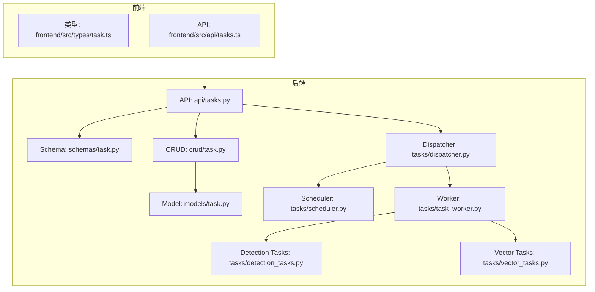
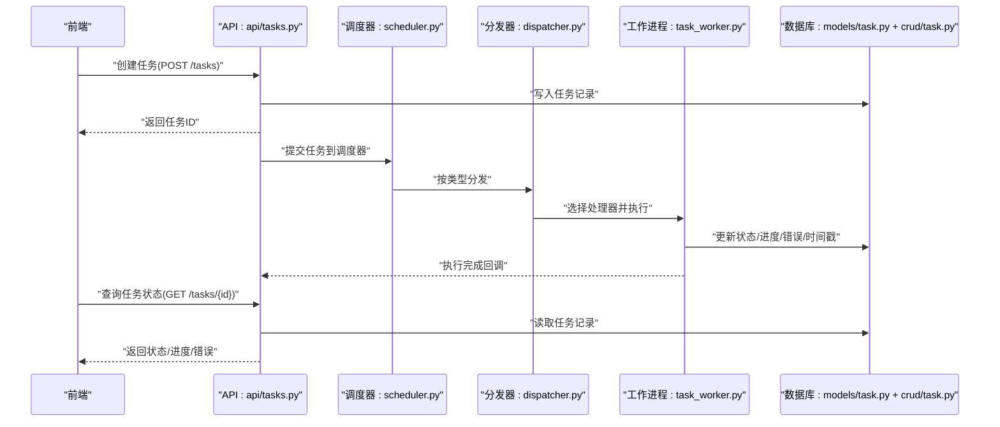
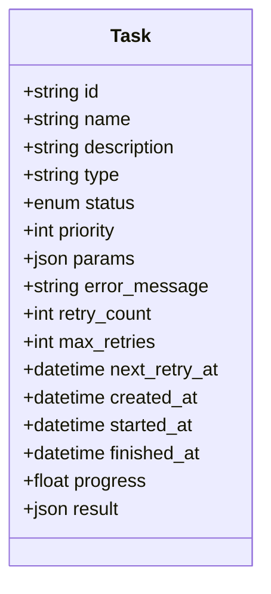
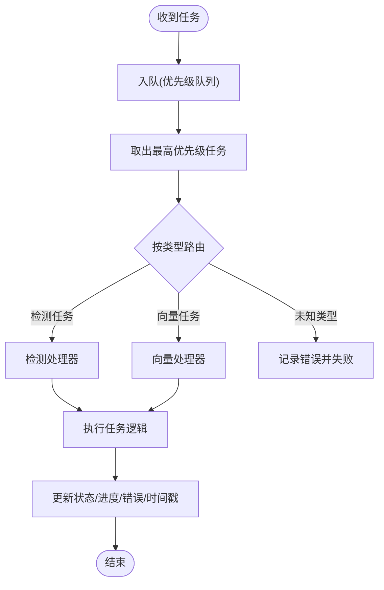
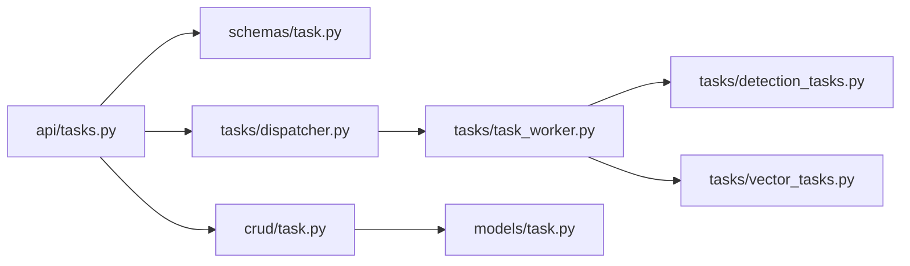
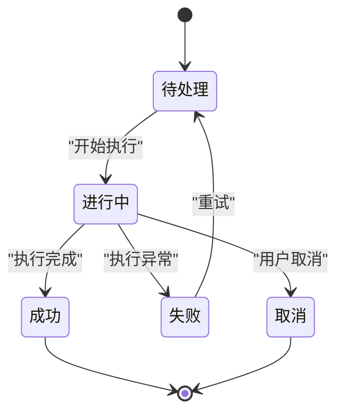

# 任务模型(Task)

<cite>
**本文引用的文件**   
- [backend/app/models/task.py](file://backend/app/models/task.py)
- [backend/app/schemas/task.py](file://backend/app/schemas/task.py)
- [backend/app/crud/task.py](file://backend/app/crud/task.py)
- [backend/app/api/tasks.py](file://backend/app/api/tasks.py)
- [backend/app/tasks/dispatcher.py](file://backend/app/tasks/dispatcher.py)
- [backend/app/tasks/scheduler.py](file://backend/app/tasks/scheduler.py)
- [backend/app/tasks/task_worker.py](file://backend/app/tasks/task_worker.py)
- [backend/app/tasks/detection_tasks.py](file://backend/app/tasks/detection_tasks.py)
- [backend/app/tasks/vector_tasks.py](file://backend/app/tasks/vector_tasks.py)
- [frontend/src/types/task.ts](file://frontend/src/types/task.ts)
- [frontend/src/api/tasks.ts](file://frontend/src/api/tasks.ts)
</cite>

## 目录
1. [简介](#简介)
2. [项目结构](#项目结构)
3. [核心组件](#核心组件)
4. [架构总览](#架构总览)
5. [详细组件分析](#详细组件分析)
6. [依赖关系分析](#依赖关系分析)
7. [性能考虑](#性能考虑)
8. [故障排查指南](#故障排查指南)
9. [结论](#结论)
10. [附录](#附录)

## 简介
本文件围绕“任务模型(Task)”进行系统化文档化，覆盖实体字段定义、生命周期状态、参数与错误记录、重试机制、异步队列与进度跟踪设计，以及前端类型与API交互。同时提供任务创建、调度、执行监控、错误处理的端到端流程说明，并给出任务类型的扩展机制与自定义任务的实现方式。文末包含完整的字段参考表与任务状态转换图，便于快速查阅与落地实践。

## 项目结构
与任务模型相关的后端代码主要分布在以下模块：
- 数据模型与数据库映射：models/task.py
- API 请求/响应模式：schemas/task.py
- 持久化操作（CRUD）：crud/task.py
- HTTP 接口层：api/tasks.py
- 任务分发与调度：tasks/dispatcher.py、tasks/scheduler.py
- 任务工作进程与具体任务实现：tasks/task_worker.py、tasks/detection_tasks.py、tasks/vector_tasks.py
- 前端类型与API封装：frontend/src/types/task.ts、frontend/src/api/tasks.ts

图表来源
- [backend/app/api/tasks.py](file://backend/app/api/tasks.py)
- [backend/app/schemas/task.py](file://backend/app/schemas/task.py)
- [backend/app/crud/task.py](file://backend/app/crud/task.py)
- [backend/app/models/task.py](file://backend/app/models/task.py)
- [backend/app/tasks/dispatcher.py](file://backend/app/tasks/dispatcher.py)
- [backend/app/tasks/scheduler.py](file://backend/app/tasks/scheduler.py)
- [backend/app/tasks/task_worker.py](file://backend/app/tasks/task_worker.py)
- [backend/app/tasks/detection_tasks.py](file://backend/app/tasks/detection_tasks.py)
- [backend/app/tasks/vector_tasks.py](file://backend/app/tasks/vector_tasks.py)
- [frontend/src/types/task.ts](file://frontend/src/types/task.ts)
- [frontend/src/api/tasks.ts](file://frontend/src/api/tasks.ts)

章节来源
- [backend/app/models/task.py](file://backend/app/models/task.py)
- [backend/app/schemas/task.py](file://backend/app/schemas/task.py)
- [backend/app/crud/task.py](file://backend/app/crud/task.py)
- [backend/app/api/tasks.py](file://backend/app/api/tasks.py)
- [backend/app/tasks/dispatcher.py](file://backend/app/tasks/dispatcher.py)
- [backend/app/tasks/scheduler.py](file://backend/app/tasks/scheduler.py)
- [backend/app/tasks/task_worker.py](file://backend/app/tasks/task_worker.py)
- [backend/app/tasks/detection_tasks.py](file://backend/app/tasks/detection_tasks.py)
- [backend/app/tasks/vector_tasks.py](file://backend/app/tasks/vector_tasks.py)
- [frontend/src/types/task.ts](file://frontend/src/types/task.ts)
- [frontend/src/api/tasks.ts](file://frontend/src/api/tasks.ts)

## 核心组件
- 任务模型（Task 实体）：定义任务的核心字段，包括任务标识、类型、状态、优先级、参数、错误信息、重试计数、时间戳等。
- 任务模式（Schema）：用于API层的输入输出校验与序列化。
- 任务CRUD：负责任务的持久化读写。
- 任务API：暴露HTTP接口，供前端调用以创建、查询、更新任务。
- 任务调度与分发：负责任务的入队、路由到具体处理器、并发控制。
- 任务工作进程：执行具体任务逻辑，维护任务状态与进度。
- 具体任务实现：如检测任务、向量任务等。
- 前端类型与API：定义任务相关的数据结构与API调用封装。

章节来源
- [backend/app/models/task.py](file://backend/app/models/task.py)
- [backend/app/schemas/task.py](file://backend/app/schemas/task.py)
- [backend/app/crud/task.py](file://backend/app/crud/task.py)
- [backend/app/api/tasks.py](file://backend/app/api/tasks.py)
- [backend/app/tasks/dispatcher.py](file://backend/app/tasks/dispatcher.py)
- [backend/app/tasks/scheduler.py](file://backend/app/tasks/scheduler.py)
- [backend/app/tasks/task_worker.py](file://backend/app/tasks/task_worker.py)
- [backend/app/tasks/detection_tasks.py](file://backend/app/tasks/detection_tasks.py)
- [backend/app/tasks/vector_tasks.py](file://backend/app/tasks/vector_tasks.py)
- [frontend/src/types/task.ts](file://frontend/src/types/task.ts)
- [frontend/src/api/tasks.ts](file://frontend/src/api/tasks.ts)

## 架构总览
任务从前端发起，经后端API进入调度器，由分发器路由至具体任务处理器，工作进程执行并更新任务状态与进度，最终通过API返回结果或状态给前端。

图表来源
- [backend/app/api/tasks.py](file://backend/app/api/tasks.py)
- [backend/app/tasks/scheduler.py](file://backend/app/tasks/scheduler.py)
- [backend/app/tasks/dispatcher.py](file://backend/app/tasks/dispatcher.py)
- [backend/app/tasks/task_worker.py](file://backend/app/tasks/task_worker.py)
- [backend/app/models/task.py](file://backend/app/models/task.py)
- [backend/app/crud/task.py](file://backend/app/crud/task.py)

## 详细组件分析

### 任务模型（Task 实体）
- 标识与元信息
  - 任务ID：唯一标识
  - 任务名称/描述：可读性信息
  - 任务类型：区分不同处理逻辑（如检测、向量化等）
- 状态与生命周期
  - 状态：如待处理、进行中、成功、失败、取消等
  - 优先级：影响调度顺序
  - 创建时间、开始执行时间、完成时间：关键时间点
- 参数与上下文
  - 任务参数：JSON或结构化配置，承载业务所需输入
  - 外部资源引用：如图片ID、相册ID等
- 错误与重试
  - 错误信息：最后一次失败的错误详情
  - 重试次数/最大重试次数：控制重试策略
  - 下次重试时间：用于延迟重试
- 进度与结果
  - 进度百分比或步骤信息
  - 结果数据：处理后的产物或摘要

图表来源
- [backend/app/models/task.py](file://backend/app/models/task.py)

章节来源
- [backend/app/models/task.py](file://backend/app/models/task.py)

### 任务模式（Schema）
- 输入模式：用于创建/更新任务时的参数校验
- 输出模式：用于API响应的字段过滤与序列化
- 枚举与约束：对状态、类型、优先级等进行限定

章节来源
- [backend/app/schemas/task.py](file://backend/app/schemas/task.py)

### 任务CRUD
- 创建任务：生成ID、设置初始状态与时间戳
- 查询任务：支持按状态、类型、时间范围筛选
- 更新任务：原子更新状态、进度、错误、时间戳
- 删除任务：软删除或硬删除策略

章节来源
- [backend/app/crud/task.py](file://backend/app/crud/task.py)

### 任务API
- 创建任务：接收参数，持久化后入队
- 查询任务：返回当前状态、进度、错误信息
- 批量操作：批量查询、批量取消
- 权限与鉴权：根据系统安全策略限制访问

章节来源
- [backend/app/api/tasks.py](file://backend/app/api/tasks.py)

### 任务调度与分发
- 调度器
  - 任务入队：接收API提交的待执行任务
  - 优先级队列：按优先级与等待时间排序
  - 定时触发：支持延迟执行与周期性任务
- 分发器
  - 类型路由：根据任务类型选择处理器
  - 处理器注册：动态加载具体任务实现
  - 并发控制：限制并行度，避免过载

图表来源
- [backend/app/tasks/scheduler.py](file://backend/app/tasks/scheduler.py)
- [backend/app/tasks/dispatcher.py](file://backend/app/tasks/dispatcher.py)
- [backend/app/tasks/task_worker.py](file://backend/app/tasks/task_worker.py)

章节来源
- [backend/app/tasks/scheduler.py](file://backend/app/tasks/scheduler.py)
- [backend/app/tasks/dispatcher.py](file://backend/app/tasks/dispatcher.py)
- [backend/app/tasks/task_worker.py](file://backend/app/tasks/task_worker.py)

### 具体任务实现
- 检测任务：图像/人脸检测、标注等
- 向量任务：特征提取、索引构建等
- 任务间依赖：可组合多个子任务形成流水线

章节来源
- [backend/app/tasks/detection_tasks.py](file://backend/app/tasks/detection_tasks.py)
- [backend/app/tasks/vector_tasks.py](file://backend/app/tasks/vector_tasks.py)

### 前端类型与API
- 类型定义：任务ID、类型、状态、进度、错误信息等
- API封装：创建、查询、轮询状态、取消任务
- UI展示：任务列表、进度条、错误提示

章节来源
- [frontend/src/types/task.ts](file://frontend/src/types/task.ts)
- [frontend/src/api/tasks.ts](file://frontend/src/api/tasks.ts)

## 依赖关系分析
- 低耦合高内聚：API层仅依赖Schema与CRUD；调度与分发解耦于具体任务实现
- 可扩展性：通过分发器的处理器注册机制，新增任务类型无需修改核心调度逻辑
- 外部依赖：数据库、消息队列（可选）、存储系统（如对象存储）

图表来源
- [backend/app/api/tasks.py](file://backend/app/api/tasks.py)
- [backend/app/schemas/task.py](file://backend/app/schemas/task.py)
- [backend/app/crud/task.py](file://backend/app/crud/task.py)
- [backend/app/tasks/dispatcher.py](file://backend/app/tasks/dispatcher.py)
- [backend/app/tasks/task_worker.py](file://backend/app/tasks/task_worker.py)
- [backend/app/tasks/detection_tasks.py](file://backend/app/tasks/detection_tasks.py)
- [backend/app/tasks/vector_tasks.py](file://backend/app/tasks/vector_tasks.py)
- [backend/app/models/task.py](file://backend/app/models/task.py)

章节来源
- [backend/app/api/tasks.py](file://backend/app/api/tasks.py)
- [backend/app/schemas/task.py](file://backend/app/schemas/task.py)
- [backend/app/crud/task.py](file://backend/app/crud/task.py)
- [backend/app/tasks/dispatcher.py](file://backend/app/tasks/dispatcher.py)
- [backend/app/tasks/task_worker.py](file://backend/app/tasks/task_worker.py)
- [backend/app/tasks/detection_tasks.py](file://backend/app/tasks/detection_tasks.py)
- [backend/app/tasks/vector_tasks.py](file://backend/app/tasks/vector_tasks.py)
- [backend/app/models/task.py](file://backend/app/models/task.py)

## 性能考虑
- 优先级队列：合理设置优先级，避免长尾任务阻塞
- 并发控制：限制工作进程数量，防止资源争用
- 幂等性：确保任务重复执行不会导致副作用
- 进度上报：采用增量更新，减少数据库压力
- 错误重试：指数退避与最大重试上限，避免雪崩

## 故障排查指南
- 常见错误
  - 任务类型未注册：检查分发器处理器注册表
  - 参数校验失败：核对Schema约束与输入格式
  - 数据库写入失败：检查连接与事务
  - 任务超时：调整超时阈值与重试策略
- 日志与追踪
  - 记录关键节点日志：入队、路由、执行、更新
  - 关联任务ID：贯穿前后端链路
- 恢复策略
  - 失败任务重放：基于错误信息与重试次数
  - 人工干预：手动重置状态或清理卡住的任务

章节来源
- [backend/app/api/tasks.py](file://backend/app/api/tasks.py)
- [backend/app/tasks/dispatcher.py](file://backend/app/tasks/dispatcher.py)
- [backend/app/tasks/task_worker.py](file://backend/app/tasks/task_worker.py)
- [backend/app/crud/task.py](file://backend/app/crud/task.py)

## 结论
任务模型以清晰的字段定义与状态机为核心，结合调度与分发机制，实现了可扩展、可观测、可运维的异步任务体系。通过完善的错误记录与重试策略，保障了系统的稳定性与可靠性。前端类型与API封装提升了开发效率与用户体验。

## 附录

### 字段参考表
- 标识与元信息
  - 任务ID：字符串，唯一
  - 任务名称：字符串，可读性
  - 任务描述：字符串，详细说明
  - 任务类型：枚举，如检测、向量等
- 状态与生命周期
  - 状态：枚举，待处理/进行中/成功/失败/取消
  - 优先级：整数，数值越大优先级越高
  - 创建时间：时间戳
  - 开始执行时间：时间戳
  - 完成时间：时间戳
- 参数与上下文
  - 任务参数：JSON，业务输入
  - 外部资源引用：字符串或ID集合
- 错误与重试
  - 错误信息：字符串，最近一次错误详情
  - 重试次数：整数
  - 最大重试次数：整数
  - 下次重试时间：时间戳
- 进度与结果
  - 进度：浮点或步骤信息
  - 结果：JSON，处理产物或摘要

章节来源
- [backend/app/models/task.py](file://backend/app/models/task.py)
- [backend/app/schemas/task.py](file://backend/app/schemas/task.py)

### 任务状态转换图

图表来源
- [backend/app/models/task.py](file://backend/app/models/task.py)

### 操作流程示例（路径指引）
- 创建任务
  - 前端调用：[frontend/src/api/tasks.ts](file://frontend/src/api/tasks.ts)
  - 后端接口：[backend/app/api/tasks.py](file://backend/app/api/tasks.py)
  - 模式校验：[backend/app/schemas/task.py](file://backend/app/schemas/task.py)
  - 持久化：[backend/app/crud/task.py](file://backend/app/crud/task.py)
- 调度与执行
  - 调度器：[backend/app/tasks/scheduler.py](file://backend/app/tasks/scheduler.py)
  - 分发器：[backend/app/tasks/dispatcher.py](file://backend/app/tasks/dispatcher.py)
  - 工作进程：[backend/app/tasks/task_worker.py](file://backend/app/tasks/task_worker.py)
  - 具体任务：[backend/app/tasks/detection_tasks.py](file://backend/app/tasks/detection_tasks.py)、[backend/app/tasks/vector_tasks.py](file://backend/app/tasks/vector_tasks.py)
- 执行监控
  - 查询任务状态：[backend/app/api/tasks.py](file://backend/app/api/tasks.py)
  - 前端类型：[frontend/src/types/task.ts](file://frontend/src/types/task.ts)
- 错误处理
  - 错误记录与重试：[backend/app/tasks/task_worker.py](file://backend/app/tasks/task_worker.py)
  - 状态更新：[backend/app/crud/task.py](file://backend/app/crud/task.py)

章节来源
- [frontend/src/api/tasks.ts](file://frontend/src/api/tasks.ts)
- [backend/app/api/tasks.py](file://backend/app/api/tasks.py)
- [backend/app/schemas/task.py](file://backend/app/schemas/task.py)
- [backend/app/crud/task.py](file://backend/app/crud/task.py)
- [backend/app/tasks/scheduler.py](file://backend/app/tasks/scheduler.py)
- [backend/app/tasks/dispatcher.py](file://backend/app/tasks/dispatcher.py)
- [backend/app/tasks/task_worker.py](file://backend/app/tasks/task_worker.py)
- [backend/app/tasks/detection_tasks.py](file://backend/app/tasks/detection_tasks.py)
- [backend/app/tasks/vector_tasks.py](file://backend/app/tasks/vector_tasks.py)
- [frontend/src/types/task.ts](file://frontend/src/types/task.ts)

### 任务类型扩展机制与自定义任务
- 扩展点
  - 在分发器中注册新的任务类型与处理器
  - 在调度器中配置新类型的路由规则
- 实现步骤
  - 定义任务参数与结果结构（Schema）
  - 编写任务处理器逻辑（Worker）
  - 注册处理器到分发器
  - 在前端类型与API中补充对应字段
- 注意事项
  - 保证幂等性与可重试性
  - 完善错误信息与进度上报
  - 单元测试与集成测试覆盖

章节来源
- [backend/app/tasks/dispatcher.py](file://backend/app/tasks/dispatcher.py)
- [backend/app/tasks/task_worker.py](file://backend/app/tasks/task_worker.py)
- [backend/app/schemas/task.py](file://backend/app/schemas/task.py)
- [frontend/src/types/task.ts](file://frontend/src/types/task.ts)