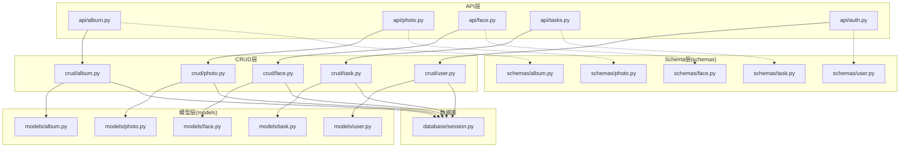
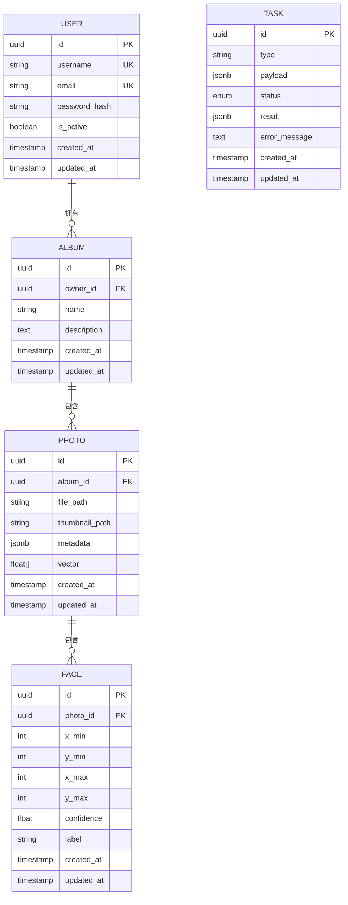
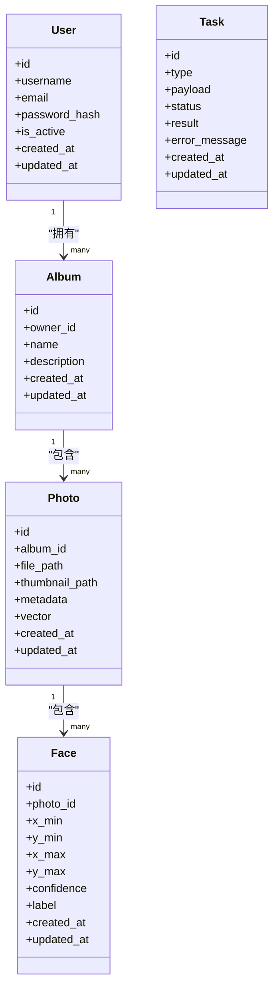

# 核心数据模型

<cite>
**本文引用的文件**   
- [backend/app/models/user.py](file://backend/app/models/user.py)
- [backend/app/models/photo.py](file://backend/app/models/photo.py)
- [backend/app/models/album.py](file://backend/app/models/album.py)
- [backend/app/models/face.py](file://backend/app/models/face.py)
- [backend/app/models/task.py](file://backend/app/models/task.py)
- [backend/app/schemas/user.py](file://backend/app/schemas/user.py)
- [backend/app/schemas/photo.py](file://backend/app/schemas/photo.py)
- [backend/app/schemas/album.py](file://backend/app/schemas/album.py)
- [backend/app/schemas/face.py](file://backend/app/schemas/face.py)
- [backend/app/schemas/task.py](file://backend/app/schemas/task.py)
- [backend/app/crud/user.py](file://backend/app/crud/user.py)
- [backend/app/crud/photo.py](file://backend/app/crud/photo.py)
- [backend/app/crud/album.py](file://backend/app/crud/album.py)
- [backend/app/crud/task.py](file://backend/app/crud/task.py)
- [backend/app/database/session.py](file://backend/app/database/session.py)
</cite>

## 目录
1. [简介](#简介)
2. [项目结构](#项目结构)
3. [核心组件](#核心组件)
4. [架构总览](#架构总览)
5. [详细组件分析](#详细组件分析)
6. [依赖关系分析](#依赖关系分析)
7. [性能考虑](#性能考虑)
8. [故障排查指南](#故障排查指南)
9. [结论](#结论)
10. [附录](#附录)

## 简介
本文件聚焦于AI相册系统的核心数据模型，围绕用户(User)、照片(Photo)、相册(Album)、人脸(Face)、任务(Task)五大实体展开。文档从字段定义、数据类型与约束、业务含义、验证规则与默认值、ORM映射与关系声明、索引策略、性能优化建议以及最佳实践等维度进行系统化说明，并提供创建、查询、更新示例的“代码片段路径”，便于快速定位实现细节。

## 项目结构
后端采用分层架构：API层调用CRUD层，CRUD层基于数据库会话操作SQLAlchemy模型；Pydantic Schemas用于请求/响应校验与序列化。核心模型位于 models 目录，Schemas位于 schemas 目录，CRUD逻辑位于 crud 目录，数据库会话在 database/session.py 中提供。

图表来源
- [backend/app/api/album.py](file://backend/app/api/album.py)
- [backend/app/api/photo.py](file://backend/app/api/photo.py)
- [backend/app/api/face.py](file://backend/app/api/face.py)
- [backend/app/api/tasks.py](file://backend/app/api/tasks.py)
- [backend/app/api/auth.py](file://backend/app/api/auth.py)
- [backend/app/crud/album.py](file://backend/app/crud/album.py)
- [backend/app/crud/photo.py](file://backend/app/crud/photo.py)
- [backend/app/crud/face.py](file://backend/app/crud/face.py)
- [backend/app/crud/task.py](file://backend/app/crud/task.py)
- [backend/app/crud/user.py](file://backend/app/crud/user.py)
- [backend/app/models/album.py](file://backend/app/models/album.py)
- [backend/app/models/photo.py](file://backend/app/models/photo.py)
- [backend/app/models/face.py](file://backend/app/models/face.py)
- [backend/app/models/task.py](file://backend/app/models/task.py)
- [backend/app/models/user.py](file://backend/app/models/user.py)
- [backend/app/schemas/album.py](file://backend/app/schemas/album.py)
- [backend/app/schemas/photo.py](file://backend/app/schemas/photo.py)
- [backend/app/schemas/face.py](file://backend/app/schemas/face.py)
- [backend/app/schemas/task.py](file://backend/app/schemas/task.py)
- [backend/app/schemas/user.py](file://backend/app/schemas/user.py)
- [backend/app/database/session.py](file://backend/app/database/session.py)

章节来源
- [backend/app/database/session.py](file://backend/app/database/session.py)

## 核心组件
本节概述各核心实体的职责与相互关系：
- 用户(User)：系统身份主体，拥有资源访问权限。
- 照片(Photo)：媒体记录，包含元数据、存储路径、缩略图、向量等。
- 相册(Album)：照片集合，支持归属与层级组织。
- 人脸(Face)：照片中检测到的人脸区域及关联信息。
- 任务(Task)：异步处理任务（如检测、向量化、训练等）的状态载体。

章节来源
- [backend/app/models/user.py](file://backend/app/models/user.py)
- [backend/app/models/photo.py](file://backend/app/models/photo.py)
- [backend/app/models/album.py](file://backend/app/models/album.py)
- [backend/app/models/face.py](file://backend/app/models/face.py)
- [backend/app/models/task.py](file://backend/app/models/task.py)

## 架构总览
下图展示核心模型之间的关系与主要外键约束。

图表来源
- [backend/app/models/user.py](file://backend/app/models/user.py)
- [backend/app/models/album.py](file://backend/app/models/album.py)
- [backend/app/models/photo.py](file://backend/app/models/photo.py)
- [backend/app/models/face.py](file://backend/app/models/face.py)
- [backend/app/models/task.py](file://backend/app/models/task.py)

## 详细组件分析

### 用户(User)
- 字段与类型
  - id: UUID，主键，唯一
  - username: 字符串，唯一，必填
  - email: 字符串，唯一，必填
  - password_hash: 字符串，必填
  - is_active: 布尔，默认启用
  - created_at/updated_at: 时间戳，自动维护
- 业务含义
  - 代表系统用户，username/email作为登录标识，password_hash为安全存储的密码摘要。
- 验证与约束
  - 唯一性约束：username、email
  - 非空约束：username、email、password_hash
  - 默认值：is_active=true，created_at/updated_at由ORM或触发器维护
- ORM映射与关系
  - 与相册一对多：一个用户可拥有多个相册
- 索引策略
  - 对username、email建立唯一索引
- 示例路径
  - 创建用户：[backend/app/crud/user.py](file://backend/app/crud/user.py)
  - 查询用户：[backend/app/crud/user.py](file://backend/app/crud/user.py)
  - 更新用户：[backend/app/crud/user.py](file://backend/app/crud/user.py)
  - Schema校验：[backend/app/schemas/user.py](file://backend/app/schemas/user.py)

章节来源
- [backend/app/models/user.py](file://backend/app/models/user.py)
- [backend/app/crud/user.py](file://backend/app/crud/user.py)
- [backend/app/schemas/user.py](file://backend/app/schemas/user.py)

### 照片(Photo)
- 字段与类型
  - id: UUID，主键
  - album_id: UUID，外键指向相册
  - file_path: 字符串，原始文件路径
  - thumbnail_path: 字符串，缩略图路径
  - metadata: JSONB，EXIF/拍摄信息等
  - vector: 浮点数组，图像特征向量
  - created_at/updated_at: 时间戳
- 业务含义
  - 记录一张照片的基本信息与存储位置，metadata承载结构化元数据，vector用于相似检索。
- 验证与约束
  - 非空：file_path
  - 可选：thumbnail_path、metadata、vector
- ORM映射与关系
  - 与相册多对一：属于某个相册
  - 与人脸一对多：包含若干人脸
- 索引策略
  - 对album_id建立普通索引以加速按相册查询
  - 若使用向量检索，建议对vector建立向量索引（取决于数据库扩展）
- 示例路径
  - 创建照片：[backend/app/crud/photo.py](file://backend/app/crud/photo.py)
  - 查询照片：[backend/app/crud/photo.py](file://backend/app/crud/photo.py)
  - 更新照片：[backend/app/crud/photo.py](file://backend/app/crud/photo.py)
  - Schema校验：[backend/app/schemas/photo.py](file://backend/app/schemas/photo.py)

章节来源
- [backend/app/models/photo.py](file://backend/app/models/photo.py)
- [backend/app/crud/photo.py](file://backend/app/crud/photo.py)
- [backend/app/schemas/photo.py](file://backend/app/schemas/photo.py)

### 相册(Album)
- 字段与类型
  - id: UUID，主键
  - owner_id: UUID，外键指向用户
  - name: 字符串，必填
  - description: 文本，可选
  - created_at/updated_at: 时间戳
- 业务含义
  - 照片的逻辑分组，owner_id表示归属者。
- 验证与约束
  - 非空：name
  - 外键约束：owner_id必须存在
- ORM映射与关系
  - 与用户多对一：归属于某用户
  - 与照片一对多：包含多张照片
- 索引策略
  - 对owner_id建立索引以加速按用户筛选
- 示例路径
  - 创建相册：[backend/app/crud/album.py](file://backend/app/crud/album.py)
  - 查询相册：[backend/app/crud/album.py](file://backend/app/crud/album.py)
  - 更新相册：[backend/app/crud/album.py](file://backend/app/crud/album.py)
  - Schema校验：[backend/app/schemas/album.py](file://backend/app/schemas/album.py)

章节来源
- [backend/app/models/album.py](file://backend/app/models/album.py)
- [backend/app/crud/album.py](file://backend/app/crud/album.py)
- [backend/app/schemas/album.py](file://backend/app/schemas/album.py)

### 人脸(Face)
- 字段与类型
  - id: UUID，主键
  - photo_id: UUID，外键指向照片
  - x_min/y_min/x_max/y_max: 整数，人脸边界框坐标
  - confidence: 浮点数，检测置信度
  - label: 字符串，标签（如姓名）
  - created_at/updated_at: 时间戳
- 业务含义
  - 记录照片中检测到的人脸区域与识别结果。
- 验证与约束
  - 非空：photo_id、x_min/y_min/x_max/y_max、confidence
  - 坐标范围应在图片尺寸内（应用层校验）
- ORM映射与关系
  - 与照片多对一：属于某张照片
- 索引策略
  - 对photo_id建立索引以加速按照片获取人脸列表
- 示例路径
  - 创建人脸：[backend/app/crud/face.py](file://backend/app/crud/face.py)
  - 查询人脸：[backend/app/crud/face.py](file://backend/app/crud/face.py)
  - 更新人脸：[backend/app/crud/face.py](file://backend/app/crud/face.py)
  - Schema校验：[backend/app/schemas/face.py](file://backend/app/schemas/face.py)

章节来源
- [backend/app/models/face.py](file://backend/app/models/face.py)
- [backend/app/crud/face.py](file://backend/app/crud/face.py)
- [backend/app/schemas/face.py](file://backend/app/schemas/face.py)

### 任务(Task)
- 字段与类型
  - id: UUID，主键
  - type: 字符串，任务类型（如检测、向量化、训练）
  - payload: JSONB，任务参数
  - status: 枚举，状态（如pending、running、success、failed）
  - result: JSONB，任务输出
  - error_message: 文本，错误信息
  - created_at/updated_at: 时间戳
- 业务含义
  - 统一的任务状态载体，支撑异步处理流程的可观测性与重试机制。
- 验证与约束
  - 非空：type、status
  - 状态机：仅允许合法状态转换（应用层控制）
- ORM映射与关系
  - 无直接外键，通过payload/result引用相关实体ID
- 索引策略
  - 对type、status建立复合索引以加速按类型和状态筛选
- 示例路径
  - 创建任务：[backend/app/crud/task.py](file://backend/app/crud/task.py)
  - 查询任务：[backend/app/crud/task.py](file://backend/app/crud/task.py)
  - 更新任务：[backend/app/crud/task.py](file://backend/app/crud/task.py)
  - Schema校验：[backend/app/schemas/task.py](file://backend/app/schemas/task.py)

章节来源
- [backend/app/models/task.py](file://backend/app/models/task.py)
- [backend/app/crud/task.py](file://backend/app/crud/task.py)
- [backend/app/schemas/task.py](file://backend/app/schemas/task.py)

## 依赖关系分析
- 模型间依赖
  - Photo.album_id → Album.id
  - Face.photo_id → Photo.id
  - Album.owner_id → User.id
- CRUD与Schema
  - CRUD层负责持久化与事务管理，Schema层负责输入输出校验
- 数据库会话
  - 所有CRUD操作通过统一的数据库会话进行连接与事务控制

图表来源
- [backend/app/models/user.py](file://backend/app/models/user.py)
- [backend/app/models/album.py](file://backend/app/models/album.py)
- [backend/app/models/photo.py](file://backend/app/models/photo.py)
- [backend/app/models/face.py](file://backend/app/models/face.py)
- [backend/app/models/task.py](file://backend/app/models/task.py)

章节来源
- [backend/app/models/user.py](file://backend/app/models/user.py)
- [backend/app/models/album.py](file://backend/app/models/album.py)
- [backend/app/models/photo.py](file://backend/app/models/photo.py)
- [backend/app/models/face.py](file://backend/app/models/face.py)
- [backend/app/models/task.py](file://backend/app/models/task.py)

## 性能考虑
- 索引设计
  - 高频查询字段建立索引：User.username、User.email、Album.owner_id、Photo.album_id、Face.photo_id、Task.type、Task.status
  - 复合索引：Task(type, status)用于批量任务调度与监控
- 向量检索
  - 若使用PostgreSQL+pgvector，建议对Photo.vector建立IVFFlat/HNSW索引以加速相似度搜索
- 分页与投影
  - 列表接口使用分页与只取必要字段，减少网络与内存开销
- 事务与批处理
  - 批量插入/更新时使用bulk操作，降低往返次数
- 缓存策略
  - 对热点元数据（如相册列表）引入缓存层，减轻数据库压力

## 故障排查指南
- 常见错误
  - 唯一性冲突：username/email重复导致插入失败
  - 外键约束失败：删除被引用的实体或未正确设置关联ID
  - 状态非法：Task状态转换不符合预期
- 定位方法
  - 检查CRUD层的异常捕获与日志
  - 查看数据库约束错误码与堆栈
  - 确认Schema校验是否通过
- 修复建议
  - 在写入前进行唯一性预检
  - 使用级联删除需谨慎，避免误删重要数据
  - 明确任务状态机的合法转换表并做前置校验

章节来源
- [backend/app/crud/user.py](file://backend/app/crud/user.py)
- [backend/app/crud/album.py](file://backend/app/crud/album.py)
- [backend/app/crud/photo.py](file://backend/app/crud/photo.py)
- [backend/app/crud/task.py](file://backend/app/crud/task.py)

## 结论
通过对User、Photo、Album、Face、Task五大核心模型的字段、约束、关系与索引策略的系统梳理，结合CRUD与Schema的分层设计，可在保证数据一致性的同时获得良好的查询性能与可扩展性。建议在后续迭代中完善向量索引、任务状态机与审计字段，进一步提升系统能力。

## 附录

### 字段参考表
- 用户(User)
  - id: UUID，主键，唯一
  - username: 字符串，唯一，必填
  - email: 字符串，唯一，必填
  - password_hash: 字符串，必填
  - is_active: 布尔，默认启用
  - created_at/updated_at: 时间戳
- 相册(Album)
  - id: UUID，主键
  - owner_id: UUID，外键→User.id
  - name: 字符串，必填
  - description: 文本，可选
  - created_at/updated_at: 时间戳
- 照片(Photo)
  - id: UUID，主键
  - album_id: UUID，外键→Album.id
  - file_path: 字符串，必填
  - thumbnail_path: 字符串，可选
  - metadata: JSONB，可选
  - vector: 浮点数组，可选
  - created_at/updated_at: 时间戳
- 人脸(Face)
  - id: UUID，主键
  - photo_id: UUID，外键→Photo.id
  - x_min/y_min/x_max/y_max: 整数，必填
  - confidence: 浮点数，必填
  - label: 字符串，可选
  - created_at/updated_at: 时间戳
- 任务(Task)
  - id: UUID，主键
  - type: 字符串，必填
  - payload: JSONB，可选
  - status: 枚举，必填
  - result: JSONB，可选
  - error_message: 文本，可选
  - created_at/updated_at: 时间戳

### 示例路径清单
- 创建/查询/更新用户
  - [backend/app/crud/user.py](file://backend/app/crud/user.py)
  - [backend/app/schemas/user.py](file://backend/app/schemas/user.py)
- 创建/查询/更新相册
  - [backend/app/crud/album.py](file://backend/app/crud/album.py)
  - [backend/app/schemas/album.py](file://backend/app/schemas/album.py)
- 创建/查询/更新照片
  - [backend/app/crud/photo.py](file://backend/app/crud/photo.py)
  - [backend/app/schemas/photo.py](file://backend/app/schemas/photo.py)
- 创建/查询/更新人脸
  - [backend/app/crud/face.py](file://backend/app/crud/face.py)
  - [backend/app/schemas/face.py](file://backend/app/schemas/face.py)
- 创建/查询/更新任务
  - [backend/app/crud/task.py](file://backend/app/crud/task.py)
  - [backend/app/schemas/task.py](file://backend/app/schemas/task.py)