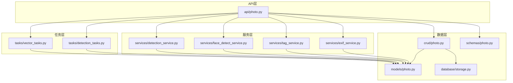
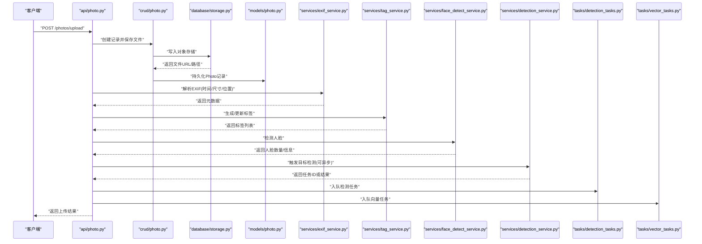
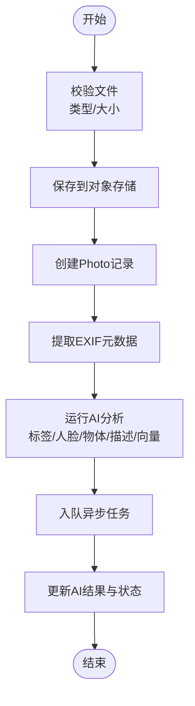
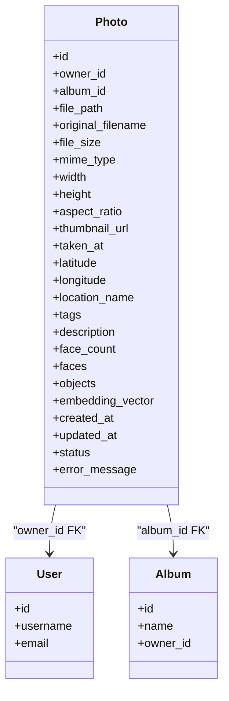

# 照片模型(Photo)

<cite>
**本文引用的文件**   
- [backend/app/models/photo.py](file://backend/app/models/photo.py)
- [backend/app/schemas/photo.py](file://backend/app/schemas/photo.py)
- [backend/app/crud/photo.py](file://backend/app/crud/photo.py)
- [backend/app/api/photo.py](file://backend/app/api/photo.py)
- [backend/app/services/exif_service.py](file://backend/app/services/exif_service.py)
- [backend/app/services/tag_service.py](file://backend/app/services/tag_service.py)
- [backend/app/services/face_detect_service.py](file://backend/app/services/face_detect_service.py)
- [backend/app/services/detection_service.py](file://backend/app/services/detection_service.py)
- [backend/app/database/storage.py](file://backend/app/database/storage.py)
- [backend/app/tasks/detection_tasks.py](file://backend/app/tasks/detection_tasks.py)
- [backend/app/tasks/vector_tasks.py](file://backend/app/tasks/vector_tasks.py)
</cite>

## 目录
1. [简介](#简介)
2. [项目结构](#项目结构)
3. [核心组件](#核心组件)
4. [架构总览](#架构总览)
5. [详细组件分析](#详细组件分析)
6. [依赖关系分析](#依赖关系分析)
7. [性能考虑](#性能考虑)
8. [故障排查指南](#故障排查指南)
9. [结论](#结论)
10. [附录](#附录)

## 简介
本文件围绕“照片模型(Photo)”进行系统化文档化，覆盖以下方面：
- Photo 实体的完整字段结构与含义（文件路径、原始文件名、文件大小、图片尺寸、拍摄时间、地理位置等元数据）
- AI 识别相关字段（标签、描述、人脸数量、物体检测结果等）
- 与相册(Album)、用户(User)的关联关系和外键约束
- 上传后的数据处理流程（元数据提取、AI 分析、结果存储）
- 索引策略与查询优化（按时间、标签、位置等维度）
- 字段参考表与数据流转图

## 项目结构
Photo 模型及相关能力分布在后端多个模块中：
- 数据模型定义：models/photo.py
- API 接口：api/photo.py
- 业务逻辑与服务：services/*（EXIF、标签、人脸检测、目标检测等）
- 任务调度：tasks/*（异步处理向量、检测等）
- 持久化与存储：database/storage.py
- CRUD 操作：crud/photo.py
- 请求/响应模式：schemas/photo.py

图表来源
- [backend/app/api/photo.py](file://backend/app/api/photo.py)
- [backend/app/services/exif_service.py](file://backend/app/services/exif_service.py)
- [backend/app/services/tag_service.py](file://backend/app/services/tag_service.py)
- [backend/app/services/face_detect_service.py](file://backend/app/services/face_detect_service.py)
- [backend/app/services/detection_service.py](file://backend/app/services/detection_service.py)
- [backend/app/tasks/detection_tasks.py](file://backend/app/tasks/detection_tasks.py)
- [backend/app/tasks/vector_tasks.py](file://backend/app/tasks/vector_tasks.py)
- [backend/app/models/photo.py](file://backend/app/models/photo.py)
- [backend/app/database/storage.py](file://backend/app/database/storage.py)
- [backend/app/crud/photo.py](file://backend/app/crud/photo.py)
- [backend/app/schemas/photo.py](file://backend/app/schemas/photo.py)

章节来源
- [backend/app/models/photo.py](file://backend/app/models/photo.py)
- [backend/app/api/photo.py](file://backend/app/api/photo.py)
- [backend/app/crud/photo.py](file://backend/app/crud/photo.py)
- [backend/app/schemas/photo.py](file://backend/app/schemas/photo.py)
- [backend/app/database/storage.py](file://backend/app/database/storage.py)

## 核心组件
- 数据模型 Photo：定义所有字段、类型、默认值、外键与索引
- 服务层：负责 EXIF 解析、标签生成、人脸检测、目标检测、向量化等
- 任务层：将耗时任务（如 AI 分析、向量计算）异步执行
- 存储层：文件对象存储与数据库会话管理
- CRUD 与 API：提供上传、查询、更新等接口

章节来源
- [backend/app/models/photo.py](file://backend/app/models/photo.py)
- [backend/app/services/exif_service.py](file://backend/app/services/exif_service.py)
- [backend/app/services/tag_service.py](file://backend/app/services/tag_service.py)
- [backend/app/services/face_detect_service.py](file://backend/app/services/face_detect_service.py)
- [backend/app/services/detection_service.py](file://backend/app/services/detection_service.py)
- [backend/app/tasks/detection_tasks.py](file://backend/app/tasks/detection_tasks.py)
- [backend/app/tasks/vector_tasks.py](file://backend/app/tasks/vector_tasks.py)
- [backend/app/database/storage.py](file://backend/app/database/storage.py)
- [backend/app/crud/photo.py](file://backend/app/crud/photo.py)
- [backend/app/api/photo.py](file://backend/app/api/photo.py)

## 架构总览
下图展示了从上传到入库、再到 AI 分析与检索的关键流程。

图表来源
- [backend/app/api/photo.py](file://backend/app/api/photo.py)
- [backend/app/crud/photo.py](file://backend/app/crud/photo.py)
- [backend/app/database/storage.py](file://backend/app/database/storage.py)
- [backend/app/models/photo.py](file://backend/app/models/photo.py)
- [backend/app/services/exif_service.py](file://backend/app/services/exif_service.py)
- [backend/app/services/tag_service.py](file://backend/app/services/tag_service.py)
- [backend/app/services/face_detect_service.py](file://backend/app/services/face_detect_service.py)
- [backend/app/services/detection_service.py](file://backend/app/services/detection_service.py)
- [backend/app/tasks/detection_tasks.py](file://backend/app/tasks/detection_tasks.py)
- [backend/app/tasks/vector_tasks.py](file://backend/app/tasks/vector_tasks.py)

## 详细组件分析

### Photo 实体字段说明
以下为 Photo 模型的核心字段分类与用途说明（以实际模型为准）：
- 标识与归属
  - id：主键
  - owner_id：所属用户外键
  - album_id：所属相册外键（可为空）
- 文件与存储
  - file_path：对象存储中的文件路径
  - original_filename：上传时的原始文件名
  - file_size：文件大小（字节）
  - mime_type：MIME 类型
- 图像属性
  - width：宽度（像素）
  - height：高度（像素）
  - aspect_ratio：宽高比
  - thumbnail_url：缩略图地址
- 拍摄与地理
  - taken_at：拍摄时间（EXIF 提取）
  - latitude：纬度
  - longitude：经度
  - location_name：地点名称（可选）
- AI 识别结果
  - tags：标签集合（JSON/数组）
  - description：自然语言描述（可选）
  - face_count：人脸数量
  - faces：人脸详细信息（JSON/数组）
  - objects：物体检测结果（JSON/数组）
  - embedding_vector：向量嵌入（用于相似检索）
- 审计与状态
  - created_at：创建时间
  - updated_at：更新时间
  - status：处理状态（待处理/已完成/失败等）
  - error_message：错误信息（可选）

注意：具体字段名、类型、是否必填、默认值与约束以 models/photo.py 为准。

章节来源
- [backend/app/models/photo.py](file://backend/app/models/photo.py)

#### 字段参考表
| 类别 | 字段名 | 类型/格式 | 说明 | 索引建议 |
| --- | --- | --- | --- | --- |
| 标识与归属 | id | 整数/UUID | 主键 | PK |
| 标识与归属 | owner_id | 整数/UUID | 用户外键 | 普通索引 |
| 标识与归属 | album_id | 整数/UUID | 相册外键 | 普通索引 |
| 文件与存储 | file_path | 字符串 | 对象存储路径 | 无 |
| 文件与存储 | original_filename | 字符串 | 原始文件名 | 无 |
| 文件与存储 | file_size | 整数 | 字节数 | 无 |
| 文件与存储 | mime_type | 字符串 | MIME 类型 | 无 |
| 图像属性 | width | 整数 | 像素宽 | 无 |
| 图像属性 | height | 整数 | 像素高 | 无 |
| 图像属性 | aspect_ratio | 数值 | 宽高比 | 无 |
| 图像属性 | thumbnail_url | 字符串 | 缩略图URL | 无 |
| 拍摄与地理 | taken_at | 时间戳 | 拍摄时间 | 范围查询索引 |
| 拍摄与地理 | latitude | 数值 | 纬度 | 空间索引/范围索引 |
| 拍摄与地理 | longitude | 数值 | 经度 | 空间索引/范围索引 |
| 拍摄与地理 | location_name | 字符串 | 地点名 | 全文/前缀索引 |
| AI 识别结果 | tags | JSON/数组 | 标签集合 | 全文/GIN索引 |
| AI 识别结果 | description | 文本 | 描述 | 全文索引 |
| AI 识别结果 | face_count | 整数 | 人脸数量 | 普通索引 |
| AI 识别结果 | faces | JSON/数组 | 人脸详情 | 无 |
| AI 识别结果 | objects | JSON/数组 | 物体检测 | 全文/GIN索引 |
| AI 识别结果 | embedding_vector | 向量 | 相似度检索 | 向量索引 |
| 审计与状态 | created_at | 时间戳 | 创建时间 | 普通索引 |
| 审计与状态 | updated_at | 时间戳 | 更新时间 | 普通索引 |
| 审计与状态 | status | 枚举/字符串 | 处理状态 | 普通索引 |
| 审计与状态 | error_message | 文本 | 错误信息 | 无 |

章节来源
- [backend/app/models/photo.py](file://backend/app/models/photo.py)

### 与相册(Album)、用户(User)的关联关系
- 用户(Owner)
  - 一对多：一个用户拥有多张照片
  - 外键：photo.owner_id -> user.id
- 相册(Album)
  - 一对多：一个相册包含多张照片
  - 外键：photo.album_id -> album.id（可为空，表示未加入任何相册）
- 级联删除/更新策略
  - 当用户或相册被删除时，需根据业务需求决定是级联删除照片还是保留（常见为软删除或保留历史）

章节来源
- [backend/app/models/photo.py](file://backend/app/models/photo.py)

### 上传与数据处理流程
- 接收上传请求
  - 校验文件类型、大小
  - 生成唯一文件名与路径
- 持久化文件
  - 写入对象存储，获取 URL/路径
- 写入数据库
  - 创建 Photo 记录，填充基础字段
- 元数据提取
  - 解析 EXIF：拍摄时间、尺寸、GPS 坐标
- AI 分析
  - 标签生成
  - 人脸检测（数量与人脸信息）
  - 目标检测（物体框与类别）
  - 描述生成（可选）
  - 向量嵌入（用于相似检索）
- 异步任务
  - 将耗时任务入队（检测、向量），避免阻塞上传接口
- 返回结果
  - 返回上传成功信息与任务 ID（可选）

图表来源
- [backend/app/api/photo.py](file://backend/app/api/photo.py)
- [backend/app/crud/photo.py](file://backend/app/crud/photo.py)
- [backend/app/database/storage.py](file://backend/app/database/storage.py)
- [backend/app/services/exif_service.py](file://backend/app/services/exif_service.py)
- [backend/app/services/tag_service.py](file://backend/app/services/tag_service.py)
- [backend/app/services/face_detect_service.py](file://backend/app/services/face_detect_service.py)
- [backend/app/services/detection_service.py](file://backend/app/services/detection_service.py)
- [backend/app/tasks/detection_tasks.py](file://backend/app/tasks/detection_tasks.py)
- [backend/app/tasks/vector_tasks.py](file://backend/app/tasks/vector_tasks.py)

章节来源
- [backend/app/api/photo.py](file://backend/app/api/photo.py)
- [backend/app/crud/photo.py](file://backend/app/crud/photo.py)
- [backend/app/database/storage.py](file://backend/app/database/storage.py)
- [backend/app/services/exif_service.py](file://backend/app/services/exif_service.py)
- [backend/app/services/tag_service.py](file://backend/app/services/tag_service.py)
- [backend/app/services/face_detect_service.py](file://backend/app/services/face_detect_service.py)
- [backend/app/services/detection_service.py](file://backend/app/services/detection_service.py)
- [backend/app/tasks/detection_tasks.py](file://backend/app/tasks/detection_tasks.py)
- [backend/app/tasks/vector_tasks.py](file://backend/app/tasks/vector_tasks.py)

### 索引策略与查询优化
- 时间维度
  - 对 taken_at、created_at 建立普通索引，支持范围查询与排序
- 标签与内容
  - 对 tags、objects 使用全文/GIN 索引，提升关键词检索效率
  - 对 description 建立全文索引，支持语义搜索前置过滤
- 地理位置
  - 对 latitude、longitude 建立复合索引或空间索引，支持附近照片检索
- 归属维度
  - 对 owner_id、album_id 建立普通索引，加速按用户/相册筛选
- 状态与统计
  - 对 status、face_count 建立普通索引，便于批量任务与统计查询
- 向量检索
  - 对 embedding_vector 建立向量索引，支持近似最近邻搜索

章节来源
- [backend/app/models/photo.py](file://backend/app/models/photo.py)

### 代码示例路径（上传后数据处理）
- 上传接口入口与参数校验
  - [backend/app/api/photo.py](file://backend/app/api/photo.py)
- 创建记录与文件落盘
  - [backend/app/crud/photo.py](file://backend/app/crud/photo.py)
  - [backend/app/database/storage.py](file://backend/app/database/storage.py)
- EXIF 元数据提取
  - [backend/app/services/exif_service.py](file://backend/app/services/exif_service.py)
- 标签生成与更新
  - [backend/app/services/tag_service.py](file://backend/app/services/tag_service.py)
- 人脸检测
  - [backend/app/services/face_detect_service.py](file://backend/app/services/face_detect_service.py)
- 目标检测
  - [backend/app/services/detection_service.py](file://backend/app/services/detection_service.py)
- 异步任务入队与执行
  - [backend/app/tasks/detection_tasks.py](file://backend/app/tasks/detection_tasks.py)
  - [backend/app/tasks/vector_tasks.py](file://backend/app/tasks/vector_tasks.py)

章节来源
- [backend/app/api/photo.py](file://backend/app/api/photo.py)
- [backend/app/crud/photo.py](file://backend/app/crud/photo.py)
- [backend/app/database/storage.py](file://backend/app/database/storage.py)
- [backend/app/services/exif_service.py](file://backend/app/services/exif_service.py)
- [backend/app/services/tag_service.py](file://backend/app/services/tag_service.py)
- [backend/app/services/face_detect_service.py](file://backend/app/services/face_detect_service.py)
- [backend/app/services/detection_service.py](file://backend/app/services/detection_service.py)
- [backend/app/tasks/detection_tasks.py](file://backend/app/tasks/detection_tasks.py)
- [backend/app/tasks/vector_tasks.py](file://backend/app/tasks/vector_tasks.py)

## 依赖关系分析
- 模型依赖
  - Photo 依赖 User、Album 的外键约束
- 服务依赖
  - exif_service、tag_service、face_detect_service、detection_service 均读取 Photo.file_path 并回写 Photo 字段
- 任务依赖
  - detection_tasks、vector_tasks 消费队列，调用对应服务完成分析并更新数据库
- 存储依赖
  - storage 提供对象存储读写；数据库会话由 ORM 管理

图表来源
- [backend/app/models/photo.py](file://backend/app/models/photo.py)

章节来源
- [backend/app/models/photo.py](file://backend/app/models/photo.py)

## 性能考虑
- 上传接口应尽快返回，AI 分析通过异步任务执行
- 大文件分块上传与断点续传可降低超时风险
- 合理设置对象存储的分片大小与并发
- 数据库连接池与事务边界要清晰，避免长事务
- 针对高频查询建立合适索引，避免全表扫描
- 向量检索采用近似算法与合适的召回率阈值

[本节为通用指导，不直接分析具体文件]

## 故障排查指南
- 上传失败
  - 检查文件类型与大小限制
  - 确认对象存储权限与网络连通性
- EXIF 缺失
  - 部分图片不含 EXIF，需降级处理（如使用文件修改时间）
- AI 分析失败
  - 查看任务队列与日志
  - 重试机制与死信队列配置
- 查询缓慢
  - 检查索引命中情况
  - 优化 SQL 与分页策略
- 向量检索不准
  - 调整向量模型与相似度阈值
  - 定期更新 embedding

章节来源
- [backend/app/tasks/detection_tasks.py](file://backend/app/tasks/detection_tasks.py)
- [backend/app/tasks/vector_tasks.py](file://backend/app/tasks/vector_tasks.py)
- [backend/app/services/exif_service.py](file://backend/app/services/exif_service.py)
- [backend/app/services/tag_service.py](file://backend/app/services/tag_service.py)
- [backend/app/services/face_detect_service.py](file://backend/app/services/face_detect_service.py)
- [backend/app/services/detection_service.py](file://backend/app/services/detection_service.py)

## 结论
Photo 模型作为系统的核心资产，承载了文件元数据与 AI 识别结果。通过合理的字段设计、外键约束、索引策略与异步任务编排，系统能够在保证上传体验的同时，实现高效的检索与分析能力。建议在后续迭代中持续完善索引、监控与容错机制，以提升整体稳定性与可扩展性。

[本节为总结性内容，不直接分析具体文件]

## 附录
- 字段参考表见“字段参考表”小节
- 数据流转图见“上传与数据处理流程”小节
- 类关系图见“依赖关系分析”小节

[本节为补充说明，不直接分析具体文件]