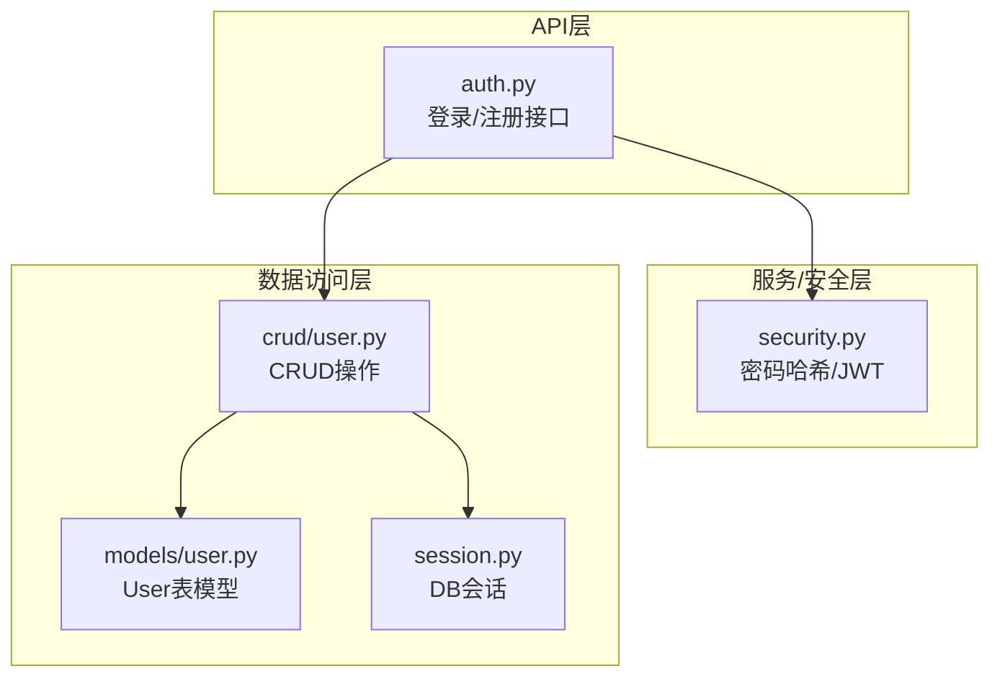
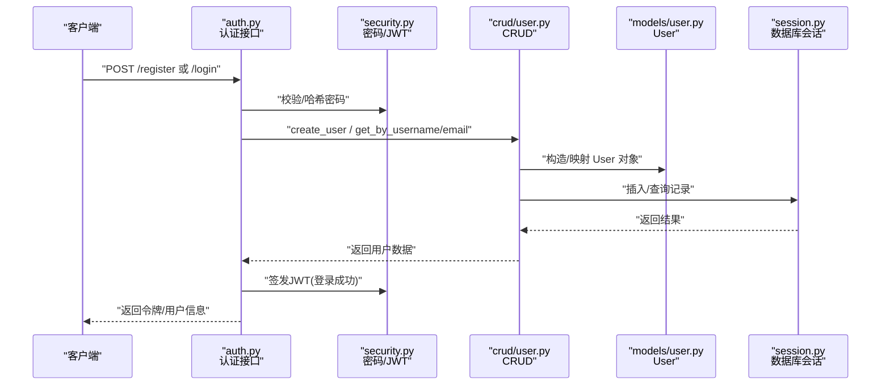
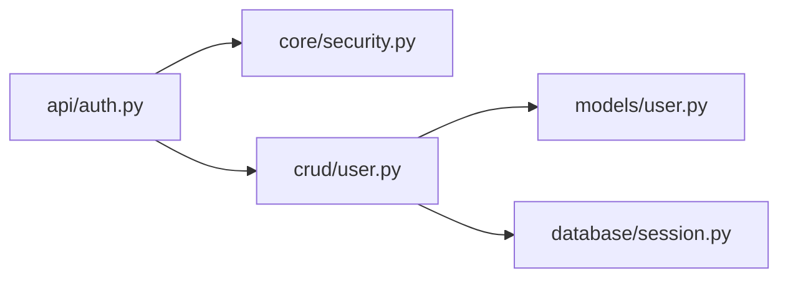

# 用户模型(User)

<cite>
**本文引用的文件**   
- [backend/app/models/user.py](file://backend/app/models/user.py)
- [backend/app/schemas/user.py](file://backend/app/schemas/user.py)
- [backend/app/crud/user.py](file://backend/app/crud/user.py)
- [backend/app/api/auth.py](file://backend/app/api/auth.py)
- [backend/app/core/security.py](file://backend/app/core/security.py)
- [backend/app/database/session.py](file://backend/app/database/session.py)
</cite>

## 目录
1. [简介](#简介)
2. [项目结构](#项目结构)
3. [核心组件](#核心组件)
4. [架构总览](#架构总览)
5. [详细组件分析](#详细组件分析)
6. [依赖关系分析](#依赖关系分析)
7. [性能考虑](#性能考虑)
8. [故障排查指南](#故障排查指南)
9. [结论](#结论)
10. [附录](#附录)

## 简介
本文件聚焦于后端“用户模型(User)”的完整说明，覆盖实体字段定义、业务含义、数据类型与约束、默认值、认证相关配置（密码加密存储、邮箱验证状态等）、权限系统设计模式与实现方式，并提供创建、更新、查询用户的操作示例路径。文档旨在帮助开发者快速理解并正确使用用户模块。

## 项目结构
与用户模型相关的核心代码位于 backend/app 下：
- 数据模型定义：models/user.py
- API 请求/响应模式：schemas/user.py
- 数据库增删改查：crud/user.py
- 认证与安全：api/auth.py、core/security.py
- 数据库会话：database/session.py

图表来源
- [backend/app/api/auth.py](file://backend/app/api/auth.py)
- [backend/app/core/security.py](file://backend/app/core/security.py)
- [backend/app/crud/user.py](file://backend/app/crud/user.py)
- [backend/app/models/user.py](file://backend/app/models/user.py)
- [backend/app/database/session.py](file://backend/app/database/session.py)

章节来源
- [backend/app/models/user.py](file://backend/app/models/user.py)
- [backend/app/schemas/user.py](file://backend/app/schemas/user.py)
- [backend/app/crud/user.py](file://backend/app/crud/user.py)
- [backend/app/api/auth.py](file://backend/app/api/auth.py)
- [backend/app/core/security.py](file://backend/app/core/security.py)
- [backend/app/database/session.py](file://backend/app/database/session.py)

## 核心组件
- User 数据模型：定义用户表的列、索引、约束与默认值，包含用户名、邮箱、密码哈希、头像路径、权限级别、邮箱验证状态、时间戳等。
- UserSchema：用于 API 输入输出校验与序列化，屏蔽敏感字段（如密码）。
- CRUD 操作：提供按用户名/邮箱查询、创建用户、更新用户信息等方法。
- 安全模块：负责密码哈希与校验、JWT 令牌生成与解析。
- 认证接口：处理注册、登录、获取当前用户等流程。

章节来源
- [backend/app/models/user.py](file://backend/app/models/user.py)
- [backend/app/schemas/user.py](file://backend/app/schemas/user.py)
- [backend/app/crud/user.py](file://backend/app/crud/user.py)
- [backend/app/core/security.py](file://backend/app/core/security.py)
- [backend/app/api/auth.py](file://backend/app/api/auth.py)

## 架构总览
下图展示了从 HTTP 请求到数据库落库的关键调用链，以及安全模块在其中的作用。

图表来源
- [backend/app/api/auth.py](file://backend/app/api/auth.py)
- [backend/app/core/security.py](file://backend/app/core/security.py)
- [backend/app/crud/user.py](file://backend/app/crud/user.py)
- [backend/app/models/user.py](file://backend/app/models/user.py)
- [backend/app/database/session.py](file://backend/app/database/session.py)

## 详细组件分析

### 用户模型(User)字段参考
以下为 User 实体的字段清单与说明。请结合具体源码确认类型、约束与默认值细节。

- id
  - 业务含义：用户唯一标识
  - 数据类型：整数主键
  - 约束：非空、自增
  - 默认值：无（由数据库生成）
- username
  - 业务含义：登录用户名
  - 数据类型：字符串
  - 约束：唯一、非空
  - 默认值：无
- email
  - 业务含义：用户邮箱
  - 数据类型：字符串
  - 约束：唯一、非空
  - 默认值：无
- hashed_password
  - 业务含义：密码哈希值（不存储明文）
  - 数据类型：字符串
  - 约束：非空
  - 默认值：无
- avatar_url
  - 业务含义：头像资源路径或URL
  - 数据类型：字符串
  - 约束：可为空
  - 默认值：空
- is_active
  - 业务含义：账户是否启用
  - 数据类型：布尔
  - 约束：非空
  - 默认值：true
- is_superuser
  - 业务含义：是否为超级管理员
  - 数据类型：布尔
  - 约束：非空
  - 默认值：false
- is_email_verified
  - 业务含义：邮箱是否已验证
  - 数据类型：布尔
  - 约束：非空
  - 默认值：false
- created_at
  - 业务含义：创建时间
  - 数据类型：时间戳
  - 约束：非空
  - 默认值：当前时间
- updated_at
  - 业务含义：更新时间
  - 数据类型：时间戳
  - 约束：非空
  - 默认值：创建时等于 created_at；更新时自动刷新为当前时间

章节来源
- [backend/app/models/user.py](file://backend/app/models/user.py)

### 用户模式(Schema)与校验
- 用途：统一 API 层的输入校验与输出序列化，避免直接暴露内部模型字段。
- 典型规则：
  - 注册/登录请求：校验用户名、邮箱格式与长度限制，密码强度要求。
  - 响应体：不包含敏感字段（如密码），仅返回必要字段。
- 建议：
  - 使用 Pydantic v2 的 Field 进行约束声明（如 min_length、max_length、pattern）。
  - 对邮箱字段增加正则校验。
  - 对头像路径进行白名单或长度限制。

章节来源
- [backend/app/schemas/user.py](file://backend/app/schemas/user.py)

### 认证与安全
- 密码存储：
  - 采用安全的哈希算法对用户密码进行单向加密存储，禁止明文保存。
  - 登录时比对哈希值而非明文。
- JWT 令牌：
  - 登录成功后签发短期有效令牌，包含用户标识与过期时间。
  - 后续受保护接口通过中间件或依赖注入解析令牌并识别当前用户。
- 安全建议：
  - 设置合理的令牌过期策略与刷新机制。
  - 对密码哈希参数（如轮次/盐）进行集中配置管理。

章节来源
- [backend/app/core/security.py](file://backend/app/core/security.py)
- [backend/app/api/auth.py](file://backend/app/api/auth.py)

### 权限系统设计与实现
- 设计要点：
  - 基于角色的访问控制（RBAC）简化版：使用 is_superuser 区分普通用户与管理员。
  - 可扩展为多角色与细粒度权限（例如将 is_superuser 替换为 roles 列表或权限集合）。
- 实现位置：
  - 模型层：is_superuser 字段作为权限标志。
  - 接口层：在需要管理员权限的端点处进行鉴权检查。
- 扩展建议：
  - 引入 Role 与 Permission 表，建立多对多关系。
  - 在依赖注入中提供 has_permission 工具函数，统一鉴权逻辑。

章节来源
- [backend/app/models/user.py](file://backend/app/models/user.py)
- [backend/app/api/auth.py](file://backend/app/api/auth.py)

### 用户CRUD操作
- 创建用户：
  - 接收注册请求，校验输入，计算密码哈希，写入数据库。
  - 返回不含敏感字段的用户信息。
- 查询用户：
  - 支持按用户名或邮箱精确查询。
  - 返回脱敏后的用户数据。
- 更新用户：
  - 支持更新头像、邮箱、激活状态等字段。
  - 若更新密码，需重新哈希后再持久化。
- 事务与一致性：
  - 建议在单条写操作中开启事务，确保数据一致性。

章节来源
- [backend/app/crud/user.py](file://backend/app/crud/user.py)
- [backend/app/database/session.py](file://backend/app/database/session.py)

### 操作示例（以路径引用代替代码片段）
- 创建新用户
  - 注册接口：[backend/app/api/auth.py](file://backend/app/api/auth.py)
  - 创建用户CRUD：[backend/app/crud/user.py](file://backend/app/crud/user.py)
  - 用户模型：[backend/app/models/user.py](file://backend/app/models/user.py)
- 更新用户信息
  - 更新接口（如有）：[backend/app/api/auth.py](file://backend/app/api/auth.py)
  - 更新CRUD方法：[backend/app/crud/user.py](file://backend/app/crud/user.py)
- 查询用户数据
  - 按用户名/邮箱查询：[backend/app/crud/user.py](file://backend/app/crud/user.py)
  - 获取当前用户（依赖注入）：[backend/app/api/auth.py](file://backend/app/api/auth.py)

## 依赖关系分析
- 模块耦合：
  - auth.py 依赖 security.py 与 crud/user.py。
  - crud/user.py 依赖 models/user.py 与 database/session.py。
- 外部依赖：
  - 数据库驱动与ORM（如 SQLAlchemy）。
  - 密码哈希库（如 passlib/bcrypt）。
  - JWT 库（如 python-jose）。
- 潜在风险：
  - 循环导入：确保 models、schemas、crud、api 之间单向依赖。
  - 配置外置：将 JWT 密钥、过期时间、哈希参数放入 settings 统一管理。

图表来源
- [backend/app/api/auth.py](file://backend/app/api/auth.py)
- [backend/app/core/security.py](file://backend/app/core/security.py)
- [backend/app/crud/user.py](file://backend/app/crud/user.py)
- [backend/app/models/user.py](file://backend/app/models/user.py)
- [backend/app/database/session.py](file://backend/app/database/session.py)

章节来源
- [backend/app/api/auth.py](file://backend/app/api/auth.py)
- [backend/app/core/security.py](file://backend/app/core/security.py)
- [backend/app/crud/user.py](file://backend/app/crud/user.py)
- [backend/app/models/user.py](file://backend/app/models/user.py)
- [backend/app/database/session.py](file://backend/app/database/session.py)

## 性能考虑
- 索引优化：
  - 对 username、email 建立唯一索引，提升查询性能。
- 连接池与会话复用：
  - 合理配置数据库连接池大小，避免频繁建连。
- 序列化开销：
  - 在响应中仅返回必要字段，减少网络传输与序列化成本。
- 缓存策略：
  - 对热点用户信息（如当前用户）可加短时效缓存，降低数据库压力。

## 故障排查指南
- 常见问题
  - 重复用户名/邮箱：检查唯一约束冲突，返回明确错误码。
  - 密码校验失败：确认哈希算法一致，核对 salt/rounds 配置。
  - JWT 无效或过期：检查密钥、过期时间与时区设置。
  - 头像路径非法：校验路径白名单与长度限制。
- 定位步骤
  - 查看接口日志与异常堆栈。
  - 核对数据库记录是否存在且状态正确。
  - 复现最小用例，逐步缩小问题范围。

章节来源
- [backend/app/api/auth.py](file://backend/app/api/auth.py)
- [backend/app/core/security.py](file://backend/app/core/security.py)
- [backend/app/crud/user.py](file://backend/app/crud/user.py)

## 结论
User 模型围绕“身份与权限”展开，字段设计兼顾安全性与可扩展性。通过 Schema 校验、CRUD 封装与安全模块配合，形成清晰的认证与授权链路。建议后续引入更完善的 RBAC 与审计能力，进一步提升系统的可维护性与安全性。

## 附录

### 字段参考表
- id：整数主键，非空，自增
- username：字符串，唯一，非空
- email：字符串，唯一，非空
- hashed_password：字符串，非空
- avatar_url：字符串，可为空
- is_active：布尔，非空，默认 true
- is_superuser：布尔，非空，默认 false
- is_email_verified：布尔，非空，默认 false
- created_at：时间戳，非空，默认当前时间
- updated_at：时间戳，非空，默认当前时间（更新时自动刷新）

章节来源
- [backend/app/models/user.py](file://backend/app/models/user.py)