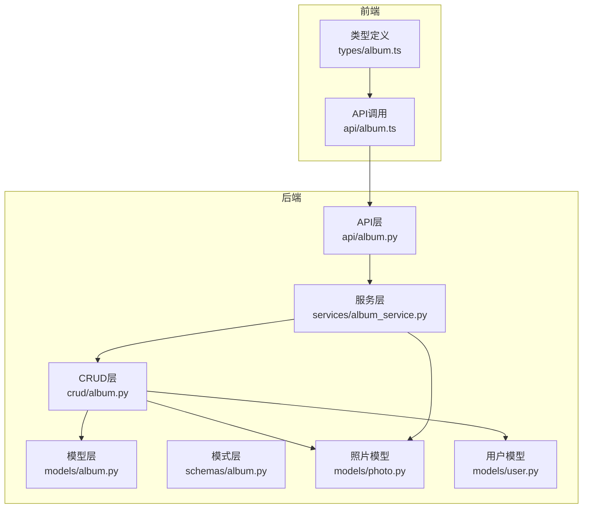
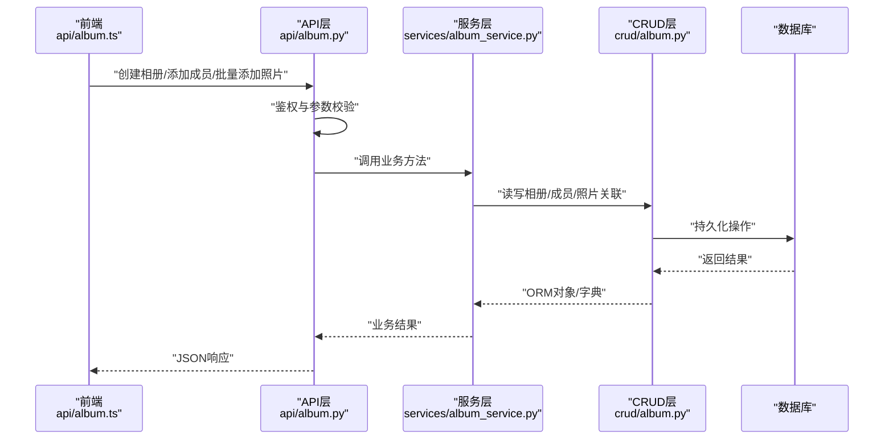
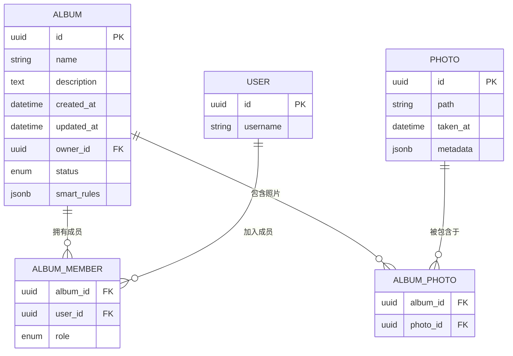
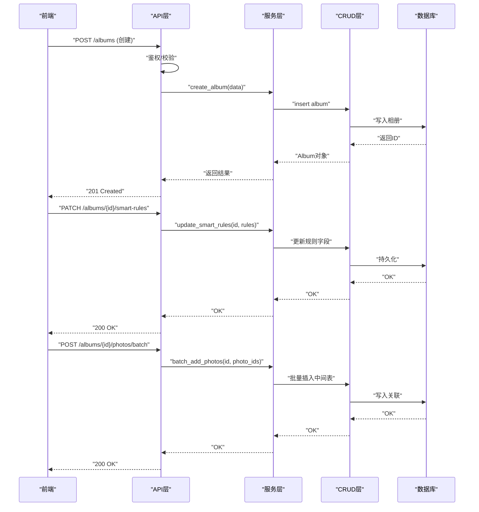
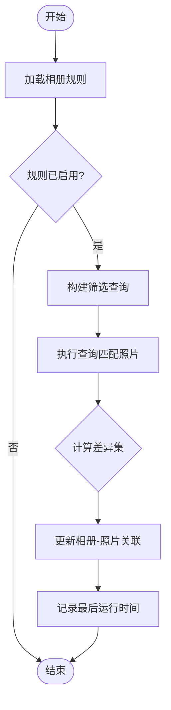
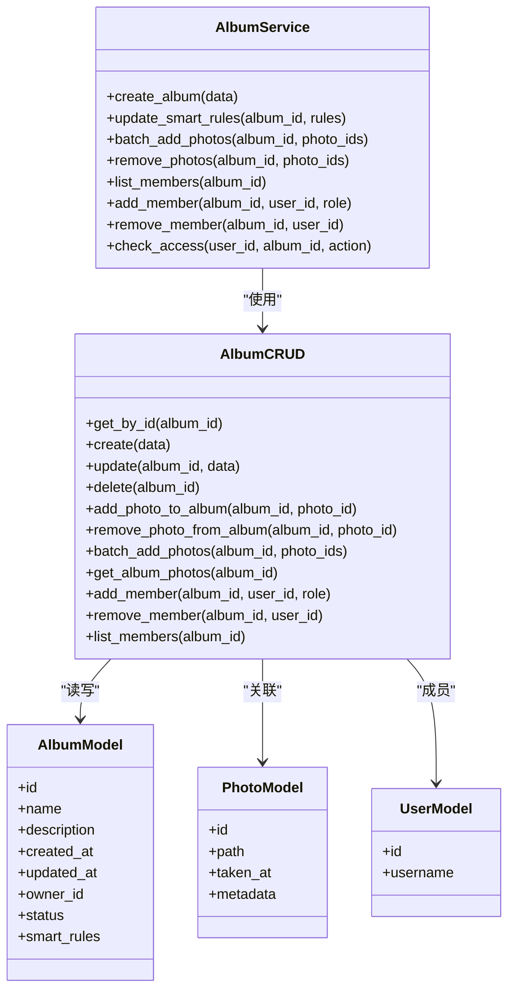
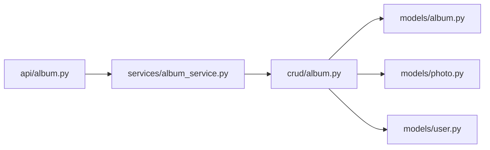
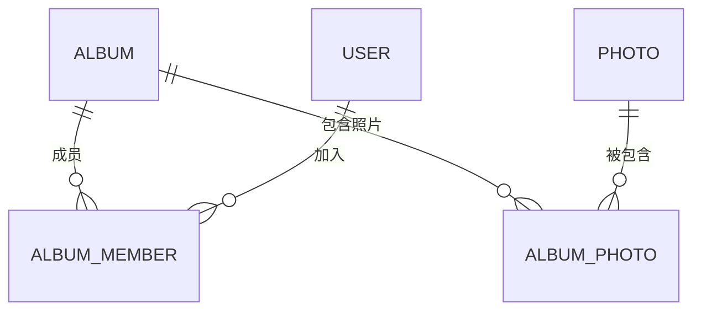

# 相册模型(Album)

<cite>
**本文引用的文件**   
- [backend/app/models/album.py](file://backend/app/models/album.py)
- [backend/app/schemas/album.py](file://backend/app/schemas/album.py)
- [backend/app/crud/album.py](file://backend/app/crud/album.py)
- [backend/app/api/album.py](file://backend/app/api/album.py)
- [backend/app/services/album_service.py](file://backend/app/services/album_service.py)
- [backend/app/models/photo.py](file://backend/app/models/photo.py)
- [backend/app/models/user.py](file://backend/app/models/user.py)
- [frontend/src/types/album.ts](file://frontend/src/types/album.ts)
- [frontend/src/api/album.ts](file://frontend/src/api/album.ts)
</cite>

## 目录
1. [简介](#简介)
2. [项目结构](#项目结构)
3. [核心组件](#核心组件)
4. [架构总览](#架构总览)
5. [详细组件分析](#详细组件分析)
6. [依赖关系分析](#依赖关系分析)
7. [性能考虑](#性能考虑)
8. [故障排查指南](#故障排查指南)
9. [结论](#结论)
10. [附录](#附录)

## 简介
本文件围绕“相册模型(Album)”进行系统化文档化，覆盖实体字段、智能相册规则配置、与照片的多对多关系设计、成员权限管理、共享机制与访问控制，并提供端到端操作示例（手动创建相册、配置智能相册规则、批量添加照片）以及完整的字段参考表与关系映射图。目标读者包括后端开发者、前端集成人员与产品/运营同学。

## 项目结构
与相册模型相关的代码主要分布在以下模块：
- 数据模型层：定义数据库表结构与关系
- 请求/响应模式层：定义API输入输出校验结构
- 业务服务层：封装相册业务逻辑（含智能相册规则执行）
- 数据访问层(CRUD)：提供增删改查方法
- API层：暴露HTTP接口
- 前端类型与API调用：统一前后端契约与调用方式

图表来源
- [backend/app/models/album.py](file://backend/app/models/album.py)
- [backend/app/schemas/album.py](file://backend/app/schemas/album.py)
- [backend/app/crud/album.py](file://backend/app/crud/album.py)
- [backend/app/api/album.py](file://backend/app/api/album.py)
- [backend/app/services/album_service.py](file://backend/app/services/album_service.py)
- [backend/app/models/photo.py](file://backend/app/models/photo.py)
- [backend/app/models/user.py](file://backend/app/models/user.py)
- [frontend/src/types/album.ts](file://frontend/src/types/album.ts)
- [frontend/src/api/album.ts](file://frontend/src/api/album.ts)

章节来源
- [backend/app/models/album.py](file://backend/app/models/album.py)
- [backend/app/schemas/album.py](file://backend/app/schemas/album.py)
- [backend/app/crud/album.py](file://backend/app/crud/album.py)
- [backend/app/api/album.py](file://backend/app/api/album.py)
- [backend/app/services/album_service.py](file://backend/app/services/album_service.py)
- [backend/app/models/photo.py](file://backend/app/models/photo.py)
- [backend/app/models/user.py](file://backend/app/models/user.py)
- [frontend/src/types/album.ts](file://frontend/src/types/album.ts)
- [frontend/src/api/album.ts](file://frontend/src/api/album.ts)

## 核心组件
- 相册模型(Album)
  - 基本属性：名称、描述、创建时间、更新时间、所有者等
  - 智能相册：规则配置（自动分类条件、筛选规则、动态生成逻辑）
  - 成员与权限：支持成员列表与角色/权限控制
  - 与照片的关系：多对多关联
- 相册服务(AlbumService)
  - 封装相册的创建、更新、删除、查询、成员管理、智能规则执行等
- 相册CRUD
  - 提供底层数据库操作（含多对多中间表维护）
- 相册API
  - 暴露REST接口，负责鉴权、参数校验、调用服务层并返回结果
- 前端类型与API
  - 统一前后端数据结构与调用方式

章节来源
- [backend/app/models/album.py](file://backend/app/models/album.py)
- [backend/app/services/album_service.py](file://backend/app/services/album_service.py)
- [backend/app/crud/album.py](file://backend/app/crud/album.py)
- [backend/app/api/album.py](file://backend/app/api/album.py)
- [frontend/src/types/album.ts](file://frontend/src/types/album.ts)
- [frontend/src/api/album.ts](file://frontend/src/api/album.ts)

## 架构总览
下图展示了从前端到后端的完整调用链路，以及相册模型在其中的位置。

图表来源
- [backend/app/api/album.py](file://backend/app/api/album.py)
- [backend/app/services/album_service.py](file://backend/app/services/album_service.py)
- [backend/app/crud/album.py](file://backend/app/crud/album.py)
- [backend/app/models/album.py](file://backend/app/models/album.py)
- [backend/app/models/photo.py](file://backend/app/models/photo.py)
- [backend/app/models/user.py](file://backend/app/models/user.py)
- [frontend/src/api/album.ts](file://frontend/src/api/album.ts)

## 详细组件分析

### 相册实体(Album)字段定义
- 基础信息
  - 名称：字符串，必填，用于展示与搜索
  - 描述：字符串，可选，用于说明相册用途或规则摘要
  - 创建时间：时间戳，系统自动生成
  - 更新时间：时间戳，记录最近一次变更
  - 所有者：外键指向用户，表示相册归属
- 智能相册规则
  - 规则类型：标识是否为智能相册及规则类别
  - 规则表达式/条件：存储自动分类条件与筛选规则
  - 动态生成开关：是否启用自动同步与增量更新
  - 最后计算时间：记录最近一次规则执行时间
- 成员与权限
  - 成员集合：多对多关联用户，支持不同角色/权限
  - 可见性：私有/共享/公开等策略
- 状态与元数据
  - 状态：启用/禁用/归档
  - 标签/封面：辅助展示与检索

章节来源
- [backend/app/models/album.py](file://backend/app/models/album.py)
- [backend/app/models/user.py](file://backend/app/models/user.py)

### 智能相册规则配置
- 规则类型
  - 按标签/关键词匹配
  - 按拍摄时间范围
  - 按地理位置区域
  - 按人脸/人物聚类
  - 自定义表达式
- 规则字段
  - 条件列表：包含字段名、操作符、值
  - 组合逻辑：AND/OR
  - 优先级：当存在多条规则时的执行顺序
- 动态生成逻辑
  - 触发时机：定时任务/事件驱动
  - 增量更新：仅处理新增/变更照片
  - 幂等性：重复执行不产生副作用

章节来源
- [backend/app/services/album_service.py](file://backend/app/services/album_service.py)
- [backend/app/models/album.py](file://backend/app/models/album.py)

### 相册与照片的多对多关系设计
- 设计要点
  - 通过中间表维护相册与照片的关联
  - 支持去重与批量插入优化
  - 支持软删除时级联清理关联
- 复杂度
  - 批量添加照片：O(n) 插入，配合唯一约束避免重复
  - 查询某相册下照片：基于索引的外键查询，典型为 O(log n) + 扫描

图表来源
- [backend/app/models/album.py](file://backend/app/models/album.py)
- [backend/app/models/photo.py](file://backend/app/models/photo.py)
- [backend/app/models/user.py](file://backend/app/models/user.py)

### 成员权限管理与共享机制
- 成员角色
  - 所有者：完全控制
  - 管理员：可编辑成员与内容
  - 编辑者：可添加/移除照片
  - 查看者：只读
- 共享策略
  - 私有：仅所有者可见
  - 团队：指定成员可见
  - 链接分享：带过期时间与访问次数限制
- 访问控制实现
  - 鉴权：基于JWT/Session的用户身份
  - 授权：基于成员角色与共享策略的细粒度检查
  - 审计：关键操作日志记录

章节来源
- [backend/app/models/album.py](file://backend/app/models/album.py)
- [backend/app/api/album.py](file://backend/app/api/album.py)

### API工作流示例（序列图）
- 手动创建相册
- 配置智能相册规则
- 批量添加照片到相册

图表来源
- [backend/app/api/album.py](file://backend/app/api/album.py)
- [backend/app/services/album_service.py](file://backend/app/services/album_service.py)
- [backend/app/crud/album.py](file://backend/app/crud/album.py)
- [backend/app/models/album.py](file://backend/app/models/album.py)
- [backend/app/models/photo.py](file://backend/app/models/photo.py)

### 复杂逻辑流程图（智能相册规则执行）

图表来源
- [backend/app/services/album_service.py](file://backend/app/services/album_service.py)
- [backend/app/models/album.py](file://backend/app/models/album.py)

### 面向对象类图（后端核心类）

图表来源
- [backend/app/models/album.py](file://backend/app/models/album.py)
- [backend/app/models/photo.py](file://backend/app/models/photo.py)
- [backend/app/models/user.py](file://backend/app/models/user.py)
- [backend/app/services/album_service.py](file://backend/app/services/album_service.py)
- [backend/app/crud/album.py](file://backend/app/crud/album.py)

### 前端类型与API调用
- 类型定义
  - 相册类型：包含基础字段、规则、成员、状态等
  - 规则类型：条件列表、组合逻辑、优先级
- API调用
  - 创建相册、更新规则、批量添加/移除照片、成员管理等

章节来源
- [frontend/src/types/album.ts](file://frontend/src/types/album.ts)
- [frontend/src/api/album.ts](file://frontend/src/api/album.ts)

## 依赖关系分析
- 模块耦合
  - API层依赖服务层；服务层依赖CRUD层；CRUD层依赖模型层
  - 服务层直接参与智能规则执行与业务编排
- 外部依赖
  - 数据库：关系型数据库（通过ORM）
  - 认证授权：鉴权中间件与权限检查
- 潜在循环依赖
  - 当前分层清晰，未见明显循环依赖

图表来源
- [backend/app/api/album.py](file://backend/app/api/album.py)
- [backend/app/services/album_service.py](file://backend/app/services/album_service.py)
- [backend/app/crud/album.py](file://backend/app/crud/album.py)
- [backend/app/models/album.py](file://backend/app/models/album.py)
- [backend/app/models/photo.py](file://backend/app/models/photo.py)
- [backend/app/models/user.py](file://backend/app/models/user.py)

章节来源
- [backend/app/api/album.py](file://backend/app/api/album.py)
- [backend/app/services/album_service.py](file://backend/app/services/album_service.py)
- [backend/app/crud/album.py](file://backend/app/crud/album.py)
- [backend/app/models/album.py](file://backend/app/models/album.py)
- [backend/app/models/photo.py](file://backend/app/models/photo.py)
- [backend/app/models/user.py](file://backend/app/models/user.py)

## 性能考虑
- 批量操作
  - 使用批量插入减少往返开销
  - 利用唯一约束与UPSERT避免重复
- 索引优化
  - 为相册ID、照片ID、成员ID建立索引
  - 为常用筛选字段（如时间、地点）建立复合索引
- 智能规则执行
  - 增量更新：仅处理新增/变更照片
  - 异步任务：将规则执行放入任务队列，避免阻塞主流程
- 缓存策略
  - 相册元数据短缓存
  - 热门相册的照片列表分页+缓存

[本节为通用指导，无需特定文件引用]

## 故障排查指南
- 常见问题
  - 鉴权失败：检查用户令牌与会话状态
  - 权限不足：确认成员角色与共享策略
  - 规则未生效：检查规则表达式语法与启用状态
  - 批量添加失败：检查照片ID有效性及唯一约束冲突
- 定位步骤
  - 查看API层日志与错误码
  - 检查服务层异常堆栈
  - 核对数据库事务与约束
  - 验证前端请求参数与类型定义一致性

章节来源
- [backend/app/api/album.py](file://backend/app/api/album.py)
- [backend/app/services/album_service.py](file://backend/app/services/album_service.py)
- [backend/app/crud/album.py](file://backend/app/crud/album.py)

## 结论
相册模型以清晰的实体设计与分层架构为基础，结合智能相册规则与完善的成员权限体系，提供了灵活且可扩展的相册管理能力。通过批量操作、索引优化与异步执行等手段，可在保证一致性的同时获得良好的性能表现。建议在生产环境中完善监控与审计，持续优化规则引擎与查询路径。

[本节为总结性内容，无需特定文件引用]

## 附录

### 字段参考表（Album）
- 名称：字符串，必填
- 描述：字符串，可选
- 创建时间：时间戳，系统生成
- 更新时间：时间戳，自动更新
- 所有者：外键，指向用户
- 状态：枚举，启用/禁用/归档
- 智能规则：JSON，包含规则类型、条件列表、组合逻辑、优先级、启用开关、最后运行时间
- 可见性：枚举，私有/团队/链接分享
- 封面：字符串，图片路径或URL
- 标签：数组，辅助检索

章节来源
- [backend/app/models/album.py](file://backend/app/models/album.py)
- [backend/app/schemas/album.py](file://backend/app/schemas/album.py)

### 关系映射图（概念）

图表来源
- [backend/app/models/album.py](file://backend/app/models/album.py)
- [backend/app/models/photo.py](file://backend/app/models/photo.py)
- [backend/app/models/user.py](file://backend/app/models/user.py)