# 任务调度系统

<cite>
**本文引用的文件**   
- [backend/main.py](file://backend/main.py)
- [backend/app/tasks/__init__.py](file://backend/app/tasks/__init__.py)
- [backend/app/tasks/dispatcher.py](file://backend/app/tasks/dispatcher.py)
- [backend/app/tasks/scheduler.py](file://backend/app/tasks/scheduler.py)
- [backend/app/tasks/task_worker.py](file://backend/app/tasks/task_worker.py)
- [backend/app/tasks/detection_tasks.py](file://backend/app/tasks/detection_tasks.py)
- [backend/app/tasks/vector_tasks.py](file://backend/app/tasks/vector_tasks.py)
- [backend/app/api/tasks.py](file://backend/app/api/tasks.py)
- [backend/app/models/task.py](file://backend/app/models/task.py)
- [backend/app/crud/task.py](file://backend/app/crud/task.py)
- [backend/app/schemas/task.py](file://backend/app/schemas/task.py)
- [backend/app/config/settings.py](file://backend/app/config/settings.py)
- [backend/app/core/logger.py](file://backend/app/core/logger.py)
- [backend/app/services/photo_vector_service.py](file://backend/app/services/photo_vector_service.py)
- [backend/app/services/face_cluster_service.py](file://backend/app/services/face_cluster_service.py)
- [backend/app/services/exif_service.py](file://backend/app/services/exif_service.py)
- [backend/app/services/geocode_service.py](file://backend/app/services/geocode_service.py)
- [backend/app/services/thumbnail.py](file://backend/app/services/thumbnail.py)
- [backend/app/database/storage.py](file://backend/app/database/storage.py)
</cite>

## 目录
1. [简介](#简介)
2. [项目结构](#项目结构)
3. [核心组件](#核心组件)
4. [架构总览](#架构总览)
5. [详细组件分析](#详细组件分析)
6. [依赖关系分析](#依赖关系分析)
7. [性能与扩展性](#性能与扩展性)
8. [故障排查指南](#故障排查指南)
9. [结论](#结论)
10. [附录](#附录)

## 简介
本文件面向“AI相册”项目的任务调度子系统，聚焦于异步任务框架的集成与配置、队列与工作进程管理、负载均衡策略、任务类型定义（AI分析、向量计算、文件处理、定时任务）、任务生命周期（创建、分发、执行、状态跟踪、结果回调）、监控与日志、优先级与重试、超时与死信队列等主题。文档以代码级事实为依据，辅以可视化图示，帮助读者快速理解并高效使用该系统。

## 项目结构
任务调度相关代码集中在后端模块中，围绕“API层 -> 任务编排器 -> 任务定义 -> 工作进程 -> 持久化与存储”的分层组织：
- API层：提供任务提交、查询、管理等HTTP接口
- 任务编排层：负责将业务逻辑封装为可调度任务、统一调度入口、定时任务注册
- 任务实现层：具体任务类型（检测、向量、文件处理等）
- 工作进程：Celery Worker运行环境，消费队列中的任务
- 数据层：任务模型、CRUD、对象存储、数据库会话

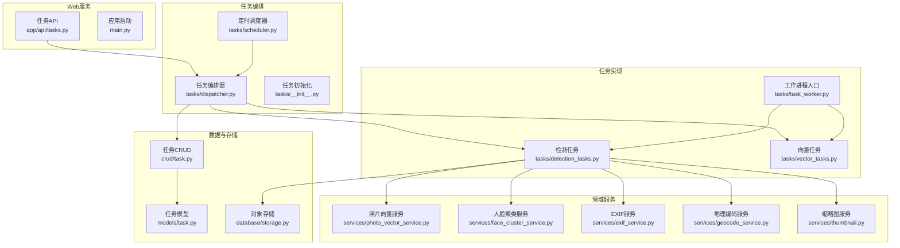

图表来源
- [backend/main.py](file://backend/main.py)
- [backend/app/tasks/dispatcher.py](file://backend/app/tasks/dispatcher.py)
- [backend/app/tasks/scheduler.py](file://backend/app/tasks/scheduler.py)
- [backend/app/tasks/task_worker.py](file://backend/app/tasks/task_worker.py)
- [backend/app/tasks/detection_tasks.py](file://backend/app/tasks/detection_tasks.py)
- [backend/app/tasks/vector_tasks.py](file://backend/app/tasks/vector_tasks.py)
- [backend/app/api/tasks.py](file://backend/app/api/tasks.py)
- [backend/app/models/task.py](file://backend/app/models/task.py)
- [backend/app/crud/task.py](file://backend/app/crud/task.py)
- [backend/app/database/storage.py](file://backend/app/database/storage.py)

章节来源
- [backend/main.py](file://backend/main.py)
- [backend/app/tasks/__init__.py](file://backend/app/tasks/__init__.py)
- [backend/app/tasks/dispatcher.py](file://backend/app/tasks/dispatcher.py)
- [backend/app/tasks/scheduler.py](file://backend/app/tasks/scheduler.py)
- [backend/app/tasks/task_worker.py](file://backend/app/tasks/task_worker.py)
- [backend/app/tasks/detection_tasks.py](file://backend/app/tasks/detection_tasks.py)
- [backend/app/tasks/vector_tasks.py](file://backend/app/tasks/vector_tasks.py)
- [backend/app/api/tasks.py](file://backend/app/api/tasks.py)
- [backend/app/models/task.py](file://backend/app/models/task.py)
- [backend/app/crud/task.py](file://backend/app/crud/task.py)
- [backend/app/database/storage.py](file://backend/app/database/storage.py)

## 核心组件
- 任务API：提供任务的提交、批量提交、状态查询、取消、重试、列表与分页等能力，作为外部调用入口。
- 任务编排器：统一的任务派发中心，负责参数校验、路由到具体任务、写入任务记录、设置优先级与重试策略。
- 定时调度器：基于周期性或Cron表达式触发任务，如定期扫描、清理、统计等。
- 任务实现：
  - 检测任务：图片人脸检测、元数据提取、地理编码、缩略图生成等。
  - 向量任务：图像特征抽取、向量入库、检索索引更新等。
- 工作进程：Celery Worker，按队列消费任务，执行业务逻辑并回写结果。
- 数据与存储：任务模型与CRUD、对象存储（图片/缩略图等）。

章节来源
- [backend/app/api/tasks.py](file://backend/app/api/tasks.py)
- [backend/app/tasks/dispatcher.py](file://backend/app/tasks/dispatcher.py)
- [backend/app/tasks/scheduler.py](file://backend/app/tasks/scheduler.py)
- [backend/app/tasks/detection_tasks.py](file://backend/app/tasks/detection_tasks.py)
- [backend/app/tasks/vector_tasks.py](file://backend/app/tasks/vector_tasks.py)
- [backend/app/tasks/task_worker.py](file://backend/app/tasks/task_worker.py)
- [backend/app/models/task.py](file://backend/app/models/task.py)
- [backend/app/crud/task.py](file://backend/app/crud/task.py)
- [backend/app/database/storage.py](file://backend/app/database/storage.py)

## 架构总览
下图展示了从请求进入、任务入队、Worker执行、结果落库到前端轮询的全链路流程。

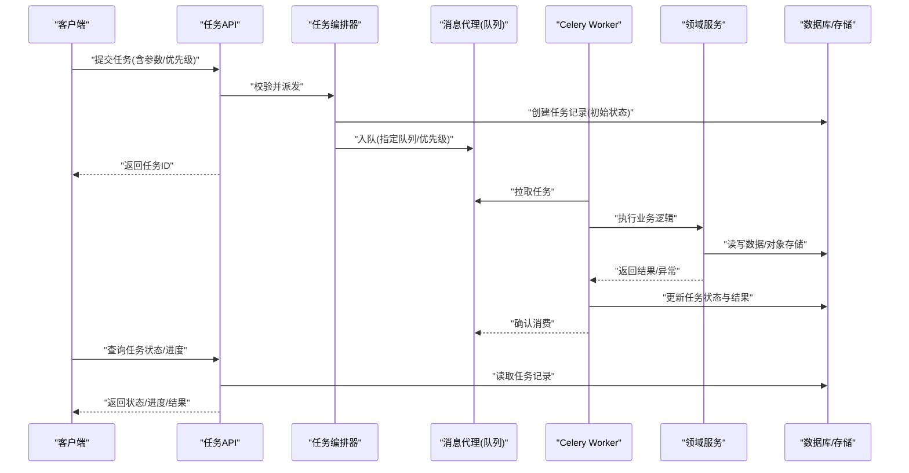

图表来源
- [backend/app/api/tasks.py](file://backend/app/api/tasks.py)
- [backend/app/tasks/dispatcher.py](file://backend/app/tasks/dispatcher.py)
- [backend/app/tasks/task_worker.py](file://backend/app/tasks/task_worker.py)
- [backend/app/models/task.py](file://backend/app/models/task.py)
- [backend/app/crud/task.py](file://backend/app/crud/task.py)
- [backend/app/database/storage.py](file://backend/app/database/storage.py)

## 详细组件分析

### 任务API（提交与查询）
职责
- 接收外部请求，校验参数，委托编排器派发任务
- 提供任务状态查询、重试、取消、列表分页等接口
- 返回任务ID供客户端后续查询

关键交互
- 提交任务：创建任务记录 -> 入队 -> 返回任务ID
- 查询任务：根据任务ID读取状态、进度、结果
- 重试/取消：根据任务状态进行相应操作

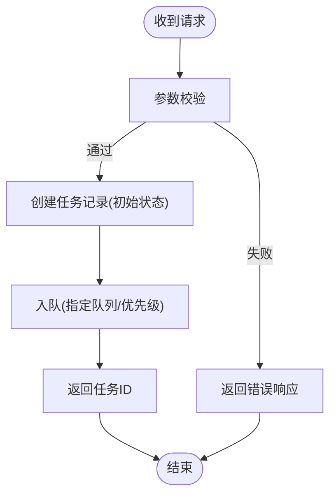

图表来源
- [backend/app/api/tasks.py](file://backend/app/api/tasks.py)
- [backend/app/tasks/dispatcher.py](file://backend/app/tasks/dispatcher.py)
- [backend/app/models/task.py](file://backend/app/models/task.py)
- [backend/app/crud/task.py](file://backend/app/crud/task.py)

章节来源
- [backend/app/api/tasks.py](file://backend/app/api/tasks.py)
- [backend/app/models/task.py](file://backend/app/models/task.py)
- [backend/app/crud/task.py](file://backend/app/crud/task.py)

### 任务编排器（Dispatcher）
职责
- 统一任务派发入口，支持多队列路由
- 设置任务优先级、重试次数、超时时间
- 维护任务上下文与追踪信息

设计要点
- 将不同业务域任务映射到对应队列，便于隔离与扩缩容
- 对长耗时任务设置合理超时与重试策略
- 在入队前持久化任务记录，保证可观测性与可恢复性

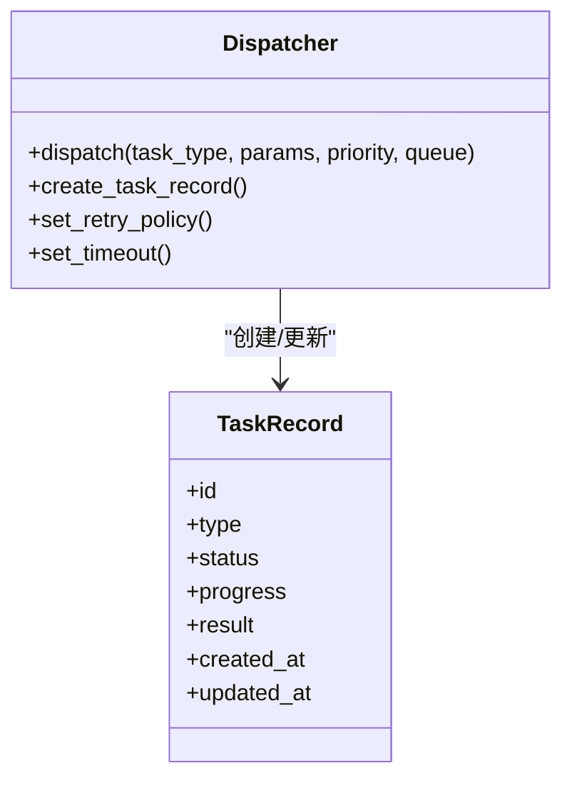

图表来源
- [backend/app/tasks/dispatcher.py](file://backend/app/tasks/dispatcher.py)
- [backend/app/models/task.py](file://backend/app/models/task.py)
- [backend/app/crud/task.py](file://backend/app/crud/task.py)

章节来源
- [backend/app/tasks/dispatcher.py](file://backend/app/tasks/dispatcher.py)
- [backend/app/models/task.py](file://backend/app/models/task.py)
- [backend/app/crud/task.py](file://backend/app/crud/task.py)

### 定时调度器（Scheduler）
职责
- 注册周期性任务（如每日统计、索引重建、清理过期数据）
- 基于Cron或固定间隔触发任务派发

典型用法
- 在应用启动时注册定时任务
- 将定时触发的任务交由编排器统一入队

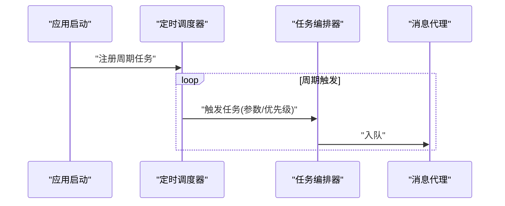

图表来源
- [backend/app/tasks/scheduler.py](file://backend/app/tasks/scheduler.py)
- [backend/app/tasks/dispatcher.py](file://backend/app/tasks/dispatcher.py)

章节来源
- [backend/app/tasks/scheduler.py](file://backend/app/tasks/scheduler.py)
- [backend/app/tasks/dispatcher.py](file://backend/app/tasks/dispatcher.py)

### 任务实现：检测任务（Detection Tasks）
职责
- 图片人脸检测、元数据提取、地理编码、缩略图生成等
- 协调多个领域服务完成端到端处理

依赖服务
- 人脸聚类服务
- EXIF服务
- 地理编码服务
- 缩略图服务

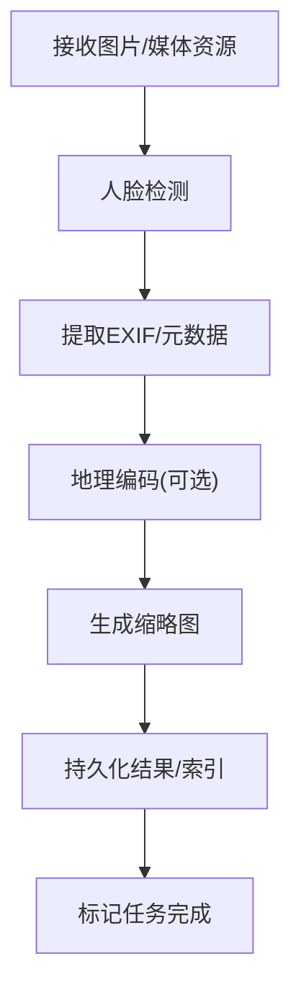

图表来源
- [backend/app/tasks/detection_tasks.py](file://backend/app/tasks/detection_tasks.py)
- [backend/app/services/face_cluster_service.py](file://backend/app/services/face_cluster_service.py)
- [backend/app/services/exif_service.py](file://backend/app/services/exif_service.py)
- [backend/app/services/geocode_service.py](file://backend/app/services/geocode_service.py)
- [backend/app/services/thumbnail.py](file://backend/app/services/thumbnail.py)

章节来源
- [backend/app/tasks/detection_tasks.py](file://backend/app/tasks/detection_tasks.py)
- [backend/app/services/face_cluster_service.py](file://backend/app/services/face_cluster_service.py)
- [backend/app/services/exif_service.py](file://backend/app/services/exif_service.py)
- [backend/app/services/geocode_service.py](file://backend/app/services/geocode_service.py)
- [backend/app/services/thumbnail.py](file://backend/app/services/thumbnail.py)

### 任务实现：向量任务（Vector Tasks）
职责
- 图像特征抽取、向量入库、检索索引更新
- 与向量服务协作，确保一致性

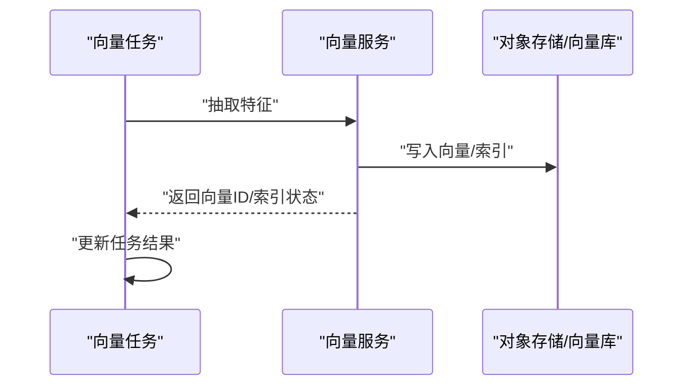

图表来源
- [backend/app/tasks/vector_tasks.py](file://backend/app/tasks/vector_tasks.py)
- [backend/app/services/photo_vector_service.py](file://backend/app/services/photo_vector_service.py)

章节来源
- [backend/app/tasks/vector_tasks.py](file://backend/app/tasks/vector_tasks.py)
- [backend/app/services/photo_vector_service.py](file://backend/app/services/photo_vector_service.py)

### 工作进程（Worker）
职责
- Celery Worker进程，按队列消费任务
- 执行任务逻辑、更新状态、处理异常与重试

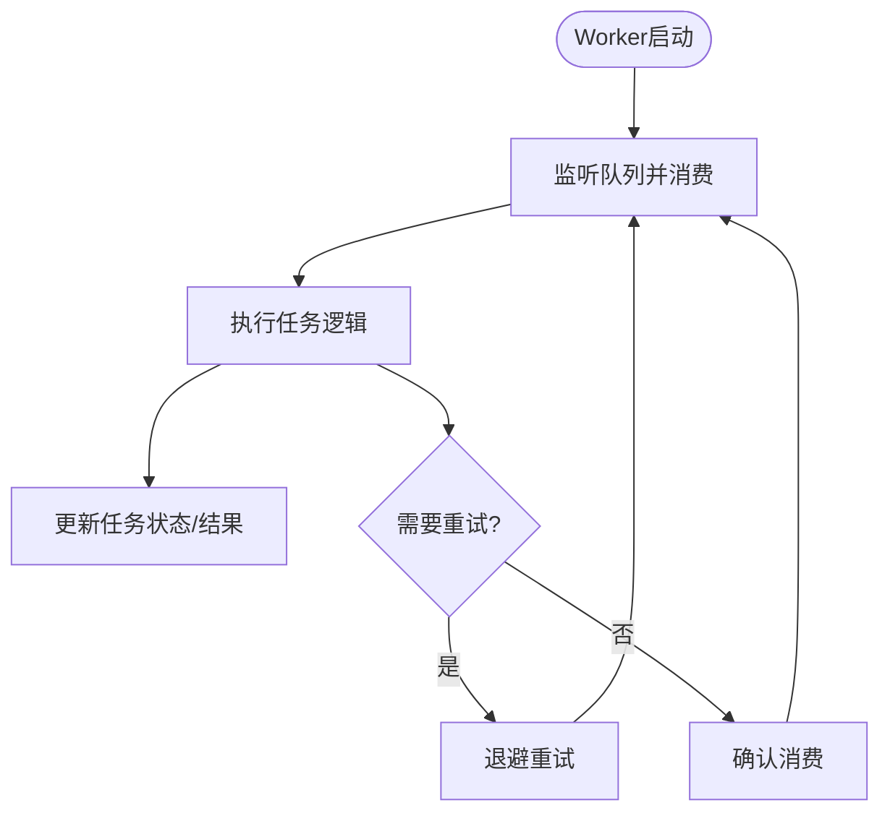

图表来源
- [backend/app/tasks/task_worker.py](file://backend/app/tasks/task_worker.py)

章节来源
- [backend/app/tasks/task_worker.py](file://backend/app/tasks/task_worker.py)

### 任务模型与CRUD
职责
- 定义任务实体字段（类型、状态、进度、结果、时间戳等）
- 提供任务记录的增删改查能力

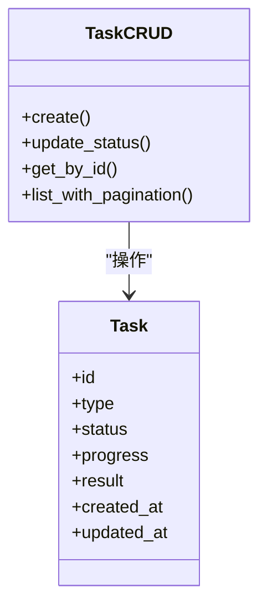

图表来源
- [backend/app/models/task.py](file://backend/app/models/task.py)
- [backend/app/crud/task.py](file://backend/app/crud/task.py)

章节来源
- [backend/app/models/task.py](file://backend/app/models/task.py)
- [backend/app/crud/task.py](file://backend/app/crud/task.py)

### 配置与日志
- 配置项：包括队列名称、并发数、重试策略、超时、日志级别等
- 日志：结构化日志输出，便于追踪任务执行路径与性能指标

章节来源
- [backend/app/config/settings.py](file://backend/app/config/settings.py)
- [backend/app/core/logger.py](file://backend/app/core/logger.py)

## 依赖关系分析
- API层依赖编排器与任务模型/CRUD
- 编排器依赖任务实现与持久化
- 任务实现依赖领域服务与存储
- 定时调度器依赖编排器
- Worker依赖任务实现与持久化

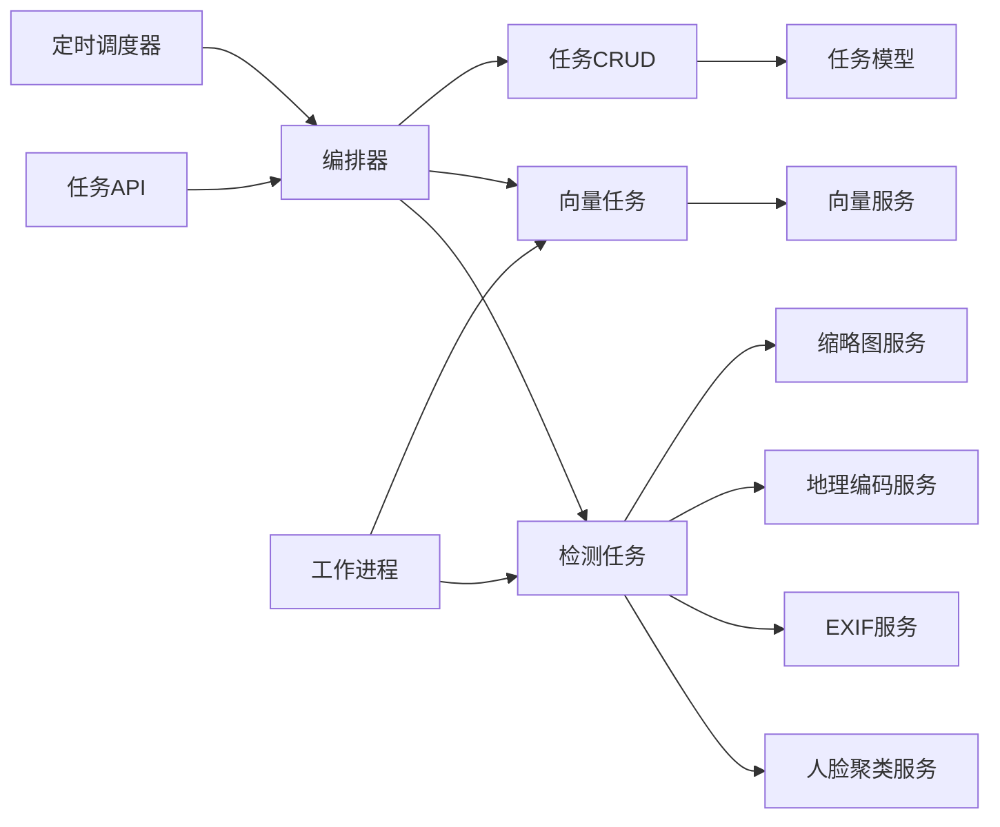

图表来源
- [backend/app/api/tasks.py](file://backend/app/api/tasks.py)
- [backend/app/tasks/dispatcher.py](file://backend/app/tasks/dispatcher.py)
- [backend/app/tasks/scheduler.py](file://backend/app/tasks/scheduler.py)
- [backend/app/tasks/detection_tasks.py](file://backend/app/tasks/detection_tasks.py)
- [backend/app/tasks/vector_tasks.py](file://backend/app/tasks/vector_tasks.py)
- [backend/app/tasks/task_worker.py](file://backend/app/tasks/task_worker.py)
- [backend/app/models/task.py](file://backend/app/models/task.py)
- [backend/app/crud/task.py](file://backend/app/crud/task.py)
- [backend/app/services/face_cluster_service.py](file://backend/app/services/face_cluster_service.py)
- [backend/app/services/exif_service.py](file://backend/app/services/exif_service.py)
- [backend/app/services/geocode_service.py](file://backend/app/services/geocode_service.py)
- [backend/app/services/thumbnail.py](file://backend/app/services/thumbnail.py)
- [backend/app/services/photo_vector_service.py](file://backend/app/services/photo_vector_service.py)

章节来源
- [backend/app/api/tasks.py](file://backend/app/api/tasks.py)
- [backend/app/tasks/dispatcher.py](file://backend/app/tasks/dispatcher.py)
- [backend/app/tasks/scheduler.py](file://backend/app/tasks/scheduler.py)
- [backend/app/tasks/detection_tasks.py](file://backend/app/tasks/detection_tasks.py)
- [backend/app/tasks/vector_tasks.py](file://backend/app/tasks/vector_tasks.py)
- [backend/app/tasks/task_worker.py](file://backend/app/tasks/task_worker.py)
- [backend/app/models/task.py](file://backend/app/models/task.py)
- [backend/app/crud/task.py](file://backend/app/crud/task.py)
- [backend/app/services/face_cluster_service.py](file://backend/app/services/face_cluster_service.py)
- [backend/app/services/exif_service.py](file://backend/app/services/exif_service.py)
- [backend/app/services/geocode_service.py](file://backend/app/services/geocode_service.py)
- [backend/app/services/thumbnail.py](file://backend/app/services/thumbnail.py)
- [backend/app/services/photo_vector_service.py](file://backend/app/services/photo_vector_service.py)

## 性能与扩展性
- 队列隔离：将不同业务域任务分配到独立队列，避免热点阻塞
- 并发控制：根据CPU/GPU与I/O特性调整Worker并发度
- 优先级：高优先级任务优先消费，保障SLA
- 重试与退避：对瞬时失败采用指数退避重试，降低抖动影响
- 超时保护：长耗时任务设置合理超时，防止僵尸任务占用资源
- 水平扩展：增加Worker实例提升吞吐；按队列维度横向扩容
- 批处理：对批量任务进行分片与合并，减少频繁IO与锁竞争
- 缓存与索引：对热点数据建立缓存，缩短响应时间

[本节为通用指导，不直接分析具体文件]

## 故障排查指南
- 任务未执行
  - 检查队列是否被正确订阅，Worker是否在线
  - 查看任务记录状态是否为“等待/失败”，确认入队成功
- 任务反复失败
  - 检查重试策略与退避时间，定位异常堆栈
  - 验证依赖服务可用性（人脸检测、向量库、对象存储）
- 任务超时
  - 调整任务超时阈值与Worker超时配置
  - 优化任务内部逻辑，拆分大任务为子任务
- 进度不更新
  - 确认任务在执行过程中持续更新进度字段
  - 检查数据库连接与事务提交
- 日志缺失
  - 检查日志级别与输出目标
  - 确认任务执行路径包含必要日志点

章节来源
- [backend/app/core/logger.py](file://backend/app/core/logger.py)
- [backend/app/models/task.py](file://backend/app/models/task.py)
- [backend/app/crud/task.py](file://backend/app/crud/task.py)

## 结论
该任务调度系统通过清晰的层次划分与职责分离，实现了高内聚、低耦合的可扩展架构。借助队列隔离、优先级与重试机制，系统在稳定性与吞吐之间取得平衡。结合完善的日志与状态跟踪，运维与排障效率显著提升。建议在生产环境中结合监控告警与容量规划，持续优化队列与Worker规模，确保系统在高负载下稳定运行。

[本节为总结性内容，不直接分析具体文件]

## 附录

### 任务生命周期与状态机
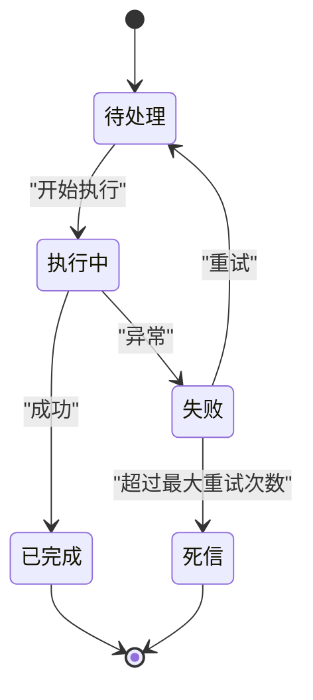

[此图为概念性状态机，不直接映射具体源码文件]

### 最佳实践清单
- 明确任务边界，单一职责，避免跨域副作用
- 幂等设计：任务可重复执行且不影响最终一致性
- 参数校验前置，失败快速返回
- 合理设置超时与重试，避免雪崩
- 使用独立队列隔离热点与重型任务
- 完善日志与指标采集，便于追踪与告警
- 定期清理历史任务记录与中间产物

[本节为通用指导，不直接分析具体文件]