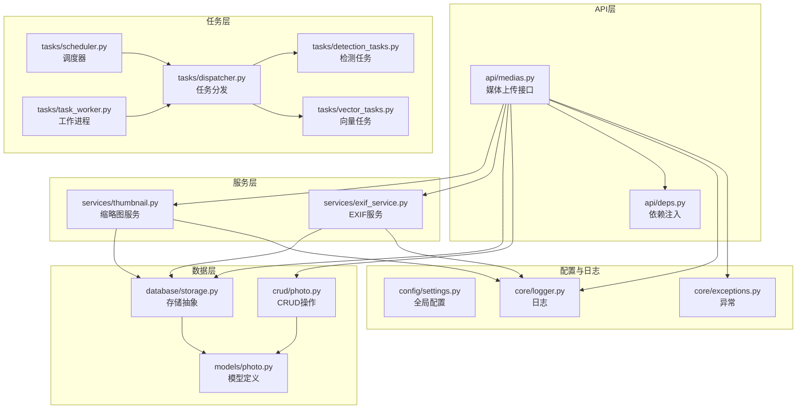
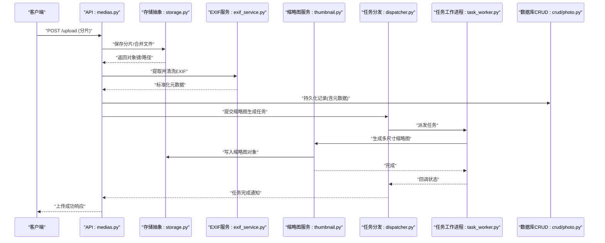
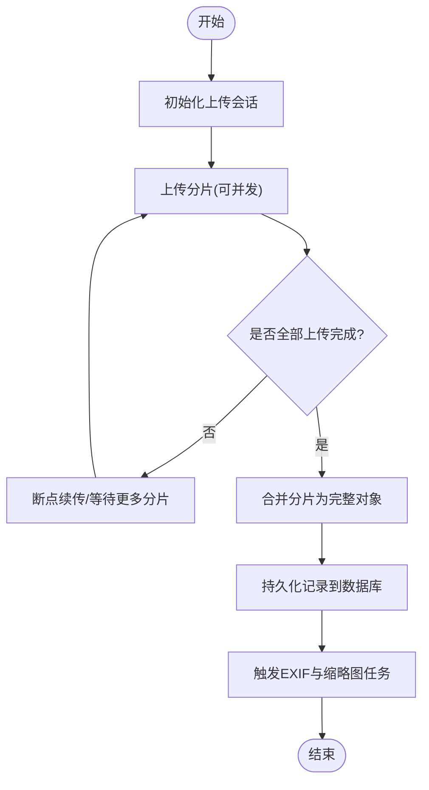
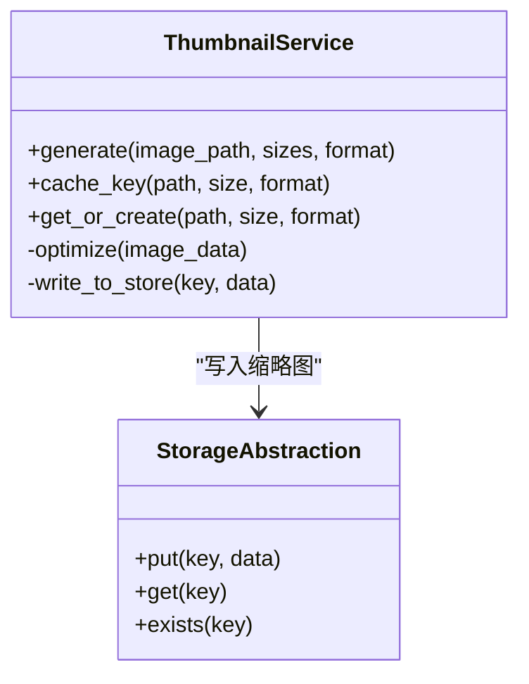
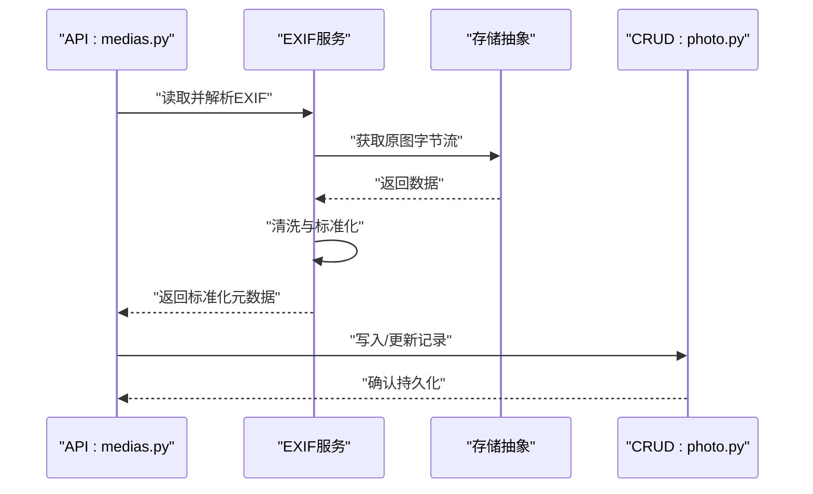
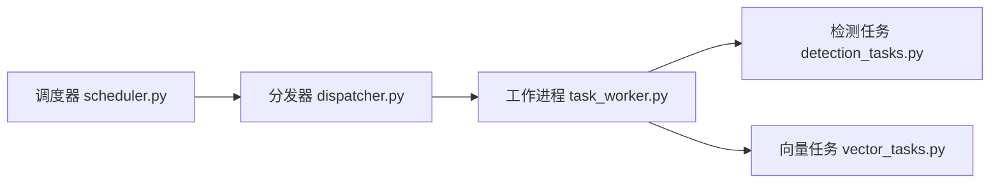
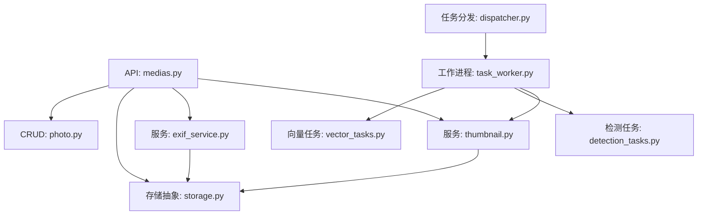

# 文件存储管理

<cite>
**本文引用的文件**   
- [backend/app/database/storage.py](file://backend/app/database/storage.py)
- [backend/app/config/settings.py](file://backend/app/config/settings.py)
- [backend/app/api/medias.py](file://backend/app/api/medias.py)
- [backend/app/services/thumbnail.py](file://backend/app/services/thumbnail.py)
- [backend/app/services/exif_service.py](file://backend/app/services/exif_service.py)
- [backend/app/models/photo.py](file://backend/app/models/photo.py)
- [backend/app/crud/photo.py](file://backend/app/crud/photo.py)
- [backend/app/tasks/detection_tasks.py](file://backend/app/tasks/detection_tasks.py)
- [backend/app/tasks/vector_tasks.py](file://backend/app/tasks/vector_tasks.py)
- [backend/app/tasks/dispatcher.py](file://backend/app/tasks/dispatcher.py)
- [backend/app/tasks/scheduler.py](file://backend/app/tasks/scheduler.py)
- [backend/app/tasks/task_worker.py](file://backend/app/tasks/task_worker.py)
- [backend/app/core/logger.py](file://backend/app/core/logger.py)
- [backend/app/core/exceptions.py](file://backend/app/core/exceptions.py)
- [backend/app/api/deps.py](file://backend/app/api/deps.py)
</cite>

## 目录
1. [简介](#简介)
2. [项目结构](#项目结构)
3. [核心组件](#核心组件)
4. [架构总览](#架构总览)
5. [详细组件分析](#详细组件分析)
6. [依赖关系分析](#依赖关系分析)
7. [性能考虑](#性能考虑)
8. [故障排查指南](#故障排查指南)
9. [结论](#结论)
10. [附录](#附录)

## 简介
本文件围绕“AI相册”后端的文件存储管理系统进行系统化文档化，重点覆盖：
- 对象存储架构设计（本地、S3、MinIO）
- 文件上传处理流程（分片上传、断点续传、并发控制、错误重试）
- 存储策略（目录规划、命名规则、版本管理、清理策略）
- 缩略图生成服务（图像处理库、尺寸配置、格式优化、缓存）
- EXIF元数据提取与处理（清洗、标准化、索引）
- 存储性能优化、监控告警与故障恢复方案

## 项目结构
后端采用分层架构：API层负责请求路由与校验；服务层封装业务逻辑；任务层异步处理耗时操作（如缩略图、向量检索等）；数据库层提供持久化与存储抽象。

图表来源
- [backend/app/api/medias.py](file://backend/app/api/medias.py)
- [backend/app/services/thumbnail.py](file://backend/app/services/thumbnail.py)
- [backend/app/services/exif_service.py](file://backend/app/services/exif_service.py)
- [backend/app/database/storage.py](file://backend/app/database/storage.py)
- [backend/app/models/photo.py](file://backend/app/models/photo.py)
- [backend/app/crud/photo.py](file://backend/app/crud/photo.py)
- [backend/app/tasks/detection_tasks.py](file://backend/app/tasks/detection_tasks.py)
- [backend/app/tasks/vector_tasks.py](file://backend/app/tasks/vector_tasks.py)
- [backend/app/tasks/dispatcher.py](file://backend/app/tasks/dispatcher.py)
- [backend/app/tasks/scheduler.py](file://backend/app/tasks/scheduler.py)
- [backend/app/tasks/task_worker.py](file://backend/app/tasks/task_worker.py)
- [backend/app/config/settings.py](file://backend/app/config/settings.py)
- [backend/app/core/logger.py](file://backend/app/core/logger.py)
- [backend/app/core/exceptions.py](file://backend/app/core/exceptions.py)

章节来源
- [backend/app/api/medias.py](file://backend/app/api/medias.py)
- [backend/app/database/storage.py](file://backend/app/database/storage.py)
- [backend/app/config/settings.py](file://backend/app/config/settings.py)

## 核心组件
- 存储抽象层：统一封装本地磁盘与云对象存储（S3/MinIO）的读写能力，对外暴露一致的上传、下载、删除、列表等接口。
- 媒体上传API：接收前端上传请求，支持分片合并、并发控制、断点续传、错误重试，并触发后续异步任务。
- 缩略图服务：基于图像处理库生成多尺寸缩略图，支持格式优化与缓存策略。
- EXIF服务：读取并清洗EXIF元数据，进行标准化处理，写入数据库索引以便检索。
- 任务系统：使用调度器与工作进程异步执行缩略图生成、向量嵌入、人脸检测等耗时任务。
- 配置与日志：集中式配置管理与结构化日志输出，便于排障与监控。

章节来源
- [backend/app/database/storage.py](file://backend/app/database/storage.py)
- [backend/app/api/medias.py](file://backend/app/api/medias.py)
- [backend/app/services/thumbnail.py](file://backend/app/services/thumbnail.py)
- [backend/app/services/exif_service.py](file://backend/app/services/exif_service.py)
- [backend/app/tasks/dispatcher.py](file://backend/app/tasks/dispatcher.py)
- [backend/app/tasks/scheduler.py](file://backend/app/tasks/scheduler.py)
- [backend/app/tasks/task_worker.py](file://backend/app/tasks/task_worker.py)
- [backend/app/config/settings.py](file://backend/app/config/settings.py)
- [backend/app/core/logger.py](file://backend/app/core/logger.py)

## 架构总览
整体采用“API + 服务 + 任务 + 存储抽象”的分层模式，通过依赖注入将配置、存储、日志等横切关注点贯穿各层。

图表来源
- [backend/app/api/medias.py](file://backend/app/api/medias.py)
- [backend/app/database/storage.py](file://backend/app/database/storage.py)
- [backend/app/services/exif_service.py](file://backend/app/services/exif_service.py)
- [backend/app/services/thumbnail.py](file://backend/app/services/thumbnail.py)
- [backend/app/tasks/dispatcher.py](file://backend/app/tasks/dispatcher.py)
- [backend/app/tasks/task_worker.py](file://backend/app/tasks/task_worker.py)
- [backend/app/crud/photo.py](file://backend/app/crud/photo.py)

## 详细组件分析

### 存储抽象层（本地/S3/MinIO）
- 设计要点
  - 统一接口：提供统一的上传、下载、删除、存在性检查、列表等接口，屏蔽底层差异。
  - 后端选择：根据配置动态切换本地文件系统或S3兼容存储（包括MinIO）。
  - 路径与命名：按日期/类型/哈希组合生成稳定且可预测的对象键，避免冲突并利于分片与断点续传。
  - 分片与续传：支持分片上传与断点续传，服务端维护分片状态，合并时幂等。
  - 并发与限流：对并发写入进行限制，避免I/O瓶颈；对大文件采用流式写入。
  - 错误重试：网络异常与临时错误自动重试，带退避策略。
- 关键实现位置
  - 存储抽象与后端实现：[backend/app/database/storage.py](file://backend/app/database/storage.py)
  - 配置项（存储后端、桶名、访问密钥、端点等）：[backend/app/config/settings.py](file://backend/app/config/settings.py)

章节来源
- [backend/app/database/storage.py](file://backend/app/database/storage.py)
- [backend/app/config/settings.py](file://backend/app/config/settings.py)

### 媒体上传API（分片/断点续传/并发/重试）
- 功能概述
  - 初始化分片：创建上传会话，返回会话ID与分片大小。
  - 上传分片：客户端按序或乱序上传分片，服务端落盘并记录进度。
  - 合并分片：所有分片完成后触发合并，生成最终对象键并持久化记录。
  - 并发控制：限制同时处理的上传会话数量与单会话并发分片数。
  - 错误重试：对网络抖动、超时等错误进行指数退避重试。
  - 断点续传：支持中断后从上次分片继续，避免重复传输。
- 调用流程
  - 初始化 -> 上传分片 -> 合并 -> 触发EXIF与缩略图任务 -> 返回结果

图表来源
- [backend/app/api/medias.py](file://backend/app/api/medias.py)
- [backend/app/database/storage.py](file://backend/app/database/storage.py)
- [backend/app/tasks/dispatcher.py](file://backend/app/tasks/dispatcher.py)

章节来源
- [backend/app/api/medias.py](file://backend/app/api/medias.py)
- [backend/app/database/storage.py](file://backend/app/database/storage.py)
- [backend/app/tasks/dispatcher.py](file://backend/app/tasks/dispatcher.py)

### 缩略图生成服务
- 功能概述
  - 图像解码与缩放：基于图像处理库生成多种尺寸的缩略图。
  - 格式优化：在保持质量的前提下压缩体积，必要时转换格式。
  - 缓存机制：命中缓存则直接返回，未命中则生成并缓存。
  - 异步执行：由任务系统调度，避免阻塞上传主流程。
- 关键实现位置
  - 缩略图服务：[backend/app/services/thumbnail.py](file://backend/app/services/thumbnail.py)
  - 任务派发与工作进程：[backend/app/tasks/dispatcher.py](file://backend/app/tasks/dispatcher.py), [backend/app/tasks/task_worker.py](file://backend/app/tasks/task_worker.py)

图表来源
- [backend/app/services/thumbnail.py](file://backend/app/services/thumbnail.py)
- [backend/app/database/storage.py](file://backend/app/database/storage.py)

章节来源
- [backend/app/services/thumbnail.py](file://backend/app/services/thumbnail.py)
- [backend/app/tasks/dispatcher.py](file://backend/app/tasks/dispatcher.py)
- [backend/app/tasks/task_worker.py](file://backend/app/tasks/task_worker.py)
- [backend/app/database/storage.py](file://backend/app/database/storage.py)

### EXIF元数据提取与处理
- 功能概述
  - 数据提取：从原图中读取EXIF字段（拍摄时间、设备、GPS等）。
  - 数据清洗：去除无效值、修正时区、规范化单位。
  - 标准化：统一字段命名与格式，便于检索与展示。
  - 索引建立：将标准化后的元数据写入数据库，供查询与筛选。
- 关键实现位置
  - EXIF服务：[backend/app/services/exif_service.py](file://backend/app/services/exif_service.py)
  - 照片模型与CRUD：[backend/app/models/photo.py](file://backend/app/models/photo.py), [backend/app/crud/photo.py](file://backend/app/crud/photo.py)

图表来源
- [backend/app/services/exif_service.py](file://backend/app/services/exif_service.py)
- [backend/app/database/storage.py](file://backend/app/database/storage.py)
- [backend/app/crud/photo.py](file://backend/app/crud/photo.py)

章节来源
- [backend/app/services/exif_service.py](file://backend/app/services/exif_service.py)
- [backend/app/models/photo.py](file://backend/app/models/photo.py)
- [backend/app/crud/photo.py](file://backend/app/crud/photo.py)

### 任务系统与异步处理
- 组件职责
  - 调度器：负责任务队列与调度策略。
  - 分发器：将任务派发到具体工作进程。
  - 工作进程：执行具体任务（缩略图、向量嵌入、人脸检测等）。
- 关键实现位置
  - 调度器：[backend/app/tasks/scheduler.py](file://backend/app/tasks/scheduler.py)
  - 分发器：[backend/app/tasks/dispatcher.py](file://backend/app/tasks/dispatcher.py)
  - 工作进程：[backend/app/tasks/task_worker.py](file://backend/app/tasks/task_worker.py)
  - 检测任务：[backend/app/tasks/detection_tasks.py](file://backend/app/tasks/detection_tasks.py)
  - 向量任务：[backend/app/tasks/vector_tasks.py](file://backend/app/tasks/vector_tasks.py)

图表来源
- [backend/app/tasks/scheduler.py](file://backend/app/tasks/scheduler.py)
- [backend/app/tasks/dispatcher.py](file://backend/app/tasks/dispatcher.py)
- [backend/app/tasks/task_worker.py](file://backend/app/tasks/task_worker.py)
- [backend/app/tasks/detection_tasks.py](file://backend/app/tasks/detection_tasks.py)
- [backend/app/tasks/vector_tasks.py](file://backend/app/tasks/vector_tasks.py)

章节来源
- [backend/app/tasks/scheduler.py](file://backend/app/tasks/scheduler.py)
- [backend/app/tasks/dispatcher.py](file://backend/app/tasks/dispatcher.py)
- [backend/app/tasks/task_worker.py](file://backend/app/tasks/task_worker.py)
- [backend/app/tasks/detection_tasks.py](file://backend/app/tasks/detection_tasks.py)
- [backend/app/tasks/vector_tasks.py](file://backend/app/tasks/vector_tasks.py)

### 配置与依赖注入
- 配置项
  - 存储后端选择、桶名、访问密钥、端点、本地根目录、并发参数、重试策略等。
- 依赖注入
  - 通过依赖注入模块在各层复用配置、存储实例、日志器等。
- 关键实现位置
  - 配置：[backend/app/config/settings.py](file://backend/app/config/settings.py)
  - 依赖注入：[backend/app/api/deps.py](file://backend/app/api/deps.py)

章节来源
- [backend/app/config/settings.py](file://backend/app/config/settings.py)
- [backend/app/api/deps.py](file://backend/app/api/deps.py)

## 依赖关系分析
- 组件耦合
  - API层依赖服务层与存储抽象，服务层依赖存储抽象与数据库CRUD。
  - 任务系统解耦于API主流程，通过分发器与工作进程异步执行。
- 外部依赖
  - 对象存储后端（本地文件系统、S3/MinIO）。
  - 图像处理库（用于缩略图生成）。
  - 数据库驱动（用于元数据与任务状态持久化）。
- 潜在循环依赖
  - 通过依赖注入与接口抽象避免循环引用，确保单向依赖。

图表来源
- [backend/app/api/medias.py](file://backend/app/api/medias.py)
- [backend/app/services/thumbnail.py](file://backend/app/services/thumbnail.py)
- [backend/app/services/exif_service.py](file://backend/app/services/exif_service.py)
- [backend/app/database/storage.py](file://backend/app/database/storage.py)
- [backend/app/crud/photo.py](file://backend/app/crud/photo.py)
- [backend/app/tasks/dispatcher.py](file://backend/app/tasks/dispatcher.py)
- [backend/app/tasks/task_worker.py](file://backend/app/tasks/task_worker.py)
- [backend/app/tasks/detection_tasks.py](file://backend/app/tasks/detection_tasks.py)
- [backend/app/tasks/vector_tasks.py](file://backend/app/tasks/vector_tasks.py)

章节来源
- [backend/app/api/medias.py](file://backend/app/api/medias.py)
- [backend/app/database/storage.py](file://backend/app/database/storage.py)
- [backend/app/tasks/dispatcher.py](file://backend/app/tasks/dispatcher.py)

## 性能考虑
- I/O优化
  - 使用流式读写减少内存占用；对大文件启用分块传输。
  - 合理设置并发度与连接池，避免过度竞争导致吞吐下降。
- 计算优化
  - 缩略图生成采用多线程/多进程并行；按需生成不同尺寸。
  - 引入缓存层（内存/对象存储）减少重复计算与I/O。
- 存储优化
  - 对象键命名遵循前缀+哈希策略，提升分布均匀性与检索效率。
  - 定期清理无用分片与过期缩略图，释放空间。
- 监控与告警
  - 关键指标：上传成功率、平均耗时、失败率、存储容量、任务队列长度。
  - 告警阈值：失败率突增、队列积压、存储空间不足。

## 故障排查指南
- 常见问题
  - 上传失败：检查网络连通性、存储后端配置、权限与配额。
  - 缩略图生成失败：确认图像处理库可用、输入格式支持、目标路径可写。
  - EXIF解析异常：过滤不支持的标签与损坏头，记录异常上下文。
  - 任务堆积：检查工作进程健康、资源占用与依赖服务可用性。
- 定位手段
  - 查看结构化日志，结合请求ID追踪链路。
  - 检查任务状态与重试次数，定位失败原因。
  - 验证存储后端健康与对象存在性。
- 关键实现位置
  - 日志：[backend/app/core/logger.py](file://backend/app/core/logger.py)
  - 异常定义：[backend/app/core/exceptions.py](file://backend/app/core/exceptions.py)

章节来源
- [backend/app/core/logger.py](file://backend/app/core/logger.py)
- [backend/app/core/exceptions.py](file://backend/app/core/exceptions.py)

## 结论
本文件存储管理系统以“存储抽象 + 服务 + 任务”为核心，实现了高可用的对象存储接入、可靠的分片上传与断点续传、高效的缩略图生成与EXIF处理，并通过任务系统解耦耗时操作。配合完善的配置、日志与监控，可在本地与云端环境灵活部署，满足大规模图片管理的性能与稳定性需求。

## 附录
- 存储策略建议
  - 目录结构：按年/月/日/类型组织，便于归档与清理。
  - 命名规则：包含原始文件名哈希与扩展名，保证唯一性与可读性。
  - 版本管理：对重要原图保留历史版本，缩略图可按尺寸独立版本。
  - 清理策略：定时清理孤立分片、过期缩略图与回收站中的文件。
- 监控指标清单
  - 上传：QPS、成功率、P95/P99延迟、失败原因分布。
  - 存储：容量使用率、对象数量、冷热比例。
  - 任务：队列长度、处理时长、失败重试次数。
- 故障恢复方案
  - 自动重试与退避；失败任务进入死信队列人工干预。
  - 存储后端故障切换与降级（本地回退）。
  - 定期备份与快照，支持快速恢复。