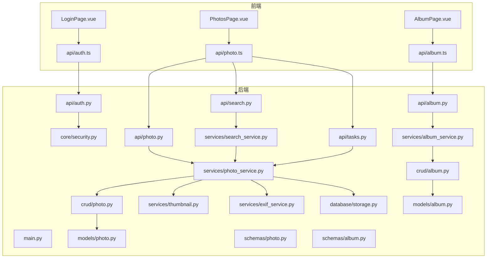
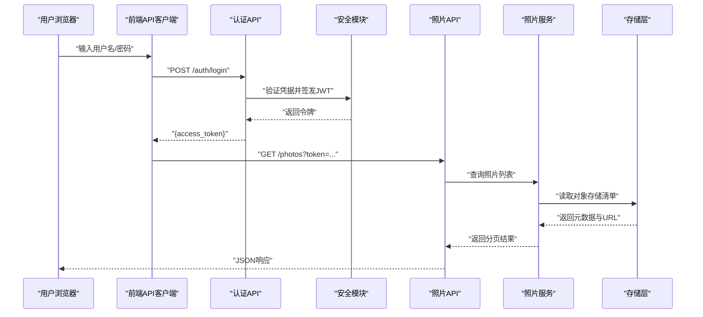
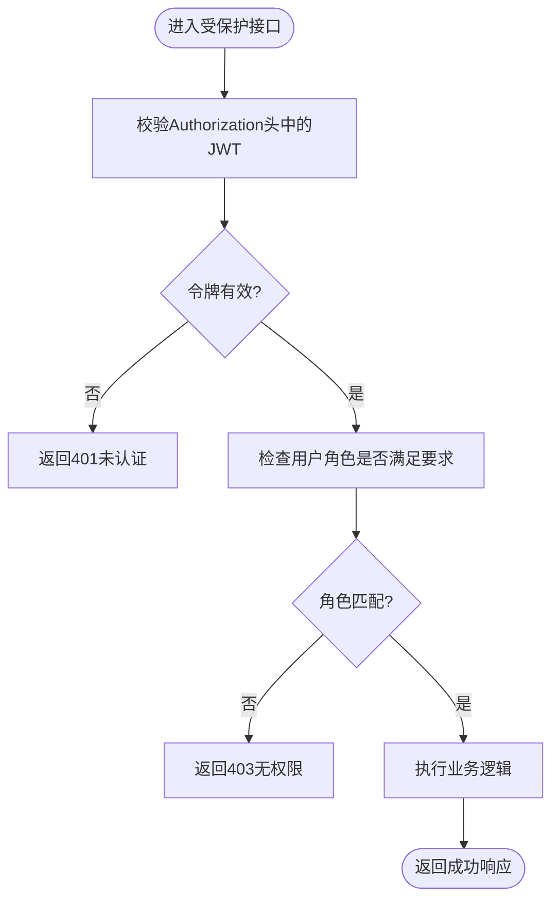
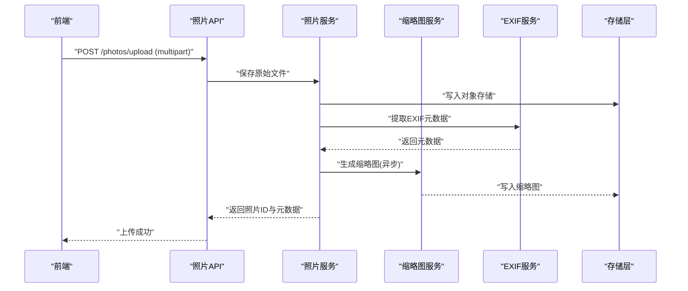
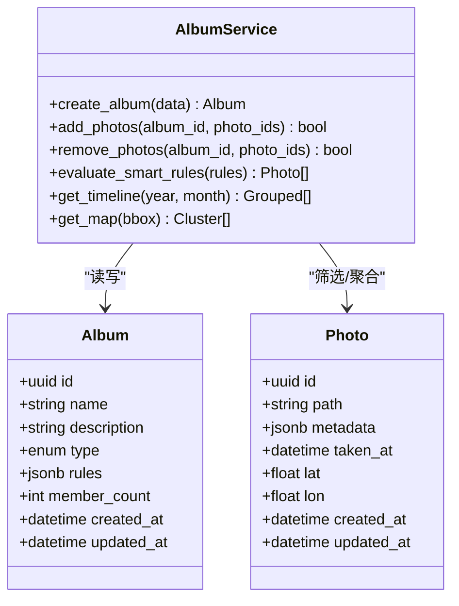
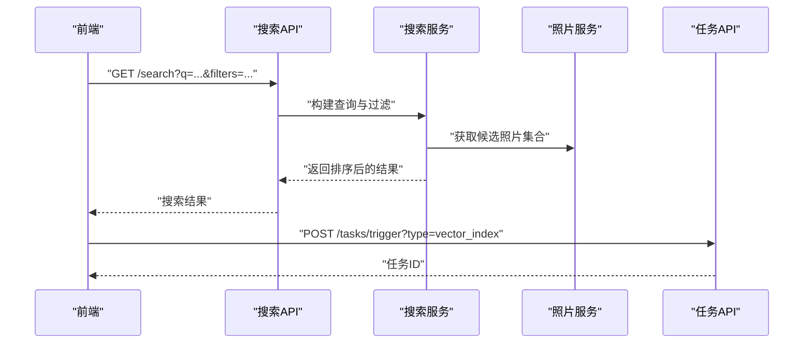
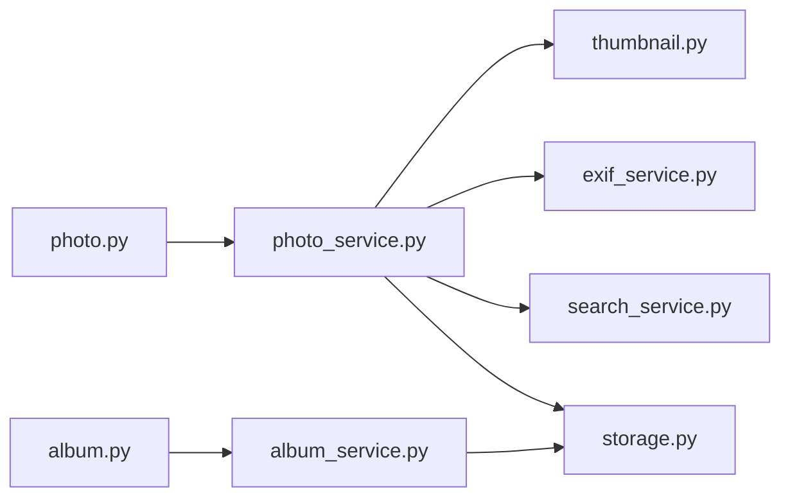

# 核心功能模块

<cite>
**本文引用的文件**   
- [backend/main.py](file://backend/main.py)
- [backend/app/api/auth.py](file://backend/app/api/auth.py)
- [backend/app/api/album.py](file://backend/app/api/album.py)
- [backend/app/api/photo.py](file://backend/app/api/photo.py)
- [backend/app/api/medias.py](file://backend/app/api/medias.py)
- [backend/app/api/search.py](file://backend/app/api/search.py)
- [backend/app/api/tasks.py](file://backend/app/api/tasks.py)
- [backend/app/crud/album.py](file://backend/app/crud/album.py)
- [backend/app/crud/photo.py](file://backend/app/crud/photo.py)
- [backend/app/models/album.py](file://backend/app/models/album.py)
- [backend/app/models/photo.py](file://backend/app/models/photo.py)
- [backend/app/schemas/album.py](file://backend/app/schemas/album.py)
- [backend/app/schemas/photo.py](file://backend/app/schemas/photo.py)
- [backend/app/services/album_service.py](file://backend/app/services/album_service.py)
- [backend/app/services/photo_service.py](file://backend/app/services/photo_service.py)
- [backend/app/services/exif_service.py](file://backend/app/services/exif_service.py)
- [backend/app/services/thumbnail.py](file://backend/app/services/thumbnail.py)
- [backend/app/services/search_service.py](file://backend/app/services/search_service.py)
- [backend/app/core/security.py](file://backend/app/core/security.py)
- [backend/app/database/storage.py](file://backend/app/database/storage.py)
- [frontend/src/api/auth.ts](file://frontend/src/api/auth.ts)
- [frontend/src/api/album.ts](file://frontend/src/api/album.ts)
- [frontend/src/api/photo.ts](file://frontend/src/api/photo.ts)
- [frontend/src/views/LoginPage.vue](file://frontend/src/views/LoginPage.vue)
- [frontend/src/views/PhotosPage.vue](file://frontend/src/views/PhotosPage.vue)
- [frontend/src/views/AlbumPage.vue](file://frontend/src/views/AlbumPage.vue)
</cite>

## 目录
1. [简介](#简介)
2. [项目结构](#项目结构)
3. [核心组件](#核心组件)
4. [架构总览](#架构总览)
5. [详细组件分析](#详细组件分析)
6. [依赖关系分析](#依赖关系分析)
7. [性能考虑](#性能考虑)
8. [故障排查指南](#故障排查指南)
9. [结论](#结论)
10. [附录](#附录)

## 简介
本文件聚焦照片管理系统的核心功能模块，覆盖以下能力：
- 照片上传、下载与批量操作
- 元数据提取（EXIF）与缩略图生成
- 相册组织：手动创建、智能相册自动分类、时间线视图、地图视图
- 用户认证与权限控制：JWT令牌管理、角色权限与安全策略
- 各模块API接口说明、业务逻辑流程与数据处理方式
- 使用示例与常见问题解决方案

## 项目结构
后端采用分层架构：API层负责路由与请求校验，服务层封装业务逻辑，CRUD层对接数据库模型，存储层抽象对象存储。前端通过TypeScript API客户端调用后端REST接口，并提供登录、相册、照片等页面。

图表来源
- [backend/main.py:1-200](file://backend/main.py#L1-L200)
- [backend/app/api/auth.py:1-200](file://backend/app/api/auth.py#L1-L200)
- [backend/app/api/photo.py:1-200](file://backend/app/api/photo.py#L1-L200)
- [backend/app/api/album.py:1-200](file://backend/app/api/album.py#L1-L200)
- [backend/app/api/search.py:1-200](file://backend/app/api/search.py#L1-L200)
- [backend/app/api/tasks.py:1-200](file://backend/app/api/tasks.py#L1-L200)
- [backend/app/services/photo_service.py:1-200](file://backend/app/services/photo_service.py#L1-L200)
- [backend/app/services/album_service.py:1-200](file://backend/app/services/album_service.py#L1-L200)
- [backend/app/services/thumbnail.py:1-200](file://backend/app/services/thumbnail.py#L1-L200)
- [backend/app/services/exif_service.py:1-200](file://backend/app/services/exif_service.py#L1-L200)
- [backend/app/services/search_service.py:1-200](file://backend/app/services/search_service.py#L1-L200)
- [backend/app/crud/photo.py:1-200](file://backend/app/crud/photo.py#L1-L200)
- [backend/app/crud/album.py:1-200](file://backend/app/crud/album.py#L1-L200)
- [backend/app/models/photo.py:1-200](file://backend/app/models/photo.py#L1-L200)
- [backend/app/models/album.py:1-200](file://backend/app/models/album.py#L1-L200)
- [backend/app/schemas/photo.py:1-200](file://backend/app/schemas/photo.py#L1-L200)
- [backend/app/schemas/album.py:1-200](file://backend/app/schemas/album.py#L1-L200)
- [backend/app/core/security.py:1-200](file://backend/app/core/security.py#L1-L200)
- [backend/app/database/storage.py:1-200](file://backend/app/database/storage.py#L1-L200)
- [frontend/src/views/LoginPage.vue:1-200](file://frontend/src/views/LoginPage.vue#L1-L200)
- [frontend/src/views/PhotosPage.vue:1-200](file://frontend/src/views/PhotosPage.vue#L1-L200)
- [frontend/src/views/AlbumPage.vue:1-200](file://frontend/src/views/AlbumPage.vue#L1-L200)
- [frontend/src/api/auth.ts:1-200](file://frontend/src/api/auth.ts#L1-L200)
- [frontend/src/api/photo.ts:1-200](file://frontend/src/api/photo.ts#L1-L200)
- [frontend/src/api/album.ts:1-200](file://frontend/src/api/album.ts#L1-L200)

章节来源
- [backend/main.py:1-200](file://backend/main.py#L1-L200)
- [backend/app/api/auth.py:1-200](file://backend/app/api/auth.py#L1-L200)
- [backend/app/api/photo.py:1-200](file://backend/app/api/photo.py#L1-L200)
- [backend/app/api/album.py:1-200](file://backend/app/api/album.py#L1-L200)
- [backend/app/api/search.py:1-200](file://backend/app/api/search.py#L1-L200)
- [backend/app/api/tasks.py:1-200](file://backend/app/api/tasks.py#L1-L200)
- [backend/app/services/photo_service.py:1-200](file://backend/app/services/photo_service.py#L1-L200)
- [backend/app/services/album_service.py:1-200](file://backend/app/services/album_service.py#L1-L200)
- [backend/app/services/thumbnail.py:1-200](file://backend/app/services/thumbnail.py#L1-L200)
- [backend/app/services/exif_service.py:1-200](file://backend/app/services/exif_service.py#L1-L200)
- [backend/app/services/search_service.py:1-200](file://backend/app/services/search_service.py#L1-L200)
- [backend/app/crud/photo.py:1-200](file://backend/app/crud/photo.py#L1-L200)
- [backend/app/crud/album.py:1-200](file://backend/app/crud/album.py#L1-L200)
- [backend/app/models/photo.py:1-200](file://backend/app/models/photo.py#L1-L200)
- [backend/app/models/album.py:1-200](file://backend/app/models/album.py#L1-L200)
- [backend/app/schemas/photo.py:1-200](file://backend/app/schemas/photo.py#L1-L200)
- [backend/app/schemas/album.py:1-200](file://backend/app/schemas/album.py#L1-L200)
- [backend/app/core/security.py:1-200](file://backend/app/core/security.py#L1-L200)
- [backend/app/database/storage.py:1-200](file://backend/app/database/storage.py#L1-L200)
- [frontend/src/views/LoginPage.vue:1-200](file://frontend/src/views/LoginPage.vue#L1-L200)
- [frontend/src/views/PhotosPage.vue:1-200](file://frontend/src/views/PhotosPage.vue#L1-L200)
- [frontend/src/views/AlbumPage.vue:1-200](file://frontend/src/views/AlbumPage.vue#L1-L200)
- [frontend/src/api/auth.ts:1-200](file://frontend/src/api/auth.ts#L1-L200)
- [frontend/src/api/photo.ts:1-200](file://frontend/src/api/photo.ts#L1-L200)
- [frontend/src/api/album.ts:1-200](file://frontend/src/api/album.ts#L1-L200)

## 核心组件
- 认证与授权
  - JWT签发与校验、密码哈希、角色权限校验
  - 安全中间件与依赖注入
- 照片服务
  - 上传、下载、批量删除/移动、元数据提取、缩略图生成、向量检索
- 相册服务
  - 手动相册CRUD、智能相册规则匹配、时间线与地图聚合
- 任务调度
  - 异步处理耗时任务（如缩略图、向量索引、AI识别）
- 存储层
  - 统一对象存储接口，支持本地或云存储

章节来源
- [backend/app/core/security.py:1-200](file://backend/app/core/security.py#L1-L200)
- [backend/app/services/photo_service.py:1-200](file://backend/app/services/photo_service.py#L1-L200)
- [backend/app/services/album_service.py:1-200](file://backend/app/services/album_service.py#L1-L200)
- [backend/app/services/thumbnail.py:1-200](file://backend/app/services/thumbnail.py#L1-L200)
- [backend/app/services/exif_service.py:1-200](file://backend/app/services/exif_service.py#L1-L200)
- [backend/app/services/search_service.py:1-200](file://backend/app/services/search_service.py#L1-L200)
- [backend/app/database/storage.py:1-200](file://backend/app/database/storage.py#L1-L200)

## 架构总览
系统采用前后端分离的REST架构。前端通过TypeScript API客户端发起HTTP请求；后端以FastAPI提供REST接口，服务层编排业务逻辑，CRUD层持久化数据，存储层抽象对象存储。认证由JWT完成，敏感接口需携带有效令牌并具备相应角色。

图表来源
- [backend/app/api/auth.py:1-200](file://backend/app/api/auth.py#L1-L200)
- [backend/app/core/security.py:1-200](file://backend/app/core/security.py#L1-L200)
- [backend/app/api/photo.py:1-200](file://backend/app/api/photo.py#L1-L200)
- [backend/app/services/photo_service.py:1-200](file://backend/app/services/photo_service.py#L1-L200)
- [backend/app/database/storage.py:1-200](file://backend/app/database/storage.py#L1-L200)

## 详细组件分析

### 认证与权限控制
- 功能要点
  - 登录获取JWT访问令牌
  - 基于角色的访问控制（RBAC），在受保护接口中校验角色
  - 密码哈希与令牌过期策略
- 关键流程
  - 登录：前端提交凭据至认证接口，服务端校验后签发JWT
  - 鉴权：后续请求携带Authorization头，服务端解析并校验角色
- 典型API
  - POST /auth/login：登录并返回令牌
  - GET /users/me：获取当前用户信息（需认证）
  - PUT /users/{id}/role：管理员更新角色（需管理员角色）
- 错误处理
  - 无效凭据、令牌过期、无权限访问等场景返回明确状态码与消息

图表来源
- [backend/app/api/auth.py:1-200](file://backend/app/api/auth.py#L1-L200)
- [backend/app/core/security.py:1-200](file://backend/app/core/security.py#L1-L200)

章节来源
- [backend/app/api/auth.py:1-200](file://backend/app/api/auth.py#L1-L200)
- [backend/app/core/security.py:1-200](file://backend/app/core/security.py#L1-L200)
- [frontend/src/api/auth.ts:1-200](file://frontend/src/api/auth.ts#L1-L200)
- [frontend/src/views/LoginPage.vue:1-200](file://frontend/src/views/LoginPage.vue#L1-L200)

### 照片管理（上传、下载、批量操作、元数据、缩略图）
- 功能要点
  - 单张/批量上传，支持分片与断点续传（可选）
  - 下载原图与缩略图
  - 批量删除、批量移动到相册
  - EXIF元数据提取（拍摄时间、GPS、相机信息等）
  - 缩略图生成与缓存
- 关键流程
  - 上传：前端选择文件，后端接收并写入对象存储，记录元数据，触发异步任务（缩略图、向量索引）
  - 下载：根据ID生成可访问URL或直接流式传输
  - 批量操作：事务性更新多张照片归属与状态
- 典型API
  - POST /photos/upload：上传一张或多张照片
  - GET /photos/{id}：获取照片详情（含元数据）
  - GET /photos/{id}/thumbnail：获取缩略图
  - DELETE /photos/batch：批量删除
  - PUT /photos/batch/move：批量移动到指定相册
- 数据处理
  - 元数据提取：从文件头解析EXIF，必要时结合地理编码
  - 缩略图：按配置尺寸生成，落盘到对象存储并建立缓存键
  - 搜索：将图片特征向量化，用于语义检索

图表来源
- [backend/app/api/photo.py:1-200](file://backend/app/api/photo.py#L1-L200)
- [backend/app/services/photo_service.py:1-200](file://backend/app/services/photo_service.py#L1-L200)
- [backend/app/services/thumbnail.py:1-200](file://backend/app/services/thumbnail.py#L1-L200)
- [backend/app/services/exif_service.py:1-200](file://backend/app/services/exif_service.py#L1-L200)
- [backend/app/database/storage.py:1-200](file://backend/app/database/storage.py#L1-L200)

章节来源
- [backend/app/api/photo.py:1-200](file://backend/app/api/photo.py#L1-L200)
- [backend/app/services/photo_service.py:1-200](file://backend/app/services/photo_service.py#L1-L200)
- [backend/app/services/thumbnail.py:1-200](file://backend/app/services/thumbnail.py#L1-L200)
- [backend/app/services/exif_service.py:1-200](file://backend/app/services/exif_service.py#L1-L200)
- [backend/app/database/storage.py:1-200](file://backend/app/database/storage.py#L1-L200)
- [frontend/src/api/photo.ts:1-200](file://frontend/src/api/photo.ts#L1-L200)
- [frontend/src/views/PhotosPage.vue:1-200](file://frontend/src/views/PhotosPage.vue#L1-L200)

### 相册组织（手动、智能、时间线、地图）
- 功能要点
  - 手动相册：创建、编辑、删除、添加/移除照片
  - 智能相册：基于规则（时间范围、地点、标签、人脸等）自动归类
  - 时间线视图：按拍摄时间聚合展示
  - 地图视图：基于GPS坐标聚合展示
- 关键流程
  - 手动：用户选择相册与照片，服务层维护相册-照片关联
  - 智能：定时或事件触发，扫描照片集合，应用规则生成成员集
  - 时间线/地图：聚合查询，按时间或地理位置分组返回
- 典型API
  - POST /albums：创建相册
  - PUT /albums/{id}/photos：添加照片到相册
  - DELETE /albums/{id}/photos：从相册移除照片
  - GET /albums/smart/rules：获取智能相册规则
  - POST /albums/smart/evaluate：评估规则并生成候选成员
  - GET /timeline?year=&month=：获取时间线数据
  - GET /map?bbox=...：获取地图聚合数据
- 数据结构
  - 相册实体包含名称、描述、类型（手动/智能）、规则表达式、成员计数等
  - 照片实体包含路径、元数据、所属相册集合、时间戳、位置等

图表来源
- [backend/app/models/album.py:1-200](file://backend/app/models/album.py#L1-L200)
- [backend/app/models/photo.py:1-200](file://backend/app/models/photo.py#L1-L200)
- [backend/app/services/album_service.py:1-200](file://backend/app/services/album_service.py#L1-L200)
- [backend/app/api/album.py:1-200](file://backend/app/api/album.py#L1-L200)

章节来源
- [backend/app/api/album.py:1-200](file://backend/app/api/album.py#L1-L200)
- [backend/app/services/album_service.py:1-200](file://backend/app/services/album_service.py#L1-L200)
- [backend/app/models/album.py:1-200](file://backend/app/models/album.py#L1-L200)
- [backend/app/models/photo.py:1-200](file://backend/app/models/photo.py#L1-L200)
- [backend/app/crud/album.py:1-200](file://backend/app/crud/album.py#L1-L200)
- [frontend/src/api/album.ts:1-200](file://frontend/src/api/album.ts#L1-L200)
- [frontend/src/views/AlbumPage.vue:1-200](file://frontend/src/views/AlbumPage.vue#L1-L200)

### 搜索与任务调度
- 搜索
  - 关键词与语义检索：结合文本与向量相似度
  - 过滤条件：时间、地点、标签、人脸等
- 任务调度
  - 异步执行耗时任务：缩略图生成、向量索引、AI识别
  - 任务状态查询与重试机制

图表来源
- [backend/app/api/search.py:1-200](file://backend/app/api/search.py#L1-L200)
- [backend/app/services/search_service.py:1-200](file://backend/app/services/search_service.py#L1-L200)
- [backend/app/api/tasks.py:1-200](file://backend/app/api/tasks.py#L1-L200)
- [backend/app/services/photo_service.py:1-200](file://backend/app/services/photo_service.py#L1-L200)

章节来源
- [backend/app/api/search.py:1-200](file://backend/app/api/search.py#L1-L200)
- [backend/app/services/search_service.py:1-200](file://backend/app/services/search_service.py#L1-L200)
- [backend/app/api/tasks.py:1-200](file://backend/app/api/tasks.py#L1-L200)
- [backend/app/services/photo_service.py:1-200](file://backend/app/services/photo_service.py#L1-L200)

## 依赖关系分析
- 组件耦合
  - API层依赖服务层，服务层依赖CRUD与外部服务（缩略图、EXIF、搜索）
  - 存储层为所有需要持久化的服务提供统一接口
- 外部依赖
  - 对象存储（本地或云）
  - 向量数据库（可选，用于语义检索）
  - AI服务（可选，用于人脸识别、描述生成）
- 潜在循环依赖
  - 服务层之间应避免直接互相调用，通过API或事件总线解耦

图表来源
- [backend/app/api/photo.py:1-200](file://backend/app/api/photo.py#L1-L200)
- [backend/app/api/album.py:1-200](file://backend/app/api/album.py#L1-L200)
- [backend/app/services/photo_service.py:1-200](file://backend/app/services/photo_service.py#L1-L200)
- [backend/app/services/album_service.py:1-200](file://backend/app/services/album_service.py#L1-L200)
- [backend/app/services/thumbnail.py:1-200](file://backend/app/services/thumbnail.py#L1-L200)
- [backend/app/services/exif_service.py:1-200](file://backend/app/services/exif_service.py#L1-L200)
- [backend/app/services/search_service.py:1-200](file://backend/app/services/search_service.py#L1-L200)
- [backend/app/database/storage.py:1-200](file://backend/app/database/storage.py#L1-L200)

章节来源
- [backend/app/api/photo.py:1-200](file://backend/app/api/photo.py#L1-L200)
- [backend/app/api/album.py:1-200](file://backend/app/api/album.py#L1-L200)
- [backend/app/services/photo_service.py:1-200](file://backend/app/services/photo_service.py#L1-L200)
- [backend/app/services/album_service.py:1-200](file://backend/app/services/album_service.py#L1-L200)
- [backend/app/database/storage.py:1-200](file://backend/app/database/storage.py#L1-L200)

## 性能考虑
- 上传与下载
  - 大文件建议分片上传与并发下载
  - 启用CDN缓存静态资源（缩略图与原图）
- 元数据与缩略图
  - 缩略图生成异步化，避免阻塞主线程
  - 对常用查询结果进行缓存（Redis或内存缓存）
- 搜索与索引
  - 向量索引增量更新，避免全量重建
  - 合理设置分页大小与排序字段，减少数据库压力
- 存储层
  - 对象存储桶分区策略（按年/月/用户）提升列举效率
  - 定期清理无用缩略图与临时文件

[本节为通用指导，不直接分析具体文件]

## 故障排查指南
- 认证问题
  - 现象：401未认证或403无权限
  - 排查：确认Authorization头格式、令牌是否过期、用户角色是否匹配
- 上传失败
  - 现象：上传超时或存储写入失败
  - 排查：检查对象存储连接、磁盘空间、文件大小限制、MIME类型校验
- 缩略图缺失
  - 现象：缩略图接口返回空或错误
  - 排查：查看异步任务队列、缩略图生成日志、存储路径是否正确
- 搜索无结果
  - 现象：关键词或语义检索为空
  - 排查：确认索引是否构建完成、过滤条件是否过严、向量库连通性

章节来源
- [backend/app/core/security.py:1-200](file://backend/app/core/security.py#L1-L200)
- [backend/app/services/thumbnail.py:1-200](file://backend/app/services/thumbnail.py#L1-L200)
- [backend/app/services/search_service.py:1-200](file://backend/app/services/search_service.py#L1-L200)
- [backend/app/database/storage.py:1-200](file://backend/app/database/storage.py#L1-L200)

## 结论
本系统围绕照片管理与相册组织构建了清晰的分层架构，通过JWT实现安全的认证与授权，借助服务层与存储层解耦业务与基础设施。上传、下载、批量操作、元数据提取与缩略图生成形成完整的数据处理流水线；智能相册、时间线与地图视图提升了用户体验。建议在大规模部署时引入缓存与异步任务队列，优化搜索索引与存储分区策略，以获得更好的性能与稳定性。

[本节为总结，不直接分析具体文件]

## 附录

### 使用示例（前端）
- 登录
  - 调用登录接口，保存access_token并在后续请求头中携带
- 上传照片
  - 选择文件，调用上传接口，监听任务进度，完成后刷新列表
- 创建相册
  - 填写名称与描述，提交创建；随后批量添加照片
- 时间线与地图
  - 传入年份/月份或边界框参数，渲染时间轴或地图标记

章节来源
- [frontend/src/api/auth.ts:1-200](file://frontend/src/api/auth.ts#L1-L200)
- [frontend/src/api/photo.ts:1-200](file://frontend/src/api/photo.ts#L1-L200)
- [frontend/src/api/album.ts:1-200](file://frontend/src/api/album.ts#L1-L200)
- [frontend/src/views/LoginPage.vue:1-200](file://frontend/src/views/LoginPage.vue#L1-L200)
- [frontend/src/views/PhotosPage.vue:1-200](file://frontend/src/views/PhotosPage.vue#L1-L200)
- [frontend/src/views/AlbumPage.vue:1-200](file://frontend/src/views/AlbumPage.vue#L1-L200)