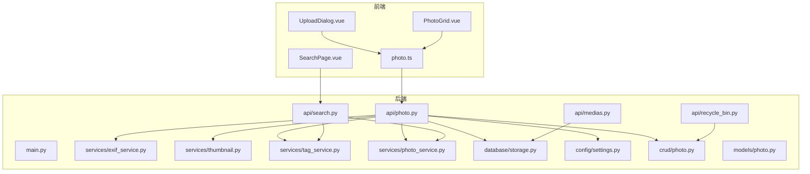
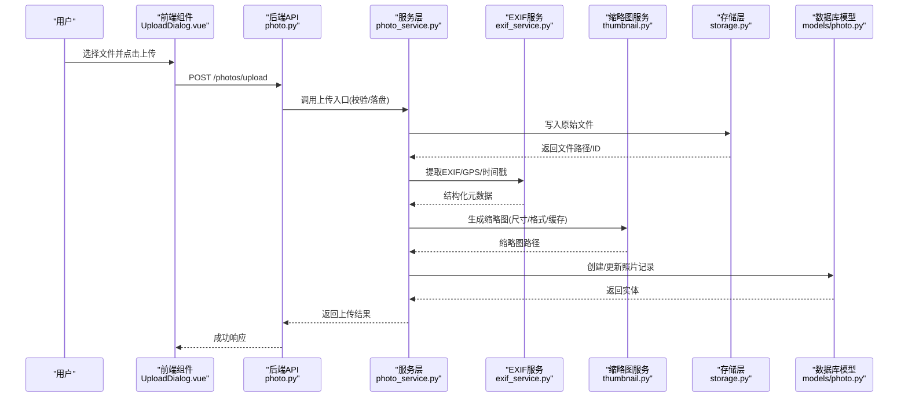
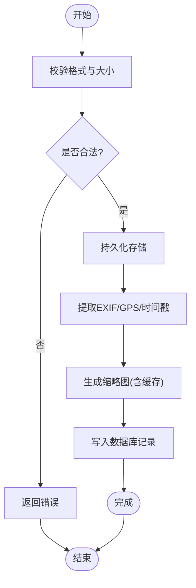
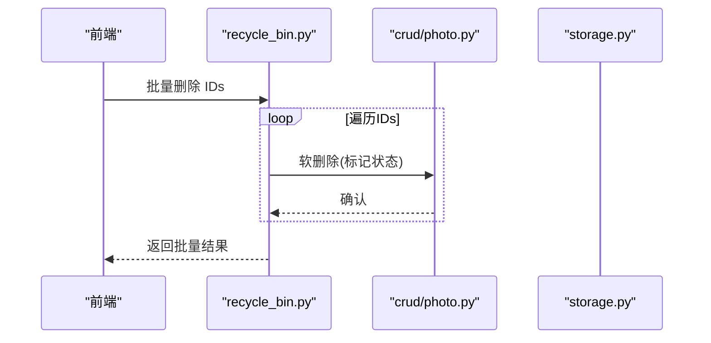
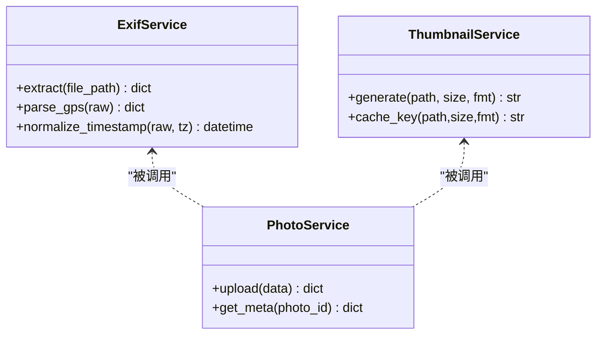
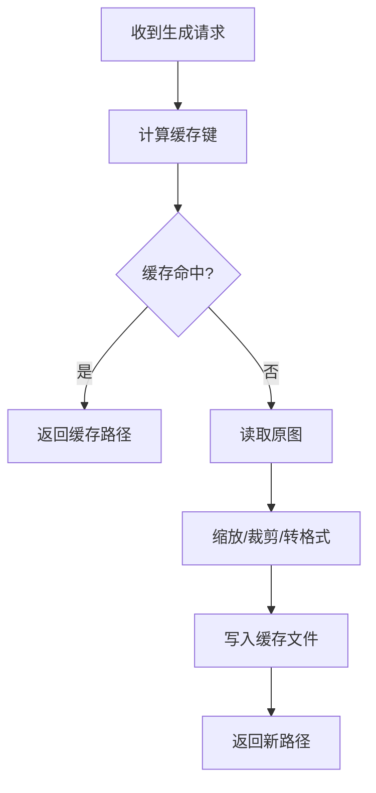
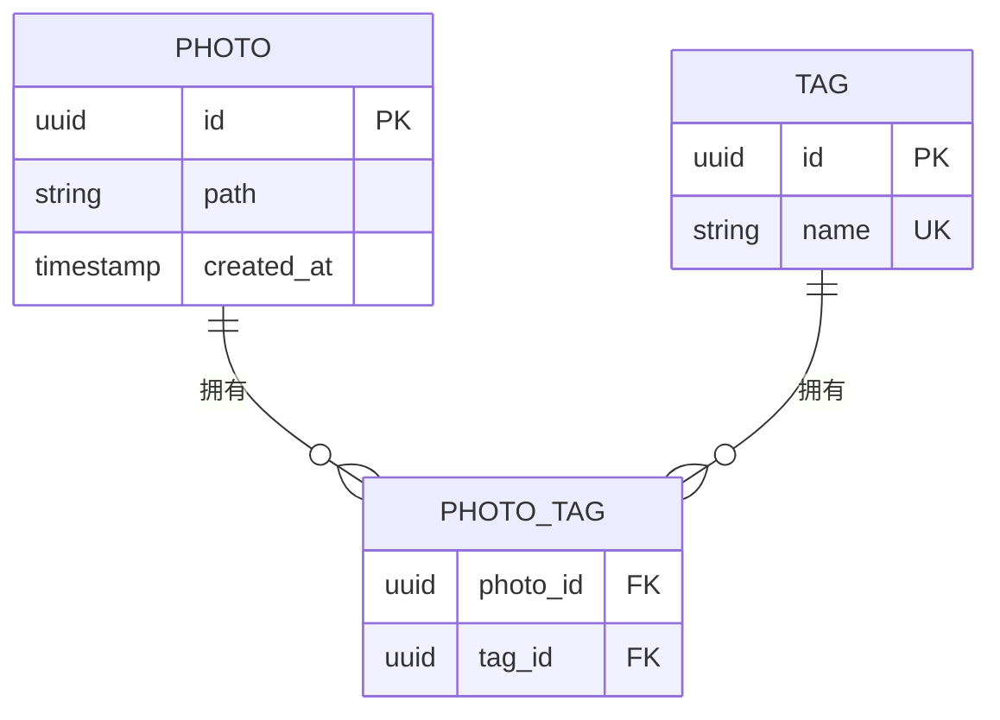
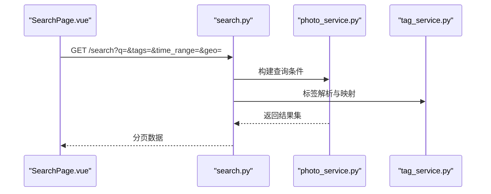
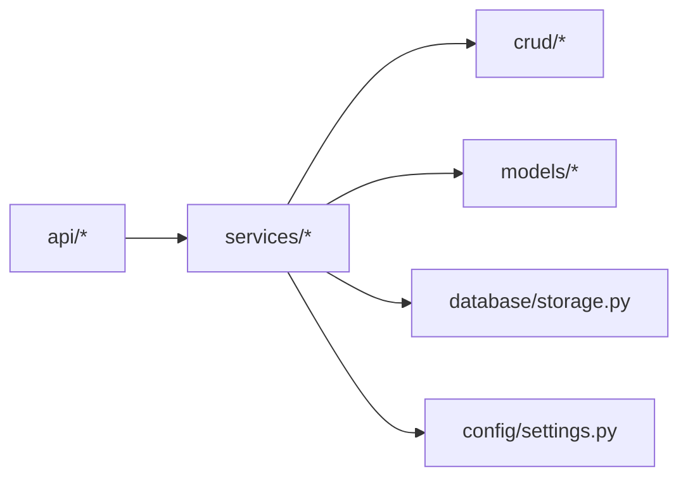

# 照片管理系统

<cite>
**本文引用的文件**   
- [backend/main.py](file://backend/main.py)
- [backend/app/api/photo.py](file://backend/app/api/photo.py)
- [backend/app/api/medias.py](file://backend/app/api/medias.py)
- [backend/app/api/search.py](file://backend/app/api/search.py)
- [backend/app/api/recycle_bin.py](file://backend/app/api/recycle_bin.py)
- [backend/app/services/exif_service.py](file://backend/app/services/exif_service.py)
- [backend/app/services/thumbnail.py](file://backend/app/services/thumbnail.py)
- [backend/app/services/tag_service.py](file://backend/app/services/tag_service.py)
- [backend/app/services/photo_service.py](file://backend/app/services/photo_service.py)
- [backend/app/crud/photo.py](file://backend/app/crud/photo.py)
- [backend/app/models/photo.py](file://backend/app/models/photo.py)
- [backend/app/database/storage.py](file://backend/app/database/storage.py)
- [backend/app/config/settings.py](file://backend/app/config/settings.py)
- [frontend/src/api/photo.ts](file://frontend/src/api/photo.ts)
- [frontend/src/components/photo/UploadDialog.vue](file://frontend/src/components/photo/UploadDialog.vue)
- [frontend/src/components/photo/PhotoGrid.vue](file://frontend/src/components/photo/PhotoGrid.vue)
- [frontend/src/views/SearchPage.vue](file://frontend/src/views/SearchPage.vue)
</cite>

## 目录
1. [简介](#简介)
2. [项目结构](#项目结构)
3. [核心组件](#核心组件)
4. [架构总览](#架构总览)
5. [详细组件分析](#详细组件分析)
6. [依赖关系分析](#依赖关系分析)
7. [性能考虑](#性能考虑)
8. [故障排查指南](#故障排查指南)
9. [结论](#结论)
10. [附录：API 与前端使用](#附录api-与前端使用)

## 简介
本系统为前后端分离的照片管理平台，提供照片上传、下载、删除与批量操作；支持文件验证（格式、大小、安全检查）、元数据提取（EXIF、GPS、设备信息、时间戳）、缩略图生成（尺寸调整、格式转换、缓存策略）；并提供分类、标签管理与搜索能力。后端基于 Python 服务，前端基于 Vue 组件与 TypeScript API 封装。

## 项目结构
- 后端
  - API 层：路由与请求处理（上传、下载、删除、搜索等）
  - 服务层：业务逻辑（EXIF 解析、缩略图、标签、向量检索等）
  - 数据访问层：CRUD 与存储抽象
  - 模型与配置：数据库模型、全局设置
- 前端
  - API 客户端：对后端的统一调用封装
  - 组件：上传对话框、网格展示、详情页等
  - 视图：页面级组合与交互

图表来源
- [backend/main.py](file://backend/main.py)
- [backend/app/api/photo.py](file://backend/app/api/photo.py)
- [backend/app/api/medias.py](file://backend/app/api/medias.py)
- [backend/app/api/recycle_bin.py](file://backend/app/api/recycle_bin.py)
- [backend/app/api/search.py](file://backend/app/api/search.py)
- [backend/app/services/exif_service.py](file://backend/app/services/exif_service.py)
- [backend/app/services/thumbnail.py](file://backend/app/services/thumbnail.py)
- [backend/app/services/tag_service.py](file://backend/app/services/tag_service.py)
- [backend/app/services/photo_service.py](file://backend/app/services/photo_service.py)
- [backend/app/database/storage.py](file://backend/app/database/storage.py)
- [backend/app/config/settings.py](file://backend/app/config/settings.py)
- [backend/app/crud/photo.py](file://backend/app/crud/photo.py)
- [backend/app/models/photo.py](file://backend/app/models/photo.py)
- [frontend/src/api/photo.ts](file://frontend/src/api/photo.ts)
- [frontend/src/components/photo/UploadDialog.vue](file://frontend/src/components/photo/UploadDialog.vue)
- [frontend/src/components/photo/PhotoGrid.vue](file://frontend/src/components/photo/PhotoGrid.vue)
- [frontend/src/views/SearchPage.vue](file://frontend/src/views/SearchPage.vue)

章节来源
- [backend/main.py](file://backend/main.py)
- [backend/app/api/photo.py](file://backend/app/api/photo.py)
- [backend/app/api/medias.py](file://backend/app/api/medias.py)
- [backend/app/api/recycle_bin.py](file://backend/app/api/recycle_bin.py)
- [backend/app/api/search.py](file://backend/app/api/search.py)
- [backend/app/services/exif_service.py](file://backend/app/services/exif_service.py)
- [backend/app/services/thumbnail.py](file://backend/app/services/thumbnail.py)
- [backend/app/services/tag_service.py](file://backend/app/services/tag_service.py)
- [backend/app/services/photo_service.py](file://backend/app/services/photo_service.py)
- [backend/app/database/storage.py](file://backend/app/database/storage.py)
- [backend/app/config/settings.py](file://backend/app/config/settings.py)
- [backend/app/crud/photo.py](file://backend/app/crud/photo.py)
- [backend/app/models/photo.py](file://backend/app/models/photo.py)
- [frontend/src/api/photo.ts](file://frontend/src/api/photo.ts)
- [frontend/src/components/photo/UploadDialog.vue](file://frontend/src/components/photo/UploadDialog.vue)
- [frontend/src/components/photo/PhotoGrid.vue](file://frontend/src/components/photo/PhotoGrid.vue)
- [frontend/src/views/SearchPage.vue](file://frontend/src/views/SearchPage.vue)

## 核心组件
- 上传与下载
  - 上传：接收文件、校验格式与大小、执行安全检查、持久化存储、异步或同步提取元数据与生成缩略图
  - 下载：按 ID 获取原图或缩略图，支持流式响应与范围请求优化
- 删除与回收站
  - 软删除至回收站，支持恢复与彻底删除
- 元数据处理
  - EXIF 读取、GPS 坐标解析、拍摄设备信息与时间戳标准化
- 缩略图服务
  - 尺寸裁剪/缩放、格式转换、缓存命中与回源重建
- 标签与分类
  - 标签增删改查、批量关联、去重与索引
- 搜索
  - 关键词、标签、时间范围、地理位置等多条件检索

章节来源
- [backend/app/api/photo.py](file://backend/app/api/photo.py)
- [backend/app/api/medias.py](file://backend/app/api/medias.py)
- [backend/app/api/recycle_bin.py](file://backend/app/api/recycle_bin.py)
- [backend/app/services/exif_service.py](file://backend/app/services/exif_service.py)
- [backend/app/services/thumbnail.py](file://backend/app/services/thumbnail.py)
- [backend/app/services/tag_service.py](file://backend/app/services/tag_service.py)
- [backend/app/services/photo_service.py](file://backend/app/services/photo_service.py)
- [backend/app/crud/photo.py](file://backend/app/crud/photo.py)
- [backend/app/models/photo.py](file://backend/app/models/photo.py)
- [backend/app/database/storage.py](file://backend/app/database/storage.py)
- [backend/app/config/settings.py](file://backend/app/config/settings.py)

## 架构总览
整体采用分层架构：前端通过 API 客户端调用后端 REST 接口；后端 API 层负责参数校验与流程编排，服务层实现具体业务逻辑，数据访问层对接存储与数据库模型。

图表来源
- [backend/app/api/photo.py](file://backend/app/api/photo.py)
- [backend/app/services/photo_service.py](file://backend/app/services/photo_service.py)
- [backend/app/services/exif_service.py](file://backend/app/services/exif_service.py)
- [backend/app/services/thumbnail.py](file://backend/app/services/thumbnail.py)
- [backend/app/database/storage.py](file://backend/app/database/storage.py)
- [backend/app/models/photo.py](file://backend/app/models/photo.py)
- [frontend/src/components/photo/UploadDialog.vue](file://frontend/src/components/photo/UploadDialog.vue)

## 详细组件分析

### 上传与下载
- 上传流程
  - 前端将文件以表单或多部分形式提交到后端上传接口
  - 后端进行格式白名单校验、文件大小限制检查、基础安全扫描（如扩展名与内容类型一致性）
  - 文件落盘后，触发元数据提取与缩略图生成
  - 成功后返回照片标识与必要信息
- 下载流程
  - 根据资源 ID 定位原图或缩略图路径
  - 以流式方式输出，支持断点续传（Range）以提升大文件体验
  - 针对缩略图优先命中缓存，未命中则回源生成

图表来源
- [backend/app/api/photo.py](file://backend/app/api/photo.py)
- [backend/app/services/photo_service.py](file://backend/app/services/photo_service.py)
- [backend/app/services/exif_service.py](file://backend/app/services/exif_service.py)
- [backend/app/services/thumbnail.py](file://backend/app/services/thumbnail.py)
- [backend/app/database/storage.py](file://backend/app/database/storage.py)
- [backend/app/models/photo.py](file://backend/app/models/photo.py)

章节来源
- [backend/app/api/photo.py](file://backend/app/api/photo.py)
- [backend/app/services/photo_service.py](file://backend/app/services/photo_service.py)
- [backend/app/services/exif_service.py](file://backend/app/services/exif_service.py)
- [backend/app/services/thumbnail.py](file://backend/app/services/thumbnail.py)
- [backend/app/database/storage.py](file://backend/app/database/storage.py)
- [backend/app/models/photo.py](file://backend/app/models/photo.py)
- [frontend/src/components/photo/UploadDialog.vue](file://frontend/src/components/photo/UploadDialog.vue)

### 删除与批量操作
- 单条删除
  - 将目标照片标记为“已删除”并移入回收站
- 批量删除
  - 支持传入多个 ID，逐个执行软删除
- 回收站管理
  - 列出回收站中的照片
  - 恢复指定照片或彻底删除（物理清理）

图表来源
- [backend/app/api/recycle_bin.py](file://backend/app/api/recycle_bin.py)
- [backend/app/crud/photo.py](file://backend/app/crud/photo.py)
- [backend/app/database/storage.py](file://backend/app/database/storage.py)

章节来源
- [backend/app/api/recycle_bin.py](file://backend/app/api/recycle_bin.py)
- [backend/app/crud/photo.py](file://backend/app/crud/photo.py)

### 元数据提取机制（EXIF、GPS、设备、时间戳）
- EXIF 读取
  - 从图片中解析标准 EXIF 字段（如相机型号、镜头、光圈、快门、ISO、方向等）
- GPS 位置解析
  - 解析 GPSLatitude/GPSLongitude 及参考方向，转换为十进制度数
  - 可选地理编码（若集成），用于地名显示
- 拍摄设备信息
  - 从 EXIF 中提取制造商、型号、软件版本等
- 时间戳处理
  - 优先使用拍摄时间，若无则回退到文件修改时间
  - 统一时区与格式化输出

图表来源
- [backend/app/services/exif_service.py](file://backend/app/services/exif_service.py)
- [backend/app/services/thumbnail.py](file://backend/app/services/thumbnail.py)
- [backend/app/services/photo_service.py](file://backend/app/services/photo_service.py)

章节来源
- [backend/app/services/exif_service.py](file://backend/app/services/exif_service.py)
- [backend/app/services/photo_service.py](file://backend/app/services/photo_service.py)

### 缩略图生成流程（尺寸、格式、缓存、性能）
- 尺寸调整
  - 支持多种预设尺寸（如小/中/大）与自定义宽高
- 格式转换
  - 输入可为任意受支持的图像格式，输出可转换为更通用的格式（如 JPEG/WebP）
- 缓存策略
  - 基于“原图路径+尺寸+格式”的键进行缓存
  - 首次生成后落盘，后续直接命中
- 性能优化
  - 并发生成、惰性生成（按需）、失败重试与幂等性保证

图表来源
- [backend/app/services/thumbnail.py](file://backend/app/services/thumbnail.py)

章节来源
- [backend/app/services/thumbnail.py](file://backend/app/services/thumbnail.py)

### 分类与标签管理
- 标签定义
  - 标签名称唯一性约束，支持别名与合并
- 关联关系
  - 照片与标签多对多关联，支持批量添加/移除
- 查询与统计
  - 按标签聚合计数、去重列表

图表来源
- [backend/app/services/tag_service.py](file://backend/app/services/tag_service.py)
- [backend/app/models/photo.py](file://backend/app/models/photo.py)

章节来源
- [backend/app/services/tag_service.py](file://backend/app/services/tag_service.py)
- [backend/app/models/photo.py](file://backend/app/models/photo.py)

### 搜索功能
- 搜索维度
  - 关键词（标题/描述/标签）、标签集合、时间范围、地理位置（半径/矩形）
- 排序与分页
  - 支持按时间、热度、相关性排序，分页游标或页码
- 前端交互
  - 搜索页提供筛选面板与结果网格

图表来源
- [backend/app/api/search.py](file://backend/app/api/search.py)
- [backend/app/services/photo_service.py](file://backend/app/services/photo_service.py)
- [backend/app/services/tag_service.py](file://backend/app/services/tag_service.py)
- [frontend/src/views/SearchPage.vue](file://frontend/src/views/SearchPage.vue)

章节来源
- [backend/app/api/search.py](file://backend/app/api/search.py)
- [backend/app/services/photo_service.py](file://backend/app/services/photo_service.py)
- [backend/app/services/tag_service.py](file://backend/app/services/tag_service.py)
- [frontend/src/views/SearchPage.vue](file://frontend/src/views/SearchPage.vue)

## 依赖关系分析
- 模块耦合
  - API 层依赖服务层，服务层依赖存储与模型，形成单向依赖
- 外部依赖
  - 图像处理库（用于缩略图与格式转换）
  - EXIF 解析库（用于元数据提取）
  - 对象存储或本地文件系统（由 storage 抽象）
- 潜在循环
  - 当前分层清晰，未见明显循环依赖

图表来源
- [backend/app/api/photo.py](file://backend/app/api/photo.py)
- [backend/app/services/photo_service.py](file://backend/app/services/photo_service.py)
- [backend/app/crud/photo.py](file://backend/app/crud/photo.py)
- [backend/app/models/photo.py](file://backend/app/models/photo.py)
- [backend/app/database/storage.py](file://backend/app/database/storage.py)
- [backend/app/config/settings.py](file://backend/app/config/settings.py)

章节来源
- [backend/app/api/photo.py](file://backend/app/api/photo.py)
- [backend/app/services/photo_service.py](file://backend/app/services/photo_service.py)
- [backend/app/crud/photo.py](file://backend/app/crud/photo.py)
- [backend/app/models/photo.py](file://backend/app/models/photo.py)
- [backend/app/database/storage.py](file://backend/app/database/storage.py)
- [backend/app/config/settings.py](file://backend/app/config/settings.py)

## 性能考虑
- 缩略图缓存
  - 合理设置缓存键与过期策略，避免重复生成
- 并发与队列
  - 对耗时任务（EXIF 提取、缩略图生成）采用异步队列，降低请求延迟
- 存储 I/O
  - 使用流式读写与分块传输，减少内存占用
- 前端优化
  - 懒加载与虚拟滚动提升大图网格渲染性能
  - 预取常用尺寸的缩略图

[本节为通用指导，不直接分析具体文件]

## 故障排查指南
- 上传失败
  - 检查文件格式是否在白名单内、文件大小是否超限
  - 查看服务端日志中的安全校验与存储异常
- 缩略图缺失
  - 确认缓存目录权限与空间，检查生成任务是否执行成功
- 元数据为空
  - 确认图片包含 EXIF；对于无 EXIF 的图片，回退到文件时间戳
- 搜索无结果
  - 检查标签是否存在、时间范围是否正确、地理位置坐标是否有效

章节来源
- [backend/app/api/photo.py](file://backend/app/api/photo.py)
- [backend/app/services/thumbnail.py](file://backend/app/services/thumbnail.py)
- [backend/app/services/exif_service.py](file://backend/app/services/exif_service.py)
- [backend/app/api/search.py](file://backend/app/api/search.py)

## 结论
该系统通过清晰的分层设计与模块化服务，实现了照片全生命周期管理：从上传校验、元数据提取、缩略图生成，到标签分类与多维搜索。配合合理的缓存与异步策略，可在大规模图片场景下保持良好性能与用户体验。

[本节为总结性内容，不直接分析具体文件]

## 附录：API 与前端使用

### 关键 API 说明（示例）
- 上传
  - 方法：POST
  - 路径：/photos/upload
  - 请求体：multipart/form-data，包含文件字段
  - 响应：照片 ID、缩略图 URL、元数据摘要
- 下载
  - 方法：GET
  - 路径：/photos/{id}/download 或 /photos/{id}/thumbnail
  - 响应：二进制流或缩略图文件
- 删除
  - 方法：DELETE
  - 路径：/photos/{id}
  - 行为：软删除至回收站
- 批量删除
  - 方法：POST
  - 路径：/photos/batch/delete
  - 请求体：IDs 数组
- 回收站
  - 列出：GET /recycle-bin/photos
  - 恢复：POST /recycle-bin/photos/{id}/restore
  - 彻底删除：DELETE /recycle-bin/photos/{id}
- 搜索
  - 方法：GET
  - 路径：/search
  - 查询参数：q、tags、time_range、geo 等

章节来源
- [backend/app/api/photo.py](file://backend/app/api/photo.py)
- [backend/app/api/medias.py](file://backend/app/api/medias.py)
- [backend/app/api/recycle_bin.py](file://backend/app/api/recycle_bin.py)
- [backend/app/api/search.py](file://backend/app/api/search.py)

### 前端组件使用要点
- 上传对话框
  - 组件：UploadDialog.vue
  - 用法：打开弹窗后选择文件，自动调用上传接口，完成后刷新列表
- 照片网格
  - 组件：PhotoGrid.vue
  - 用法：分页加载缩略图，点击跳转详情，支持多选批量操作
- 搜索页
  - 视图：SearchPage.vue
  - 用法：组合关键词、标签、时间与地理条件，实时过滤与分页

章节来源
- [frontend/src/components/photo/UploadDialog.vue](file://frontend/src/components/photo/UploadDialog.vue)
- [frontend/src/components/photo/PhotoGrid.vue](file://frontend/src/components/photo/PhotoGrid.vue)
- [frontend/src/views/SearchPage.vue](file://frontend/src/views/SearchPage.vue)
- [frontend/src/api/photo.ts](file://frontend/src/api/photo.ts)