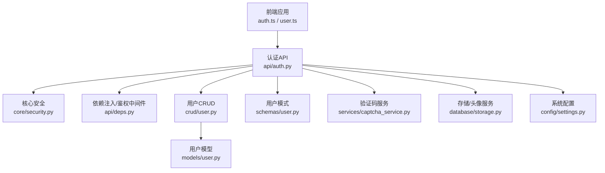
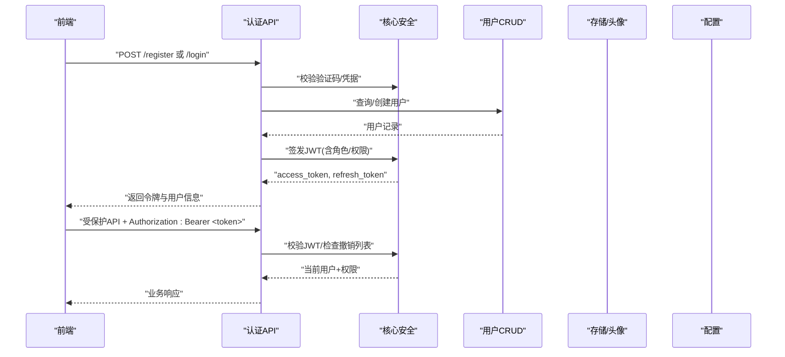
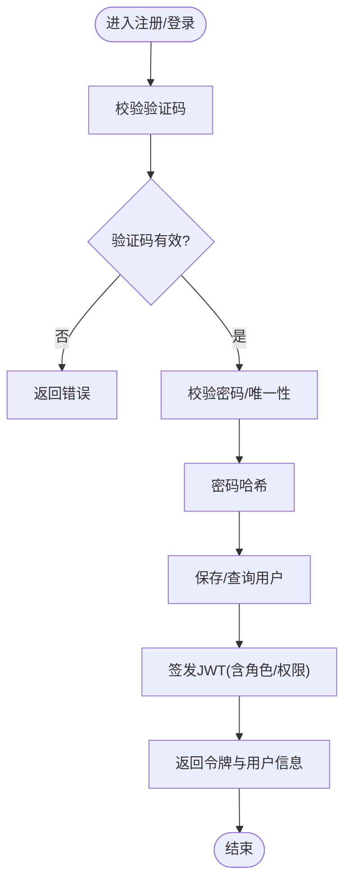
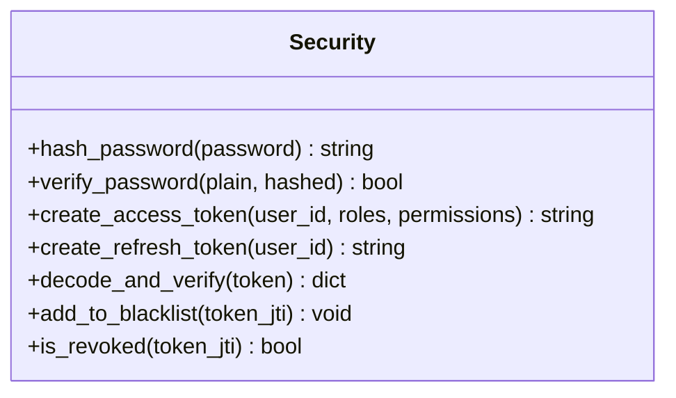
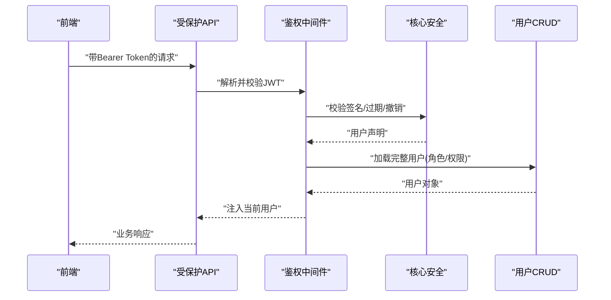
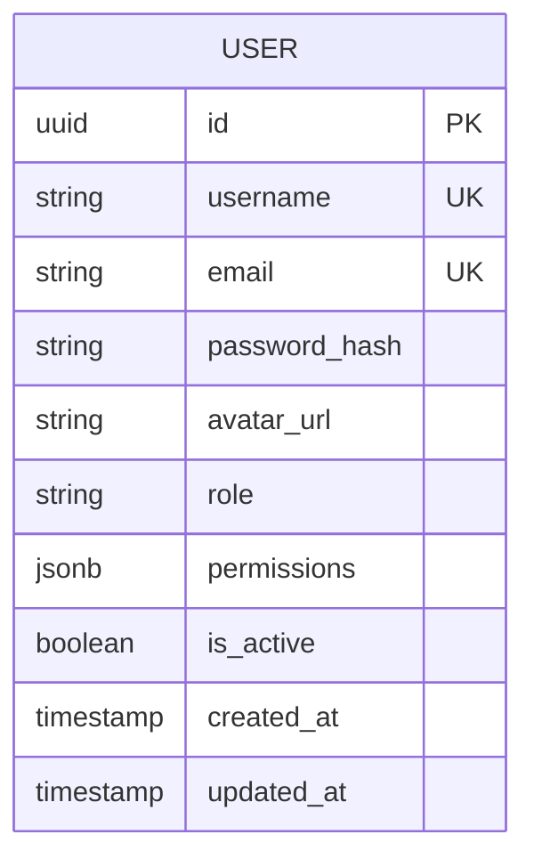
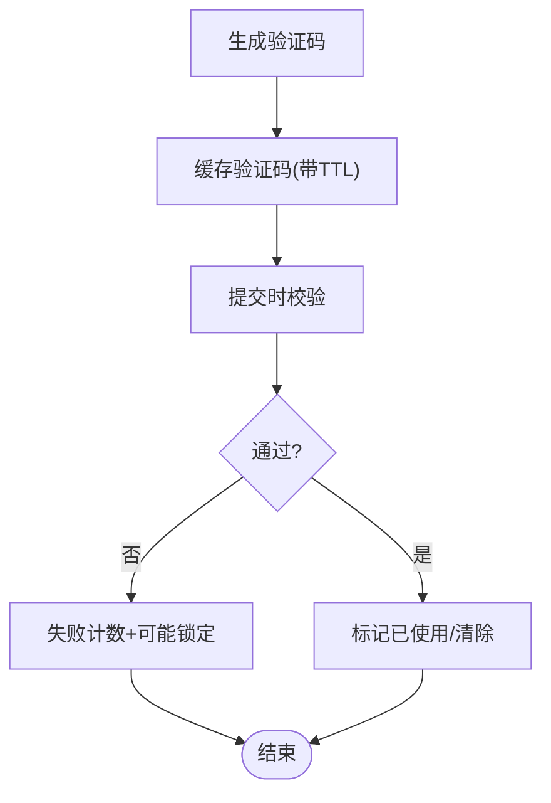
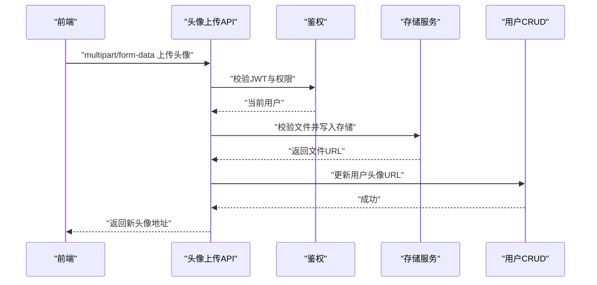
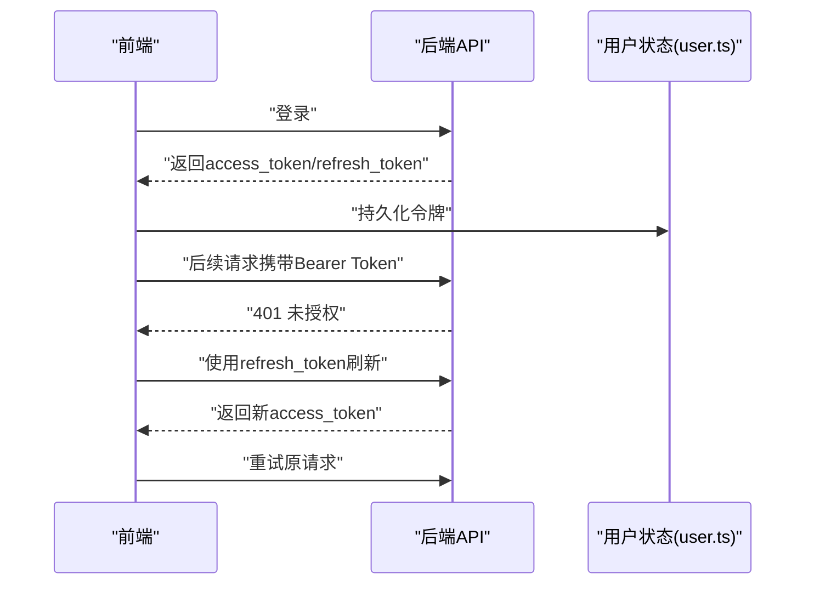
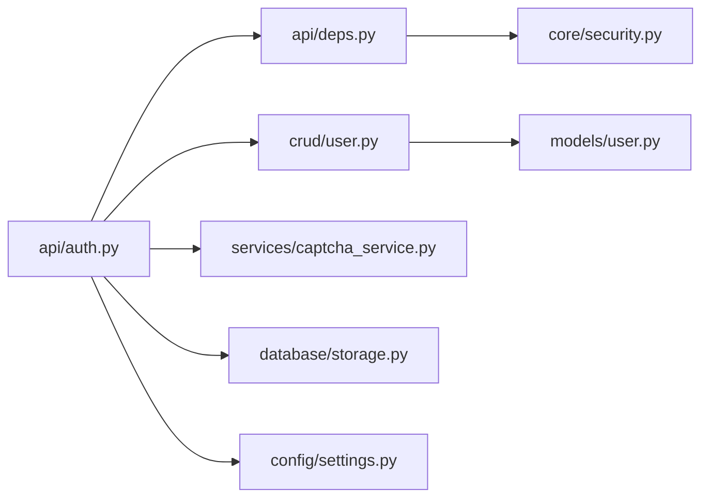

# 用户认证与权限

<cite>
**本文引用的文件**   
- [backend/app/api/auth.py](file://backend/app/api/auth.py)
- [backend/app/api/deps.py](file://backend/app/api/deps.py)
- [backend/app/core/security.py](file://backend/app/core/security.py)
- [backend/app/models/user.py](file://backend/app/models/user.py)
- [backend/app/schemas/user.py](file://backend/app/schemas/user.py)
- [backend/app/crud/user.py](file://backend/app/crud/user.py)
- [backend/app/services/captcha_service.py](file://backend/app/services/captcha_service.py)
- [backend/app/database/storage.py](file://backend/app/database/storage.py)
- [backend/app/config/settings.py](file://backend/app/config/settings.py)
- [frontend/src/api/auth.ts](file://frontend/src/api/auth.ts)
- [frontend/src/stores/user.ts](file://frontend/src/stores/user.ts)
</cite>

## 目录
1. [简介](#简介)
2. [项目结构](#项目结构)
3. [核心组件](#核心组件)
4. [架构总览](#架构总览)
5. [详细组件分析](#详细组件分析)
6. [依赖关系分析](#依赖关系分析)
7. [性能考虑](#性能考虑)
8. [故障排查指南](#故障排查指南)
9. [结论](#结论)
10. [附录](#附录)

## 简介
本文件面向“AI相册”项目的用户认证与权限子系统，系统性阐述以下能力：
- 用户注册、登录与会话管理（含密码加密、验证码生成）
- JWT令牌生命周期管理（签发、验证、刷新、撤销）
- 角色与权限控制（RBAC），包括资源访问与API级防护
- 头像上传与管理（图片处理、存储策略、访问控制）
- 安全最佳实践、常见漏洞防护与调试方法

## 项目结构
认证与权限相关代码主要分布在后端API层、核心安全模块、数据模型与CRUD、服务层以及前端API与状态管理中。整体分层清晰：
- API层：暴露REST接口，负责参数校验、鉴权装饰器调用、响应封装
- 核心安全：JWT签发/校验、密码哈希、会话/黑名单等
- 数据层：用户模型、CRUD操作、配置项
- 服务层：验证码生成、头像存储等
- 前端：登录/注册流程、令牌持久化、请求拦截与自动刷新

图表来源
- [backend/app/api/auth.py](file://backend/app/api/auth.py)
- [backend/app/core/security.py](file://backend/app/core/security.py)
- [backend/app/api/deps.py](file://backend/app/api/deps.py)
- [backend/app/crud/user.py](file://backend/app/crud/user.py)
- [backend/app/schemas/user.py](file://backend/app/schemas/user.py)
- [backend/app/services/captcha_service.py](file://backend/app/services/captcha_service.py)
- [backend/app/database/storage.py](file://backend/app/database/storage.py)
- [backend/app/config/settings.py](file://backend/app/config/settings.py)
- [backend/app/models/user.py](file://backend/app/models/user.py)

章节来源
- [backend/app/api/auth.py](file://backend/app/api/auth.py)
- [backend/app/core/security.py](file://backend/app/core/security.py)
- [backend/app/api/deps.py](file://backend/app/api/deps.py)
- [backend/app/crud/user.py](file://backend/app/crud/user.py)
- [backend/app/schemas/user.py](file://backend/app/schemas/user.py)
- [backend/app/services/captcha_service.py](file://backend/app/services/captcha_service.py)
- [backend/app/database/storage.py](file://backend/app/database/storage.py)
- [backend/app/config/settings.py](file://backend/app/config/settings.py)
- [backend/app/models/user.py](file://backend/app/models/user.py)
- [frontend/src/api/auth.ts](file://frontend/src/api/auth.ts)
- [frontend/src/stores/user.ts](file://frontend/src/stores/user.ts)

## 核心组件
- 认证API：提供注册、登录、登出、刷新令牌、获取当前用户、修改密码、头像上传等端点
- 核心安全：JWT签发/校验、密码哈希/校验、可选的令牌黑名单/撤销机制
- 依赖注入与鉴权：从请求头解析JWT、注入当前用户上下文、基于角色的访问控制装饰器
- 用户CRUD与模型：用户实体定义、字段约束、索引与默认值
- 验证码服务：图形或文本验证码生成与校验，用于注册/登录防刷
- 存储与头像：头像文件的写入、路径管理、访问控制与清理策略
- 配置中心：JWT密钥、过期时间、刷新策略、存储路径等

章节来源
- [backend/app/api/auth.py](file://backend/app/api/auth.py)
- [backend/app/core/security.py](file://backend/app/core/security.py)
- [backend/app/api/deps.py](file://backend/app/api/deps.py)
- [backend/app/crud/user.py](file://backend/app/crud/user.py)
- [backend/app/models/user.py](file://backend/app/models/user.py)
- [backend/app/schemas/user.py](file://backend/app/schemas/user.py)
- [backend/app/services/captcha_service.py](file://backend/app/services/captcha_service.py)
- [backend/app/database/storage.py](file://backend/app/database/storage.py)
- [backend/app/config/settings.py](file://backend/app/config/settings.py)

## 架构总览
下图展示了认证主流程的关键交互：前端发起登录，后端校验验证码与凭据，签发JWT并返回；后续请求携带JWT，由鉴权中间件校验并注入用户上下文。

图表来源
- [backend/app/api/auth.py](file://backend/app/api/auth.py)
- [backend/app/core/security.py](file://backend/app/core/security.py)
- [backend/app/crud/user.py](file://backend/app/crud/user.py)
- [backend/app/database/storage.py](file://backend/app/database/storage.py)
- [backend/app/config/settings.py](file://backend/app/config/settings.py)

## 详细组件分析

### 认证API与登录/注册流程
- 注册流程
  - 接收用户名、邮箱、密码、验证码等
  - 校验验证码有效性（次数限制、时效性）
  - 校验密码强度与唯一性
  - 使用安全模块对密码进行哈希后落库
  - 返回注册结果
- 登录流程
  - 校验验证码与凭据
  - 校验账户状态（启用/禁用）
  - 签发JWT（包含用户标识、角色、权限集合）
  - 返回访问令牌与刷新令牌
- 登出与令牌撤销
  - 支持将访问令牌加入黑名单/撤销列表
  - 刷新令牌轮换策略（可选）
- 头像上传
  - 校验文件格式、大小、类型白名单
  - 生成安全文件名与路径，写入存储
  - 更新用户头像URL并返回访问地址

图表来源
- [backend/app/api/auth.py](file://backend/app/api/auth.py)
- [backend/app/services/captcha_service.py](file://backend/app/services/captcha_service.py)
- [backend/app/core/security.py](file://backend/app/core/security.py)
- [backend/app/crud/user.py](file://backend/app/crud/user.py)

章节来源
- [backend/app/api/auth.py](file://backend/app/api/auth.py)
- [backend/app/services/captcha_service.py](file://backend/app/services/captcha_service.py)
- [backend/app/core/security.py](file://backend/app/core/security.py)
- [backend/app/crud/user.py](file://backend/app/crud/user.py)

### 核心安全模块（JWT与密码）
- 密码加密
  - 采用不可逆哈希算法，确保存储安全
  - 提供校验函数比对明文与密文
- JWT签发与校验
  - 签发时注入用户ID、角色、权限、过期时间等声明
  - 校验时验证签名、过期时间、撤销状态
  - 支持刷新令牌签发与轮换（可选）
- 令牌撤销
  - 维护令牌黑名单或版本戳，实现即时失效
  - 登出或强制下线时将令牌加入撤销集

图表来源
- [backend/app/core/security.py](file://backend/app/core/security.py)

章节来源
- [backend/app/core/security.py](file://backend/app/core/security.py)

### 依赖注入与鉴权中间件
- 从请求头提取Authorization并解析JWT
- 校验失败返回未授权/令牌无效
- 成功则注入当前用户对象到请求上下文
- 提供基于角色的访问控制装饰器，限制特定API仅允许指定角色访问

图表来源
- [backend/app/api/deps.py](file://backend/app/api/deps.py)
- [backend/app/core/security.py](file://backend/app/core/security.py)
- [backend/app/crud/user.py](file://backend/app/crud/user.py)

章节来源
- [backend/app/api/deps.py](file://backend/app/api/deps.py)
- [backend/app/core/security.py](file://backend/app/core/security.py)
- [backend/app/crud/user.py](file://backend/app/crud/user.py)

### 用户模型与CRUD
- 用户模型
  - 关键字段：用户名、邮箱、密码哈希、头像URL、角色、权限、状态、时间戳等
  - 约束与索引：唯一性、非空、常用查询索引
- CRUD操作
  - 按用户名/邮箱查询用户
  - 创建用户（注册）
  - 更新用户资料（如头像、密码）
  - 软删除/状态切换（启用/禁用）

图表来源
- [backend/app/models/user.py](file://backend/app/models/user.py)
- [backend/app/schemas/user.py](file://backend/app/schemas/user.py)
- [backend/app/crud/user.py](file://backend/app/crud/user.py)

章节来源
- [backend/app/models/user.py](file://backend/app/models/user.py)
- [backend/app/schemas/user.py](file://backend/app/schemas/user.py)
- [backend/app/crud/user.py](file://backend/app/crud/user.py)

### 验证码服务
- 生成验证码
  - 随机字符/图形验证码
  - 设置有效期与最大尝试次数
- 校验验证码
  - 校验是否过期、是否已被使用
  - 失败计数与锁定策略（可选）

图表来源
- [backend/app/services/captcha_service.py](file://backend/app/services/captcha_service.py)

章节来源
- [backend/app/services/captcha_service.py](file://backend/app/services/captcha_service.py)

### 头像上传与管理
- 上传校验
  - 格式白名单（如jpg/png/webp）、大小上限、MIME类型校验
- 存储策略
  - 本地磁盘或对象存储（根据配置）
  - 安全命名（避免路径穿越）、目录组织（按用户/日期）
- 访问控制
  - 私有资源需鉴权访问
  - 可配置CDN/预签名URL（可选）
- 清理策略
  - 替换头像时清理旧文件
  - 定期扫描孤儿文件

图表来源
- [backend/app/api/auth.py](file://backend/app/api/auth.py)
- [backend/app/database/storage.py](file://backend/app/database/storage.py)
- [backend/app/crud/user.py](file://backend/app/crud/user.py)

章节来源
- [backend/app/api/auth.py](file://backend/app/api/auth.py)
- [backend/app/database/storage.py](file://backend/app/database/storage.py)
- [backend/app/crud/user.py](file://backend/app/crud/user.py)

### 前端集成（令牌持久化与请求拦截）
- 登录成功后保存access_token与refresh_token
- 在请求拦截器中附加Authorization头
- 当收到401时尝试刷新令牌，失败则跳转登录页
- 登出时清除本地令牌并跳转

图表来源
- [frontend/src/api/auth.ts](file://frontend/src/api/auth.ts)
- [frontend/src/stores/user.ts](file://frontend/src/stores/user.ts)

章节来源
- [frontend/src/api/auth.ts](file://frontend/src/api/auth.ts)
- [frontend/src/stores/user.ts](file://frontend/src/stores/user.ts)

## 依赖关系分析
- 松耦合设计
  - API层仅依赖安全、CRUD、配置与服务层，不直接操作数据库
  - 安全模块独立于业务逻辑，便于替换实现（如不同存储后端）
- 关键依赖链
  - auth.py -> deps.py -> security.py -> crud/user.py -> models/user.py
  - auth.py -> captcha_service.py
  - auth.py -> storage.py（头像）
  - settings.py 贯穿各层（JWT密钥、过期时间、存储路径）

图表来源
- [backend/app/api/auth.py](file://backend/app/api/auth.py)
- [backend/app/api/deps.py](file://backend/app/api/deps.py)
- [backend/app/core/security.py](file://backend/app/core/security.py)
- [backend/app/crud/user.py](file://backend/app/crud/user.py)
- [backend/app/models/user.py](file://backend/app/models/user.py)
- [backend/app/services/captcha_service.py](file://backend/app/services/captcha_service.py)
- [backend/app/database/storage.py](file://backend/app/database/storage.py)
- [backend/app/config/settings.py](file://backend/app/config/settings.py)

章节来源
- [backend/app/api/auth.py](file://backend/app/api/auth.py)
- [backend/app/api/deps.py](file://backend/app/api/deps.py)
- [backend/app/core/security.py](file://backend/app/core/security.py)
- [backend/app/crud/user.py](file://backend/app/crud/user.py)
- [backend/app/models/user.py](file://backend/app/models/user.py)
- [backend/app/services/captcha_service.py](file://backend/app/services/captcha_service.py)
- [backend/app/database/storage.py](file://backend/app/database/storage.py)
- [backend/app/config/settings.py](file://backend/app/config/settings.py)

## 性能考虑
- 密码哈希
  - 选择合适的工作因子，平衡安全性与CPU开销
- JWT校验
  - 避免重复解码与数据库查询，必要时引入内存缓存（如Redis）
- 验证码
  - 使用内存缓存（TTL短）减少IO压力
- 头像上传
  - 异步缩略图生成与转码
  - 大文件分片上传与断点续传（可选）
  - 静态资源走CDN，降低后端带宽

## 故障排查指南
- 常见问题
  - 401未授权：检查Authorization头、令牌是否过期或被撤销
  - 403禁止访问：检查用户角色与权限是否满足资源要求
  - 验证码失败：确认验证码是否过期、是否被使用、尝试次数是否超限
  - 头像上传失败：检查文件大小、类型、存储路径权限
- 定位步骤
  - 查看请求日志与响应体，确认错误码与消息
  - 核对JWT签名与声明内容（用户ID、角色、权限）
  - 检查存储目录权限与磁盘空间
  - 验证配置项（JWT密钥、过期时间、存储路径）

章节来源
- [backend/app/core/security.py](file://backend/app/core/security.py)
- [backend/app/api/deps.py](file://backend/app/api/deps.py)
- [backend/app/services/captcha_service.py](file://backend/app/services/captcha_service.py)
- [backend/app/database/storage.py](file://backend/app/database/storage.py)
- [backend/app/config/settings.py](file://backend/app/config/settings.py)

## 结论
该认证与权限系统以JWT为核心，结合验证码与角色权限控制，实现了较为完整的用户身份与访问控制体系。通过清晰的层次划分与模块化设计，系统在安全性、可扩展性与可维护性方面具备良好基础。建议在生产环境完善令牌撤销存储、速率限制、审计日志与监控告警，进一步提升鲁棒性与可观测性。

## 附录

### 安全最佳实践
- 传输安全
  - 全站HTTPS，启用HSTS
  - 敏感Cookie设置Secure、HttpOnly、SameSite
- 密码与令牌
  - 使用强哈希算法与合理工作因子
  - 设置合理的JWT过期时间与刷新策略
  - 实现令牌撤销与黑名单存储
- 输入校验与防护
  - 严格校验与白名单过滤（文件类型、大小、内容）
  - 防止路径穿越、XSS、CSRF（跨站请求伪造）
- 存储与访问控制
  - 私有资源鉴权访问，避免直接暴露内部路径
  - 定期清理孤儿文件与过期令牌
- 运维与监控
  - 记录认证与授权事件日志
  - 监控异常登录与高频失败
  - 配置告警与限流

[本节为通用指导，无需源码引用]