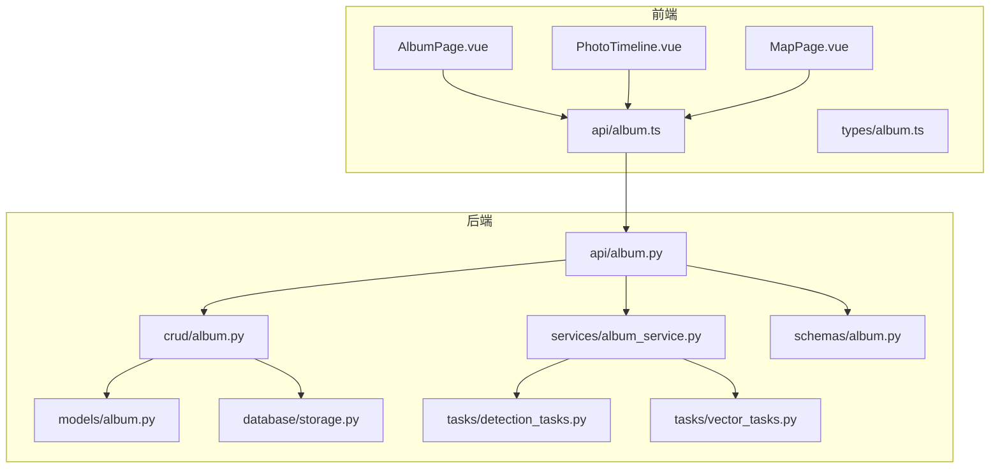
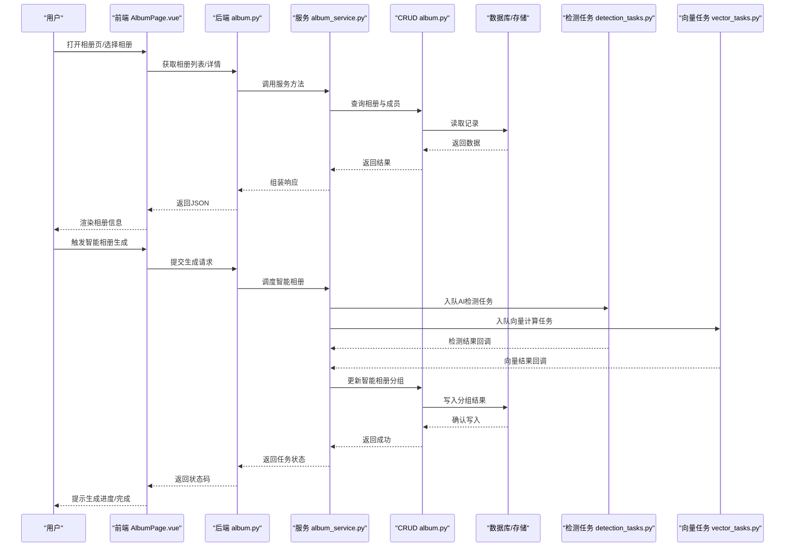
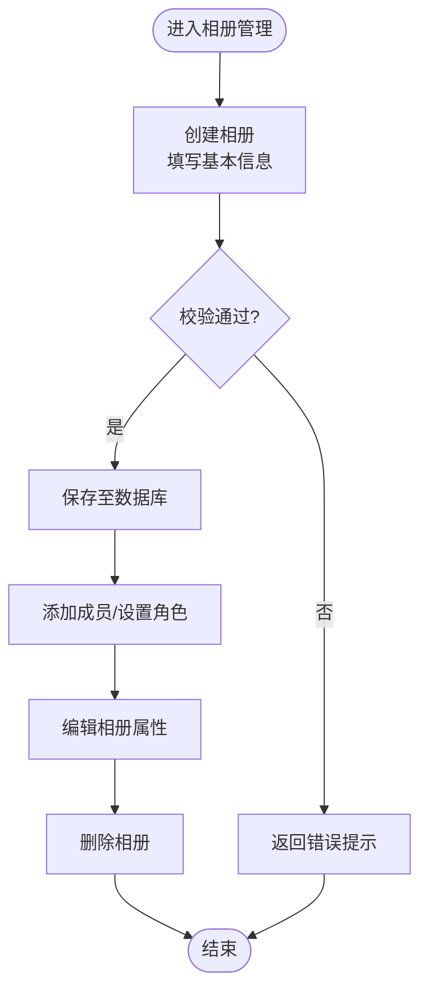
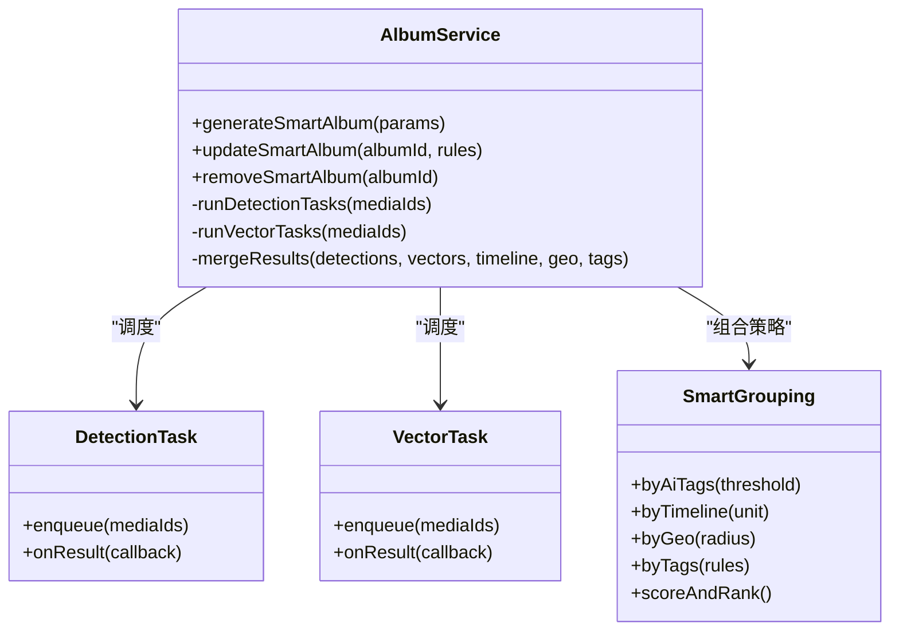
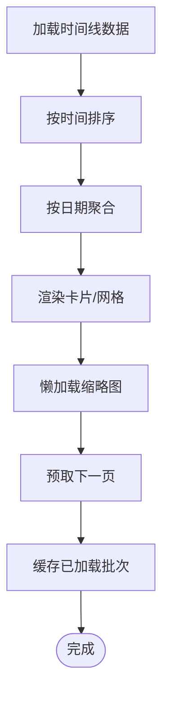
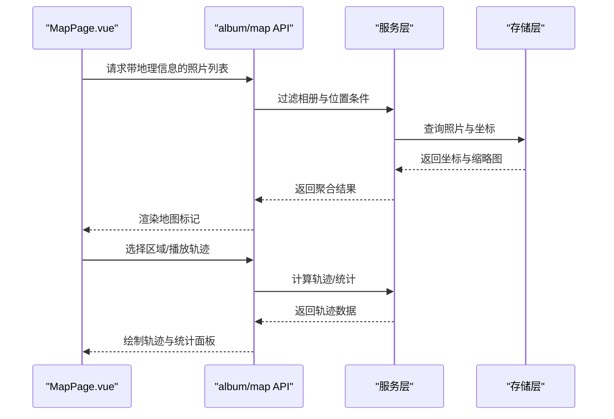
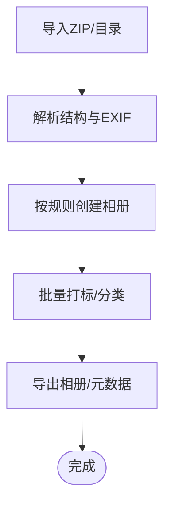
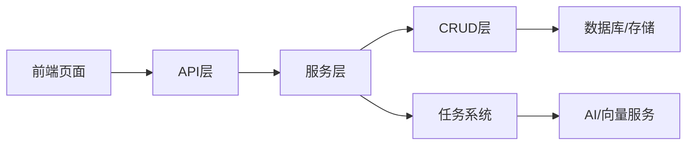

# 相册组织系统

<cite>
**本文引用的文件**   
- [backend/app/api/album.py](file://backend/app/api/album.py)
- [backend/app/crud/album.py](file://backend/app/crud/album.py)
- [backend/app/models/album.py](file://backend/app/models/album.py)
- [backend/app/schemas/album.py](file://backend/app/schemas/album.py)
- [backend/app/services/album_service.py](file://backend/app/services/album_service.py)
- [backend/app/tasks/detection_tasks.py](file://backend/app/tasks/detection_tasks.py)
- [backend/app/tasks/vector_tasks.py](file://backend/app/tasks/vector_tasks.py)
- [backend/app/database/storage.py](file://backend/app/database/storage.py)
- [frontend/src/views/AlbumPage.vue](file://frontend/src/views/AlbumPage.vue)
- [frontend/src/components/photo/PhotoTimeline.vue](file://frontend/src/components/photo/PhotoTimeline.vue)
- [frontend/src/views/MapPage.vue](file://frontend/src/views/MapPage.vue)
- [frontend/src/api/album.ts](file://frontend/src/api/album.ts)
- [frontend/src/types/album.ts](file://frontend/src/types/album.ts)
</cite>

## 目录
1. [简介](#简介)
2. [项目结构](#项目结构)
3. [核心组件](#核心组件)
4. [架构总览](#架构总览)
5. [详细组件分析](#详细组件分析)
6. [依赖关系分析](#依赖关系分析)
7. [性能考量](#性能考量)
8. [故障排查指南](#故障排查指南)
9. [结论](#结论)
10. [附录](#附录)

## 简介
本文件系统性地梳理“相册组织系统”的后端与前端实现，重点覆盖：
- 手动相册的创建、编辑、删除与成员管理（含权限控制与共享机制）
- 智能相册的自动分类策略（基于AI识别结果、时间线、地理位置与标签）
- 时间线视图的实现原理（排序、日期聚合、浏览体验优化）
- 地图视图功能（地理标记显示、区域筛选、轨迹展示）
- 相册模板、批量操作与导入导出能力

## 项目结构
本项目采用前后端分离架构。后端以FastAPI提供REST API，结合数据库模型、CRUD、服务层与任务队列；前端使用Vue 3 + TypeScript，通过API模块与页面组件完成交互。

图表来源
- [backend/app/api/album.py](file://backend/app/api/album.py)
- [backend/app/crud/album.py](file://backend/app/crud/album.py)
- [backend/app/models/album.py](file://backend/app/models/album.py)
- [backend/app/schemas/album.py](file://backend/app/schemas/album.py)
- [backend/app/services/album_service.py](file://backend/app/services/album_service.py)
- [backend/app/tasks/detection_tasks.py](file://backend/app/tasks/detection_tasks.py)
- [backend/app/tasks/vector_tasks.py](file://backend/app/tasks/vector_tasks.py)
- [backend/app/database/storage.py](file://backend/app/database/storage.py)
- [frontend/src/views/AlbumPage.vue](file://frontend/src/views/AlbumPage.vue)
- [frontend/src/components/photo/PhotoTimeline.vue](file://frontend/src/components/photo/PhotoTimeline.vue)
- [frontend/src/views/MapPage.vue](file://frontend/src/views/MapPage.vue)
- [frontend/src/api/album.ts](file://frontend/src/api/album.ts)
- [frontend/src/types/album.ts](file://frontend/src/types/album.ts)

章节来源
- [backend/app/api/album.py](file://backend/app/api/album.py)
- [backend/app/crud/album.py](file://backend/app/crud/album.py)
- [backend/app/models/album.py](file://backend/app/models/album.py)
- [backend/app/schemas/album.py](file://backend/app/schemas/album.py)
- [backend/app/services/album_service.py](file://backend/app/services/album_service.py)
- [backend/app/tasks/detection_tasks.py](file://backend/app/tasks/detection_tasks.py)
- [backend/app/tasks/vector_tasks.py](file://backend/app/tasks/vector_tasks.py)
- [backend/app/database/storage.py](file://backend/app/database/storage.py)
- [frontend/src/views/AlbumPage.vue](file://frontend/src/views/AlbumPage.vue)
- [frontend/src/components/photo/PhotoTimeline.vue](file://frontend/src/components/photo/PhotoTimeline.vue)
- [frontend/src/views/MapPage.vue](file://frontend/src/views/MapPage.vue)
- [frontend/src/api/album.ts](file://frontend/src/api/album.ts)
- [frontend/src/types/album.ts](file://frontend/src/types/album.ts)

## 核心组件
- 相册API层：定义相册相关HTTP接口，负责鉴权、参数校验、调用服务层并返回响应。
- 相册CRUD：封装对相册实体及其成员的增删改查逻辑。
- 相册模型与Schema：定义数据表结构与请求/响应模式。
- 相册服务：编排业务逻辑，协调检测与向量化任务，驱动智能相册生成。
- 任务系统：异步执行AI检测与向量计算，支撑智能分组。
- 存储层：统一处理媒体文件的持久化与访问。
- 前端页面与组件：相册管理、时间线浏览、地图浏览等界面与交互。

章节来源
- [backend/app/api/album.py](file://backend/app/api/album.py)
- [backend/app/crud/album.py](file://backend/app/crud/album.py)
- [backend/app/models/album.py](file://backend/app/models/album.py)
- [backend/app/schemas/album.py](file://backend/app/schemas/album.py)
- [backend/app/services/album_service.py](file://backend/app/services/album_service.py)
- [backend/app/tasks/detection_tasks.py](file://backend/app/tasks/detection_tasks.py)
- [backend/app/tasks/vector_tasks.py](file://backend/app/tasks/vector_tasks.py)
- [backend/app/database/storage.py](file://backend/app/database/storage.py)
- [frontend/src/views/AlbumPage.vue](file://frontend/src/views/AlbumPage.vue)
- [frontend/src/components/photo/PhotoTimeline.vue](file://frontend/src/components/photo/PhotoTimeline.vue)
- [frontend/src/views/MapPage.vue](file://frontend/src/views/MapPage.vue)
- [frontend/src/api/album.ts](file://frontend/src/api/album.ts)
- [frontend/src/types/album.ts](file://frontend/src/types/album.ts)

## 架构总览
系统围绕“相册”这一核心领域对象展开，API层暴露REST接口，服务层编排业务，CRUD与模型对接数据库，任务系统异步处理AI与向量计算，前端通过API模块与页面组件完成用户交互。

图表来源
- [backend/app/api/album.py](file://backend/app/api/album.py)
- [backend/app/services/album_service.py](file://backend/app/services/album_service.py)
- [backend/app/crud/album.py](file://backend/app/crud/album.py)
- [backend/app/tasks/detection_tasks.py](file://backend/app/tasks/detection_tasks.py)
- [backend/app/tasks/vector_tasks.py](file://backend/app/tasks/vector_tasks.py)
- [backend/app/database/storage.py](file://backend/app/database/storage.py)
- [frontend/src/views/AlbumPage.vue](file://frontend/src/views/AlbumPage.vue)
- [frontend/src/api/album.ts](file://frontend/src/api/album.ts)

## 详细组件分析

### 手动相册：创建、编辑、删除与成员管理
- 创建相册
  - 前端通过相册API发起创建请求，携带名称、描述、封面等信息。
  - 后端校验请求体，调用服务层创建相册，并初始化默认成员（如创建者）。
  - 将相册写入数据库，返回新相册ID与基本信息。
- 编辑相册
  - 支持修改名称、描述、封面、可见性、是否智能相册等元信息。
  - 变更需校验当前用户权限（所有者或管理员），否则拒绝。
- 删除相册
  - 仅所有者或具备相应权限的用户可删除。
  - 删除前可选择软删除或级联清理成员关联。
- 成员管理
  - 支持添加/移除成员，设置成员角色（如查看者、编辑者、所有者）。
  - 共享机制：通过成员列表与角色控制资源访问范围。
  - 权限校验：在每次写操作前检查当前用户角色与目标相册的关系。

图表来源
- [backend/app/api/album.py](file://backend/app/api/album.py)
- [backend/app/crud/album.py](file://backend/app/crud/album.py)
- [backend/app/models/album.py](file://backend/app/models/album.py)
- [backend/app/schemas/album.py](file://backend/app/schemas/album.py)
- [frontend/src/views/AlbumPage.vue](file://frontend/src/views/AlbumPage.vue)
- [frontend/src/api/album.ts](file://frontend/src/api/album.ts)
- [frontend/src/types/album.ts](file://frontend/src/types/album.ts)

章节来源
- [backend/app/api/album.py](file://backend/app/api/album.py)
- [backend/app/crud/album.py](file://backend/app/crud/album.py)
- [backend/app/models/album.py](file://backend/app/models/album.py)
- [backend/app/schemas/album.py](file://backend/app/schemas/album.py)
- [frontend/src/views/AlbumPage.vue](file://frontend/src/views/AlbumPage.vue)
- [frontend/src/api/album.ts](file://frontend/src/api/album.ts)
- [frontend/src/types/album.ts](file://frontend/src/types/album.ts)

### 智能相册：自动分类算法与分组策略
- 数据来源
  - AI识别结果：物体、场景、文本等标签。
  - 时间线：拍摄时间、上传时间。
  - 地理位置：GPS坐标、地名解析。
  - 标签：用户自定义标签与系统生成标签。
- 分组策略
  - 基于AI识别：按类别聚类（如人物、动物、风景），阈值过滤低置信度结果。
  - 基于时间线：按年/月/日聚合，形成“某年某月”、“旅行周”等集合。
  - 基于地理位置：按城市/国家/景点聚合，支持距离阈值合并相近点位。
  - 基于标签：组合多标签规则（如“海边+日落+人像”），支持权重评分。
- 任务编排
  - 检测任务：异步执行图像识别，产出结构化标签。
  - 向量任务：计算图片向量，用于相似图检索与聚类。
  - 服务层汇总结果，生成智能相册条目与成员照片映射。

图表来源
- [backend/app/services/album_service.py](file://backend/app/services/album_service.py)
- [backend/app/tasks/detection_tasks.py](file://backend/app/tasks/detection_tasks.py)
- [backend/app/tasks/vector_tasks.py](file://backend/app/tasks/vector_tasks.py)

章节来源
- [backend/app/services/album_service.py](file://backend/app/services/album_service.py)
- [backend/app/tasks/detection_tasks.py](file://backend/app/tasks/detection_tasks.py)
- [backend/app/tasks/vector_tasks.py](file://backend/app/tasks/vector_tasks.py)

### 时间线视图：排序、日期聚合与浏览体验优化
- 排序规则
  - 优先按拍摄时间倒序，其次按上传时间，最后按文件名哈希稳定排序。
- 日期聚合
  - 按年/月/日维度分组，提供快速跳转与折叠/展开。
- 浏览体验优化
  - 懒加载与分页：按需加载缩略图与详情。
  - 预取策略：滚动方向预取下一批数据。
  - 去重与合并：同一天多图合并为卡片，减少视觉噪声。
  - 缓存：本地缓存最近浏览的批次，提升回滚速度。

图表来源
- [frontend/src/components/photo/PhotoTimeline.vue](file://frontend/src/components/photo/PhotoTimeline.vue)
- [frontend/src/api/album.ts](file://frontend/src/api/album.ts)

章节来源
- [frontend/src/components/photo/PhotoTimeline.vue](file://frontend/src/components/photo/PhotoTimeline.vue)
- [frontend/src/api/album.ts](file://frontend/src/api/album.ts)

### 地图视图：地理标记、区域筛选与轨迹展示
- 地理标记显示
  - 从照片EXIF或元数据中读取经纬度，在地图上标注点。
  - 支持按相册筛选，仅显示该相册内带位置的照片。
- 区域筛选
  - 矩形/圆形选区过滤，支持按城市/国家聚合统计。
- 轨迹展示
  - 按时间顺序连接相邻点位，绘制旅行轨迹。
  - 支持回放动画与速度调节。

图表来源
- [frontend/src/views/MapPage.vue](file://frontend/src/views/MapPage.vue)
- [backend/app/api/album.py](file://backend/app/api/album.py)
- [backend/app/services/album_service.py](file://backend/app/services/album_service.py)
- [backend/app/database/storage.py](file://backend/app/database/storage.py)

章节来源
- [frontend/src/views/MapPage.vue](file://frontend/src/views/MapPage.vue)
- [backend/app/api/album.py](file://backend/app/api/album.py)
- [backend/app/services/album_service.py](file://backend/app/services/album_service.py)
- [backend/app/database/storage.py](file://backend/app/database/storage.py)

### 相册模板、批量操作与导入导出
- 相册模板
  - 预设模板：旅行、家庭、工作、学习等，包含默认分组规则与标签建议。
  - 自定义模板：用户保存常用规则，一键应用到新相册。
- 批量操作
  - 批量移动/复制/删除照片到相册。
  - 批量打标签、批量调整可见性与成员权限。
- 导入导出
  - 导入：支持ZIP打包导入，解析EXIF与目录结构，自动创建相册与分组。
  - 导出：按相册导出照片与元数据，支持CSV/JSON格式导出标签与位置信息。

图表来源
- [backend/app/api/album.py](file://backend/app/api/album.py)
- [backend/app/services/album_service.py](file://backend/app/services/album_service.py)
- [backend/app/database/storage.py](file://backend/app/database/storage.py)
- [frontend/src/views/AlbumPage.vue](file://frontend/src/views/AlbumPage.vue)
- [frontend/src/api/album.ts](file://frontend/src/api/album.ts)

章节来源
- [backend/app/api/album.py](file://backend/app/api/album.py)
- [backend/app/services/album_service.py](file://backend/app/services/album_service.py)
- [backend/app/database/storage.py](file://backend/app/database/storage.py)
- [frontend/src/views/AlbumPage.vue](file://frontend/src/views/AlbumPage.vue)
- [frontend/src/api/album.ts](file://frontend/src/api/album.ts)

## 依赖关系分析
- 组件耦合
  - API层依赖服务层与CRUD，服务层依赖任务系统与存储层。
  - 前端页面依赖API模块与类型定义，组件内部复用通用逻辑。
- 外部依赖
  - 任务系统：异步队列与任务执行器。
  - 存储层：对象存储或本地文件系统。
  - AI服务：检测与向量计算的外部或内置模型。

图表来源
- [backend/app/api/album.py](file://backend/app/api/album.py)
- [backend/app/services/album_service.py](file://backend/app/services/album_service.py)
- [backend/app/crud/album.py](file://backend/app/crud/album.py)
- [backend/app/tasks/detection_tasks.py](file://backend/app/tasks/detection_tasks.py)
- [backend/app/tasks/vector_tasks.py](file://backend/app/tasks/vector_tasks.py)
- [backend/app/database/storage.py](file://backend/app/database/storage.py)
- [frontend/src/views/AlbumPage.vue](file://frontend/src/views/AlbumPage.vue)
- [frontend/src/api/album.ts](file://frontend/src/api/album.ts)

章节来源
- [backend/app/api/album.py](file://backend/app/api/album.py)
- [backend/app/services/album_service.py](file://backend/app/services/album_service.py)
- [backend/app/crud/album.py](file://backend/app/crud/album.py)
- [backend/app/tasks/detection_tasks.py](file://backend/app/tasks/detection_tasks.py)
- [backend/app/tasks/vector_tasks.py](file://backend/app/tasks/vector_tasks.py)
- [backend/app/database/storage.py](file://backend/app/database/storage.py)
- [frontend/src/views/AlbumPage.vue](file://frontend/src/views/AlbumPage.vue)
- [frontend/src/api/album.ts](file://frontend/src/api/album.ts)

## 性能考量
- 异步任务
  - 检测与向量计算走任务队列，避免阻塞主线程。
  - 任务分片与重试机制，提高稳定性。
- 缓存与预取
  - 前端对时间线与地图数据进行缓存与预取，降低重复请求。
- 索引与查询优化
  - 数据库对时间、地点、标签字段建立索引，加速聚合与筛选。
- 流式传输
  - 大文件导入导出采用分块传输，减少内存占用。

[本节为通用指导，不直接分析具体文件]

## 故障排查指南
- 常见问题
  - 智能相册未生成：检查检测与向量任务是否成功入队与执行。
  - 地图无标记：确认照片EXIF包含有效坐标，且后端正确解析。
  - 权限异常：核对成员角色与当前用户会话，确保鉴权通过。
- 定位步骤
  - 查看任务日志与回调结果。
  - 检查数据库记录与存储路径一致性。
  - 前端网络请求与响应状态码。

章节来源
- [backend/app/tasks/detection_tasks.py](file://backend/app/tasks/detection_tasks.py)
- [backend/app/tasks/vector_tasks.py](file://backend/app/tasks/vector_tasks.py)
- [backend/app/database/storage.py](file://backend/app/database/storage.py)
- [backend/app/api/album.py](file://backend/app/api/album.py)
- [frontend/src/api/album.ts](file://frontend/src/api/album.ts)

## 结论
本系统围绕相册为核心，构建了完善的手动与智能相册管理能力，并通过时间线与地图视图提升浏览体验。借助任务系统与AI能力，实现了自动化分类与高效检索。未来可在模板生态、批量操作效率与可视化分析方面持续优化。

[本节为总结性内容，不直接分析具体文件]

## 附录
- 术语说明
  - 智能相册：由规则与AI结果自动生成的相册集合。
  - 时间线：按时间维度组织与浏览照片的视图。
  - 地图视图：基于地理位置展示与筛选照片的视图。
- 参考文件
  - 前端类型定义：[frontend/src/types/album.ts](file://frontend/src/types/album.ts)
  - 前端API模块：[frontend/src/api/album.ts](file://frontend/src/api/album.ts)
  - 后端模型与Schema：[backend/app/models/album.py](file://backend/app/models/album.py)、[backend/app/schemas/album.py](file://backend/app/schemas/album.py)