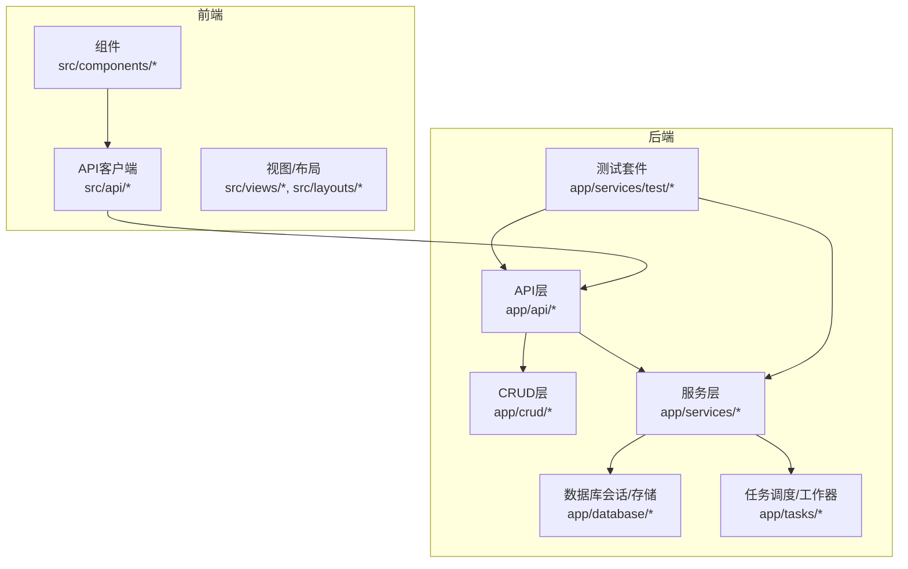
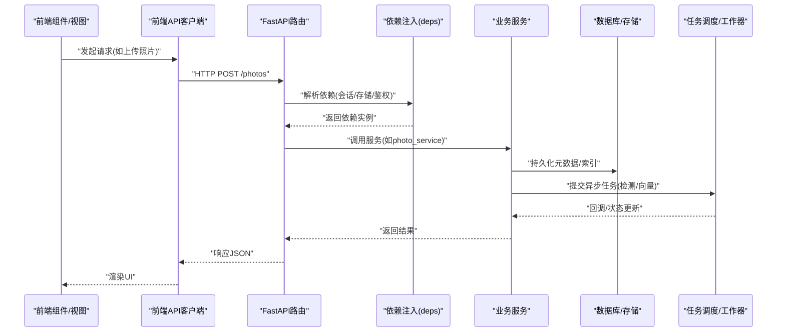
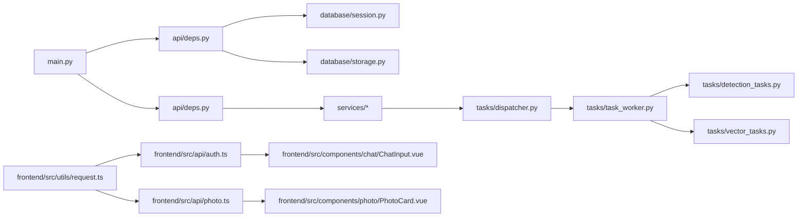

# 测试指南

<cite>
**本文引用的文件**   
- [backend/app/services/test/conftest.py](file://backend/app/services/test/conftest.py)
- [backend/app/services/test/test_agent.py](file://backend/app/services/test/test_agent.py)
- [backend/app/services/test/test_album_smart.py](file://backend/app/services/test/test_album_smart.py)
- [backend/app/services/test/test_detection.py](file://backend/app/services/test/test_detection.py)
- [backend/app/services/test/test_dispatcher.py](file://backend/app/services/test/test_dispatcher.py)
- [backend/app/services/test/test_exif.py](file://backend/app/services/test/test_exif.py)
- [backend/app/services/test/test_face_cluster.py](file://backend/app/services/test/test_face_cluster.py)
- [backend/app/services/test/test_geocode.py](file://backend/app/services/test/test_geocode.py)
- [backend/app/services/test/test_name_confirmation.py](file://backend/app/services/test/test_name_confirmation.py)
- [backend/app/services/test/test_search.py](file://backend/app/services/test/test_search.py)
- [backend/app/services/test/test_thumbnail.py](file://backend/app/services/test/test_thumbnail.py)
- [backend/main.py](file://backend/main.py)
- [backend/pyproject.toml](file://backend/pyproject.toml)
- [backend/app/api/deps.py](file://backend/app/api/deps.py)
- [backend/app/database/session.py](file://backend/app/database/session.py)
- [backend/app/database/storage.py](file://backend/app/database/storage.py)
- [backend/app/core/exceptions.py](file://backend/app/core/exceptions.py)
- [backend/app/core/logger.py](file://backend/app/core/logger.py)
- [backend/app/core/security.py](file://backend/app/core/security.py)
- [backend/app/models/__init__.py](file://backend/app/models/__init__.py)
- [backend/app/schemas/__init__.py](file://backend/app/schemas/__init__.py)
- [backend/app/tasks/dispatcher.py](file://backend/app/tasks/dispatcher.py)
- [backend/app/tasks/task_worker.py](file://backend/app/tasks/task_worker.py)
- [backend/app/tasks/detection_tasks.py](file://backend/app/tasks/detection_tasks.py)
- [backend/app/tasks/vector_tasks.py](file://backend/app/tasks/vector_tasks.py)
- [frontend/package.json](file://frontend/package.json)
- [frontend/vite.config.ts](file://frontend/vite.config.ts)
- [frontend/src/utils/request.ts](file://frontend/src/utils/request.ts)
- [frontend/src/api/auth.ts](file://frontend/src/api/auth.ts)
- [frontend/src/api/photo.ts](file://frontend/src/api/photo.ts)
- [frontend/src/components/chat/ChatInput.vue](file://frontend/src/components/chat/ChatInput.vue)
- [frontend/src/components/photo/PhotoCard.vue](file://frontend/src/components/photo/PhotoCard.vue)
</cite>

## 目录
1. [简介](#简介)
2. [项目结构](#项目结构)
3. [核心组件](#核心组件)
4. [架构总览](#架构总览)
5. [详细组件分析](#详细组件分析)
6. [依赖分析](#依赖分析)
7. [性能考虑](#性能考虑)
8. [故障排查指南](#故障排查指南)
9. [结论](#结论)
10. [附录](#附录)

## 简介
本指南面向AI相册项目的测试实践，覆盖后端（Python/FastAPI）与前端（Vue/Vite）的单元测试、集成测试与端到端测试策略；说明测试用例编写规范、Mock数据准备、测试环境搭建、覆盖率要求、持续集成与自动化流程，并提供API接口测试、数据库操作测试、AI服务集成测试、前端组件测试的具体示例路径。同时给出性能测试、压力测试与安全测试的指导方法，帮助团队建立稳定可靠的测试体系。

## 项目结构
本项目采用前后端分离架构：
- 后端位于 backend/，基于FastAPI，包含API层、CRUD、模型、Schema、服务层、任务调度与测试套件。
- 前端位于 frontend/，基于Vue + Vite，提供页面、组件、状态管理与API客户端封装。
- 测试集中在 backend/app/services/test/ 下，使用pytest组织；前端可通过Vitest或Playwright进行单元与E2E测试。

图表来源
- [backend/main.py:1-200](file://backend/main.py#L1-L200)
- [backend/app/api/deps.py:1-200](file://backend/app/api/deps.py#L1-L200)
- [backend/app/database/session.py:1-200](file://backend/app/database/session.py#L1-L200)
- [backend/app/database/storage.py:1-200](file://backend/app/database/storage.py#L1-L200)
- [backend/app/tasks/dispatcher.py:1-200](file://backend/app/tasks/dispatcher.py#L1-L200)
- [backend/app/tasks/task_worker.py:1-200](file://backend/app/tasks/task_worker.py#L1-L200)
- [frontend/src/utils/request.ts:1-200](file://frontend/src/utils/request.ts#L1-L200)
- [frontend/src/api/auth.ts:1-200](file://frontend/src/api/auth.ts#L1-200)
- [frontend/src/api/photo.ts:1-200](file://frontend/src/api/photo.ts#L1-200)

章节来源
- [backend/main.py:1-200](file://backend/main.py#L1-L200)
- [backend/pyproject.toml:1-200](file://backend/pyproject.toml#L1-L200)
- [frontend/package.json:1-200](file://frontend/package.json#L1-200)
- [frontend/vite.config.ts:1-200](file://frontend/vite.config.ts#L1-200)

## 核心组件
- 应用入口与中间件：后端通过main.py启动FastAPI应用，注册路由、异常处理、日志与安全策略。
- 依赖注入：api/deps.py集中管理数据库会话、存储、认证等依赖，便于在测试中替换为Mock。
- 数据库与存储：database/session.py负责会话生命周期，storage.py抽象对象存储访问。
- 任务系统：tasks/dispatcher.py与task_worker.py实现任务分发与工作器执行，支持异步检测与向量计算。
- 前端请求封装：utils/request.ts统一HTTP请求配置与错误处理，api/*模块按领域拆分。
- 测试框架：pytest + conftest.py集中定义fixture，test_*文件覆盖服务与工具逻辑。

章节来源
- [backend/main.py:1-200](file://backend/main.py#L1-L200)
- [backend/app/api/deps.py:1-200](file://backend/app/api/deps.py#L1-L200)
- [backend/app/database/session.py:1-200](file://backend/app/database/session.py#L1-L200)
- [backend/app/database/storage.py:1-200](file://backend/app/database/storage.py#L1-L200)
- [backend/app/tasks/dispatcher.py:1-200](file://backend/app/tasks/dispatcher.py#L1-L200)
- [backend/app/tasks/task_worker.py:1-200](file://backend/app/tasks/task_worker.py#L1-L200)
- [frontend/src/utils/request.ts:1-200](file://frontend/src/utils/request.ts#L1-200)

## 架构总览
下图展示从前端到后端的典型调用链，以及测试如何介入验证各层行为。

图表来源
- [backend/main.py:1-200](file://backend/main.py#L1-L200)
- [backend/app/api/deps.py:1-200](file://backend/app/api/deps.py#L1-L200)
- [backend/app/database/session.py:1-200](file://backend/app/database/session.py#L1-L200)
- [backend/app/tasks/dispatcher.py:1-200](file://backend/app/tasks/dispatcher.py#L1-L200)
- [frontend/src/utils/request.ts:1-200](file://frontend/src/utils/request.ts#L1-200)

## 详细组件分析

### 后端测试套件与策略
- 测试框架与配置
  - 使用pytest作为测试运行器，conftest.py集中定义fixture，包括数据库会话、存储、认证上下文、外部服务Mock等。
  - 建议启用覆盖率统计（例如coverage），并设置阈值（如行覆盖率≥80%）。
- 测试分层
  - 单元测试：针对服务与工具函数（如exif解析、缩略图生成、地理编码、人脸聚类、搜索算法等）。
  - 集成测试：通过TestClient对API路由进行端到端验证，结合事务回滚确保数据隔离。
  - 任务测试：对dispatcher与task_worker进行断言，验证任务入队、执行与状态流转。
- Mock策略
  - 使用依赖注入替换数据库会话、对象存储、第三方AI服务（嵌入、LLM、人脸识别等）。
  - 对外部网络请求使用httpx Mock或requests-mock，避免真实网络调用。
- 数据准备
  - 使用工厂模式或固定Fixture生成测试数据（用户、相册、照片、标签、任务等）。
  - 利用临时目录与内存存储模拟文件与向量索引。

章节来源
- [backend/app/services/test/conftest.py:1-200](file://backend/app/services/test/conftest.py#L1-L200)
- [backend/app/services/test/test_agent.py:1-200](file://backend/app/services/test/test_agent.py#L1-L200)
- [backend/app/services/test/test_album_smart.py:1-200](file://backend/app/services/test/test_album_smart.py#L1-L200)
- [backend/app/services/test/test_detection.py:1-200](file://backend/app/services/test/test_detection.py#L1-L200)
- [backend/app/services/test/test_dispatcher.py:1-200](file://backend/app/services/test/test_dispatcher.py#L1-L200)
- [backend/app/services/test/test_exif.py:1-200](file://backend/app/services/test/test_exif.py#L1-L200)
- [backend/app/services/test/test_face_cluster.py:1-200](file://backend/app/services/test/test_face_cluster.py#L1-L200)
- [backend/app/services/test/test_geocode.py:1-200](file://backend/app/services/test/test_geocode.py#L1-L200)
- [backend/app/services/test/test_name_confirmation.py:1-200](file://backend/app/services/test/test_name_confirmation.py#L1-L200)
- [backend/app/services/test/test_search.py:1-200](file://backend/app/services/test/test_search.py#L1-L200)
- [backend/app/services/test/test_thumbnail.py:1-200](file://backend/app/services/test/test_thumbnail.py#L1-L200)

#### 单元测试示例（服务与工具）
- 目标：验证EXIF解析、缩略图生成、地理编码、人脸聚类、名称确认、搜索排序等纯逻辑。
- 要点：
  - 输入构造：使用最小数据集与边界值。
  - 输出断言：字段完整性、类型正确性、异常分支覆盖。
  - 外部依赖：通过conftest中的fixture替换为Mock。
- 参考路径：
  - EXIF解析：[backend/app/services/test/test_exif.py](file://backend/app/services/test/test_exif.py)
  - 缩略图生成：[backend/app/services/test/test_thumbnail.py](file://backend/app/services/test/test_thumbnail.py)
  - 地理编码：[backend/app/services/test/test_geocode.py](file://backend/app/services/test/test_geocode.py)
  - 人脸聚类：[backend/app/services/test/test_face_cluster.py](file://backend/app/services/test/test_face_cluster.py)
  - 名称确认：[backend/app/services/test/test_name_confirmation.py](file://backend/app/services/test/test_name_confirmation.py)
  - 搜索逻辑：[backend/app/services/test/test_search.py](file://backend/app/services/test/test_search.py)

章节来源
- [backend/app/services/test/test_exif.py:1-200](file://backend/app/services/test/test_exif.py#L1-L200)
- [backend/app/services/test/test_thumbnail.py:1-200](file://backend/app/services/test/test_thumbnail.py#L1-L200)
- [backend/app/services/test/test_geocode.py:1-200](file://backend/app/services/test/test_geocode.py#L1-L200)
- [backend/app/services/test/test_face_cluster.py:1-200](file://backend/app/services/test/test_face_cluster.py#L1-L200)
- [backend/app/services/test/test_name_confirmation.py:1-200](file://backend/app/services/test/test_name_confirmation.py#L1-L200)
- [backend/app/services/test/test_search.py:1-200](file://backend/app/services/test/test_search.py#L1-L200)

#### 集成测试示例（API与服务）
- 目标：通过TestClient调用API路由，验证完整业务流程（如相册智能创建、检测任务触发）。
- 要点：
  - 使用事务夹具保证每次测试的数据隔离与自动回滚。
  - Mock外部AI服务（嵌入、LLM、人脸检测）以加速与稳定性。
  - 断言响应状态码、数据结构与副作用（如任务入队、索引更新）。
- 参考路径：
  - 相册智能：[backend/app/services/test/test_album_smart.py](file://backend/app/services/test/test_album_smart.py)
  - 检测流程：[backend/app/services/test/test_detection.py](file://backend/app/services/test/test_detection.py)
  - Agent交互：[backend/app/services/test/test_agent.py](file://backend/app/services/test/test_agent.py)

章节来源
- [backend/app/services/test/test_album_smart.py:1-200](file://backend/app/services/test/test_album_smart.py#L1-L200)
- [backend/app/services/test/test_detection.py:1-200](file://backend/app/services/test/test_detection.py#L1-L200)
- [backend/app/services/test/test_agent.py:1-200](file://backend/app/services/test/test_agent.py#L1-L200)

#### 任务系统测试（调度与工作器）
- 目标：验证任务分发、队列、工作器执行与状态同步。
- 要点：
  - 使用内存队列或轻量消息代理（如Redis）进行测试环境。
  - 断言任务入队、执行次数、重试与失败处理。
- 参考路径：
  - 调度器：[backend/app/services/test/test_dispatcher.py](file://backend/app/services/test/test_dispatcher.py)
  - 调度实现：[backend/app/tasks/dispatcher.py](file://backend/app/tasks/dispatcher.py)
  - 工作器：[backend/app/tasks/task_worker.py](file://backend/app/tasks/task_worker.py)
  - 检测任务：[backend/app/tasks/detection_tasks.py](file://backend/app/tasks/detection_tasks.py)
  - 向量任务：[backend/app/tasks/vector_tasks.py](file://backend/app/tasks/vector_tasks.py)

章节来源
- [backend/app/services/test/test_dispatcher.py:1-200](file://backend/app/services/test/test_dispatcher.py#L1-L200)
- [backend/app/tasks/dispatcher.py:1-200](file://backend/app/tasks/dispatcher.py#L1-L200)
- [backend/app/tasks/task_worker.py:1-200](file://backend/app/tasks/task_worker.py#L1-L200)
- [backend/app/tasks/detection_tasks.py:1-200](file://backend/app/tasks/detection_tasks.py#L1-L200)
- [backend/app/tasks/vector_tasks.py:1-200](file://backend/app/tasks/vector_tasks.py#L1-L200)

### 前端测试策略与示例
- 测试框架选择
  - 单元测试：推荐使用Vitest，配合@vue/test-utils对组件进行渲染与交互断言。
  - E2E测试：推荐使用Playwright或Cypress，覆盖登录、上传、相册浏览、搜索等关键路径。
- 测试分层
  - 组件测试：对ChatInput、PhotoCard等组件进行渲染、事件与状态变更断言。
  - API客户端测试：对request.ts封装进行拦截与Mock，验证请求参数、错误处理与重试策略。
  - 页面级测试：组合多个组件与路由，验证页面导航与数据流。
- Mock策略
  - 使用Vitest的mock功能或MSW（Mock Service Worker）拦截HTTP请求。
  - 对第三方SDK（地图、AI）进行桩实现，返回确定性数据。
- 数据准备
  - 使用固定JSON样例与随机工厂生成大量数据，覆盖边界条件。

章节来源
- [frontend/package.json:1-200](file://frontend/package.json#L1-200)
- [frontend/vite.config.ts:1-200](file://frontend/vite.config.ts#L1-200)
- [frontend/src/utils/request.ts:1-200](file://frontend/src/utils/request.ts#L1-200)
- [frontend/src/api/auth.ts:1-200](file://frontend/src/api/auth.ts#L1-200)
- [frontend/src/api/photo.ts:1-200](file://frontend/src/api/photo.ts#L1-200)
- [frontend/src/components/chat/ChatInput.vue:1-200](file://frontend/src/components/chat/ChatInput.vue#L1-200)
- [frontend/src/components/photo/PhotoCard.vue:1-200](file://frontend/src/components/photo/PhotoCard.vue#L1-200)

#### 前端组件测试示例
- 目标：验证组件渲染、事件处理与状态更新。
- 要点：
  - 使用mount/shallowMount渲染组件，触发点击、输入等交互。
  - 断言DOM变化、子组件props与事件派发。
  - 对API调用进行拦截，返回预设响应。
- 参考路径：
  - Chat输入组件：[frontend/src/components/chat/ChatInput.vue](file://frontend/src/components/chat/ChatInput.vue)
  - 照片卡片组件：[frontend/src/components/photo/PhotoCard.vue](file://frontend/src/components/photo/PhotoCard.vue)

章节来源
- [frontend/src/components/chat/ChatInput.vue:1-200](file://frontend/src/components/chat/ChatInput.vue#L1-200)
- [frontend/src/components/photo/PhotoCard.vue:1-200](file://frontend/src/components/photo/PhotoCard.vue#L1-200)

#### 前端API客户端测试示例
- 目标：验证请求封装的错误处理、超时与重试。
- 要点：
  - 使用Vitest.mock或MSW拦截fetch/axios调用。
  - 断言请求头、URL、方法与响应映射。
- 参考路径：
  - 请求封装：[frontend/src/utils/request.ts](file://frontend/src/utils/request.ts)
  - 认证API：[frontend/src/api/auth.ts](file://frontend/src/api/auth.ts)
  - 照片API：[frontend/src/api/photo.ts](file://frontend/src/api/photo.ts)

章节来源
- [frontend/src/utils/request.ts:1-200](file://frontend/src/utils/request.ts#L1-200)
- [frontend/src/api/auth.ts:1-200](file://frontend/src/api/auth.ts#L1-200)
- [frontend/src/api/photo.ts:1-200](file://frontend/src/api/photo.ts#L1-200)

## 依赖分析
- 后端依赖
  - FastAPI应用入口与中间件：main.py
  - 依赖注入：api/deps.py
  - 数据库与会话：database/session.py
  - 对象存储：database/storage.py
  - 任务系统：tasks/dispatcher.py、task_worker.py、detection_tasks.py、vector_tasks.py
- 前端依赖
  - 构建与测试配置：package.json、vite.config.ts
  - 请求封装：utils/request.ts
  - API模块：api/auth.ts、api/photo.ts
  - 组件：components/chat/ChatInput.vue、components/photo/PhotoCard.vue

图表来源
- [backend/main.py:1-200](file://backend/main.py#L1-L200)
- [backend/app/api/deps.py:1-200](file://backend/app/api/deps.py#L1-L200)
- [backend/app/database/session.py:1-200](file://backend/app/database/session.py#L1-L200)
- [backend/app/database/storage.py:1-200](file://backend/app/database/storage.py#L1-L200)
- [backend/app/tasks/dispatcher.py:1-200](file://backend/app/tasks/dispatcher.py#L1-L200)
- [backend/app/tasks/task_worker.py:1-200](file://backend/app/tasks/task_worker.py#L1-L200)
- [backend/app/tasks/detection_tasks.py:1-200](file://backend/app/tasks/detection_tasks.py#L1-L200)
- [backend/app/tasks/vector_tasks.py:1-200](file://backend/app/tasks/vector_tasks.py#L1-L200)
- [frontend/src/utils/request.ts:1-200](file://frontend/src/utils/request.ts#L1-200)
- [frontend/src/api/auth.ts:1-200](file://frontend/src/api/auth.ts#L1-200)
- [frontend/src/api/photo.ts:1-200](file://frontend/src/api/photo.ts#L1-200)
- [frontend/src/components/chat/ChatInput.vue:1-200](file://frontend/src/components/chat/ChatInput.vue#L1-200)
- [frontend/src/components/photo/PhotoCard.vue:1-200](file://frontend/src/components/photo/PhotoCard.vue#L1-200)

章节来源
- [backend/main.py:1-200](file://backend/main.py#L1-L200)
- [backend/app/api/deps.py:1-200](file://backend/app/api/deps.py#L1-L200)
- [backend/app/database/session.py:1-200](file://backend/app/database/session.py#L1-L200)
- [backend/app/database/storage.py:1-200](file://backend/app/database/storage.py#L1-L200)
- [backend/app/tasks/dispatcher.py:1-200](file://backend/app/tasks/dispatcher.py#L1-L200)
- [backend/app/tasks/task_worker.py:1-200](file://backend/app/tasks/task_worker.py#L1-L200)
- [backend/app/tasks/detection_tasks.py:1-200](file://backend/app/tasks/detection_tasks.py#L1-L200)
- [backend/app/tasks/vector_tasks.py:1-200](file://backend/app/tasks/vector_tasks.py#L1-L200)
- [frontend/src/utils/request.ts:1-200](file://frontend/src/utils/request.ts#L1-200)
- [frontend/src/api/auth.ts:1-200](file://frontend/src/api/auth.ts#L1-200)
- [frontend/src/api/photo.ts:1-200](file://frontend/src/api/photo.ts#L1-200)
- [frontend/src/components/chat/ChatInput.vue:1-200](file://frontend/src/components/chat/ChatInput.vue#L1-200)
- [frontend/src/components/photo/PhotoCard.vue:1-200](file://frontend/src/components/photo/PhotoCard.vue#L1-200)

## 性能考虑
- 后端性能测试
  - 使用locust或k6对关键API（上传、搜索、相册列表）进行负载与压力测试。
  - 关注CPU密集型任务（人脸检测、向量计算）的并发与资源占用，必要时引入限流与批处理。
- 前端性能测试
  - 使用浏览器开发者工具与Lighthouse评估首屏加载、交互延迟与内存占用。
  - 对大列表（照片网格）进行虚拟滚动与分页优化验证。
- AI服务集成性能
  - 对嵌入与LLM调用进行缓存与批量请求优化，减少RTT与Token消耗。
  - 监控外部服务SLA与降级策略，确保主流程可用性。

[本节为通用指导，不直接分析具体文件]

## 故障排查指南
- 常见错误定位
  - 数据库连接失败：检查session fixture与连接字符串，确认测试数据库可用。
  - 存储路径权限：确保临时目录存在且可写，或使用内存存储。
  - 外部服务不可用：通过Mock替代真实网络请求，避免CI不稳定。
- 日志与调试
  - 使用core/logger.py统一日志格式，开启DEBUG级别收集堆栈信息。
  - 在异常处理中使用core/exceptions.py自定义错误类型，便于断言与分类。
- 安全相关
  - 使用core/security.py中的认证与授权逻辑，确保测试覆盖未授权访问与越权场景。

章节来源
- [backend/app/core/logger.py:1-200](file://backend/app/core/logger.py#L1-L200)
- [backend/app/core/exceptions.py:1-200](file://backend/app/core/exceptions.py#L1-L200)
- [backend/app/core/security.py:1-200](file://backend/app/core/security.py#L1-L200)

## 结论
通过分层测试策略（单元、集成、端到端）、完善的Mock与数据准备、严格的覆盖率与CI自动化，以及性能与安全测试的补充，AI相册项目能够持续提升质量与稳定性。建议将测试纳入日常开发流程，并在关键路径增加回归用例，保障AI能力与业务逻辑的长期演进。

[本节为总结性内容，不直接分析具体文件]

## 附录

### 测试用例编写规范
- 命名约定
  - 文件名：test_<模块>.py
  - 函数名：test_<功能>_<场景>
- 结构规范
  - Given-When-Then三段式描述前置条件、动作与断言。
  - 每个用例聚焦单一职责，避免耦合。
- 数据准备
  - 使用conftest.py中的fixture生成最小必要数据。
  - 对复杂对象使用工厂方法，提高可读性与复用性。
- 断言策略
  - 优先断言业务结果而非实现细节。
  - 对异常路径明确断言错误类型与消息。

章节来源
- [backend/app/services/test/conftest.py:1-200](file://backend/app/services/test/conftest.py#L1-L200)

### Mock数据准备与环境搭建
- 数据库
  - 使用SQLite内存库或PostgreSQL测试实例，配合事务夹具隔离数据。
- 对象存储
  - 使用本地临时目录或MinIO测试实例，确保路径一致性与清理策略。
- 外部服务
  - 使用httpx Mock或requests-mock拦截网络请求，返回确定性响应。
- 环境变量
  - 通过pytest-env或dotenv加载测试配置，避免硬编码。

章节来源
- [backend/app/database/session.py:1-200](file://backend/app/database/session.py#L1-L200)
- [backend/app/database/storage.py:1-200](file://backend/app/database/storage.py#L1-L200)

### 覆盖率要求与报告
- 覆盖率指标
  - 行覆盖率≥80%，分支覆盖率≥70%。
- 报告生成
  - 使用coverage生成HTML与XML报告，便于CI归档与趋势分析。
- 阈值控制
  - 在CI中设置最低覆盖率门槛，未达标则构建失败。

章节来源
- [backend/pyproject.toml:1-200](file://backend/pyproject.toml#L1-L200)

### 持续集成与自动化流程
- CI流水线
  - 安装依赖、运行单元测试与集成测试、生成覆盖率报告。
  - 前端构建与组件测试并行执行，缩短反馈时间。
- 缓存与并行
  - 缓存依赖包与构建产物，提升速度。
  - 分片执行测试用例，充分利用多核资源。
- 通知与归档
  - 失败时发送通知，归档测试报告与日志以便回溯。

章节来源
- [backend/pyproject.toml:1-200](file://backend/pyproject.toml#L1-L200)
- [frontend/package.json:1-200](file://frontend/package.json#L1-200)
- [frontend/vite.config.ts:1-200](file://frontend/vite.config.ts#L1-L200)

### API接口测试示例
- 目标：验证认证、照片上传、相册管理等API的正确性与健壮性。
- 要点：
  - 使用TestClient模拟HTTP请求，断言状态码与响应体结构。
  - 覆盖成功、参数缺失、权限不足、重复上传等场景。
- 参考路径：
  - 认证API：[backend/app/api/auth.py](file://backend/app/api/auth.py)
  - 照片API：[backend/app/api/photo.py](file://backend/app/api/photo.py)
  - 相册API：[backend/app/api/album.py](file://backend/app/api/album.py)

章节来源
- [backend/app/api/auth.py:1-200](file://backend/app/api/auth.py#L1-L200)
- [backend/app/api/photo.py:1-200](file://backend/app/api/photo.py#L1-L200)
- [backend/app/api/album.py:1-200](file://backend/app/api/album.py#L1-L200)

### 数据库操作测试示例
- 目标：验证CRUD操作的原子性、约束与一致性。
- 要点：
  - 使用事务夹具，确保测试间数据隔离。
  - 断言插入、更新、删除后的查询结果与关联关系。
- 参考路径：
  - 会话管理：[backend/app/database/session.py](file://backend/app/database/session.py)
  - 模型定义：[backend/app/models/__init__.py](file://backend/app/models/__init__.py)
  - Schema校验：[backend/app/schemas/__init__.py](file://backend/app/schemas/__init__.py)

章节来源
- [backend/app/database/session.py:1-200](file://backend/app/database/session.py#L1-L200)
- [backend/app/models/__init__.py:1-200](file://backend/app/models/__init__.py#L1-L200)
- [backend/app/schemas/__init__.py:1-200](file://backend/app/schemas/__init__.py#L1-L200)

### AI服务集成测试示例
- 目标：验证嵌入生成、LLM对话、人脸检测等AI能力的集成。
- 要点：
  - 使用Mock替代外部AI服务，返回固定向量与检测结果。
  - 断言下游流程（索引、搜索、聚类）的正确性。
- 参考路径：
  - 嵌入服务：[backend/app/services/ai_providers/embedding.py](file://backend/app/services/ai_providers/embedding.py)
  - LLM代理：[backend/app/services/agent/llm_agent.py](file://backend/app/services/agent/llm_agent.py)
  - 人脸检测：[backend/app/services/face_detect_service.py](file://backend/app/services/face_detect_service.py)

章节来源
- [backend/app/services/ai_providers/embedding.py:1-200](file://backend/app/services/ai_providers/embedding.py#L1-L200)
- [backend/app/services/agent/llm_agent.py:1-200](file://backend/app/services/agent/llm_agent.py#L1-L200)
- [backend/app/services/face_detect_service.py:1-200](file://backend/app/services/face_detect_service.py#L1-L200)

### 前端组件测试示例
- 目标：验证组件渲染、事件与状态更新。
- 要点：
  - 使用@vue/test-utils进行挂载与交互。
  - 断言DOM变化、子组件props与事件派发。
- 参考路径：
  - 聊天输入：[frontend/src/components/chat/ChatInput.vue](file://frontend/src/components/chat/ChatInput.vue)
  - 照片卡片：[frontend/src/components/photo/PhotoCard.vue](file://frontend/src/components/photo/PhotoCard.vue)

章节来源
- [frontend/src/components/chat/ChatInput.vue:1-200](file://frontend/src/components/chat/ChatInput.vue#L1-L200)
- [frontend/src/components/photo/PhotoCard.vue:1-200](file://frontend/src/components/photo/PhotoCard.vue#L1-L200)

### 性能测试、压力测试与安全测试指导
- 性能测试
  - 使用locust/k6对关键API进行基准与负载测试，记录P95/P99延迟与吞吐。
- 压力测试
  - 模拟高并发上传与搜索，观察CPU、内存与I/O瓶颈，必要时扩容或优化。
- 安全测试
  - 覆盖未授权访问、越权操作、SQL注入与XSS防护。
  - 对敏感数据进行脱敏与加密，确保日志不包含机密信息。

[本节为通用指导，不直接分析具体文件]