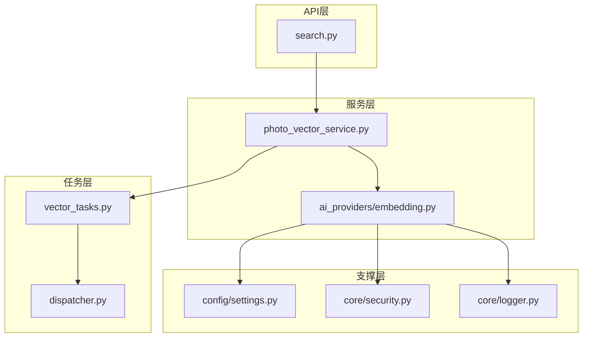
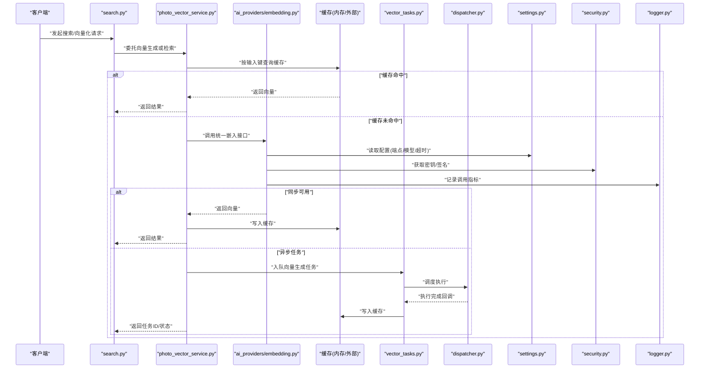
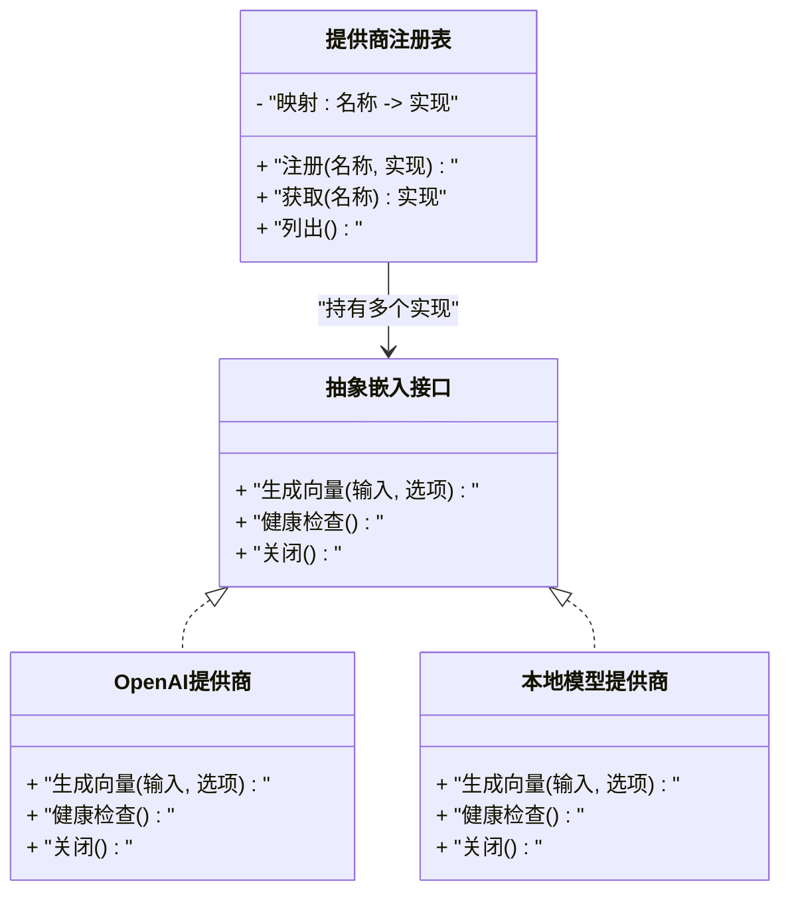
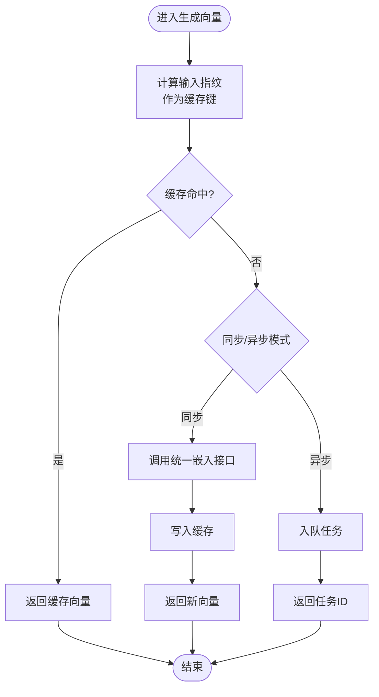
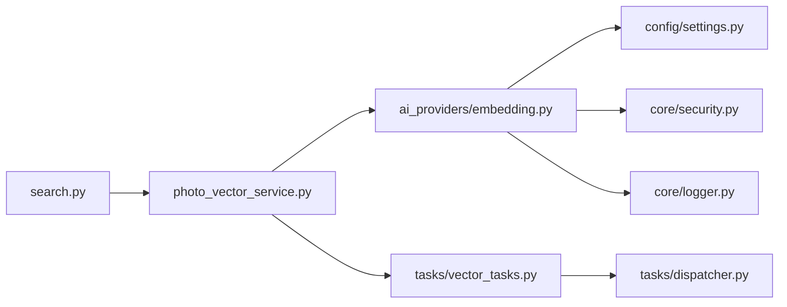

# AI服务集成层

<cite>
**本文引用的文件**   
- [backend/app/services/ai_providers/embedding.py](file://backend/app/services/ai_providers/embedding.py)
- [backend/app/services/photo_vector_service.py](file://backend/app/services/photo_vector_service.py)
- [backend/app/api/search.py](file://backend/app/api/search.py)
- [backend/app/config/settings.py](file://backend/app/config/settings.py)
- [backend/app/core/security.py](file://backend/app/core/security.py)
- [backend/app/tasks/vector_tasks.py](file://backend/app/tasks/vector_tasks.py)
- [backend/app/tasks/dispatcher.py](file://backend/app/tasks/dispatcher.py)
- [backend/app/core/logger.py](file://backend/app/core/logger.py)
</cite>

## 目录
1. [简介](#简介)
2. [项目结构](#项目结构)
3. [核心组件](#核心组件)
4. [架构总览](#架构总览)
5. [详细组件分析](#详细组件分析)
6. [依赖关系分析](#依赖关系分析)
7. [性能考虑](#性能考虑)
8. [故障排查指南](#故障排查指南)
9. [结论](#结论)
10. [附录](#附录)

## 简介
本文件面向AI服务集成层，聚焦以下目标：
- 统一AI服务提供商抽象层设计：定义统一接口、服务注册机制与动态加载策略。
- 嵌入向量生成服务实现：涵盖OpenAI API集成、本地模型支持与缓存策略。
- 配置管理、密钥管理与安全认证机制。
- 服务熔断、重试机制与性能监控方案。
- 自定义AI服务提供商的集成指南与最佳实践。

## 项目结构
后端采用分层与模块化组织方式，AI相关能力集中在services与tasks中，API层通过路由暴露能力，配置与安全由core与config模块提供。

图表来源
- [backend/app/api/search.py](file://backend/app/api/search.py)
- [backend/app/services/photo_vector_service.py](file://backend/app/services/photo_vector_service.py)
- [backend/app/services/ai_providers/embedding.py](file://backend/app/services/ai_providers/embedding.py)
- [backend/app/tasks/vector_tasks.py](file://backend/app/tasks/vector_tasks.py)
- [backend/app/tasks/dispatcher.py](file://backend/app/tasks/dispatcher.py)
- [backend/app/config/settings.py](file://backend/app/config/settings.py)
- [backend/app/core/security.py](file://backend/app/core/security.py)
- [backend/app/core/logger.py](file://backend/app/core/logger.py)

章节来源
- [backend/app/api/search.py](file://backend/app/api/search.py)
- [backend/app/services/photo_vector_service.py](file://backend/app/services/photo_vector_service.py)
- [backend/app/services/ai_providers/embedding.py](file://backend/app/services/ai_providers/embedding.py)
- [backend/app/tasks/vector_tasks.py](file://backend/app/tasks/vector_tasks.py)
- [backend/app/tasks/dispatcher.py](file://backend/app/tasks/dispatcher.py)
- [backend/app/config/settings.py](file://backend/app/config/settings.py)
- [backend/app/core/security.py](file://backend/app/core/security.py)
- [backend/app/core/logger.py](file://backend/app/core/logger.py)

## 核心组件
- 统一AI提供商抽象层
  - 目标：屏蔽不同AI供应商差异，向上提供一致的嵌入向量生成接口；支持运行时选择与扩展。
  - 关键职责：接口契约、实例化与注册、参数校验、错误归一化、可观测性埋点。
- 嵌入向量生成服务
  - 目标：将图片转换为向量表示，供检索与聚类使用。
  - 关键职责：调用抽象层、处理输入输出、缓存命中与回写、异步任务编排。
- 配置与安全
  - 目标：集中管理AI服务配置（端点、模型、超时、并发等）与密钥（如OpenAI Key），并提供安全访问。
- 任务调度与执行
  - 目标：将耗时的向量生成放入任务队列，解耦请求路径，提升吞吐与稳定性。

章节来源
- [backend/app/services/ai_providers/embedding.py](file://backend/app/services/ai_providers/embedding.py)
- [backend/app/services/photo_vector_service.py](file://backend/app/services/photo_vector_service.py)
- [backend/app/config/settings.py](file://backend/app/config/settings.py)
- [backend/app/core/security.py](file://backend/app/core/security.py)
- [backend/app/tasks/vector_tasks.py](file://backend/app/tasks/vector_tasks.py)
- [backend/app/tasks/dispatcher.py](file://backend/app/tasks/dispatcher.py)

## 架构总览
下图展示从API到AI提供商的整体数据流与控制流，包括缓存、任务队列与可观测性。

图表来源
- [backend/app/api/search.py](file://backend/app/api/search.py)
- [backend/app/services/photo_vector_service.py](file://backend/app/services/photo_vector_service.py)
- [backend/app/services/ai_providers/embedding.py](file://backend/app/services/ai_providers/embedding.py)
- [backend/app/tasks/vector_tasks.py](file://backend/app/tasks/vector_tasks.py)
- [backend/app/tasks/dispatcher.py](file://backend/app/tasks/dispatcher.py)
- [backend/app/config/settings.py](file://backend/app/config/settings.py)
- [backend/app/core/security.py](file://backend/app/core/security.py)
- [backend/app/core/logger.py](file://backend/app/core/logger.py)

## 详细组件分析

### 统一AI提供商抽象层
- 设计要点
  - 统一接口：对外暴露一致的“文本/图像→向量”方法，屏蔽供应商差异。
  - 服务注册：以命名空间或类型标识进行注册，便于运行时选择与切换。
  - 动态加载：根据配置项选择具体实现，支持热插拔扩展。
  - 错误归一化：将不同供应商的错误码映射为内部异常，便于上层统一处理。
  - 可观测性：在关键路径记录耗时、成功率、失败原因等指标。
- 典型流程
  - 初始化时扫描已注册的提供商实现，构建名称到实现的映射。
  - 请求到达时，依据配置解析出目标提供商并调用其统一接口。
  - 若调用失败，触发重试/熔断逻辑（见后文）。

图表来源
- [backend/app/services/ai_providers/embedding.py](file://backend/app/services/ai_providers/embedding.py)

章节来源
- [backend/app/services/ai_providers/embedding.py](file://backend/app/services/ai_providers/embedding.py)

### 嵌入向量生成服务（OpenAI与本地模型）
- 功能范围
  - 支持OpenAI API与本地模型两种后端。
  - 输入预处理（编码、尺寸裁剪、归一化等）与输出后处理（标准化、截断等）。
  - 可选缓存：对相同输入快速返回历史向量，降低延迟与成本。
  - 可选异步：将大体积或高并发场景下的计算卸载至任务队列。
- 关键流程（同步）
  - 计算输入指纹（如哈希）作为缓存键。
  - 查询缓存，命中则直接返回。
  - 未命中则调用统一嵌入接口，成功后写入缓存。
- 关键流程（异步）
  - 将任务入队，立即返回任务ID。
  - 后台执行完成后更新缓存，并通过回调或轮询通知结果。

图表来源
- [backend/app/services/photo_vector_service.py](file://backend/app/services/photo_vector_service.py)
- [backend/app/services/ai_providers/embedding.py](file://backend/app/services/ai_providers/embedding.py)
- [backend/app/tasks/vector_tasks.py](file://backend/app/tasks/vector_tasks.py)

章节来源
- [backend/app/services/photo_vector_service.py](file://backend/app/services/photo_vector_service.py)
- [backend/app/services/ai_providers/embedding.py](file://backend/app/services/ai_providers/embedding.py)
- [backend/app/tasks/vector_tasks.py](file://backend/app/tasks/vector_tasks.py)

### 配置管理、密钥管理与安全认证
- 配置项建议
  - 通用：默认提供商、超时、最大重试次数、熔断阈值、日志级别。
  - OpenAI：API密钥、模型名、端点、速率限制、并发数。
  - 本地模型：模型路径、设备（CPU/GPU）、批大小、精度。
  - 缓存：存储类型（内存/Redis）、TTL、最大容量。
- 密钥管理
  - 优先从环境变量或受保护的配置中心注入。
  - 运行时仅保留最小必要权限，避免明文落盘。
- 安全认证
  - 对外部API调用自动附加鉴权头或签名。
  - 敏感字段不落日志，必要时脱敏。

章节来源
- [backend/app/config/settings.py](file://backend/app/config/settings.py)
- [backend/app/core/security.py](file://backend/app/core/security.py)

### 任务调度与执行
- 角色分工
  - vector_tasks：定义向量生成任务结构与执行逻辑。
  - dispatcher：负责任务分发、重试、失败告警与资源隔离。
- 执行特性
  - 幂等：同一任务多次执行不产生副作用。
  - 可恢复：失败可重试，支持退避策略。
  - 可观测：记录任务生命周期事件与指标。

章节来源
- [backend/app/tasks/vector_tasks.py](file://backend/app/tasks/vector_tasks.py)
- [backend/app/tasks/dispatcher.py](file://backend/app/tasks/dispatcher.py)

### API接入与使用
- search.py作为入口，将用户请求委派给向量服务，并根据业务需求组合检索结果。
- 支持同步与异步两种响应模式，便于前端适配。

章节来源
- [backend/app/api/search.py](file://backend/app/api/search.py)

## 依赖关系分析
- 组件耦合
  - API层仅依赖服务层，不直接感知AI提供商细节。
  - 服务层通过抽象层与提供商解耦，同时依赖配置与安全模块。
  - 任务层与服务层通过消息/回调交互，降低同步阻塞。
- 外部依赖
  - OpenAI SDK或HTTP客户端（用于远程调用）。
  - 本地推理框架（如PyTorch/TensorFlow，视本地模型实现而定）。
  - 缓存系统（内存字典或Redis）。
  - 任务队列（如Celery/RQ，视dispatcher实现而定）。

图表来源
- [backend/app/api/search.py](file://backend/app/api/search.py)
- [backend/app/services/photo_vector_service.py](file://backend/app/services/photo_vector_service.py)
- [backend/app/services/ai_providers/embedding.py](file://backend/app/services/ai_providers/embedding.py)
- [backend/app/config/settings.py](file://backend/app/config/settings.py)
- [backend/app/core/security.py](file://backend/app/core/security.py)
- [backend/app/core/logger.py](file://backend/app/core/logger.py)
- [backend/app/tasks/vector_tasks.py](file://backend/app/tasks/vector_tasks.py)
- [backend/app/tasks/dispatcher.py](file://backend/app/tasks/dispatcher.py)

章节来源
- [backend/app/api/search.py](file://backend/app/api/search.py)
- [backend/app/services/photo_vector_service.py](file://backend/app/services/photo_vector_service.py)
- [backend/app/services/ai_providers/embedding.py](file://backend/app/services/ai_providers/embedding.py)
- [backend/app/config/settings.py](file://backend/app/config/settings.py)
- [backend/app/core/security.py](file://backend/app/core/security.py)
- [backend/app/core/logger.py](file://backend/app/core/logger.py)
- [backend/app/tasks/vector_tasks.py](file://backend/app/tasks/vector_tasks.py)
- [backend/app/tasks/dispatcher.py](file://backend/app/tasks/dispatcher.py)

## 性能考虑
- 缓存策略
  - 热点输入优先命中缓存，显著降低延迟与外部调用成本。
  - 合理设置TTL与容量上限，避免内存膨胀。
- 并发与批处理
  - 对本地模型启用批处理以提升吞吐。
  - 对远程API控制并发度，避免触发限流。
- 异步化
  - 将耗时计算移至任务队列，缩短请求RTT。
- 连接池与复用
  - HTTP客户端与数据库/缓存连接复用，减少握手开销。
- 指标与监控
  - 记录P50/P95/P99延迟、错误率、缓存命中率、队列积压等。

[本节为通用指导，无需特定文件引用]

## 故障排查指南
- 常见问题定位
  - 配置缺失或密钥无效：检查配置项是否注入、密钥是否过期。
  - 外部API限流或超时：查看重试与熔断配置，适当放宽或降级。
  - 缓存不一致：核对缓存键生成规则与失效策略。
  - 任务堆积：观察队列长度与消费者数量，扩容或优化单任务耗时。
- 可观测性
  - 使用日志模块记录关键路径事件与异常堆栈。
  - 结合指标面板追踪趋势与异常峰值。

章节来源
- [backend/app/core/logger.py](file://backend/app/core/logger.py)
- [backend/app/config/settings.py](file://backend/app/config/settings.py)
- [backend/app/core/security.py](file://backend/app/core/security.py)

## 结论
通过统一的AI提供商抽象层、清晰的嵌入向量生成服务、完善的配置与安全机制以及任务化与可观测性建设，系统能够在多供应商、多部署形态下稳定运行，并具备良好的扩展性与运维可控性。

[本节为总结性内容，无需特定文件引用]

## 附录

### 自定义AI服务提供商集成指南
- 步骤
  1. 实现统一嵌入接口（包含生成向量、健康检查、关闭等方法）。
  2. 在启动阶段将实现注册到提供商注册表，指定唯一名称。
  3. 在配置中声明默认提供商或按请求维度选择提供商。
  4. 遵循错误归一化与可观测性要求，确保与现有生态一致。
- 最佳实践
  - 保持幂等与健壮的重试/熔断策略。
  - 对敏感信息做最小暴露与脱敏处理。
  - 提供健康检查与就绪探针，便于编排平台治理。
  - 编写单元测试覆盖边界条件与异常路径。

[本节为概念性指导，无需特定文件引用]