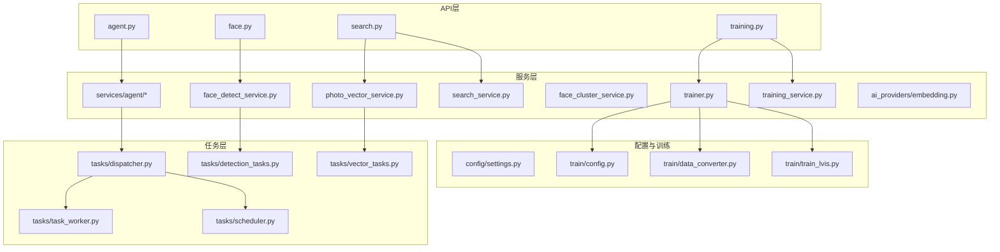
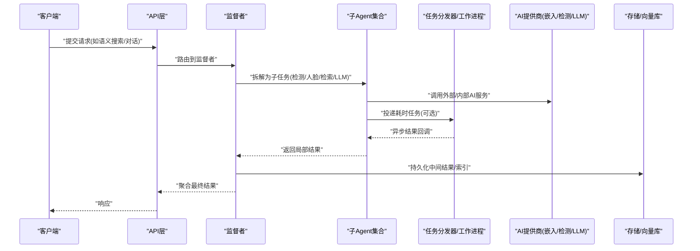
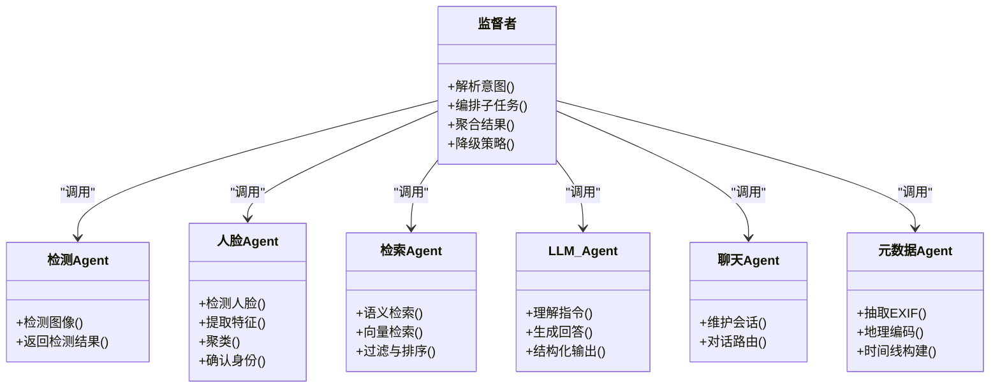
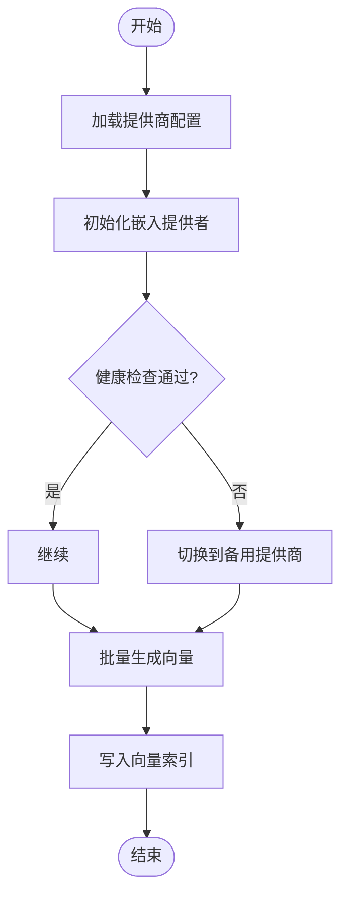
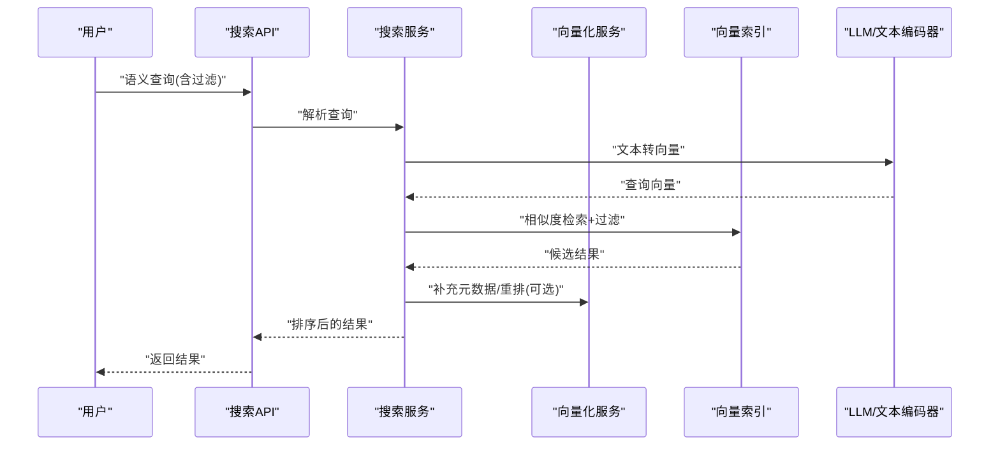
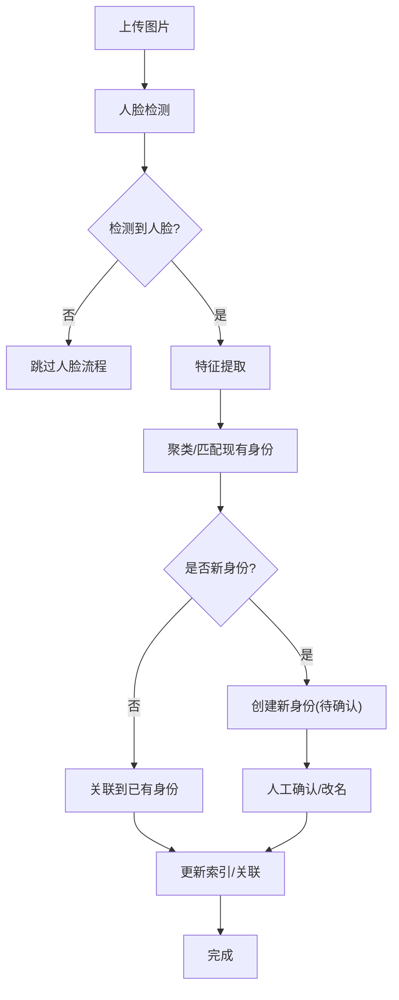
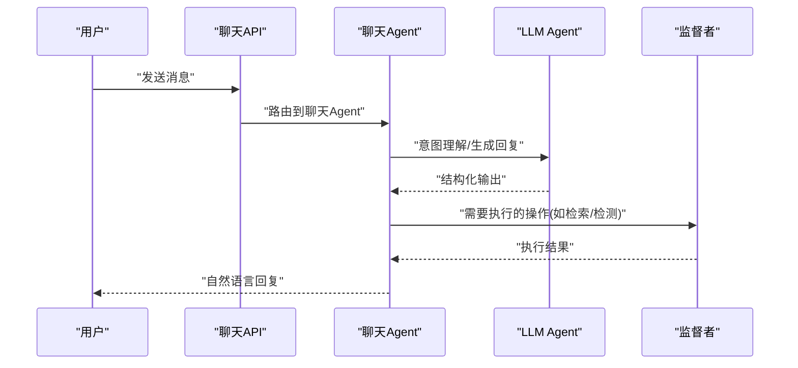
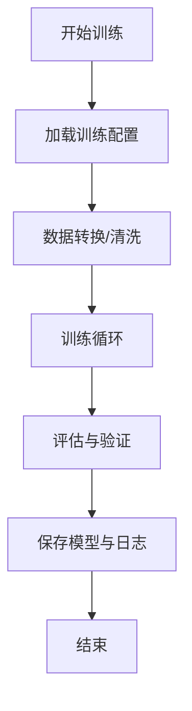
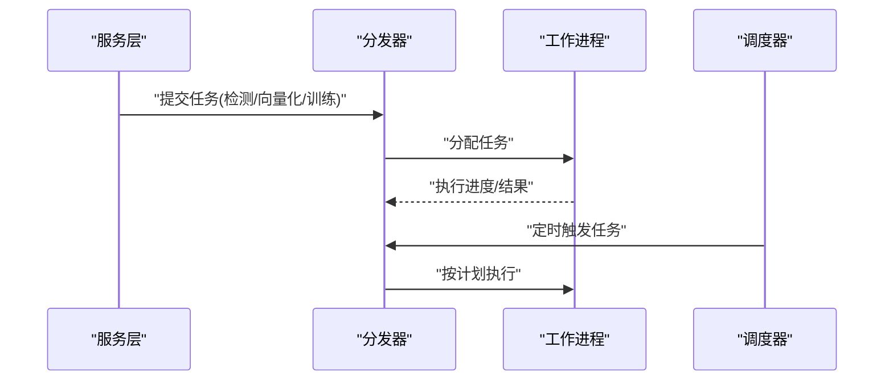
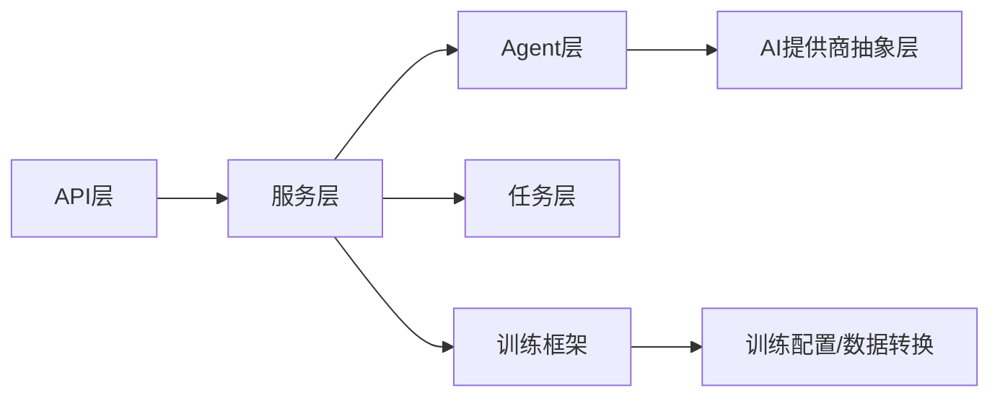

# AI架构设计

<cite>
**本文引用的文件**   
- [supervisor.py](file://backend/app/services/agent/supervisor.py)
- [detection_agent.py](file://backend/app/services/agent/detection_agent.py)
- [face_agent.py](file://backend/app/services/agent/face_agent.py)
- [search_agent.py](file://backend/app/services/agent/search_agent.py)
- [llm_agent.py](file://backend/app/services/agent/llm_agent.py)
- [chat_agent.py](file://backend/app/services/agent/chat_agent.py)
- [metadata_agent.py](file://backend/app/services/agent/metadata_agent.py)
- [embedding.py](file://backend/app/services/ai_providers/embedding.py)
- [photo_vector_service.py](file://backend/app/services/photo_vector_service.py)
- [search_service.py](file://backend/app/services/search_service.py)
- [face_detect_service.py](file://backend/app/services/face_detect_service.py)
- [face_cluster_service.py](file://backend/app/services/face_cluster_service.py)
- [trainer.py](file://backend/app/services/trainer.py)
- [training_service.py](file://backend/app/services/training_service.py)
- [config.py](file://backend/app/services/train/config.py)
- [data_converter.py](file://backend/app/services/train/data_converter.py)
- [train_lvis.py](file://backend/app/services/train/train_lvis.py)
- [dispatcher.py](file://backend/app/tasks/dispatcher.py)
- [task_worker.py](file://backend/app/tasks/task_worker.py)
- [scheduler.py](file://backend/app/tasks/scheduler.py)
- [detection_tasks.py](file://backend/app/tasks/detection_tasks.py)
- [vector_tasks.py](file://backend/app/tasks/vector_tasks.py)
- [agent.py](file://backend/app/api/agent.py)
- [face.py](file://backend/app/api/face.py)
- [search.py](file://backend/app/api/search.py)
- [training.py](file://backend/app/api/training.py)
- [settings.py](file://backend/app/config/settings.py)
</cite>

## 目录
1. [简介](#简介)
2. [项目结构](#项目结构)
3. [核心组件](#核心组件)
4. [架构总览](#架构总览)
5. [详细组件分析](#详细组件分析)
6. [依赖关系分析](#依赖关系分析)
7. [性能与容错](#性能与容错)
8. [故障排查指南](#故障排查指南)
9. [结论](#结论)
10. [附录：调用示例与集成指南](#附录调用示例与集成指南)

## 简介
本文件面向AI智能相册管理系统的AI架构，系统性阐述多Agent协作、监督者模式、任务分发与结果聚合策略；抽象层对AI服务提供商的封装；向量检索实现与模型训练框架；人脸识别流程、语义搜索算法与自然语言处理集成；以及容错机制、负载均衡与性能优化方案。文档同时提供功能调用示例与自定义AI服务集成指南，帮助开发者快速扩展与落地。

## 项目结构
后端采用分层与领域驱动相结合的组织方式：API层暴露REST接口，服务层承载业务与AI能力，Agent层实现多Agent协作，任务层负责异步调度与执行，配置与模型训练位于独立模块。

图表来源
- [agent.py:1-200](file://backend/app/api/agent.py#L1-L200)
- [face.py:1-200](file://backend/app/api/face.py#L1-L200)
- [search.py:1-200](file://backend/app/api/search.py#L1-L200)
- [training.py:1-200](file://backend/app/api/training.py#L1-L200)
- [supervisor.py:1-200](file://backend/app/services/agent/supervisor.py#L1-L200)
- [photo_vector_service.py:1-200](file://backend/app/services/photo_vector_service.py#L1-L200)
- [search_service.py:1-200](file://backend/app/services/search_service.py#L1-L200)
- [face_detect_service.py:1-200](file://backend/app/services/face_detect_service.py#L1-L200)
- [face_cluster_service.py:1-200](file://backend/app/services/face_cluster_service.py#L1-L200)
- [trainer.py:1-200](file://backend/app/services/trainer.py#L1-L200)
- [training_service.py:1-200](file://backend/app/services/training_service.py#L1-L200)
- [embedding.py:1-200](file://backend/app/services/ai_providers/embedding.py#L1-L200)
- [dispatcher.py:1-200](file://backend/app/tasks/dispatcher.py#L1-L200)
- [task_worker.py:1-200](file://backend/app/tasks/task_worker.py#L1-L200)
- [scheduler.py:1-200](file://backend/app/tasks/scheduler.py#L1-L200)
- [detection_tasks.py:1-200](file://backend/app/tasks/detection_tasks.py#L1-L200)
- [vector_tasks.py:1-200](file://backend/app/tasks/vector_tasks.py#L1-L200)
- [settings.py:1-200](file://backend/app/config/settings.py#L1-L200)
- [config.py:1-200](file://backend/app/services/train/config.py#L1-L200)
- [data_converter.py:1-200](file://backend/app/services/train/data_converter.py#L1-L200)
- [train_lvis.py:1-200](file://backend/app/services/train/train_lvis.py#L1-L200)

章节来源
- [agent.py:1-200](file://backend/app/api/agent.py#L1-L200)
- [face.py:1-200](file://backend/app/api/face.py#L1-L200)
- [search.py:1-200](file://backend/app/api/search.py#L1-L200)
- [training.py:1-200](file://backend/app/api/training.py#L1-L200)
- [supervisor.py:1-200](file://backend/app/services/agent/supervisor.py#L1-L200)
- [photo_vector_service.py:1-200](file://backend/app/services/photo_vector_service.py#L1-L200)
- [search_service.py:1-200](file://backend/app/services/search_service.py#L1-L200)
- [face_detect_service.py:1-200](file://backend/app/services/face_detect_service.py#L1-L200)
- [face_cluster_service.py:1-200](file://backend/app/services/face_cluster_service.py#L1-L200)
- [trainer.py:1-200](file://backend/app/services/trainer.py#L1-L200)
- [training_service.py:1-200](file://backend/app/services/training_service.py#L1-L200)
- [embedding.py:1-200](file://backend/app/services/ai_providers/embedding.py#L1-L200)
- [dispatcher.py:1-200](file://backend/app/tasks/dispatcher.py#L1-L200)
- [task_worker.py:1-200](file://backend/app/tasks/task_worker.py#L1-L200)
- [scheduler.py:1-200](file://backend/app/tasks/scheduler.py#L1-L200)
- [detection_tasks.py:1-200](file://backend/app/tasks/detection_tasks.py#L1-L200)
- [vector_tasks.py:1-200](file://backend/app/tasks/vector_tasks.py#L1-L200)
- [settings.py:1-200](file://backend/app/config/settings.py#L1-L200)
- [config.py:1-200](file://backend/app/services/train/config.py#L1-L200)
- [data_converter.py:1-200](file://backend/app/services/train/data_converter.py#L1-L200)
- [train_lvis.py:1-200](file://backend/app/services/train/train_lvis.py#L1-L200)

## 核心组件
- 多Agent协作与监督者
  - 监督者负责解析用户意图、编排子Agent（检测、人脸、检索、LLM、元数据等）并聚合结果。
  - 各子Agent职责清晰：检测Agent负责通用目标检测；人脸Agent负责人脸识别与聚类；检索Agent负责语义与向量检索；LLM Agent负责自然语言理解与生成；聊天Agent提供对话式交互；元数据Agent负责EXIF/地理信息抽取。
- AI服务提供商抽象层
  - 通过统一的嵌入向量提供者接口，屏蔽不同厂商或本地模型的差异，支持热插拔与回退策略。
- 向量检索与语义搜索
  - 图片向量化后入库，查询时进行文本到向量映射与相似度匹配，结合过滤条件返回结果。
- 模型训练框架
  - 提供训练配置、数据转换与训练入口，支持LVIS等数据集的训练流程。
- 任务分发与执行
  - 统一的任务分发器将耗时操作（检测、向量化、训练）投递至工作进程，配合调度器实现定时与重试。

章节来源
- [supervisor.py:1-200](file://backend/app/services/agent/supervisor.py#L1-L200)
- [detection_agent.py:1-200](file://backend/app/services/agent/detection_agent.py#L1-L200)
- [face_agent.py:1-200](file://backend/app/services/agent/face_agent.py#L1-L200)
- [search_agent.py:1-200](file://backend/app/services/agent/search_agent.py#L1-L200)
- [llm_agent.py:1-200](file://backend/app/services/agent/llm_agent.py#L1-L200)
- [chat_agent.py:1-200](file://backend/app/services/agent/chat_agent.py#L1-L200)
- [metadata_agent.py:1-200](file://backend/app/services/agent/metadata_agent.py#L1-L200)
- [embedding.py:1-200](file://backend/app/services/ai_providers/embedding.py#L1-L200)
- [photo_vector_service.py:1-200](file://backend/app/services/photo_vector_service.py#L1-L200)
- [search_service.py:1-200](file://backend/app/services/search_service.py#L1-L200)
- [trainer.py:1-200](file://backend/app/services/trainer.py#L1-L200)
- [training_service.py:1-200](file://backend/app/services/training_service.py#L1-L200)
- [dispatcher.py:1-200](file://backend/app/tasks/dispatcher.py#L1-L200)
- [task_worker.py:1-200](file://backend/app/tasks/task_worker.py#L1-L200)
- [scheduler.py:1-200](file://backend/app/tasks/scheduler.py#L1-L200)
- [detection_tasks.py:1-200](file://backend/app/tasks/detection_tasks.py#L1-L200)
- [vector_tasks.py:1-200](file://backend/app/tasks/vector_tasks.py#L1-L200)

## 架构总览
系统以“API -> 服务 -> Agent -> 任务”的分层架构组织，AI能力通过Agent组合完成复杂任务，任务层保障高吞吐与可恢复性。

图表来源
- [agent.py:1-200](file://backend/app/api/agent.py#L1-L200)
- [supervisor.py:1-200](file://backend/app/services/agent/supervisor.py#L1-L200)
- [detection_agent.py:1-200](file://backend/app/services/agent/detection_agent.py#L1-L200)
- [face_agent.py:1-200](file://backend/app/services/agent/face_agent.py#L1-L200)
- [search_agent.py:1-200](file://backend/app/services/agent/search_agent.py#L1-L200)
- [llm_agent.py:1-200](file://backend/app/services/agent/llm_agent.py#L1-L200)
- [chat_agent.py:1-200](file://backend/app/services/agent/chat_agent.py#L1-L200)
- [metadata_agent.py:1-200](file://backend/app/services/agent/metadata_agent.py#L1-L200)
- [embedding.py:1-200](file://backend/app/services/ai_providers/embedding.py#L1-L200)
- [photo_vector_service.py:1-200](file://backend/app/services/photo_vector_service.py#L1-L200)
- [search_service.py:1-200](file://backend/app/services/search_service.py#L1-L200)
- [dispatcher.py:1-200](file://backend/app/tasks/dispatcher.py#L1-L200)
- [task_worker.py:1-200](file://backend/app/tasks/task_worker.py#L1-L200)

## 详细组件分析

### 多Agent协作与监督者模式
- 角色与职责
  - 监督者：解析意图、选择策略、编排子Agent、合并结果、错误降级。
  - 检测Agent：通用目标检测，输出边界框与类别置信度。
  - 人脸Agent：人脸检测、特征提取、聚类与身份确认。
  - 检索Agent：语义与向量检索，融合关键词与上下文过滤。
  - LLM Agent：自然语言理解、摘要、问答与提示工程。
  - 聊天Agent：会话状态管理与对话流控制。
  - 元数据Agent：EXIF/地理位置/时间线信息抽取。
- 协作流程
  - 监督者根据输入类型与参数决定调用哪些Agent，必要时并行执行，最后按权重或规则聚合。
- 结果聚合策略
  - 去重与冲突消解（如多源标签合并）、置信度阈值过滤、排序与分页。

图表来源
- [supervisor.py:1-200](file://backend/app/services/agent/supervisor.py#L1-L200)
- [detection_agent.py:1-200](file://backend/app/services/agent/detection_agent.py#L1-L200)
- [face_agent.py:1-200](file://backend/app/services/agent/face_agent.py#L1-L200)
- [search_agent.py:1-200](file://backend/app/services/agent/search_agent.py#L1-L200)
- [llm_agent.py:1-200](file://backend/app/services/agent/llm_agent.py#L1-L200)
- [chat_agent.py:1-200](file://backend/app/services/agent/chat_agent.py#L1-L200)
- [metadata_agent.py:1-200](file://backend/app/services/agent/metadata_agent.py#L1-L200)

章节来源
- [supervisor.py:1-200](file://backend/app/services/agent/supervisor.py#L1-L200)
- [detection_agent.py:1-200](file://backend/app/services/agent/detection_agent.py#L1-L200)
- [face_agent.py:1-200](file://backend/app/services/agent/face_agent.py#L1-L200)
- [search_agent.py:1-200](file://backend/app/services/agent/search_agent.py#L1-L200)
- [llm_agent.py:1-200](file://backend/app/services/agent/llm_agent.py#L1-L200)
- [chat_agent.py:1-200](file://backend/app/services/agent/chat_agent.py#L1-L200)
- [metadata_agent.py:1-200](file://backend/app/services/agent/metadata_agent.py#L1-L200)

### AI服务提供商抽象层（嵌入向量）
- 设计要点
  - 统一接口：定义获取向量、批量处理、健康检查与回退方法。
  - 可插拔实现：支持多种后端（云端/本地），通过配置切换。
  - 容错与限流：超时、重试、熔断与降级策略。
- 使用位置
  - 向量化服务在图片入库与检索前调用嵌入提供者生成向量。
  - 检索服务在查询时将文本转换为向量并进行相似度计算。

图表来源
- [embedding.py:1-200](file://backend/app/services/ai_providers/embedding.py#L1-L200)
- [photo_vector_service.py:1-200](file://backend/app/services/photo_vector_service.py#L1-L200)
- [search_service.py:1-200](file://backend/app/services/search_service.py#L1-L200)

章节来源
- [embedding.py:1-200](file://backend/app/services/ai_providers/embedding.py#L1-L200)
- [photo_vector_service.py:1-200](file://backend/app/services/photo_vector_service.py#L1-L200)
- [search_service.py:1-200](file://backend/app/services/search_service.py#L1-L200)

### 向量检索与语义搜索
- 流程概览
  - 入库：图片经检测/人脸处理后，由向量化服务生成向量并入库。
  - 查询：文本经LLM或文本编码器转为向量，与索引进行相似度匹配，结合过滤条件排序返回。
- 关键能力
  - 混合检索：关键词+向量相似度融合。
  - 过滤：时间、地点、标签、人物等维度过滤。
  - 排序：综合相关性、时效性与个性化权重。

图表来源
- [search.py:1-200](file://backend/app/api/search.py#L1-L200)
- [search_service.py:1-200](file://backend/app/services/search_service.py#L1-L200)
- [photo_vector_service.py:1-200](file://backend/app/services/photo_vector_service.py#L1-L200)
- [embedding.py:1-200](file://backend/app/services/ai_providers/embedding.py#L1-L200)

章节来源
- [search.py:1-200](file://backend/app/api/search.py#L1-L200)
- [search_service.py:1-200](file://backend/app/services/search_service.py#L1-L200)
- [photo_vector_service.py:1-200](file://backend/app/services/photo_vector_service.py#L1-L200)
- [embedding.py:1-200](file://backend/app/services/ai_providers/embedding.py#L1-L200)

### 人脸识别流程
- 步骤
  - 人脸检测：从图像中定位人脸区域。
  - 特征提取：生成人脸特征向量。
  - 聚类与命名：基于相似度聚类，结合人工确认形成身份。
  - 关联与检索：将人脸ID与照片关联，支持按人检索。
- 与Agent协作
  - 人脸Agent协调检测与聚类，监督者在上传/批量处理流程中编排该Agent。

图表来源
- [face.py:1-200](file://backend/app/api/face.py#L1-L200)
- [face_detect_service.py:1-200](file://backend/app/services/face_detect_service.py#L1-L200)
- [face_cluster_service.py:1-200](file://backend/app/services/face_cluster_service.py#L1-L200)
- [face_agent.py:1-200](file://backend/app/services/agent/face_agent.py#L1-L200)

章节来源
- [face.py:1-200](file://backend/app/api/face.py#L1-L200)
- [face_detect_service.py:1-200](file://backend/app/services/face_detect_service.py#L1-L200)
- [face_cluster_service.py:1-200](file://backend/app/services/face_cluster_service.py#L1-L200)
- [face_agent.py:1-200](file://backend/app/services/agent/face_agent.py#L1-L200)

### 自然语言处理集成（LLM与聊天）
- 能力
  - 指令理解：将自然语言转化为结构化查询或动作。
  - 对话式交互：维护会话上下文，支持追问与澄清。
  - 内容生成：自动描述、标签建议、摘要与问答。
- 集成点
  - LLM Agent与聊天Agent协同，监督者在复杂任务中调用LLM进行推理与格式化。

图表来源
- [agent.py:1-200](file://backend/app/api/agent.py#L1-L200)
- [chat_agent.py:1-200](file://backend/app/services/agent/chat_agent.py#L1-L200)
- [llm_agent.py:1-200](file://backend/app/services/agent/llm_agent.py#L1-L200)
- [supervisor.py:1-200](file://backend/app/services/agent/supervisor.py#L1-L200)

章节来源
- [agent.py:1-200](file://backend/app/api/agent.py#L1-L200)
- [chat_agent.py:1-200](file://backend/app/services/agent/chat_agent.py#L1-L200)
- [llm_agent.py:1-200](file://backend/app/services/agent/llm_agent.py#L1-L200)
- [supervisor.py:1-200](file://backend/app/services/agent/supervisor.py#L1-L200)

### 模型训练框架
- 组成
  - 配置：训练超参、数据路径、设备与日志设置。
  - 数据转换：将相册数据转换为训练格式。
  - 训练入口：启动训练流程，记录指标与保存模型。
- 使用场景
  - 针对特定领域（如LVIS）微调检测模型，提升相册内对象识别精度。

图表来源
- [trainer.py:1-200](file://backend/app/services/trainer.py#L1-L200)
- [training_service.py:1-200](file://backend/app/services/training_service.py#L1-L200)
- [config.py:1-200](file://backend/app/services/train/config.py#L1-L200)
- [data_converter.py:1-200](file://backend/app/services/train/data_converter.py#L1-L200)
- [train_lvis.py:1-200](file://backend/app/services/train/train_lvis.py#L1-L200)

章节来源
- [trainer.py:1-200](file://backend/app/services/trainer.py#L1-L200)
- [training_service.py:1-200](file://backend/app/services/training_service.py#L1-L200)
- [config.py:1-200](file://backend/app/services/train/config.py#L1-L200)
- [data_converter.py:1-200](file://backend/app/services/train/data_converter.py#L1-L200)
- [train_lvis.py:1-200](file://backend/app/services/train/train_lvis.py#L1-L200)

### 任务分发与执行（异步与调度）
- 分发器
  - 接收服务层的任务请求，按类型路由到对应工作进程。
- 工作进程
  - 执行具体任务（检测、向量化、训练），上报状态与结果。
- 调度器
  - 定时触发任务（如夜间批量向量化、索引重建）。

图表来源
- [dispatcher.py:1-200](file://backend/app/tasks/dispatcher.py#L1-L200)
- [task_worker.py:1-200](file://backend/app/tasks/task_worker.py#L1-L200)
- [scheduler.py:1-200](file://backend/app/tasks/scheduler.py#L1-L200)
- [detection_tasks.py:1-200](file://backend/app/tasks/detection_tasks.py#L1-L200)
- [vector_tasks.py:1-200](file://backend/app/tasks/vector_tasks.py#L1-L200)

章节来源
- [dispatcher.py:1-200](file://backend/app/tasks/dispatcher.py#L1-L200)
- [task_worker.py:1-200](file://backend/app/tasks/task_worker.py#L1-L200)
- [scheduler.py:1-200](file://backend/app/tasks/scheduler.py#L1-L200)
- [detection_tasks.py:1-200](file://backend/app/tasks/detection_tasks.py#L1-L200)
- [vector_tasks.py:1-200](file://backend/app/tasks/vector_tasks.py#L1-L200)

## 依赖关系分析
- 组件耦合
  - API层仅依赖服务层，服务层依赖Agent与任务层，Agent依赖AI提供商抽象层。
  - 训练模块相对独立，通过配置与数据转换器与服务层解耦。
- 外部依赖
  - 嵌入/检测/LLM提供商可通过配置切换，降低锁定风险。
- 潜在循环依赖
  - 当前分层清晰，未见直接循环导入；建议在新增Agent时保持单向依赖。

图表来源
- [agent.py:1-200](file://backend/app/api/agent.py#L1-L200)
- [supervisor.py:1-200](file://backend/app/services/agent/supervisor.py#L1-L200)
- [embedding.py:1-200](file://backend/app/services/ai_providers/embedding.py#L1-L200)
- [dispatcher.py:1-200](file://backend/app/tasks/dispatcher.py#L1-L200)
- [trainer.py:1-200](file://backend/app/services/trainer.py#L1-L200)
- [config.py:1-200](file://backend/app/services/train/config.py#L1-L200)

章节来源
- [agent.py:1-200](file://backend/app/api/agent.py#L1-L200)
- [supervisor.py:1-200](file://backend/app/services/agent/supervisor.py#L1-L200)
- [embedding.py:1-200](file://backend/app/services/ai_providers/embedding.py#L1-L200)
- [dispatcher.py:1-200](file://backend/app/tasks/dispatcher.py#L1-L200)
- [trainer.py:1-200](file://backend/app/services/trainer.py#L1-L200)
- [config.py:1-200](file://backend/app/services/train/config.py#L1-L200)

## 性能与容错
- 负载均衡
  - 任务分发器按负载与工作进程数量动态分配任务，避免单点过载。
  - 向量检索与LLM调用可横向扩展多个实例，通过配置中心进行注册与发现。
- 容错机制
  - 超时与重试：对网络与外部服务调用设置超时与指数退避重试。
  - 熔断与降级：当某提供商不可用时，自动切换到备用提供商或启用缓存结果。
  - 幂等与去重：任务具备唯一标识，避免重复执行导致的数据不一致。
- 性能优化
  - 批处理：向量化与检测采用批量处理减少I/O与模型加载开销。
  - 缓存：热点查询结果与中间向量缓存，缩短响应时间。
  - 索引优化：定期重建与增量更新向量索引，平衡一致性与性能。
  - 资源隔离：训练与在线服务分离，避免资源争用。

[本节为通用指导，不直接分析具体文件]

## 故障排查指南
- 常见问题
  - 外部AI服务不可用：检查健康检查与熔断状态，确认备用提供商可用。
  - 任务堆积：检查工作进程数量与队列长度，调整并发与批大小。
  - 检索结果异常：核对向量维度与相似度阈值，检查过滤条件是否正确。
  - 训练失败：查看训练日志与数据转换输出，确认配置与数据格式。
- 诊断手段
  - 日志与指标：集中收集服务、任务与训练日志，监控延迟与错误率。
  - 健康检查端点：对外部提供商与内部服务进行周期性探测。
  - 回放与复现：保留关键请求与中间结果，便于问题复现与回归测试。

章节来源
- [settings.py:1-200](file://backend/app/config/settings.py#L1-L200)
- [dispatcher.py:1-200](file://backend/app/tasks/dispatcher.py#L1-L200)
- [task_worker.py:1-200](file://backend/app/tasks/task_worker.py#L1-L200)
- [search_service.py:1-200](file://backend/app/services/search_service.py#L1-L200)
- [trainer.py:1-200](file://backend/app/services/trainer.py#L1-L200)

## 结论
本架构通过多Agent协作与监督者模式，将复杂AI能力模块化与可编排化；借助AI提供商抽象层实现灵活替换与容错；以任务分发与调度保障高吞吐与稳定性；并通过向量检索与NLP集成提升用户体验。训练框架支持持续优化模型质量。整体设计兼顾可扩展性、可靠性与性能，适合大规模相册管理与智能检索场景。

[本节为总结，不直接分析具体文件]

## 附录：调用示例与集成指南

### 典型功能调用示例
- 语义搜索
  - 前端调用搜索API，传入自然语言查询与过滤条件。
  - 后端解析查询，调用检索服务与向量化服务，返回排序结果。
- 人脸确认与命名
  - 前端发起人脸确认请求，后端调用人脸服务与Agent进行身份确认与更新。
- 对话式操作
  - 前端发送对话消息，聊天Agent与LLM Agent协作，必要时调用监督者与子Agent执行操作。
- 模型训练
  - 前端触发训练任务，后端通过训练服务与数据转换器准备数据，启动训练并返回进度。

章节来源
- [search.py:1-200](file://backend/app/api/search.py#L1-L200)
- [face.py:1-200](file://backend/app/api/face.py#L1-L200)
- [agent.py:1-200](file://backend/app/api/agent.py#L1-L200)
- [training.py:1-200](file://backend/app/api/training.py#L1-L200)

### 自定义AI服务集成指南
- 接入步骤
  - 在AI提供商抽象层新增实现类，遵循统一接口（健康检查、向量生成、批量处理）。
  - 在配置中注册新提供商，设置优先级与回退策略。
  - 在服务层按需切换提供商，确保兼容现有逻辑。
- 最佳实践
  - 增加单元测试与集成测试，覆盖正常与异常路径。
  - 引入指标采集与告警，监控延迟、错误率与资源占用。
  - 灰度发布与A/B测试，逐步放量新提供商。

章节来源
- [embedding.py:1-200](file://backend/app/services/ai_providers/embedding.py#L1-L200)
- [settings.py:1-200](file://backend/app/config/settings.py#L1-L200)