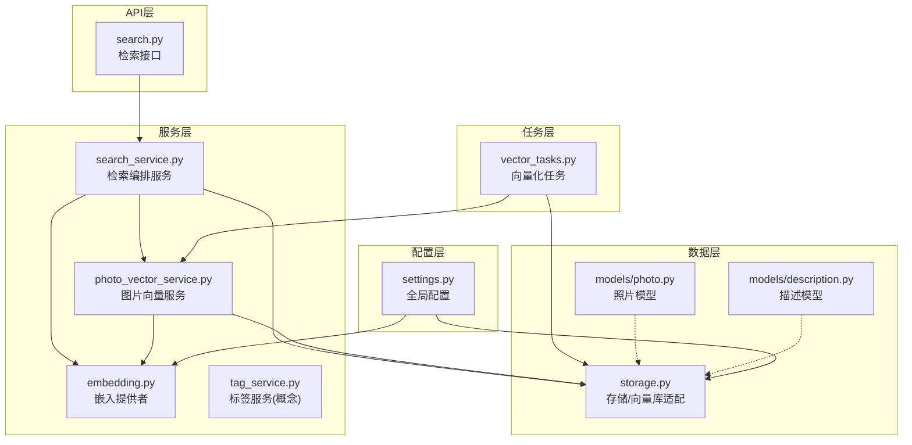
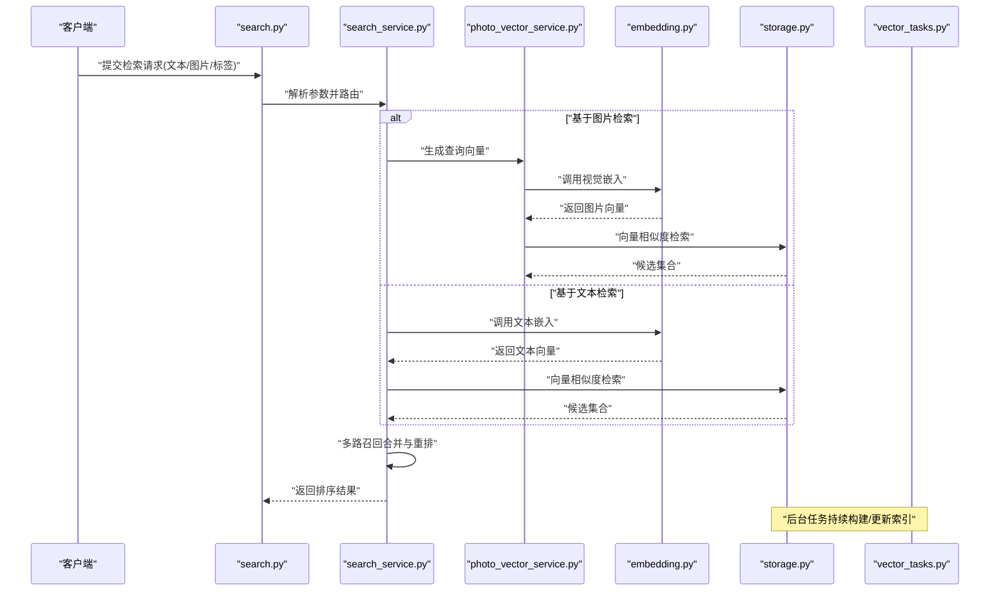
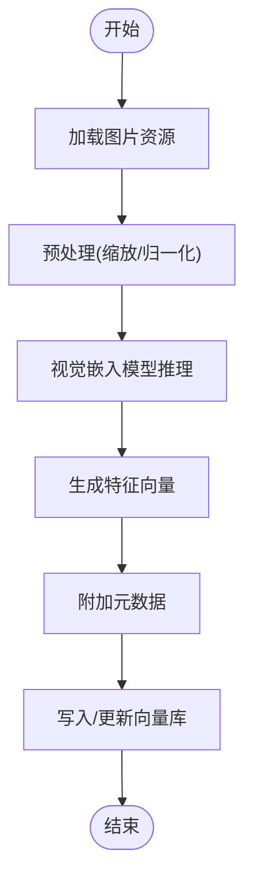
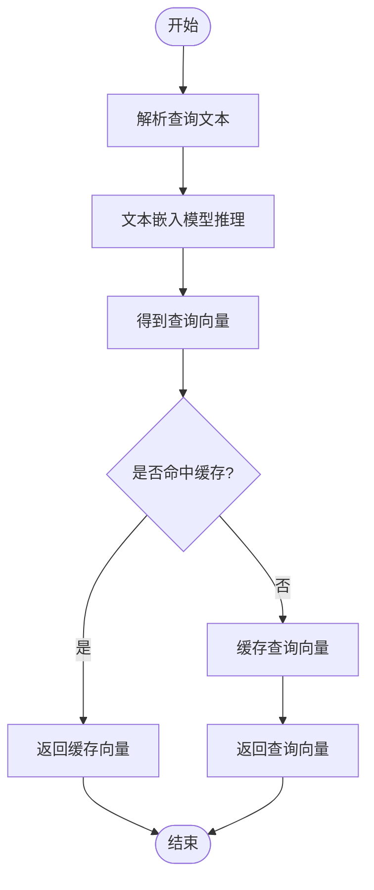
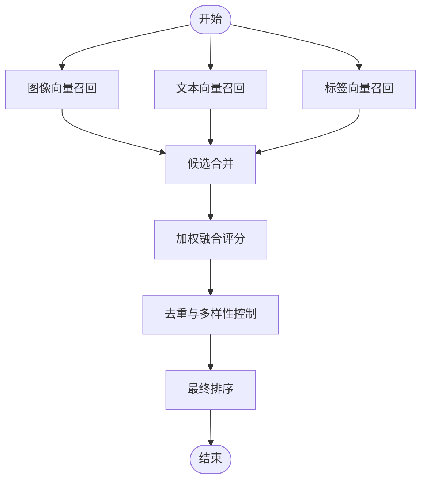
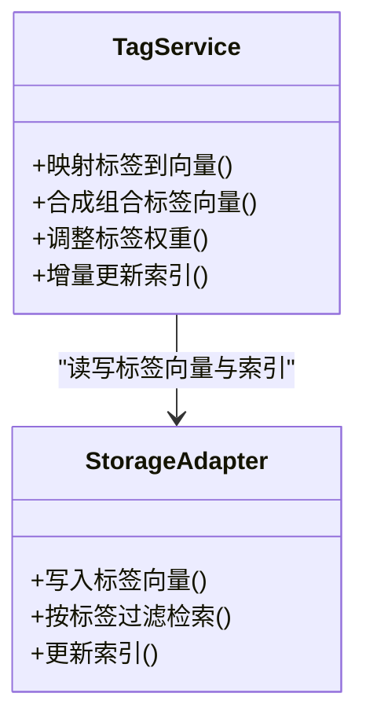
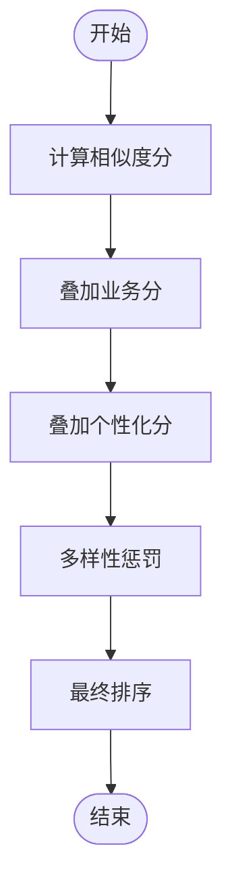
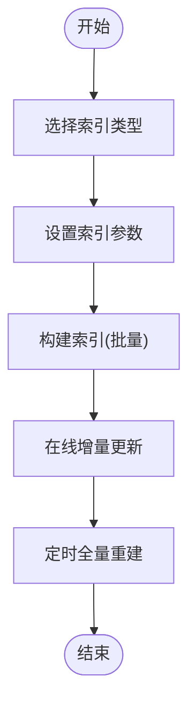
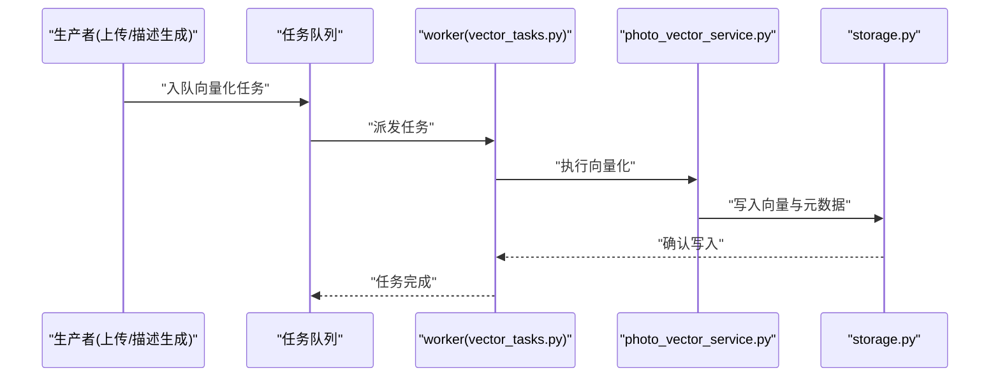
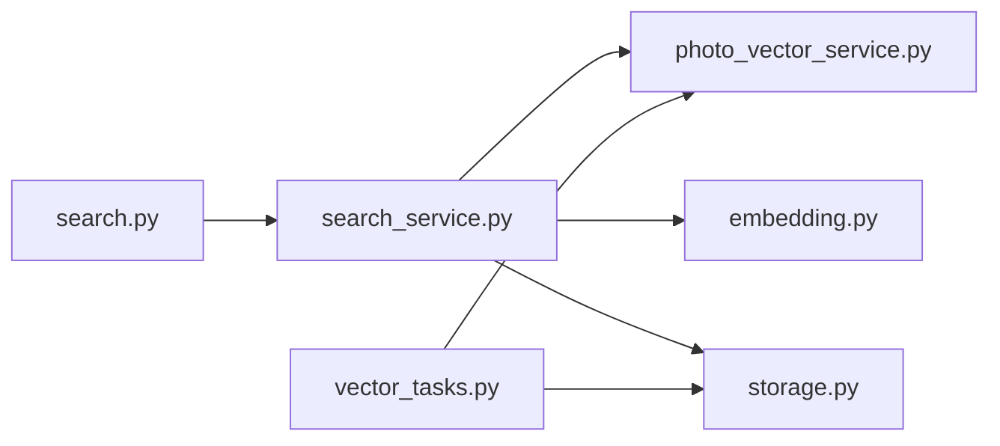

# 向量检索系统

<cite>
**本文引用的文件**   
- [backend/app/services/photo_vector_service.py](file://backend/app/services/photo_vector_service.py)
- [backend/app/services/search_service.py](file://backend/app/services/search_service.py)
- [backend/app/api/search.py](file://backend/app/api/search.py)
- [backend/app/services/ai_providers/embedding.py](file://backend/app/services/ai_providers/embedding.py)
- [backend/app/database/storage.py](file://backend/app/database/storage.py)
- [backend/app/models/photo.py](file://backend/app/models/photo.py)
- [backend/app/models/description.py](file://backend/app/models/description.py)
- [backend/app/tasks/vector_tasks.py](file://backend/app/tasks/vector_tasks.py)
- [backend/app/config/settings.py](file://backend/app/config/settings.py)
</cite>

## 目录
1. [简介](#简介)
2. [项目结构](#项目结构)
3. [核心组件](#核心组件)
4. [架构总览](#架构总览)
5. [详细组件分析](#详细组件分析)
6. [依赖关系分析](#依赖关系分析)
7. [性能考虑](#性能考虑)
8. [故障排查指南](#故障排查指南)
9. [结论](#结论)
10. [附录](#附录)

## 简介
本文件面向“AI-PhotoAlbum”项目的向量检索子系统，系统性阐述语义搜索的向量表示方法（照片特征向量化、文本描述向量化）、混合检索策略、向量数据库选型与配置（索引构建、相似度计算、查询优化）、标签系统的向量映射与权重调整、动态更新机制、检索结果排序算法与相关性评分、个性化推荐策略，以及性能优化与扩展性设计方案。文档力求在技术深度与可读性之间取得平衡，帮助读者快速理解并落地相关能力。

## 项目结构
围绕向量检索的关键代码主要分布在后端服务的服务层、API层、模型层、任务调度层与配置层：
- 服务层：负责图片与文本的向量化、检索编排、标签与权重处理等
- API层：对外暴露检索接口，接收查询参数并返回排序后的结果
- 模型层：定义照片、描述等实体及其字段，支撑向量持久化
- 任务层：异步执行向量化与索引构建任务
- 配置层：集中管理嵌入模型、向量库连接、索引与相似度等参数

图表来源
- [backend/app/api/search.py](file://backend/app/api/search.py)
- [backend/app/services/search_service.py](file://backend/app/services/search_service.py)
- [backend/app/services/photo_vector_service.py](file://backend/app/services/photo_vector_service.py)
- [backend/app/services/ai_providers/embedding.py](file://backend/app/services/ai_providers/embedding.py)
- [backend/app/database/storage.py](file://backend/app/database/storage.py)
- [backend/app/models/photo.py](file://backend/app/models/photo.py)
- [backend/app/models/description.py](file://backend/app/models/description.py)
- [backend/app/tasks/vector_tasks.py](file://backend/app/tasks/vector_tasks.py)
- [backend/app/config/settings.py](file://backend/app/config/settings.py)

章节来源
- [backend/app/api/search.py](file://backend/app/api/search.py)
- [backend/app/services/search_service.py](file://backend/app/services/search_service.py)
- [backend/app/services/photo_vector_service.py](file://backend/app/services/photo_vector_service.py)
- [backend/app/services/ai_providers/embedding.py](file://backend/app/services/ai_providers/embedding.py)
- [backend/app/database/storage.py](file://backend/app/database/storage.py)
- [backend/app/models/photo.py](file://backend/app/models/photo.py)
- [backend/app/models/description.py](file://backend/app/models/description.py)
- [backend/app/tasks/vector_tasks.py](file://backend/app/tasks/vector_tasks.py)
- [backend/app/config/settings.py](file://backend/app/config/settings.py)

## 核心组件
- 图片向量服务：负责将照片转换为高维向量，并与元数据关联，支持批量写入与增量更新
- 检索编排服务：统一入口，协调图片向量、文本描述、标签等多路召回与融合排序
- 嵌入提供者：封装多源嵌入模型调用（如视觉编码器、文本编码器），提供统一的向量化接口
- 存储适配层：抽象向量数据库操作，包括索引构建、相似度检索、过滤条件与分页
- 向量化任务：后台任务驱动图片与描述的向量化与索引重建，保障在线检索低延迟
- 配置中心：集中管理嵌入模型选择、维度、距离度量、索引类型、缓存与批大小等

章节来源
- [backend/app/services/photo_vector_service.py](file://backend/app/services/photo_vector_service.py)
- [backend/app/services/search_service.py](file://backend/app/services/search_service.py)
- [backend/app/services/ai_providers/embedding.py](file://backend/app/services/ai_providers/embedding.py)
- [backend/app/database/storage.py](file://backend/app/database/storage.py)
- [backend/app/tasks/vector_tasks.py](file://backend/app/tasks/vector_tasks.py)
- [backend/app/config/settings.py](file://backend/app/config/settings.py)

## 架构总览
整体采用“多模态嵌入 + 向量库 + 检索编排”的分层架构。用户通过API发起自然语言或示例图检索，检索编排服务根据策略进行多路召回（图像向量、文本向量、标签向量）与重排，最终返回排序结果。向量化过程可离线或在线触发，由任务层异步完成，避免阻塞主流程。

图表来源
- [backend/app/api/search.py](file://backend/app/api/search.py)
- [backend/app/services/search_service.py](file://backend/app/services/search_service.py)
- [backend/app/services/photo_vector_service.py](file://backend/app/services/photo_vector_service.py)
- [backend/app/services/ai_providers/embedding.py](file://backend/app/services/ai_providers/embedding.py)
- [backend/app/database/storage.py](file://backend/app/database/storage.py)
- [backend/app/tasks/vector_tasks.py](file://backend/app/tasks/vector_tasks.py)

## 详细组件分析

### 图片特征向量化
- 输入：原始图片文件或URL
- 处理：使用视觉嵌入模型提取固定维度的特征向量；支持批量推理以提升吞吐
- 输出：图片ID到向量的映射，附带元数据（拍摄时间、地点、相册归属等）
- 存储：将向量与元数据写入向量库，建立索引以支持近似最近邻搜索
- 更新：新增或修改图片时，增量更新对应向量；全量重建用于一致性修复

图表来源
- [backend/app/services/photo_vector_service.py](file://backend/app/services/photo_vector_service.py)
- [backend/app/services/ai_providers/embedding.py](file://backend/app/services/ai_providers/embedding.py)
- [backend/app/database/storage.py](file://backend/app/database/storage.py)

章节来源
- [backend/app/services/photo_vector_service.py](file://backend/app/services/photo_vector_service.py)
- [backend/app/services/ai_providers/embedding.py](file://backend/app/services/ai_providers/embedding.py)
- [backend/app/database/storage.py](file://backend/app/database/storage.py)

### 文本描述向量化
- 输入：自然语言查询或图片描述文本
- 处理：使用文本嵌入模型将文本映射为同空间的高维向量
- 输出：查询向量，用于与图片向量进行相似度匹配
- 优化：对高频查询进行缓存，减少重复推理开销

图表来源
- [backend/app/services/search_service.py](file://backend/app/services/search_service.py)
- [backend/app/services/ai_providers/embedding.py](file://backend/app/services/ai_providers/embedding.py)

章节来源
- [backend/app/services/search_service.py](file://backend/app/services/search_service.py)
- [backend/app/services/ai_providers/embedding.py](file://backend/app/services/ai_providers/embedding.py)

### 混合检索策略
- 多路召回：
  - 图像向量召回：基于示例图片或历史偏好生成的查询向量
  - 文本向量召回：基于自然语言查询的文本向量
  - 标签向量召回：将标签映射为向量，进行标签空间检索
- 融合排序：
  - 初筛：各路召回Top-K候选集
  - 重排：加权融合得分，结合时间衰减、地理位置、相册权重等信号
  - 去重与多样性：按内容相似阈值去重，保证结果多样性
- 个性化：
  - 引入用户画像（浏览历史、收藏、点赞）作为软约束或偏置项
  - 动态调整权重，提升个性化相关性

图表来源
- [backend/app/services/search_service.py](file://backend/app/services/search_service.py)
- [backend/app/database/storage.py](file://backend/app/database/storage.py)

章节来源
- [backend/app/services/search_service.py](file://backend/app/services/search_service.py)
- [backend/app/database/storage.py](file://backend/app/database/storage.py)

### 标签系统的向量映射、权重调整与动态更新
- 向量映射：
  - 标签词表与向量空间对齐，每个标签对应一个向量
  - 支持组合标签的向量合成（如加权平均或注意力聚合）
- 权重调整：
  - 业务规则：时间、地点、相册优先级
  - 学习式权重：基于点击/收藏反馈进行在线或离线调参
- 动态更新：
  - 标签变更时增量更新标签向量与索引
  - 定期全量校准，确保一致性

图表来源
- [backend/app/services/tag_service.py](file://backend/app/services/tag_service.py)
- [backend/app/database/storage.py](file://backend/app/database/storage.py)

章节来源
- [backend/app/services/tag_service.py](file://backend/app/services/tag_service.py)
- [backend/app/database/storage.py](file://backend/app/database/storage.py)

### 检索结果排序算法、相关性评分与个性化推荐
- 相关性评分：
  - 相似度分：余弦相似度或内积
  - 业务分：时间衰减、地理接近度、相册权重
  - 个性化分：用户偏好匹配度
- 排序策略：
  - 线性加权融合或学习排序（如LambdaMART）
  - 多样性惩罚：抑制过度相似的条目
- 个性化推荐：
  - 基于用户行为序列建模，生成偏好向量
  - 与查询向量联合打分，实现“越用越懂你”的体验

图表来源
- [backend/app/services/search_service.py](file://backend/app/services/search_service.py)

章节来源
- [backend/app/services/search_service.py](file://backend/app/services/search_service.py)

### 向量数据库的选择与配置
- 选型建议：
  - 高性能近似最近邻：HNSW、IVF-PQ等索引
  - 多模态支持：同一索引或跨索引融合检索
  - 可扩展性：水平分片与副本容错
- 关键配置：
  - 索引类型与参数（如HNSW的M、efConstruction、efSearch）
  - 距离度量（余弦、内积、欧氏）
  - 批大小与并发度
  - 内存与磁盘权衡
- 初始化与重建：
  - 首次导入批量构建索引
  - 增量更新与定时全量重建保障一致性

图表来源
- [backend/app/database/storage.py](file://backend/app/database/storage.py)
- [backend/app/config/settings.py](file://backend/app/config/settings.py)

章节来源
- [backend/app/database/storage.py](file://backend/app/database/storage.py)
- [backend/app/config/settings.py](file://backend/app/config/settings.py)

### 任务与异步处理
- 向量化任务：
  - 图片上传后触发异步向量化
  - 描述生成与文本向量化
  - 索引重建与清理过期向量
- 调度策略：
  - 队列化任务，支持重试与幂等
  - 限流与背压，保护下游服务

图表来源
- [backend/app/tasks/vector_tasks.py](file://backend/app/tasks/vector_tasks.py)
- [backend/app/services/photo_vector_service.py](file://backend/app/services/photo_vector_service.py)
- [backend/app/database/storage.py](file://backend/app/database/storage.py)

章节来源
- [backend/app/tasks/vector_tasks.py](file://backend/app/tasks/vector_tasks.py)
- [backend/app/services/photo_vector_service.py](file://backend/app/services/photo_vector_service.py)
- [backend/app/database/storage.py](file://backend/app/database/storage.py)

### API接口设计要点
- 输入：
  - 文本查询、示例图片、标签列表、过滤条件（时间、地点、相册）
  - 个性化参数（用户ID、偏好权重）
- 输出：
  - 排序后的照片列表，包含相似度分、业务分与个性化分
  - 分页信息与下一页游标
- 错误处理：
  - 模型不可用、向量库连接失败、参数校验错误等

章节来源
- [backend/app/api/search.py](file://backend/app/api/search.py)
- [backend/app/services/search_service.py](file://backend/app/services/search_service.py)

## 依赖关系分析
- 组件耦合：
  - API层仅依赖检索编排服务，保持薄接口
  - 检索编排服务依赖图片向量服务、嵌入提供者与存储适配层
  - 任务层与服务层解耦，通过消息队列通信
- 外部依赖：
  - 嵌入模型提供方（本地或云端）
  - 向量数据库（HNSW/IVF-PQ等）
- 潜在循环依赖：
  - 通过分层与接口隔离避免循环引用

图表来源
- [backend/app/api/search.py](file://backend/app/api/search.py)
- [backend/app/services/search_service.py](file://backend/app/services/search_service.py)
- [backend/app/services/photo_vector_service.py](file://backend/app/services/photo_vector_service.py)
- [backend/app/services/ai_providers/embedding.py](file://backend/app/services/ai_providers/embedding.py)
- [backend/app/database/storage.py](file://backend/app/database/storage.py)
- [backend/app/tasks/vector_tasks.py](file://backend/app/tasks/vector_tasks.py)

章节来源
- [backend/app/api/search.py](file://backend/app/api/search.py)
- [backend/app/services/search_service.py](file://backend/app/services/search_service.py)
- [backend/app/services/photo_vector_service.py](file://backend/app/services/photo_vector_service.py)
- [backend/app/services/ai_providers/embedding.py](file://backend/app/services/ai_providers/embedding.py)
- [backend/app/database/storage.py](file://backend/app/database/storage.py)
- [backend/app/tasks/vector_tasks.py](file://backend/app/tasks/vector_tasks.py)

## 性能考虑
- 索引与查询：
  - 选择合适的索引类型与参数，平衡召回质量与延迟
  - 调整efSearch与K值，满足不同场景的实时性与准确性需求
- 批处理与并发：
  - 向量化批量推理，提高GPU利用率
  - 向量库写入批大小与并发度调优
- 缓存与预取：
  - 查询向量缓存、热门结果缓存
  - 预计算常用标签向量与组合向量
- 资源隔离：
  - 读写分离与副本，降低热点影响
  - 任务限流与熔断，保护稳定性

[本节为通用指导，不直接分析具体文件]

## 故障排查指南
- 常见问题：
  - 向量库连接失败：检查网络、认证与端口
  - 索引未构建或损坏：执行重建任务并验证索引健康
  - 嵌入模型超时：增加超时与重试，降级到备用模型
  - 结果不相关：调整权重与过滤条件，检查标签映射
- 诊断手段：
  - 记录关键路径日志（入队、推理、写入、检索）
  - 监控指标（P95/P99延迟、QPS、错误率、索引大小）
  - 抽样回放典型查询，定位问题根因

章节来源
- [backend/app/tasks/vector_tasks.py](file://backend/app/tasks/vector_tasks.py)
- [backend/app/database/storage.py](file://backend/app/database/storage.py)
- [backend/app/services/ai_providers/embedding.py](file://backend/app/services/ai_providers/embedding.py)

## 结论
该向量检索系统通过多模态嵌入与向量库的组合，实现了高效、可扩展的语义搜索能力。借助混合检索与个性化重排，系统在准确性与用户体验方面具备良好表现。通过合理的索引配置、异步任务与缓存策略，可在大规模数据下保持稳定性能。后续可引入学习排序与更细粒度的个性化模型，进一步提升检索质量。

[本节为总结性内容，不直接分析具体文件]

## 附录
- 数据模型参考：
  - 照片模型：包含基础元数据与向量ID映射
  - 描述模型：存储文本描述与对应的文本向量ID
- 配置项参考：
  - 嵌入模型选择、维度、距离度量
  - 向量库索引类型与参数
  - 批大小、并发度、超时与重试策略

章节来源
- [backend/app/models/photo.py](file://backend/app/models/photo.py)
- [backend/app/models/description.py](file://backend/app/models/description.py)
- [backend/app/config/settings.py](file://backend/app/config/settings.py)