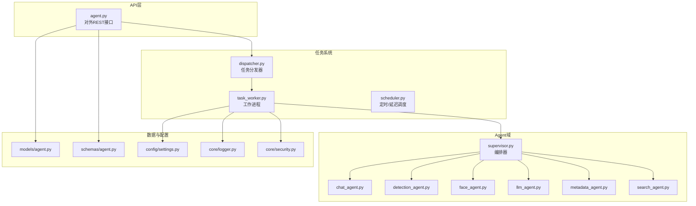
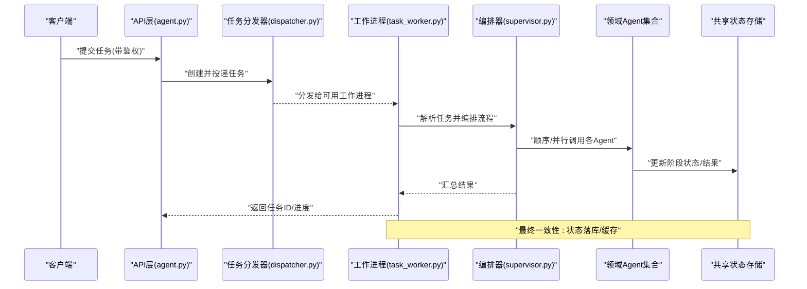
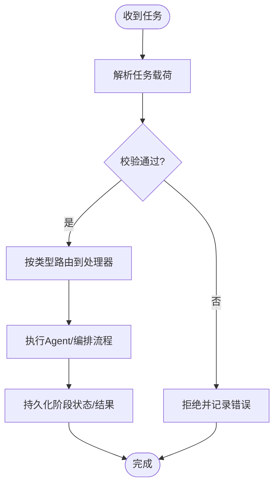
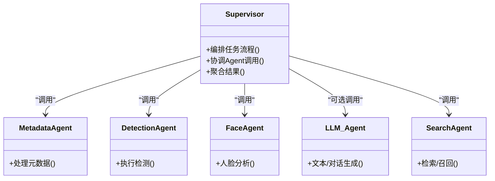
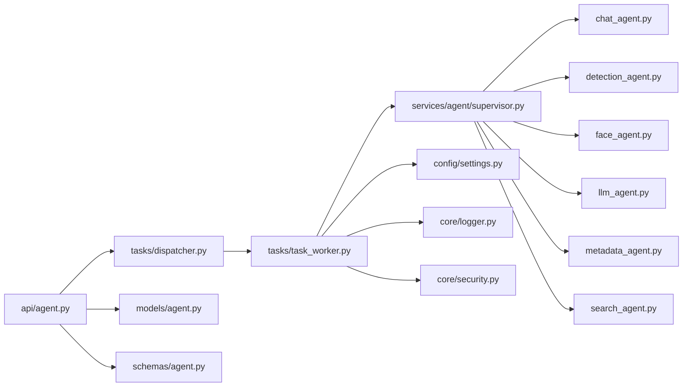

# Agent通信机制

<cite>
**本文引用的文件**   
- [backend/app/services/agent/supervisor.py](file://backend/app/services/agent/supervisor.py)
- [backend/app/services/agent/chat_agent.py](file://backend/app/services/agent/chat_agent.py)
- [backend/app/services/agent/detection_agent.py](file://backend/app/services/agent/detection_agent.py)
- [backend/app/services/agent/face_agent.py](file://backend/app/services/agent/face_agent.py)
- [backend/app/services/agent/llm_agent.py](file://backend/app/services/agent/llm_agent.py)
- [backend/app/services/agent/metadata_agent.py](file://backend/app/services/agent/metadata_agent.py)
- [backend/app/services/agent/search_agent.py](file://backend/app/services/agent/search_agent.py)
- [backend/app/tasks/dispatcher.py](file://backend/app/tasks/dispatcher.py)
- [backend/app/tasks/task_worker.py](file://backend/app/tasks/task_worker.py)
- [backend/app/tasks/scheduler.py](file://backend/app/tasks/scheduler.py)
- [backend/app/api/agent.py](file://backend/app/api/agent.py)
- [backend/app/models/agent.py](file://backend/app/models/agent.py)
- [backend/app/schemas/agent.py](file://backend/app/schemas/agent.py)
- [backend/app/config/settings.py](file://backend/app/config/settings.py)
- [backend/app/core/logger.py](file://backend/app/core/logger.py)
- [backend/app/core/security.py](file://backend/app/core/security.py)
</cite>

## 目录
1. [简介](#简介)
2. [项目结构](#项目结构)
3. [核心组件](#核心组件)
4. [架构总览](#架构总览)
5. [详细组件分析](#详细组件分析)
6. [依赖关系分析](#依赖关系分析)
7. [性能考量](#性能考量)
8. [故障排查指南](#故障排查指南)
9. [结论](#结论)
10. [附录](#附录)

## 简介
本文件面向AI相册后端中的Agent通信机制，系统性阐述以下方面：
- Agent间消息传递协议、事件驱动与异步通信模式
- 消息格式定义、序列化方案与传输安全
- 状态同步策略、分布式锁与一致性保证
- 消息路由规则、重试机制与死信队列处理
- 通信中间件配置、监控指标收集与调试工具使用

本项目采用“任务调度+工作进程”的异步事件驱动架构，通过统一的任务分发器将业务请求转化为内部任务，由不同领域Agent（如检测、人脸、元数据、搜索、LLM等）消费并执行。API层负责对外暴露接口，模型与Schema用于数据契约校验，配置与安全模块提供运行时参数与鉴权能力。

## 项目结构
与Agent通信相关的关键目录与职责如下：
- services/agent：具体Agent实现与编排者（Supervisor）
- tasks：任务分发器、工作进程、调度器
- api：对外HTTP接口，接收用户请求并触发Agent流程
- models/schemas：Agent实体与请求/响应数据契约
- config：全局配置项（含通信中间件、重试、超时等）
- core：日志、安全等横切关注点

图表来源
- [backend/app/api/agent.py](file://backend/app/api/agent.py)
- [backend/app/tasks/dispatcher.py](file://backend/app/tasks/dispatcher.py)
- [backend/app/tasks/task_worker.py](file://backend/app/tasks/task_worker.py)
- [backend/app/tasks/scheduler.py](file://backend/app/tasks/scheduler.py)
- [backend/app/services/agent/supervisor.py](file://backend/app/services/agent/supervisor.py)
- [backend/app/services/agent/chat_agent.py](file://backend/app/services/agent/chat_agent.py)
- [backend/app/services/agent/detection_agent.py](file://backend/app/services/agent/detection_agent.py)
- [backend/app/services/agent/face_agent.py](file://backend/app/services/agent/face_agent.py)
- [backend/app/services/agent/llm_agent.py](file://backend/app/services/agent/llm_agent.py)
- [backend/app/services/agent/metadata_agent.py](file://backend/app/services/agent/metadata_agent.py)
- [backend/app/services/agent/search_agent.py](file://backend/app/services/agent/search_agent.py)
- [backend/app/models/agent.py](file://backend/app/models/agent.py)
- [backend/app/schemas/agent.py](file://backend/app/schemas/agent.py)
- [backend/app/config/settings.py](file://backend/app/config/settings.py)
- [backend/app/core/logger.py](file://backend/app/core/logger.py)
- [backend/app/core/security.py](file://backend/app/core/security.py)

章节来源
- [backend/app/api/agent.py](file://backend/app/api/agent.py)
- [backend/app/tasks/dispatcher.py](file://backend/app/tasks/dispatcher.py)
- [backend/app/tasks/task_worker.py](file://backend/app/tasks/task_worker.py)
- [backend/app/tasks/scheduler.py](file://backend/app/tasks/scheduler.py)
- [backend/app/services/agent/supervisor.py](file://backend/app/services/agent/supervisor.py)
- [backend/app/models/agent.py](file://backend/app/models/agent.py)
- [backend/app/schemas/agent.py](file://backend/app/schemas/agent.py)
- [backend/app/config/settings.py](file://backend/app/config/settings.py)
- [backend/app/core/logger.py](file://backend/app/core/logger.py)
- [backend/app/core/security.py](file://backend/app/core/security.py)

## 核心组件
- 任务分发器：将外部请求转换为内部任务，按类型路由到对应队列或处理器。
- 工作进程：从队列拉取任务，执行业务逻辑，调用相应Agent完成计算。
- 编排器（Supervisor）：协调多个Agent协作完成复杂流程（例如上传后依次进行元数据处理、检测、人脸聚类、索引构建）。
- 领域Agent：各自专注单一职责（聊天、检测、人脸、LLM、元数据、搜索），通过统一消息协议交互。
- 调度器：支持定时与延迟任务，用于周期性维护、补偿与清理。
- 数据契约：模型与Schema定义Agent输入输出、任务属性与状态字段。
- 配置与安全：集中管理通信中间件参数、重试策略、认证与权限控制。
- 日志与可观测性：结构化日志、指标上报与追踪ID贯穿全链路。

章节来源
- [backend/app/tasks/dispatcher.py](file://backend/app/tasks/dispatcher.py)
- [backend/app/tasks/task_worker.py](file://backend/app/tasks/task_worker.py)
- [backend/app/services/agent/supervisor.py](file://backend/app/services/agent/supervisor.py)
- [backend/app/services/agent/chat_agent.py](file://backend/app/services/agent/chat_agent.py)
- [backend/app/services/agent/detection_agent.py](file://backend/app/services/agent/detection_agent.py)
- [backend/app/services/agent/face_agent.py](file://backend/app/services/agent/face_agent.py)
- [backend/app/services/agent/llm_agent.py](file://backend/app/services/agent/llm_agent.py)
- [backend/app/services/agent/metadata_agent.py](file://backend/app/services/agent/metadata_agent.py)
- [backend/app/services/agent/search_agent.py](file://backend/app/services/agent/search_agent.py)
- [backend/app/models/agent.py](file://backend/app/models/agent.py)
- [backend/app/schemas/agent.py](file://backend/app/schemas/agent.py)
- [backend/app/config/settings.py](file://backend/app/config/settings.py)
- [backend/app/core/logger.py](file://backend/app/core/logger.py)
- [backend/app/core/security.py](file://backend/app/core/security.py)

## 架构总览
整体为事件驱动的异步流水线：
- API接收请求，校验并持久化任务记录，随后入队。
- 工作进程消费任务，根据任务类型路由至对应Agent。
- 编排器在需要时串联多Agent，并通过共享状态存储实现最终一致性。
- 调度器定期触发维护任务，保障系统健康与数据一致。

图表来源
- [backend/app/api/agent.py](file://backend/app/api/agent.py)
- [backend/app/tasks/dispatcher.py](file://backend/app/tasks/dispatcher.py)
- [backend/app/tasks/task_worker.py](file://backend/app/tasks/task_worker.py)
- [backend/app/services/agent/supervisor.py](file://backend/app/services/agent/supervisor.py)
- [backend/app/services/agent/chat_agent.py](file://backend/app/services/agent/chat_agent.py)
- [backend/app/services/agent/detection_agent.py](file://backend/app/services/agent/detection_agent.py)
- [backend/app/services/agent/face_agent.py](file://backend/app/services/agent/face_agent.py)
- [backend/app/services/agent/llm_agent.py](file://backend/app/services/agent/llm_agent.py)
- [backend/app/services/agent/metadata_agent.py](file://backend/app/services/agent/metadata_agent.py)
- [backend/app/services/agent/search_agent.py](file://backend/app/services/agent/search_agent.py)

## 详细组件分析

### 任务分发与工作进程
- 任务分发器负责：
  - 生成唯一任务标识与追踪ID
  - 选择目标队列/处理器
  - 持久化任务初始状态
- 工作进程负责：
  - 拉取任务、反序列化负载
  - 调用编排器或直调Agent
  - 记录执行日志、指标与错误
  - 失败重试与死信处理

图表来源
- [backend/app/tasks/dispatcher.py](file://backend/app/tasks/dispatcher.py)
- [backend/app/tasks/task_worker.py](file://backend/app/tasks/task_worker.py)

章节来源
- [backend/app/tasks/dispatcher.py](file://backend/app/tasks/dispatcher.py)
- [backend/app/tasks/task_worker.py](file://backend/app/tasks/task_worker.py)

### 编排器与Agent协作
- 编排器根据任务上下文决定调用哪些Agent及顺序/并行策略。
- 典型流程：元数据提取 → 内容检测 → 人脸识别 → 向量索引/检索 → 可选LLM增强。
- 每个Agent以统一消息协议交换数据，并在共享状态中写入阶段结果。

图表来源
- [backend/app/services/agent/supervisor.py](file://backend/app/services/agent/supervisor.py)
- [backend/app/services/agent/metadata_agent.py](file://backend/app/services/agent/metadata_agent.py)
- [backend/app/services/agent/detection_agent.py](file://backend/app/services/agent/detection_agent.py)
- [backend/app/services/agent/face_agent.py](file://backend/app/services/agent/face_agent.py)
- [backend/app/services/agent/llm_agent.py](file://backend/app/services/agent/llm_agent.py)
- [backend/app/services/agent/search_agent.py](file://backend/app/services/agent/search_agent.py)

章节来源
- [backend/app/services/agent/supervisor.py](file://backend/app/services/agent/supervisor.py)
- [backend/app/services/agent/metadata_agent.py](file://backend/app/services/agent/metadata_agent.py)
- [backend/app/services/agent/detection_agent.py](file://backend/app/services/agent/detection_agent.py)
- [backend/app/services/agent/face_agent.py](file://backend/app/services/agent/face_agent.py)
- [backend/app/services/agent/llm_agent.py](file://backend/app/services/agent/llm_agent.py)
- [backend/app/services/agent/search_agent.py](file://backend/app/services/agent/search_agent.py)

### 聊天Agent
- 负责对话式交互，可能与其他Agent协同获取上下文信息。
- 通常作为编排器的可选分支，在需要时注入LLM能力。

章节来源
- [backend/app/services/agent/chat_agent.py](file://backend/app/services/agent/chat_agent.py)

### 检测Agent
- 对媒体内容进行通用对象/场景检测，产出检测结果供后续流程使用。

章节来源
- [backend/app/services/agent/detection_agent.py](file://backend/app/services/agent/detection_agent.py)

### 人脸Agent
- 执行人脸检测、特征抽取与聚类，支撑识别人物与相册组织。

章节来源
- [backend/app/services/agent/face_agent.py](file://backend/app/services/agent/face_agent.py)

### LLM Agent
- 提供大语言模型能力，用于摘要、标签生成、对话问答等。

章节来源
- [backend/app/services/agent/llm_agent.py](file://backend/app/services/agent/llm_agent.py)

### 元数据Agent
- 提取媒体文件的EXIF/基础元数据，为后续流程提供必要上下文。

章节来源
- [backend/app/services/agent/metadata_agent.py](file://backend/app/services/agent/metadata_agent.py)

### 搜索Agent
- 基于向量/关键词进行检索，支撑相册浏览与智能查询。

章节来源
- [backend/app/services/agent/search_agent.py](file://backend/app/services/agent/search_agent.py)

## 依赖关系分析
- API层依赖任务分发器与数据契约（模型/Schema）。
- 任务系统依赖配置与安全模块，确保鉴权与参数正确。
- 编排器依赖各领域Agent，形成松耦合的组合关系。
- 所有组件均依赖日志模块，便于追踪与排障。

图表来源
- [backend/app/api/agent.py](file://backend/app/api/agent.py)
- [backend/app/tasks/dispatcher.py](file://backend/app/tasks/dispatcher.py)
- [backend/app/tasks/task_worker.py](file://backend/app/tasks/task_worker.py)
- [backend/app/services/agent/supervisor.py](file://backend/app/services/agent/supervisor.py)
- [backend/app/services/agent/chat_agent.py](file://backend/app/services/agent/chat_agent.py)
- [backend/app/services/agent/detection_agent.py](file://backend/app/services/agent/detection_agent.py)
- [backend/app/services/agent/face_agent.py](file://backend/app/services/agent/face_agent.py)
- [backend/app/services/agent/llm_agent.py](file://backend/app/services/agent/llm_agent.py)
- [backend/app/services/agent/metadata_agent.py](file://backend/app/services/agent/metadata_agent.py)
- [backend/app/services/agent/search_agent.py](file://backend/app/services/agent/search_agent.py)
- [backend/app/models/agent.py](file://backend/app/models/agent.py)
- [backend/app/schemas/agent.py](file://backend/app/schemas/agent.py)
- [backend/app/config/settings.py](file://backend/app/config/settings.py)
- [backend/app/core/logger.py](file://backend/app/core/logger.py)
- [backend/app/core/security.py](file://backend/app/core/security.py)

章节来源
- [backend/app/api/agent.py](file://backend/app/api/agent.py)
- [backend/app/tasks/dispatcher.py](file://backend/app/tasks/dispatcher.py)
- [backend/app/tasks/task_worker.py](file://backend/app/tasks/task_worker.py)
- [backend/app/services/agent/supervisor.py](file://backend/app/services/agent/supervisor.py)
- [backend/app/models/agent.py](file://backend/app/models/agent.py)
- [backend/app/schemas/agent.py](file://backend/app/schemas/agent.py)
- [backend/app/config/settings.py](file://backend/app/config/settings.py)
- [backend/app/core/logger.py](file://backend/app/core/logger.py)
- [backend/app/core/security.py](file://backend/app/core/security.py)

## 性能考量
- 并发与吞吐：工作进程数量与队列容量需根据CPU/IO瓶颈调优；长耗时任务建议拆分阶段，避免阻塞。
- 批处理与合并：对批量上传/处理场景，尽量合并小任务以降低调度开销。
- 幂等与去重：任务携带唯一键，避免重复执行导致资源浪费。
- 缓存与预取：热点数据（如模型权重、字典表）应缓存，减少I/O。
- 背压与限流：在高负载下限制入队速率，防止队列膨胀。
- 资源隔离：不同Agent可分配独立资源池，避免相互干扰。

[本节为通用指导，不直接分析具体文件]

## 故障排查指南
- 日志定位：通过结构化日志关键字（任务ID、阶段名、错误码）快速定位问题。
- 重试与死信：检查重试次数、退避策略与死信队列堆积情况，必要时人工干预。
- 状态不一致：核对阶段状态落库时序与事务边界，确认是否存在竞态条件。
- 鉴权失败：检查令牌有效性、权限范围与跨域设置。
- 性能退化：观察队列长度、处理时长分布与资源利用率，定位瓶颈。

章节来源
- [backend/app/core/logger.py](file://backend/app/core/logger.py)
- [backend/app/core/security.py](file://backend/app/core/security.py)
- [backend/app/tasks/dispatcher.py](file://backend/app/tasks/dispatcher.py)
- [backend/app/tasks/task_worker.py](file://backend/app/tasks/task_worker.py)

## 结论
本项目的Agent通信机制以任务为中心，结合编排器与领域Agent实现了高内聚、低耦合的事件驱动架构。通过统一的消息协议、可靠的重试与死信机制、以及完善的日志与鉴权体系，系统在可扩展性与稳定性之间取得良好平衡。后续可在指标采集、分布式锁与一致性协议方面进一步增强，以满足更大规模与更强一致性的需求。

[本节为总结性内容，不直接分析具体文件]

## 附录

### 消息格式与序列化
- 任务载荷包含：任务类型、唯一ID、追踪ID、版本、时间戳、优先级、负载数据、回调地址等。
- 序列化建议：优先使用JSON；二进制附件采用引用路径或分块传输；版本号用于兼容演进。
- 校验：入口使用Schema进行强校验，缺失必填字段或类型不符直接拒绝。

章节来源
- [backend/app/schemas/agent.py](file://backend/app/schemas/agent.py)
- [backend/app/models/agent.py](file://backend/app/models/agent.py)

### 传输安全
- 鉴权：API层强制鉴权，任务执行过程继承上下文身份。
- 加密：敏感字段在传输与落盘时加密；密钥由配置中心或环境变量管理。
- 访问控制：最小权限原则，限制Agent对资源的访问范围。

章节来源
- [backend/app/core/security.py](file://backend/app/core/security.py)
- [backend/app/config/settings.py](file://backend/app/config/settings.py)

### 状态同步与一致性
- 阶段状态：每个Agent完成后更新阶段状态，编排器等待关键阶段完成再继续。
- 最终一致性：允许短暂不一致，但需保证幂等与可恢复。
- 冲突解决：以最新有效状态为准，并提供回滚或补偿任务。

章节来源
- [backend/app/services/agent/supervisor.py](file://backend/app/services/agent/supervisor.py)
- [backend/app/tasks/task_worker.py](file://backend/app/tasks/task_worker.py)

### 分布式锁与互斥
- 针对同一实体的并发写操作，使用分布式锁避免覆盖。
- 锁粒度：尽量细化到实体级别，缩短持有时间。
- 超时与释放：设置合理TTL，异常时自动释放。

章节来源
- [backend/app/config/settings.py](file://backend/app/config/settings.py)
- [backend/app/tasks/task_worker.py](file://backend/app/tasks/task_worker.py)

### 路由规则与重试/死信
- 路由：按任务类型映射到处理器或队列；支持通配与优先级。
- 重试：指数退避+最大次数；区分可重试与不可重试错误。
- 死信：超过阈值进入死信队列，提供告警与人工处理入口。

章节来源
- [backend/app/tasks/dispatcher.py](file://backend/app/tasks/dispatcher.py)
- [backend/app/tasks/task_worker.py](file://backend/app/tasks/task_worker.py)

### 中间件配置与监控
- 配置项：队列连接、并发度、超时、重试、死信、鉴权、日志级别等。
- 指标：入队/出队速率、处理时长P95/P99、错误率、死信计数、队列深度。
- 调试：启用追踪ID透传，关联上下游日志；提供任务详情查询与回放能力。

章节来源
- [backend/app/config/settings.py](file://backend/app/config/settings.py)
- [backend/app/core/logger.py](file://backend/app/core/logger.py)