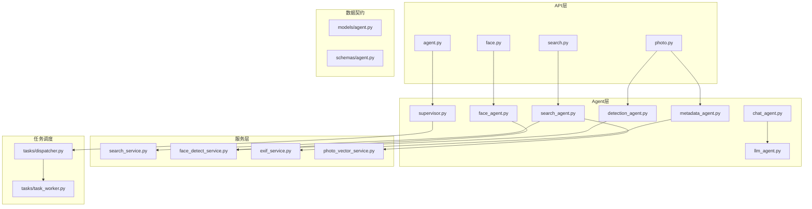
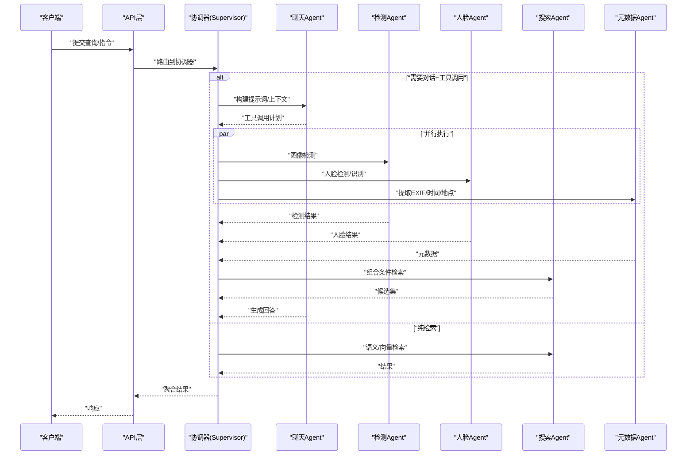
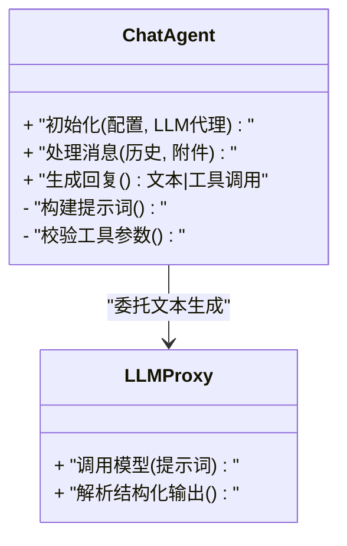
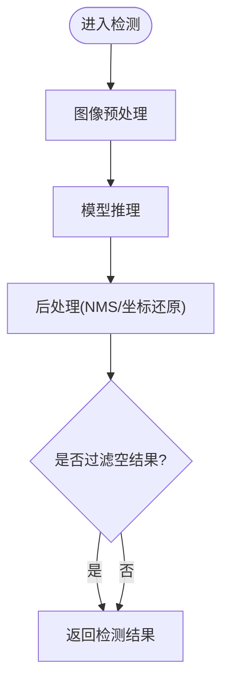
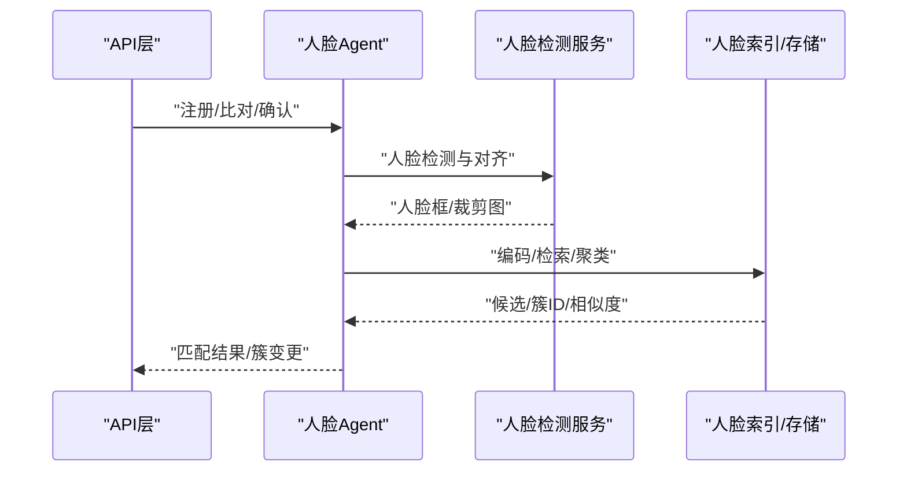
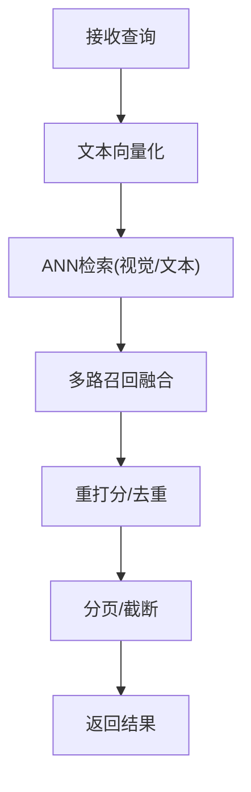
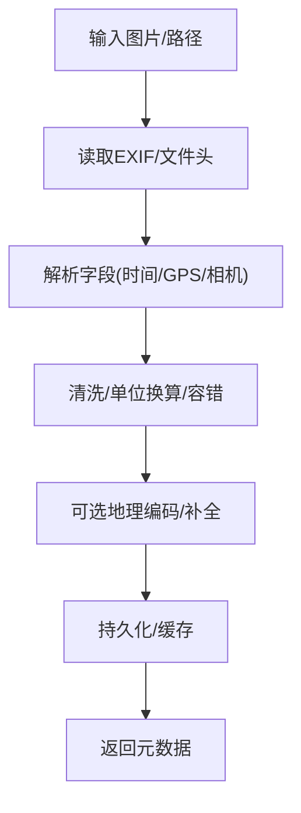
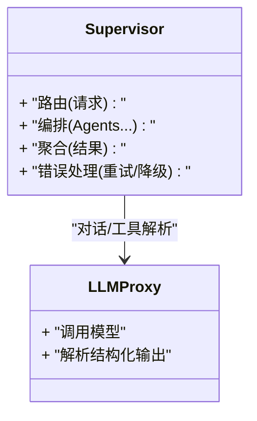
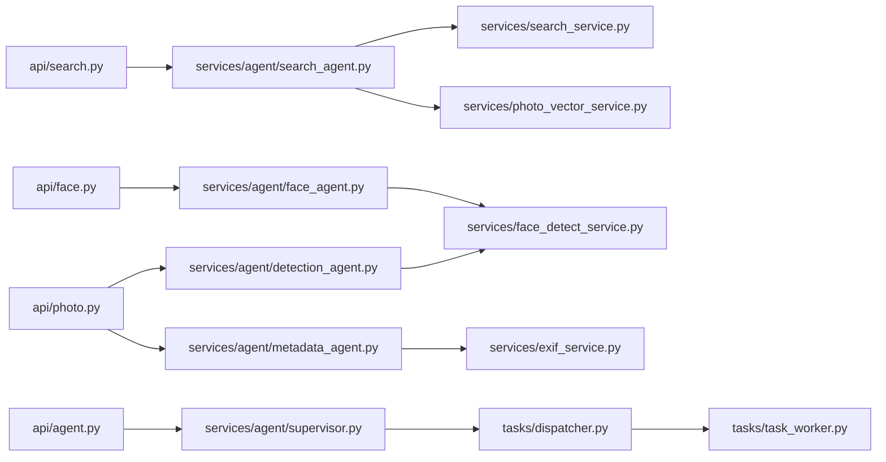

# 专用Agent详解

<cite>
**本文引用的文件**   
- [backend/app/services/agent/chat_agent.py](file://backend/app/services/agent/chat_agent.py)
- [backend/app/services/agent/detection_agent.py](file://backend/app/services/agent/detection_agent.py)
- [backend/app/services/agent/face_agent.py](file://backend/app/services/agent/face_agent.py)
- [backend/app/services/agent/search_agent.py](file://backend/app/services/agent/search_agent.py)
- [backend/app/services/agent/metadata_agent.py](file://backend/app/services/agent/metadata_agent.py)
- [backend/app/services/agent/supervisor.py](file://backend/app/services/agent/supervisor.py)
- [backend/app/services/agent/llm_agent.py](file://backend/app/services/agent/llm_agent.py)
- [backend/app/api/agent.py](file://backend/app/api/agent.py)
- [backend/app/api/search.py](file://backend/app/api/search.py)
- [backend/app/api/face.py](file://backend/app/api/face.py)
- [backend/app/api/photo.py](file://backend/app/api/photo.py)
- [backend/app/services/search_service.py](file://backend/app/services/search_service.py)
- [backend/app/services/face_detect_service.py](file://backend/app/services/face_detect_service.py)
- [backend/app/services/exif_service.py](file://backend/app/services/exif_service.py)
- [backend/app/services/photo_vector_service.py](file://backend/app/services/photo_vector_service.py)
- [backend/app/models/agent.py](file://backend/app/models/agent.py)
- [backend/app/schemas/agent.py](file://backend/app/schemas/agent.py)
- [backend/app/core/exceptions.py](file://backend/app/core/exceptions.py)
- [backend/app/tasks/dispatcher.py](file://backend/app/tasks/dispatcher.py)
- [backend/app/tasks/task_worker.py](file://backend/app/tasks/task_worker.py)
</cite>

## 目录
1. [简介](#简介)
2. [项目结构](#项目结构)
3. [核心组件](#核心组件)
4. [架构总览](#架构总览)
5. [详细组件分析](#详细组件分析)
6. [依赖关系分析](#依赖关系分析)
7. [性能考量](#性能考量)
8. [故障排查指南](#故障排查指南)
9. [结论](#结论)
10. [附录](#附录)

## 简介
本文件面向“专用Agent集群”的架构与实现，聚焦以下五类Agent：聊天Agent、检测Agent、人脸Agent、搜索Agent、元数据Agent。文档覆盖各Agent的职责边界、输入输出格式、错误处理策略与性能特征，并给出Agent间的数据流转与结果聚合机制，帮助读者快速理解系统如何协同完成相册智能任务。

## 项目结构
后端采用分层设计：API层暴露REST接口；服务层封装业务逻辑；Agent层提供可插拔的智能能力；模型与Schema定义数据契约；任务调度负责异步执行；异常与日志贯穿全局。

图表来源
- [backend/app/api/agent.py](file://backend/app/api/agent.py)
- [backend/app/api/search.py](file://backend/app/api/search.py)
- [backend/app/api/face.py](file://backend/app/api/face.py)
- [backend/app/api/photo.py](file://backend/app/api/photo.py)
- [backend/app/services/agent/chat_agent.py](file://backend/app/services/agent/chat_agent.py)
- [backend/app/services/agent/detection_agent.py](file://backend/app/services/agent/detection_agent.py)
- [backend/app/services/agent/face_agent.py](file://backend/app/services/agent/face_agent.py)
- [backend/app/services/agent/search_agent.py](file://backend/app/services/agent/search_agent.py)
- [backend/app/services/agent/metadata_agent.py](file://backend/app/services/agent/metadata_agent.py)
- [backend/app/services/agent/supervisor.py](file://backend/app/services/agent/supervisor.py)
- [backend/app/services/agent/llm_agent.py](file://backend/app/services/agent/llm_agent.py)
- [backend/app/services/search_service.py](file://backend/app/services/search_service.py)
- [backend/app/services/face_detect_service.py](file://backend/app/services/face_detect_service.py)
- [backend/app/services/exif_service.py](file://backend/app/services/exif_service.py)
- [backend/app/services/photo_vector_service.py](file://backend/app/services/photo_vector_service.py)
- [backend/app/tasks/dispatcher.py](file://backend/app/tasks/dispatcher.py)
- [backend/app/tasks/task_worker.py](file://backend/app/tasks/task_worker.py)

章节来源
- [backend/app/api/agent.py](file://backend/app/api/agent.py)
- [backend/app/api/search.py](file://backend/app/api/search.py)
- [backend/app/api/face.py](file://backend/app/api/face.py)
- [backend/app/api/photo.py](file://backend/app/api/photo.py)
- [backend/app/services/agent/supervisor.py](file://backend/app/services/agent/supervisor.py)
- [backend/app/tasks/dispatcher.py](file://backend/app/tasks/dispatcher.py)
- [backend/app/tasks/task_worker.py](file://backend/app/tasks/task_worker.py)

## 核心组件
- 聊天Agent：基于大语言模型进行自然语言对话，支持上下文管理与工具调用（如触发检测、检索等）。
- 检测Agent：对图片执行通用物体检测，返回目标类别与位置信息。
- 人脸Agent：执行人脸检测、识别与身份验证，维护人脸簇与匹配结果。
- 搜索Agent：将用户查询转换为向量，结合语义与视觉向量进行检索排序。
- 元数据Agent：从照片EXIF/路径/时间等提取结构化信息，辅助检索与展示。
- 协调器（Supervisor）：统一编排多Agent协作、路由请求、聚合结果与错误恢复。
- LLM代理：封装大模型调用，提供文本生成与结构化解析能力。

章节来源
- [backend/app/services/agent/chat_agent.py](file://backend/app/services/agent/chat_agent.py)
- [backend/app/services/agent/detection_agent.py](file://backend/app/services/agent/detection_agent.py)
- [backend/app/services/agent/face_agent.py](file://backend/app/services/agent/face_agent.py)
- [backend/app/services/agent/search_agent.py](file://backend/app/services/agent/search_agent.py)
- [backend/app/services/agent/metadata_agent.py](file://backend/app/services/agent/metadata_agent.py)
- [backend/app/services/agent/supervisor.py](file://backend/app/services/agent/supervisor.py)
- [backend/app/services/agent/llm_agent.py](file://backend/app/services/agent/llm_agent.py)

## 架构总览
下图展示了典型的多Agent协作流程：用户通过API发起请求，协调器根据意图分发至具体Agent，必要时并行调用多个子Agent，最终聚合结果返回。

图表来源
- [backend/app/api/agent.py](file://backend/app/api/agent.py)
- [backend/app/services/agent/supervisor.py](file://backend/app/services/agent/supervisor.py)
- [backend/app/services/agent/chat_agent.py](file://backend/app/services/agent/chat_agent.py)
- [backend/app/services/agent/detection_agent.py](file://backend/app/services/agent/detection_agent.py)
- [backend/app/services/agent/face_agent.py](file://backend/app/services/agent/face_agent.py)
- [backend/app/services/agent/search_agent.py](file://backend/app/services/agent/search_agent.py)
- [backend/app/services/agent/metadata_agent.py](file://backend/app/services/agent/metadata_agent.py)

## 详细组件分析

### 聊天Agent（自然语言处理与对话管理）
- 职责边界
  - 接收用户自然语言输入，维护会话上下文，生成回复或构造工具调用计划。
  - 不直接访问底层模型，委托LLM代理完成文本生成与结构化解析。
- 输入输出
  - 输入：消息历史、可选图片/附件、系统提示、工具清单。
  - 输出：文本回复或工具调用参数（JSON结构），供协调器执行后续动作。
- 关键逻辑
  - 上下文窗口管理、角色与系统提示注入、工具描述注册与参数校验。
  - 失败重试与降级：当LLM不可用时回退为规则式问答或返回友好错误。
- 错误处理
  - 捕获网络/超时/限流异常，记录日志并返回标准化错误码。
- 性能特征
  - 首字延迟敏感，建议开启流式输出；长上下文需控制token数量。

图表来源
- [backend/app/services/agent/chat_agent.py](file://backend/app/services/agent/chat_agent.py)
- [backend/app/services/agent/llm_agent.py](file://backend/app/services/agent/llm_agent.py)

章节来源
- [backend/app/services/agent/chat_agent.py](file://backend/app/services/agent/chat_agent.py)
- [backend/app/services/agent/llm_agent.py](file://backend/app/services/agent/llm_agent.py)

### 检测Agent（图像识别与物体检测）
- 职责边界
  - 对单张或多张图片执行通用物体检测，返回类别、置信度与边界框。
  - 不负责人脸细分（由人脸Agent处理），也不做语义检索。
- 输入输出
  - 输入：图片二进制或URL、可选阈值/类别过滤。
  - 输出：目标列表（类别、分数、坐标）、耗时统计。
- 关键逻辑
  - 预处理（缩放、归一化）、推理、后处理（NMS、坐标还原）。
  - 批量推理时按批次切分，避免内存溢出。
- 错误处理
  - 图片解码失败、模型加载异常、推理超时等均有兜底策略。
- 性能特征
  - GPU加速优先；批大小与分辨率可调；缓存热点类别结果可降延迟。

图表来源
- [backend/app/services/agent/detection_agent.py](file://backend/app/services/agent/detection_agent.py)
- [backend/app/services/face_detect_service.py](file://backend/app/services/face_detect_service.py)

章节来源
- [backend/app/services/agent/detection_agent.py](file://backend/app/services/agent/detection_agent.py)
- [backend/app/services/face_detect_service.py](file://backend/app/services/face_detect_service.py)

### 人脸Agent（人脸识别与身份验证）
- 职责边界
  - 执行人脸检测、特征提取、人脸聚类与身份匹配；维护人脸簇与用户映射。
  - 不参与通用物体检测与语义检索。
- 输入输出
  - 输入：图片、已有人脸库/簇ID、阈值、操作类型（注册/比对/确认）。
  - 输出：人脸框、特征向量、匹配结果（身份ID/相似度）、簇更新状态。
- 关键逻辑
  - 检测→对齐→编码→聚类/检索；支持名称确认流程与人工复核。
  - 冲突解决：同簇多人、低相似度合并策略。
- 错误处理
  - 无脸/多脸/模糊等场景返回明确错误码与修复建议。
- 性能特征
  - 特征向量索引用于近邻检索；批量注册时增量更新索引。

图表来源
- [backend/app/services/agent/face_agent.py](file://backend/app/services/agent/face_agent.py)
- [backend/app/api/face.py](file://backend/app/api/face.py)
- [backend/app/services/face_detect_service.py](file://backend/app/services/face_detect_service.py)

章节来源
- [backend/app/services/agent/face_agent.py](file://backend/app/services/agent/face_agent.py)
- [backend/app/api/face.py](file://backend/app/api/face.py)
- [backend/app/services/face_detect_service.py](file://backend/app/services/face_detect_service.py)

### 搜索Agent（语义搜索与向量检索）
- 职责边界
  - 将文本查询转为向量，结合图片视觉向量与文本标签进行混合检索与重排。
  - 不直接修改数据，仅读取索引与元数据。
- 输入输出
  - 输入：查询文本、可选过滤条件（时间/地点/人物/相册）、分页参数。
  - 输出：排序后的图片列表（含得分、来源、摘要）。
- 关键逻辑
  - 查询向量化、倒排/ANN检索、多路召回融合、重打分。
  - 支持关键词与语义联合权重调节。
- 错误处理
  - 索引缺失/损坏时回退到关键词检索或返回空集。
- 性能特征
  - 高并发下依赖向量索引与缓存；分页游标优化。

图表来源
- [backend/app/services/agent/search_agent.py](file://backend/app/services/agent/search_agent.py)
- [backend/app/services/search_service.py](file://backend/app/services/search_service.py)
- [backend/app/services/photo_vector_service.py](file://backend/app/services/photo_vector_service.py)
- [backend/app/api/search.py](file://backend/app/api/search.py)

章节来源
- [backend/app/services/agent/search_agent.py](file://backend/app/services/agent/search_agent.py)
- [backend/app/services/search_service.py](file://backend/app/services/search_service.py)
- [backend/app/services/photo_vector_service.py](file://backend/app/services/photo_vector_service.py)
- [backend/app/api/search.py](file://backend/app/api/search.py)

### 元数据Agent（照片信息提取与处理）
- 职责边界
  - 从EXIF、文件名、路径、时间戳等提取结构化元数据，供检索与展示使用。
  - 不进行内容理解或检测。
- 输入输出
  - 输入：图片路径/二进制、可选字段白名单。
  - 输出：时间、GPS、相机型号、尺寸、方向、缩略图路径等。
- 关键逻辑
  - 安全解析EXIF、容错处理损坏头、坐标转换与地理编码（可选）。
- 错误处理
  - 缺失字段以默认值填充；解析失败记录告警但不阻断主流程。
- 性能特征
  - 可异步批量处理；结果写入缓存/数据库以提升查询性能。

图表来源
- [backend/app/services/agent/metadata_agent.py](file://backend/app/services/agent/metadata_agent.py)
- [backend/app/services/exif_service.py](file://backend/app/services/exif_service.py)

章节来源
- [backend/app/services/agent/metadata_agent.py](file://backend/app/services/agent/metadata_agent.py)
- [backend/app/services/exif_service.py](file://backend/app/services/exif_service.py)

### 协调器（Supervisor）与LLM代理
- 协调器职责
  - 解析API请求意图，选择并编排一个或多个Agent；管理并行执行、超时与重试；聚合结果并格式化响应。
  - 维护任务生命周期，对接任务调度器进行异步处理。
- LLM代理职责
  - 封装大模型调用、重试与限流；提供结构化输出解析（如工具调用参数）。
- 错误处理与降级
  - 任一子Agent失败不影响整体可用性；支持部分成功与回退策略。
- 性能特征
  - 并发控制、熔断与背压；结果缓存与幂等键。

图表来源
- [backend/app/services/agent/supervisor.py](file://backend/app/services/agent/supervisor.py)
- [backend/app/services/agent/llm_agent.py](file://backend/app/services/agent/llm_agent.py)

章节来源
- [backend/app/services/agent/supervisor.py](file://backend/app/services/agent/supervisor.py)
- [backend/app/services/agent/llm_agent.py](file://backend/app/services/agent/llm_agent.py)

## 依赖关系分析
- Agent与服务层耦合
  - 检测/人脸Agent依赖检测服务；搜索Agent依赖搜索与向量服务；元数据Agent依赖EXIF服务。
- 数据契约
  - 模型与Schema定义统一的Agent输入输出结构，确保跨模块一致性。
- 任务调度
  - 协调器通过任务调度器将耗时任务投递给工作进程，保证API响应时效。

图表来源
- [backend/app/api/agent.py](file://backend/app/api/agent.py)
- [backend/app/api/search.py](file://backend/app/api/search.py)
- [backend/app/api/face.py](file://backend/app/api/face.py)
- [backend/app/api/photo.py](file://backend/app/api/photo.py)
- [backend/app/services/agent/supervisor.py](file://backend/app/services/agent/supervisor.py)
- [backend/app/services/agent/search_agent.py](file://backend/app/services/agent/search_agent.py)
- [backend/app/services/agent/face_agent.py](file://backend/app/services/agent/face_agent.py)
- [backend/app/services/agent/detection_agent.py](file://backend/app/services/agent/detection_agent.py)
- [backend/app/services/agent/metadata_agent.py](file://backend/app/services/agent/metadata_agent.py)
- [backend/app/services/search_service.py](file://backend/app/services/search_service.py)
- [backend/app/services/photo_vector_service.py](file://backend/app/services/photo_vector_service.py)
- [backend/app/services/face_detect_service.py](file://backend/app/services/face_detect_service.py)
- [backend/app/services/exif_service.py](file://backend/app/services/exif_service.py)
- [backend/app/tasks/dispatcher.py](file://backend/app/tasks/dispatcher.py)
- [backend/app/tasks/task_worker.py](file://backend/app/tasks/task_worker.py)

章节来源
- [backend/app/models/agent.py](file://backend/app/models/agent.py)
- [backend/app/schemas/agent.py](file://backend/app/schemas/agent.py)
- [backend/app/tasks/dispatcher.py](file://backend/app/tasks/dispatcher.py)
- [backend/app/tasks/task_worker.py](file://backend/app/tasks/task_worker.py)

## 性能考量
- 并发与吞吐
  - 协调器内并行调用子Agent，配合任务队列提升吞吐；注意设置最大并发与超时。
- 缓存与索引
  - 搜索结果、人脸特征、元数据应缓存；向量索引定期重建与增量更新。
- 资源隔离
  - 不同Agent可独立部署或进程隔离，避免相互影响。
- 监控与度量
  - 记录各阶段耗时、错误率与资源占用，便于容量规划与瓶颈定位。

[本节为通用指导，无需代码引用]

## 故障排查指南
- 常见问题
  - 模型加载失败：检查GPU驱动、显存与模型路径；启用CPU回退。
  - 向量索引不可用：核对索引版本与数据一致性；必要时重建索引。
  - EXIF解析异常：跳过异常字段并记录告警；对损坏文件单独标记。
  - 人脸匹配误报：调整阈值、增加负样本、引入名称确认流程。
- 错误处理策略
  - 统一异常分类与错误码；对外返回可读信息，对内保留堆栈与上下文。
  - 关键路径具备重试与熔断；非关键路径允许降级。
- 调试建议
  - 开启详细日志与追踪ID；对长链路请求串联日志以便定位。

章节来源
- [backend/app/core/exceptions.py](file://backend/app/core/exceptions.py)
- [backend/app/services/agent/supervisor.py](file://backend/app/services/agent/supervisor.py)

## 结论
专用Agent集群通过清晰的职责划分与统一的协调编排，实现了对话、检测、人脸、检索与元数据处理的一体化能力。合理的错误处理与性能优化策略保障了系统的稳定性与可扩展性。建议在上线前完善监控指标与容量评估，持续迭代模型与服务质量。

[本节为总结性内容，无需代码引用]

## 附录
- 术语
  - ANN：近似最近邻检索
  - NMS：非极大值抑制
  - EXIF：图像交换文件格式
- 参考接口
  - 聊天：见API层Agent入口
  - 搜索：见API层Search入口
  - 人脸：见API层Face入口
  - 图片处理：见API层Photo入口

[本节为补充说明，无需代码引用]