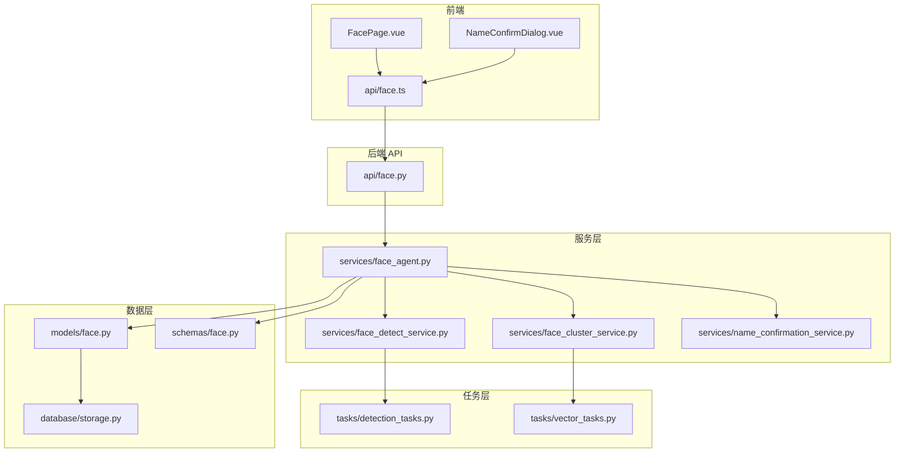
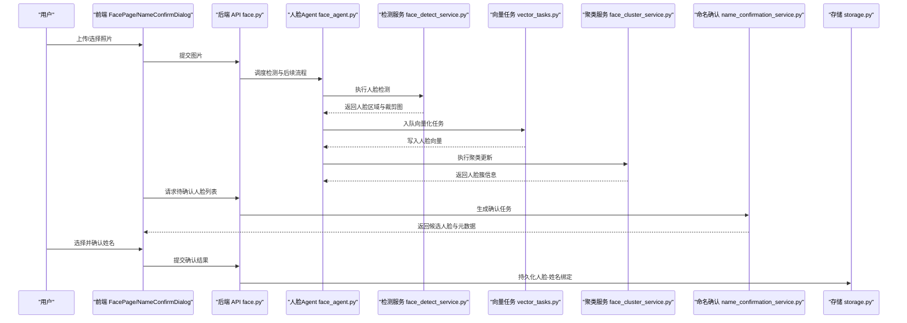
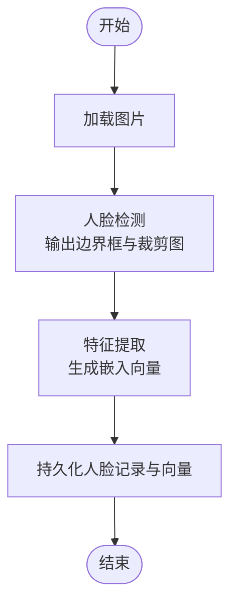
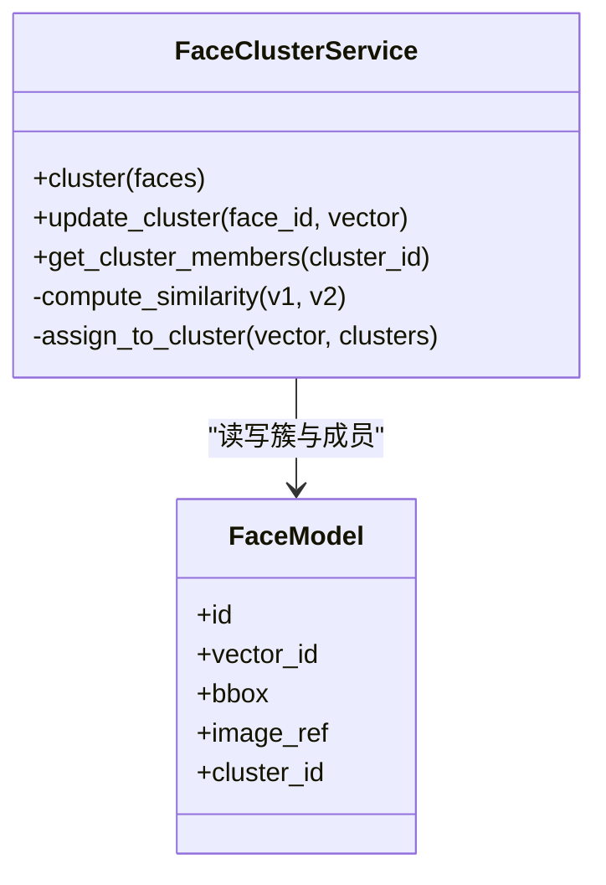
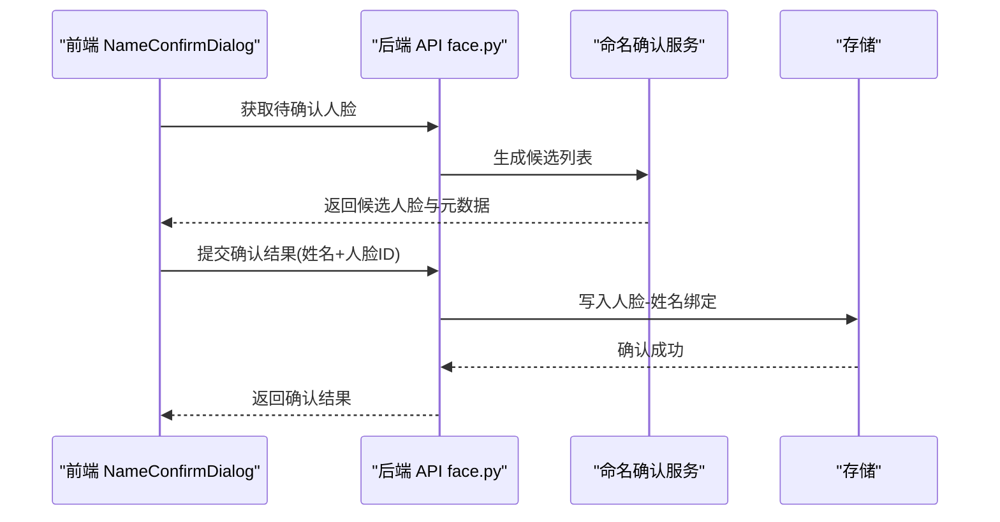
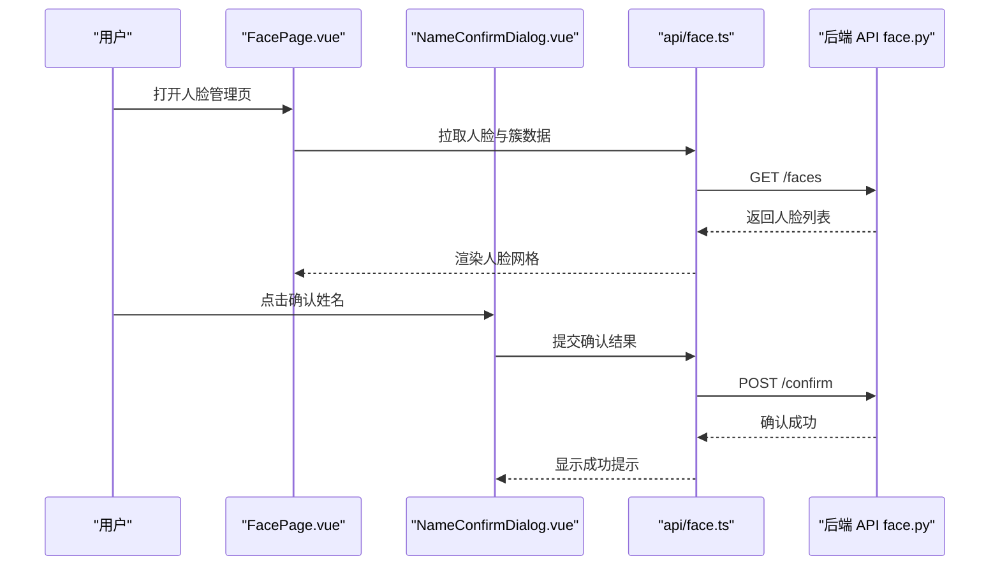
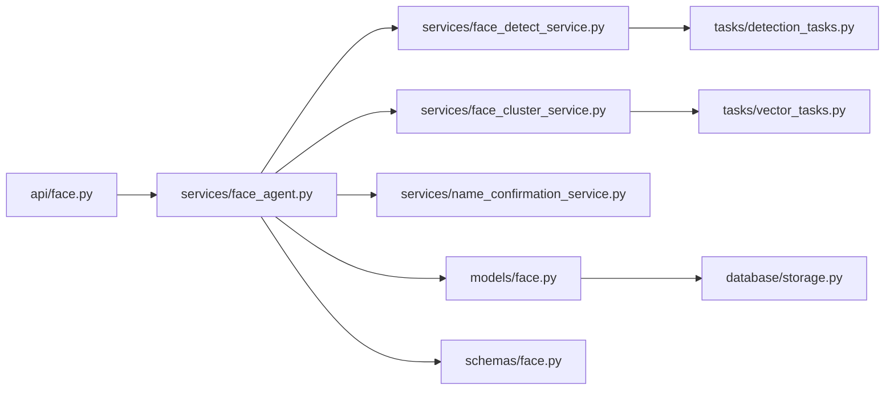

# 人脸Agent

<cite>
**本文引用的文件**   
- [backend/app/services/face_agent.py](file://backend/app/services/face_agent.py)
- [backend/app/services/face_detect_service.py](file://backend/app/services/face_detect_service.py)
- [backend/app/services/face_cluster_service.py](file://backend/app/services/face_cluster_service.py)
- [backend/app/services/name_confirmation_service.py](file://backend/app/services/name_confirmation_service.py)
- [backend/app/api/face.py](file://backend/app/api/face.py)
- [backend/app/models/face.py](file://backend/app/models/face.py)
- [backend/app/schemas/face.py](file://backend/app/schemas/face.py)
- [backend/app/tasks/detection_tasks.py](file://backend/app/tasks/detection_tasks.py)
- [backend/app/tasks/vector_tasks.py](file://backend/app/tasks/vector_tasks.py)
- [backend/app/database/storage.py](file://backend/app/database/storage.py)
- [frontend/src/components/chat/NameConfirmDialog.vue](file://frontend/src/components/chat/NameConfirmDialog.vue)
- [frontend/src/views/FacePage.vue](file://frontend/src/views/FacePage.vue)
- [frontend/src/api/face.ts](file://frontend/src/api/face.ts)
</cite>

## 目录
1. [简介](#简介)
2. [项目结构](#项目结构)
3. [核心组件](#核心组件)
4. [架构总览](#架构总览)
5. [详细组件分析](#详细组件分析)
6. [依赖关系分析](#依赖关系分析)
7. [性能与优化](#性能与优化)
8. [故障排查指南](#故障排查指南)
9. [结论](#结论)
10. [附录](#附录)

## 简介
本文件面向“人脸Agent”的技术文档，聚焦人脸识别与身份验证机制，覆盖人脸检测、特征提取、人脸聚类算法实现、相似度计算、身份确认流程、人脸库管理、隐私保护、批量处理优化与性能调优策略，并说明人脸标注界面集成与用户确认流程的技术实现。文档以代码级为依据，提供架构图、时序图与流程图，帮助读者快速理解系统设计与落地细节。

## 项目结构
后端采用分层架构：API层暴露REST接口，服务层封装业务逻辑（检测、向量、聚类、命名确认等），任务层负责异步批处理，数据模型与存储抽象数据库与对象存储。前端提供人脸管理与标注交互页面及对话框组件，通过API与服务端协同完成识别与确认闭环。



图表来源
- [backend/app/api/face.py](file://backend/app/api/face.py)
- [backend/app/services/face_agent.py](file://backend/app/services/face_agent.py)
- [backend/app/services/face_detect_service.py](file://backend/app/services/face_detect_service.py)
- [backend/app/services/face_cluster_service.py](file://backend/app/services/face_cluster_service.py)
- [backend/app/services/name_confirmation_service.py](file://backend/app/services/name_confirmation_service.py)
- [backend/app/tasks/detection_tasks.py](file://backend/app/tasks/detection_tasks.py)
- [backend/app/tasks/vector_tasks.py](file://backend/app/tasks/vector_tasks.py)
- [backend/app/models/face.py](file://backend/app/models/face.py)
- [backend/app/schemas/face.py](file://backend/app/schemas/face.py)
- [backend/app/database/storage.py](file://backend/app/database/storage.py)
- [frontend/src/views/FacePage.vue](file://frontend/src/views/FacePage.vue)
- [frontend/src/components/chat/NameConfirmDialog.vue](file://frontend/src/components/chat/NameConfirmDialog.vue)
- [frontend/src/api/face.ts](file://frontend/src/api/face.ts)

章节来源
- [backend/app/api/face.py](file://backend/app/api/face.py)
- [backend/app/services/face_agent.py](file://backend/app/services/face_agent.py)
- [backend/app/services/face_detect_service.py](file://backend/app/services/face_detect_service.py)
- [backend/app/services/face_cluster_service.py](file://backend/app/services/face_cluster_service.py)
- [backend/app/services/name_confirmation_service.py](file://backend/app/services/name_confirmation_service.py)
- [backend/app/tasks/detection_tasks.py](file://backend/app/tasks/detection_tasks.py)
- [backend/app/tasks/vector_tasks.py](file://backend/app/tasks/vector_tasks.py)
- [backend/app/models/face.py](file://backend/app/models/face.py)
- [backend/app/schemas/face.py](file://backend/app/schemas/face.py)
- [backend/app/database/storage.py](file://backend/app/database/storage.py)
- [frontend/src/views/FacePage.vue](file://frontend/src/views/FacePage.vue)
- [frontend/src/components/chat/NameConfirmDialog.vue](file://frontend/src/components/chat/NameConfirmDialog.vue)
- [frontend/src/api/face.ts](file://frontend/src/api/face.ts)

## 核心组件
- 人脸Agent服务：协调检测、特征向量、聚类与命名确认，统一对外能力。
- 人脸检测服务：执行人脸检测与裁剪，产出人脸图像与边界框。
- 人脸聚类服务：基于特征向量进行聚类，维护人脸簇与成员映射。
- 命名确认服务：将候选人脸与用户确认的姓名绑定，形成可检索的身份实体。
- 任务队列：异步执行大规模检测与向量化，提升吞吐与稳定性。
- 数据模型与Schema：定义人脸记录、簇、向量、元数据等持久化结构与校验规则。
- 前端标注与确认：提供人脸浏览、选择、确认姓名的交互界面。

章节来源
- [backend/app/services/face_agent.py](file://backend/app/services/face_agent.py)
- [backend/app/services/face_detect_service.py](file://backend/app/services/face_detect_service.py)
- [backend/app/services/face_cluster_service.py](file://backend/app/services/face_cluster_service.py)
- [backend/app/services/name_confirmation_service.py](file://backend/app/services/name_confirmation_service.py)
- [backend/app/tasks/detection_tasks.py](file://backend/app/tasks/detection_tasks.py)
- [backend/app/tasks/vector_tasks.py](file://backend/app/tasks/vector_tasks.py)
- [backend/app/models/face.py](file://backend/app/models/face.py)
- [backend/app/schemas/face.py](file://backend/app/schemas/face.py)
- [frontend/src/views/FacePage.vue](file://frontend/src/views/FacePage.vue)
- [frontend/src/components/chat/NameConfirmDialog.vue](file://frontend/src/components/chat/NameConfirmDialog.vue)

## 架构总览
整体流程从上传或入库照片开始，触发检测任务，生成人脸图像与边界框；随后对人脸进行特征提取与向量化，进入聚类阶段构建人脸簇；用户在前端进行标注与姓名确认，最终形成可检索的人脸身份库。



图表来源
- [backend/app/api/face.py](file://backend/app/api/face.py)
- [backend/app/services/face_agent.py](file://backend/app/services/face_agent.py)
- [backend/app/services/face_detect_service.py](file://backend/app/services/face_detect_service.py)
- [backend/app/tasks/vector_tasks.py](file://backend/app/tasks/vector_tasks.py)
- [backend/app/services/face_cluster_service.py](file://backend/app/services/face_cluster_service.py)
- [backend/app/services/name_confirmation_service.py](file://backend/app/services/name_confirmation_service.py)
- [backend/app/database/storage.py](file://backend/app/database/storage.py)
- [frontend/src/views/FacePage.vue](file://frontend/src/views/FacePage.vue)
- [frontend/src/components/chat/NameConfirmDialog.vue](file://frontend/src/components/chat/NameConfirmDialog.vue)

## 详细组件分析

### 人脸检测与特征提取
- 检测服务负责在图片中定位人脸，输出边界框与裁剪后的人脸图像，供后续特征提取使用。
- 特征提取由向量化任务驱动，将人脸图像转换为固定维度的嵌入向量，用于相似度计算与聚类。
- 检测与向量化均支持异步任务队列，便于批量处理与资源隔离。



图表来源
- [backend/app/services/face_detect_service.py](file://backend/app/services/face_detect_service.py)
- [backend/app/tasks/vector_tasks.py](file://backend/app/tasks/vector_tasks.py)
- [backend/app/database/storage.py](file://backend/app/database/storage.py)

章节来源
- [backend/app/services/face_detect_service.py](file://backend/app/services/face_detect_service.py)
- [backend/app/tasks/vector_tasks.py](file://backend/app/tasks/vector_tasks.py)
- [backend/app/database/storage.py](file://backend/app/database/storage.py)

### 人脸聚类算法实现
- 聚类服务基于人脸向量进行聚类，将相似人脸归入同一簇，维护簇ID与成员映射。
- 聚类过程通常包含距离度量、阈值判定与增量更新，确保新增人脸能正确归属到已有簇或创建新簇。
- 聚类结果用于加速比对与检索，减少全库扫描开销。



图表来源
- [backend/app/services/face_cluster_service.py](file://backend/app/services/face_cluster_service.py)
- [backend/app/models/face.py](file://backend/app/models/face.py)

章节来源
- [backend/app/services/face_cluster_service.py](file://backend/app/services/face_cluster_service.py)
- [backend/app/models/face.py](file://backend/app/models/face.py)

### 相似度计算与身份确认流程
- 相似度计算基于嵌入向量的距离度量（如余弦相似度或欧氏距离），结合阈值判定是否匹配。
- 身份确认流程由命名确认服务驱动，将候选人脸与用户确认的姓名绑定，形成可检索的身份实体。
- 前端通过对话框组件展示候选人脸，用户确认后提交结果，后端持久化绑定关系。



图表来源
- [backend/app/api/face.py](file://backend/app/api/face.py)
- [backend/app/services/name_confirmation_service.py](file://backend/app/services/name_confirmation_service.py)
- [backend/app/database/storage.py](file://backend/app/database/storage.py)
- [frontend/src/components/chat/NameConfirmDialog.vue](file://frontend/src/components/chat/NameConfirmDialog.vue)

章节来源
- [backend/app/api/face.py](file://backend/app/api/face.py)
- [backend/app/services/name_confirmation_service.py](file://backend/app/services/name_confirmation_service.py)
- [backend/app/database/storage.py](file://backend/app/database/storage.py)
- [frontend/src/components/chat/NameConfirmDialog.vue](file://frontend/src/components/chat/NameConfirmDialog.vue)

### 人脸库管理机制
- 人脸库由人脸记录、簇、向量与元数据组成，支持增删改查与批量操作。
- 模型与Schema定义了字段约束与校验规则，保证数据一致性与完整性。
- 存储层抽象数据库与对象存储，支持人脸图像与向量索引的分离管理。

```mermaid
erDiagram
FACE {
uuid id PK
uuid photo_id FK
bbox json
image_ref string
cluster_id FK
created_at timestamp
}
CLUSTER {
uuid id PK
int member_count
created_at timestamp
}
VECTOR {
uuid id PK
uuid face_id FK
float[] embedding
}
FACE ||--o{ VECTOR : "拥有"
FACE }o--|| CLUSTER : "属于"
```

图表来源
- [backend/app/models/face.py](file://backend/app/models/face.py)
- [backend/app/schemas/face.py](file://backend/app/schemas/face.py)
- [backend/app/database/storage.py](file://backend/app/database/storage.py)

章节来源
- [backend/app/models/face.py](file://backend/app/models/face.py)
- [backend/app/schemas/face.py](file://backend/app/schemas/face.py)
- [backend/app/database/storage.py](file://backend/app/database/storage.py)

### 前端标注界面集成与用户确认流程
- 人脸页面提供人脸浏览、筛选与批量操作入口，调用API获取人脸与簇信息。
- 名称确认对话框展示候选人脸，用户选择并输入姓名后提交确认结果。
- 前端通过统一的请求工具封装API调用，处理错误与状态反馈。



图表来源
- [frontend/src/views/FacePage.vue](file://frontend/src/views/FacePage.vue)
- [frontend/src/components/chat/NameConfirmDialog.vue](file://frontend/src/components/chat/NameConfirmDialog.vue)
- [frontend/src/api/face.ts](file://frontend/src/api/face.ts)
- [backend/app/api/face.py](file://backend/app/api/face.py)

章节来源
- [frontend/src/views/FacePage.vue](file://frontend/src/views/FacePage.vue)
- [frontend/src/components/chat/NameConfirmDialog.vue](file://frontend/src/components/chat/NameConfirmDialog.vue)
- [frontend/src/api/face.ts](file://frontend/src/api/face.ts)
- [backend/app/api/face.py](file://backend/app/api/face.py)

## 依赖关系分析
- 服务层依赖任务层进行异步处理，降低同步阻塞风险。
- API层作为统一入口，协调各服务完成端到端流程。
- 数据层通过模型与Schema保障数据结构与校验，存储层抽象底层介质。



图表来源
- [backend/app/api/face.py](file://backend/app/api/face.py)
- [backend/app/services/face_agent.py](file://backend/app/services/face_agent.py)
- [backend/app/services/face_detect_service.py](file://backend/app/services/face_detect_service.py)
- [backend/app/services/face_cluster_service.py](file://backend/app/services/face_cluster_service.py)
- [backend/app/services/name_confirmation_service.py](file://backend/app/services/name_confirmation_service.py)
- [backend/app/tasks/detection_tasks.py](file://backend/app/tasks/detection_tasks.py)
- [backend/app/tasks/vector_tasks.py](file://backend/app/tasks/vector_tasks.py)
- [backend/app/models/face.py](file://backend/app/models/face.py)
- [backend/app/schemas/face.py](file://backend/app/schemas/face.py)
- [backend/app/database/storage.py](file://backend/app/database/storage.py)

章节来源
- [backend/app/api/face.py](file://backend/app/api/face.py)
- [backend/app/services/face_agent.py](file://backend/app/services/face_agent.py)
- [backend/app/services/face_detect_service.py](file://backend/app/services/face_detect_service.py)
- [backend/app/services/face_cluster_service.py](file://backend/app/services/face_cluster_service.py)
- [backend/app/services/name_confirmation_service.py](file://backend/app/services/name_confirmation_service.py)
- [backend/app/tasks/detection_tasks.py](file://backend/app/tasks/detection_tasks.py)
- [backend/app/tasks/vector_tasks.py](file://backend/app/tasks/vector_tasks.py)
- [backend/app/models/face.py](file://backend/app/models/face.py)
- [backend/app/schemas/face.py](file://backend/app/schemas/face.py)
- [backend/app/database/storage.py](file://backend/app/database/storage.py)

## 性能与优化
- 批量处理优化
  - 使用任务队列并行执行检测与向量化，避免单线程瓶颈。
  - 分片处理大相册，控制单次任务大小，降低内存峰值。
- 相似度计算优化
  - 优先在簇内检索，缩小比对范围，减少全库扫描。
  - 缓存热门簇的最近邻索引，提高查询命中率。
- 存储与I/O优化
  - 人脸图像与向量分离存储，按需加载，减少IO压力。
  - 为向量字段建立索引，加速近似最近邻搜索。
- 并发与资源隔离
  - 检测、向量化、聚类等任务独立进程或线程池，避免相互影响。
  - 设置合理的超时与重试策略，增强鲁棒性。

[本节为通用性能建议，不直接分析具体文件]

## 故障排查指南
- 常见问题定位
  - 检测失败：检查图片格式、分辨率与遮挡情况，查看检测日志与边界框有效性。
  - 向量化异常：确认模型可用性与输入尺寸，核对向量维度一致性。
  - 聚类偏差：调整相似度阈值与聚类参数，观察簇合并与分裂行为。
  - 确认流程中断：核对前端提交的数据结构与后端接收字段，检查事务回滚与幂等性。
- 日志与监控
  - 关键路径打点：检测耗时、向量维度、聚类数量、确认成功率。
  - 错误码与堆栈：统一错误响应格式，便于前端提示与后端排障。
- 恢复策略
  - 断点续跑：记录任务进度，支持失败重试与增量更新。
  - 数据一致性：在确认绑定前进行预校验，避免脏数据入库。

章节来源
- [backend/app/services/face_detect_service.py](file://backend/app/services/face_detect_service.py)
- [backend/app/tasks/vector_tasks.py](file://backend/app/tasks/vector_tasks.py)
- [backend/app/services/face_cluster_service.py](file://backend/app/services/face_cluster_service.py)
- [backend/app/services/name_confirmation_service.py](file://backend/app/services/name_confirmation_service.py)
- [backend/app/api/face.py](file://backend/app/api/face.py)

## 结论
人脸Agent通过检测、向量化、聚类与命名确认的流水线，构建了可扩展的人脸识别与身份验证体系。借助任务队列与前后端协作，系统在批量处理与用户体验方面具备良好平衡。持续优化相似度阈值、索引策略与资源隔离，可进一步提升准确率与吞吐。

[本节为总结性内容，不直接分析具体文件]

## 附录
- 术语说明
  - 人脸簇：具有相似特征的人脸集合，用于加速检索与比对。
  - 嵌入向量：人脸图像经模型编码后的低维表示，用于相似度计算。
  - 命名确认：将人脸与用户指定的姓名绑定，形成可检索身份。
- 参考实现路径
  - 检测与向量化：参见检测服务与向量任务文件。
  - 聚类与确认：参见聚类服务与命名确认服务文件。
  - 前端交互：参见人脸页面与名称确认对话框文件。

[本节为补充信息，不直接分析具体文件]