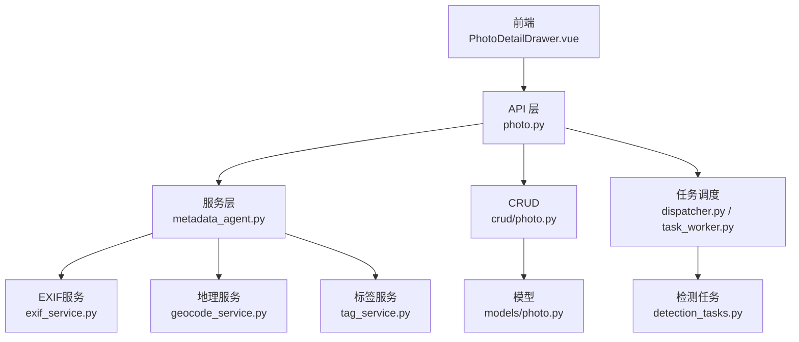
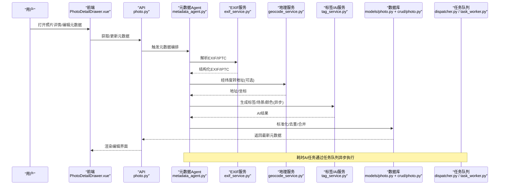
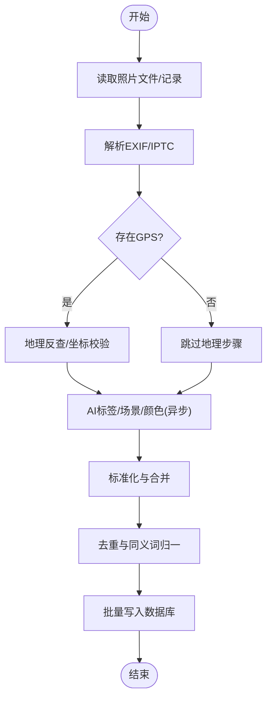
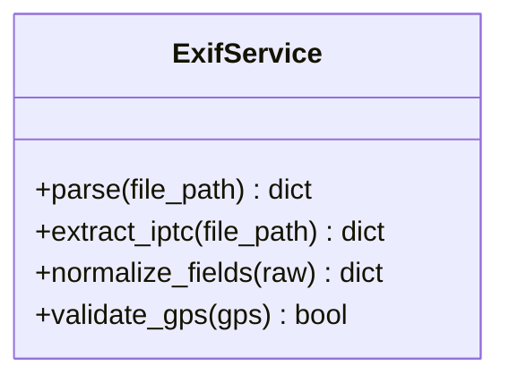
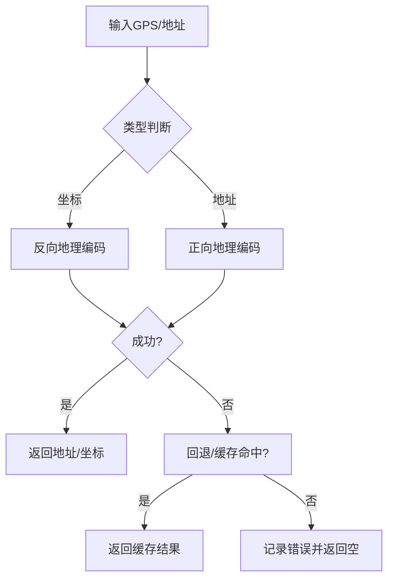
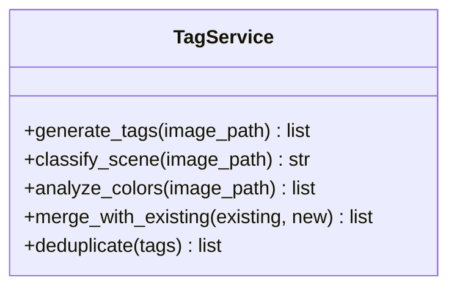
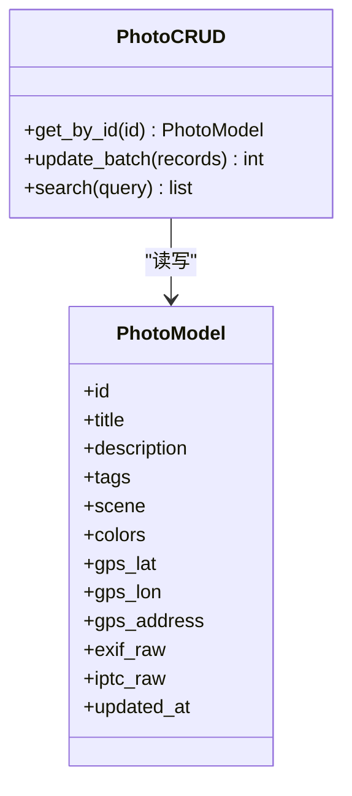
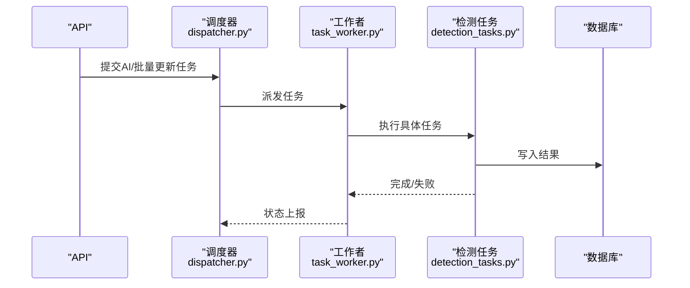
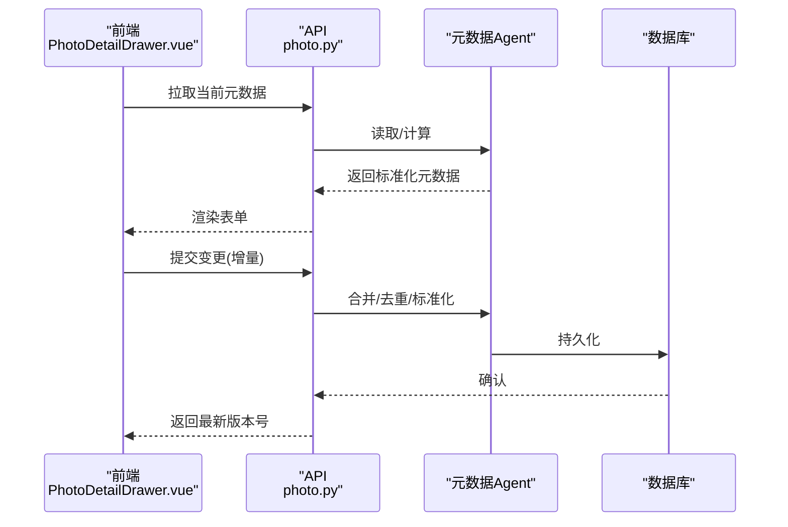
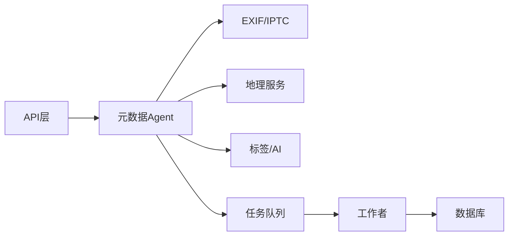

# 元数据Agent

<cite>
**本文引用的文件**   
- [backend/app/services/agent/metadata_agent.py](file://backend/app/services/agent/metadata_agent.py)
- [backend/app/services/exif_service.py](file://backend/app/services/exif_service.py)
- [backend/app/services/geocode_service.py](file://backend/app/services/geocode_service.py)
- [backend/app/services/tag_service.py](file://backend/app/services/tag_service.py)
- [backend/app/models/photo.py](file://backend/app/models/photo.py)
- [backend/app/schemas/photo.py](file://backend/app/schemas/photo.py)
- [backend/app/crud/photo.py](file://backend/app/crud/photo.py)
- [backend/app/api/photo.py](file://backend/app/api/photo.py)
- [backend/app/tasks/detection_tasks.py](file://backend/app/tasks/detection_tasks.py)
- [backend/app/tasks/dispatcher.py](file://backend/app/tasks/dispatcher.py)
- [backend/app/tasks/task_worker.py](file://backend/app/tasks/task_worker.py)
- [frontend/src/api/agent.ts](file://frontend/src/api/agent.ts)
- [frontend/src/components/photo/PhotoDetailDrawer.vue](file://frontend/src/components/photo/PhotoDetailDrawer.vue)
</cite>

## 目录
1. [简介](#简介)
2. [项目结构](#项目结构)
3. [核心组件](#核心组件)
4. [架构总览](#架构总览)
5. [详细组件分析](#详细组件分析)
6. [依赖关系分析](#依赖关系分析)
7. [性能考虑](#性能考虑)
8. [故障排查指南](#故障排查指南)
9. [结论](#结论)
10. [附录](#附录)

## 简介
本文件面向“元数据Agent”，聚焦照片信息提取与处理的全链路实现，包括：
- EXIF 数据解析、IPTC 元数据处理、地理位置信息提取
- AI 辅助的标签自动生成、场景识别、颜色分析
- 元数据标准化、去重处理、批量更新机制
- 元数据编辑界面集成与前后端数据同步策略

目标是帮助开发者快速理解并扩展该能力，同时为运维与产品提供可操作的排障与优化建议。

## 项目结构
围绕元数据Agent的相关代码主要分布在后端服务层、任务调度层、模型与接口层，以及前端编辑界面与API调用模块中。整体采用分层架构：
- API 层：暴露REST接口，接收元数据相关请求
- 服务层：封装EXIF/IPTC解析、地理编码、AI标签生成等逻辑
- 任务层：异步执行耗时任务（如AI推理、批量更新）
- 数据层：ORM模型、CRUD操作、数据库存储
- 前端：提供元数据编辑界面与实时同步体验

图表来源
- [backend/app/api/photo.py](file://backend/app/api/photo.py)
- [backend/app/services/agent/metadata_agent.py](file://backend/app/services/agent/metadata_agent.py)
- [backend/app/services/exif_service.py](file://backend/app/services/exif_service.py)
- [backend/app/services/geocode_service.py](file://backend/app/services/geocode_service.py)
- [backend/app/services/tag_service.py](file://backend/app/services/tag_service.py)
- [backend/app/crud/photo.py](file://backend/app/crud/photo.py)
- [backend/app/models/photo.py](file://backend/app/models/photo.py)
- [backend/app/tasks/dispatcher.py](file://backend/app/tasks/dispatcher.py)
- [backend/app/tasks/task_worker.py](file://backend/app/tasks/task_worker.py)
- [backend/app/tasks/detection_tasks.py](file://backend/app/tasks/detection_tasks.py)

章节来源
- [backend/app/api/photo.py](file://backend/app/api/photo.py)
- [backend/app/services/agent/metadata_agent.py](file://backend/app/services/agent/metadata_agent.py)
- [backend/app/services/exif_service.py](file://backend/app/services/exif_service.py)
- [backend/app/services/geocode_service.py](file://backend/app/services/geocode_service.py)
- [backend/app/services/tag_service.py](file://backend/app/services/tag_service.py)
- [backend/app/crud/photo.py](file://backend/app/crud/photo.py)
- [backend/app/models/photo.py](file://backend/app/models/photo.py)
- [backend/app/tasks/dispatcher.py](file://backend/app/tasks/dispatcher.py)
- [backend/app/tasks/task_worker.py](file://backend/app/tasks/task_worker.py)
- [backend/app/tasks/detection_tasks.py](file://backend/app/tasks/detection_tasks.py)

## 核心组件
- 元数据编排器（Metadata Agent）
  - 职责：协调EXIF/IPTC解析、地理信息补全、AI标签生成、标准化与去重、持久化与批量更新
  - 关键流程：读取媒体 -> 解析EXIF/IPTC -> 地理反查 -> AI标签/场景/颜色 -> 标准化与合并 -> 写入数据库
- EXIF/IPTC 解析服务
  - 职责：从图片文件中抽取相机参数、拍摄时间、作者、版权、描述等结构化字段
- 地理信息服务
  - 职责：将经纬度转换为可读地址，或根据地址推断坐标；支持失败回退与缓存
- 标签与AI服务
  - 职责：基于视觉模型生成标签、场景分类、主色/调色板；与现有标签体系进行融合与去重
- 数据模型与CRUD
  - 职责：定义照片实体、元数据字段、索引与约束；提供增删改查与批量更新
- 任务调度与工作者
  - 职责：将耗时任务入队，由工作进程异步执行，保障系统吞吐与稳定性
- 前端编辑界面
  - 职责：展示与编辑元数据，支持增量保存与冲突提示

章节来源
- [backend/app/services/agent/metadata_agent.py](file://backend/app/services/agent/metadata_agent.py)
- [backend/app/services/exif_service.py](file://backend/app/services/exif_service.py)
- [backend/app/services/geocode_service.py](file://backend/app/services/geocode_service.py)
- [backend/app/services/tag_service.py](file://backend/app/services/tag_service.py)
- [backend/app/models/photo.py](file://backend/app/models/photo.py)
- [backend/app/crud/photo.py](file://backend/app/crud/photo.py)
- [backend/app/tasks/dispatcher.py](file://backend/app/tasks/dispatcher.py)
- [backend/app/tasks/task_worker.py](file://backend/app/tasks/task_worker.py)
- [backend/app/tasks/detection_tasks.py](file://backend/app/tasks/detection_tasks.py)
- [frontend/src/components/photo/PhotoDetailDrawer.vue](file://frontend/src/components/photo/PhotoDetailDrawer.vue)

## 架构总览
下图展示了从上传到元数据落库的关键路径，以及AI与地理服务的协作方式。

图表来源
- [backend/app/api/photo.py](file://backend/app/api/photo.py)
- [backend/app/services/agent/metadata_agent.py](file://backend/app/services/agent/metadata_agent.py)
- [backend/app/services/exif_service.py](file://backend/app/services/exif_service.py)
- [backend/app/services/geocode_service.py](file://backend/app/services/geocode_service.py)
- [backend/app/services/tag_service.py](file://backend/app/services/tag_service.py)
- [backend/app/models/photo.py](file://backend/app/models/photo.py)
- [backend/app/crud/photo.py](file://backend/app/crud/photo.py)
- [backend/app/tasks/dispatcher.py](file://backend/app/tasks/dispatcher.py)
- [backend/app/tasks/task_worker.py](file://backend/app/tasks/task_worker.py)

## 详细组件分析

### 元数据Agent（编排器）
- 功能要点
  - 统一入口：聚合EXIF/IPTC、地理、AI标签等多源信息
  - 标准化：字段映射、单位/时区归一、空值与默认值处理
  - 去重：标签合并、同义词归一、重复条目剔除
  - 批量更新：按批次提交，事务性写入，失败重试
  - 异步化：对AI推理、大规模地理反查等耗时步骤走任务队列
- 典型流程
  - 输入：照片ID或文件句柄
  - 处理：解析 -> 地理 -> AI -> 标准化 -> 去重 -> 持久化
  - 输出：标准化后的元数据对象，供查询与编辑使用

图表来源
- [backend/app/services/agent/metadata_agent.py](file://backend/app/services/agent/metadata_agent.py)
- [backend/app/services/exif_service.py](file://backend/app/services/exif_service.py)
- [backend/app/services/geocode_service.py](file://backend/app/services/geocode_service.py)
- [backend/app/services/tag_service.py](file://backend/app/services/tag_service.py)
- [backend/app/crud/photo.py](file://backend/app/crud/photo.py)

章节来源
- [backend/app/services/agent/metadata_agent.py](file://backend/app/services/agent/metadata_agent.py)

### EXIF/IPTC 解析服务
- 功能要点
  - 解析相机型号、镜头、光圈、快门、ISO、白平衡、曝光补偿等
  - 解析拍摄时间、方向、分辨率、色彩空间
  - 解析IPTC：作者、版权、标题、描述、关键词、创建日期等
  - 异常容错：缺失字段、损坏头、非图像文件等
- 数据结构
  - 输出为统一的字典/对象，便于后续标准化与入库

图表来源
- [backend/app/services/exif_service.py](file://backend/app/services/exif_service.py)

章节来源
- [backend/app/services/exif_service.py](file://backend/app/services/exif_service.py)

### 地理信息服务
- 功能要点
  - GPS坐标有效性校验、坐标系转换
  - 正向/反向地理编码（坐标->地址，地址->坐标）
  - 失败回退与缓存策略（本地/内存）
- 错误处理
  - 网络超时、配额限制、非法坐标等异常分支

图表来源
- [backend/app/services/geocode_service.py](file://backend/app/services/geocode_service.py)

章节来源
- [backend/app/services/geocode_service.py](file://backend/app/services/geocode_service.py)

### 标签与AI服务（标签/场景/颜色）
- 功能要点
  - 标签生成：基于视觉模型输出候选标签，结合领域词表过滤
  - 场景识别：室内/室外、自然/城市、人像/风景等
  - 颜色分析：主色、调色板、色调分布
  - 与现有标签体系融合：同义词归一、层级合并、权重排序
- 异步执行
  - 通过任务队列分发，避免阻塞主流程

图表来源
- [backend/app/services/tag_service.py](file://backend/app/services/tag_service.py)

章节来源
- [backend/app/services/tag_service.py](file://backend/app/services/tag_service.py)

### 数据模型与CRUD
- 模型设计
  - 照片实体：基础信息、EXIF/IPTC字段、AI标签、地理信息、更新时间戳
  - 索引与约束：唯一键、全文检索字段、外键关联
- CRUD能力
  - 单条更新、批量更新、条件查询、分页与排序
  - 事务控制与并发安全

图表来源
- [backend/app/models/photo.py](file://backend/app/models/photo.py)
- [backend/app/crud/photo.py](file://backend/app/crud/photo.py)

章节来源
- [backend/app/models/photo.py](file://backend/app/models/photo.py)
- [backend/app/crud/photo.py](file://backend/app/crud/photo.py)

### 任务调度与工作者
- 调度器
  - 负责将AI推理、批量更新等任务入队
  - 支持优先级、重试、死信队列
- 工作者
  - 消费任务、执行具体逻辑、写回结果
  - 监控指标：成功率、延迟、资源占用

图表来源
- [backend/app/tasks/dispatcher.py](file://backend/app/tasks/dispatcher.py)
- [backend/app/tasks/task_worker.py](file://backend/app/tasks/task_worker.py)
- [backend/app/tasks/detection_tasks.py](file://backend/app/tasks/detection_tasks.py)

章节来源
- [backend/app/tasks/dispatcher.py](file://backend/app/tasks/dispatcher.py)
- [backend/app/tasks/task_worker.py](file://backend/app/tasks/task_worker.py)
- [backend/app/tasks/detection_tasks.py](file://backend/app/tasks/detection_tasks.py)

### 前端编辑界面与数据同步
- 界面集成
  - 在照片详情页抽屉中展示与编辑元数据（标题、描述、标签、地址等）
  - 支持实时预览、冲突提示、撤销/恢复
- 数据同步策略
  - 增量保存：仅提交变更字段
  - 乐观锁：版本号/时间戳防止覆盖
  - 离线缓存：暂存未提交修改，网络恢复后自动同步
  - 冲突解决：服务端优先或用户选择

图表来源
- [frontend/src/components/photo/PhotoDetailDrawer.vue](file://frontend/src/components/photo/PhotoDetailDrawer.vue)
- [backend/app/api/photo.py](file://backend/app/api/photo.py)
- [backend/app/services/agent/metadata_agent.py](file://backend/app/services/agent/metadata_agent.py)
- [backend/app/crud/photo.py](file://backend/app/crud/photo.py)

章节来源
- [frontend/src/components/photo/PhotoDetailDrawer.vue](file://frontend/src/components/photo/PhotoDetailDrawer.vue)
- [backend/app/api/photo.py](file://backend/app/api/photo.py)

## 依赖关系分析
- 组件耦合
  - 元数据Agent强依赖EXIF/IPTC、地理、标签服务；弱依赖任务调度
  - API层作为门面，屏蔽内部复杂度
- 外部依赖
  - 地理编码服务（可能为第三方API）
  - AI推理服务（本地或云端）
- 潜在循环依赖
  - 通过任务队列解耦AI与主流程，避免循环调用

图表来源
- [backend/app/api/photo.py](file://backend/app/api/photo.py)
- [backend/app/services/agent/metadata_agent.py](file://backend/app/services/agent/metadata_agent.py)
- [backend/app/services/exif_service.py](file://backend/app/services/exif_service.py)
- [backend/app/services/geocode_service.py](file://backend/app/services/geocode_service.py)
- [backend/app/services/tag_service.py](file://backend/app/services/tag_service.py)
- [backend/app/tasks/dispatcher.py](file://backend/app/tasks/dispatcher.py)
- [backend/app/tasks/task_worker.py](file://backend/app/tasks/task_worker.py)

章节来源
- [backend/app/api/photo.py](file://backend/app/api/photo.py)
- [backend/app/services/agent/metadata_agent.py](file://backend/app/services/agent/metadata_agent.py)
- [backend/app/services/exif_service.py](file://backend/app/services/exif_service.py)
- [backend/app/services/geocode_service.py](file://backend/app/services/geocode_service.py)
- [backend/app/services/tag_service.py](file://backend/app/services/tag_service.py)
- [backend/app/tasks/dispatcher.py](file://backend/app/tasks/dispatcher.py)
- [backend/app/tasks/task_worker.py](file://backend/app/tasks/task_worker.py)

## 性能考虑
- 异步化与批量化
  - AI推理与地理反查走任务队列，避免阻塞请求线程
  - 批量更新采用事务与分批提交，降低锁竞争
- 缓存策略
  - 地理反查结果缓存（内存/本地），减少外部调用
  - 常用标签/场景预加载，缩短首屏响应
- 索引与查询
  - 对高频查询字段建立索引（时间、地点、标签）
  - 全文检索字段用于模糊搜索
- 资源隔离
  - AI任务与工作进程隔离，避免相互影响
- 限流与降级
  - 对外部服务设置超时与熔断，失败时回退到本地规则

[本节为通用指导，不直接分析具体文件]

## 故障排查指南
- 常见问题定位
  - EXIF/IPTC解析失败：检查文件格式、头部完整性、权限
  - 地理编码失败：检查网络连通、配额、坐标合法性
  - AI推理超时：检查模型加载、GPU/CPU资源、队列积压
  - 批量更新不一致：检查事务边界、重试策略、幂等性
- 日志与追踪
  - 关键节点打点：解析、地理、AI、写入
  - 错误码与堆栈：便于快速定位
- 回滚与恢复
  - 版本化元数据，支持回滚到上一版本
  - 死信队列中的任务人工介入

章节来源
- [backend/app/services/exif_service.py](file://backend/app/services/exif_service.py)
- [backend/app/services/geocode_service.py](file://backend/app/services/geocode_service.py)
- [backend/app/services/tag_service.py](file://backend/app/services/tag_service.py)
- [backend/app/tasks/dispatcher.py](file://backend/app/tasks/dispatcher.py)
- [backend/app/tasks/task_worker.py](file://backend/app/tasks/task_worker.py)

## 结论
元数据Agent通过模块化设计与异步化策略，实现了从原始照片到标准化元数据的完整流水线。其优势在于：
- 可扩展：新增AI能力或地理服务只需接入对应服务
- 高可用：任务队列与缓存提升鲁棒性
- 易维护：清晰的分层与职责划分
建议在生产环境完善监控告警、容量规划与灰度发布策略，以进一步提升稳定性与用户体验。

[本节为总结性内容，不直接分析具体文件]

## 附录
- 术语说明
  - EXIF：图像交换格式，包含相机参数与拍摄信息
  - IPTC：新闻与媒体行业使用的元数据标准
  - 地理编码：坐标与地址之间的相互转换
  - 标签/场景/颜色：AI生成的结构化描述信息
- 参考接口
  - 元数据编辑与同步：参见前端API与后端API定义
  - 任务管理：参见任务调度与工作者接口

章节来源
- [frontend/src/api/agent.ts](file://frontend/src/api/agent.ts)
- [backend/app/api/photo.py](file://backend/app/api/photo.py)