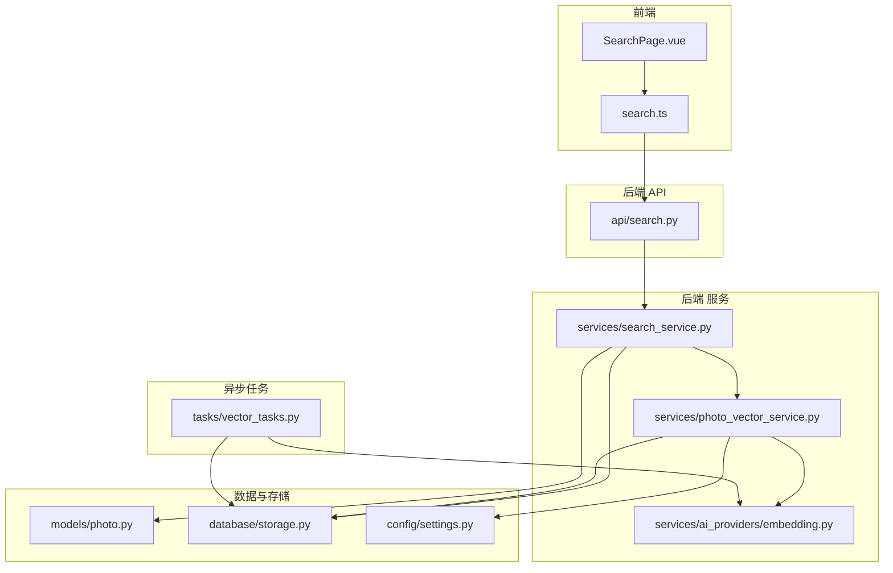
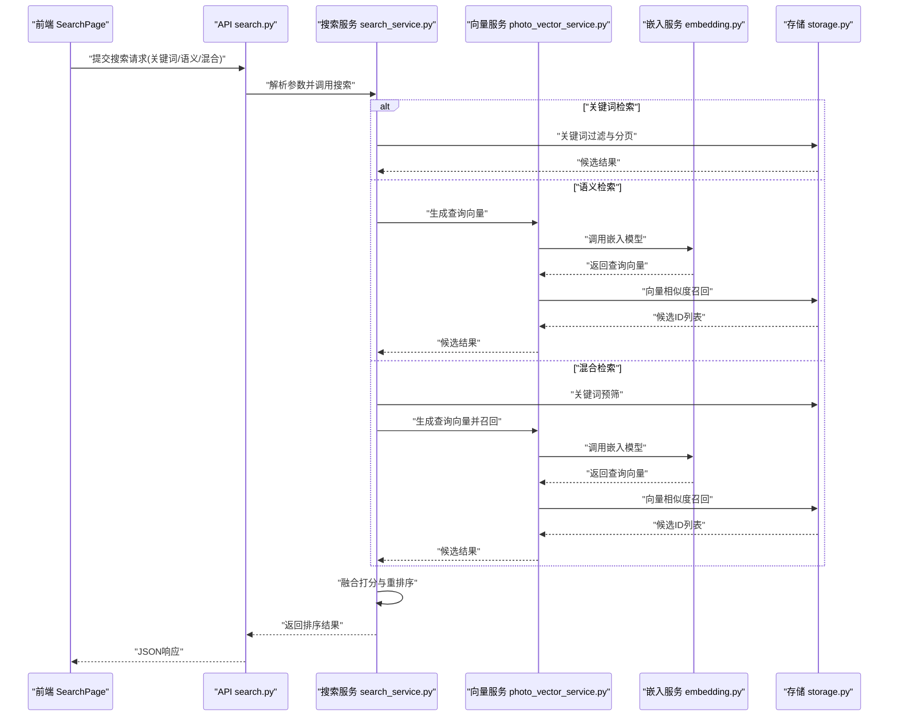
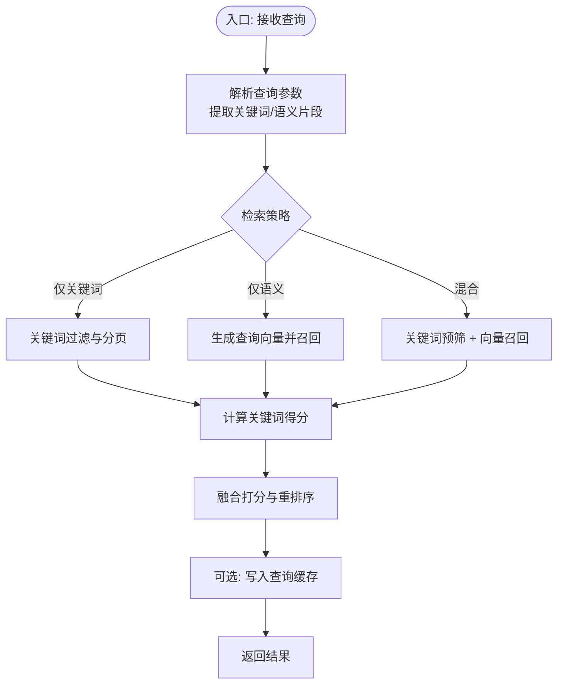
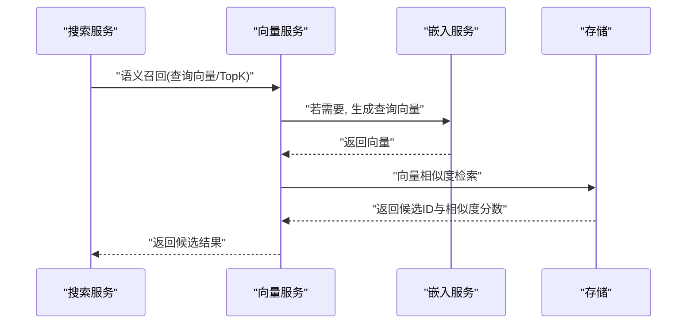
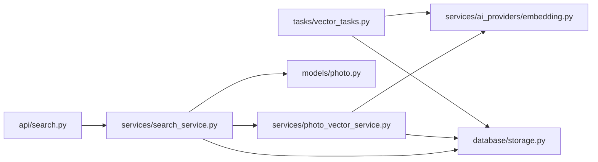

# 搜索Agent

<cite>
**本文引用的文件**   
- [backend/app/api/search.py](file://backend/app/api/search.py)
- [backend/app/services/search_service.py](file://backend/app/services/search_service.py)
- [backend/app/services/photo_vector_service.py](file://backend/app/services/photo_vector_service.py)
- [backend/app/services/ai_providers/embedding.py](file://backend/app/services/ai_providers/embedding.py)
- [backend/app/models/photo.py](file://backend/app/models/photo.py)
- [backend/app/database/storage.py](file://backend/app/database/storage.py)
- [backend/app/config/settings.py](file://backend/app/config/settings.py)
- [backend/app/tasks/vector_tasks.py](file://backend/app/tasks/vector_tasks.py)
- [frontend/src/api/search.ts](file://frontend/src/api/search.ts)
- [frontend/src/views/SearchPage.vue](file://frontend/src/views/SearchPage.vue)
</cite>

## 目录
1. [简介](#简介)
2. [项目结构](#项目结构)
3. [核心组件](#核心组件)
4. [架构总览](#架构总览)
5. [详细组件分析](#详细组件分析)
6. [依赖关系分析](#依赖关系分析)
7. [性能考量](#性能考量)
8. [故障排查指南](#故障排查指南)
9. [结论](#结论)
10. [附录](#附录)

## 简介
本文件为“搜索Agent”的技术文档，聚焦语义搜索与向量检索的实现细节。内容涵盖查询理解、向量嵌入生成、相似度匹配算法、混合搜索策略（关键词+语义）、搜索结果重排序与相关性评分机制；并说明向量数据库集成、索引优化、查询缓存策略，以及搜索建议、自动补全、搜索历史分析等高级功能的实现要点。

## 项目结构
后端采用分层架构：API层暴露REST接口，服务层封装业务逻辑，模型与存储层负责数据访问，任务层异步处理向量计算与索引构建。前端提供搜索页面与API调用。

图表来源
- [backend/app/api/search.py](file://backend/app/api/search.py)
- [backend/app/services/search_service.py](file://backend/app/services/search_service.py)
- [backend/app/services/photo_vector_service.py](file://backend/app/services/photo_vector_service.py)
- [backend/app/services/ai_providers/embedding.py](file://backend/app/services/ai_providers/embedding.py)
- [backend/app/models/photo.py](file://backend/app/models/photo.py)
- [backend/app/database/storage.py](file://backend/app/database/storage.py)
- [backend/app/config/settings.py](file://backend/app/config/settings.py)
- [backend/app/tasks/vector_tasks.py](file://backend/app/tasks/vector_tasks.py)

章节来源
- [backend/app/api/search.py](file://backend/app/api/search.py)
- [backend/app/services/search_service.py](file://backend/app/services/search_service.py)
- [backend/app/services/photo_vector_service.py](file://backend/app/services/photo_vector_service.py)
- [backend/app/services/ai_providers/embedding.py](file://backend/app/services/ai_providers/embedding.py)
- [backend/app/models/photo.py](file://backend/app/models/photo.py)
- [backend/app/database/storage.py](file://backend/app/database/storage.py)
- [backend/app/config/settings.py](file://backend/app/config/settings.py)
- [backend/app/tasks/vector_tasks.py](file://backend/app/tasks/vector_tasks.py)
- [frontend/src/api/search.ts](file://frontend/src/api/search.ts)
- [frontend/src/views/SearchPage.vue](file://frontend/src/views/SearchPage.vue)

## 核心组件
- 搜索服务（SearchService）：统一编排关键词检索与语义检索，执行混合打分与重排序，返回最终结果。
- 向量服务（PhotoVectorService）：管理图片向量的生成、写入、召回与相似度计算，对接外部嵌入服务与向量存储。
- 嵌入提供者（EmbeddingProvider）：封装文本/图像到向量的转换，支持多提供商配置与降级策略。
- 存储层（Storage）：抽象底层数据库与向量库的读写操作，屏蔽具体实现差异。
- 模型（Photo）：定义照片实体及其元数据字段，用于关键词过滤与结果展示。
- 任务（VectorTasks）：异步任务，批量生成与更新向量索引，保障在线查询性能。

章节来源
- [backend/app/services/search_service.py](file://backend/app/services/search_service.py)
- [backend/app/services/photo_vector_service.py](file://backend/app/services/photo_vector_service.py)
- [backend/app/services/ai_providers/embedding.py](file://backend/app/services/ai_providers/embedding.py)
- [backend/app/database/storage.py](file://backend/app/database/storage.py)
- [backend/app/models/photo.py](file://backend/app/models/photo.py)
- [backend/app/tasks/vector_tasks.py](file://backend/app/tasks/vector_tasks.py)

## 架构总览
搜索请求从前端发起，经API路由进入搜索服务。搜索服务根据查询类型选择纯关键词、纯语义或混合模式。语义路径通过向量服务获取查询向量，在向量库中召回候选集，再结合关键词得分进行融合与重排序，最后返回排序后的结果。

图表来源
- [backend/app/api/search.py](file://backend/app/api/search.py)
- [backend/app/services/search_service.py](file://backend/app/services/search_service.py)
- [backend/app/services/photo_vector_service.py](file://backend/app/services/photo_vector_service.py)
- [backend/app/services/ai_providers/embedding.py](file://backend/app/services/ai_providers/embedding.py)
- [backend/app/database/storage.py](file://backend/app/database/storage.py)

## 详细组件分析

### 搜索服务（SearchService）
职责
- 解析查询意图：识别是否包含关键词、语义描述或两者兼有。
- 执行检索策略：关键词过滤、向量召回、混合融合。
- 重排序与评分：基于多因子（关键词匹配度、语义相似度、时间/地理权重等）计算综合得分。
- 缓存命中：对常见查询进行缓存加速。

关键流程

图表来源
- [backend/app/services/search_service.py](file://backend/app/services/search_service.py)
- [backend/app/database/storage.py](file://backend/app/database/storage.py)

章节来源
- [backend/app/services/search_service.py](file://backend/app/services/search_service.py)

### 向量服务（PhotoVectorService）
职责
- 向量生命周期管理：生成、更新、删除、批量重建。
- 相似度检索：按查询向量召回Top-K候选。
- 指标与统计：记录召回数量、耗时、失败率等。

关键流程

图表来源
- [backend/app/services/photo_vector_service.py](file://backend/app/services/photo_vector_service.py)
- [backend/app/services/ai_providers/embedding.py](file://backend/app/services/ai_providers/embedding.py)
- [backend/app/database/storage.py](file://backend/app/database/storage.py)

章节来源
- [backend/app/services/photo_vector_service.py](file://backend/app/services/photo_vector_service.py)

### 嵌入服务（EmbeddingProvider）
职责
- 文本/图像到向量的转换。
- 多提供商适配与降级（如本地模型不可用时切换云端）。
- 批处理与并发控制，避免过载。

注意
- 输入规范化：去除多余空白、统一编码、长度截断。
- 输出校验：维度一致性、NaN/Inf清理。

章节来源
- [backend/app/services/ai_providers/embedding.py](file://backend/app/services/ai_providers/embedding.py)

### 存储层（Storage）
职责
- 统一抽象：关系型数据库与向量库的读写接口。
- 事务与重试：保证写入一致性与容错。
- 分页与过滤：高效关键词检索与条件组合。

章节来源
- [backend/app/database/storage.py](file://backend/app/database/storage.py)

### 模型（Photo）
职责
- 定义照片实体字段：标题、描述、标签、拍摄时间、地理位置等。
- 作为关键词过滤与结果展示的载体。

章节来源
- [backend/app/models/photo.py](file://backend/app/models/photo.py)

### 任务（VectorTasks）
职责
- 异步批量生成与更新向量索引。
- 增量同步：监听变更事件，触发单条或批量重建。
- 监控告警：记录失败与重试次数。

章节来源
- [backend/app/tasks/vector_tasks.py](file://backend/app/tasks/vector_tasks.py)

### 前端交互（SearchPage + search.ts）
职责
- 渲染搜索界面，收集用户输入。
- 调用后端API，展示结果与分页。
- 支持搜索历史与建议提示。

章节来源
- [frontend/src/views/SearchPage.vue](file://frontend/src/views/SearchPage.vue)
- [frontend/src/api/search.ts](file://frontend/src/api/search.ts)

## 依赖关系分析
- 耦合关系
  - API层仅依赖服务层，保持薄控制器。
  - 搜索服务依赖向量服务与存储层，解耦具体检索实现。
  - 向量服务依赖嵌入服务与存储层，屏蔽外部模型与向量库差异。
- 外部依赖
  - 嵌入模型提供商：可配置多个，支持热切换。
  - 向量数据库：通过存储层抽象，便于替换实现。
- 潜在循环依赖
  - 当前分层清晰，未发现直接循环导入。

图表来源
- [backend/app/api/search.py](file://backend/app/api/search.py)
- [backend/app/services/search_service.py](file://backend/app/services/search_service.py)
- [backend/app/services/photo_vector_service.py](file://backend/app/services/photo_vector_service.py)
- [backend/app/services/ai_providers/embedding.py](file://backend/app/services/ai_providers/embedding.py)
- [backend/app/database/storage.py](file://backend/app/database/storage.py)
- [backend/app/models/photo.py](file://backend/app/models/photo.py)
- [backend/app/tasks/vector_tasks.py](file://backend/app/tasks/vector_tasks.py)

章节来源
- [backend/app/api/search.py](file://backend/app/api/search.py)
- [backend/app/services/search_service.py](file://backend/app/services/search_service.py)
- [backend/app/services/photo_vector_service.py](file://backend/app/services/photo_vector_service.py)
- [backend/app/services/ai_providers/embedding.py](file://backend/app/services/ai_providers/embedding.py)
- [backend/app/database/storage.py](file://backend/app/database/storage.py)
- [backend/app/models/photo.py](file://backend/app/models/photo.py)
- [backend/app/tasks/vector_tasks.py](file://backend/app/tasks/vector_tasks.py)

## 性能考量
- 索引优化
  - 向量索引：选择合适的距离度量与索引结构，平衡召回精度与延迟。
  - 分片与分区：按时间或地理分区，减少扫描范围。
- 查询缓存
  - 热点查询缓存：对高频关键词与语义查询进行短期缓存，降低重复计算。
  - 失效策略：基于数据变更事件或TTL过期。
- 批处理与并发
  - 批量生成向量时限制并发度，避免内存峰值与下游限流。
- 重排序开销
  - 先召回后精排，控制候选规模，减少CPU密集操作。

[本节为通用指导，不直接分析具体文件]

## 故障排查指南
常见问题
- 嵌入服务不可用
  - 现象：语义检索超时或返回空结果。
  - 排查：检查提供商配置、网络连通性、配额与错误码。
- 向量索引不一致
  - 现象：新增照片无法被语义检索命中。
  - 排查：确认异步任务是否成功执行，查看失败重试日志。
- 关键词检索异常
  - 现象：过滤条件无效或分页错误。
  - 排查：检查存储层SQL/查询构造与索引覆盖情况。
- 重排序结果不稳定
  - 现象：相同查询多次返回不同顺序。
  - 排查：确认打分函数是否引入随机因素，必要时固定种子或增加稳定性约束。

章节来源
- [backend/app/services/ai_providers/embedding.py](file://backend/app/services/ai_providers/embedding.py)
- [backend/app/tasks/vector_tasks.py](file://backend/app/tasks/vector_tasks.py)
- [backend/app/database/storage.py](file://backend/app/database/storage.py)

## 结论
搜索Agent通过分层设计与清晰的职责划分，实现了关键词、语义与混合检索的统一编排。向量服务与嵌入服务解耦了外部依赖，存储层屏蔽了底层实现差异，使系统具备良好的可扩展性与可维护性。配合索引优化、查询缓存与异步任务，可在大规模数据下保持稳定的检索性能与用户体验。

[本节为总结，不直接分析具体文件]

## 附录

### 混合搜索策略与相关性评分
- 策略
  - 关键词预筛：缩小候选集，提升效率。
  - 语义召回：基于向量相似度获得语义相关项。
  - 融合打分：将关键词得分与语义得分线性或非线性融合。
- 评分要素
  - 关键词匹配度：词频、位置权重、同义词扩展。
  - 语义相似度：余弦相似度或内积，必要时归一化。
  - 辅助信号：时间衰减、地理偏好、用户行为权重。
- 重排序
  - 使用轻量级排序器对Top-N候选进行精排，确保结果稳定与可解释。

章节来源
- [backend/app/services/search_service.py](file://backend/app/services/search_service.py)
- [backend/app/services/photo_vector_service.py](file://backend/app/services/photo_vector_service.py)

### 向量数据库集成与索引优化
- 集成点
  - 存储层提供统一的插入、更新、删除与相似度检索接口。
  - 向量服务负责批量写入与增量同步。
- 索引优化
  - 调整索引参数（如树深度、量化方式）以平衡内存与速度。
  - 定期重建索引以吸收数据漂移。

章节来源
- [backend/app/database/storage.py](file://backend/app/database/storage.py)
- [backend/app/services/photo_vector_service.py](file://backend/app/services/photo_vector_service.py)

### 查询缓存策略
- 缓存键设计
  - 标准化查询文本（去噪、小写、同义词映射）。
  - 组合查询参数（分页、排序、过滤条件）。
- 失效与更新
  - 基于数据变更事件触发失效。
  - TTL策略防止长期陈旧数据。

章节来源
- [backend/app/services/search_service.py](file://backend/app/services/search_service.py)

### 搜索建议与自动补全
- 实现思路
  - 基于历史查询与点击反馈训练前缀模型或倒排索引。
  - 实时聚合最近热门与个性化偏好。
- 前端交互
  - 输入防抖与节流，减少请求频率。
  - 高亮匹配片段，提升可读性。

章节来源
- [frontend/src/views/SearchPage.vue](file://frontend/src/views/SearchPage.vue)
- [frontend/src/api/search.ts](file://frontend/src/api/search.ts)

### 搜索历史分析
- 数据采集
  - 记录查询词、时间戳、设备信息、点击与转化。
- 分析指标
  - 查询分布、长尾词占比、零结果率、平均响应时间。
- 应用
  - 优化索引与词典，改进推荐与补全质量。

章节来源
- [backend/app/services/search_service.py](file://backend/app/services/search_service.py)

### 配置与环境
- 关键配置项
  - 嵌入模型提供商URL、密钥、超时与重试次数。
  - 向量库连接参数与索引参数。
  - 缓存开关与TTL。
- 安全
  - 敏感信息通过环境变量注入，避免硬编码。

章节来源
- [backend/app/config/settings.py](file://backend/app/config/settings.py)