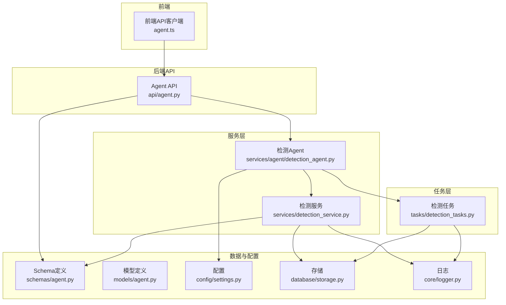
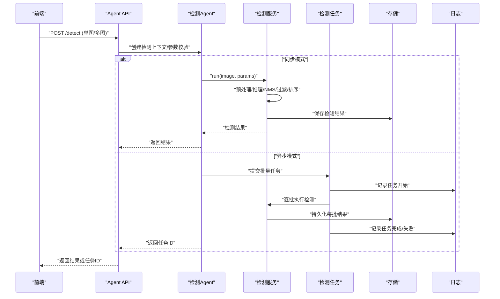
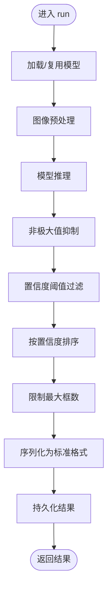
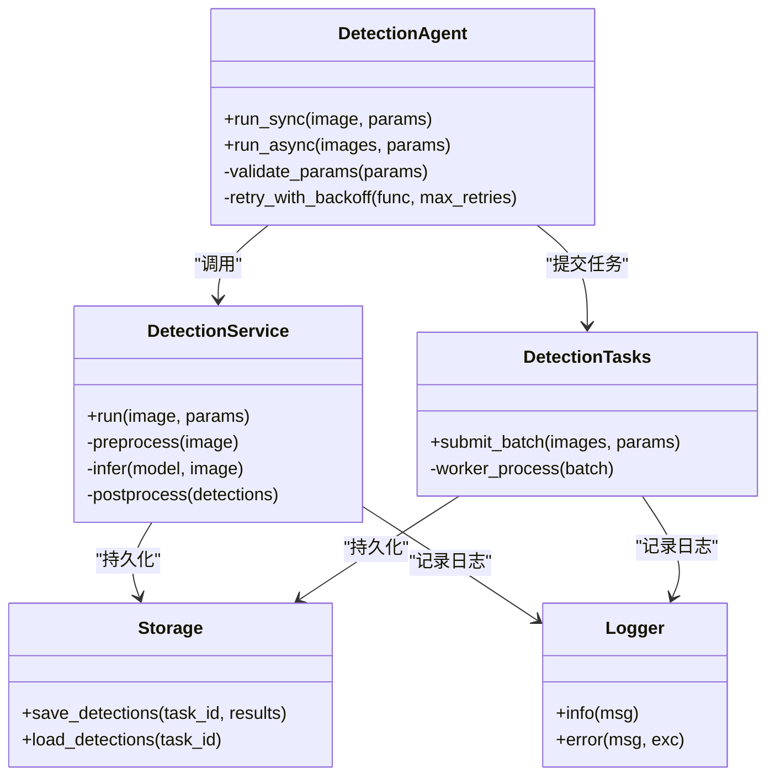
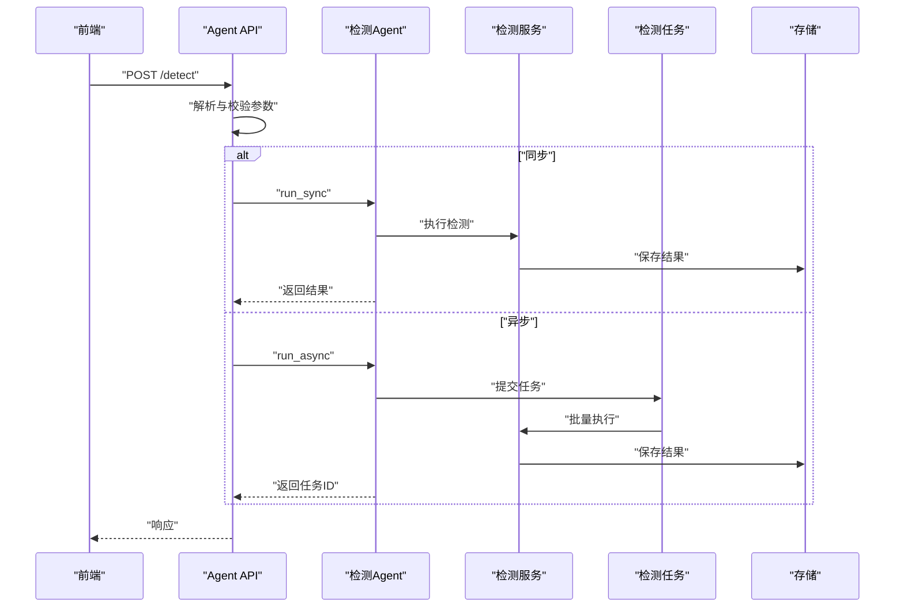
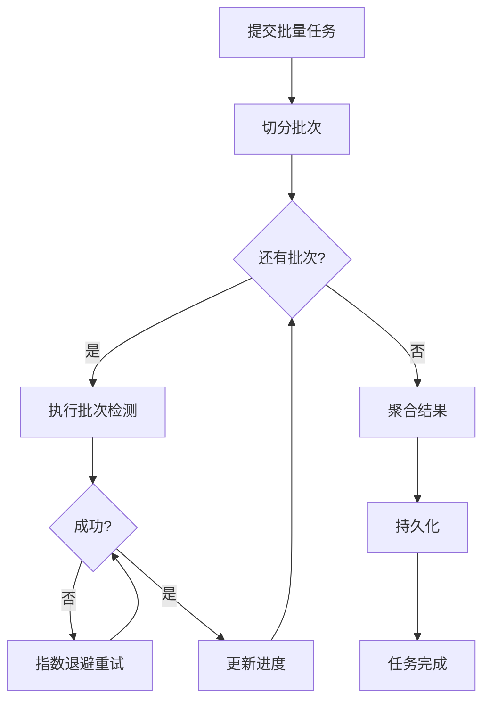
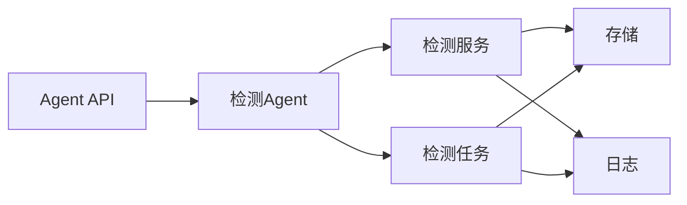

# 检测Agent

<cite>
**本文引用的文件**   
- [backend/app/services/detection_service.py](file://backend/app/services/detection_service.py)
- [backend/app/services/agent/detection_agent.py](file://backend/app/services/agent/detection_agent.py)
- [backend/app/api/agent.py](file://backend/app/api/agent.py)
- [backend/app/tasks/detection_tasks.py](file://backend/app/tasks/detection_tasks.py)
- [backend/app/schemas/agent.py](file://backend/app/schemas/agent.py)
- [backend/app/models/agent.py](file://backend/app/models/agent.py)
- [backend/app/config/settings.py](file://backend/app/config/settings.py)
- [backend/app/core/logger.py](file://backend/app/core/logger.py)
- [backend/app/database/storage.py](file://backend/app/database/storage.py)
- [frontend/src/api/agent.ts](file://frontend/src/api/agent.ts)
</cite>

## 目录
1. [简介](#简介)
2. [项目结构](#项目结构)
3. [核心组件](#核心组件)
4. [架构总览](#架构总览)
5. [详细组件分析](#详细组件分析)
6. [依赖关系分析](#依赖关系分析)
7. [性能考虑](#性能考虑)
8. [故障排查指南](#故障排查指南)
9. [结论](#结论)
10. [附录](#附录) 

## 简介
本文件面向“检测Agent”，聚焦图像识别与物体检测能力，覆盖目标检测算法集成、置信度阈值设置、检测结果过滤与排序、支持的模型类型、输入预处理流程、输出结果格式规范、批量检测优化、缓存策略、错误重试机制、可视化展示与数据导出等。文档基于后端服务、任务调度、API接口与前端交互的实现进行系统化梳理，帮助开发者快速理解并扩展检测功能。

## 项目结构
检测Agent相关代码主要分布在以下模块：
- 服务层：检测服务与Agent编排
- API层：对外暴露的检测接口
- 任务层：异步批量检测任务
- 数据模型与Schema：请求/响应结构与数据库模型
- 配置与日志：阈值、模型路径、日志记录
- 存储：检测结果持久化
- 前端：调用检测API与可视化展示

图表来源
- [backend/app/api/agent.py](file://backend/app/api/agent.py)
- [backend/app/services/agent/detection_agent.py](file://backend/app/services/agent/detection_agent.py)
- [backend/app/services/detection_service.py](file://backend/app/services/detection_service.py)
- [backend/app/tasks/detection_tasks.py](file://backend/app/tasks/detection_tasks.py)
- [backend/app/schemas/agent.py](file://backend/app/schemas/agent.py)
- [backend/app/models/agent.py](file://backend/app/models/agent.py)
- [backend/app/config/settings.py](file://backend/app/config/settings.py)
- [backend/app/database/storage.py](file://backend/app/database/storage.py)
- [backend/app/core/logger.py](file://backend/app/core/logger.py)
- [frontend/src/api/agent.ts](file://frontend/src/api/agent.ts)

章节来源
- [backend/app/api/agent.py](file://backend/app/api/agent.py)
- [backend/app/services/agent/detection_agent.py](file://backend/app/services/agent/detection_agent.py)
- [backend/app/services/detection_service.py](file://backend/app/services/detection_service.py)
- [backend/app/tasks/detection_tasks.py](file://backend/app/tasks/detection_tasks.py)
- [backend/app/schemas/agent.py](file://backend/app/schemas/agent.py)
- [backend/app/models/agent.py](file://backend/app/models/agent.py)
- [backend/app/config/settings.py](file://backend/app/config/settings.py)
- [backend/app/database/storage.py](file://backend/app/database/storage.py)
- [backend/app/core/logger.py](file://backend/app/core/logger.py)
- [frontend/src/api/agent.ts](file://frontend/src/api/agent.ts)

## 核心组件
- 检测服务（DetectionService）
  - 负责加载与运行检测模型、执行图像预处理、推理、后处理（NMS、阈值过滤、排序）、结果序列化与持久化。
  - 支持多模型类型与可配置参数（如置信度阈值、IoU阈值、最大框数）。
- 检测Agent（DetectionAgent）
  - 作为统一入口，协调检测服务与任务系统，提供同步/异步两种调用方式，封装错误处理与重试逻辑。
- 检测任务（DetectionTasks）
  - 承载批量检测工作流，支持分片、并发控制、失败重试与进度上报。
- API接口（Agent API）
  - 暴露REST端点，接收图片URL或上传文件，返回检测结果；支持批量提交与任务查询。
- 数据模型与Schema
  - 定义请求/响应结构，确保前后端一致性与校验。
- 配置与日志
  - 集中管理阈值、模型路径、设备选择、并发度等；统一日志记录便于追踪问题。
- 存储
  - 将检测结果持久化到对象存储或本地文件系统，并提供检索能力。

章节来源
- [backend/app/services/detection_service.py](file://backend/app/services/detection_service.py)
- [backend/app/services/agent/detection_agent.py](file://backend/app/services/agent/detection_agent.py)
- [backend/app/tasks/detection_tasks.py](file://backend/app/tasks/detection_tasks.py)
- [backend/app/api/agent.py](file://backend/app/api/agent.py)
- [backend/app/schemas/agent.py](file://backend/app/schemas/agent.py)
- [backend/app/models/agent.py](file://backend/app/models/agent.py)
- [backend/app/config/settings.py](file://backend/app/config/settings.py)
- [backend/app/core/logger.py](file://backend/app/core/logger.py)
- [backend/app/database/storage.py](file://backend/app/database/storage.py)

## 架构总览
检测Agent采用分层架构：前端通过API发起检测请求，Agent根据场景选择同步或异步模式；同步模式直接调用检测服务完成推理与后处理；异步模式将任务投递至任务队列，由Worker执行批量检测，完成后写入存储并返回任务ID供查询。

图表来源
- [backend/app/api/agent.py](file://backend/app/api/agent.py)
- [backend/app/services/agent/detection_agent.py](file://backend/app/services/agent/detection_agent.py)
- [backend/app/services/detection_service.py](file://backend/app/services/detection_service.py)
- [backend/app/tasks/detection_tasks.py](file://backend/app/tasks/detection_tasks.py)
- [backend/app/database/storage.py](file://backend/app/database/storage.py)
- [backend/app/core/logger.py](file://backend/app/core/logger.py)

## 详细组件分析

### 检测服务（DetectionService）
职责与流程
- 模型加载与管理：按配置选择模型类型与权重路径，初始化推理引擎。
- 输入预处理：缩放、归一化、通道转换、填充等，适配不同模型输入要求。
- 推理与后处理：执行预测、非极大值抑制（NMS）、置信度阈值过滤、类别映射、坐标规范化。
- 结果排序与限制：按置信度降序排序，限制最大框数，避免过大响应。
- 结果序列化与持久化：转换为标准Schema，落盘存储并记录日志。

关键实现要点
- 置信度阈值与IoU阈值：通过配置注入，支持运行时调整。
- 多模型支持：抽象模型接口，兼容常见目标检测框架。
- 错误处理：捕获异常并记录详细堆栈，向上抛出结构化错误。

图表来源
- [backend/app/services/detection_service.py](file://backend/app/services/detection_service.py)
- [backend/app/config/settings.py](file://backend/app/config/settings.py)
- [backend/app/core/logger.py](file://backend/app/core/logger.py)
- [backend/app/database/storage.py](file://backend/app/database/storage.py)

章节来源
- [backend/app/services/detection_service.py](file://backend/app/services/detection_service.py)
- [backend/app/config/settings.py](file://backend/app/config/settings.py)
- [backend/app/core/logger.py](file://backend/app/core/logger.py)
- [backend/app/database/storage.py](file://backend/app/database/storage.py)

### 检测Agent（DetectionAgent）
职责与流程
- 统一入口：聚合检测服务与任务系统，提供同步/异步两种调用方式。
- 参数校验与默认值：对置信度阈值、最大框数、是否启用NMS等进行校验与补齐。
- 错误重试与降级：对瞬时失败进行有限次重试，必要时降级为仅返回部分结果或错误码。
- 上下文传递：携带用户信息、任务ID、追踪ID等元数据，便于审计与排障。

图表来源
- [backend/app/services/agent/detection_agent.py](file://backend/app/services/agent/detection_agent.py)
- [backend/app/services/detection_service.py](file://backend/app/services/detection_service.py)
- [backend/app/tasks/detection_tasks.py](file://backend/app/tasks/detection_tasks.py)
- [backend/app/database/storage.py](file://backend/app/database/storage.py)
- [backend/app/core/logger.py](file://backend/app/core/logger.py)

章节来源
- [backend/app/services/agent/detection_agent.py](file://backend/app/services/agent/detection_agent.py)

### API接口（Agent API）
职责与流程
- 接收前端请求：支持单图与多图上传、URL列表、任务模式切换。
- 参数解析与校验：解析置信度阈值、最大框数、是否启用NMS等。
- 路由到Agent：根据模式选择同步或异步执行。
- 返回标准化响应：包含检测结果、任务ID、状态码与错误信息。

图表来源
- [backend/app/api/agent.py](file://backend/app/api/agent.py)
- [backend/app/services/agent/detection_agent.py](file://backend/app/services/agent/detection_agent.py)
- [backend/app/services/detection_service.py](file://backend/app/services/detection_service.py)
- [backend/app/tasks/detection_tasks.py](file://backend/app/tasks/detection_tasks.py)
- [backend/app/database/storage.py](file://backend/app/database/storage.py)

章节来源
- [backend/app/api/agent.py](file://backend/app/api/agent.py)

### 任务系统（DetectionTasks）
职责与流程
- 批量检测：将大图集切分为批次，控制并发度，避免资源耗尽。
- 失败重试：对单个批次失败进行指数退避重试，记录失败原因。
- 进度上报：更新任务状态与已完成数量，便于前端轮询显示进度。
- 结果聚合：合并各批次结果，去重与排序后持久化。

图表来源
- [backend/app/tasks/detection_tasks.py](file://backend/app/tasks/detection_tasks.py)
- [backend/app/core/logger.py](file://backend/app/core/logger.py)
- [backend/app/database/storage.py](file://backend/app/database/storage.py)

章节来源
- [backend/app/tasks/detection_tasks.py](file://backend/app/tasks/detection_tasks.py)

### 数据模型与Schema
- 请求Schema
  - 支持字段：图片源（URL/文件）、置信度阈值、最大框数、是否启用NMS、是否返回可视化标注、任务模式（同步/异步）。
- 响应Schema
  - 同步：直接返回检测结果数组，包含类别、置信度、边界框坐标、可选的可视化标注。
  - 异步：返回任务ID与状态，前端通过任务查询接口获取最终结果。
- 数据库模型
  - 存储任务元数据、检测结果JSON、时间戳、状态码等。

章节来源
- [backend/app/schemas/agent.py](file://backend/app/schemas/agent.py)
- [backend/app/models/agent.py](file://backend/app/models/agent.py)

### 配置与日志
- 配置项
  - 模型类型与权重路径、设备选择（CPU/GPU）、置信度阈值、IoU阈值、最大框数、并发度、重试次数、超时时间。
- 日志
  - 记录关键步骤（模型加载、预处理、推理、NMS、持久化）、错误堆栈与耗时统计。

章节来源
- [backend/app/config/settings.py](file://backend/app/config/settings.py)
- [backend/app/core/logger.py](file://backend/app/core/logger.py)

### 存储
- 持久化策略
  - 将检测结果以结构化格式保存到对象存储或本地文件系统，附带任务ID与时间戳。
- 检索能力
  - 提供按任务ID、时间范围、类别过滤的查询接口，便于后续分析与导出。

章节来源
- [backend/app/database/storage.py](file://backend/app/database/storage.py)

### 前端集成
- API客户端
  - 封装检测接口调用，支持单图/多图、同步/异步模式、进度轮询。
- 可视化展示
  - 在图片上绘制边界框与类别标签，支持缩放与悬停查看置信度。
- 数据导出
  - 支持将检测结果导出为CSV/JSON，包含类别、置信度、坐标等信息。

章节来源
- [frontend/src/api/agent.ts](file://frontend/src/api/agent.ts)

## 依赖关系分析
- 组件耦合
  - Agent对服务与任务存在强依赖，服务对存储与日志存在强依赖，任务对服务与存储存在强依赖。
- 外部依赖
  - 模型推理库、对象存储SDK、消息队列（若使用异步任务）。
- 潜在循环依赖
  - 当前分层清晰，未见循环依赖；建议保持服务与任务解耦，通过接口契约通信。

图表来源
- [backend/app/api/agent.py](file://backend/app/api/agent.py)
- [backend/app/services/agent/detection_agent.py](file://backend/app/services/agent/detection_agent.py)
- [backend/app/services/detection_service.py](file://backend/app/services/detection_service.py)
- [backend/app/tasks/detection_tasks.py](file://backend/app/tasks/detection_tasks.py)
- [backend/app/database/storage.py](file://backend/app/database/storage.py)
- [backend/app/core/logger.py](file://backend/app/core/logger.py)

章节来源
- [backend/app/api/agent.py](file://backend/app/api/agent.py)
- [backend/app/services/agent/detection_agent.py](file://backend/app/services/agent/detection_agent.py)
- [backend/app/services/detection_service.py](file://backend/app/services/detection_service.py)
- [backend/app/tasks/detection_tasks.py](file://backend/app/tasks/detection_tasks.py)
- [backend/app/database/storage.py](file://backend/app/database/storage.py)
- [backend/app/core/logger.py](file://backend/app/core/logger.py)

## 性能考虑
- 批量检测优化
  - 批次大小与并发度调优：根据GPU显存与CPU核数动态调整，避免OOM与CPU争用。
  - 预取与流水线：在读取图像与推理之间建立缓冲，减少I/O阻塞。
- 缓存策略
  - 结果缓存：对相同输入哈希的结果进行缓存，命中时直接返回，降低重复计算。
  - 模型缓存：常驻内存中的模型实例，避免重复加载开销。
- 错误重试机制
  - 指数退避与最大重试次数，防止雪崩效应；对不可恢复错误快速失败。
- 监控与指标
  - 记录端到端耗时、吞吐率、失败率、缓存命中率，便于容量规划与问题定位。

[本节为通用性能指导，不直接分析具体文件]

## 故障排查指南
- 常见问题
  - 模型加载失败：检查模型路径与权限，确认依赖库版本匹配。
  - 推理超时：增大超时时间或降低并发度，检查设备资源占用。
  - 结果缺失：提高置信度阈值或调整NMS参数，检查输入图像质量。
  - 任务失败：查看任务日志与重试记录，定位失败批次与原因。
- 日志定位
  - 关注关键步骤日志与错误堆栈，结合任务ID与追踪ID进行关联分析。
- 存储问题
  - 检查存储连接与配额，确认写入权限与路径有效性。

章节来源
- [backend/app/core/logger.py](file://backend/app/core/logger.py)
- [backend/app/database/storage.py](file://backend/app/database/storage.py)
- [backend/app/tasks/detection_tasks.py](file://backend/app/tasks/detection_tasks.py)

## 结论
检测Agent通过分层架构与清晰的职责划分，实现了从API到推理再到持久化的完整闭环。其支持多模型类型、灵活的阈值与后处理策略、高效的批量检测与重试机制，以及完善的日志与存储能力。前端提供了直观的可视化与导出功能，满足多样化业务需求。建议在部署时结合监控指标持续优化性能与稳定性。

[本节为总结性内容，不直接分析具体文件]

## 附录
- 输入图像预处理流程
  - 缩放与填充：保持纵横比的同时适配模型输入尺寸。
  - 归一化与通道转换：将像素值映射到模型期望范围，转换RGB/BGR。
- 输出结果格式规范
  - 每个检测结果包含类别、置信度、边界框坐标（左上/右下或中心/宽高），可选的可视化标注数据。
- 可视化展示
  - 在前端渲染边界框与类别标签，支持缩放、拖拽与悬停查看详情。
- 数据导出
  - 支持CSV/JSON导出，字段包括任务ID、时间戳、类别、置信度、坐标等，便于离线分析。

[本节为概念性说明，不直接分析具体文件]