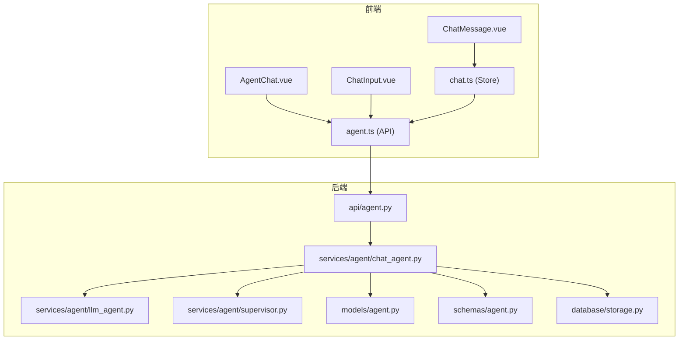
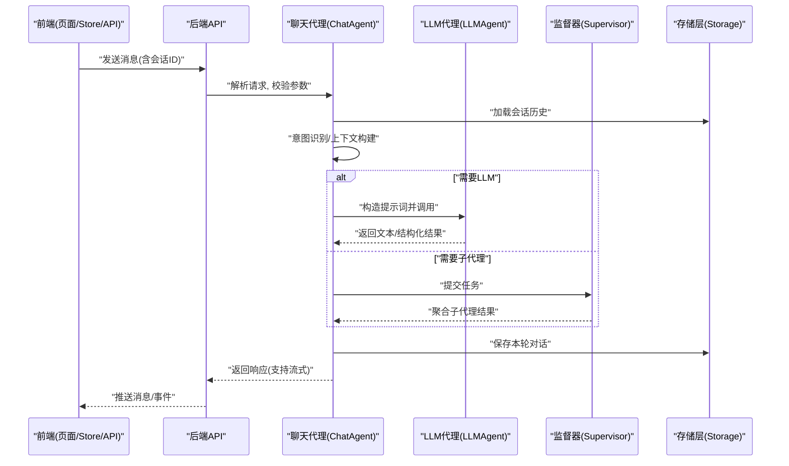
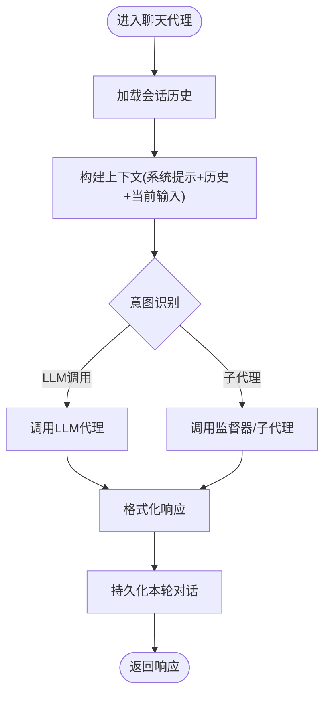
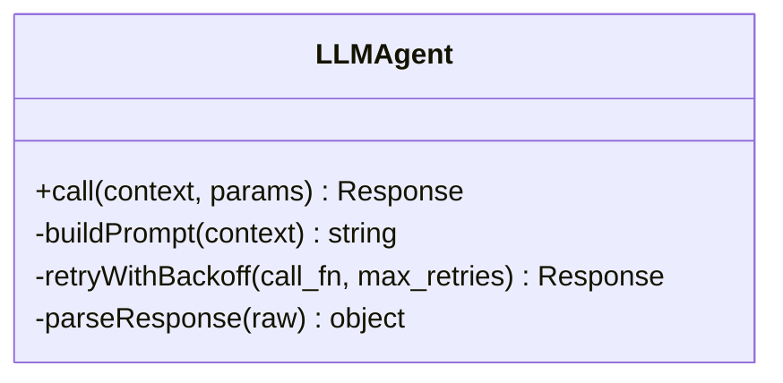
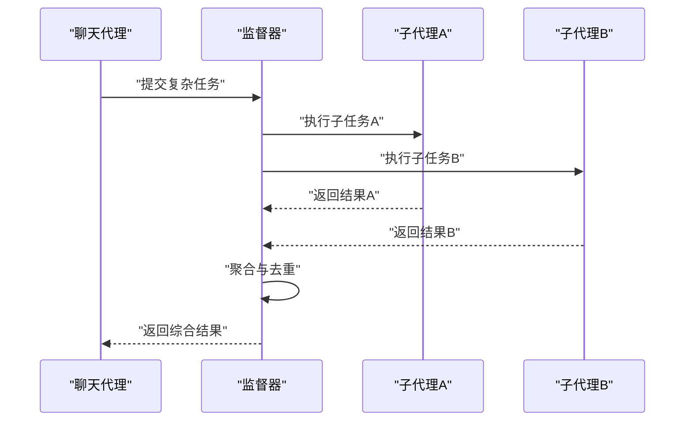
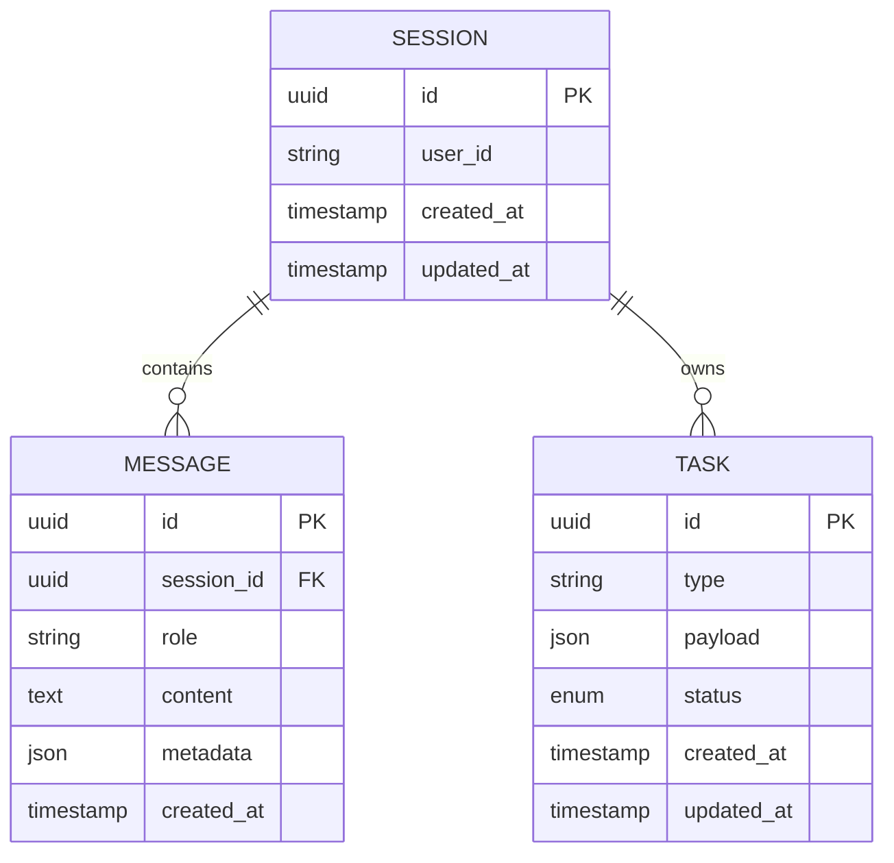
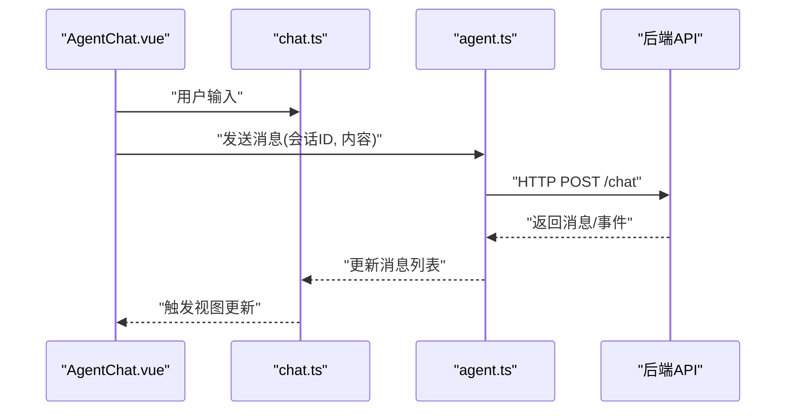
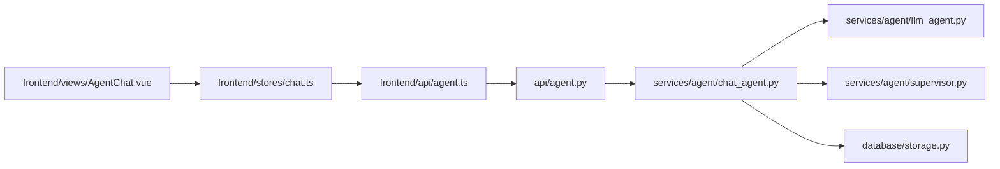

# 聊天Agent

<cite>
**本文引用的文件**   
- [backend/app/api/agent.py](file://backend/app/api/agent.py)
- [backend/app/services/agent/chat_agent.py](file://backend/app/services/agent/chat_agent.py)
- [backend/app/services/agent/llm_agent.py](file://backend/app/services/agent/llm_agent.py)
- [backend/app/services/agent/supervisor.py](file://backend/app/services/agent/supervisor.py)
- [backend/app/models/agent.py](file://backend/app/models/agent.py)
- [backend/app/schemas/agent.py](file://backend/app/schemas/agent.py)
- [backend/app/database/storage.py](file://backend/app/database/storage.py)
- [frontend/src/api/agent.ts](file://frontend/src/api/agent.ts)
- [frontend/src/stores/chat.ts](file://frontend/src/stores/chat.ts)
- [frontend/src/views/AgentChat.vue](file://frontend/src/views/AgentChat.vue)
- [frontend/src/components/chat/ChatInput.vue](file://frontend/src/components/chat/ChatInput.vue)
- [frontend/src/components/chat/ChatMessage.vue](file://frontend/src/components/chat/ChatMessage.vue)
</cite>

## 目录
1. [简介](#简介)
2. [项目结构](#项目结构)
3. [核心组件](#核心组件)
4. [架构总览](#架构总览)
5. [详细组件分析](#详细组件分析)
6. [依赖关系分析](#依赖关系分析)
7. [性能考虑](#性能考虑)
8. [故障排查指南](#故障排查指南)
9. [结论](#结论)
10. [附录](#附录)

## 简介
本文件为“聊天Agent”的完整技术文档，聚焦于自然语言处理能力与对话管理逻辑，包括用户意图识别、上下文维护、多轮对话状态管理；详细说明与LLM服务的集成方式、提示词工程策略、响应生成机制；并覆盖对话历史存储、会话隔离、并发处理等技术实现。同时提供前后端API调用示例与错误处理方案，帮助开发者快速理解与扩展该能力。

## 项目结构
聊天Agent在前后端均有实现：
- 后端（FastAPI）
  - API层：暴露聊天接口，负责鉴权、参数校验、路由分发
  - 服务层：包含聊天代理、LLM代理、监督器（Supervisor）等
  - 数据模型与Schema：定义消息、会话、任务等数据结构
  - 存储层：持久化对话历史与会话元信息
- 前端（Vue + TypeScript）
  - 页面与组件：聊天界面、输入框、消息渲染、确认对话框
  - Store：本地会话状态与消息缓存
  - API客户端：封装HTTP请求与错误处理

图表来源
- [backend/app/api/agent.py](file://backend/app/api/agent.py)
- [backend/app/services/agent/chat_agent.py](file://backend/app/services/agent/chat_agent.py)
- [backend/app/services/agent/llm_agent.py](file://backend/app/services/agent/llm_agent.py)
- [backend/app/services/agent/supervisor.py](file://backend/app/services/agent/supervisor.py)
- [backend/app/models/agent.py](file://backend/app/models/agent.py)
- [backend/app/schemas/agent.py](file://backend/app/schemas/agent.py)
- [backend/app/database/storage.py](file://backend/app/database/storage.py)
- [frontend/src/views/AgentChat.vue](file://frontend/src/views/AgentChat.vue)
- [frontend/src/components/chat/ChatInput.vue](file://frontend/src/components/chat/ChatInput.vue)
- [frontend/src/components/chat/ChatMessage.vue](file://frontend/src/components/chat/ChatMessage.vue)
- [frontend/src/stores/chat.ts](file://frontend/src/stores/chat.ts)
- [frontend/src/api/agent.ts](file://frontend/src/api/agent.ts)

章节来源
- [backend/app/api/agent.py](file://backend/app/api/agent.py)
- [backend/app/services/agent/chat_agent.py](file://backend/app/services/agent/chat_agent.py)
- [backend/app/services/agent/llm_agent.py](file://backend/app/services/agent/llm_agent.py)
- [backend/app/services/agent/supervisor.py](file://backend/app/services/agent/supervisor.py)
- [backend/app/models/agent.py](file://backend/app/models/agent.py)
- [backend/app/schemas/agent.py](file://backend/app/schemas/agent.py)
- [backend/app/database/storage.py](file://backend/app/database/storage.py)
- [frontend/src/views/AgentChat.vue](file://frontend/src/views/AgentChat.vue)
- [frontend/src/components/chat/ChatInput.vue](file://frontend/src/components/chat/ChatInput.vue)
- [frontend/src/components/chat/ChatMessage.vue](file://frontend/src/components/chat/ChatMessage.vue)
- [frontend/src/stores/chat.ts](file://frontend/src/stores/chat.ts)
- [frontend/src/api/agent.ts](file://frontend/src/api/agent.ts)

## 核心组件
- 聊天代理（ChatAgent）
  - 职责：编排对话流程、意图识别、上下文构建、调用LLM或子代理、结果格式化与返回
  - 关键能力：多轮对话状态管理、工具调用协调、流式输出支持
- LLM代理（LLMAgent）
  - 职责：封装与外部LLM服务的交互，统一提示词构造、参数配置、重试与超时控制
- 监督器（Supervisor）
  - 职责：复杂任务的分解与调度，协调多个子代理协同完成目标
- 数据模型与Schema
  - 消息、会话、任务等结构化定义，确保前后端一致性与可验证性
- 存储层
  - 对话历史与会话元信息的持久化，支持按会话隔离与检索
- 前端聊天模块
  - 页面与组件负责UI交互，Store维护本地状态，API客户端封装请求与错误处理

章节来源
- [backend/app/services/agent/chat_agent.py](file://backend/app/services/agent/chat_agent.py)
- [backend/app/services/agent/llm_agent.py](file://backend/app/services/agent/llm_agent.py)
- [backend/app/services/agent/supervisor.py](file://backend/app/services/agent/supervisor.py)
- [backend/app/models/agent.py](file://backend/app/models/agent.py)
- [backend/app/schemas/agent.py](file://backend/app/schemas/agent.py)
- [backend/app/database/storage.py](file://backend/app/database/storage.py)
- [frontend/src/stores/chat.ts](file://frontend/src/stores/chat.ts)
- [frontend/src/api/agent.ts](file://frontend/src/api/agent.ts)

## 架构总览
聊天Agent采用分层架构：前端通过REST/SSE接口与后端交互；后端API层进行鉴权与参数校验后交由聊天代理处理；聊天代理根据意图选择LLM或子代理，必要时由监督器协调；最终结果经存储层持久化并返回前端。

图表来源
- [backend/app/api/agent.py](file://backend/app/api/agent.py)
- [backend/app/services/agent/chat_agent.py](file://backend/app/services/agent/chat_agent.py)
- [backend/app/services/agent/llm_agent.py](file://backend/app/services/agent/llm_agent.py)
- [backend/app/services/agent/supervisor.py](file://backend/app/services/agent/supervisor.py)
- [backend/app/database/storage.py](file://backend/app/database/storage.py)

## 详细组件分析

### 聊天代理（ChatAgent）
- 设计要点
  - 意图识别：基于规则与轻量分类，将用户输入映射到具体动作（如查询、生成、确认）
  - 上下文维护：从存储层加载会话历史，结合系统提示词与当前输入构建上下文
  - 多轮状态管理：维护会话ID、消息列表、状态标志（如等待确认）、工具调用结果
  - 流式输出：优先使用SSE或分块响应提升用户体验
- 关键流程
  - 接收消息 -> 加载历史 -> 意图识别 -> 选择执行路径（LLM/子代理） -> 生成响应 -> 持久化 -> 返回

图表来源
- [backend/app/services/agent/chat_agent.py](file://backend/app/services/agent/chat_agent.py)
- [backend/app/database/storage.py](file://backend/app/database/storage.py)

章节来源
- [backend/app/services/agent/chat_agent.py](file://backend/app/services/agent/chat_agent.py)

### LLM代理（LLMAgent）
- 设计要点
  - 统一封装：对外暴露一致的调用接口，屏蔽不同LLM提供商差异
  - 提示词工程：动态组装系统提示词、用户提示词、上下文片段与工具描述
  - 健壮性：重试、超时、降级策略，保障稳定性
- 关键流程
  - 接收上下文 -> 构造提示词 -> 调用LLM -> 解析响应 -> 返回结构化结果

图表来源
- [backend/app/services/agent/llm_agent.py](file://backend/app/services/agent/llm_agent.py)

章节来源
- [backend/app/services/agent/llm_agent.py](file://backend/app/services/agent/llm_agent.py)

### 监督器（Supervisor）
- 设计要点
  - 任务分解：将复杂问题拆分为子任务，分配给相应子代理
  - 结果聚合：汇总子代理输出，去重、排序、合并
  - 容错：子代理失败时的回退与重试
- 关键流程
  - 接收任务 -> 规划子任务 -> 并行/串行执行 -> 聚合结果 -> 返回

图表来源
- [backend/app/services/agent/supervisor.py](file://backend/app/services/agent/supervisor.py)

章节来源
- [backend/app/services/agent/supervisor.py](file://backend/app/services/agent/supervisor.py)

### 数据模型与Schema
- 模型（Models）
  - 定义消息、会话、任务等实体字段与约束
- Schema（Pydantic）
  - 用于请求/响应校验与序列化，保证前后端一致性

图表来源
- [backend/app/models/agent.py](file://backend/app/models/agent.py)
- [backend/app/schemas/agent.py](file://backend/app/schemas/agent.py)

章节来源
- [backend/app/models/agent.py](file://backend/app/models/agent.py)
- [backend/app/schemas/agent.py](file://backend/app/schemas/agent.py)

### 存储层（Storage）
- 职责
  - 会话隔离：以会话ID为键组织数据
  - 持久化：保存消息历史、任务状态、元信息
  - 检索：按会话、时间范围、角色过滤消息
- 关键点
  - 事务与一致性：写入消息与更新会话时间戳需原子操作
  - 索引优化：对会话ID、创建时间建立索引以提升查询性能

章节来源
- [backend/app/database/storage.py](file://backend/app/database/storage.py)

### 前端聊天模块
- 页面与组件
  - AgentChat.vue：主聊天页面，管理消息列表与滚动
  - ChatInput.vue：输入框，触发发送与清空
  - ChatMessage.vue：消息渲染，区分用户/助手消息
- Store（chat.ts）
  - 维护当前会话ID、消息数组、加载状态、错误信息
- API客户端（agent.ts）
  - 封装POST/GET/SSE调用，统一错误处理与重试

图表来源
- [frontend/src/views/AgentChat.vue](file://frontend/src/views/AgentChat.vue)
- [frontend/src/stores/chat.ts](file://frontend/src/stores/chat.ts)
- [frontend/src/api/agent.ts](file://frontend/src/api/agent.ts)

章节来源
- [frontend/src/views/AgentChat.vue](file://frontend/src/views/AgentChat.vue)
- [frontend/src/stores/chat.ts](file://frontend/src/stores/chat.ts)
- [frontend/src/components/chat/ChatInput.vue](file://frontend/src/components/chat/ChatInput.vue)
- [frontend/src/components/chat/ChatMessage.vue](file://frontend/src/components/chat/ChatMessage.vue)
- [frontend/src/api/agent.ts](file://frontend/src/api/agent.ts)

## 依赖关系分析
- 组件耦合
  - API层依赖聊天代理与Schema校验
  - 聊天代理依赖LLM代理、监督器与存储层
  - 前端依赖API客户端与Store
- 外部依赖
  - LLM服务（HTTP/SDK）
  - 数据库/对象存储（持久化）
- 潜在循环依赖
  - 避免聊天代理直接依赖API层，保持单向依赖

图表来源
- [backend/app/api/agent.py](file://backend/app/api/agent.py)
- [backend/app/services/agent/chat_agent.py](file://backend/app/services/agent/chat_agent.py)
- [backend/app/services/agent/llm_agent.py](file://backend/app/services/agent/llm_agent.py)
- [backend/app/services/agent/supervisor.py](file://backend/app/services/agent/supervisor.py)
- [backend/app/database/storage.py](file://backend/app/database/storage.py)
- [frontend/src/api/agent.ts](file://frontend/src/api/agent.ts)
- [frontend/src/stores/chat.ts](file://frontend/src/stores/chat.ts)
- [frontend/src/views/AgentChat.vue](file://frontend/src/views/AgentChat.vue)

章节来源
- [backend/app/api/agent.py](file://backend/app/api/agent.py)
- [backend/app/services/agent/chat_agent.py](file://backend/app/services/agent/chat_agent.py)
- [backend/app/services/agent/llm_agent.py](file://backend/app/services/agent/llm_agent.py)
- [backend/app/services/agent/supervisor.py](file://backend/app/services/agent/supervisor.py)
- [backend/app/database/storage.py](file://backend/app/database/storage.py)
- [frontend/src/api/agent.ts](file://frontend/src/api/agent.ts)
- [frontend/src/stores/chat.ts](file://frontend/src/stores/chat.ts)
- [frontend/src/views/AgentChat.vue](file://frontend/src/views/AgentChat.vue)

## 性能考虑
- 流式响应：优先使用SSE或分块传输，降低首字节延迟
- 上下文裁剪：限制历史消息数量与长度，避免提示词过大导致成本与时延上升
- 并发与限流：对LLM调用进行并发控制与速率限制，防止过载
- 缓存与复用：对常见查询结果进行短期缓存，减少重复计算
- 异步处理：长耗时任务放入后台队列，避免阻塞请求线程

[本节为通用指导，不直接分析具体文件]

## 故障排查指南
- 常见问题
  - 会话丢失：检查会话ID是否正确传递与持久化
  - 意图识别错误：调整规则或分类阈值，增加样本
  - LLM调用失败：查看重试与超时配置，检查网络与密钥
  - 前端无响应：确认SSE连接是否建立，检查浏览器兼容性
- 定位步骤
  - 查看后端日志与异常堆栈
  - 检查存储层写入是否成功
  - 复现最小用例，逐步缩小范围

章节来源
- [backend/app/api/agent.py](file://backend/app/api/agent.py)
- [backend/app/services/agent/chat_agent.py](file://backend/app/services/agent/chat_agent.py)
- [backend/app/services/agent/llm_agent.py](file://backend/app/services/agent/llm_agent.py)
- [backend/app/database/storage.py](file://backend/app/database/storage.py)
- [frontend/src/api/agent.ts](file://frontend/src/api/agent.ts)

## 结论
聊天Agent通过清晰的层次划分与模块化设计，实现了意图识别、上下文维护、多轮对话管理与LLM集成。配合完善的存储与前端状态管理，能够提供稳定且可扩展的对话体验。建议在生产环境中加强监控、限流与错误恢复策略，持续优化提示词与上下文策略以提升效果与成本效率。

[本节为总结，不直接分析具体文件]

## 附录

### API调用示例（概念说明）
- 发送消息
  - 方法：POST
  - 路径：/api/chat
  - 请求体：包含会话ID、消息内容、可选参数（如温度、最大令牌数）
  - 响应：消息对象或流式事件
- 获取会话历史
  - 方法：GET
  - 路径：/api/chat/history
  - 查询参数：会话ID、分页参数
  - 响应：消息列表
- 错误码
  - 400：参数校验失败
  - 401：未授权
  - 404：会话不存在
  - 500：服务器内部错误
  - 503：服务不可用（LLM或下游服务）

[本节为概念性说明，不直接分析具体文件]

### 提示词工程策略（概念说明）
- 系统提示词：明确角色、能力边界、输出格式与安全约束
- 用户提示词：结合上下文与工具描述，提供清晰指令
- 上下文片段：仅保留相关历史，避免冗余
- 结构化输出：要求JSON或固定模板，便于前端解析与展示

[本节为概念性说明，不直接分析具体文件]