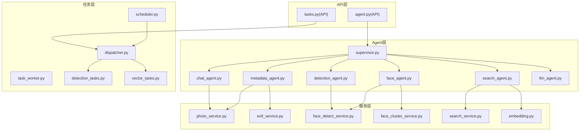
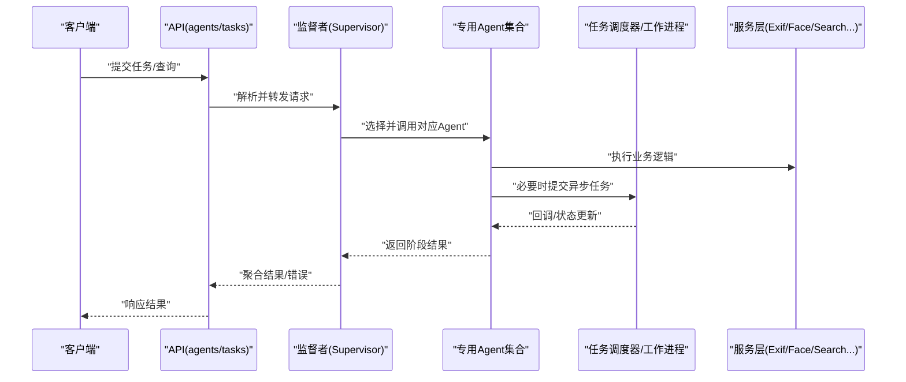
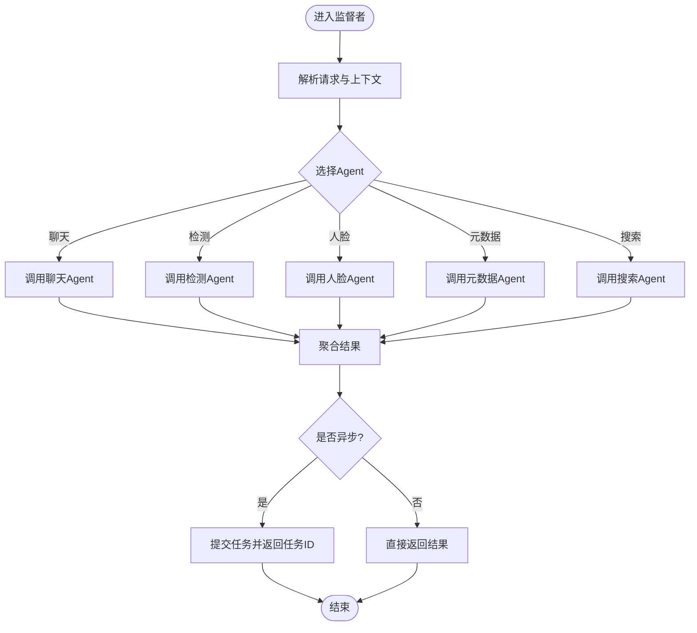
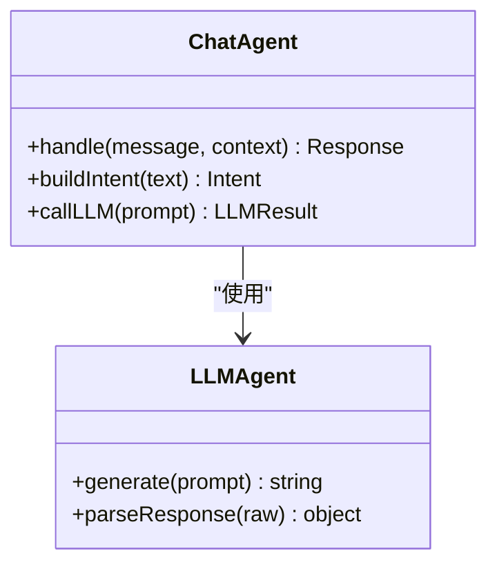
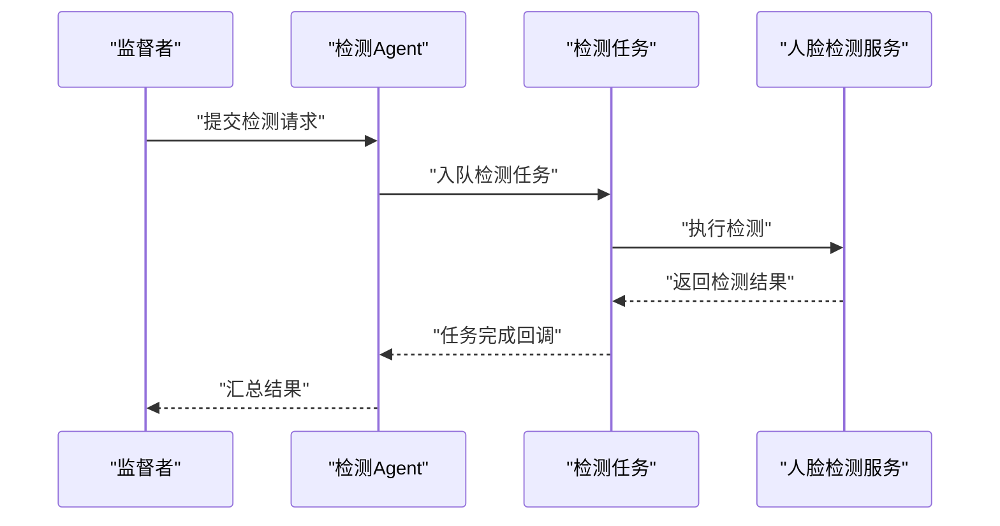
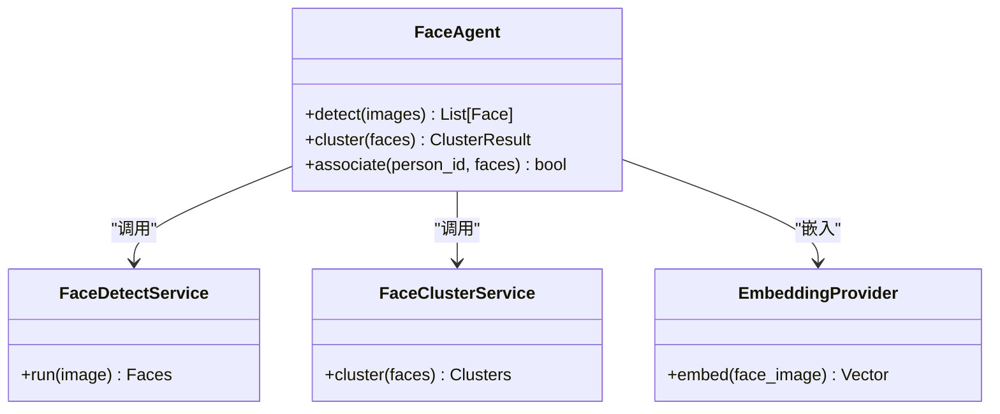
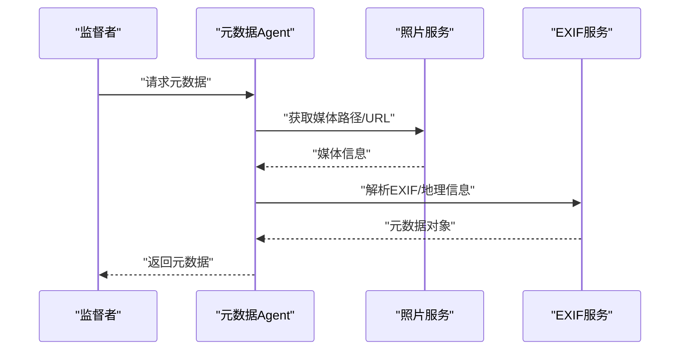
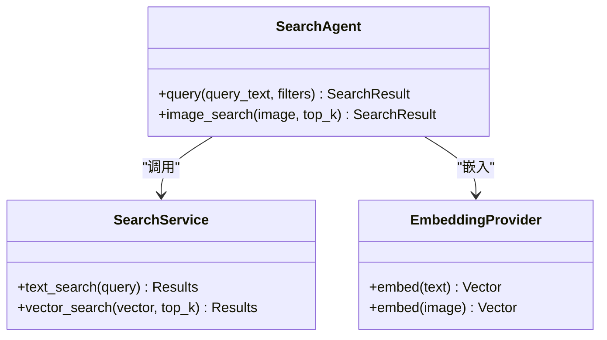
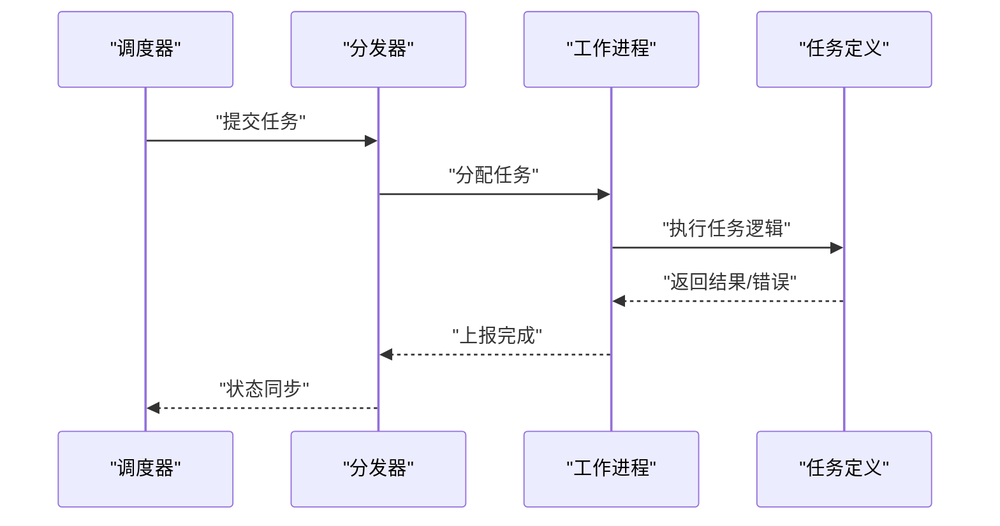
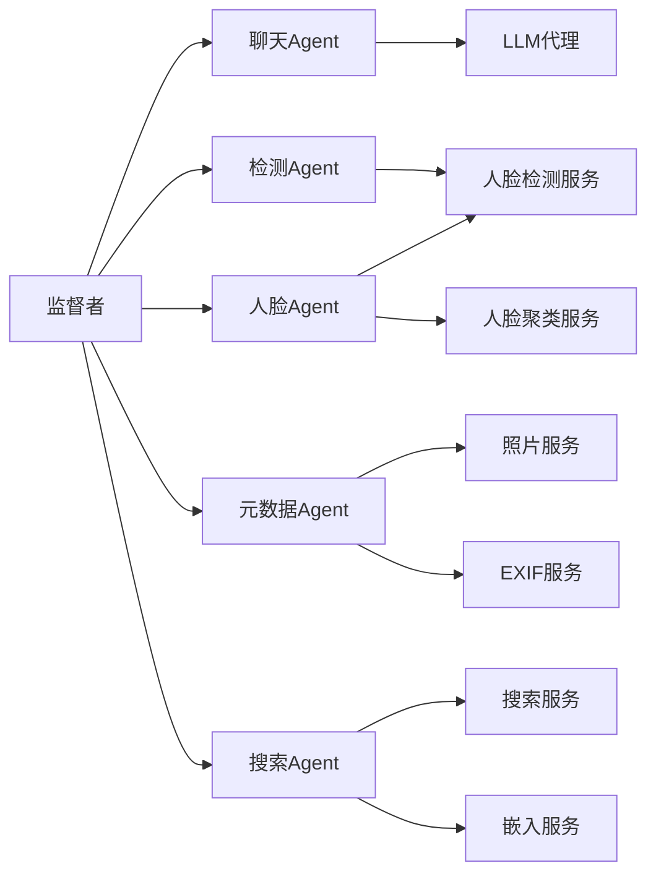

# 多Agent协作架构

<cite>
**本文引用的文件**   
- [supervisor.py](file://backend/app/services/agent/supervisor.py)
- [chat_agent.py](file://backend/app/services/agent/chat_agent.py)
- [detection_agent.py](file://backend/app/services/agent/detection_agent.py)
- [face_agent.py](file://backend/app/services/agent/face_agent.py)
- [metadata_agent.py](file://backend/app/services/agent/metadata_agent.py)
- [search_agent.py](file://backend/app/services/agent/search_agent.py)
- [llm_agent.py](file://backend/app/services/agent/llm_agent.py)
- [dispatcher.py](file://backend/app/tasks/dispatcher.py)
- [task_worker.py](file://backend/app/tasks/task_worker.py)
- [scheduler.py](file://backend/app/tasks/scheduler.py)
- [detection_tasks.py](file://backend/app/tasks/detection_tasks.py)
- [vector_tasks.py](file://backend/app/tasks/vector_tasks.py)
- [agent.py](file://backend/app/models/agent.py)
- [agent.py](file://backend/app/api/agent.py)
- [agent.py](file://backend/app/schemas/agent.py)
- [tasks.py](file://backend/app/api/tasks.py)
- [photo_service.py](file://backend/app/services/photo_service.py)
- [exif_service.py](file://backend/app/services/exif_service.py)
- [face_detect_service.py](file://backend/app/services/face_detect_service.py)
- [face_cluster_service.py](file://backend/app/services/face_cluster_service.py)
- [search_service.py](file://backend/app/services/search_service.py)
- [embedding.py](file://backend/app/services/ai_providers/embedding.py)
</cite>

## 目录
1. [简介](#简介)
2. [项目结构](#项目结构)
3. [核心组件](#核心组件)
4. [架构总览](#架构总览)
5. [详细组件分析](#详细组件分析)
6. [依赖关系分析](#依赖关系分析)
7. [性能考虑](#性能考虑)
8. [故障排查指南](#故障排查指南)
9. [结论](#结论)
10. [附录：扩展与自定义Agent开发指南](#附录扩展与自定义agent开发指南)

## 简介
本仓库实现了一个面向照片/媒体管理的多Agent协作系统。其核心思想是“监督者模式”：由一个监督者（Supervisor）统一接收任务、解析意图、编排专用Agent执行，并通过任务调度器与后台工作进程完成异步处理与状态同步。系统包含聊天Agent、检测Agent、人脸Agent、搜索Agent、元数据Agent等，分别负责对话理解、通用目标检测、人脸检测与聚类、语义/向量检索、EXIF/地理信息抽取等能力。

## 项目结构
后端采用分层组织：API层暴露REST接口；服务层封装业务逻辑；Agent层提供可插拔的专用智能体；任务层提供异步调度与工作进程；模型与Schema定义数据契约。

图表来源
- [agent.py](file://backend/app/api/agent.py)
- [tasks.py](file://backend/app/api/tasks.py)
- [supervisor.py](file://backend/app/services/agent/supervisor.py)
- [chat_agent.py](file://backend/app/services/agent/chat_agent.py)
- [detection_agent.py](file://backend/app/services/agent/detection_agent.py)
- [face_agent.py](file://backend/app/services/agent/face_agent.py)
- [metadata_agent.py](file://backend/app/services/agent/metadata_agent.py)
- [search_agent.py](file://backend/app/services/agent/search_agent.py)
- [llm_agent.py](file://backend/app/services/agent/llm_agent.py)
- [dispatcher.py](file://backend/app/tasks/dispatcher.py)
- [task_worker.py](file://backend/app/tasks/task_worker.py)
- [scheduler.py](file://backend/app/tasks/scheduler.py)
- [detection_tasks.py](file://backend/app/tasks/detection_tasks.py)
- [vector_tasks.py](file://backend/app/tasks/vector_tasks.py)
- [photo_service.py](file://backend/app/services/photo_service.py)
- [exif_service.py](file://backend/app/services/exif_service.py)
- [face_detect_service.py](file://backend/app/services/face_detect_service.py)
- [face_cluster_service.py](file://backend/app/services/face_cluster_service.py)
- [search_service.py](file://backend/app/services/search_service.py)
- [embedding.py](file://backend/app/services/ai_providers/embedding.py)

章节来源
- [agent.py](file://backend/app/api/agent.py)
- [tasks.py](file://backend/app/api/tasks.py)
- [supervisor.py](file://backend/app/services/agent/supervisor.py)
- [dispatcher.py](file://backend/app/tasks/dispatcher.py)
- [task_worker.py](file://backend/app/tasks/task_worker.py)
- [scheduler.py](file://backend/app/tasks/scheduler.py)

## 核心组件
- 监督者（Supervisor）
  - 职责：统一入口、意图识别、路由到具体Agent、编排并行/串行流程、聚合结果、错误收敛与重试。
  - 关键行为：解析请求上下文、选择Agent组合、调用任务调度器进行异步执行、维护任务状态。
- 聊天Agent（Chat Agent）
  - 职责：自然语言理解与对话管理，结合LLM生成指令或摘要，驱动其他Agent协同。
- 检测Agent（Detection Agent）
  - 职责：通用目标检测任务编排，触发检测任务并汇总检测结果。
- 人脸Agent（Face Agent）
  - 职责：人脸检测、对齐、特征提取、聚类与关联，支撑按人检索与相册组织。
- 元数据Agent（Metadata Agent）
  - 职责：读取EXIF、地理位置、时间线信息，丰富媒体描述与索引。
- 搜索Agent（Search Agent）
  - 职责：文本/图像语义检索，调用嵌入服务与检索服务，返回相关结果。
- LLM代理（LLM Agent）
  - 职责：对外部大模型服务的抽象封装，供聊天Agent与其他需要推理能力的Agent复用。

章节来源
- [supervisor.py](file://backend/app/services/agent/supervisor.py)
- [chat_agent.py](file://backend/app/services/agent/chat_agent.py)
- [detection_agent.py](file://backend/app/services/agent/detection_agent.py)
- [face_agent.py](file://backend/app/services/agent/face_agent.py)
- [metadata_agent.py](file://backend/app/services/agent/metadata_agent.py)
- [search_agent.py](file://backend/app/services/agent/search_agent.py)
- [llm_agent.py](file://backend/app/services/agent/llm_agent.py)

## 架构总览
整体采用“API -> 监督者 -> 专用Agent -> 服务层/任务层”的分层架构。用户通过API发起请求，监督者解析意图并分发至相应Agent；涉及耗时操作的任务交由任务调度器与后台工作进程执行，最终通过状态查询接口获取结果。

图表来源
- [agent.py](file://backend/app/api/agent.py)
- [tasks.py](file://backend/app/api/tasks.py)
- [supervisor.py](file://backend/app/services/agent/supervisor.py)
- [dispatcher.py](file://backend/app/tasks/dispatcher.py)
- [task_worker.py](file://backend/app/tasks/task_worker.py)
- [detection_tasks.py](file://backend/app/tasks/detection_tasks.py)
- [vector_tasks.py](file://backend/app/tasks/vector_tasks.py)

## 详细组件分析

### 监督者（Supervisor）
- 设计要点
  - 集中式编排：作为单一入口，屏蔽下游Agent差异。
  - 意图路由：根据输入类型（文本/图片/混合）与动作（检测/人脸/检索/元数据）选择Agent组合。
  - 并发控制：对独立子任务进行并行编排，合并结果。
  - 错误收敛：捕获各Agent异常，转换为统一错误格式，支持重试策略。
- 典型流程
  - 接收请求 -> 校验参数 -> 选择Agent -> 调用Agent -> 收集结果 -> 返回响应。
- 与任务层的交互
  - 对于耗时任务，监督者将任务提交给调度器，返回任务ID供后续查询。

图表来源
- [supervisor.py](file://backend/app/services/agent/supervisor.py)
- [dispatcher.py](file://backend/app/tasks/dispatcher.py)

章节来源
- [supervisor.py](file://backend/app/services/agent/supervisor.py)
- [dispatcher.py](file://backend/app/tasks/dispatcher.py)

### 聊天Agent（Chat Agent）
- 职责
  - 对话管理与意图识别，结合LLM生成结构化指令，驱动其他Agent。
  - 维护会话上下文，支持多轮对话与澄清问题。
- 依赖
  - LLM代理用于生成与理解；可能调用搜索/元数据等服务以增强回答质量。
- 交互
  - 从监督者接收消息，返回对话回复或下一步行动建议。

图表来源
- [chat_agent.py](file://backend/app/services/agent/chat_agent.py)
- [llm_agent.py](file://backend/app/services/agent/llm_agent.py)

章节来源
- [chat_agent.py](file://backend/app/services/agent/chat_agent.py)
- [llm_agent.py](file://backend/app/services/agent/llm_agent.py)

### 检测Agent（Detection Agent）
- 职责
  - 编排通用目标检测任务，批量处理图片，汇总检测结果。
- 依赖
  - 人脸检测服务、检测任务队列。
- 交互
  - 从监督者接收待检测资源列表，提交检测任务，等待结果聚合。

图表来源
- [detection_agent.py](file://backend/app/services/agent/detection_agent.py)
- [detection_tasks.py](file://backend/app/tasks/detection_tasks.py)
- [face_detect_service.py](file://backend/app/services/face_detect_service.py)

章节来源
- [detection_agent.py](file://backend/app/services/agent/detection_agent.py)
- [detection_tasks.py](file://backend/app/tasks/detection_tasks.py)
- [face_detect_service.py](file://backend/app/services/face_detect_service.py)

### 人脸Agent（Face Agent）
- 职责
  - 人脸检测、特征提取、聚类与关联，支撑按人检索与相册组织。
- 依赖
  - 人脸检测服务、人脸聚类服务、向量嵌入服务。
- 交互
  - 从监督者接收人脸相关请求，协调检测与聚类流程，返回人脸实体与分组结果。

图表来源
- [face_agent.py](file://backend/app/services/agent/face_agent.py)
- [face_detect_service.py](file://backend/app/services/face_detect_service.py)
- [face_cluster_service.py](file://backend/app/services/face_cluster_service.py)
- [embedding.py](file://backend/app/services/ai_providers/embedding.py)

章节来源
- [face_agent.py](file://backend/app/services/agent/face_agent.py)
- [face_detect_service.py](file://backend/app/services/face_detect_service.py)
- [face_cluster_service.py](file://backend/app/services/face_cluster_service.py)
- [embedding.py](file://backend/app/services/ai_providers/embedding.py)

### 元数据Agent（Metadata Agent）
- 职责
  - 读取EXIF、地理位置、时间戳等信息，丰富媒体描述与索引。
- 依赖
  - 照片服务、EXIF服务。
- 交互
  - 从监督者接收媒体ID列表，批量提取元数据并返回结构化结果。

图表来源
- [metadata_agent.py](file://backend/app/services/agent/metadata_agent.py)
- [photo_service.py](file://backend/app/services/photo_service.py)
- [exif_service.py](file://backend/app/services/exif_service.py)

章节来源
- [metadata_agent.py](file://backend/app/services/agent/metadata_agent.py)
- [photo_service.py](file://backend/app/services/photo_service.py)
- [exif_service.py](file://backend/app/services/exif_service.py)

### 搜索Agent（Search Agent）
- 职责
  - 文本/图像语义检索，调用嵌入服务与检索服务，返回相关结果。
- 依赖
  - 搜索服务、嵌入提供者。
- 交互
  - 从监督者接收查询条件，构建向量或关键词，执行检索并返回排序结果。

图表来源
- [search_agent.py](file://backend/app/services/agent/search_agent.py)
- [search_service.py](file://backend/app/services/search_service.py)
- [embedding.py](file://backend/app/services/ai_providers/embedding.py)

章节来源
- [search_agent.py](file://backend/app/services/agent/search_agent.py)
- [search_service.py](file://backend/app/services/search_service.py)
- [embedding.py](file://backend/app/services/ai_providers/embedding.py)

### 任务调度与工作进程
- 调度器（Scheduler）
  - 定时或事件触发任务入队，管理任务生命周期。
- 分发器（Dispatcher）
  - 将任务分发给合适的工作进程，保证负载均衡与容错。
- 工作进程（Worker）
  - 执行具体任务（检测、向量化等），完成后回调更新状态。

图表来源
- [scheduler.py](file://backend/app/tasks/scheduler.py)
- [dispatcher.py](file://backend/app/tasks/dispatcher.py)
- [task_worker.py](file://backend/app/tasks/task_worker.py)
- [detection_tasks.py](file://backend/app/tasks/detection_tasks.py)
- [vector_tasks.py](file://backend/app/tasks/vector_tasks.py)

章节来源
- [scheduler.py](file://backend/app/tasks/scheduler.py)
- [dispatcher.py](file://backend/app/tasks/dispatcher.py)
- [task_worker.py](file://backend/app/tasks/task_worker.py)
- [detection_tasks.py](file://backend/app/tasks/detection_tasks.py)
- [vector_tasks.py](file://backend/app/tasks/vector_tasks.py)

## 依赖关系分析
- 组件耦合
  - 监督者与所有Agent松耦合，通过统一接口调用，便于扩展。
  - Agent与服务层解耦，服务层可替换实现（如不同嵌入提供商）。
  - 任务层与Agent解耦，通过任务定义与回调机制通信。
- 外部依赖
  - 嵌入服务、人脸检测服务、检索服务等为外部能力提供方。
- 潜在循环依赖
  - 当前分层清晰，未见明显循环依赖；新增Agent时应避免反向依赖上层。

图表来源
- [supervisor.py](file://backend/app/services/agent/supervisor.py)
- [chat_agent.py](file://backend/app/services/agent/chat_agent.py)
- [detection_agent.py](file://backend/app/services/agent/detection_agent.py)
- [face_agent.py](file://backend/app/services/agent/face_agent.py)
- [metadata_agent.py](file://backend/app/services/agent/metadata_agent.py)
- [search_agent.py](file://backend/app/services/agent/search_agent.py)
- [llm_agent.py](file://backend/app/services/agent/llm_agent.py)
- [face_detect_service.py](file://backend/app/services/face_detect_service.py)
- [face_cluster_service.py](file://backend/app/services/face_cluster_service.py)
- [photo_service.py](file://backend/app/services/photo_service.py)
- [exif_service.py](file://backend/app/services/exif_service.py)
- [search_service.py](file://backend/app/services/search_service.py)
- [embedding.py](file://backend/app/services/ai_providers/embedding.py)

章节来源
- [supervisor.py](file://backend/app/services/agent/supervisor.py)
- [chat_agent.py](file://backend/app/services/agent/chat_agent.py)
- [detection_agent.py](file://backend/app/services/agent/detection_agent.py)
- [face_agent.py](file://backend/app/services/agent/face_agent.py)
- [metadata_agent.py](file://backend/app/services/agent/metadata_agent.py)
- [search_agent.py](file://backend/app/services/agent/search_agent.py)
- [llm_agent.py](file://backend/app/services/agent/llm_agent.py)
- [face_detect_service.py](file://backend/app/services/face_detect_service.py)
- [face_cluster_service.py](file://backend/app/services/face_cluster_service.py)
- [photo_service.py](file://backend/app/services/photo_service.py)
- [exif_service.py](file://backend/app/services/exif_service.py)
- [search_service.py](file://backend/app/services/search_service.py)
- [embedding.py](file://backend/app/services/ai_providers/embedding.py)

## 性能考虑
- 并发与批处理
  - 对独立子任务并行执行，减少端到端延迟。
  - 批量处理图片与向量嵌入，提高吞吐。
- 缓存与去重
  - 对重复检测/嵌入结果进行缓存，避免重复计算。
- 异步与背压
  - 长耗时任务走异步通道，防止阻塞主线程。
- 资源隔离
  - 不同Agent/任务在不同进程或容器中运行，避免相互影响。

## 故障排查指南
- 常见问题定位
  - 任务未执行：检查调度器与工作进程状态、任务队列健康度。
  - 结果不一致：核对Agent输出格式与服务层返回字段。
  - 超时失败：调整任务超时阈值与重试次数。
- 日志与追踪
  - 在关键节点记录请求ID与步骤日志，便于链路追踪。
- 恢复策略
  - 自动重试与退避；失败任务转入死信队列人工复核。

章节来源
- [tasks.py](file://backend/app/api/tasks.py)
- [dispatcher.py](file://backend/app/tasks/dispatcher.py)
- [task_worker.py](file://backend/app/tasks/task_worker.py)

## 结论
该多Agent协作架构通过监督者统一编排、专用Agent各司其职、任务层异步执行，实现了高内聚低耦合的可扩展系统。聊天Agent作为入口提升易用性，检测/人脸/元数据/搜索Agent覆盖核心能力，配合任务调度与工作进程保障稳定性与性能。

## 附录：扩展与自定义Agent开发指南
- 开发步骤
  - 新建Agent类：实现标准接口（接收上下文、执行逻辑、返回结果）。
  - 注册到监督者：在路由表中添加新Agent映射。
  - 如需异步：定义任务并在任务层实现工作进程逻辑。
  - 编写测试：覆盖正常路径与异常路径。
- 通信协议与消息格式
  - 请求：包含任务类型、输入数据（文本/图片/ID）、可选参数。
  - 响应：包含状态码、数据体、错误信息与任务ID（异步时）。
  - 状态同步：通过任务ID查询任务状态与进度。
- 生命周期管理
  - 初始化：加载配置与模型。
  - 运行：处理请求，必要时提交任务。
  - 销毁：释放资源与连接。
- 错误处理与容错
  - 统一异常转换；重试与降级策略；失败告警。
- 示例参考
  - 参考现有Agent实现与任务定义，保持风格一致。

章节来源
- [agent.py](file://backend/app/models/agent.py)
- [agent.py](file://backend/app/api/agent.py)
- [agent.py](file://backend/app/schemas/agent.py)
- [supervisor.py](file://backend/app/services/agent/supervisor.py)
- [detection_tasks.py](file://backend/app/tasks/detection_tasks.py)
- [vector_tasks.py](file://backend/app/tasks/vector_tasks.py)