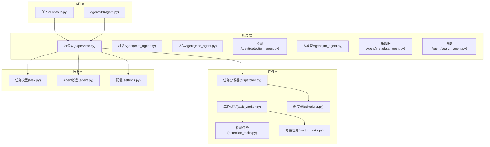
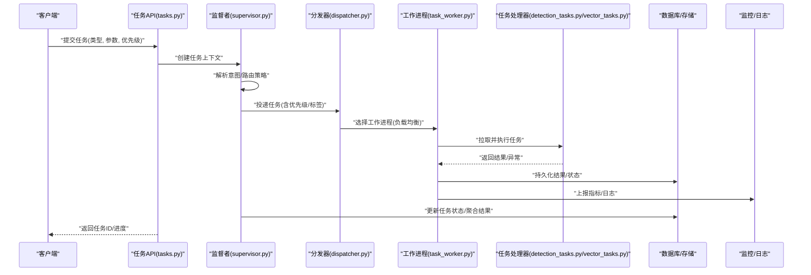
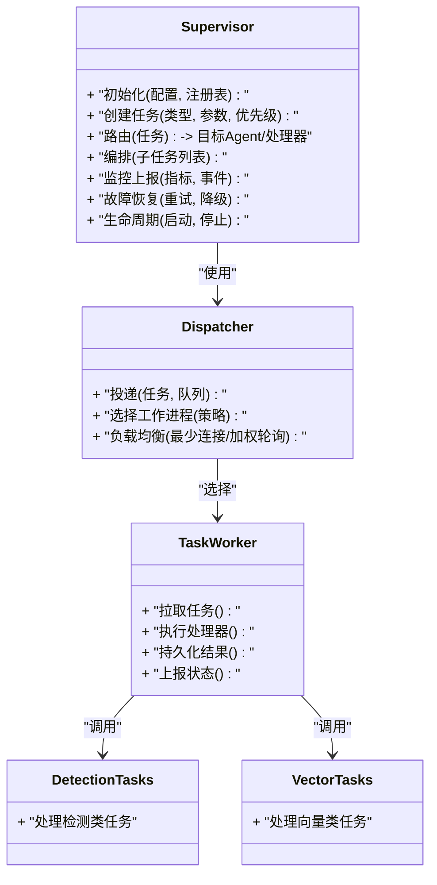
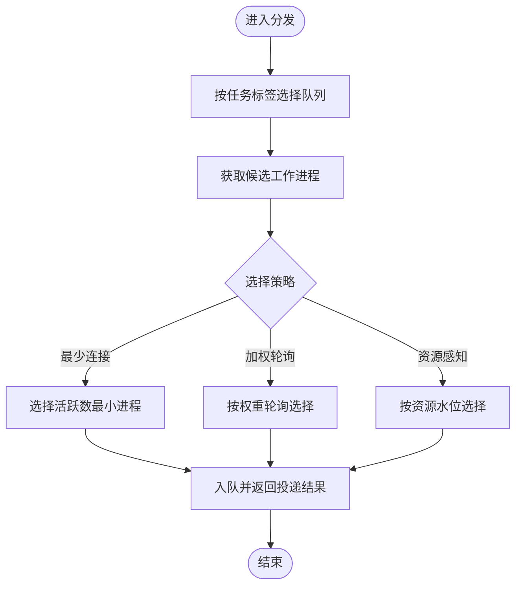
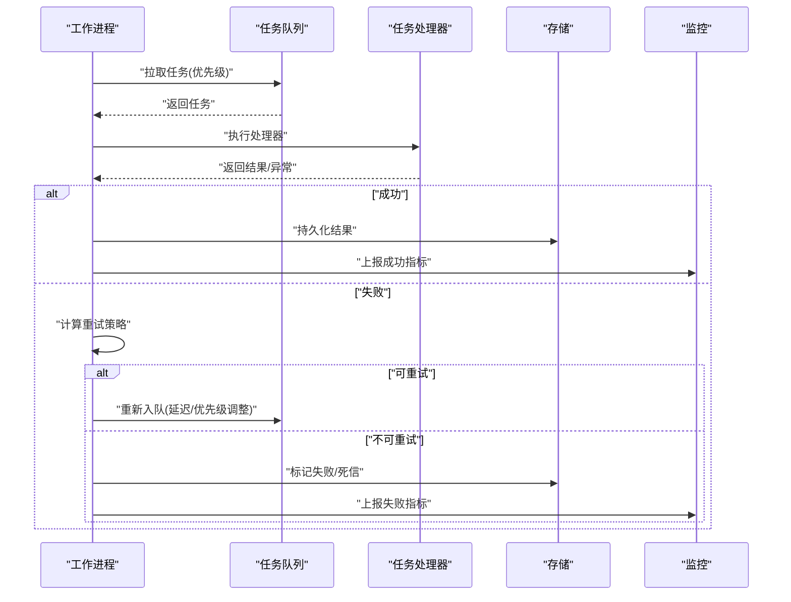
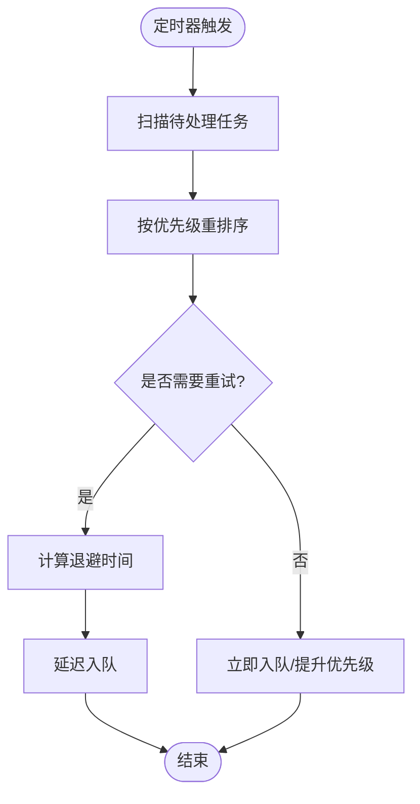
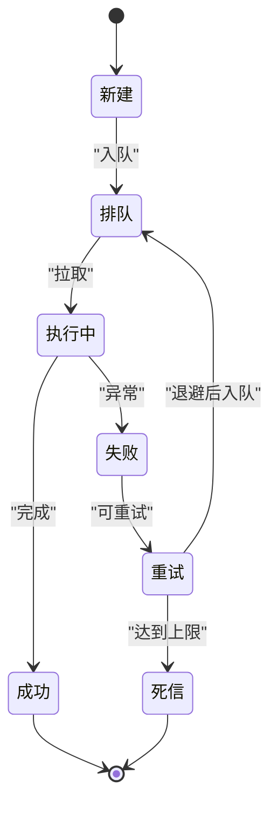
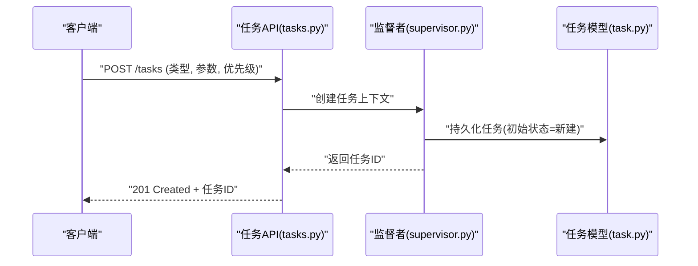
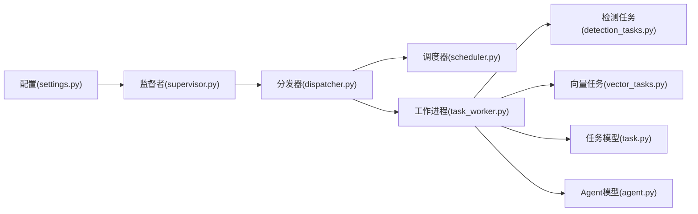

# 监督者模式设计

<cite>
**本文引用的文件**   
- [supervisor.py](file://backend/app/services/agent/supervisor.py)
- [dispatcher.py](file://backend/app/tasks/dispatcher.py)
- [task_worker.py](file://backend/app/tasks/task_worker.py)
- [scheduler.py](file://backend/app/tasks/scheduler.py)
- [detection_tasks.py](file://backend/app/tasks/detection_tasks.py)
- [vector_tasks.py](file://backend/app/tasks/vector_tasks.py)
- [agent.py](file://backend/app/models/agent.py)
- [task.py](file://backend/app/models/task.py)
- [tasks.py](file://backend/app/api/tasks.py)
- [agent.py](file://backend/app/api/agent.py)
- [settings.py](file://backend/app/config/settings.py)
</cite>

## 目录
1. [简介](#简介)
2. [项目结构](#项目结构)
3. [核心组件](#核心组件)
4. [架构总览](#架构总览)
5. [详细组件分析](#详细组件分析)
6. [依赖关系分析](#依赖关系分析)
7. [性能考虑](#性能考虑)
8. [故障排查指南](#故障排查指南)
9. [结论](#结论)
10. [附录](#附录)

## 简介
本文件围绕“监督者模式(Supervisor)”在AI相册多Agent架构中的设计与实现，系统性阐述以下主题：
- 任务分发策略、Agent协调机制与负载均衡算法
- 监督者的生命周期管理、状态监控与故障恢复
- 任务队列管理、优先级调度与工作线程池配置
- 扩展接口设计与自定义任务处理器实现指南
- 实际任务分发示例与性能优化建议

该文档旨在帮助开发者快速理解并扩展监督者能力，构建高可用、可扩展的多Agent系统。

## 项目结构
本项目采用分层与按功能域组织相结合的结构。与监督者模式相关的核心代码位于后端服务的“服务层”和“任务层”，以及API入口与数据模型中：
- 服务层：包含各Agent的具体实现与监督者编排逻辑
- 任务层：负责任务调度、分发、执行与结果回写
- API层：提供任务提交、查询与监控的HTTP接口
- 数据模型：定义Agent与Task等实体及其状态流转

图表来源
- [supervisor.py](file://backend/app/services/agent/supervisor.py)
- [dispatcher.py](file://backend/app/tasks/dispatcher.py)
- [task_worker.py](file://backend/app/tasks/task_worker.py)
- [scheduler.py](file://backend/app/tasks/scheduler.py)
- [detection_tasks.py](file://backend/app/tasks/detection_tasks.py)
- [vector_tasks.py](file://backend/app/tasks/vector_tasks.py)
- [agent.py](file://backend/app/models/agent.py)
- [task.py](file://backend/app/models/task.py)
- [tasks.py](file://backend/app/api/tasks.py)
- [agent.py](file://backend/app/api/agent.py)
- [settings.py](file://backend/app/config/settings.py)

章节来源
- [supervisor.py](file://backend/app/services/agent/supervisor.py)
- [dispatcher.py](file://backend/app/tasks/dispatcher.py)
- [task_worker.py](file://backend/app/tasks/task_worker.py)
- [scheduler.py](file://backend/app/tasks/scheduler.py)
- [detection_tasks.py](file://backend/app/tasks/detection_tasks.py)
- [vector_tasks.py](file://backend/app/tasks/vector_tasks.py)
- [agent.py](file://backend/app/models/agent.py)
- [task.py](file://backend/app/models/task.py)
- [tasks.py](file://backend/app/api/tasks.py)
- [agent.py](file://backend/app/api/agent.py)
- [settings.py](file://backend/app/config/settings.py)

## 核心组件
- 监督者(Supervisor)
  - 职责：接收高层任务请求，解析意图，编排子任务，选择目标Agent或任务类型，协调执行与结果聚合，维护生命周期与状态。
  - 关键能力：任务路由、优先级决策、并发控制、失败重试、熔断与降级、可观测性上报。
- 任务分发器(Dispatcher)
  - 职责：将任务投递到合适的队列或工作进程；实现负载均衡（如最少连接、加权轮询、资源感知）。
- 工作进程(Task Worker)
  - 职责：从队列拉取任务，加载对应处理器，执行任务，持久化结果，上报状态。
- 调度器(Scheduler)
  - 职责：周期性扫描待处理任务，按优先级与资源可用性进行再调度；支持延迟任务与退避重试。
- 具体任务处理器
  - 检测任务(Detection Tasks)：图像/视频检测相关处理。
  - 向量任务(Vector Tasks)：特征提取、索引更新、相似度检索准备。
- 数据模型
  - Agent模型：描述Agent能力、权重、健康度、容量限制等。
  - Task模型：描述任务类型、参数、优先级、状态机、重试次数、错误信息、时间戳等。
- API层
  - 任务API：提交任务、查询进度、获取结果、取消任务。
  - Agent API：注册/注销Agent、查看能力与负载、动态扩缩容。

章节来源
- [supervisor.py](file://backend/app/services/agent/supervisor.py)
- [dispatcher.py](file://backend/app/tasks/dispatcher.py)
- [task_worker.py](file://backend/app/tasks/task_worker.py)
- [scheduler.py](file://backend/app/tasks/scheduler.py)
- [detection_tasks.py](file://backend/app/tasks/detection_tasks.py)
- [vector_tasks.py](file://backend/app/tasks/vector_tasks.py)
- [agent.py](file://backend/app/models/agent.py)
- [task.py](file://backend/app/models/task.py)
- [tasks.py](file://backend/app/api/tasks.py)
- [agent.py](file://backend/app/api/agent.py)

## 架构总览
下图展示了从API到监督者、分发器、工作进程与任务处理器的端到端流程，以及状态回写与监控上报路径。

图表来源
- [tasks.py](file://backend/app/api/tasks.py)
- [supervisor.py](file://backend/app/services/agent/supervisor.py)
- [dispatcher.py](file://backend/app/tasks/dispatcher.py)
- [task_worker.py](file://backend/app/tasks/task_worker.py)
- [detection_tasks.py](file://backend/app/tasks/detection_tasks.py)
- [vector_tasks.py](file://backend/app/tasks/vector_tasks.py)
- [task.py](file://backend/app/models/task.py)

## 详细组件分析

### 监督者(Supervisor)组件分析
- 角色定位
  - 作为多Agent系统的“大脑”，负责将用户请求转化为可执行的子任务序列，选择合适的Agent或任务处理器，并在必要时进行并行编排与结果融合。
- 关键职责
  - 任务解析与路由：根据任务类型、输入特征与Agent能力表，决定目标Agent或任务类别。
  - 优先级与并发控制：结合全局优先级与资源配额，控制并发度与抢占策略。
  - 生命周期管理：启动时初始化Agent注册表、队列与监控；运行中持续健康检查；优雅关闭时完成收尾。
  - 状态监控与可观测性：记录关键指标（吞吐、延迟、错误率）、事件与追踪ID。
  - 故障恢复：对失败任务实施指数退避重试、死信队列与人工介入通道。
- 扩展点
  - 自定义路由策略：基于规则或学习模型的任务分类器。
  - 自定义负载均衡：资源感知、地域感知、成本感知的分配策略。
  - 自定义结果聚合器：针对复杂任务的归约与合并逻辑。

图表来源
- [supervisor.py](file://backend/app/services/agent/supervisor.py)
- [dispatcher.py](file://backend/app/tasks/dispatcher.py)
- [task_worker.py](file://backend/app/tasks/task_worker.py)
- [detection_tasks.py](file://backend/app/tasks/detection_tasks.py)
- [vector_tasks.py](file://backend/app/tasks/vector_tasks.py)

章节来源
- [supervisor.py](file://backend/app/services/agent/supervisor.py)
- [dispatcher.py](file://backend/app/tasks/dispatcher.py)
- [task_worker.py](file://backend/app/tasks/task_worker.py)
- [detection_tasks.py](file://backend/app/tasks/detection_tasks.py)
- [vector_tasks.py](file://backend/app/tasks/vector_tasks.py)

### 任务分发器(Dispatcher)与负载均衡
- 分发策略
  - 队列选择：按任务标签/类型选择专用队列，避免热点阻塞。
  - 工作进程选择：最少连接优先、加权轮询、资源感知（CPU/GPU/内存）与亲和性（同区域/同设备）。
- 负载均衡算法
  - 最少连接：选择当前活跃任务最少的进程，降低尾延迟。
  - 加权轮询：为不同能力/资源的进程设置权重，提升整体吞吐。
  - 资源感知：根据实时资源水位动态调整权重，防止过载。
- 背压与限流
  - 当队列长度超过阈值时触发背压，拒绝新任务或提高优先级门槛。
  - 全局速率限制保护下游依赖（如外部API、GPU设备）。

图表来源
- [dispatcher.py](file://backend/app/tasks/dispatcher.py)

章节来源
- [dispatcher.py](file://backend/app/tasks/dispatcher.py)

### 工作进程(Task Worker)与任务处理器
- 工作进程职责
  - 拉取任务：从队列中按优先级拉取任务，避免饥饿。
  - 执行处理器：加载对应的任务处理器（检测/向量等），执行并捕获异常。
  - 结果持久化：将结果写入存储，更新任务状态。
  - 状态上报：向监控/日志系统上报执行耗时、错误码与资源消耗。
- 任务处理器
  - 检测任务：封装图像/视频检测流程，输出检测结果与中间产物。
  - 向量任务：封装特征提取、索引更新与检索准备流程。
- 错误处理与重试
  - 瞬时错误：指数退避重试，上限与抖动随机化。
  - 永久错误：标记失败，进入死信队列，通知人工处理。

图表来源
- [task_worker.py](file://backend/app/tasks/task_worker.py)
- [detection_tasks.py](file://backend/app/tasks/detection_tasks.py)
- [vector_tasks.py](file://backend/app/tasks/vector_tasks.py)
- [task.py](file://backend/app/models/task.py)

章节来源
- [task_worker.py](file://backend/app/tasks/task_worker.py)
- [detection_tasks.py](file://backend/app/tasks/detection_tasks.py)
- [vector_tasks.py](file://backend/app/tasks/vector_tasks.py)
- [task.py](file://backend/app/models/task.py)

### 调度器(Scheduler)与优先级调度
- 周期扫描：定时扫描待处理任务，依据优先级、超时与重试策略进行再调度。
- 优先级策略：
  - 静态优先级：由任务创建时指定。
  - 动态优先级：根据等待时长、SLA违约风险动态提升。
- 资源约束：结合工作进程资源水位，避免低优先级任务长期饥饿。

图表来源
- [scheduler.py](file://backend/app/tasks/scheduler.py)

章节来源
- [scheduler.py](file://backend/app/tasks/scheduler.py)

### 数据模型与状态机
- 任务模型
  - 字段：任务ID、类型、参数、优先级、状态、重试次数、错误信息、创建/更新时间戳、结果引用等。
  - 状态机：新建→排队→执行中→成功/失败→重试→完成/死信。
- Agent模型
  - 字段：AgentID、名称、能力标签、权重、健康度、容量限制、在线状态等。

图表来源
- [task.py](file://backend/app/models/task.py)

章节来源
- [task.py](file://backend/app/models/task.py)
- [agent.py](file://backend/app/models/agent.py)

### API集成与任务提交示例
- 任务API
  - 提交任务：接收任务类型、参数、优先级，返回任务ID。
  - 查询任务：根据任务ID获取状态与结果。
  - 取消任务：对未执行任务进行取消。
- Agent API
  - 注册/注销Agent：动态扩缩容与能力声明。
  - 查看负载：获取Agent健康度与资源水位。

图表来源
- [tasks.py](file://backend/app/api/tasks.py)
- [supervisor.py](file://backend/app/services/agent/supervisor.py)
- [task.py](file://backend/app/models/task.py)

章节来源
- [tasks.py](file://backend/app/api/tasks.py)
- [agent.py](file://backend/app/api/agent.py)
- [task.py](file://backend/app/models/task.py)

## 依赖关系分析
- 组件耦合
  - 监督者依赖分发器与工作进程抽象，解耦具体执行细节。
  - 分发器依赖调度器与队列实现，屏蔽底层差异。
  - 工作进程依赖具体任务处理器，通过接口契约保持松耦合。
- 外部依赖
  - 配置中心：读取线程池大小、队列容量、重试策略等。
  - 监控/日志：上报指标与事件，支撑可观测性与告警。
  - 存储：持久化任务状态与结果。

图表来源
- [settings.py](file://backend/app/config/settings.py)
- [supervisor.py](file://backend/app/services/agent/supervisor.py)
- [dispatcher.py](file://backend/app/tasks/dispatcher.py)
- [scheduler.py](file://backend/app/tasks/scheduler.py)
- [task_worker.py](file://backend/app/tasks/task_worker.py)
- [detection_tasks.py](file://backend/app/tasks/detection_tasks.py)
- [vector_tasks.py](file://backend/app/tasks/vector_tasks.py)
- [task.py](file://backend/app/models/task.py)
- [agent.py](file://backend/app/models/agent.py)

章节来源
- [settings.py](file://backend/app/config/settings.py)
- [supervisor.py](file://backend/app/services/agent/supervisor.py)
- [dispatcher.py](file://backend/app/tasks/dispatcher.py)
- [scheduler.py](file://backend/app/tasks/scheduler.py)
- [task_worker.py](file://backend/app/tasks/task_worker.py)
- [detection_tasks.py](file://backend/app/tasks/detection_tasks.py)
- [vector_tasks.py](file://backend/app/tasks/vector_tasks.py)
- [task.py](file://backend/app/models/task.py)
- [agent.py](file://backend/app/models/agent.py)

## 性能考虑
- 线程池与队列容量
  - 根据CPU/GPU资源与I/O特性配置工作进程数量与队列深度，避免过度竞争与内存溢出。
- 优先级与公平性
  - 高优先级任务需配合饥饿保护，确保低优先级任务最终得到处理。
- 背压与限流
  - 在队列长度或错误率超限时主动限流，保护系统稳定性。
- 批处理与流水线
  - 对相似任务进行批处理，减少重复计算与IO开销；对长链路任务引入流水线并行。
- 缓存与去重
  - 对相同输入的任务进行去重，利用缓存命中减少重复执行。
- 可观测性
  - 采集P95/P99延迟、吞吐、错误率、队列积压等指标，驱动容量规划与调优。

[本节为通用指导，不直接分析具体文件]

## 故障排查指南
- 常见问题
  - 任务堆积：检查队列长度与工作进程数量，确认是否存在瓶颈处理器。
  - 频繁重试：关注错误类型，区分瞬时错误与永久错误，调整退避策略。
  - 优先级倒置：验证调度器是否按预期提升等待过久的任务。
  - 资源争用：观察CPU/GPU/内存水位，调整线程池与批大小。
- 诊断步骤
  - 查看任务状态与错误信息，定位失败阶段。
  - 检查工作进程日志与指标，识别慢任务与异常。
  - 评估负载均衡策略效果，必要时切换策略或调整权重。
  - 审查配置项（线程池、队列容量、重试上限），进行针对性调整。

章节来源
- [task_worker.py](file://backend/app/tasks/task_worker.py)
- [scheduler.py](file://backend/app/tasks/scheduler.py)
- [dispatcher.py](file://backend/app/tasks/dispatcher.py)
- [task.py](file://backend/app/models/task.py)

## 结论
监督者模式在多Agent系统中承担任务编排、路由与协调的核心职责。通过合理的分发策略、负载均衡与优先级调度，结合健壮的生命周期管理与故障恢复机制，可实现高吞吐、低延迟与高可用的任务处理体系。建议在工程实践中强化可观测性与自动化运维能力，持续迭代策略与配置，以应对业务增长与复杂度提升。

[本节为总结性内容，不直接分析具体文件]

## 附录
- 扩展接口设计建议
  - 路由策略接口：定义任务到Agent/处理器的映射函数，支持规则与模型两种实现。
  - 负载均衡接口：定义选择工作进程的策略函数，支持最少连接、加权轮询与资源感知。
  - 任务处理器接口：统一输入输出规范，便于热插拔与版本兼容。
- 自定义任务处理器实现指南
  - 遵循接口契约，明确输入校验与错误语义。
  - 实现幂等性，保证重试安全。
  - 上报必要指标与日志，便于问题定位。
- 实际任务分发示例
  - 上传照片后自动触发人脸检测与特征提取，再由搜索Agent建立索引，最后由元数据Agent生成描述。
  - 批量导入场景下，按批次拆分任务，结合优先级与批处理策略提升吞吐。

[本节为概念性指导，不直接分析具体文件]