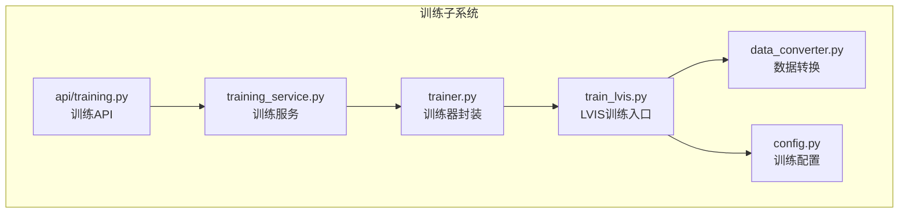
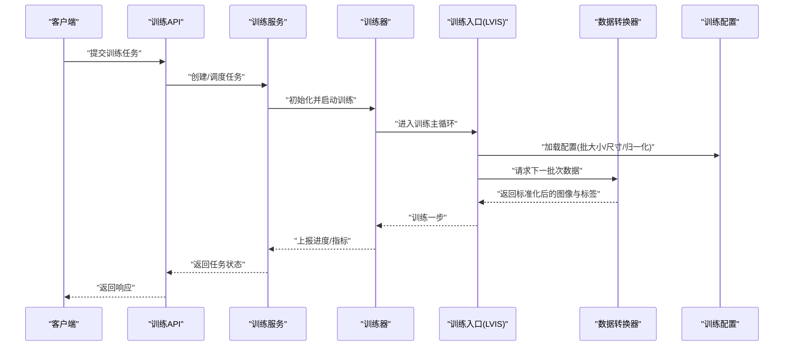
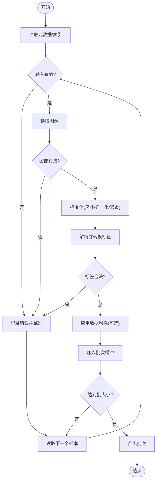
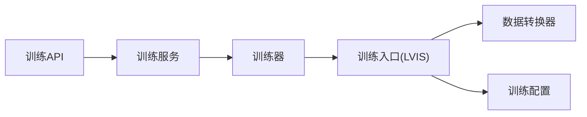

# 数据预处理与转换

<cite>
**本文引用的文件**   
- [backend/app/services/train/data_converter.py](file://backend/app/services/train/data_converter.py)
- [backend/app/services/train/config.py](file://backend/app/services/train/config.py)
- [backend/app/services/train/README.md](file://backend/app/services/train/README.md)
- [backend/app/services/train/TRAINING_GUIDE.md](file://backend/app/services/train/TRAINING_GUIDE.md)
- [backend/app/services/train/train_lvis.py](file://backend/app/services/train/train_lvis.py)
- [backend/app/services/trainer.py](file://backend/app/services/trainer.py)
- [backend/app/services/training_service.py](file://backend/app/services/training_service.py)
- [backend/app/api/training.py](file://backend/app/api/training.py)
</cite>

## 目录
1. [简介](#简介)
2. [项目结构](#项目结构)
3. [核心组件](#核心组件)
4. [架构总览](#架构总览)
5. [详细组件分析](#详细组件分析)
6. [依赖关系分析](#依赖关系分析)
7. [性能考虑](#性能考虑)
8. [故障排查指南](#故障排查指南)
9. [结论](#结论)
10. [附录](#附录)

## 简介
本章节面向数据预处理与转换模块，聚焦于图像数据标准化、标签格式转换与数据增强处理。文档将系统阐述：
- 支持的数据格式与输入输出约定
- 转换参数配置与校验机制
- 批量处理流程与内存优化策略
- 错误处理与可观测性
- 自定义数据转换器开发指南
- 端到端数据准备最佳实践与调优建议

## 项目结构
与数据预处理与转换相关的代码主要位于后端训练子系统中，围绕“数据转换”、“训练配置”、“训练编排”三大层次组织：
- 数据转换层：负责读取原始数据、执行图像标准化、标签格式转换与数据增强
- 配置层：集中管理训练相关参数（如批大小、图像尺寸、归一化参数等）
- 训练编排层：协调数据加载、模型训练与任务调度

图表来源
- [backend/app/services/train/data_converter.py](file://backend/app/services/train/data_converter.py)
- [backend/app/services/train/config.py](file://backend/app/services/train/config.py)
- [backend/app/services/train/train_lvis.py](file://backend/app/services/train/train_lvis.py)
- [backend/app/services/trainer.py](file://backend/app/services/trainer.py)
- [backend/app/services/training_service.py](file://backend/app/services/training_service.py)
- [backend/app/api/training.py](file://backend/app/api/training.py)

章节来源
- [backend/app/services/train/README.md](file://backend/app/services/train/README.md)
- [backend/app/services/train/TRAINING_GUIDE.md](file://backend/app/services/train/TRAINING_GUIDE.md)

## 核心组件
- 数据转换器（Data Converter）
  - 职责：统一读取多源数据、进行图像标准化、标签格式转换、数据增强、构建批次
  - 关键能力：输入验证、异常隔离、流式/分批处理、内存友好
- 训练配置（Training Config）
  - 职责：集中定义批大小、图像尺寸、归一化均值/方差、增强策略开关等
- 训练入口（Train LVIS）
  - 职责：组装数据管道、加载配置、驱动训练循环、记录指标
- 训练器封装（Trainer）
  - 职责：封装训练生命周期（初始化、迭代、保存、恢复）、与数据转换器对接
- 训练服务（Training Service）
  - 职责：对外暴露训练任务接口，协调异步任务与状态管理
- 训练API（Training API）
  - 职责：提供HTTP接口触发训练任务、查询进度与结果

章节来源
- [backend/app/services/train/data_converter.py](file://backend/app/services/train/data_converter.py)
- [backend/app/services/train/config.py](file://backend/app/services/train/config.py)
- [backend/app/services/train/train_lvis.py](file://backend/app/services/train/train_lvis.py)
- [backend/app/services/trainer.py](file://backend/app/services/trainer.py)
- [backend/app/services/training_service.py](file://backend/app/services/training_service.py)
- [backend/app/api/training.py](file://backend/app/api/training.py)

## 架构总览
下图展示了从API到数据转换的完整调用链，以及数据在转换过程中的流转路径。

图表来源
- [backend/app/api/training.py](file://backend/app/api/training.py)
- [backend/app/services/training_service.py](file://backend/app/services/training_service.py)
- [backend/app/services/trainer.py](file://backend/app/services/trainer.py)
- [backend/app/services/train/train_lvis.py](file://backend/app/services/train/train_lvis.py)
- [backend/app/services/train/data_converter.py](file://backend/app/services/train/data_converter.py)
- [backend/app/services/train/config.py](file://backend/app/services/train/config.py)

## 详细组件分析

### 数据转换器（Data Converter）
- 功能要点
  - 图像标准化：尺寸缩放、像素值归一化、通道顺序调整
  - 标签格式转换：将不同标注格式统一为内部标准结构
  - 数据增强：随机裁剪、翻转、色彩抖动、MixUp/CutMix（按配置启用）
  - 批量处理：按批聚合样本，避免一次性加载全部数据
  - 内存优化：惰性读取、复用缓冲区、及时释放中间对象
- 数据验证机制
  - 输入路径/URL有效性检查
  - 图像可读性与完整性校验（分辨率、通道数、损坏检测）
  - 标签字段完整性与类型校验（类别ID范围、边界框合法性）
- 错误处理
  - 单样本失败隔离：跳过坏样本并记录日志，不中断整批
  - 结构化错误码与消息，便于上层重试或告警
- 扩展点
  - 插件化增强算子注册表
  - 自定义标签解析器接口
  - 标准化策略可插拔（如不同数据集的均值/方差）

图表来源
- [backend/app/services/train/data_converter.py](file://backend/app/services/train/data_converter.py)

章节来源
- [backend/app/services/train/data_converter.py](file://backend/app/services/train/data_converter.py)

### 训练配置（Training Config）
- 作用
  - 集中管理批大小、图像尺寸、归一化参数、增强开关、学习率、权重衰减等
- 设计原则
  - 分层配置：基础参数、数据集特定参数、环境相关参数
  - 默认值与覆盖：通过配置文件与环境变量/命令行覆盖
- 典型字段
  - 批大小、图像宽高、归一化均值/方差、增强策略列表、缓存目录、日志级别

章节来源
- [backend/app/services/train/config.py](file://backend/app/services/train/config.py)

### 训练入口（Train LVIS）
- 职责
  - 装配数据管道（数据转换器 + 配置）
  - 驱动训练循环（前向、损失计算、反向传播、优化器更新）
  - 周期评估与检查点保存
- 与数据转换器的协作
  - 按需拉取批次，避免全量加载
  - 根据配置动态切换增强策略与标准化方式

章节来源
- [backend/app/services/train/train_lvis.py](file://backend/app/services/train/train_lvis.py)

### 训练器封装（Trainer）
- 职责
  - 封装训练生命周期：初始化设备、加载权重、训练循环、保存/恢复
  - 与数据转换器解耦：仅依赖批次接口
- 关键点
  - 断点续训：保存/恢复优化器状态与随机种子
  - 指标收集：损失、准确率、吞吐、显存占用

章节来源
- [backend/app/services/trainer.py](file://backend/app/services/trainer.py)

### 训练服务（Training Service）
- 职责
  - 对外暴露训练任务接口（创建、暂停、恢复、终止）
  - 管理任务状态机与并发控制
  - 与持久化存储交互（任务元数据、检查点、日志）

章节来源
- [backend/app/services/training_service.py](file://backend/app/services/training_service.py)

### 训练API（Training API）
- 职责
  - 提供HTTP接口触发训练任务、查询进度与结果
  - 鉴权与限流、参数校验、错误码映射

章节来源
- [backend/app/api/training.py](file://backend/app/api/training.py)

## 依赖关系分析
- 组件耦合
  - 训练API依赖训练服务；训练服务依赖训练器；训练器依赖训练入口；训练入口依赖数据转换器与配置
- 外部依赖
  - 图像IO库、数据处理库、深度学习框架（由具体实现决定）
- 潜在风险
  - 数据转换器与训练入口强耦合需通过清晰接口约束
  - 配置变更应向后兼容，避免破坏既有任务

图表来源
- [backend/app/api/training.py](file://backend/app/api/training.py)
- [backend/app/services/training_service.py](file://backend/app/services/training_service.py)
- [backend/app/services/trainer.py](file://backend/app/services/trainer.py)
- [backend/app/services/train/train_lvis.py](file://backend/app/services/train/train_lvis.py)
- [backend/app/services/train/data_converter.py](file://backend/app/services/train/data_converter.py)
- [backend/app/services/train/config.py](file://backend/app/services/train/config.py)

章节来源
- [backend/app/services/train/README.md](file://backend/app/services/train/README.md)
- [backend/app/services/train/TRAINING_GUIDE.md](file://backend/app/services/train/TRAINING_GUIDE.md)

## 性能考虑
- 数据I/O
  - 使用预取与异步加载，减少CPU等待
  - 对大图像采用懒解码与按需裁剪
- 内存管理
  - 批次内复用张量缓冲区，避免频繁分配
  - 及时释放中间对象，降低峰值内存
- 并行度
  - 合理设置数据加载线程数与GPU批大小
  - 利用多进程数据管道，避免GIL瓶颈
- 数值稳定
  - 归一化参数与数据类型选择（float32/float16）权衡精度与速度
- 监控
  - 记录吞吐、延迟、显存占用，定位瓶颈

[本节为通用指导，无需源码引用]

## 故障排查指南
- 常见问题
  - 图像损坏或无法解码：检查路径权限、编码格式、完整性
  - 标签缺失或越界：核对类别映射、边界框坐标范围
  - 内存溢出：减小批大小、关闭部分增强、启用预取
  - 训练停滞：检查学习率、梯度爆炸/消失、数据质量
- 诊断手段
  - 开启详细日志，定位失败样本与堆栈
  - 导出问题样本与标签，复现最小用例
  - 分阶段验证：先跑通数据管道，再接入训练循环

章节来源
- [backend/app/services/train/data_converter.py](file://backend/app/services/train/data_converter.py)
- [backend/app/services/train/train_lvis.py](file://backend/app/services/train/train_lvis.py)

## 结论
数据预处理与转换模块以“可配置、可扩展、健壮”为核心目标，通过清晰的组件分层与接口契约，实现了从原始数据到训练批次的可靠流水线。配合完善的验证、错误隔离与性能优化策略，可在多种数据集上快速落地。

[本节为总结，无需源码引用]

## 附录

### 支持的数据格式与约定
- 图像格式
  - 常见位图格式（如JPEG/PNG）
  - 要求：可被标准图像库解码、具备有效分辨率与通道
- 标签格式
  - 统一内部结构：包含类别ID、边界框坐标、可选属性
  - 坐标规范：相对或绝对坐标需明确说明，保持一致性
- 索引/清单
  - 建议使用清单文件描述样本路径与标签位置，便于批量处理与断点续跑

章节来源
- [backend/app/services/train/README.md](file://backend/app/services/train/README.md)
- [backend/app/services/train/TRAINING_GUIDE.md](file://backend/app/services/train/TRAINING_GUIDE.md)

### 转换参数配置清单
- 图像标准化
  - 目标尺寸（宽、高）
  - 归一化均值/方差
  - 通道顺序（RGB/BGR）
- 数据增强
  - 随机裁剪/缩放
  - 水平/垂直翻转
  - 色彩抖动（亮度、对比度、饱和度）
  - MixUp/CutMix（可选）
- 批处理
  - 批大小
  - 预取数量
  - 是否打乱顺序
- 资源与日志
  - 工作线程数
  - 缓存目录
  - 日志级别

章节来源
- [backend/app/services/train/config.py](file://backend/app/services/train/config.py)

### 错误处理机制
- 单样本容错：失败样本跳过并记录，不影响批次产出
- 结构化错误：错误码+消息+上下文（路径、行号、字段名）
- 可恢复策略：重试、降级（关闭某项增强）、回退到安全参数

章节来源
- [backend/app/services/train/data_converter.py](file://backend/app/services/train/data_converter.py)

### 自定义数据转换器开发指南
- 步骤
  - 定义输入/输出契约：批次数据结构、字段类型、取值范围
  - 实现数据读取与解析：适配新数据源格式
  - 实现标准化与增强：遵循配置开关，保持可组合
  - 集成到训练入口：替换数据管道组件
- 最佳实践
  - 单元测试覆盖：构造最小样例，验证边界条件
  - 性能基准：对比吞吐与内存占用
  - 可观测性：增加关键指标埋点

章节来源
- [backend/app/services/train/data_converter.py](file://backend/app/services/train/data_converter.py)
- [backend/app/services/train/train_lvis.py](file://backend/app/services/train/train_lvis.py)

### 端到端数据准备流程与最佳实践
- 数据准备
  - 整理图像与标签，生成清单文件
  - 清洗异常样本，修复损坏文件
- 配置与验证
  - 填写训练配置，运行数据验证脚本
  - 抽样可视化，确认标准化与增强效果
- 训练与监控
  - 小批试运行，观察损失曲线与吞吐
  - 逐步扩大规模，调整批大小与并行度
- 持续改进
  - 基于Bad Case分析，针对性增强或清洗数据
  - 定期回归测试，确保数据管道稳定性

章节来源
- [backend/app/services/train/README.md](file://backend/app/services/train/README.md)
- [backend/app/services/train/TRAINING_GUIDE.md](file://backend/app/services/train/TRAINING_GUIDE.md)