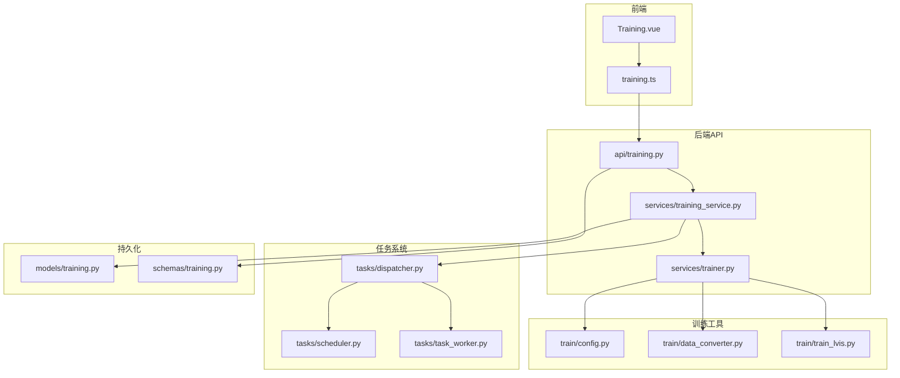
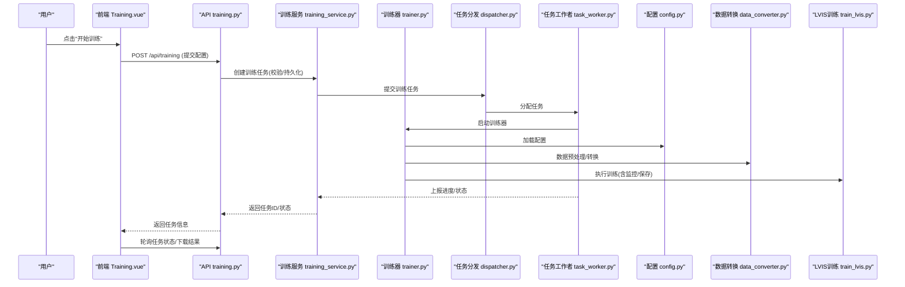
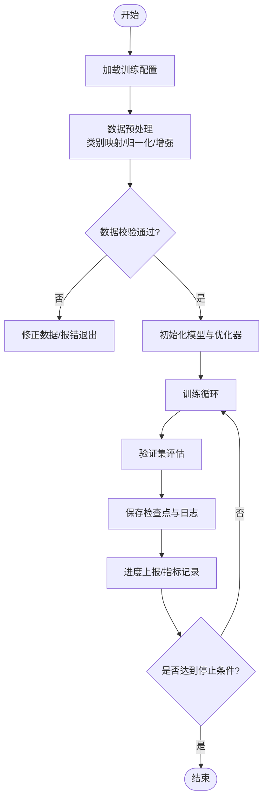
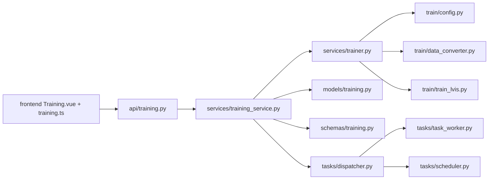

# 模型训练框架

<cite>
**本文引用的文件**   
- [backend/app/services/train/README.md](file://backend/app/services/train/README.md)
- [backend/app/services/train/TRAINING_GUIDE.md](file://backend/app/services/train/TRAINING_GUIDE.md)
- [backend/app/services/train/config.py](file://backend/app/services/train/config.py)
- [backend/app/services/train/data_converter.py](file://backend/app/services/train/data_converter.py)
- [backend/app/services/train/train_lvis.py](file://backend/app/services/train/train_lvis.py)
- [backend/app/services/trainer.py](file://backend/app/services/trainer.py)
- [backend/app/services/training_service.py](file://backend/app/services/training_service.py)
- [backend/app/api/training.py](file://backend/app/api/training.py)
- [backend/app/models/training.py](file://backend/app/models/training.py)
- [backend/app/schemas/training.py](file://backend/app/schemas/training.py)
- [backend/app/tasks/dispatcher.py](file://backend/app/tasks/dispatcher.py)
- [backend/app/tasks/scheduler.py](file://backend/app/tasks/scheduler.py)
- [backend/app/tasks/task_worker.py](file://backend/app/tasks/task_worker.py)
- [frontend/src/api/training.ts](file://frontend/src/api/training.ts)
- [frontend/src/views/Training.vue](file://frontend/src/views/Training.vue)
</cite>

## 目录
1. [简介](#简介)
2. [项目结构](#项目结构)
3. [核心组件](#核心组件)
4. [架构总览](#架构总览)
5. [详细组件分析](#详细组件分析)
6. [依赖关系分析](#依赖关系分析)
7. [性能与资源优化](#性能与资源优化)
8. [故障恢复与排障指南](#故障恢复与排障指南)
9. [结论](#结论)
10. [附录：最佳实践与清单](#附录最佳实践与清单)

## 简介
本文件面向“AI相册”项目的模型训练子系统，提供从数据准备、转换工具、配置管理到任务调度与监控的完整说明。重点覆盖LVIS数据集的训练脚本实现（数据预处理、参数调优、进度监控），并文档化训练结果评估、模型版本管理与部署流程。同时给出分布式训练支持与故障恢复机制的设计建议，以及自定义模型训练的完整指南与最佳实践。

## 项目结构
训练相关代码主要位于后端服务模块中，前端通过API与训练任务交互。关键路径如下：
- 训练脚本与工具：backend/app/services/train/*
- 训练服务与任务编排：backend/app/services/training_service.py, trainer.py
- API层：backend/app/api/training.py
- 数据模型与Schema：backend/app/models/training.py, backend/app/schemas/training.py
- 任务调度与执行：backend/app/tasks/dispatcher.py, scheduler.py, task_worker.py
- 前端训练界面与调用：frontend/src/views/Training.vue, frontend/src/api/training.ts

图表来源
- [backend/app/api/training.py](file://backend/app/api/training.py)
- [backend/app/services/training_service.py](file://backend/app/services/training_service.py)
- [backend/app/services/trainer.py](file://backend/app/services/trainer.py)
- [backend/app/services/train/config.py](file://backend/app/services/train/config.py)
- [backend/app/services/train/data_converter.py](file://backend/app/services/train/data_converter.py)
- [backend/app/services/train/train_lvis.py](file://backend/app/services/train/train_lvis.py)
- [backend/app/tasks/dispatcher.py](file://backend/app/tasks/dispatcher.py)
- [backend/app/tasks/scheduler.py](file://backend/app/tasks/scheduler.py)
- [backend/app/tasks/task_worker.py](file://backend/app/tasks/task_worker.py)
- [backend/app/models/training.py](file://backend/app/models/training.py)
- [backend/app/schemas/training.py](file://backend/app/schemas/training.py)
- [frontend/src/views/Training.vue](file://frontend/src/views/Training.vue)
- [frontend/src/api/training.ts](file://frontend/src/api/training.ts)

章节来源
- [backend/app/services/train/README.md](file://backend/app/services/train/README.md)
- [backend/app/services/train/TRAINING_GUIDE.md](file://backend/app/services/train/TRAINING_GUIDE.md)
- [backend/app/services/train/config.py](file://backend/app/services/train/config.py)
- [backend/app/services/train/data_converter.py](file://backend/app/services/train/data_converter.py)
- [backend/app/services/train/train_lvis.py](file://backend/app/services/train/train_lvis.py)
- [backend/app/services/training_service.py](file://backend/app/services/training_service.py)
- [backend/app/services/trainer.py](file://backend/app/services/trainer.py)
- [backend/app/api/training.py](file://backend/app/api/training.py)
- [backend/app/models/training.py](file://backend/app/models/training.py)
- [backend/app/schemas/training.py](file://backend/app/schemas/training.py)
- [backend/app/tasks/dispatcher.py](file://backend/app/tasks/dispatcher.py)
- [backend/app/tasks/scheduler.py](file://backend/app/tasks/scheduler.py)
- [backend/app/tasks/task_worker.py](file://backend/app/tasks/task_worker.py)
- [frontend/src/views/Training.vue](file://frontend/src/views/Training.vue)
- [frontend/src/api/training.ts](file://frontend/src/api/training.ts)

## 核心组件
- 训练配置管理：集中定义训练超参、数据路径、输出目录等，便于不同数据集与实验的可复现性。
- 数据转换工具：将原始标注或第三方格式转换为训练所需的标准格式，支持批量处理与校验。
- 训练入口脚本：针对特定数据集（如LVIS）封装数据加载、模型初始化、训练循环与保存逻辑。
- 训练服务与任务编排：对外暴露REST接口，接收训练请求，持久化任务状态，调度后台任务执行。
- 任务调度与执行：基于任务分发器与工作者，支持异步执行、重试与进度上报。
- 前端训练界面：提供创建任务、查看进度、下载模型与日志的交互能力。

章节来源
- [backend/app/services/train/config.py](file://backend/app/services/train/config.py)
- [backend/app/services/train/data_converter.py](file://backend/app/services/train/data_converter.py)
- [backend/app/services/train/train_lvis.py](file://backend/app/services/train/train_lvis.py)
- [backend/app/services/training_service.py](file://backend/app/services/training_service.py)
- [backend/app/services/trainer.py](file://backend/app/services/trainer.py)
- [backend/app/api/training.py](file://backend/app/api/training.py)
- [backend/app/tasks/dispatcher.py](file://backend/app/tasks/dispatcher.py)
- [backend/app/tasks/scheduler.py](file://backend/app/tasks/scheduler.py)
- [backend/app/tasks/task_worker.py](file://backend/app/tasks/task_worker.py)
- [frontend/src/views/Training.vue](file://frontend/src/views/Training.vue)
- [frontend/src/api/training.ts](file://frontend/src/api/training.ts)

## 架构总览
训练子系统采用前后端分离与服务化设计：前端通过API发起训练任务；后端服务负责参数校验、任务持久化与调度；任务分发器将具体训练工作委派给工作者进程；训练脚本读取配置与数据进行训练，并将结果与日志落盘，供前端查询与下载。

图表来源
- [backend/app/api/training.py](file://backend/app/api/training.py)
- [backend/app/services/training_service.py](file://backend/app/services/training_service.py)
- [backend/app/services/trainer.py](file://backend/app/services/trainer.py)
- [backend/app/services/train/config.py](file://backend/app/services/train/config.py)
- [backend/app/services/train/data_converter.py](file://backend/app/services/train/data_converter.py)
- [backend/app/services/train/train_lvis.py](file://backend/app/services/train/train_lvis.py)
- [backend/app/tasks/dispatcher.py](file://backend/app/tasks/dispatcher.py)
- [backend/app/tasks/task_worker.py](file://backend/app/tasks/task_worker.py)
- [frontend/src/views/Training.vue](file://frontend/src/views/Training.vue)

## 详细组件分析

### 训练配置管理（config.py）
- 职责：集中管理训练超参、数据路径、输出目录、设备选择、日志与检查点策略等。
- 关键点：
  - 使用结构化配置对象，避免散落的硬编码参数。
  - 提供默认值与覆盖机制，便于快速实验与回归对比。
  - 与任务持久化结合，确保每次训练可追溯。
- 扩展建议：
  - 引入多环境配置（开发/测试/生产）。
  - 增加参数校验与约束（范围、互斥组合）。

章节来源
- [backend/app/services/train/config.py](file://backend/app/services/train/config.py)

### 数据转换工具（data_converter.py）
- 职责：将外部标注格式（如COCO/LVIS/VOC等）转换为训练所需的统一格式，并进行必要的数据清洗与校验。
- 关键点：
  - 支持批量转换与断点续转。
  - 输出标准化目录结构与元数据文件。
  - 提供转换报告与错误定位。
- 扩展建议：
  - 增加可视化校验工具。
  - 支持增量更新与差异比对。

章节来源
- [backend/app/services/train/data_converter.py](file://backend/app/services/train/data_converter.py)

### LVIS训练脚本（train_lvis.py）
- 职责：封装LVIS数据集的训练流程，包括数据加载、模型初始化、训练循环、验证与保存。
- 关键点：
  - 数据预处理：类别映射、边界框归一化、图像增强流水线。
  - 模型参数调优：学习率策略、权重衰减、梯度裁剪、早停条件。
  - 训练进度监控：指标记录、日志输出、检查点保存。
- 扩展建议：
  - 接入分布式训练（多卡/多机）。
  - 集成可视化面板（TensorBoard/MLflow）。

章节来源
- [backend/app/services/train/train_lvis.py](file://backend/app/services/train/train_lvis.py)

### 训练服务与任务编排（training_service.py, trainer.py）
- 职责：
  - training_service.py：对外暴露训练API，负责任务生命周期管理、状态同步与结果归档。
  - trainer.py：封装训练器逻辑，协调配置、数据转换与训练脚本执行。
- 关键点：
  - 任务状态机：待执行、运行中、成功、失败、取消。
  - 进度上报：周期性写入任务进度与指标。
  - 结果管理：模型文件、日志、评估报告的组织与访问控制。
- 扩展建议：
  - 增加任务优先级与配额限制。
  - 支持任务抢占与弹性扩缩容。

章节来源
- [backend/app/services/training_service.py](file://backend/app/services/training_service.py)
- [backend/app/services/trainer.py](file://backend/app/services/trainer.py)

### 任务调度与执行（dispatcher.py, scheduler.py, task_worker.py）
- 职责：
  - dispatcher.py：任务分发，根据负载与资源情况分配任务。
  - scheduler.py：定时任务与重入控制，保障系统稳定性。
  - task_worker.py：实际执行训练任务的进程/线程单元。
- 关键点：
  - 任务队列与重试机制。
  - 健康检查与自动回收僵尸任务。
  - 资源隔离与限流。
- 扩展建议：
  - 引入消息队列（如RabbitMQ/Kafka）提升吞吐。
  - 支持GPU/CPU资源感知调度。

章节来源
- [backend/app/tasks/dispatcher.py](file://backend/app/tasks/dispatcher.py)
- [backend/app/tasks/scheduler.py](file://backend/app/tasks/scheduler.py)
- [backend/app/tasks/task_worker.py](file://backend/app/tasks/task_worker.py)

### 数据模型与Schema（models/training.py, schemas/training.py）
- 职责：
  - models/training.py：数据库实体定义，存储任务、配置、结果等。
  - schemas/training.py：API请求/响应数据结构，保证前后端契约一致。
- 关键点：
  - 字段约束与类型安全。
  - 版本兼容与迁移策略。
- 扩展建议：
  - 增加审计字段（创建者、更新时间）。
  - 引入软删除与历史快照。

章节来源
- [backend/app/models/training.py](file://backend/app/models/training.py)
- [backend/app/schemas/training.py](file://backend/app/schemas/training.py)

### 前端训练界面（Training.vue, training.ts）
- 职责：提供训练任务创建、状态监控、结果下载的UI与API调用封装。
- 关键点：
  - 表单校验与参数提示。
  - 实时进度展示与错误提示。
  - 模型与日志文件的下载链接生成。
- 扩展建议：
  - 增加任务模板与一键导入。
  - 支持批量任务与并行训练。

章节来源
- [frontend/src/views/Training.vue](file://frontend/src/views/Training.vue)
- [frontend/src/api/training.ts](file://frontend/src/api/training.ts)

### LVIS训练流程图（数据预处理与监控）

图表来源
- [backend/app/services/train/train_lvis.py](file://backend/app/services/train/train_lvis.py)
- [backend/app/services/train/config.py](file://backend/app/services/train/config.py)
- [backend/app/services/train/data_converter.py](file://backend/app/services/train/data_converter.py)

## 依赖关系分析
训练子系统内部模块耦合清晰，遵循分层与职责单一原则。API层仅负责协议与编排，服务层承载业务逻辑，训练脚本专注算法实现，任务系统解耦执行与调度。

图表来源
- [backend/app/api/training.py](file://backend/app/api/training.py)
- [backend/app/services/training_service.py](file://backend/app/services/training_service.py)
- [backend/app/services/trainer.py](file://backend/app/services/trainer.py)
- [backend/app/services/train/config.py](file://backend/app/services/train/config.py)
- [backend/app/services/train/data_converter.py](file://backend/app/services/train/data_converter.py)
- [backend/app/services/train/train_lvis.py](file://backend/app/services/train/train_lvis.py)
- [backend/app/models/training.py](file://backend/app/models/training.py)
- [backend/app/schemas/training.py](file://backend/app/schemas/training.py)
- [backend/app/tasks/dispatcher.py](file://backend/app/tasks/dispatcher.py)
- [backend/app/tasks/scheduler.py](file://backend/app/tasks/scheduler.py)
- [backend/app/tasks/task_worker.py](file://backend/app/tasks/task_worker.py)
- [frontend/src/views/Training.vue](file://frontend/src/views/Training.vue)
- [frontend/src/api/training.ts](file://frontend/src/api/training.ts)

章节来源
- [backend/app/api/training.py](file://backend/app/api/training.py)
- [backend/app/services/training_service.py](file://backend/app/services/training_service.py)
- [backend/app/services/trainer.py](file://backend/app/services/trainer.py)
- [backend/app/services/train/config.py](file://backend/app/services/train/config.py)
- [backend/app/services/train/data_converter.py](file://backend/app/services/train/data_converter.py)
- [backend/app/services/train/train_lvis.py](file://backend/app/services/train/train_lvis.py)
- [backend/app/models/training.py](file://backend/app/models/training.py)
- [backend/app/schemas/training.py](file://backend/app/schemas/training.py)
- [backend/app/tasks/dispatcher.py](file://backend/app/tasks/dispatcher.py)
- [backend/app/tasks/scheduler.py](file://backend/app/tasks/scheduler.py)
- [backend/app/tasks/task_worker.py](file://backend/app/tasks/task_worker.py)
- [frontend/src/views/Training.vue](file://frontend/src/views/Training.vue)
- [frontend/src/api/training.ts](file://frontend/src/api/training.ts)

## 性能与资源优化
- 数据I/O优化：
  - 使用缓存与预取减少磁盘瓶颈。
  - 并行解码与增强流水线，避免阻塞主训练循环。
- 计算资源：
  - 混合精度训练降低显存占用并提升吞吐。
  - 梯度累积模拟更大批次，平衡显存与收敛效果。
- 分布式训练：
  - 多卡数据并行与模型并行策略。
  - 节点间通信优化（NCCL/Ring-AllReduce）。
- 检查点与日志：
  - 定期压缩与异步落盘，避免IO抖动。
  - 指标采样与降采样，减少存储压力。
- 任务调度：
  - GPU/CPU亲和性与资源配额，防止争用。
  - 任务优先级与抢占，保障高优任务SLA。

[本节为通用指导，不直接分析具体文件]

## 故障恢复与排障指南
- 常见故障：
  - 数据缺失或格式不一致导致转换失败。
  - 显存不足引发OOM。
  - 任务长时间无响应或工作者崩溃。
- 恢复机制：
  - 检查点断点续训，避免从头开始。
  - 任务重试与退避策略，提高鲁棒性。
  - 健康检查与自动重启工作者。
- 排障步骤：
  - 查看任务日志与指标，定位异常阶段。
  - 校验数据完整性与标签一致性。
  - 调整批大小、学习率或启用梯度裁剪。
  - 检查资源占用与系统负载，必要时扩容。

章节来源
- [backend/app/services/training_service.py](file://backend/app/services/training_service.py)
- [backend/app/tasks/task_worker.py](file://backend/app/tasks/task_worker.py)
- [backend/app/services/train/train_lvis.py](file://backend/app/services/train/train_lvis.py)

## 结论
本训练框架以模块化与可观测性为核心，提供从数据准备到任务调度的端到端能力。通过配置化管理、数据转换工具与LVIS训练脚本，实现了可复现的实验流程；借助任务系统与前端界面，提升了易用性与可维护性。未来可在分布式训练、可视化监控与自动化评估方面持续演进。

[本节为总结，不直接分析具体文件]

## 附录：最佳实践与清单
- 数据准备：
  - 统一标注规范，建立数据校验与报告机制。
  - 保留原始数据与转换中间产物，便于回溯。
- 训练配置：
  - 使用配置文件驱动，避免命令行参数散落。
  - 对关键超参进行网格/随机搜索与记录。
- 训练过程：
  - 开启检查点与日志，设置合理的保存频率。
  - 使用验证集监控过拟合，及时早停。
- 任务管理：
  - 明确任务状态与幂等性，避免重复执行。
  - 为任务设置超时与重试上限。
- 结果评估与版本管理：
  - 固定评估指标与阈值，自动生成评估报告。
  - 模型文件命名包含版本与哈希，便于回滚。
- 部署流程：
  - 模型导出为推理友好格式，附带元数据与依赖清单。
  - 灰度发布与A/B测试，逐步放量。
- 资源优化：
  - 合理设置批大小与学习率，利用混合精度。
  - 使用任务队列与资源池，避免热点瓶颈。

章节来源
- [backend/app/services/train/TRAINING_GUIDE.md](file://backend/app/services/train/TRAINING_GUIDE.md)
- [backend/app/services/train/README.md](file://backend/app/services/train/README.md)
- [backend/app/services/train/config.py](file://backend/app/services/train/config.py)
- [backend/app/services/train/data_converter.py](file://backend/app/services/train/data_converter.py)
- [backend/app/services/train/train_lvis.py](file://backend/app/services/train/train_lvis.py)
- [backend/app/services/training_service.py](file://backend/app/services/training_service.py)
- [backend/app/services/trainer.py](file://backend/app/services/trainer.py)
- [backend/app/api/training.py](file://backend/app/api/training.py)
- [backend/app/models/training.py](file://backend/app/models/training.py)
- [backend/app/schemas/training.py](file://backend/app/schemas/training.py)
- [backend/app/tasks/dispatcher.py](file://backend/app/tasks/dispatcher.py)
- [backend/app/tasks/scheduler.py](file://backend/app/tasks/scheduler.py)
- [backend/app/tasks/task_worker.py](file://backend/app/tasks/task_worker.py)
- [frontend/src/views/Training.vue](file://frontend/src/views/Training.vue)
- [frontend/src/api/training.ts](file://frontend/src/api/training.ts)