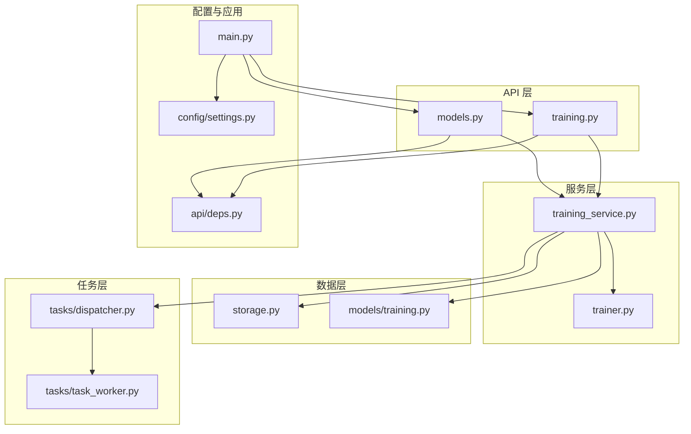
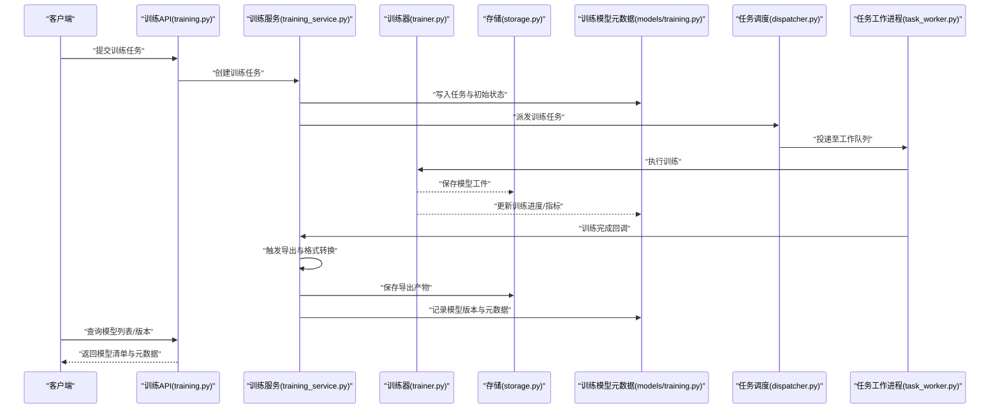
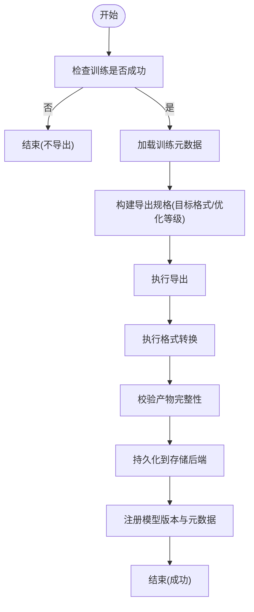
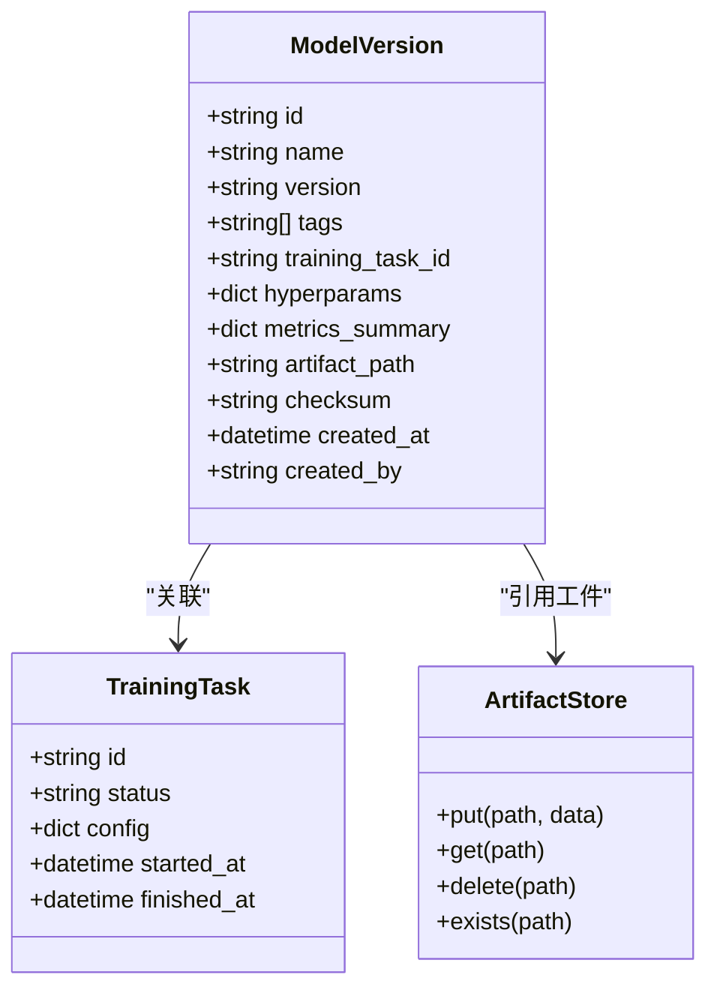
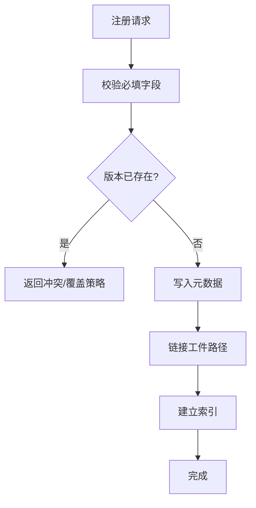
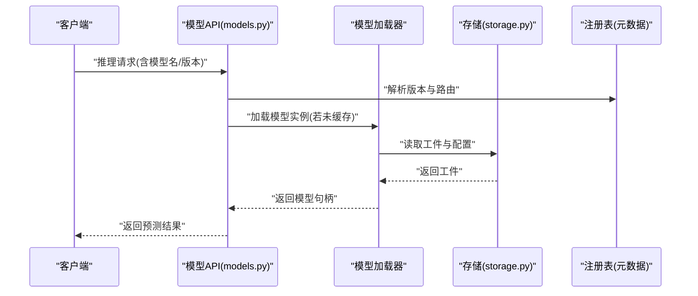
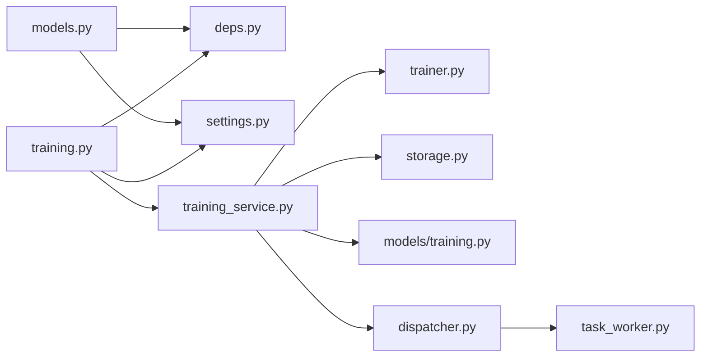

# 模型部署与管理

<cite>
**本文引用的文件**   
- [backend/app/api/models.py](file://backend/app/api/models.py)
- [backend/app/api/training.py](file://backend/app/api/training.py)
- [backend/app/services/trainer.py](file://backend/app/services/trainer.py)
- [backend/app/services/training_service.py](file://backend/app/services/training_service.py)
- [backend/app/schemas/training.py](file://backend/app/schemas/training.py)
- [backend/app/models/training.py](file://backend/app/models/training.py)
- [backend/app/database/storage.py](file://backend/app/database/storage.py)
- [backend/app/tasks/dispatcher.py](file://backend/app/tasks/dispatcher.py)
- [backend/app/tasks/task_worker.py](file://backend/app/tasks/task_worker.py)
- [backend/app/config/settings.py](file://backend/app/config/settings.py)
- [backend/main.py](file://backend/main.py)
- [backend/app/api/deps.py](file://backend/app/api/deps.py)
</cite>

## 目录
1. [简介](#简介)
2. [项目结构](#项目结构)
3. [核心组件](#核心组件)
4. [架构总览](#架构总览)
5. [详细组件分析](#详细组件分析)
6. [依赖关系分析](#依赖关系分析)
7. [性能考量](#性能考量)
8. [故障排查指南](#故障排查指南)
9. [结论](#结论)
10. [附录](#附录)

## 简介
本章节面向“模型部署与管理”模块，聚焦训练完成后的模型导出、格式转换与版本管理；模型注册表、元数据管理与依赖追踪；服务化部署、API 封装与负载均衡配置；以及模型性能评估、A/B 测试与灰度发布策略。同时提供模型生命周期管理、回滚机制与监控告警的配置指南。文档以仓库现有代码为依据，结合工程实践给出可落地的方案建议。

## 项目结构
围绕模型全生命周期的关键位置如下：
- API 层：模型与训练相关接口定义
- 服务层：训练任务编排、训练器抽象、训练流程协调
- 数据持久化：存储后端（对象/本地）与数据库模型
- 任务调度：异步任务分发与工作进程
- 配置：系统与环境变量设置
- 应用入口：FastAPI 应用初始化与中间件挂载

图表来源
- [backend/main.py](file://backend/main.py)
- [backend/app/api/models.py](file://backend/app/api/models.py)
- [backend/app/api/training.py](file://backend/app/api/training.py)
- [backend/app/services/trainer.py](file://backend/app/services/trainer.py)
- [backend/app/services/training_service.py](file://backend/app/services/training_service.py)
- [backend/app/database/storage.py](file://backend/app/database/storage.py)
- [backend/app/models/training.py](file://backend/app/models/training.py)
- [backend/app/tasks/dispatcher.py](file://backend/app/tasks/dispatcher.py)
- [backend/app/tasks/task_worker.py](file://backend/app/tasks/task_worker.py)
- [backend/app/config/settings.py](file://backend/app/config/settings.py)
- [backend/app/api/deps.py](file://backend/app/api/deps.py)

章节来源
- [backend/main.py](file://backend/main.py)
- [backend/app/api/models.py](file://backend/app/api/models.py)
- [backend/app/api/training.py](file://backend/app/api/training.py)
- [backend/app/services/trainer.py](file://backend/app/services/trainer.py)
- [backend/app/services/training_service.py](file://backend/app/services/training_service.py)
- [backend/app/database/storage.py](file://backend/app/database/storage.py)
- [backend/app/models/training.py](file://backend/app/models/training.py)
- [backend/app/tasks/dispatcher.py](file://backend/app/tasks/dispatcher.py)
- [backend/app/tasks/task_worker.py](file://backend/app/tasks/task_worker.py)
- [backend/app/config/settings.py](file://backend/app/config/settings.py)
- [backend/app/api/deps.py](file://backend/app/api/deps.py)

## 核心组件
- 模型与训练 API：对外暴露训练任务创建、查询、结果获取等能力，并承载模型导出与版本管理的入口。
- 训练服务：统一编排训练流程，协调训练器、存储与任务调度，产出可导出的模型工件与元数据。
- 训练器抽象：封装具体训练实现细节，便于扩展不同算法或框架。
- 存储后端：负责模型工件与元数据的持久化，支持多后端切换。
- 任务调度：将耗时训练与导出任务异步化，提升吞吐与稳定性。
- 配置中心：集中管理运行参数、存储路径、并发与超时等。

章节来源
- [backend/app/api/models.py](file://backend/app/api/models.py)
- [backend/app/api/training.py](file://backend/app/api/training.py)
- [backend/app/services/trainer.py](file://backend/app/services/trainer.py)
- [backend/app/services/training_service.py](file://backend/app/services/training_service.py)
- [backend/app/database/storage.py](file://backend/app/database/storage.py)
- [backend/app/tasks/dispatcher.py](file://backend/app/tasks/dispatcher.py)
- [backend/app/tasks/task_worker.py](file://backend/app/tasks/task_worker.py)
- [backend/app/config/settings.py](file://backend/app/config/settings.py)

## 架构总览
下图展示从训练到模型服务化的端到端流程，包括导出、转换、注册、版本控制与服务调用。

图表来源
- [backend/app/api/training.py](file://backend/app/api/training.py)
- [backend/app/services/training_service.py](file://backend/app/services/training_service.py)
- [backend/app/services/trainer.py](file://backend/app/services/trainer.py)
- [backend/app/database/storage.py](file://backend/app/database/storage.py)
- [backend/app/models/training.py](file://backend/app/models/training.py)
- [backend/app/tasks/dispatcher.py](file://backend/app/tasks/dispatcher.py)
- [backend/app/tasks/task_worker.py](file://backend/app/tasks/task_worker.py)

## 详细组件分析

### 模型导出与格式转换
- 目标：在训练完成后自动导出模型，并进行必要的格式转换（如框架间转换、量化、压缩），生成标准化产物。
- 关键点：
  - 导出时机：训练成功回调后触发，避免阻塞训练主流程。
  - 产物规范：统一的目录结构与命名约定，包含权重、配置文件、校验和与元数据。
  - 转换管线：可扩展的转换器链，支持多种目标格式与优化级别。
  - 幂等性：重复导出应安全且可去重。
  - 失败重试：对网络与 I/O 错误进行指数退避重试。

图表来源
- [backend/app/services/training_service.py](file://backend/app/services/training_service.py)
- [backend/app/services/trainer.py](file://backend/app/services/trainer.py)
- [backend/app/database/storage.py](file://backend/app/database/storage.py)
- [backend/app/models/training.py](file://backend/app/models/training.py)

章节来源
- [backend/app/services/training_service.py](file://backend/app/services/training_service.py)
- [backend/app/services/trainer.py](file://backend/app/services/trainer.py)
- [backend/app/database/storage.py](file://backend/app/database/storage.py)
- [backend/app/models/training.py](file://backend/app/models/training.py)

### 版本管理机制
- 版本标识：基于语义化版本或时间戳+哈希的组合，确保唯一性与可追溯。
- 版本策略：
  - 只追加不可变版本，禁止覆盖历史版本。
  - 通过标签标记稳定版、候选版与废弃版。
  - 默认版本指向最新稳定版，支持按标签选择。
- 元数据字段：
  - 模型名称、版本、标签、创建者、创建时间、训练任务 ID、数据集快照、超参、指标摘要、依赖包清单、SHA 校验值。
- 变更审计：所有版本创建与标签变更需记录操作人与原因。

图表来源
- [backend/app/models/training.py](file://backend/app/models/training.py)
- [backend/app/database/storage.py](file://backend/app/database/storage.py)

章节来源
- [backend/app/models/training.py](file://backend/app/models/training.py)
- [backend/app/database/storage.py](file://backend/app/database/storage.py)

### 模型注册表与元数据管理
- 注册表职责：维护模型清单、版本、标签与元数据索引，提供查询与过滤能力。
- 元数据来源：训练阶段记录的超参与指标、导出阶段的产物信息与校验值、运行时环境依赖。
- 一致性保障：注册表与存储后端采用事务或补偿机制保证最终一致。
- 检索优化：为常用查询字段建立索引（名称、标签、创建时间）。

图表来源
- [backend/app/models/training.py](file://backend/app/models/training.py)
- [backend/app/database/storage.py](file://backend/app/database/storage.py)

章节来源
- [backend/app/models/training.py](file://backend/app/models/training.py)
- [backend/app/database/storage.py](file://backend/app/database/storage.py)

### 依赖关系追踪
- 依赖范围：
  - 训练依赖：Python 包、CUDA/cuDNN 版本、外部工具链。
  - 推理依赖：运行时库、模型格式兼容版本。
- 采集方式：
  - 训练开始时冻结依赖清单（如 requirements 或 lock 文件）。
  - 导出时附加运行时依赖声明。
- 使用场景：
  - 复现实验、问题定位、合规审计。
  - 容器镜像构建与最小化打包。

章节来源
- [backend/app/services/trainer.py](file://backend/app/services/trainer.py)
- [backend/app/services/training_service.py](file://backend/app/services/training_service.py)

### 模型服务化部署与 API 封装
- 服务化要点：
  - 模型加载：启动时按需加载指定版本，支持热切换。
  - 资源隔离：GPU/CPU 资源配额与显存上限。
  - 健康检查：就绪探针与存活探针。
  - 日志与指标：结构化日志、Prometheus 指标暴露。
- API 封装：
  - 统一入参出参结构，包含请求 ID、版本信息、延迟与缓存命中标志。
  - 鉴权与限流：基于令牌与速率限制。
  - 分页与过滤：模型列表与版本查询。

图表来源
- [backend/app/api/models.py](file://backend/app/api/models.py)
- [backend/app/database/storage.py](file://backend/app/database/storage.py)
- [backend/app/models/training.py](file://backend/app/models/training.py)

章节来源
- [backend/app/api/models.py](file://backend/app/api/models.py)
- [backend/app/database/storage.py](file://backend/app/database/storage.py)
- [backend/app/models/training.py](file://backend/app/models/training.py)

### 负载均衡配置
- 水平扩展：多副本部署，无状态服务节点。
- 路由策略：
  - 基于模型版本的粘性会话或轮询。
  - 按流量比例分流（灰度/A-B）。
- 健康检查：节点级与模型级就绪探测。
- 反向代理：Nginx/Ingress 配置示例（概念性说明）。

[本节为通用指导，不涉及具体文件]

### 性能评估、A/B 测试与灰度发布
- 性能评估：
  - 离线基准：吞吐、延迟、资源占用。
  - 在线评估：P95/P99 延迟、错误率、降级策略。
- A/B 测试：
  - 基于用户分桶或请求特征分流。
  - 指标对比看板与显著性检验。
- 灰度发布：
  - 逐步放量（1%→5%→20%→100%）。
  - 自动回滚阈值（错误率、延迟、业务指标）。

[本节为通用指导，不涉及具体文件]

### 模型生命周期管理、回滚与监控告警
- 生命周期阶段：草稿→训练中→待导出→已导出→已注册→上线→灰度→下线→归档。
- 回滚机制：
  - 一键回滚至上一稳定版本。
  - 保留最近 N 个版本用于快速恢复。
- 监控告警：
  - 指标：CPU/GPU 利用率、显存、I/O、QPS、延迟分布、错误码分布。
  - 告警规则：阈值与动态基线结合，通知渠道（邮件/IM/短信）。
  - 日志聚合：集中式日志与链路追踪。

[本节为通用指导，不涉及具体文件]

## 依赖关系分析
- 组件耦合：
  - API 层依赖服务层与依赖注入。
  - 服务层依赖训练器、存储与任务调度。
  - 任务调度解耦训练与导出，提高弹性。
- 外部依赖：
  - 存储后端（对象存储/本地文件系统）。
  - 任务队列（Redis/RabbitMQ 等，视部署而定）。
  - 配置中心与环境变量。

图表来源
- [backend/app/api/models.py](file://backend/app/api/models.py)
- [backend/app/api/training.py](file://backend/app/api/training.py)
- [backend/app/api/deps.py](file://backend/app/api/deps.py)
- [backend/app/config/settings.py](file://backend/app/config/settings.py)
- [backend/app/services/training_service.py](file://backend/app/services/training_service.py)
- [backend/app/services/trainer.py](file://backend/app/services/trainer.py)
- [backend/app/database/storage.py](file://backend/app/database/storage.py)
- [backend/app/models/training.py](file://backend/app/models/training.py)
- [backend/app/tasks/dispatcher.py](file://backend/app/tasks/dispatcher.py)
- [backend/app/tasks/task_worker.py](file://backend/app/tasks/task_worker.py)

章节来源
- [backend/app/api/models.py](file://backend/app/api/models.py)
- [backend/app/api/training.py](file://backend/app/api/training.py)
- [backend/app/api/deps.py](file://backend/app/api/deps.py)
- [backend/app/config/settings.py](file://backend/app/config/settings.py)
- [backend/app/services/training_service.py](file://backend/app/services/training_service.py)
- [backend/app/services/trainer.py](file://backend/app/services/trainer.py)
- [backend/app/database/storage.py](file://backend/app/database/storage.py)
- [backend/app/models/training.py](file://backend/app/models/training.py)
- [backend/app/tasks/dispatcher.py](file://backend/app/tasks/dispatcher.py)
- [backend/app/tasks/task_worker.py](file://backend/app/tasks/task_worker.py)

## 性能考量
- 训练与导出并行化：利用任务队列与多工作进程提升吞吐。
- 模型加载缓存：常驻内存缓存热点模型，减少冷启动开销。
- 存储优化：大文件分块读写、预取与压缩。
- 资源隔离：容器 CPU/GPU 配额与显存限制，防止抖动。
- 批处理与流水线：批量导出与转换，降低 I/O 放大。

[本节为通用指导，不涉及具体文件]

## 故障排查指南
- 常见问题定位：
  - 训练失败：检查任务状态、日志与异常堆栈。
  - 导出失败：验证工件完整性、权限与磁盘空间。
  - 版本冲突：确认版本唯一性与标签覆盖策略。
  - 服务不可用：健康检查、依赖加载失败、资源不足。
- 诊断手段：
  - 查看任务工作进程日志与调度队列状态。
  - 核对存储后端连通性与访问凭证。
  - 检查配置项（超时、并发、路径）。
  - 使用请求 ID 追踪端到端链路。

章节来源
- [backend/app/tasks/task_worker.py](file://backend/app/tasks/task_worker.py)
- [backend/app/tasks/dispatcher.py](file://backend/app/tasks/dispatcher.py)
- [backend/app/config/settings.py](file://backend/app/config/settings.py)
- [backend/app/database/storage.py](file://backend/app/database/storage.py)

## 结论
本模块围绕“训练—导出—注册—服务化”的主线，构建了可扩展的模型部署与管理能力。通过任务调度与存储抽象，实现了高可用与弹性扩展；通过版本与元数据管理，保障了可追溯与可回滚；通过 API 封装与负载均衡，提供了稳定的推理服务。建议在后续迭代中完善自动化评估与灰度平台，进一步提升上线效率与风险控制能力。

## 附录
- 术语
  - 工件：模型权重、配置文件与校验信息的集合。
  - 注册表：模型清单与元数据的索引与查询入口。
  - 灰度：小流量逐步放量上线策略。
- 最佳实践
  - 严格区分开发、测试与生产环境配置。
  - 所有模型变更纳入版本控制与审计。
  - 关键路径增加熔断与降级逻辑。