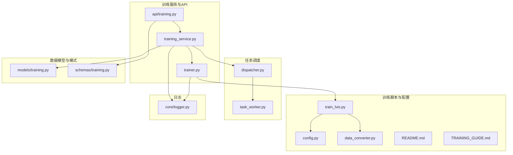
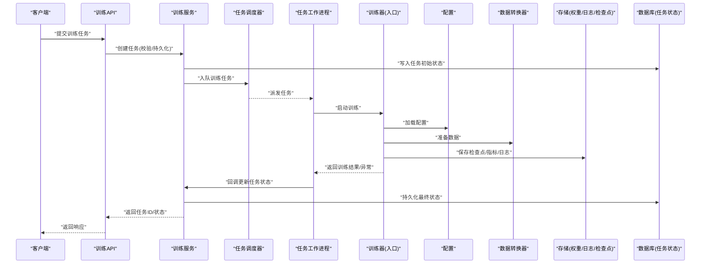
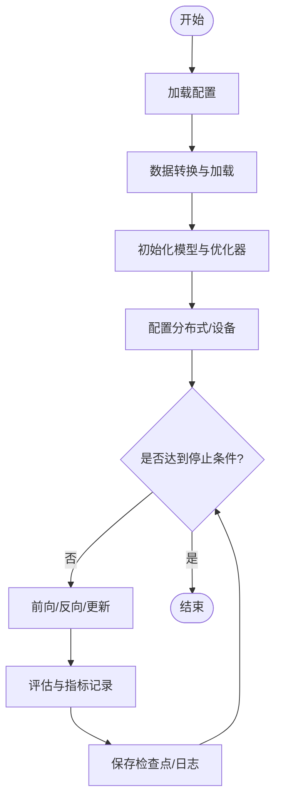
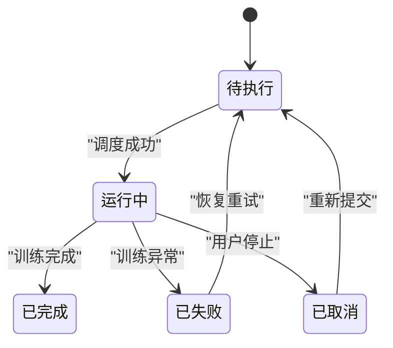
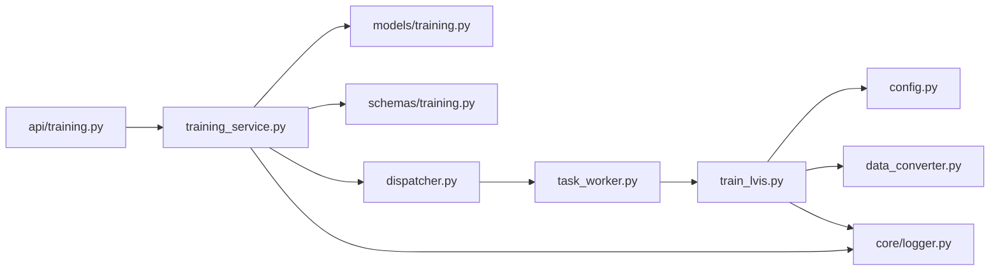

# 训练执行流程

<cite>
**本文引用的文件**   
- [backend/app/services/train/train_lvis.py](file://backend/app/services/train/train_lvis.py)
- [backend/app/services/train/config.py](file://backend/app/services/train/config.py)
- [backend/app/services/train/data_converter.py](file://backend/app/services/train/data_converter.py)
- [backend/app/services/train/README.md](file://backend/app/services/train/README.md)
- [backend/app/services/train/TRAINING_GUIDE.md](file://backend/app/services/train/TRAINING_GUIDE.md)
- [backend/app/services/trainer.py](file://backend/app/services/trainer.py)
- [backend/app/services/training_service.py](file://backend/app/services/training_service.py)
- [backend/app/api/training.py](file://backend/app/api/training.py)
- [backend/app/models/training.py](file://backend/app/models/training.py)
- [backend/app/schemas/training.py](file://backend/app/schemas/training.py)
- [backend/app/tasks/dispatcher.py](file://backend/app/tasks/dispatcher.py)
- [backend/app/tasks/task_worker.py](file://backend/app/tasks/task_worker.py)
- [backend/app/core/logger.py](file://backend/app/core/logger.py)
</cite>

## 目录
1. [简介](#简介)
2. [项目结构](#项目结构)
3. [核心组件](#核心组件)
4. [架构总览](#架构总览)
5. [详细组件分析](#详细组件分析)
6. [依赖关系分析](#依赖关系分析)
7. [性能考虑](#性能考虑)
8. [故障排查指南](#故障排查指南)
9. [结论](#结论)
10. [附录](#附录)

## 简介
本文件面向“LVIS数据集训练”的完整执行流程，覆盖数据加载、模型初始化、训练循环与结果保存；并深入说明训练进度监控、日志记录、中间检查点管理、分布式训练支持、GPU资源管理与中断恢复机制。同时提供训练性能分析、内存优化建议、并发训练策略，以及自定义训练脚本开发与常见问题的排障方法。文档以仓库中实际实现为依据，确保可追溯与可落地。

## 项目结构
围绕训练执行的相关代码主要分布在后端服务的训练模块与任务调度层：
- 训练脚本与配置：位于 services/train 目录，包含 LVIS 训练入口、配置与数据转换工具。
- 训练服务与API：services 层的 trainer.py 与 training_service.py 负责编排训练生命周期；api/training.py 暴露训练控制接口。
- 任务调度：tasks 层通过 dispatcher.py 与 task_worker.py 将训练任务异步化与并发化。
- 持久化与模式：models/training.py 与 schemas/training.py 定义训练任务状态与请求/响应结构。
- 日志：core/logger.py 提供统一日志能力。

图表来源
- [backend/app/services/train/train_lvis.py](file://backend/app/services/train/train_lvis.py)
- [backend/app/services/train/config.py](file://backend/app/services/train/config.py)
- [backend/app/services/train/data_converter.py](file://backend/app/services/train/data_converter.py)
- [backend/app/services/train/README.md](file://backend/app/services/train/README.md)
- [backend/app/services/train/TRAINING_GUIDE.md](file://backend/app/services/train/TRAINING_GUIDE.md)
- [backend/app/services/trainer.py](file://backend/app/services/trainer.py)
- [backend/app/services/training_service.py](file://backend/app/services/training_service.py)
- [backend/app/api/training.py](file://backend/app/api/training.py)
- [backend/app/tasks/dispatcher.py](file://backend/app/tasks/dispatcher.py)
- [backend/app/tasks/task_worker.py](file://backend/app/tasks/task_worker.py)
- [backend/app/models/training.py](file://backend/app/models/training.py)
- [backend/app/schemas/training.py](file://backend/app/schemas/training.py)
- [backend/app/core/logger.py](file://backend/app/core/logger.py)

章节来源
- [backend/app/services/train/train_lvis.py](file://backend/app/services/train/train_lvis.py)
- [backend/app/services/train/config.py](file://backend/app/services/train/config.py)
- [backend/app/services/train/data_converter.py](file://backend/app/services/train/data_converter.py)
- [backend/app/services/train/README.md](file://backend/app/services/train/README.md)
- [backend/app/services/train/TRAINING_GUIDE.md](file://backend/app/services/train/TRAINING_GUIDE.md)
- [backend/app/services/trainer.py](file://backend/app/services/trainer.py)
- [backend/app/services/training_service.py](file://backend/app/services/training_service.py)
- [backend/app/api/training.py](file://backend/app/api/training.py)
- [backend/app/tasks/dispatcher.py](file://backend/app/tasks/dispatcher.py)
- [backend/app/tasks/task_worker.py](file://backend/app/tasks/task_worker.py)
- [backend/app/models/training.py](file://backend/app/models/training.py)
- [backend/app/schemas/training.py](file://backend/app/schemas/training.py)
- [backend/app/core/logger.py](file://backend/app/core/logger.py)

## 核心组件
- 训练入口（LVIS）：负责解析配置、准备数据、初始化模型、执行训练循环、保存权重与指标、输出日志。
- 训练配置：集中管理超参、路径、设备、分布式参数等。
- 数据转换器：将原始数据转换为训练所需格式或数据集对象。
- 训练服务：对外暴露训练任务的创建、查询、停止、恢复等能力，协调任务调度与持久化。
- API 层：提供 HTTP 接口用于前端或外部系统触发训练任务。
- 任务调度器与工作进程：将训练任务放入队列并由工作进程异步执行，支持并发与失败重试。
- 数据模型与模式：定义训练任务实体、状态机与输入输出结构。
- 日志：统一结构化日志输出，便于追踪训练过程与问题定位。

章节来源
- [backend/app/services/train/train_lvis.py](file://backend/app/services/train/train_lvis.py)
- [backend/app/services/train/config.py](file://backend/app/services/train/config.py)
- [backend/app/services/train/data_converter.py](file://backend/app/services/train/data_converter.py)
- [backend/app/services/training_service.py](file://backend/app/services/training_service.py)
- [backend/app/api/training.py](file://backend/app/api/training.py)
- [backend/app/tasks/dispatcher.py](file://backend/app/tasks/dispatcher.py)
- [backend/app/tasks/task_worker.py](file://backend/app/tasks/task_worker.py)
- [backend/app/models/training.py](file://backend/app/models/training.py)
- [backend/app/schemas/training.py](file://backend/app/schemas/training.py)
- [backend/app/core/logger.py](file://backend/app/core/logger.py)

## 架构总览
下图展示了从HTTP请求到训练执行的端到端流程，包括任务分发、训练执行、状态更新与结果落盘。

图表来源
- [backend/app/api/training.py](file://backend/app/api/training.py)
- [backend/app/services/training_service.py](file://backend/app/services/training_service.py)
- [backend/app/tasks/dispatcher.py](file://backend/app/tasks/dispatcher.py)
- [backend/app/tasks/task_worker.py](file://backend/app/tasks/task_worker.py)
- [backend/app/services/train/train_lvis.py](file://backend/app/services/train/train_lvis.py)
- [backend/app/services/train/config.py](file://backend/app/services/train/config.py)
- [backend/app/services/train/data_converter.py](file://backend/app/services/train/data_converter.py)
- [backend/app/models/training.py](file://backend/app/models/training.py)

## 详细组件分析

### LVIS 训练入口（train_lvis.py）
职责概览
- 解析命令行参数与配置文件，构建训练环境。
- 调用数据转换器准备数据集与数据加载器。
- 初始化模型与优化器，设置设备与分布式后端。
- 执行训练循环，按步/轮次保存检查点与指标。
- 记录训练日志，处理中断信号以实现断点续训。

关键流程
- 配置加载：读取 config.py 中的超参与路径。
- 数据准备：使用 data_converter.py 将原始数据转为训练可用格式。
- 模型初始化：根据配置选择模型与预训练权重。
- 训练循环：迭代批次、计算损失、反向传播、更新参数、评估与保存。
- 检查点管理：周期性保存权重与优化器状态，支持恢复。
- 日志记录：结构化输出训练指标与事件。

图表来源
- [backend/app/services/train/train_lvis.py](file://backend/app/services/train/train_lvis.py)
- [backend/app/services/train/config.py](file://backend/app/services/train/config.py)
- [backend/app/services/train/data_converter.py](file://backend/app/services/train/data_converter.py)

章节来源
- [backend/app/services/train/train_lvis.py](file://backend/app/services/train/train_lvis.py)
- [backend/app/services/train/config.py](file://backend/app/services/train/config.py)
- [backend/app/services/train/data_converter.py](file://backend/app/services/train/data_converter.py)

### 训练配置（config.py）
职责概览
- 集中管理训练超参（学习率、批大小、轮次、优化器类型等）。
- 指定数据路径、模型权重路径、检查点与日志输出目录。
- 配置分布式参数（如进程数、端口）、设备选择与精度设置。

要点
- 默认值与覆盖：支持环境变量或命令行覆盖默认配置。
- 路径规范化：统一绝对路径与相对路径处理。
- 安全校验：对关键路径与数值范围进行校验。

章节来源
- [backend/app/services/train/config.py](file://backend/app/services/train/config.py)

### 数据转换器（data_converter.py）
职责概览
- 将原始 LVIS 数据转换为训练框架所需的格式（如标注JSON、图像索引、类别映射等）。
- 生成数据清单与缓存，加速数据加载。
- 提供数据增强管线配置与验证。

关键点
- 增量转换：支持仅转换新增数据，避免重复IO。
- 一致性校验：在转换后对样本数量、类别分布进行统计校验。
- 错误隔离：单个样本转换失败不影响整体流程。

章节来源
- [backend/app/services/train/data_converter.py](file://backend/app/services/train/data_converter.py)

### 训练服务（training_service.py）
职责概览
- 封装训练任务的生命周期：创建、查询、停止、恢复、删除。
- 与任务调度器交互，将训练任务异步化。
- 维护任务状态机，持久化任务元数据与运行信息。
- 聚合日志与指标，提供查询接口。

状态流转
- 待执行 -> 运行中 -> 已完成 / 已失败 / 已取消
- 支持从最近检查点恢复继续训练

图表来源
- [backend/app/services/training_service.py](file://backend/app/services/training_service.py)
- [backend/app/models/training.py](file://backend/app/models/training.py)

章节来源
- [backend/app/services/training_service.py](file://backend/app/services/training_service.py)
- [backend/app/models/training.py](file://backend/app/models/training.py)

### 训练API（api/training.py）
职责概览
- 暴露REST接口：创建训练任务、查询任务状态、停止任务、获取结果。
- 参数校验与权限控制。
- 将请求转发至训练服务，返回标准化响应。

典型流程
- 接收请求 -> 校验参数 -> 调用服务 -> 持久化状态 -> 返回响应

章节来源
- [backend/app/api/training.py](file://backend/app/api/training.py)
- [backend/app/schemas/training.py](file://backend/app/schemas/training.py)

### 任务调度器与工作进程（dispatcher.py, task_worker.py）
职责概览
- dispatcher.py：任务队列管理、优先级、重试策略、死信队列。
- task_worker.py：拉取任务、执行训练入口、捕获异常、上报状态。

并发策略
- 多进程/多线程工作池，结合GPU数量动态调整并发度。
- 资源隔离：每个任务绑定独立GPU/CPU配额。

章节来源
- [backend/app/tasks/dispatcher.py](file://backend/app/tasks/dispatcher.py)
- [backend/app/tasks/task_worker.py](file://backend/app/tasks/task_worker.py)

### 日志（logger.py）
职责概览
- 统一日志格式、级别与输出目标（控制台、文件、远端收集）。
- 为训练过程注入上下文（任务ID、步骤、指标），便于检索与分析。

章节来源
- [backend/app/core/logger.py](file://backend/app/core/logger.py)

## 依赖关系分析
- 训练入口依赖配置与数据转换器，训练服务依赖任务调度与数据模型，API依赖服务与模式定义。
- 任务调度与工作进程解耦训练逻辑，提升可扩展性与容错性。
- 日志贯穿各层，保证可观测性。

图表来源
- [backend/app/api/training.py](file://backend/app/api/training.py)
- [backend/app/services/training_service.py](file://backend/app/services/training_service.py)
- [backend/app/models/training.py](file://backend/app/models/training.py)
- [backend/app/schemas/training.py](file://backend/app/schemas/training.py)
- [backend/app/tasks/dispatcher.py](file://backend/app/tasks/dispatcher.py)
- [backend/app/tasks/task_worker.py](file://backend/app/tasks/task_worker.py)
- [backend/app/services/train/train_lvis.py](file://backend/app/services/train/train_lvis.py)
- [backend/app/services/train/config.py](file://backend/app/services/train/config.py)
- [backend/app/services/train/data_converter.py](file://backend/app/services/train/data_converter.py)
- [backend/app/core/logger.py](file://backend/app/core/logger.py)

章节来源
- [backend/app/api/training.py](file://backend/app/api/training.py)
- [backend/app/services/training_service.py](file://backend/app/services/training_service.py)
- [backend/app/models/training.py](file://backend/app/models/training.py)
- [backend/app/schemas/training.py](file://backend/app/schemas/training.py)
- [backend/app/tasks/dispatcher.py](file://backend/app/tasks/dispatcher.py)
- [backend/app/tasks/task_worker.py](file://backend/app/tasks/task_worker.py)
- [backend/app/services/train/train_lvis.py](file://backend/app/services/train/train_lvis.py)
- [backend/app/services/train/config.py](file://backend/app/services/train/config.py)
- [backend/app/services/train/data_converter.py](file://backend/app/services/train/data_converter.py)
- [backend/app/core/logger.py](file://backend/app/core/logger.py)

## 性能考虑
- 数据加载优化
  - 使用数据转换器生成索引与缓存，减少重复IO。
  - 合理设置数据加载并行度，避免磁盘瓶颈。
- 模型与显存
  - 依据GPU显存调整批大小与梯度累积步数。
  - 启用混合精度与梯度裁剪，提高吞吐与稳定性。
- 分布式训练
  - 多卡/多机时合理划分进程与通信后端，降低同步开销。
  - 使用检查点分片与增量保存，缩短I/O时间。
- 并发训练
  - 根据GPU数量与任务粒度配置工作进程池，避免争用。
  - 任务级资源隔离，防止单任务占用过多资源影响其他任务。
- 日志与指标
  - 控制日志频率与采样率，避免频繁写盘造成阻塞。
  - 指标聚合与异步落盘，降低主训练路径开销。

[本节为通用指导，不直接分析具体文件]

## 故障排查指南
常见问题与定位方法
- 任务无法启动
  - 检查API参数校验与服务日志，确认任务状态未处于不可恢复态。
  - 查看调度器队列与工作进程健康状态。
- 训练中途失败
  - 根据任务ID检索对应日志，定位异常堆栈与最后保存的检查点。
  - 若存在检查点，尝试从最近检查点恢复训练。
- 显存不足
  - 降低批大小或启用梯度累积；检查是否有其他任务抢占GPU。
- 数据转换失败
  - 检查数据路径与权限；查看转换器输出的校验报告，定位异常样本。
- 分布式通信异常
  - 检查端口占用与防火墙规则；确认进程间通信后端配置一致。

章节来源
- [backend/app/core/logger.py](file://backend/app/core/logger.py)
- [backend/app/services/training_service.py](file://backend/app/services/training_service.py)
- [backend/app/tasks/dispatcher.py](file://backend/app/tasks/dispatcher.py)
- [backend/app/tasks/task_worker.py](file://backend/app/tasks/task_worker.py)
- [backend/app/services/train/data_converter.py](file://backend/app/services/train/data_converter.py)

## 结论
本文件系统化梳理了LVIS数据集训练的完整执行流程，涵盖从数据准备、模型初始化、训练循环到结果保存的全链路，并结合任务调度与日志体系实现了可观测、可恢复与可扩展的训练平台。通过合理的性能优化与并发策略，可在多GPU环境下高效稳定地推进训练任务。

[本节为总结性内容，不直接分析具体文件]

## 附录

### 训练进度监控与日志记录
- 进度监控
  - 训练入口按步/轮次记录指标，训练服务聚合任务级指标并提供查询接口。
- 日志记录
  - 统一日志格式，包含任务ID、步骤、指标与异常信息，便于检索与告警。

章节来源
- [backend/app/services/train/train_lvis.py](file://backend/app/services/train/train_lvis.py)
- [backend/app/services/training_service.py](file://backend/app/services/training_service.py)
- [backend/app/core/logger.py](file://backend/app/core/logger.py)

### 中间检查点管理
- 保存策略
  - 按固定步数或指标阈值保存检查点，保留最近N个版本。
- 恢复机制
  - 从最近检查点加载权重与优化器状态，继续训练。
- 存储位置
  - 检查点与日志分离存储，便于备份与迁移。

章节来源
- [backend/app/services/train/train_lvis.py](file://backend/app/services/train/train_lvis.py)
- [backend/app/services/training_service.py](file://backend/app/services/training_service.py)

### 分布式训练支持与GPU资源管理
- 分布式
  - 配置多进程/多机通信后端，合理分配rank与world size。
- GPU管理
  - 基于设备可见性与显存占用动态分配任务，避免过载。
- 资源隔离
  - 任务级GPU/CPU配额，配合调度器实现公平共享。

章节来源
- [backend/app/services/train/config.py](file://backend/app/services/train/config.py)
- [backend/app/tasks/dispatcher.py](file://backend/app/tasks/dispatcher.py)
- [backend/app/tasks/task_worker.py](file://backend/app/tasks/task_worker.py)

### 训练中断恢复机制
- 中断信号
  - 捕获系统信号，优雅关闭并保存检查点。
- 恢复流程
  - 任务状态回退至可恢复态，下次启动自动从检查点继续。
- 幂等性
  - 恢复过程中避免重复写入与状态不一致。

章节来源
- [backend/app/services/train/train_lvis.py](file://backend/app/services/train/train_lvis.py)
- [backend/app/services/training_service.py](file://backend/app/services/training_service.py)

### 自定义训练脚本开发指南
- 参考入口
  - 基于现有训练入口的结构，扩展新的数据源或模型。
- 配置扩展
  - 在配置文件中新增字段，并在入口处解析与校验。
- 数据适配
  - 实现数据转换器，将新数据格式转换为训练可用形式。
- 集成服务
  - 注册新的训练任务类型，接入任务调度与状态管理。
- 测试与发布
  - 编写单元测试与端到端测试，确保稳定性与可复现性。

章节来源
- [backend/app/services/train/train_lvis.py](file://backend/app/services/train/train_lvis.py)
- [backend/app/services/train/config.py](file://backend/app/services/train/config.py)
- [backend/app/services/train/data_converter.py](file://backend/app/services/train/data_converter.py)
- [backend/app/services/training_service.py](file://backend/app/services/training_service.py)

### 相关文档
- README 与训练指南
  - 提供快速上手、环境搭建与示例用法。

章节来源
- [backend/app/services/train/README.md](file://backend/app/services/train/README.md)
- [backend/app/services/train/TRAINING_GUIDE.md](file://backend/app/services/train/TRAINING_GUIDE.md)