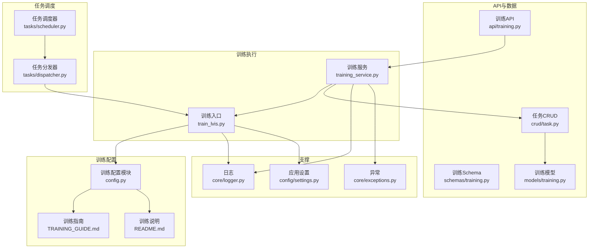
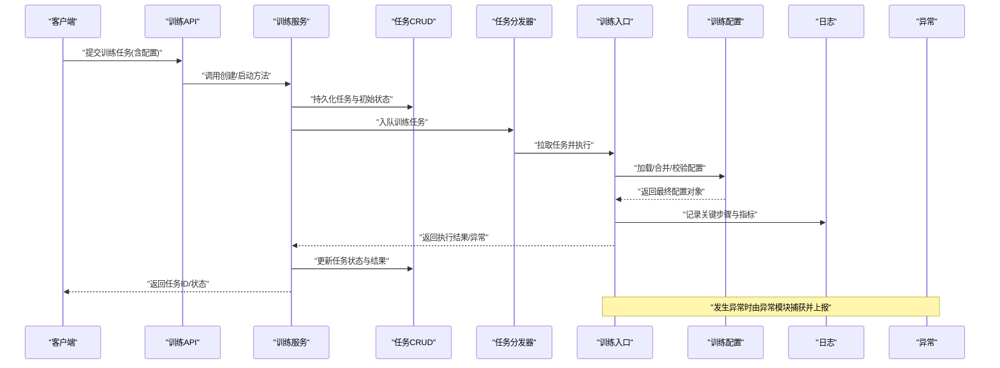
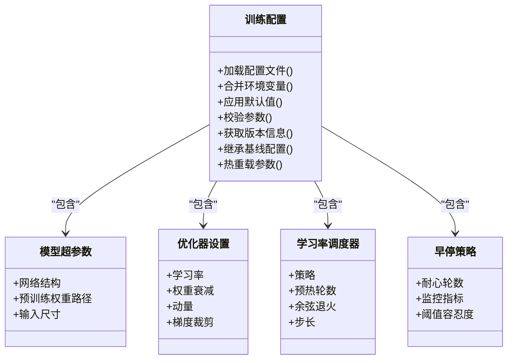
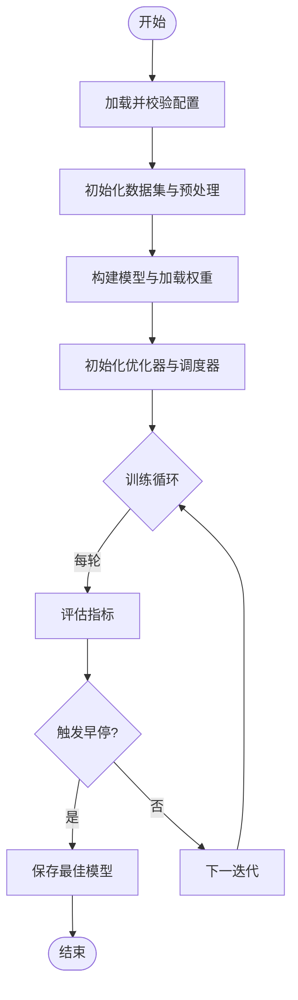
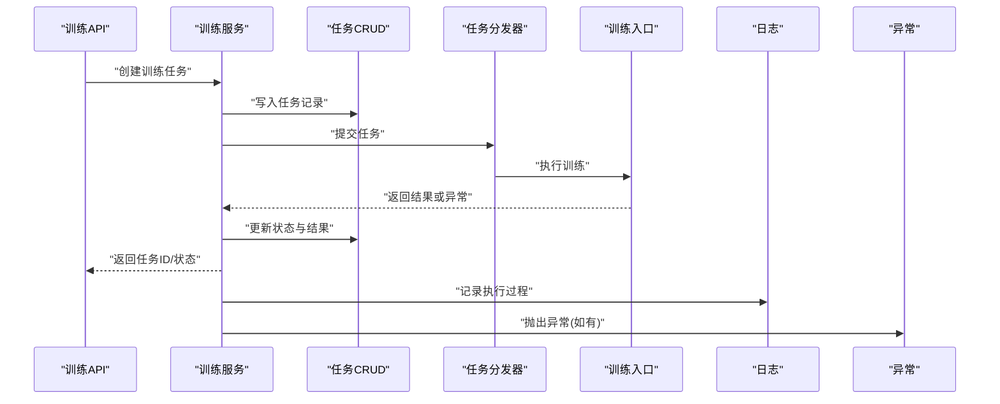
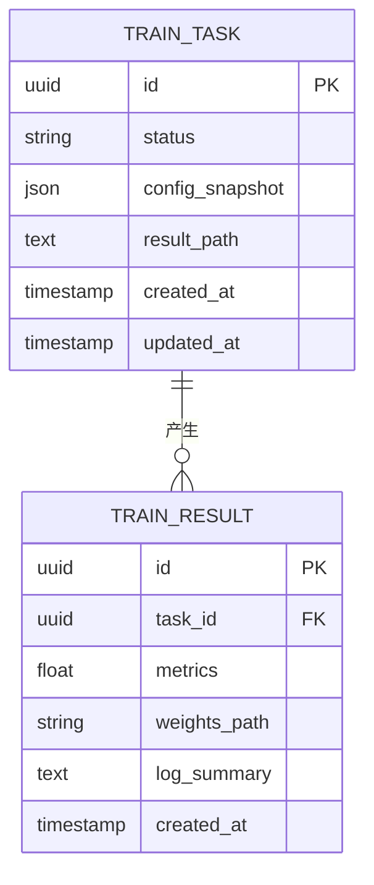
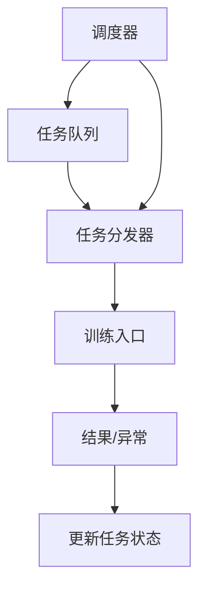
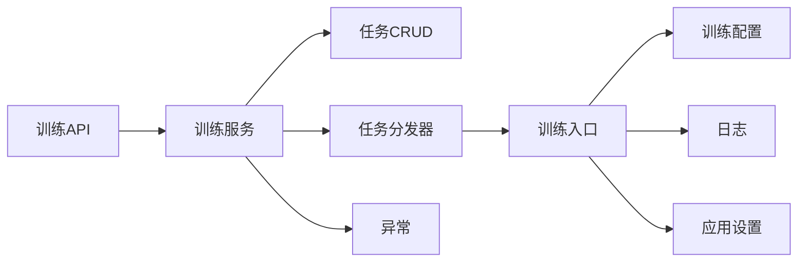

# 训练配置管理

<cite>
**本文引用的文件**   
- [backend/app/services/train/config.py](file://backend/app/services/train/config.py)
- [backend/app/services/train/train_lvis.py](file://backend/app/services/train/train_lvis.py)
- [backend/app/services/training_service.py](file://backend/app/services/training_service.py)
- [backend/app/api/training.py](file://backend/app/api/training.py)
- [backend/app/schemas/training.py](file://backend/app/schemas/training.py)
- [backend/app/models/training.py](file://backend/app/models/training.py)
- [backend/app/crud/task.py](file://backend/app/crud/task.py)
- [backend/app/tasks/dispatcher.py](file://backend/app/tasks/dispatcher.py)
- [backend/app/tasks/scheduler.py](file://backend/app/tasks/scheduler.py)
- [backend/app/core/logger.py](file://backend/app/core/logger.py)
- [backend/app/core/exceptions.py](file://backend/app/core/exceptions.py)
- [backend/app/config/settings.py](file://backend/app/config/settings.py)
- [backend/app/services/train/README.md](file://backend/app/services/train/README.md)
- [backend/app/services/train/TRAINING_GUIDE.md](file://backend/app/services/train/TRAINING_GUIDE.md)
</cite>

## 目录
1. [简介](#简介)
2. [项目结构](#项目结构)
3. [核心组件](#核心组件)
4. [架构总览](#架构总览)
5. [详细组件分析](#详细组件分析)
6. [依赖关系分析](#依赖关系分析)
7. [性能考虑](#性能考虑)
8. [故障排查指南](#故障排查指南)
9. [结论](#结论)
10. [附录](#附录)

## 简介
本文件面向“训练配置管理系统”，围绕训练参数的结构化配置、配置文件格式、环境变量支持、动态参数调整机制、不同训练场景的配置模板、参数验证与默认值管理、配置版本控制、参数继承机制以及配置热重载能力进行系统化说明。文档同时提供常见训练任务的配置示例与参数调优指南，帮助读者快速上手并高效迭代模型训练流程。

## 项目结构
训练配置相关代码主要分布在后端服务的训练子模块与任务调度层：
- 训练配置定义与加载：位于训练服务目录下的配置模块
- 训练入口与执行：训练脚本与训练服务编排
- API 与数据模型：对外暴露的训练任务接口、请求/响应模式与持久化模型
- 任务调度与分发：后台任务队列与调度器
- 日志与异常：统一日志记录与异常类型
- 应用级设置与环境变量：全局配置与环境注入

图表来源
- [backend/app/services/train/config.py](file://backend/app/services/train/config.py)
- [backend/app/services/train/train_lvis.py](file://backend/app/services/train/train_lvis.py)
- [backend/app/services/training_service.py](file://backend/app/services/training_service.py)
- [backend/app/api/training.py](file://backend/app/api/training.py)
- [backend/app/schemas/training.py](file://backend/app/schemas/training.py)
- [backend/app/models/training.py](file://backend/app/models/training.py)
- [backend/app/crud/task.py](file://backend/app/crud/task.py)
- [backend/app/tasks/dispatcher.py](file://backend/app/tasks/dispatcher.py)
- [backend/app/tasks/scheduler.py](file://backend/app/tasks/scheduler.py)
- [backend/app/core/logger.py](file://backend/app/core/logger.py)
- [backend/app/core/exceptions.py](file://backend/app/core/exceptions.py)
- [backend/app/config/settings.py](file://backend/app/config/settings.py)
- [backend/app/services/train/README.md](file://backend/app/services/train/README.md)
- [backend/app/services/train/TRAINING_GUIDE.md](file://backend/app/services/train/TRAINING_GUIDE.md)

章节来源
- [backend/app/services/train/config.py](file://backend/app/services/train/config.py)
- [backend/app/services/train/train_lvis.py](file://backend/app/services/train/train_lvis.py)
- [backend/app/services/training_service.py](file://backend/app/services/training_service.py)
- [backend/app/api/training.py](file://backend/app/api/training.py)
- [backend/app/schemas/training.py](file://backend/app/schemas/training.py)
- [backend/app/models/training.py](file://backend/app/models/training.py)
- [backend/app/crud/task.py](file://backend/app/crud/task.py)
- [backend/app/tasks/dispatcher.py](file://backend/app/tasks/dispatcher.py)
- [backend/app/tasks/scheduler.py](file://backend/app/tasks/scheduler.py)
- [backend/app/core/logger.py](file://backend/app/core/logger.py)
- [backend/app/core/exceptions.py](file://backend/app/core/exceptions.py)
- [backend/app/config/settings.py](file://backend/app/config/settings.py)
- [backend/app/services/train/README.md](file://backend/app/services/train/README.md)
- [backend/app/services/train/TRAINING_GUIDE.md](file://backend/app/services/train/TRAINING_GUIDE.md)

## 核心组件
- 训练配置模块：负责解析、校验、合并与导出训练参数；支持从配置文件与环境变量加载；提供默认值与版本兼容逻辑。
- 训练入口：读取配置并驱动具体训练流程（如 LVIS 目标检测训练），将配置转换为训练框架所需的运行时参数。
- 训练服务：封装训练生命周期管理，包括任务创建、状态更新、结果落库、错误处理与日志输出。
- API 层：提供训练任务提交、查询、停止等接口，并对输入进行模式校验。
- 任务调度：基于任务队列的分发与调度，确保训练任务在合适的资源上执行。
- 日志与异常：统一的日志记录与异常分类，便于问题定位与监控告警。
- 应用设置：集中管理应用级配置与环境变量映射。

章节来源
- [backend/app/services/train/config.py](file://backend/app/services/train/config.py)
- [backend/app/services/train/train_lvis.py](file://backend/app/services/train/train_lvis.py)
- [backend/app/services/training_service.py](file://backend/app/services/training_service.py)
- [backend/app/api/training.py](file://backend/app/api/training.py)
- [backend/app/tasks/dispatcher.py](file://backend/app/tasks/dispatcher.py)
- [backend/app/tasks/scheduler.py](file://backend/app/tasks/scheduler.py)
- [backend/app/core/logger.py](file://backend/app/core/logger.py)
- [backend/app/core/exceptions.py](file://backend/app/core/exceptions.py)
- [backend/app/config/settings.py](file://backend/app/config/settings.py)

## 架构总览
下图展示了从用户发起训练到任务执行的端到端流程，以及配置在各环节中的流转方式。

图表来源
- [backend/app/api/training.py](file://backend/app/api/training.py)
- [backend/app/services/training_service.py](file://backend/app/services/training_service.py)
- [backend/app/crud/task.py](file://backend/app/crud/task.py)
- [backend/app/tasks/dispatcher.py](file://backend/app/tasks/dispatcher.py)
- [backend/app/services/train/train_lvis.py](file://backend/app/services/train/train_lvis.py)
- [backend/app/services/train/config.py](file://backend/app/services/train/config.py)
- [backend/app/core/logger.py](file://backend/app/core/logger.py)
- [backend/app/core/exceptions.py](file://backend/app/core/exceptions.py)

## 详细组件分析

### 训练配置模块（结构与行为）
- 配置来源优先级：
  - 配置文件（JSON/YAML/TOML，依据实现选择）
  - 环境变量覆盖
  - 默认值兜底
- 参数分组与命名空间：
  - 模型超参数（如网络结构、预训练权重路径、输入尺寸等）
  - 优化器设置（学习率、权重衰减、动量、梯度裁剪等）
  - 学习率调度器（策略、预热、余弦退火、步长等）
  - 早停策略（耐心轮数、监控指标、阈值容忍度）
- 配置校验与默认值：
  - 字段存在性检查、取值范围约束、类型转换
  - 缺失字段使用默认值或回退策略
- 版本兼容与继承：
  - 通过版本号或标签区分配置版本
  - 支持基线配置继承与局部覆盖
- 动态参数调整与热重载：
  - 运行期可监听配置变更事件
  - 对支持热更新的参数（如学习率、早停阈值）进行平滑切换
  - 对不可热更新的参数（如网络结构）在下一周期生效

图表来源
- [backend/app/services/train/config.py](file://backend/app/services/train/config.py)

章节来源
- [backend/app/services/train/config.py](file://backend/app/services/train/config.py)

### 训练入口（LVIS 目标检测）
- 职责：
  - 接收配置对象并转换为训练框架所需参数
  - 初始化数据集、模型、优化器与调度器
  - 执行训练循环，集成早停与指标监控
  - 保存中间与最终模型权重
- 与配置的交互：
  - 读取模型超参数以构建网络
  - 根据优化器与调度器配置初始化相应组件
  - 根据早停策略判断是否提前终止
- 错误处理与日志：
  - 捕获训练异常并记录上下文
  - 输出关键指标与进度信息

图表来源
- [backend/app/services/train/train_lvis.py](file://backend/app/services/train/train_lvis.py)
- [backend/app/services/train/config.py](file://backend/app/services/train/config.py)

章节来源
- [backend/app/services/train/train_lvis.py](file://backend/app/services/train/train_lvis.py)
- [backend/app/services/train/config.py](file://backend/app/services/train/config.py)

### 训练服务（生命周期与状态管理）
- 功能：
  - 创建训练任务并持久化
  - 协调任务分发器执行训练
  - 更新任务状态（排队、运行中、成功、失败）
  - 收集并存储训练结果与元数据
- 与 API 的协作：
  - 接收来自 API 的请求并进行模式校验
  - 返回任务 ID 与当前状态供前端轮询
- 与日志和异常的协作：
  - 记录关键操作与错误堆栈
  - 抛出标准化异常以便上层统一处理

图表来源
- [backend/app/api/training.py](file://backend/app/api/training.py)
- [backend/app/services/training_service.py](file://backend/app/services/training_service.py)
- [backend/app/crud/task.py](file://backend/app/crud/task.py)
- [backend/app/tasks/dispatcher.py](file://backend/app/tasks/dispatcher.py)
- [backend/app/services/train/train_lvis.py](file://backend/app/services/train/train_lvis.py)
- [backend/app/core/logger.py](file://backend/app/core/logger.py)
- [backend/app/core/exceptions.py](file://backend/app/core/exceptions.py)

章节来源
- [backend/app/services/training_service.py](file://backend/app/services/training_service.py)
- [backend/app/api/training.py](file://backend/app/api/training.py)
- [backend/app/crud/task.py](file://backend/app/crud/task.py)
- [backend/app/tasks/dispatcher.py](file://backend/app/tasks/dispatcher.py)
- [backend/app/core/logger.py](file://backend/app/core/logger.py)
- [backend/app/core/exceptions.py](file://backend/app/core/exceptions.py)

### API 与数据模型（接口契约）
- 训练 API：
  - 提交训练任务：接收配置片段与任务描述
  - 查询任务状态：按任务 ID 获取当前状态与进度
  - 停止任务：向任务分发器发送停止信号
- Schema 校验：
  - 对请求体进行必填字段、类型与取值范围校验
  - 为可选字段提供默认值
- 数据模型：
  - 任务实体：包含任务 ID、状态、配置快照、结果路径等
  - 训练结果：包含指标、权重路径、日志摘要等

图表来源
- [backend/app/models/training.py](file://backend/app/models/training.py)
- [backend/app/schemas/training.py](file://backend/app/schemas/training.py)
- [backend/app/api/training.py](file://backend/app/api/training.py)

章节来源
- [backend/app/api/training.py](file://backend/app/api/training.py)
- [backend/app/schemas/training.py](file://backend/app/schemas/training.py)
- [backend/app/models/training.py](file://backend/app/models/training.py)

### 任务调度与分发
- 任务分发器：
  - 从队列拉取训练任务
  - 调用训练入口执行
  - 处理执行结果与异常
- 任务调度器：
  - 定时扫描与重试失败任务
  - 维护任务优先级与资源分配策略

图表来源
- [backend/app/tasks/dispatcher.py](file://backend/app/tasks/dispatcher.py)
- [backend/app/tasks/scheduler.py](file://backend/app/tasks/scheduler.py)
- [backend/app/services/train/train_lvis.py](file://backend/app/services/train/train_lvis.py)

章节来源
- [backend/app/tasks/dispatcher.py](file://backend/app/tasks/dispatcher.py)
- [backend/app/tasks/scheduler.py](file://backend/app/tasks/scheduler.py)

### 环境变量与应用设置
- 环境变量：
  - 数据库连接、存储路径、GPU 设备、并发度等
  - 可通过前缀或命名空间隔离不同环境（开发/测试/生产）
- 应用设置：
  - 集中读取环境变量并转换为强类型配置
  - 提供默认值与校验规则

章节来源
- [backend/app/config/settings.py](file://backend/app/config/settings.py)

## 依赖关系分析
- 低耦合高内聚：
  - 配置模块独立于训练入口，仅通过配置对象传递参数
  - 训练服务与 API 解耦，通过任务队列异步执行
- 外部依赖：
  - 任务队列与调度器（可能基于消息队列或内存队列）
  - 存储系统（模型权重、日志、结果）
  - 训练框架（如 PyTorch、Detectron2 等，具体取决于训练入口实现）

图表来源
- [backend/app/api/training.py](file://backend/app/api/training.py)
- [backend/app/services/training_service.py](file://backend/app/services/training_service.py)
- [backend/app/crud/task.py](file://backend/app/crud/task.py)
- [backend/app/tasks/dispatcher.py](file://backend/app/tasks/dispatcher.py)
- [backend/app/services/train/train_lvis.py](file://backend/app/services/train/train_lvis.py)
- [backend/app/services/train/config.py](file://backend/app/services/train/config.py)
- [backend/app/core/logger.py](file://backend/app/core/logger.py)
- [backend/app/core/exceptions.py](file://backend/app/core/exceptions.py)
- [backend/app/config/settings.py](file://backend/app/config/settings.py)

章节来源
- [backend/app/api/training.py](file://backend/app/api/training.py)
- [backend/app/services/training_service.py](file://backend/app/services/training_service.py)
- [backend/app/crud/task.py](file://backend/app/crud/task.py)
- [backend/app/tasks/dispatcher.py](file://backend/app/tasks/dispatcher.py)
- [backend/app/services/train/train_lvis.py](file://backend/app/services/train/train_lvis.py)
- [backend/app/services/train/config.py](file://backend/app/services/train/config.py)
- [backend/app/core/logger.py](file://backend/app/core/logger.py)
- [backend/app/core/exceptions.py](file://backend/app/core/exceptions.py)
- [backend/app/config/settings.py](file://backend/app/config/settings.py)

## 性能考虑
- 批大小与显存：
  - 增大批大小可提升吞吐但增加显存占用，需结合 GPU 能力调整
- 学习率与调度：
  - 合理的学习率与调度策略有助于收敛速度与稳定性
- 早停与监控：
  - 选择合适的监控指标与耐心轮数，避免过早终止或过拟合
- I/O 与缓存：
  - 数据加载与预处理应尽可能并行与缓存，减少瓶颈
- 任务并发：
  - 根据资源限制合理设置并发度，避免争用导致抖动

[本节为通用指导，不直接分析具体文件]

## 故障排查指南
- 常见问题：
  - 配置缺失或类型错误：检查必填字段与类型约束，确认环境变量是否正确注入
  - 训练中断：查看日志与异常堆栈，确认资源不足或数据损坏
  - 早停误触发：调整耐心轮数与监控指标阈值
  - 任务未执行：检查任务队列与调度器状态，确认分发器是否正常拉取
- 定位手段：
  - 启用更详细的日志级别
  - 输出配置快照与关键中间状态
  - 使用任务 ID 追踪全链路日志

章节来源
- [backend/app/core/logger.py](file://backend/app/core/logger.py)
- [backend/app/core/exceptions.py](file://backend/app/core/exceptions.py)
- [backend/app/services/training_service.py](file://backend/app/services/training_service.py)
- [backend/app/tasks/dispatcher.py](file://backend/app/tasks/dispatcher.py)

## 结论
训练配置管理系统通过模块化设计实现了配置的可维护性与可扩展性。借助配置文件、环境变量与默认值的组合，配合严格的校验与版本兼容机制，系统在多种训练场景中具备良好的一致性与鲁棒性。结合任务调度与日志异常体系，整体流程清晰可控，便于持续优化与运维。

[本节为总结性内容，不直接分析具体文件]

## 附录

### 配置文件格式与环境变量支持
- 配置文件：
  - 建议采用 JSON/YAML/TOML 中的一种，保持键名一致与层级清晰
  - 支持嵌套结构，按模块划分（模型、优化器、调度器、早停等）
- 环境变量：
  - 使用前缀或命名空间区分不同环境
  - 支持字符串、数值、布尔与列表类型的映射
- 默认值管理：
  - 为所有关键参数提供合理的默认值
  - 缺失字段自动回退至默认值，避免启动失败

章节来源
- [backend/app/services/train/config.py](file://backend/app/services/train/config.py)
- [backend/app/config/settings.py](file://backend/app/config/settings.py)

### 动态参数调整与热重载
- 可热更新参数：
  - 学习率、早停阈值、监控窗口等
- 不可热更新参数：
  - 网络结构、输入尺寸、优化器类型等
- 热重载机制：
  - 监听配置变更事件
  - 在安全边界内平滑切换参数
  - 对不支持热更新的参数在下一次训练周期生效

章节来源
- [backend/app/services/train/config.py](file://backend/app/services/train/config.py)

### 配置版本控制与参数继承
- 版本控制：
  - 通过版本号或标签标识配置版本
  - 迁移脚本保证旧版本配置在新系统中可用
- 参数继承：
  - 支持基线配置与局部覆盖
  - 多环境差异化配置通过继承与覆盖实现

章节来源
- [backend/app/services/train/config.py](file://backend/app/services/train/config.py)

### 参数验证规则与默认值管理
- 验证规则：
  - 必填字段检查
  - 取值范围与类型约束
  - 跨字段一致性校验（如学习率与批大小的匹配）
- 默认值管理：
  - 分层默认值（全局、模块、任务）
  - 缺失字段自动填充

章节来源
- [backend/app/services/train/config.py](file://backend/app/services/train/config.py)

### 不同训练场景的配置模板
- 快速实验：
  - 较小批大小、较短训练轮数、宽松早停
- 稳定收敛：
  - 较大批大小、较长训练轮数、严格早停
- 大规模数据：
  - 高并发数据加载、分布式训练、更强正则化

章节来源
- [backend/app/services/train/TRAINING_GUIDE.md](file://backend/app/services/train/TRAINING_GUIDE.md)
- [backend/app/services/train/README.md](file://backend/app/services/train/README.md)

### 常见训练任务的配置示例与调优指南
- 目标检测（LVIS）：
  - 模型：选择合适的主干网络与预训练权重
  - 优化器：学习率与权重衰减的平衡
  - 调度器：预热与余弦退火的组合
  - 早停：以验证集 mAP 为监控指标
- 图像分类：
  - 输入尺寸与数据增强强度
  - 学习率步进与批量归一化
- 人脸检测：
  - 小目标检测的正则化与锚点策略
  - 早停与模型选择策略

章节来源
- [backend/app/services/train/TRAINING_GUIDE.md](file://backend/app/services/train/TRAINING_GUIDE.md)
- [backend/app/services/train/train_lvis.py](file://backend/app/services/train/train_lvis.py)