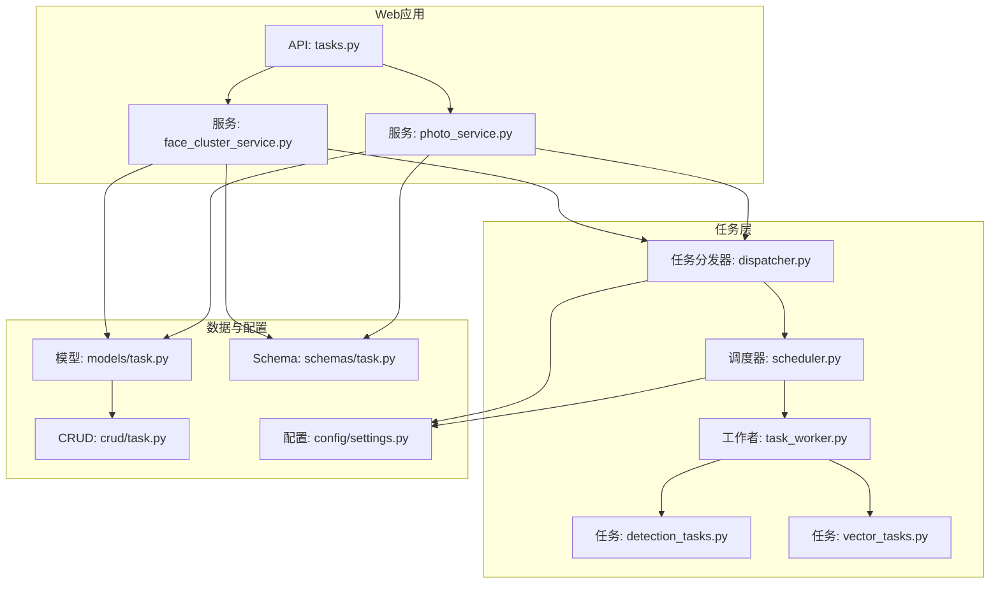
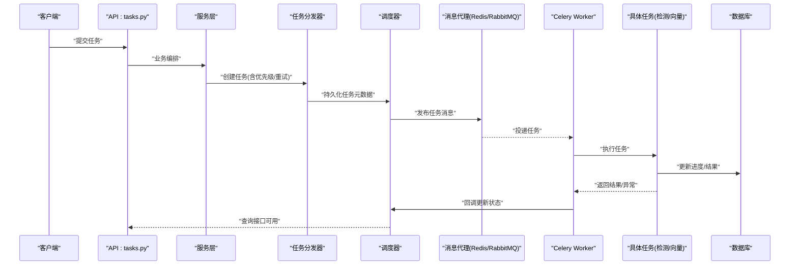
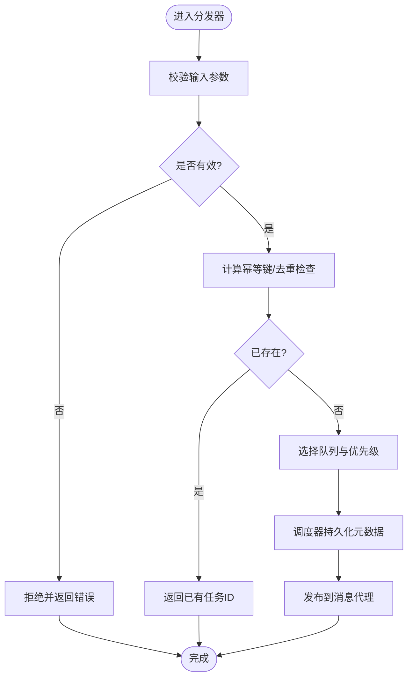
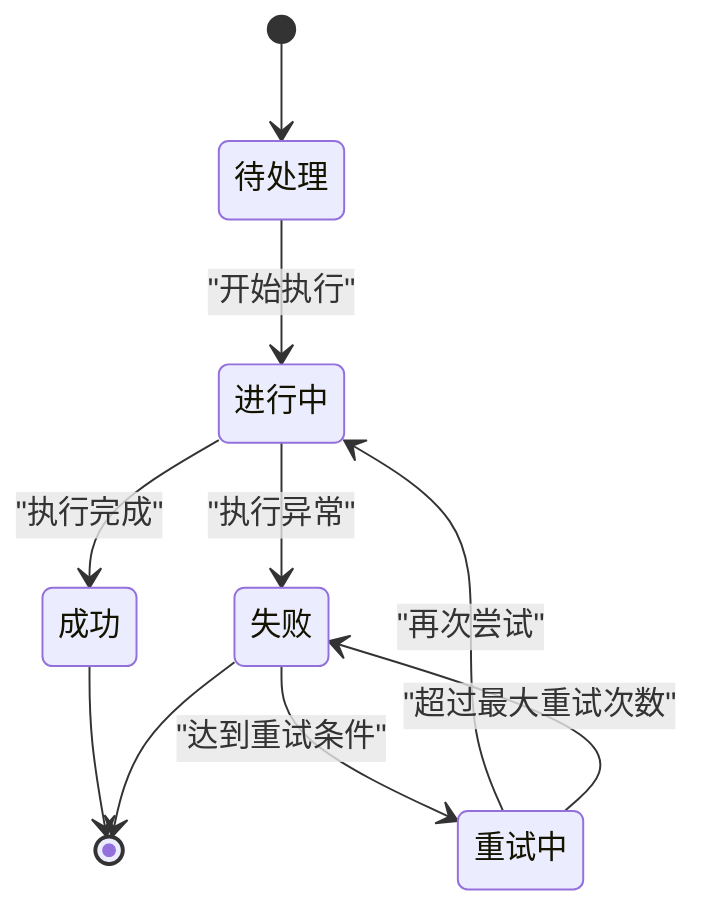
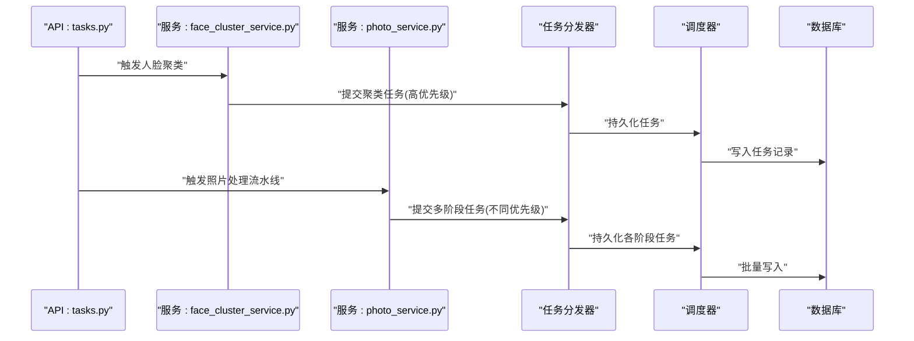
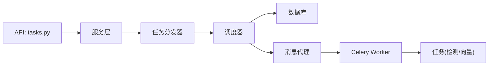

# 任务调度架构

<cite>
**本文引用的文件**   
- [backend/app/tasks/dispatcher.py](file://backend/app/tasks/dispatcher.py)
- [backend/app/tasks/scheduler.py](file://backend/app/tasks/scheduler.py)
- [backend/app/tasks/task_worker.py](file://backend/app/tasks/task_worker.py)
- [backend/app/tasks/detection_tasks.py](file://backend/app/tasks/detection_tasks.py)
- [backend/app/tasks/vector_tasks.py](file://backend/app/tasks/vector_tasks.py)
- [backend/app/api/tasks.py](file://backend/app/api/tasks.py)
- [backend/app/models/task.py](file://backend/app/models/task.py)
- [backend/app/crud/task.py](file://backend/app/crud/task.py)
- [backend/app/schemas/task.py](file://backend/app/schemas/task.py)
- [backend/app/services/face_cluster_service.py](file://backend/app/services/face_cluster_service.py)
- [backend/app/services/photo_service.py](file://backend/app/services/photo_service.py)
- [backend/app/config/settings.py](file://backend/app/config/settings.py)
- [backend/main.py](file://backend/main.py)
</cite>

## 目录
1. [简介](#简介)
2. [项目结构](#项目结构)
3. [核心组件](#核心组件)
4. [架构总览](#架构总览)
5. [详细组件分析](#详细组件分析)
6. [依赖关系分析](#依赖关系分析)
7. [性能与扩展性](#性能与扩展性)
8. [故障排查指南](#故障排查指南)
9. [结论](#结论)
10. [附录：任务编写与管理最佳实践](#附录任务编写与管理最佳实践)

## 简介
本文件面向AI智能相册管理系统的任务调度子系统，系统性阐述基于Celery的异步任务队列设计。内容覆盖任务分发器、调度器与工作者节点的协作机制；任务类型定义、优先级管理与重试策略；任务监控、进度跟踪与错误处理；分布式扩展与性能优化；并提供可落地的任务编写示例与管理最佳实践。

## 项目结构
任务调度相关代码主要位于后端模块中，围绕“API层 -> 服务层 -> 任务层 -> Celery执行”的分层组织：
- API层：提供任务提交、查询、管理等HTTP接口
- 服务层：封装业务编排逻辑，负责将工作拆分为任务并调用任务分发器
- 任务层：定义具体任务（检测、向量等），实现幂等、重试、进度上报
- 配置与模型：集中式配置、数据库模型与Schema校验

图表来源
- [backend/app/api/tasks.py](file://backend/app/api/tasks.py)
- [backend/app/services/face_cluster_service.py](file://backend/app/services/face_cluster_service.py)
- [backend/app/services/photo_service.py](file://backend/app/services/photo_service.py)
- [backend/app/tasks/dispatcher.py](file://backend/app/tasks/dispatcher.py)
- [backend/app/tasks/scheduler.py](file://backend/app/tasks/scheduler.py)
- [backend/app/tasks/task_worker.py](file://backend/app/tasks/task_worker.py)
- [backend/app/tasks/detection_tasks.py](file://backend/app/tasks/detection_tasks.py)
- [backend/app/tasks/vector_tasks.py](file://backend/app/tasks/vector_tasks.py)
- [backend/app/models/task.py](file://backend/app/models/task.py)
- [backend/app/crud/task.py](file://backend/app/crud/task.py)
- [backend/app/schemas/task.py](file://backend/app/schemas/task.py)
- [backend/app/config/settings.py](file://backend/app/config/settings.py)

章节来源
- [backend/app/api/tasks.py](file://backend/app/api/tasks.py)
- [backend/app/tasks/dispatcher.py](file://backend/app/tasks/dispatcher.py)
- [backend/app/tasks/scheduler.py](file://backend/app/tasks/scheduler.py)
- [backend/app/tasks/task_worker.py](file://backend/app/tasks/task_worker.py)
- [backend/app/tasks/detection_tasks.py](file://backend/app/tasks/detection_tasks.py)
- [backend/app/tasks/vector_tasks.py](file://backend/app/tasks/vector_tasks.py)
- [backend/app/models/task.py](file://backend/app/models/task.py)
- [backend/app/crud/task.py](file://backend/app/crud/task.py)
- [backend/app/schemas/task.py](file://backend/app/schemas/task.py)
- [backend/app/services/face_cluster_service.py](file://backend/app/services/face_cluster_service.py)
- [backend/app/services/photo_service.py](file://backend/app/services/photo_service.py)
- [backend/app/config/settings.py](file://backend/app/config/settings.py)

## 核心组件
- 任务分发器：统一接收来自服务层的任务请求，进行参数校验、路由、优先级选择与入队。
- 调度器：维护任务生命周期状态、持久化元数据、触发重试与补偿逻辑。
- 工作者节点：运行Celery Worker进程，消费队列中的任务并执行业务逻辑。
- 任务类型：按领域划分（如人脸检测、聚类、向量化等），每个任务具备幂等性与可重试能力。
- 监控与进度：通过任务结果存储与状态更新接口，为前端或运维提供可视化与告警基础。
- 错误处理：捕获异常、记录日志、自动重试与失败降级。

章节来源
- [backend/app/tasks/dispatcher.py](file://backend/app/tasks/dispatcher.py)
- [backend/app/tasks/scheduler.py](file://backend/app/tasks/scheduler.py)
- [backend/app/tasks/task_worker.py](file://backend/app/tasks/task_worker.py)
- [backend/app/tasks/detection_tasks.py](file://backend/app/tasks/detection_tasks.py)
- [backend/app/tasks/vector_tasks.py](file://backend/app/tasks/vector_tasks.py)

## 架构总览
下图展示了从API到任务执行的端到端流程，包括任务创建、入队、调度、执行与结果回写。

图表来源
- [backend/app/api/tasks.py](file://backend/app/api/tasks.py)
- [backend/app/tasks/dispatcher.py](file://backend/app/tasks/dispatcher.py)
- [backend/app/tasks/scheduler.py](file://backend/app/tasks/scheduler.py)
- [backend/app/tasks/task_worker.py](file://backend/app/tasks/task_worker.py)
- [backend/app/tasks/detection_tasks.py](file://backend/app/tasks/detection_tasks.py)
- [backend/app/tasks/vector_tasks.py](file://backend/app/tasks/vector_tasks.py)
- [backend/app/models/task.py](file://backend/app/models/task.py)
- [backend/app/crud/task.py](file://backend/app/crud/task.py)

## 详细组件分析

### 任务分发器（dispatcher）
职责
- 接收服务层任务请求，完成参数校验与标准化
- 根据任务类型与负载情况选择目标队列与优先级
- 调用调度器持久化任务元数据，并向消息代理发布任务
- 支持批量任务拆分与批大小控制

关键设计点
- 幂等键：避免重复提交导致重复执行
- 优先级映射：将业务优先级映射到队列或Celery优先级字段
- 超时与限流：在入队前做快速失败判断，防止过载

图表来源
- [backend/app/tasks/dispatcher.py](file://backend/app/tasks/dispatcher.py)
- [backend/app/tasks/scheduler.py](file://backend/app/tasks/scheduler.py)

章节来源
- [backend/app/tasks/dispatcher.py](file://backend/app/tasks/dispatcher.py)
- [backend/app/tasks/scheduler.py](file://backend/app/tasks/scheduler.py)

### 调度器（scheduler）
职责
- 维护任务状态机（待处理、进行中、成功、失败、重试中）
- 管理重试策略（次数、退避算法、最大延迟）
- 提供任务查询与统计接口，支撑监控面板
- 与数据库交互，保证状态一致性

关键设计点
- 状态变更原子性：使用事务或乐观锁避免竞态
- 重试退避：指数退避+抖动，降低雪崩风险
- 超时控制：结合任务级与全局级超时

图表来源
- [backend/app/tasks/scheduler.py](file://backend/app/tasks/scheduler.py)
- [backend/app/models/task.py](file://backend/app/models/task.py)
- [backend/app/crud/task.py](file://backend/app/crud/task.py)

章节来源
- [backend/app/tasks/scheduler.py](file://backend/app/tasks/scheduler.py)
- [backend/app/models/task.py](file://backend/app/models/task.py)
- [backend/app/crud/task.py](file://backend/app/crud/task.py)

### 工作者节点（task_worker）
职责
- 启动Celery Worker进程，订阅指定队列
- 加载任务注册表，分派到对应任务处理器
- 处理心跳、健康检查与优雅退出
- 收集执行指标（耗时、吞吐、错误率）

关键设计点
- 并发度与预取数：根据CPU/GPU资源与I/O特性调优
- 隔离执行环境：按需启用虚拟环境或容器隔离
- 资源清理：确保临时文件与连接释放

章节来源
- [backend/app/tasks/task_worker.py](file://backend/app/tasks/task_worker.py)
- [backend/main.py](file://backend/main.py)

### 任务类型：检测任务（detection_tasks）
职责
- 执行图像/视频的人脸检测、属性识别等
- 产出结构化检测结果，写入数据库或对象存储
- 支持分片处理与大图裁剪并行

关键设计点
- 分片策略：按区域或帧切分，合并结果时去重
- 中间结果缓存：避免重复计算
- 失败恢复：断点续算与增量更新

章节来源
- [backend/app/tasks/detection_tasks.py](file://backend/app/tasks/detection_tasks.py)

### 任务类型：向量任务（vector_tasks）
职责
- 生成图片/人脸特征向量，写入向量库
- 与检索服务协同，保障索引一致性
- 支持批量入库与增量同步

关键设计点
- 批量写入：减少网络往返与锁竞争
- 冲突解决：以时间戳或版本号作为最终一致依据
- 回滚策略：批量失败时整体回滚

章节来源
- [backend/app/tasks/vector_tasks.py](file://backend/app/tasks/vector_tasks.py)

### API与服务层集成
- API层暴露任务提交、查询、取消、重试等接口
- 服务层负责业务编排，将复杂流程拆解为多个子任务
- 典型场景：人脸聚类、照片服务流水线

图表来源
- [backend/app/api/tasks.py](file://backend/app/api/tasks.py)
- [backend/app/services/face_cluster_service.py](file://backend/app/services/face_cluster_service.py)
- [backend/app/services/photo_service.py](file://backend/app/services/photo_service.py)
- [backend/app/tasks/dispatcher.py](file://backend/app/tasks/dispatcher.py)
- [backend/app/tasks/scheduler.py](file://backend/app/tasks/scheduler.py)
- [backend/app/models/task.py](file://backend/app/models/task.py)
- [backend/app/crud/task.py](file://backend/app/crud/task.py)

章节来源
- [backend/app/api/tasks.py](file://backend/app/api/tasks.py)
- [backend/app/services/face_cluster_service.py](file://backend/app/services/face_cluster_service.py)
- [backend/app/services/photo_service.py](file://backend/app/services/photo_service.py)
- [backend/app/tasks/dispatcher.py](file://backend/app/tasks/dispatcher.py)
- [backend/app/tasks/scheduler.py](file://backend/app/tasks/scheduler.py)
- [backend/app/models/task.py](file://backend/app/models/task.py)
- [backend/app/crud/task.py](file://backend/app/crud/task.py)

## 依赖关系分析
- 组件耦合
  - API仅依赖服务层，不直接访问任务层，保持清晰边界
  - 服务层通过任务分发器解耦业务与执行细节
  - 调度器与数据库强耦合，需保证读写一致性与事务正确性
- 外部依赖
  - 消息代理（Redis/RabbitMQ）用于任务传输
  - 数据库用于任务元数据与结果持久化
  - 可选：监控与告警系统对接

图表来源
- [backend/app/api/tasks.py](file://backend/app/api/tasks.py)
- [backend/app/tasks/dispatcher.py](file://backend/app/tasks/dispatcher.py)
- [backend/app/tasks/scheduler.py](file://backend/app/tasks/scheduler.py)
- [backend/app/tasks/task_worker.py](file://backend/app/tasks/task_worker.py)
- [backend/app/tasks/detection_tasks.py](file://backend/app/tasks/detection_tasks.py)
- [backend/app/tasks/vector_tasks.py](file://backend/app/tasks/vector_tasks.py)
- [backend/app/models/task.py](file://backend/app/models/task.py)
- [backend/app/crud/task.py](file://backend/app/crud/task.py)

章节来源
- [backend/app/api/tasks.py](file://backend/app/api/tasks.py)
- [backend/app/tasks/dispatcher.py](file://backend/app/tasks/dispatcher.py)
- [backend/app/tasks/scheduler.py](file://backend/app/tasks/scheduler.py)
- [backend/app/tasks/task_worker.py](file://backend/app/tasks/task_worker.py)
- [backend/app/tasks/detection_tasks.py](file://backend/app/tasks/detection_tasks.py)
- [backend/app/tasks/vector_tasks.py](file://backend/app/tasks/vector_tasks.py)
- [backend/app/models/task.py](file://backend/app/models/task.py)
- [backend/app/crud/task.py](file://backend/app/crud/task.py)

## 性能与扩展性
- 队列与优先级
  - 按业务域拆分队列（检测、向量、通用），避免热点阻塞
  - 使用优先级队列或权重队列区分紧急任务
- 并发与资源
  - 调整Worker并发度与预取数，匹配CPU/GPU与I/O特性
  - 对GPU密集型任务采用专用队列与隔离Worker
- 批处理与合并
  - 向量入库采用批量写入，减少锁与网络开销
  - 检测结果合并阶段引入去重与增量更新
- 重试与退避
  - 指数退避+随机抖动，避免重试风暴
  - 设置最大重试次数与死信队列，便于人工干预
- 监控与观测
  - 采集任务耗时、成功率、队列长度、消费者数量
  - 关键路径埋点，定位瓶颈与异常
- 水平扩展
  - 无状态Worker横向扩容，配合消息代理分区与负载均衡
  - 数据库读写分离与连接池优化，避免成为瓶颈

[本节为通用指导，无需列出具体文件来源]

## 故障排查指南
- 常见问题
  - 任务堆积：检查Worker健康、队列长度、消费者数量与资源占用
  - 任务失败：查看错误日志、重试次数、是否命中最大重试上限
  - 进度不更新：确认任务内进度上报逻辑与数据库写入是否成功
  - 重复执行：核对幂等键设计与去重逻辑
- 诊断步骤
  - 查看任务状态与历史变更记录
  - 检查消息代理连接与队列深度
  - 验证Worker日志与系统资源（CPU/GPU/内存/磁盘）
  - 复现最小用例，逐步缩小问题范围
- 恢复策略
  - 对失败任务进行手动重试或迁移至死信队列
  - 对长时间未完成任务进行强制终止与清理
  - 必要时重启Worker或扩容实例

章节来源
- [backend/app/tasks/scheduler.py](file://backend/app/tasks/scheduler.py)
- [backend/app/tasks/task_worker.py](file://backend/app/tasks/task_worker.py)
- [backend/app/models/task.py](file://backend/app/models/task.py)
- [backend/app/crud/task.py](file://backend/app/crud/task.py)

## 结论
本任务调度架构通过分层解耦、明确职责与完善的状态管理，实现了高可靠、可扩展的异步处理能力。借助合理的优先级、重试与监控机制，系统可在大规模媒体处理场景中保持稳定与高效。后续建议持续完善观测体系与自动化运维能力，进一步提升稳定性与可维护性。

[本节为总结性内容，无需列出具体文件来源]

## 附录：任务编写与管理最佳实践
- 任务设计
  - 幂等性：同一任务多次执行应产生相同结果
  - 可重试：仅对瞬时错误重试，业务错误不应重试
  - 可中断：长任务支持阶段性保存与恢复
- 参数与校验
  - 严格校验输入，尽早失败
  - 使用Schema约束，避免脏数据进入队列
- 进度与结果
  - 定期上报进度，便于前端展示与超时判定
  - 结果结构化，包含必要元数据与错误信息
- 资源与并发
  - 合理设置并发度与预取数
  - 大对象走对象存储，避免消息体过大
- 监控与告警
  - 关键指标接入监控系统
  - 设置阈值告警与自愈策略
- 示例参考路径
  - 任务类型定义与实现：[backend/app/tasks/detection_tasks.py](file://backend/app/tasks/detection_tasks.py)、[backend/app/tasks/vector_tasks.py](file://backend/app/tasks/vector_tasks.py)
  - 任务分发与调度：[backend/app/tasks/dispatcher.py](file://backend/app/tasks/dispatcher.py)、[backend/app/tasks/scheduler.py](file://backend/app/tasks/scheduler.py)
  - 工作者与入口：[backend/app/tasks/task_worker.py](file://backend/app/tasks/task_worker.py)、[backend/main.py](file://backend/main.py)
  - 模型与CRUD：[backend/app/models/task.py](file://backend/app/models/task.py)、[backend/app/crud/task.py](file://backend/app/crud/task.py)
  - Schema校验：[backend/app/schemas/task.py](file://backend/app/schemas/task.py)
  - 服务层集成：[backend/app/services/face_cluster_service.py](file://backend/app/services/face_cluster_service.py)、[backend/app/services/photo_service.py](file://backend/app/services/photo_service.py)
  - 配置项：[backend/app/config/settings.py](file://backend/app/config/settings.py)

章节来源
- [backend/app/tasks/detection_tasks.py](file://backend/app/tasks/detection_tasks.py)
- [backend/app/tasks/vector_tasks.py](file://backend/app/tasks/vector_tasks.py)
- [backend/app/tasks/dispatcher.py](file://backend/app/tasks/dispatcher.py)
- [backend/app/tasks/scheduler.py](file://backend/app/tasks/scheduler.py)
- [backend/app/tasks/task_worker.py](file://backend/app/tasks/task_worker.py)
- [backend/main.py](file://backend/main.py)
- [backend/app/models/task.py](file://backend/app/models/task.py)
- [backend/app/crud/task.py](file://backend/app/crud/task.py)
- [backend/app/schemas/task.py](file://backend/app/schemas/task.py)
- [backend/app/services/face_cluster_service.py](file://backend/app/services/face_cluster_service.py)
- [backend/app/services/photo_service.py](file://backend/app/services/photo_service.py)
- [backend/app/config/settings.py](file://backend/app/config/settings.py)