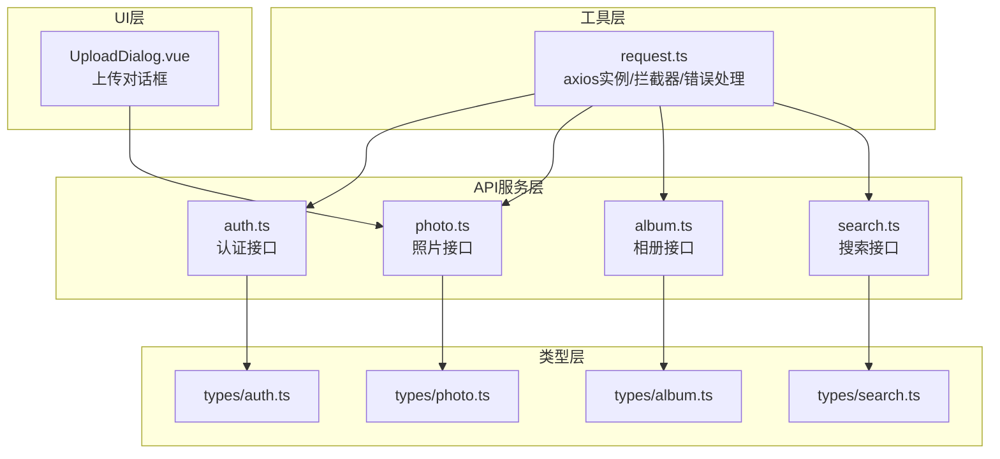
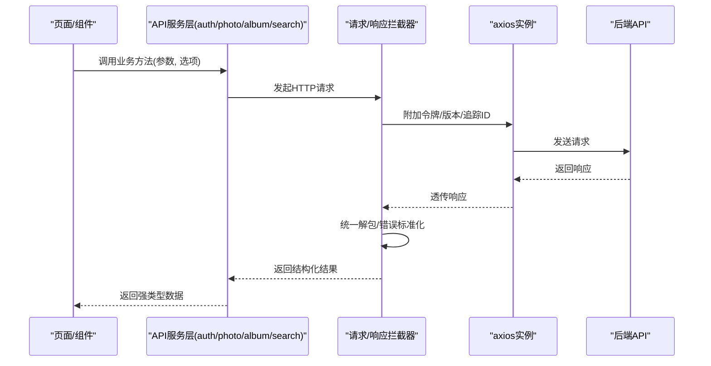
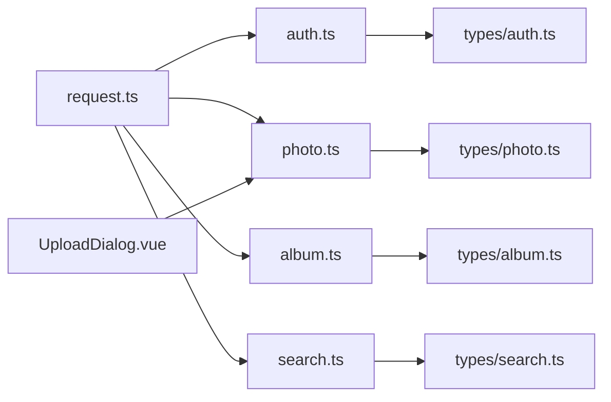

# API集成层

<cite>
**本文引用的文件**   
- [frontend/src/utils/request.ts](file://frontend/src/utils/request.ts)
- [frontend/src/api/auth.ts](file://frontend/src/api/auth.ts)
- [frontend/src/api/photo.ts](file://frontend/src/api/photo.ts)
- [frontend/src/api/album.ts](file://frontend/src/api/album.ts)
- [frontend/src/api/search.ts](file://frontend/src/api/search.ts)
- [frontend/src/types/auth.ts](file://frontend/src/types/auth.ts)
- [frontend/src/types/photo.ts](file://frontend/src/types/photo.ts)
- [frontend/src/types/album.ts](file://frontend/src/types/album.ts)
- [frontend/src/types/search.ts](file://frontend/src/types/search.ts)
- [frontend/src/components/photo/UploadDialog.vue](file://frontend/src/components/photo/UploadDialog.vue)
</cite>

## 目录
1. [简介](#简介)
2. [项目结构](#项目结构)
3. [核心组件](#核心组件)
4. [架构总览](#架构总览)
5. [详细组件分析](#详细组件分析)
6. [依赖关系分析](#依赖关系分析)
7. [性能考虑](#性能考虑)
8. [故障排查指南](#故障排查指南)
9. [结论](#结论)
10. [附录](#附录)

## 简介
本文件面向AI智能相册管理系统的前端API集成层，聚焦HTTP请求封装与业务API服务层设计。内容涵盖：
- axios实例配置、请求拦截器、响应拦截器与统一错误处理
- 认证（auth）、照片（photo）、相册（album）、搜索（search）等模块的API服务组织方式
- 文件上传下载、进度跟踪与断点续传的实现思路
- API版本管理、缓存策略与离线支持方案
- 调用示例与错误处理最佳实践

## 项目结构
前端API相关代码主要分布在以下位置：
- HTTP基础封装：utils/request.ts
- 业务API服务：api/*.ts（auth、photo、album、search等）
- 类型定义：types/*.ts（对应各模块的数据模型）
- 上传交互：components/photo/UploadDialog.vue

图表来源
- [frontend/src/utils/request.ts](file://frontend/src/utils/request.ts)
- [frontend/src/api/auth.ts](file://frontend/src/api/auth.ts)
- [frontend/src/api/photo.ts](file://frontend/src/api/photo.ts)
- [frontend/src/api/album.ts](file://frontend/src/api/album.ts)
- [frontend/src/api/search.ts](file://frontend/src/api/search.ts)
- [frontend/src/types/auth.ts](file://frontend/src/types/auth.ts)
- [frontend/src/types/photo.ts](file://frontend/src/types/photo.ts)
- [frontend/src/types/album.ts](file://frontend/src/types/album.ts)
- [frontend/src/types/search.ts](file://frontend/src/types/search.ts)
- [frontend/src/components/photo/UploadDialog.vue](file://frontend/src/components/photo/UploadDialog.vue)

章节来源
- [frontend/src/utils/request.ts](file://frontend/src/utils/request.ts)
- [frontend/src/api/auth.ts](file://frontend/src/api/auth.ts)
- [frontend/src/api/photo.ts](file://frontend/src/api/photo.ts)
- [frontend/src/api/album.ts](file://frontend/src/api/album.ts)
- [frontend/src/api/search.ts](file://frontend/src/api/search.ts)
- [frontend/src/types/auth.ts](file://frontend/src/types/auth.ts)
- [frontend/src/types/photo.ts](file://frontend/src/types/photo.ts)
- [frontend/src/types/album.ts](file://frontend/src/types/album.ts)
- [frontend/src/types/search.ts](file://frontend/src/types/search.ts)
- [frontend/src/components/photo/UploadDialog.vue](file://frontend/src/components/photo/UploadDialog.vue)

## 核心组件
本节从“封装—服务—类型—UI”四层视角，说明API集成层的职责边界与协作方式。

- 工具层（request.ts）
  - 提供统一的axios实例，集中配置baseURL、超时、默认头、Content-Type等
  - 请求拦截器：注入鉴权令牌、请求ID、时间戳、版本号等通用字段
  - 响应拦截器：统一解包业务数据、转换分页结构、标准化错误对象
  - 错误处理：网络异常、超时、服务端错误码分类提示与重试策略
  - 可选能力：取消重复请求、全局loading开关、日志埋点

- API服务层（api/*.ts）
  - 按功能域拆分：auth、photo、album、search等
  - 每个模块导出清晰的函数式API，参数与返回类型由types/*.ts约束
  - 对复杂操作（如上传）暴露带进度回调的接口

- 类型层（types/*.ts）
  - 定义请求/响应数据结构、枚举、分页、错误码等
  - 为TS编译期校验与IDE提示提供保障

- UI层（UploadDialog.vue）
  - 负责用户交互与上传流程编排，调用photo.ts提供的上传接口
  - 展示进度条、失败重试、分片/断点续传状态

章节来源
- [frontend/src/utils/request.ts](file://frontend/src/utils/request.ts)
- [frontend/src/api/auth.ts](file://frontend/src/api/auth.ts)
- [frontend/src/api/photo.ts](file://frontend/src/api/photo.ts)
- [frontend/src/api/album.ts](file://frontend/src/api/album.ts)
- [frontend/src/api/search.ts](file://frontend/src/api/search.ts)
- [frontend/src/types/auth.ts](file://frontend/src/types/auth.ts)
- [frontend/src/types/photo.ts](file://frontend/src/types/photo.ts)
- [frontend/src/types/album.ts](file://frontend/src/types/album.ts)
- [frontend/src/types/search.ts](file://frontend/src/types/search.ts)
- [frontend/src/components/photo/UploadDialog.vue](file://frontend/src/components/photo/UploadDialog.vue)

## 架构总览
下图展示了从页面到后端的核心调用链路，以及拦截器在请求/响应路径中的介入点。

图表来源
- [frontend/src/utils/request.ts](file://frontend/src/utils/request.ts)
- [frontend/src/api/auth.ts](file://frontend/src/api/auth.ts)
- [frontend/src/api/photo.ts](file://frontend/src/api/photo.ts)
- [frontend/src/api/album.ts](file://frontend/src/api/album.ts)
- [frontend/src/api/search.ts](file://frontend/src/api/search.ts)

## 详细组件分析

### HTTP基础封装（request.ts）
- 设计目标
  - 单一入口：所有HTTP请求通过同一实例发出，便于统一治理
  - 可插拔：拦截器链可按需开启/关闭，便于调试与灰度
  - 健壮性：对常见错误进行归类与友好提示，减少业务侧重复处理
- 关键职责
  - 实例配置：baseURL、超时、默认头、Content-Type、Accept等
  - 请求拦截器：自动注入Authorization、X-Request-Id、X-API-Version、时间戳等
  - 响应拦截器：统一解包data、分页结构转换、错误对象规范化
  - 错误处理：区分网络错误、超时、服务端错误码；提供重试/降级策略
  - 可选增强：取消重复请求、全局loading、日志上报
- 使用建议
  - 业务API仅关注参数与返回值，不直接操作axios
  - 针对特殊场景（如大文件上传）使用专用方法并传入自定义选项

章节来源
- [frontend/src/utils/request.ts](file://frontend/src/utils/request.ts)

### 认证服务（auth.ts）
- 职责范围
  - 登录、注册、刷新令牌、退出、获取当前用户信息等
- 典型流程
  - 登录成功后保存令牌至安全存储（如内存或加密存储），并在后续请求中自动携带
  - 401时触发刷新令牌流程，必要时引导重新登录
- 类型约定
  - 请求/响应结构与types/auth.ts保持一致，包含必要字段与校验规则

章节来源
- [frontend/src/api/auth.ts](file://frontend/src/api/auth.ts)
- [frontend/src/types/auth.ts](file://frontend/src/types/auth.ts)

### 照片服务（photo.ts）
- 职责范围
  - 照片列表、详情、删除、批量操作、缩略图获取、元数据读取等
- 文件上传
  - 提供带进度回调的上传接口，支持分片上传与断点续传（见下节）
  - 支持并发控制与失败重试
- 类型约定
  - 与types/photo.ts对齐，包括分页、排序、过滤条件等

章节来源
- [frontend/src/api/photo.ts](file://frontend/src/api/photo.ts)
- [frontend/src/types/photo.ts](file://frontend/src/types/photo.ts)

### 相册服务（album.ts）
- 职责范围
  - 相册CRUD、成员管理、封面设置、批量移动/复制等
- 类型约定
  - 与types/album.ts对齐，包含相册属性、权限、统计信息

章节来源
- [frontend/src/api/album.ts](file://frontend/src/api/album.ts)
- [frontend/src/types/album.ts](file://frontend/src/types/album.ts)

### 搜索服务（search.ts）
- 职责范围
  - 全文检索、标签筛选、时间/地点范围查询、人脸聚类结果检索等
- 类型约定
  - 与types/search.ts对齐，包含查询条件、聚合维度、分页等

章节来源
- [frontend/src/api/search.ts](file://frontend/src/api/search.ts)
- [frontend/src/types/search.ts](file://frontend/src/types/search.ts)

### 上传对话框（UploadDialog.vue）
- 职责范围
  - 选择文件、显示进度、失败重试、分片/续传状态展示
- 与API协作
  - 调用photo.ts的上传接口，接收进度回调并更新UI
  - 根据错误类型决定重试或提示用户

章节来源
- [frontend/src/components/photo/UploadDialog.vue](file://frontend/src/components/photo/UploadDialog.vue)
- [frontend/src/api/photo.ts](file://frontend/src/api/photo.ts)

## 依赖关系分析
- 低耦合高内聚
  - request.ts作为基础设施，被所有api/*模块复用
  - api/*模块仅依赖types/*，避免跨层污染
- 可能的循环依赖风险
  - 确保api/*不反向依赖UI组件
  - 将全局状态（如token）放在独立store或工具模块，避免在request.ts中引入业务状态
- 外部依赖
  - axios用于HTTP通信
  - 浏览器API用于文件流、进度事件、AbortController等

图表来源
- [frontend/src/utils/request.ts](file://frontend/src/utils/request.ts)
- [frontend/src/api/auth.ts](file://frontend/src/api/auth.ts)
- [frontend/src/api/photo.ts](file://frontend/src/api/photo.ts)
- [frontend/src/api/album.ts](file://frontend/src/api/album.ts)
- [frontend/src/api/search.ts](file://frontend/src/api/search.ts)
- [frontend/src/types/auth.ts](file://frontend/src/types/auth.ts)
- [frontend/src/types/photo.ts](file://frontend/src/types/photo.ts)
- [frontend/src/types/album.ts](file://frontend/src/types/album.ts)
- [frontend/src/types/search.ts](file://frontend/src/types/search.ts)
- [frontend/src/components/photo/UploadDialog.vue](file://frontend/src/components/photo/UploadDialog.vue)

## 性能考虑
- 请求优化
  - 合并重复请求：相同URL+参数的并发请求去重
  - 合理超时与重试：短连接快速失败，长任务指数退避
  - 按需加载：路由级懒加载API模块，减小首屏体积
- 传输优化
  - 启用Gzip/Brotli压缩（后端配合）
  - 图片使用CDN与缩略图策略
  - 分页与增量拉取，避免一次性加载大量数据
- 上传优化
  - 分片上传与并发控制
  - 断点续传：记录已上传分片索引，失败后恢复
  - 进度反馈：节流更新UI，避免频繁渲染

[本节为通用指导，无需源码引用]

## 故障排查指南
- 常见问题定位
  - 401未授权：检查令牌是否过期、刷新逻辑是否生效、是否遗漏注入Authorization
  - 403权限不足：核对当前用户角色与资源权限
  - 429限流：降低请求频率或等待重试间隔
  - 5xx服务端错误：查看服务端日志，确认是否为临时故障
- 统一错误处理
  - 在响应拦截器中将错误标准化为统一结构，便于上层捕获与提示
  - 对网络异常与超时进行区分，分别给出“请检查网络”和“请求超时，请稍后再试”
- 调试技巧
  - 开启请求日志与追踪ID，便于前后端联调
  - 使用浏览器Network面板观察请求头、载荷与响应体
  - 对关键路径添加埋点，统计成功率与耗时分布

章节来源
- [frontend/src/utils/request.ts](file://frontend/src/utils/request.ts)

## 结论
通过将HTTP请求封装与业务API分层解耦，系统获得了良好的可维护性与扩展性。统一的拦截器与错误处理显著降低了业务代码的复杂度；结合类型定义与模块化组织，提升了开发效率与稳定性。未来可在缓存、离线与更完善的重试/熔断机制上持续演进。

[本节为总结性内容，无需源码引用]

## 附录

### API版本管理
- 推荐做法
  - 在请求头中携带X-API-Version，或在URL前缀中使用/v1、/v2等
  - 在请求拦截器中统一注入版本号，避免在各模块重复设置
  - 向后兼容策略：旧版本接口保留一段时间，逐步迁移
- 变更治理
  - 破坏性变更需升级主版本，并通过网关或路由策略平滑过渡

章节来源
- [frontend/src/utils/request.ts](file://frontend/src/utils/request.ts)

### 缓存策略与离线支持
- 缓存策略
  - GET类只读接口采用HTTP缓存（ETag/Last-Modified）或应用层缓存（内存/IndexedDB）
  - 缓存失效：基于时间TTL与资源变更事件双重控制
  - 缓存键设计：包含URL、查询参数、用户上下文等，避免脏读
- 离线支持
  - 使用Service Worker拦截请求，命中缓存则直接返回
  - 队列化离线写入，网络恢复后批量同步
  - 冲突解决：以服务端为准，必要时提示用户合并

章节来源
- [frontend/src/utils/request.ts](file://frontend/src/utils/request.ts)

### 文件上传下载、进度跟踪与断点续传
- 上传流程
  - 初始化：生成唯一任务ID，计算分片大小，预检服务端能力
  - 分片上传：并发上传分片，记录成功索引，失败重试
  - 合并：全部分片完成后通知服务端合并，返回最终资源ID
- 进度跟踪
  - 监听上传进度事件，按分片累计百分比，节流更新UI
- 断点续传
  - 本地持久化已上传分片索引，恢复时跳过已完成分片
- 下载流程
  - 大文件分块下载，边下边写，支持暂停/继续
- 参考实现位置
  - 上传对话框与API服务：UploadDialog.vue与photo.ts

章节来源
- [frontend/src/components/photo/UploadDialog.vue](file://frontend/src/components/photo/UploadDialog.vue)
- [frontend/src/api/photo.ts](file://frontend/src/api/photo.ts)

### API调用示例与最佳实践
- 示例要点
  - 认证：登录后保存令牌，后续请求自动携带
  - 照片：分页查询、过滤条件、排序字段
  - 相册：创建/更新/删除、成员邀请
  - 搜索：关键词、标签、时间范围组合查询
- 最佳实践
  - 统一错误处理：在拦截器中标准化错误，业务层只做展示与决策
  - 防抖与节流：搜索输入、滚动加载等高频操作
  - 取消请求：页面切换或用户主动取消时，及时中止未完成请求
  - 类型优先：严格使用types/*.ts定义，避免any

章节来源
- [frontend/src/api/auth.ts](file://frontend/src/api/auth.ts)
- [frontend/src/api/photo.ts](file://frontend/src/api/photo.ts)
- [frontend/src/api/album.ts](file://frontend/src/api/album.ts)
- [frontend/src/api/search.ts](file://frontend/src/api/search.ts)
- [frontend/src/types/auth.ts](file://frontend/src/types/auth.ts)
- [frontend/src/types/photo.ts](file://frontend/src/types/photo.ts)
- [frontend/src/types/album.ts](file://frontend/src/types/album.ts)
- [frontend/src/types/search.ts](file://frontend/src/types/search.ts)