# UI组件库与样式系统

<cite>
**本文引用的文件**   
- [tailwind.config.js](file://frontend/tailwind.config.js)
- [postcss.config.js](file://frontend/postcss.config.js)
- [main.css](file://frontend/src/main.css)
- [theme.ts](file://frontend/src/stores/theme.ts)
- [AppHeader.vue](file://frontend/src/components/layout/AppHeader.vue)
- [AppSidebar.vue](file://frontend/src/components/layout/AppSidebar.vue)
- [PhotoCard.vue](file://frontend/src/components/photo/PhotoCard.vue)
- [PhotoGrid.vue](file://frontend/src/components/photo/PhotoGrid.vue)
- [PhotoDetailDrawer.vue](file://frontend/src/components/photo/PhotoDetailDrawer.vue)
- [ChatInput.vue](file://frontend/src/components/chat/ChatInput.vue)
- [ChatMessage.vue](file://frontend/src/components/chat/ChatMessage.vue)
- [NameConfirmDialog.vue](file://frontend/src/components/chat/NameConfirmDialog.vue)
- [HomePage.vue](file://frontend/src/views/HomePage.vue)
- [AlbumPage.vue](file://frontend/src/views/AlbumPage.vue)
- [PhotosPage.vue](file://frontend/src/views/PhotosPage.vue)
- [SearchPage.vue](file://frontend/src/views/SearchPage.vue)
- [SettingsPage.vue](file://frontend/src/views/SettingsPage.vue)
- [package.json](file://frontend/package.json)
</cite>

## 目录
1. [简介](#简介)
2. [项目结构](#项目结构)
3. [核心组件](#核心组件)
4. [架构总览](#架构总览)
5. [详细组件分析](#详细组件分析)
6. [依赖分析](#依赖分析)
7. [性能考虑](#性能考虑)
8. [故障排查指南](#故障排查指南)
9. [结论](#结论)
10. [附录](#附录)

## 简介
本文件面向AI智能相册管理系统的前端UI组件库与样式系统，聚焦以下目标：
- Tailwind CSS配置与使用策略（自定义主题、响应式规范、组件样式规范）
- 全局样式组织、CSS变量管理与主题切换机制
- 第三方UI组件集成方案与自定义组件开发规范
- 样式性能优化、浏览器兼容性处理与可访问性支持
- 样式编写示例与设计系统最佳实践

## 项目结构
前端采用Vue 3 + TypeScript + Vite构建，样式体系以Tailwind CSS为核心，配合PostCSS进行编译。关键位置如下：
- 构建与样式工具链：Vite、Tailwind、PostCSS
- 全局样式入口：主CSS文件
- 主题状态管理：Pinia store
- 布局与业务组件：按功能域拆分到components与views

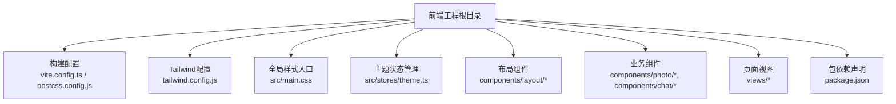

**图表来源**
- [postcss.config.js](file://frontend/postcss.config.js)
- [tailwind.config.js](file://frontend/tailwind.config.js)
- [main.css](file://frontend/src/main.css)
- [theme.ts](file://frontend/src/stores/theme.ts)
- [AppHeader.vue](file://frontend/src/components/layout/AppHeader.vue)
- [AppSidebar.vue](file://frontend/src/components/layout/AppSidebar.vue)
- [PhotoCard.vue](file://frontend/src/components/photo/PhotoCard.vue)
- [PhotoGrid.vue](file://frontend/src/components/photo/PhotoGrid.vue)
- [PhotoDetailDrawer.vue](file://frontend/src/components/photo/PhotoDetailDrawer.vue)
- [ChatInput.vue](file://frontend/src/components/chat/ChatInput.vue)
- [ChatMessage.vue](file://frontend/src/components/chat/ChatMessage.vue)
- [NameConfirmDialog.vue](file://frontend/src/components/chat/NameConfirmDialog.vue)
- [HomePage.vue](file://frontend/src/views/HomePage.vue)
- [AlbumPage.vue](file://frontend/src/views/AlbumPage.vue)
- [PhotosPage.vue](file://frontend/src/views/PhotosPage.vue)
- [SearchPage.vue](file://frontend/src/views/SearchPage.vue)
- [SettingsPage.vue](file://frontend/src/views/SettingsPage.vue)
- [package.json](file://frontend/package.json)

**章节来源**
- [postcss.config.js](file://frontend/postcss.config.js)
- [tailwind.config.js](file://frontend/tailwind.config.js)
- [main.css](file://frontend/src/main.css)
- [theme.ts](file://frontend/src/stores/theme.ts)
- [package.json](file://frontend/package.json)

## 核心组件
本节梳理与样式系统密切相关的核心模块及其职责：
- Tailwind配置与主题扩展：在Tailwind配置中定义颜色、字体、间距、圆角等设计令牌，并启用插件与自定义断点
- PostCSS集成：确保Tailwind指令正确编译，按需引入插件
- 全局样式入口：集中放置基础重置、CSS变量、通用动画与过渡
- 主题状态管理：通过Pinia维护当前主题模式（亮/暗），并提供切换API
- 布局组件：头部与侧边栏承载导航与主题切换入口
- 业务组件：照片卡片、网格、详情抽屉、聊天输入与消息等，统一遵循组件样式规范

**章节来源**
- [tailwind.config.js](file://frontend/tailwind.config.js)
- [postcss.config.js](file://frontend/postcss.config.js)
- [main.css](file://frontend/src/main.css)
- [theme.ts](file://frontend/src/stores/theme.ts)
- [AppHeader.vue](file://frontend/src/components/layout/AppHeader.vue)
- [AppSidebar.vue](file://frontend/src/components/layout/AppSidebar.vue)
- [PhotoCard.vue](file://frontend/src/components/photo/PhotoCard.vue)
- [PhotoGrid.vue](file://frontend/src/components/photo/PhotoGrid.vue)
- [PhotoDetailDrawer.vue](file://frontend/src/components/photo/PhotoDetailDrawer.vue)
- [ChatInput.vue](file://frontend/src/components/chat/ChatInput.vue)
- [ChatMessage.vue](file://frontend/src/components/chat/ChatMessage.vue)
- [NameConfirmDialog.vue](file://frontend/src/components/chat/NameConfirmDialog.vue)

## 架构总览
下图展示样式系统与组件的交互关系：Tailwind配置提供设计令牌；全局样式注入CSS变量与基础规则；主题状态驱动类名或属性变化；布局与业务组件消费这些令牌与变量，形成一致的视觉语言。

```mermaid
graph TB
subgraph "样式基础设施"
TWC["Tailwind配置<br/>tailwind.config.js"]
PCSS["PostCSS配置<br/>postcss.config.js"]
MAIN["全局样式入口<br/>src/main.css"]
end
subgraph "主题与状态"
THEME["主题Store<br/>src/stores/theme.ts"]
end
subgraph "组件层"
LAYOUT["布局组件<br/>AppHeader.vue / AppSidebar.vue"]
PHOTO["照片组件<br/>PhotoCard.vue / PhotoGrid.vue / PhotoDetailDrawer.vue"]
CHAT["聊天组件<br/>ChatInput.vue / ChatMessage.vue / NameConfirmDialog.vue"]
end
subgraph "页面层"
HOME["首页<br/>HomePage.vue"]
ALBUM["相册页<br/>AlbumPage.vue"]
PHOTOS["照片列表<br/>PhotosPage.vue"]
SEARCH["搜索页<br/>SearchPage.vue"]
SETTINGS["设置页<br/>SettingsPage.vue"]
end
TWC --> MAIN
PCSS --> MAIN
THEME --> LAYOUT
THEME --> PHOTO
THEME --> CHAT
LAYOUT --> HOME
LAYOUT --> ALBUM
LAYOUT --> PHOTOS
LAYOUT --> SEARCH
LAYOUT --> SETTINGS
PHOTO --> HOME
PHOTO --> ALBUM
PHOTO --> PHOTOS
CHAT --> HOME
CHAT --> SEARCH
```

**图表来源**
- [tailwind.config.js](file://frontend/tailwind.config.js)
- [postcss.config.js](file://frontend/postcss.config.js)
- [main.css](file://frontend/src/main.css)
- [theme.ts](file://frontend/src/stores/theme.ts)
- [AppHeader.vue](file://frontend/src/components/layout/AppHeader.vue)
- [AppSidebar.vue](file://frontend/src/components/layout/AppSidebar.vue)
- [PhotoCard.vue](file://frontend/src/components/photo/PhotoCard.vue)
- [PhotoGrid.vue](file://frontend/src/components/photo/PhotoGrid.vue)
- [PhotoDetailDrawer.vue](file://frontend/src/components/photo/PhotoDetailDrawer.vue)
- [ChatInput.vue](file://frontend/src/components/chat/ChatInput.vue)
- [ChatMessage.vue](file://frontend/src/components/chat/ChatMessage.vue)
- [NameConfirmDialog.vue](file://frontend/src/components/chat/NameConfirmDialog.vue)
- [HomePage.vue](file://frontend/src/views/HomePage.vue)
- [AlbumPage.vue](file://frontend/src/views/AlbumPage.vue)
- [PhotosPage.vue](file://frontend/src/views/PhotosPage.vue)
- [SearchPage.vue](file://frontend/src/views/SearchPage.vue)
- [SettingsPage.vue](file://frontend/src/views/SettingsPage.vue)

## 详细组件分析

### Tailwind CSS配置与主题扩展
- 设计令牌：在配置中扩展颜色、字体、间距、圆角、阴影等，形成统一的设计系统基础
- 自定义断点：为不同屏幕尺寸定义断点，支撑响应式布局
- 插件与指令：按需启用插件，确保Tailwind指令在构建时生效
- 安全白名单：避免动态类名被Tree-shaking移除

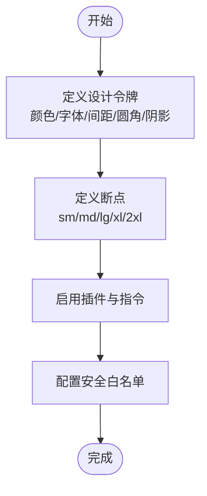

**图表来源**
- [tailwind.config.js](file://frontend/tailwind.config.js)

**章节来源**
- [tailwind.config.js](file://frontend/tailwind.config.js)

### PostCSS集成与构建流程
- 在PostCSS配置中注册Tailwind插件，确保构建阶段生成样式
- 与Vite集成，实现热更新与增量构建

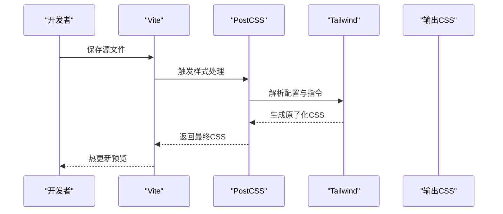

**图表来源**
- [postcss.config.js](file://frontend/postcss.config.js)

**章节来源**
- [postcss.config.js](file://frontend/postcss.config.js)

### 全局样式组织与CSS变量
- 全局入口集中管理基础重置、CSS变量、通用动画与过渡
- 将主题相关变量置于根节点，便于通过类名切换实现明暗主题
- 为常用语义化变量命名，如背景、前景、边框、强调色等

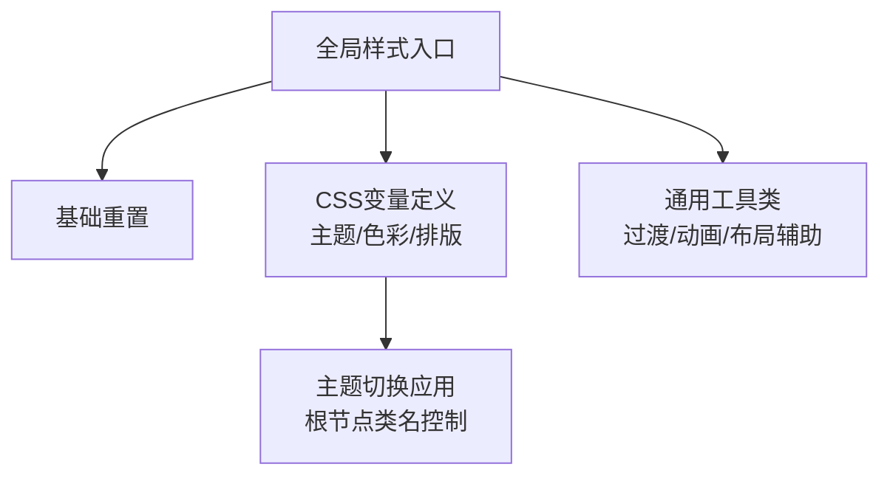

**图表来源**
- [main.css](file://frontend/src/main.css)

**章节来源**
- [main.css](file://frontend/src/main.css)

### 主题切换机制（亮/暗）
- 使用Pinia Store维护主题状态，暴露切换方法
- 在根节点根据状态添加类名，驱动CSS变量变化
- 布局组件提供用户可见的切换入口

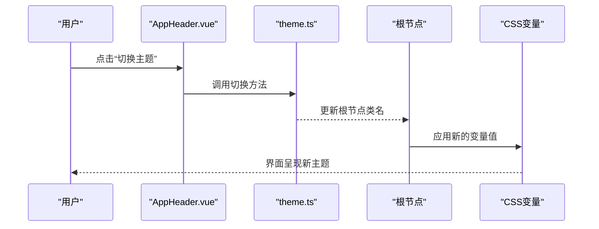

**图表来源**
- [theme.ts](file://frontend/src/stores/theme.ts)
- [AppHeader.vue](file://frontend/src/components/layout/AppHeader.vue)
- [main.css](file://frontend/src/main.css)

**章节来源**
- [theme.ts](file://frontend/src/stores/theme.ts)
- [AppHeader.vue](file://frontend/src/components/layout/AppHeader.vue)
- [main.css](file://frontend/src/main.css)

### 布局组件样式规范
- 头部与侧边栏作为全局容器，承载导航、面包屑与主题切换
- 使用Tailwind栅格与间距系统保证一致的对齐与留白
- 通过响应式类名适配移动端与桌面端

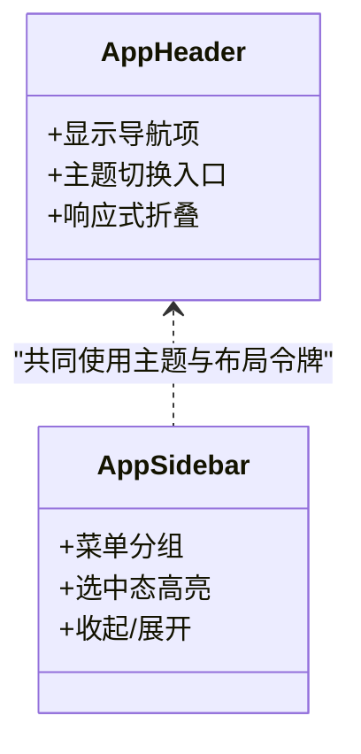

**图表来源**
- [AppHeader.vue](file://frontend/src/components/layout/AppHeader.vue)
- [AppSidebar.vue](file://frontend/src/components/layout/AppSidebar.vue)

**章节来源**
- [AppHeader.vue](file://frontend/src/components/layout/AppHeader.vue)
- [AppSidebar.vue](file://frontend/src/components/layout/AppSidebar.vue)

### 照片组件样式规范
- 照片卡片：统一的卡片容器、图片占位、加载骨架、悬停效果
- 照片网格：自适应列数、间距与对齐，支持瀑布流或等宽网格
- 详情抽屉：从右侧滑入，遮罩与层级管理，键盘关闭支持

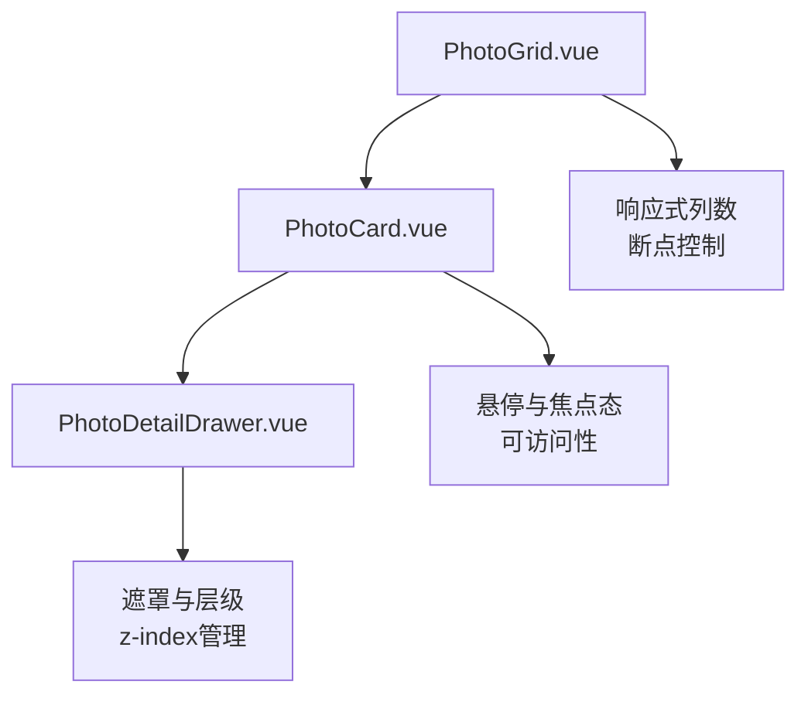

**图表来源**
- [PhotoGrid.vue](file://frontend/src/components/photo/PhotoGrid.vue)
- [PhotoCard.vue](file://frontend/src/components/photo/PhotoCard.vue)
- [PhotoDetailDrawer.vue](file://frontend/src/components/photo/PhotoDetailDrawer.vue)

**章节来源**
- [PhotoGrid.vue](file://frontend/src/components/photo/PhotoGrid.vue)
- [PhotoCard.vue](file://frontend/src/components/photo/PhotoCard.vue)
- [PhotoDetailDrawer.vue](file://frontend/src/components/photo/PhotoDetailDrawer.vue)

### 聊天组件样式规范
- 聊天输入：固定底部或跟随内容滚动，输入框高度自适应
- 消息气泡：区分发送方与接收方，时间戳与头像对齐
- 确认对话框：居中模态，遮罩与ESC关闭，焦点陷阱

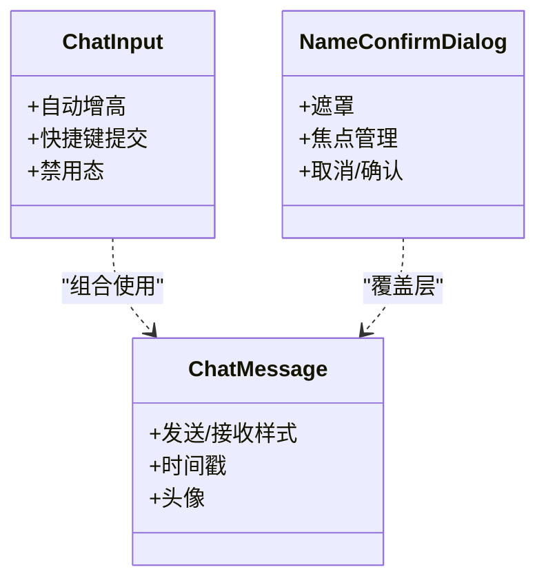

**图表来源**
- [ChatInput.vue](file://frontend/src/components/chat/ChatInput.vue)
- [ChatMessage.vue](file://frontend/src/components/chat/ChatMessage.vue)
- [NameConfirmDialog.vue](file://frontend/src/components/chat/NameConfirmDialog.vue)

**章节来源**
- [ChatInput.vue](file://frontend/src/components/chat/ChatInput.vue)
- [ChatMessage.vue](file://frontend/src/components/chat/ChatMessage.vue)
- [NameConfirmDialog.vue](file://frontend/src/components/chat/NameConfirmDialog.vue)

### 页面级样式组织
- 首页：引导区与快速入口，突出主题色与品牌元素
- 相册页：列表与筛选，卡片网格与分页
- 照片列表：大图预览与批量操作
- 搜索页：输入建议与结果网格
- 设置页：表单与开关，主题与偏好

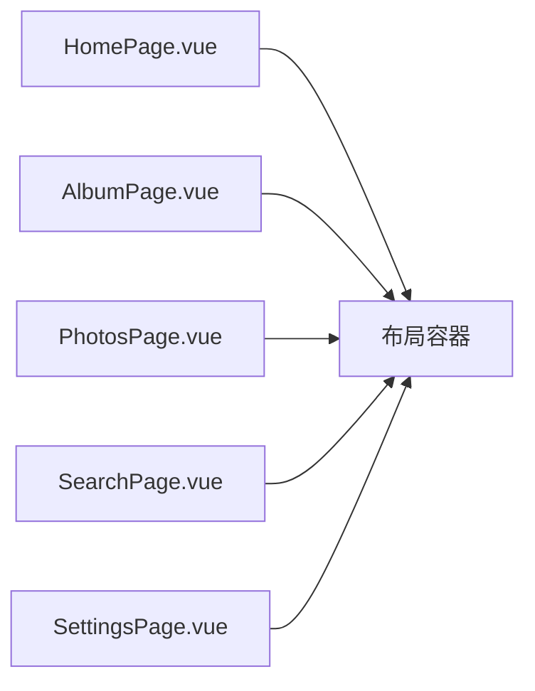

**图表来源**
- [HomePage.vue](file://frontend/src/views/HomePage.vue)
- [AlbumPage.vue](file://frontend/src/views/AlbumPage.vue)
- [PhotosPage.vue](file://frontend/src/views/PhotosPage.vue)
- [SearchPage.vue](file://frontend/src/views/SearchPage.vue)
- [SettingsPage.vue](file://frontend/src/views/SettingsPage.vue)

**章节来源**
- [HomePage.vue](file://frontend/src/views/HomePage.vue)
- [AlbumPage.vue](file://frontend/src/views/AlbumPage.vue)
- [PhotosPage.vue](file://frontend/src/views/PhotosPage.vue)
- [SearchPage.vue](file://frontend/src/views/SearchPage.vue)
- [SettingsPage.vue](file://frontend/src/views/SettingsPage.vue)

## 依赖分析
- 包依赖：在包清单中声明Tailwind、PostCSS、Autoprefixer等样式相关依赖
- 版本约束：锁定依赖版本，确保构建一致性
- 构建脚本：提供开发与生产构建命令，包含样式压缩与清理

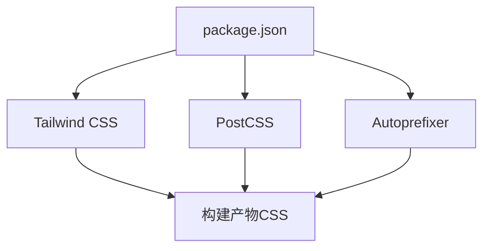

**图表来源**
- [package.json](file://frontend/package.json)

**章节来源**
- [package.json](file://frontend/package.json)

## 性能考虑
- 按需生成：利用Tailwind扫描模板与组件，仅生成使用的原子类，减小CSS体积
- 安全白名单：对动态类名加入白名单，避免被Tree-shaking误删
- 资源优化：图片懒加载、缩略图与WebP格式，减少首屏负载
- 缓存策略：静态资源开启强缓存，样式文件哈希化以便长期缓存
- 构建优化：生产环境启用压缩与去重，减少重复规则
- 运行时开销：避免过度嵌套与复杂选择器，优先使用原子类与CSS变量

[本节为通用指导，不直接分析具体文件]

## 故障排查指南
- 样式未生效
  - 检查PostCSS是否注册Tailwind插件
  - 确认Tailwind配置路径与安全白名单
  - 验证全局样式入口是否被正确引入
- 主题切换无效
  - 检查根节点类名是否正确更新
  - 确认CSS变量是否在对应作用域内定义
  - 查看控制台是否有类名冲突或优先级问题
- 响应式异常
  - 核对断点定义与设备宽度
  - 检查媒体查询顺序与覆盖规则
- 可访问性问题
  - 确保焦点可见与键盘可达
  - 为图标与按钮提供aria-label
  - 对比度符合WCAG标准

**章节来源**
- [postcss.config.js](file://frontend/postcss.config.js)
- [tailwind.config.js](file://frontend/tailwind.config.js)
- [main.css](file://frontend/src/main.css)
- [theme.ts](file://frontend/src/stores/theme.ts)

## 结论
本样式系统以Tailwind CSS为核心，结合PostCSS与全局CSS变量，构建了可扩展、可维护且高性能的设计体系。通过Pinia管理主题状态，布局与业务组件统一消费设计令牌，实现了跨页面的视觉一致性。建议在后续迭代中持续完善设计令牌、强化可访问性与性能监控，逐步沉淀为团队级的设计系统。

[本节为总结性内容，不直接分析具体文件]

## 附录

### 样式编写示例与设计系统最佳实践
- 设计令牌优先：所有颜色、字号、间距、圆角、阴影均通过Tailwind配置导出，组件直接使用令牌类名
- 语义化命名：组件类名表达意图而非外观，如“卡片-主图”、“按钮-主操作”
- 响应式优先：默认移动端样式，再在大屏上增强布局与信息密度
- 可访问性基线：焦点态、对比度、键盘导航、ARIA标签缺一不可
- 主题一致性：通过CSS变量与根节点类名统一管理明暗主题，避免硬编码颜色
- 组件边界清晰：布局组件负责结构与导航，业务组件专注领域逻辑与展示
- 文档与示例：每个组件附带使用示例与注意事项，降低上手成本

[本节为通用指导，不直接分析具体文件]