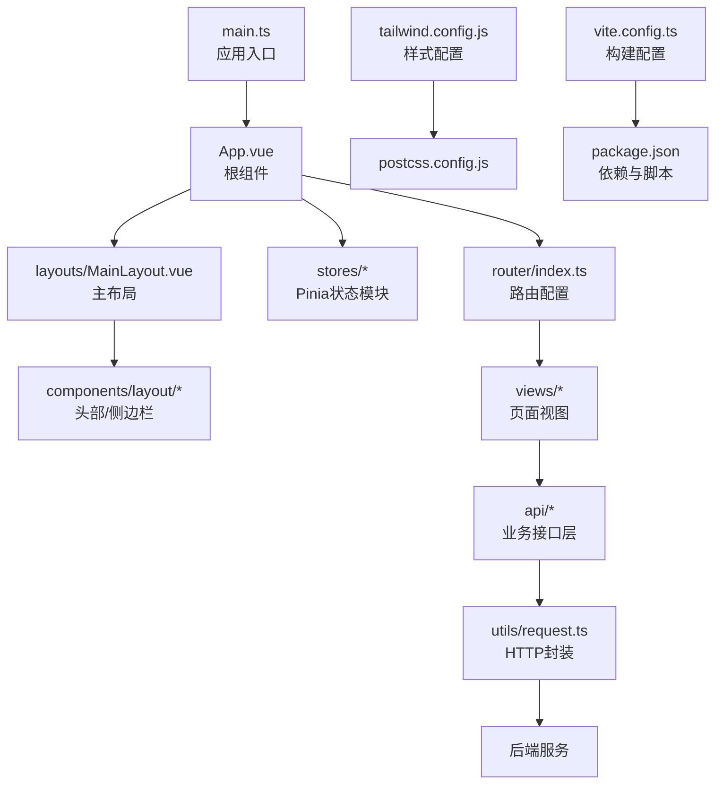
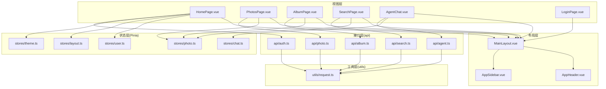
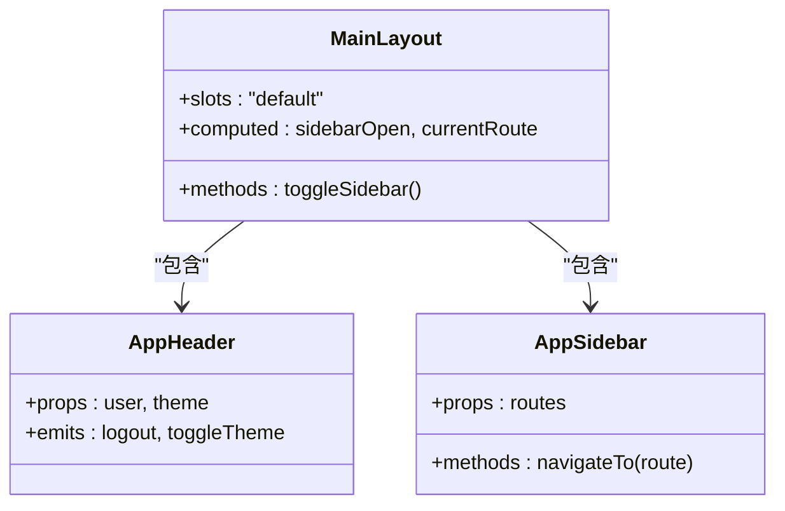
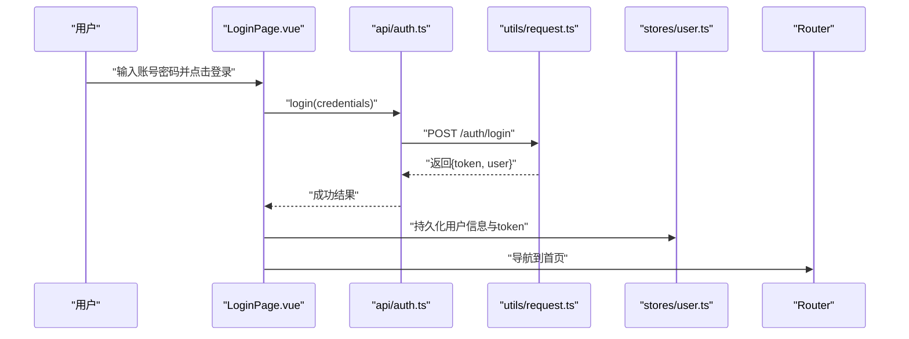
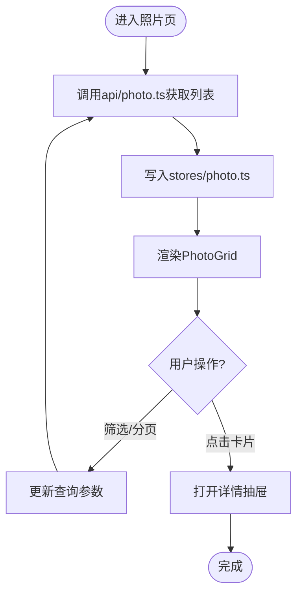
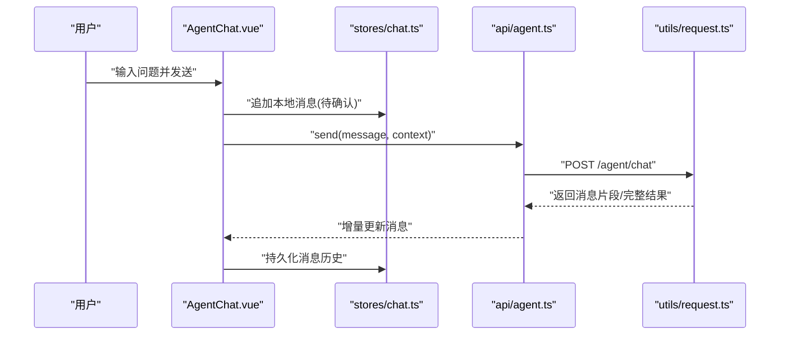
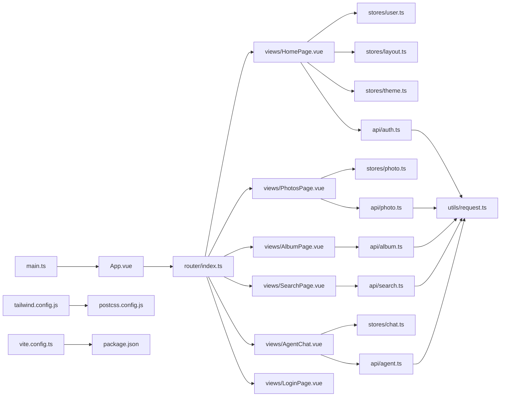

# 前端架构设计

<cite>
**本文引用的文件**   
- [frontend/src/main.ts](file://frontend/src/main.ts)
- [frontend/src/App.vue](file://frontend/src/App.vue)
- [frontend/src/router/index.ts](file://frontend/src/router/index.ts)
- [frontend/src/utils/request.ts](file://frontend/src/utils/request.ts)
- [frontend/tailwind.config.js](file://frontend/tailwind.config.js)
- [frontend/postcss.config.js](file://frontend/postcss.config.js)
- [frontend/vite.config.ts](file://frontend/vite.config.ts)
- [frontend/package.json](file://frontend/package.json)
- [frontend/src/stores/theme.ts](file://frontend/src/stores/theme.ts)
- [frontend/src/stores/layout.ts](file://frontend/src/stores/layout.ts)
- [frontend/src/stores/user.ts](file://frontend/src/stores/user.ts)
- [frontend/src/stores/photo.ts](file://frontend/src/stores/photo.ts)
- [frontend/src/stores/chat.ts](file://frontend/src/stores/chat.ts)
- [frontend/src/layouts/MainLayout.vue](file://frontend/src/layouts/MainLayout.vue)
- [frontend/src/components/layout/AppHeader.vue](file://frontend/src/components/layout/AppHeader.vue)
- [frontend/src/components/layout/AppSidebar.vue](file://frontend/src/components/layout/AppSidebar.vue)
- [frontend/src/views/HomePage.vue](file://frontend/src/views/HomePage.vue)
- [frontend/src/views/PhotosPage.vue](file://frontend/src/views/PhotosPage.vue)
- [frontend/src/views/AlbumPage.vue](file://frontend/src/views/AlbumPage.vue)
- [frontend/src/views/SearchPage.vue](file://frontend/src/views/SearchPage.vue)
- [frontend/src/views/AgentChat.vue](file://frontend/src/views/AgentChat.vue)
- [frontend/src/views/LoginPage.vue](file://frontend/src/views/LoginPage.vue)
- [frontend/src/api/auth.ts](file://frontend/src/api/auth.ts)
- [frontend/src/api/photo.ts](file://frontend/src/api/photo.ts)
- [frontend/src/api/album.ts](file://frontend/src/api/album.ts)
- [frontend/src/api/search.ts](file://frontend/src/api/search.ts)
- [frontend/src/api/agent.ts](file://frontend/src/api/agent.ts)
- [frontend/src/types/photo.ts](file://frontend/src/types/photo.ts)
- [frontend/src/types/auth.ts](file://frontend/src/types/auth.ts)
</cite>

## 目录
1. [简介](#简介)
2. [项目结构](#项目结构)
3. [核心组件与模块](#核心组件与模块)
4. [架构总览](#架构总览)
5. [详细组件分析](#详细组件分析)
6. [依赖关系分析](#依赖关系分析)
7. [性能与构建优化](#性能与构建优化)
8. [故障排查指南](#故障排查指南)
9. [结论](#结论)
10. [附录：最佳实践与示例](#附录最佳实践与示例)

## 简介
本文件面向AI智能相册管理系统的前端工程，系统化阐述基于Vue 3组合式API的组件化架构、Pinia状态管理、路由策略、前后端通信机制（请求封装、错误处理、响应拦截）、UI与样式系统（Tailwind CSS）及主题管理、构建优化与代码分割、以及性能监控方案。文档同时提供可落地的组件开发示例与最佳实践，帮助团队在统一规范下高效协作。

## 项目结构
前端采用按“能力域”划分的目录组织方式：
- src/api：按业务域划分接口层（auth、photo、album、search、agent等），统一调用底层请求工具
- src/components：通用与领域组件（布局、聊天、照片相关）
- src/layouts：页面级布局容器
- src/router：路由配置与守卫
- src/stores：Pinia状态模块（用户、布局、主题、照片、聊天）
- src/types：TypeScript类型定义
- src/utils：通用工具（网络请求封装、拖拽等）
- src/views：页面视图
- 根配置：Vite、Tailwind、PostCSS、包依赖

图表来源
- [frontend/src/main.ts](file://frontend/src/main.ts)
- [frontend/src/App.vue](file://frontend/src/App.vue)
- [frontend/src/router/index.ts](file://frontend/src/router/index.ts)
- [frontend/src/utils/request.ts](file://frontend/src/utils/request.ts)
- [frontend/tailwind.config.js](file://frontend/tailwind.config.js)
- [frontend/postcss.config.js](file://frontend/postcss.config.js)
- [frontend/vite.config.ts](file://frontend/vite.config.ts)
- [frontend/package.json](file://frontend/package.json)

章节来源
- [frontend/src/main.ts](file://frontend/src/main.ts)
- [frontend/src/App.vue](file://frontend/src/App.vue)
- [frontend/src/router/index.ts](file://frontend/src/router/index.ts)
- [frontend/src/utils/request.ts](file://frontend/src/utils/request.ts)
- [frontend/tailwind.config.js](file://frontend/tailwind.config.js)
- [frontend/postcss.config.js](file://frontend/postcss.config.js)
- [frontend/vite.config.ts](file://frontend/vite.config.ts)
- [frontend/package.json](file://frontend/package.json)

## 核心组件与模块
- 应用入口与根组件
  - main.ts负责初始化Vue应用、注册插件（如路由、状态管理）、挂载全局样式与主题变量
  - App.vue作为根容器，承载布局与全局事件总线
- 路由系统
  - router/index.ts集中定义路由表、懒加载与导航守卫（鉴权、权限、元信息）
- 状态管理（Pinia）
  - stores目录按领域拆分：user（认证与用户信息）、layout（侧边栏/头部展开态）、theme（明暗主题与变量）、photo（图片列表/选中/上传进度）、chat（对话上下文）
- 接口层与请求封装
  - api/*按业务域暴露函数，内部通过utils/request.ts发起请求，统一处理鉴权头、错误码、重试与超时
- UI与样式
  - Tailwind CSS + PostCSS，主题通过CSS变量与Tailwind自定义扩展实现
- 构建与优化
  - Vite配置按需引入、分包、预构建与缓存策略

章节来源
- [frontend/src/main.ts](file://frontend/src/main.ts)
- [frontend/src/App.vue](file://frontend/src/App.vue)
- [frontend/src/router/index.ts](file://frontend/src/router/index.ts)
- [frontend/src/stores/theme.ts](file://frontend/src/stores/theme.ts)
- [frontend/src/stores/layout.ts](file://frontend/src/stores/layout.ts)
- [frontend/src/stores/user.ts](file://frontend/src/stores/user.ts)
- [frontend/src/stores/photo.ts](file://frontend/src/stores/photo.ts)
- [frontend/src/stores/chat.ts](file://frontend/src/stores/chat.ts)
- [frontend/src/utils/request.ts](file://frontend/src/utils/request.ts)
- [frontend/tailwind.config.js](file://frontend/tailwind.config.js)
- [frontend/postcss.config.js](file://frontend/postcss.config.js)
- [frontend/vite.config.ts](file://frontend/vite.config.ts)

## 架构总览
整体采用“视图-布局-组件-状态-接口-工具”的分层模式，强调低耦合与高内聚：
- 视图层（views）仅关注页面数据组装与交互
- 布局层（layouts）负责全局骨架与区域切换
- 组件层（components）复用粒度细，职责单一
- 状态层（stores）以领域为边界，避免跨域污染
- 接口层（api）屏蔽HTTP细节，向上提供稳定契约
- 工具层（utils）提供通用能力（请求、拖拽、坐标转换等）

图表来源
- [frontend/src/views/HomePage.vue](file://frontend/src/views/HomePage.vue)
- [frontend/src/views/PhotosPage.vue](file://frontend/src/views/PhotosPage.vue)
- [frontend/src/views/AlbumPage.vue](file://frontend/src/views/AlbumPage.vue)
- [frontend/src/views/SearchPage.vue](file://frontend/src/views/SearchPage.vue)
- [frontend/src/views/AgentChat.vue](file://frontend/src/views/AgentChat.vue)
- [frontend/src/views/LoginPage.vue](file://frontend/src/views/LoginPage.vue)
- [frontend/src/layouts/MainLayout.vue](file://frontend/src/layouts/MainLayout.vue)
- [frontend/src/components/layout/AppHeader.vue](file://frontend/src/components/layout/AppHeader.vue)
- [frontend/src/components/layout/AppSidebar.vue](file://frontend/src/components/layout/AppSidebar.vue)
- [frontend/src/stores/user.ts](file://frontend/src/stores/user.ts)
- [frontend/src/stores/layout.ts](file://frontend/src/stores/layout.ts)
- [frontend/src/stores/theme.ts](file://frontend/src/stores/theme.ts)
- [frontend/src/stores/photo.ts](file://frontend/src/stores/photo.ts)
- [frontend/src/stores/chat.ts](file://frontend/src/stores/chat.ts)
- [frontend/src/api/auth.ts](file://frontend/src/api/auth.ts)
- [frontend/src/api/photo.ts](file://frontend/src/api/photo.ts)
- [frontend/src/api/album.ts](file://frontend/src/api/album.ts)
- [frontend/src/api/search.ts](file://frontend/src/api/search.ts)
- [frontend/src/api/agent.ts](file://frontend/src/api/agent.ts)
- [frontend/src/utils/request.ts](file://frontend/src/utils/request.ts)

## 详细组件分析

### 布局与导航
- MainLayout.vue：承载全局头部与侧边栏，维护内容区插槽；根据路由或状态控制侧边栏折叠
- AppHeader.vue：展示用户信息、主题切换入口、搜索快捷入口
- AppSidebar.vue：渲染菜单项，支持动态路由生成与高亮匹配

图表来源
- [frontend/src/layouts/MainLayout.vue](file://frontend/src/layouts/MainLayout.vue)
- [frontend/src/components/layout/AppHeader.vue](file://frontend/src/components/layout/AppHeader.vue)
- [frontend/src/components/layout/AppSidebar.vue](file://frontend/src/components/layout/AppSidebar.vue)

章节来源
- [frontend/src/layouts/MainLayout.vue](file://frontend/src/layouts/MainLayout.vue)
- [frontend/src/components/layout/AppHeader.vue](file://frontend/src/components/layout/AppHeader.vue)
- [frontend/src/components/layout/AppSidebar.vue](file://frontend/src/components/layout/AppSidebar.vue)

### 认证流程（登录）
- LoginPage.vue触发登录，调用api/auth.ts进行认证
- auth.ts通过request.ts发送POST请求，携带凭证
- request.ts统一附加鉴权头、处理错误码与重定向
- 成功后更新stores/user.ts并跳转首页

图表来源
- [frontend/src/views/LoginPage.vue](file://frontend/src/views/LoginPage.vue)
- [frontend/src/api/auth.ts](file://frontend/src/api/auth.ts)
- [frontend/src/utils/request.ts](file://frontend/src/utils/request.ts)
- [frontend/src/stores/user.ts](file://frontend/src/stores/user.ts)
- [frontend/src/router/index.ts](file://frontend/src/router/index.ts)

章节来源
- [frontend/src/views/LoginPage.vue](file://frontend/src/views/LoginPage.vue)
- [frontend/src/api/auth.ts](file://frontend/src/api/auth.ts)
- [frontend/src/utils/request.ts](file://frontend/src/utils/request.ts)
- [frontend/src/stores/user.ts](file://frontend/src/stores/user.ts)
- [frontend/src/router/index.ts](file://frontend/src/router/index.ts)

### 照片浏览与详情
- PhotosPage.vue聚合照片列表、筛选与分页，使用stores/photo.ts管理列表与选中态
- AlbumPage.vue聚焦专辑维度，调用api/album.ts获取专辑详情与成员
- SearchPage.vue组合多条件查询，调用api/search.ts执行检索
- 详情页可通过抽屉或弹窗展示，减少页面跳转成本

图表来源
- [frontend/src/views/PhotosPage.vue](file://frontend/src/views/PhotosPage.vue)
- [frontend/src/views/AlbumPage.vue](file://frontend/src/views/AlbumPage.vue)
- [frontend/src/views/SearchPage.vue](file://frontend/src/views/SearchPage.vue)
- [frontend/src/api/photo.ts](file://frontend/src/api/photo.ts)
- [frontend/src/api/album.ts](file://frontend/src/api/album.ts)
- [frontend/src/api/search.ts](file://frontend/src/api/search.ts)
- [frontend/src/stores/photo.ts](file://frontend/src/stores/photo.ts)

章节来源
- [frontend/src/views/PhotosPage.vue](file://frontend/src/views/PhotosPage.vue)
- [frontend/src/views/AlbumPage.vue](file://frontend/src/views/AlbumPage.vue)
- [frontend/src/views/SearchPage.vue](file://frontend/src/views/SearchPage.vue)
- [frontend/src/api/photo.ts](file://frontend/src/api/photo.ts)
- [frontend/src/api/album.ts](file://frontend/src/api/album.ts)
- [frontend/src/api/search.ts](file://frontend/src/api/search.ts)
- [frontend/src/stores/photo.ts](file://frontend/src/stores/photo.ts)

### AI助手对话
- AgentChat.vue维护会话上下文，调用api/agent.ts流式或非流式获取回复
- stores/chat.ts管理消息历史、输入状态与加载态
- 支持引用照片、标签与相册上下文，提升问答体验

图表来源
- [frontend/src/views/AgentChat.vue](file://frontend/src/views/AgentChat.vue)
- [frontend/src/stores/chat.ts](file://frontend/src/stores/chat.ts)
- [frontend/src/api/agent.ts](file://frontend/src/api/agent.ts)
- [frontend/src/utils/request.ts](file://frontend/src/utils/request.ts)

章节来源
- [frontend/src/views/AgentChat.vue](file://frontend/src/views/AgentChat.vue)
- [frontend/src/stores/chat.ts](file://frontend/src/stores/chat.ts)
- [frontend/src/api/agent.ts](file://frontend/src/api/agent.ts)
- [frontend/src/utils/request.ts](file://frontend/src/utils/request.ts)

## 依赖关系分析
- 运行时依赖
  - Vue 3、Vue Router、Pinia、TypeScript、Axios（或Fetch封装）、Tailwind CSS、PostCSS、Vite
- 关键导入关系
  - main.ts -> App.vue -> router/index.ts -> views/* -> api/* -> utils/request.ts
  - stores/*被各视图与组件读取与更新
  - tailwind.config.js与postcss.config.js驱动样式编译链

图表来源
- [frontend/src/main.ts](file://frontend/src/main.ts)
- [frontend/src/App.vue](file://frontend/src/App.vue)
- [frontend/src/router/index.ts](file://frontend/src/router/index.ts)
- [frontend/src/views/HomePage.vue](file://frontend/src/views/HomePage.vue)
- [frontend/src/views/PhotosPage.vue](file://frontend/src/views/PhotosPage.vue)
- [frontend/src/views/AlbumPage.vue](file://frontend/src/views/AlbumPage.vue)
- [frontend/src/views/SearchPage.vue](file://frontend/src/views/SearchPage.vue)
- [frontend/src/views/AgentChat.vue](file://frontend/src/views/AgentChat.vue)
- [frontend/src/views/LoginPage.vue](file://frontend/src/views/LoginPage.vue)
- [frontend/src/stores/user.ts](file://frontend/src/stores/user.ts)
- [frontend/src/stores/layout.ts](file://frontend/src/stores/layout.ts)
- [frontend/src/stores/theme.ts](file://frontend/src/stores/theme.ts)
- [frontend/src/stores/photo.ts](file://frontend/src/stores/photo.ts)
- [frontend/src/stores/chat.ts](file://frontend/src/stores/chat.ts)
- [frontend/src/api/auth.ts](file://frontend/src/api/auth.ts)
- [frontend/src/api/photo.ts](file://frontend/src/api/photo.ts)
- [frontend/src/api/album.ts](file://frontend/src/api/album.ts)
- [frontend/src/api/search.ts](file://frontend/src/api/search.ts)
- [frontend/src/api/agent.ts](file://frontend/src/api/agent.ts)
- [frontend/src/utils/request.ts](file://frontend/src/utils/request.ts)
- [frontend/tailwind.config.js](file://frontend/tailwind.config.js)
- [frontend/postcss.config.js](file://frontend/postcss.config.js)
- [frontend/vite.config.ts](file://frontend/vite.config.ts)
- [frontend/package.json](file://frontend/package.json)

章节来源
- [frontend/src/main.ts](file://frontend/src/main.ts)
- [frontend/src/App.vue](file://frontend/src/App.vue)
- [frontend/src/router/index.ts](file://frontend/src/router/index.ts)
- [frontend/src/utils/request.ts](file://frontend/src/utils/request.ts)
- [frontend/tailwind.config.js](file://frontend/tailwind.config.js)
- [frontend/postcss.config.js](file://frontend/postcss.config.js)
- [frontend/vite.config.ts](file://frontend/vite.config.ts)
- [frontend/package.json](file://frontend/package.json)

## 性能与构建优化
- 代码分割与懒加载
  - 路由级懒加载：将大体积页面（如相册、地图、训练）拆分为独立chunk，首屏只加载必要资源
  - 组件级按需加载：对重型第三方库（如图表、富文本）使用动态import
- 构建优化
  - Vite预构建与缓存：合理配置optimizeDeps，减少冷启动时间
  - 静态资源优化：图片压缩、WebP/AVIF格式、CDN直链
  - Tree-shaking：确保无副作用导入，保持ESM导出清晰
- 运行时优化
  - 列表虚拟化：长列表使用虚拟滚动
  - 图片懒加载与占位图：降低首屏压力
  - 防抖/节流：搜索与滚动场景
- 性能监控
  - 埋点上报：页面停留时长、关键路径耗时、错误率
  - 资源监控：LCP、FID、CLS指标采集与上报
  - 异常捕获：全局错误边界与未捕获Promise拒绝

[本节为通用指导，不直接分析具体文件]

## 故障排查指南
- 网络请求常见问题
  - 401未授权：检查请求头是否携带有效token，刷新逻辑是否正确
  - 跨域失败：确认代理或CORS配置
  - 超时与重试：调整超时阈值与重试策略
- 路由与权限
  - 未登录跳转循环：校验守卫顺序与重定向目标
  - 动态路由未生效：确认异步路由加载与白名单
- 状态同步
  - Pinia状态丢失：检查持久化策略与存储配额
  - 组件间状态不一致：优先使用store而非props透传
- 样式与主题
  - Tailwind类名未生效：确认构建链与扫描路径
  - 主题变量覆盖冲突：检查CSS变量优先级与作用域

章节来源
- [frontend/src/utils/request.ts](file://frontend/src/utils/request.ts)
- [frontend/src/router/index.ts](file://frontend/src/router/index.ts)
- [frontend/src/stores/user.ts](file://frontend/src/stores/user.ts)
- [frontend/src/stores/theme.ts](file://frontend/src/stores/theme.ts)
- [frontend/tailwind.config.js](file://frontend/tailwind.config.js)

## 结论
本项目以Vue 3组合式API为核心，结合Pinia与Vue Router形成清晰的组件化与状态管理架构；通过统一的请求封装与错误处理保障前后端通信稳定性；借助Tailwind CSS与主题变量实现一致的视觉体系；配合Vite构建优化与性能监控策略，兼顾开发与生产质量。遵循本文档的最佳实践，可进一步提升可维护性与可扩展性。

[本节为总结性内容，不直接分析具体文件]

## 附录：最佳实践与示例

### 组件开发规范（组合式API）
- 单文件组件职责单一，尽量不超过200行逻辑
- 使用ref/reactive管理局部状态，复杂状态放入Pinia
- 对外暴露props与emits，明确类型约束
- 使用provide/inject仅在深层嵌套时谨慎使用

章节来源
- [frontend/src/components/layout/AppHeader.vue](file://frontend/src/components/layout/AppHeader.vue)
- [frontend/src/components/layout/AppSidebar.vue](file://frontend/src/components/layout/AppSidebar.vue)
- [frontend/src/layouts/MainLayout.vue](file://frontend/src/layouts/MainLayout.vue)

### 状态管理（Pinia）
- 按领域拆分store，避免跨域耦合
- 使用getters派生计算属性，避免重复计算
- 持久化敏感数据需加密与过期策略

章节来源
- [frontend/src/stores/user.ts](file://frontend/src/stores/user.ts)
- [frontend/src/stores/layout.ts](file://frontend/src/stores/layout.ts)
- [frontend/src/stores/theme.ts](file://frontend/src/stores/theme.ts)
- [frontend/src/stores/photo.ts](file://frontend/src/stores/photo.ts)
- [frontend/src/stores/chat.ts](file://frontend/src/stores/chat.ts)

### 路由与导航
- 路由表集中管理，元信息描述页面标题、图标与权限
- 使用懒加载与路由守卫，保证安全与性能
- 动态路由用于后台配置菜单

章节来源
- [frontend/src/router/index.ts](file://frontend/src/router/index.ts)

### 前后端通信
- 统一封装请求工具，处理鉴权、错误码、超时与重试
- 接口层按业务域组织，向上提供稳定函数签名
- 类型定义集中在types目录，前后端契约一致

章节来源
- [frontend/src/utils/request.ts](file://frontend/src/utils/request.ts)
- [frontend/src/api/auth.ts](file://frontend/src/api/auth.ts)
- [frontend/src/api/photo.ts](file://frontend/src/api/photo.ts)
- [frontend/src/api/album.ts](file://frontend/src/api/album.ts)
- [frontend/src/api/search.ts](file://frontend/src/api/search.ts)
- [frontend/src/api/agent.ts](file://frontend/src/api/agent.ts)
- [frontend/src/types/photo.ts](file://frontend/src/types/photo.ts)
- [frontend/src/types/auth.ts](file://frontend/src/types/auth.ts)

### 样式与主题
- 使用Tailwind原子类快速搭建界面，复杂样式抽取为组件级样式
- 主题变量通过CSS变量注入，支持明暗切换与品牌色定制
- PostCSS链集成Autoprefixer与Tailwind插件

章节来源
- [frontend/tailwind.config.js](file://frontend/tailwind.config.js)
- [frontend/postcss.config.js](file://frontend/postcss.config.js)
- [frontend/src/stores/theme.ts](file://frontend/src/stores/theme.ts)

### 构建与打包
- Vite按需引入与分包策略，减少首屏体积
- 环境变量区分开发/测试/生产
- 产物分析与可视化定位瓶颈

章节来源
- [frontend/vite.config.ts](file://frontend/vite.config.ts)
- [frontend/package.json](file://frontend/package.json)