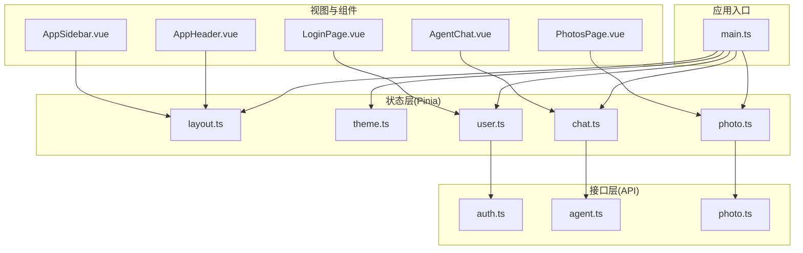
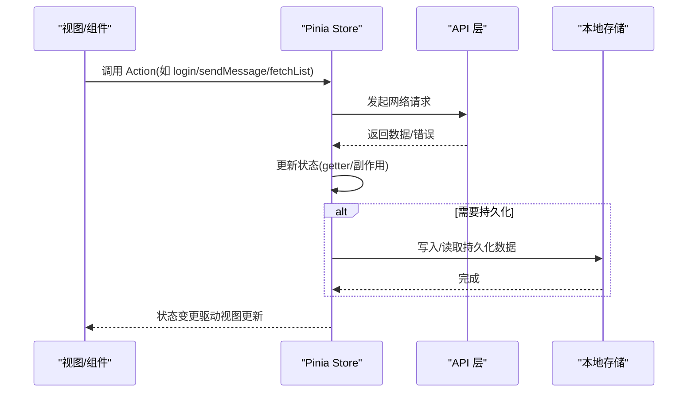
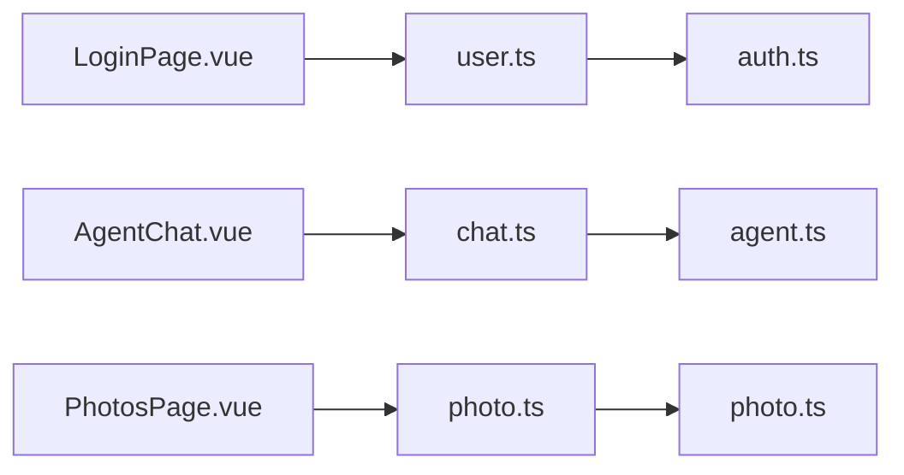

# 状态管理模式

<cite>
**本文引用的文件**   
- [frontend/src/stores/layout.ts](file://frontend/src/stores/layout.ts)
- [frontend/src/stores/theme.ts](file://frontend/src/stores/theme.ts)
- [frontend/src/stores/user.ts](file://frontend/src/stores/user.ts)
- [frontend/src/stores/chat.ts](file://frontend/src/stores/chat.ts)
- [frontend/src/stores/photo.ts](file://frontend/src/stores/photo.ts)
- [frontend/src/main.ts](file://frontend/src/main.ts)
- [frontend/src/api/auth.ts](file://frontend/src/api/auth.ts)
- [frontend/src/api/agent.ts](file://frontend/src/api/agent.ts)
- [frontend/src/api/photo.ts](file://frontend/src/api/photo.ts)
- [frontend/src/components/layout/AppHeader.vue](file://frontend/src/components/layout/AppHeader.vue)
- [frontend/src/components/layout/AppSidebar.vue](file://frontend/src/components/layout/AppSidebar.vue)
- [frontend/src/views/LoginPage.vue](file://frontend/src/views/LoginPage.vue)
- [frontend/src/views/AgentChat.vue](file://frontend/src/views/AgentChat.vue)
- [frontend/src/views/PhotosPage.vue](file://frontend/src/views/PhotosPage.vue)
</cite>

## 目录
1. [简介](#简介)
2. [项目结构](#项目结构)
3. [核心组件](#核心组件)
4. [架构总览](#架构总览)
5. [详细组件分析](#详细组件分析)
6. [依赖关系分析](#依赖关系分析)
7. [性能考虑](#性能考虑)
8. [故障排查指南](#故障排查指南)
9. [结论](#结论)
10. [附录](#附录)

## 简介
本文件面向AI智能相册管理系统的前端状态管理，聚焦于基于Pinia的状态管理模式设计与实现。文档围绕store模块划分、状态定义、getter计算属性与action异步操作展开，详细说明以下store的职责与协作方式：
- layout（布局状态）：侧边栏、头部等UI布局相关状态
- theme（主题管理）：深色/浅色主题切换与持久化
- user（用户信息）：登录态、用户资料、权限等
- chat（聊天状态）：对话消息、会话上下文、流式响应处理
- photo（照片数据）：照片列表、筛选、分页、上传进度等

同时涵盖状态持久化策略、跨组件共享方案、调试工具使用、性能优化与错误处理实践，并提供可落地的最佳实践示例与参考路径。

## 项目结构
前端采用Vue 3 + TypeScript + Pinia组织状态。状态集中在stores目录下，按领域拆分store；API调用集中于api目录；视图与组件通过useStore访问状态。

图表来源
- [frontend/src/main.ts](file://frontend/src/main.ts)
- [frontend/src/stores/layout.ts](file://frontend/src/stores/layout.ts)
- [frontend/src/stores/theme.ts](file://frontend/src/stores/theme.ts)
- [frontend/src/stores/user.ts](file://frontend/src/stores/user.ts)
- [frontend/src/stores/chat.ts](file://frontend/src/stores/chat.ts)
- [frontend/src/stores/photo.ts](file://frontend/src/stores/photo.ts)
- [frontend/src/api/auth.ts](file://frontend/src/api/auth.ts)
- [frontend/src/api/agent.ts](file://frontend/src/api/agent.ts)
- [frontend/src/api/photo.ts](file://frontend/src/api/photo.ts)
- [frontend/src/views/LoginPage.vue](file://frontend/src/views/LoginPage.vue)
- [frontend/src/views/PhotosPage.vue](file://frontend/src/views/PhotosPage.vue)
- [frontend/src/views/AgentChat.vue](file://frontend/src/views/AgentChat.vue)
- [frontend/src/components/layout/AppHeader.vue](file://frontend/src/components/layout/AppHeader.vue)
- [frontend/src/components/layout/AppSidebar.vue](file://frontend/src/components/layout/AppSidebar.vue)

章节来源
- [frontend/src/main.ts](file://frontend/src/main.ts)
- [frontend/src/stores/layout.ts](file://frontend/src/stores/layout.ts)
- [frontend/src/stores/theme.ts](file://frontend/src/stores/theme.ts)
- [frontend/src/stores/user.ts](file://frontend/src/stores/user.ts)
- [frontend/src/stores/chat.ts](file://frontend/src/stores/chat.ts)
- [frontend/src/stores/photo.ts](file://frontend/src/stores/photo.ts)

## 核心组件
本节概述各store的职责边界与典型能力，便于快速定位问题与扩展功能。

- layout（布局状态）
  - 职责：管理侧边栏展开/收起、头部可见性、页面级布局开关等
  - 典型状态：sidebarOpen、headerVisible、contentPadding等
  - 典型Action：toggleSidebar、setHeaderVisible
  - 典型Getter：isSidebarCollapsed、shouldShowHeader
  - 交互范围：全局布局组件（AppHeader、AppSidebar）

- theme（主题管理）
  - 职责：维护当前主题模式（如dark/light），并同步到DOM或CSS变量
  - 典型状态：mode、palette等
  - 典型Action：toggleTheme、setMode
  - 典型Getter：isDark、isLight
  - 持久化：将主题偏好写入本地存储，并在初始化时恢复

- user（用户信息）
  - 职责：维护登录态、用户基本信息、权限与令牌
  - 典型状态：token、userInfo、loading、error
  - 典型Action：login、logout、fetchProfile、refreshToken
  - 典型Getter：isLoggedIn、isAdmin、displayName
  - 持久化：将token与必要用户信息持久化，刷新后自动恢复登录态

- chat（聊天状态）
  - 职责：管理对话消息列表、会话上下文、加载与错误状态
  - 典型状态：messages、conversationId、streaming、error
  - 典型Action：sendMessage、appendMessage、clearMessages、handleStreamChunk
  - 典型Getter：lastMessage、messageCount、hasError
  - 异步：支持流式增量更新消息，避免整段重渲染

- photo（照片数据）
  - 职责：管理照片集合、分页、筛选条件、上传进度与批量操作
  - 典型状态：list、total、page、pageSize、filters、uploading、errors
  - 典型Action：fetchList、filterBy、upload、deleteBatch、retryUpload
  - 典型Getter：filteredList、selectedIds、progressSummary
  - 持久化：可选缓存最近一次查询结果，提升二次打开体验

章节来源
- [frontend/src/stores/layout.ts](file://frontend/src/stores/layout.ts)
- [frontend/src/stores/theme.ts](file://frontend/src/stores/theme.ts)
- [frontend/src/stores/user.ts](file://frontend/src/stores/user.ts)
- [frontend/src/stores/chat.ts](file://frontend/src/stores/chat.ts)
- [frontend/src/stores/photo.ts](file://frontend/src/stores/photo.ts)

## 架构总览
下图展示从视图到状态再到API的完整调用链路，体现跨组件状态共享与异步流程。

图表来源
- [frontend/src/stores/user.ts](file://frontend/src/stores/user.ts)
- [frontend/src/stores/chat.ts](file://frontend/src/stores/chat.ts)
- [frontend/src/stores/photo.ts](file://frontend/src/stores/photo.ts)
- [frontend/src/api/auth.ts](file://frontend/src/api/auth.ts)
- [frontend/src/api/agent.ts](file://frontend/src/api/agent.ts)
- [frontend/src/api/photo.ts](file://frontend/src/api/photo.ts)

## 详细组件分析

### layout 布局状态
- 设计要点
  - 将布局相关布尔值集中管理，避免在多个组件中重复维护
  - 提供简洁的toggle/set方法，统一入口
  - 结合路由变化动态调整布局（例如详情页隐藏侧边栏）
- 关键状态与行为
  - 状态：侧边栏展开、头部显示、内容区域内边距等
  - Action：切换侧边栏、设置头部可见性
  - Getter：根据组合状态派生更高层语义（如是否折叠）
- 典型使用场景
  - 导航菜单点击触发侧边栏切换
  - 全屏预览时隐藏头部
- 建议
  - 对频繁变化的布尔状态使用布尔型而非字符串枚举，减少分支判断
  - 若布局状态需跨会话保留，可考虑持久化（如记住上次侧边栏位置）

章节来源
- [frontend/src/stores/layout.ts](file://frontend/src/stores/layout.ts)
- [frontend/src/components/layout/AppHeader.vue](file://frontend/src/components/layout/AppHeader.vue)
- [frontend/src/components/layout/AppSidebar.vue](file://frontend/src/components/layout/AppSidebar.vue)

### theme 主题管理
- 设计要点
  - 单一主题源，所有组件通过getter读取，保证一致性
  - 初始化时从本地存储恢复主题，避免闪烁
  - 切换主题时同步到根节点或CSS变量，确保即时生效
- 关键状态与行为
  - 状态：主题模式、调色板配置
  - Action：切换主题、设置指定模式
  - Getter：是否为深色/浅色
- 典型使用场景
  - 设置页切换主题
  - 首次进入应用自动应用上次主题
- 建议
  - 使用系统主题作为默认回退
  - 主题切换应防抖，避免短时间内多次切换导致样式抖动

章节来源
- [frontend/src/stores/theme.ts](file://frontend/src/stores/theme.ts)

### user 用户信息
- 设计要点
  - 登录态与用户信息分离，token与用户详情分别管理
  - 提供统一的登录/登出流程，内部处理持久化与清理
  - 敏感信息仅做最小化持久化，必要时加密或短期存储
- 关键状态与行为
  - 状态：token、用户信息、加载与错误标志
  - Action：登录、登出、拉取个人资料、刷新令牌
  - Getter：是否已登录、是否管理员、显示名
- 典型使用场景
  - 登录页提交表单后调用login
  - 路由守卫根据isLoggedIn进行鉴权
- 建议
  - 失败重试与超时处理应在API层封装，store只关注业务状态
  - 登出时需清除本地存储与内存中的敏感数据

章节来源
- [frontend/src/stores/user.ts](file://frontend/src/stores/user.ts)
- [frontend/src/api/auth.ts](file://frontend/src/api/auth.ts)
- [frontend/src/views/LoginPage.vue](file://frontend/src/views/LoginPage.vue)

### chat 聊天状态
- 设计要点
  - 消息列表追加式更新，避免全量替换
  - 流式响应下增量插入，保持滚动锚点与用户体验
  - 明确区分发送方、角色与时间戳，便于渲染与过滤
- 关键状态与行为
  - 状态：消息数组、会话ID、流式标记、错误信息
  - Action：发送消息、追加消息、清空会话、处理流式片段
  - Getter：最后一条消息、消息数量、是否存在错误
- 典型使用场景
  - 输入框回车发送消息
  - 服务端推送片段时实时更新界面
- 建议
  - 大列表虚拟滚动以提升性能
  - 为每条消息分配稳定ID，便于定位与去重

章节来源
- [frontend/src/stores/chat.ts](file://frontend/src/stores/chat.ts)
- [frontend/src/api/agent.ts](file://frontend/src/api/agent.ts)
- [frontend/src/views/AgentChat.vue](file://frontend/src/views/AgentChat.vue)

### photo 照片数据
- 设计要点
  - 分页与筛选解耦，filters独立于分页参数
  - 上传任务队列化管理，支持并发控制与重试
  - 错误与进度聚合，提供整体进度摘要
- 关键状态与行为
  - 状态：列表、总数、页码、每页大小、筛选器、上传中、错误
  - Action：拉取列表、按条件筛选、上传、批量删除、重试上传
  - Getter：过滤后的列表、选中项ID、进度汇总
- 典型使用场景
  - 首页网格展示照片，支持搜索与标签筛选
  - 拖拽上传多张照片，显示实时进度
- 建议
  - 对热门筛选条件做本地缓存，缩短二次查询延迟
  - 图片懒加载与缩略图优先，降低首屏压力

章节来源
- [frontend/src/stores/photo.ts](file://frontend/src/stores/photo.ts)
- [frontend/src/api/photo.ts](file://frontend/src/api/photo.ts)
- [frontend/src/views/PhotosPage.vue](file://frontend/src/views/PhotosPage.vue)

## 依赖关系分析
- 低耦合高内聚
  - 每个store专注自身领域，不直接依赖其他store
  - 跨域状态通过事件总线或组合函数桥接（如需）
- API层隔离
  - store仅负责状态与业务流程编排，HTTP细节下沉至api模块
- 视图与状态解耦
  - 组件通过useStore获取状态与方法，避免直接操作全局对象

图表来源
- [frontend/src/stores/user.ts](file://frontend/src/stores/user.ts)
- [frontend/src/stores/chat.ts](file://frontend/src/stores/chat.ts)
- [frontend/src/stores/photo.ts](file://frontend/src/stores/photo.ts)
- [frontend/src/api/auth.ts](file://frontend/src/api/auth.ts)
- [frontend/src/api/agent.ts](file://frontend/src/api/agent.ts)
- [frontend/src/api/photo.ts](file://frontend/src/api/photo.ts)
- [frontend/src/views/LoginPage.vue](file://frontend/src/views/LoginPage.vue)
- [frontend/src/views/AgentChat.vue](file://frontend/src/views/AgentChat.vue)
- [frontend/src/views/PhotosPage.vue](file://frontend/src/views/PhotosPage.vue)

章节来源
- [frontend/src/stores/user.ts](file://frontend/src/stores/user.ts)
- [frontend/src/stores/chat.ts](file://frontend/src/stores/chat.ts)
- [frontend/src/stores/photo.ts](file://frontend/src/stores/photo.ts)
- [frontend/src/api/auth.ts](file://frontend/src/api/auth.ts)
- [frontend/src/api/agent.ts](file://frontend/src/api/agent.ts)
- [frontend/src/api/photo.ts](file://frontend/src/api/photo.ts)
- [frontend/src/views/LoginPage.vue](file://frontend/src/views/LoginPage.vue)
- [frontend/src/views/AgentChat.vue](file://frontend/src/views/AgentChat.vue)
- [frontend/src/views/PhotosPage.vue](file://frontend/src/views/PhotosPage.vue)

## 性能考虑
- 状态粒度
  - 将高频更新状态与低频状态拆分，减少不必要的重渲染
- 计算属性
  - 使用getter缓存复杂计算，避免模板中重复运算
- 列表渲染
  - 大数据集启用虚拟滚动，限制一次性渲染条目数
- 网络请求
  - 合并重复请求、合理设置缓存与过期策略
- 持久化
  - 避免每次状态变更都写磁盘，采用节流或批量写入
- 组件通信
  - 尽量就近订阅所需状态，避免顶层组件过度订阅

[本节为通用指导，无需源码引用]

## 故障排查指南
- 常见问题
  - 主题未生效：检查初始化恢复逻辑与DOM类名/CSS变量同步
  - 登录态丢失：确认token持久化键名与序列化格式一致
  - 聊天消息错乱：核对消息ID稳定性与追加顺序
  - 照片列表不更新：检查分页参数与筛选条件是否被重置
- 调试技巧
  - 使用浏览器开发者工具的Pinia插件查看状态快照与变更历史
  - 在关键Action前后打印日志，记录入参与返回值
  - 对异步流程增加超时与错误上报，便于定位网络问题
- 错误处理
  - 统一错误分类（网络、业务、校验），在store层转换为友好提示
  - 对幂等操作提供重试机制，对用户可感知的失败给出明确反馈

章节来源
- [frontend/src/stores/theme.ts](file://frontend/src/stores/theme.ts)
- [frontend/src/stores/user.ts](file://frontend/src/stores/user.ts)
- [frontend/src/stores/chat.ts](file://frontend/src/stores/chat.ts)
- [frontend/src/stores/photo.ts](file://frontend/src/stores/photo.ts)

## 结论
通过将布局、主题、用户、聊天与照片等状态按领域拆分为独立store，配合清晰的getter与action边界，实现了高内聚、低耦合的前端状态管理。结合本地持久化、流式更新与合理的错误处理策略，系统在可维护性与用户体验方面均得到保障。建议在后续迭代中持续完善类型约束、单元测试与性能监控，进一步提升质量与效率。

[本节为总结性内容，无需源码引用]

## 附录
- 最佳实践清单
  - 单一事实来源：每个状态只在一个store中定义与修改
  - 命名规范：state字段使用名词短语，action使用动词短语
  - 不可变更新：新对象/数组替代原地修改，便于追踪差异
  - 错误前置：在action入口处进行参数校验与权限检查
  - 可观测性：关键路径埋点与错误上报，便于线上诊断
- 参考路径
  - 布局状态：[frontend/src/stores/layout.ts](file://frontend/src/stores/layout.ts)
  - 主题管理：[frontend/src/stores/theme.ts](file://frontend/src/stores/theme.ts)
  - 用户信息：[frontend/src/stores/user.ts](file://frontend/src/stores/user.ts)
  - 聊天状态：[frontend/src/stores/chat.ts](file://frontend/src/stores/chat.ts)
  - 照片数据：[frontend/src/stores/photo.ts](file://frontend/src/stores/photo.ts)
  - 应用入口：[frontend/src/main.ts](file://frontend/src/main.ts)
  - 认证接口：[frontend/src/api/auth.ts](file://frontend/src/api/auth.ts)
  - 代理接口：[frontend/src/api/agent.ts](file://frontend/src/api/agent.ts)
  - 照片接口：[frontend/src/api/photo.ts](file://frontend/src/api/photo.ts)
  - 登录页：[frontend/src/views/LoginPage.vue](file://frontend/src/views/LoginPage.vue)
  - 聊天页：[frontend/src/views/AgentChat.vue](file://frontend/src/views/AgentChat.vue)
  - 照片页：[frontend/src/views/PhotosPage.vue](file://frontend/src/views/PhotosPage.vue)
  - 头部组件：[frontend/src/components/layout/AppHeader.vue](file://frontend/src/components/layout/AppHeader.vue)
  - 侧边栏组件：[frontend/src/components/layout/AppSidebar.vue](file://frontend/src/components/layout/AppSidebar.vue)