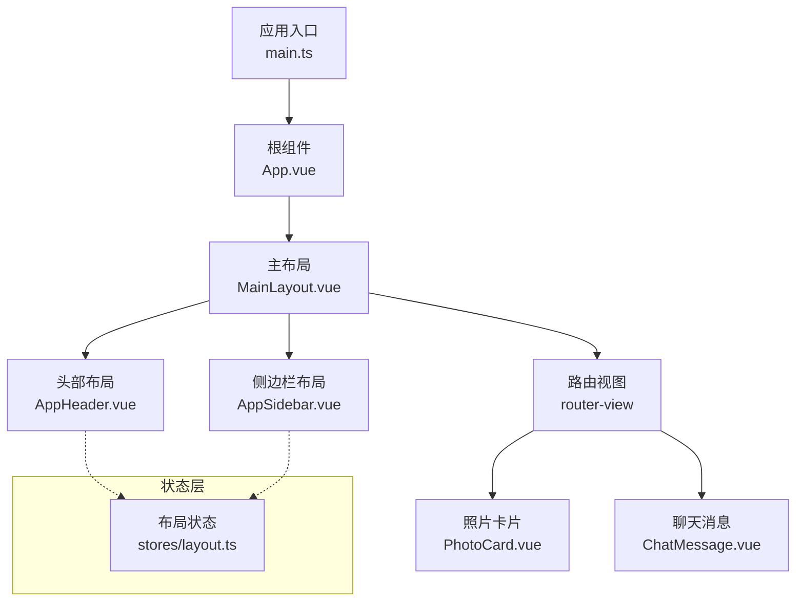
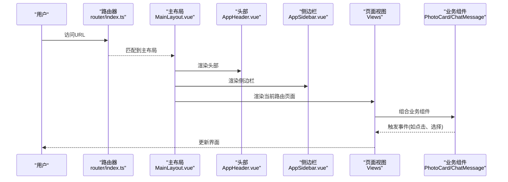
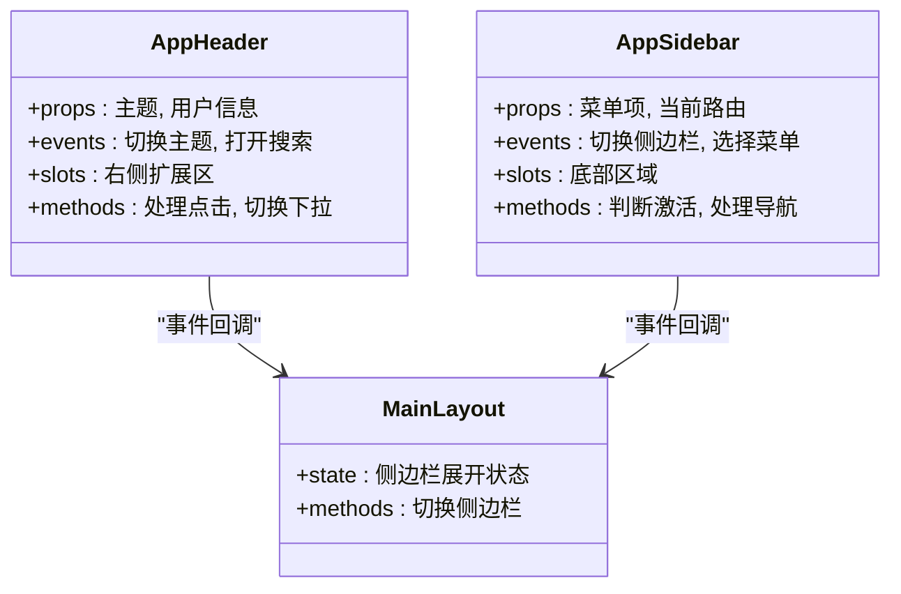
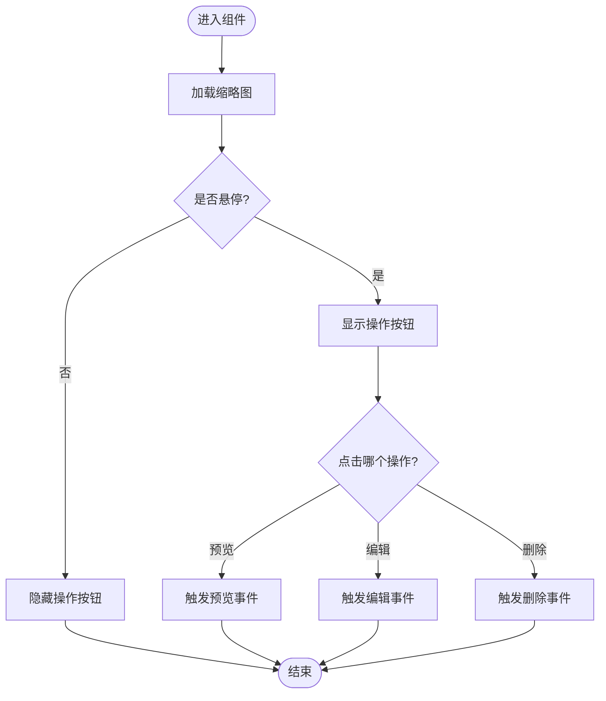
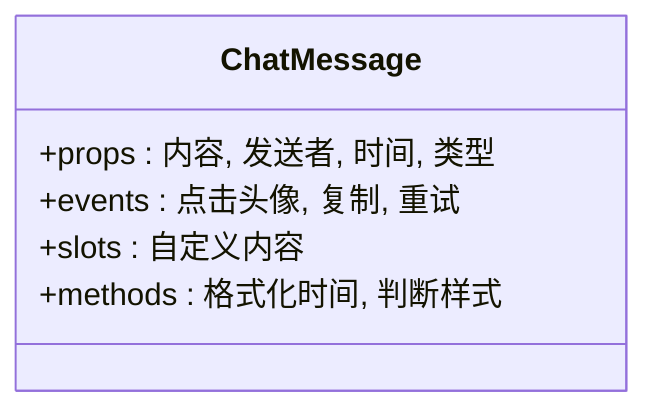
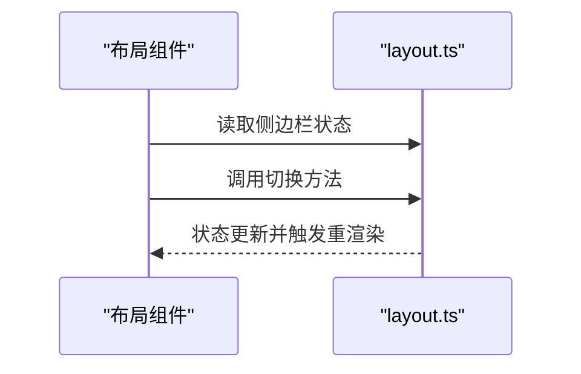
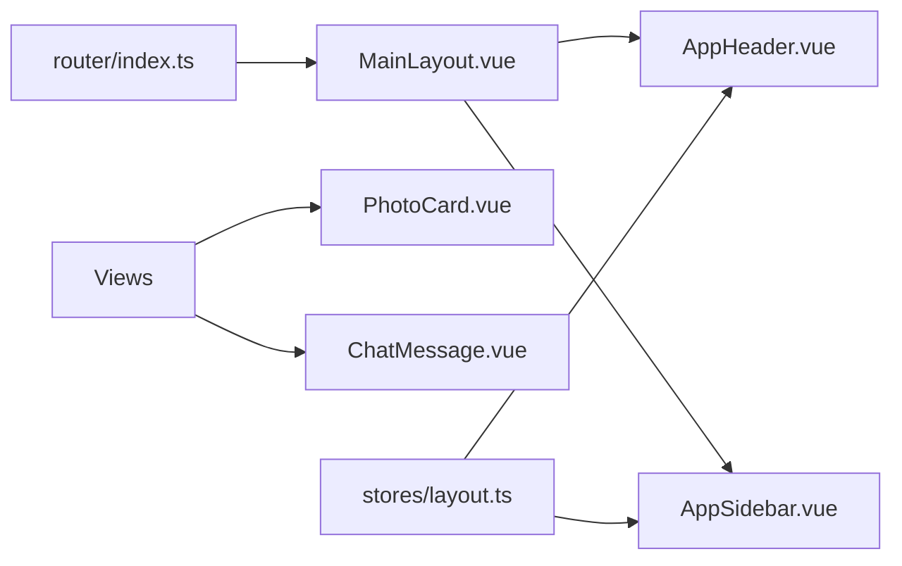

# 组件架构设计

<cite>
**本文引用的文件**   
- [frontend/src/App.vue](file://frontend/src/App.vue)
- [frontend/src/main.ts](file://frontend/src/main.ts)
- [frontend/src/layouts/MainLayout.vue](file://frontend/src/layouts/MainLayout.vue)
- [frontend/src/components/layout/AppHeader.vue](file://frontend/src/components/layout/AppHeader.vue)
- [frontend/src/components/layout/AppSidebar.vue](file://frontend/src/components/layout/AppSidebar.vue)
- [frontend/src/components/photo/PhotoCard.vue](file://frontend/src/components/photo/PhotoCard.vue)
- [frontend/src/components/chat/ChatMessage.vue](file://frontend/src/components/chat/ChatMessage.vue)
- [frontend/src/stores/layout.ts](file://frontend/src/stores/layout.ts)
- [frontend/src/router/index.ts](file://frontend/src/router/index.ts)
</cite>

## 目录
1. [简介](#简介)
2. [项目结构](#项目结构)
3. [核心组件](#核心组件)
4. [架构总览](#架构总览)
5. [详细组件分析](#详细组件分析)
6. [依赖关系分析](#依赖关系分析)
7. [性能考虑](#性能考虑)
8. [故障排查指南](#故障排查指南)
9. [结论](#结论)
10. [附录](#附录)

## 简介
本文件面向AI智能相册管理系统的前端组件架构，聚焦于Vue 3组合式API的组件化设计模式。文档将系统阐述：
- 组件树结构与职责边界
- 父子组件通信机制（props、事件、插槽）
- 布局组件（AppHeader、AppSidebar）的设计与响应式实现
- 业务组件（PhotoCard、ChatMessage等）的职责分离与复用策略
- 组件生命周期管理、性能优化技巧与调试方法
- 具体开发示例与最佳实践

## 项目结构
前端采用按功能域划分的目录组织方式：
- components：通用与业务组件，按chat、layout、photo等子目录划分
- layouts：页面级布局容器
- stores：基于组合式API的状态管理模块
- router：路由配置
- views：页面视图
- api：HTTP请求封装与接口定义
- utils：工具函数

图表来源
- [frontend/src/main.ts](file://frontend/src/main.ts)
- [frontend/src/App.vue](file://frontend/src/App.vue)
- [frontend/src/layouts/MainLayout.vue](file://frontend/src/layouts/MainLayout.vue)
- [frontend/src/components/layout/AppHeader.vue](file://frontend/src/components/layout/AppHeader.vue)
- [frontend/src/components/layout/AppSidebar.vue](file://frontend/src/components/layout/AppSidebar.vue)
- [frontend/src/components/photo/PhotoCard.vue](file://frontend/src/components/photo/PhotoCard.vue)
- [frontend/src/components/chat/ChatMessage.vue](file://frontend/src/components/chat/ChatMessage.vue)
- [frontend/src/stores/layout.ts](file://frontend/src/stores/layout.ts)

章节来源
- [frontend/src/main.ts](file://frontend/src/main.ts)
- [frontend/src/App.vue](file://frontend/src/App.vue)
- [frontend/src/layouts/MainLayout.vue](file://frontend/src/layouts/MainLayout.vue)
- [frontend/src/router/index.ts](file://frontend/src/router/index.ts)

## 核心组件
- 布局组件
  - AppHeader：顶部导航、主题切换、用户信息展示、全局搜索入口等
  - AppSidebar：导航菜单、折叠控制、当前路由高亮
- 业务组件
  - PhotoCard：单张照片缩略图、悬停操作、点击跳转详情
  - ChatMessage：对话气泡、头像、时间戳、消息类型区分
- 状态管理
  - layout.ts：侧边栏展开/收起、主题等全局UI状态

职责边界
- 布局组件负责页面骨架与导航交互，不承载复杂业务逻辑
- 业务组件专注数据呈现与局部交互，通过props接收数据、通过事件向父级上报行为
- 状态管理集中维护跨组件共享的UI状态，避免深层props透传

章节来源
- [frontend/src/components/layout/AppHeader.vue](file://frontend/src/components/layout/AppHeader.vue)
- [frontend/src/components/layout/AppSidebar.vue](file://frontend/src/components/layout/AppSidebar.vue)
- [frontend/src/components/photo/PhotoCard.vue](file://frontend/src/components/photo/PhotoCard.vue)
- [frontend/src/components/chat/ChatMessage.vue](file://frontend/src/components/chat/ChatMessage.vue)
- [frontend/src/stores/layout.ts](file://frontend/src/stores/layout.ts)

## 架构总览
整体采用“布局容器 + 路由视图 + 业务组件”的分层结构。布局组件作为容器，内部包含头部与侧边栏；路由视图根据路径渲染对应页面；页面内再组合业务组件完成具体功能。

图表来源
- [frontend/src/router/index.ts](file://frontend/src/router/index.ts)
- [frontend/src/layouts/MainLayout.vue](file://frontend/src/layouts/MainLayout.vue)
- [frontend/src/components/layout/AppHeader.vue](file://frontend/src/components/layout/AppHeader.vue)
- [frontend/src/components/layout/AppSidebar.vue](file://frontend/src/components/layout/AppSidebar.vue)
- [frontend/src/components/photo/PhotoCard.vue](file://frontend/src/components/photo/PhotoCard.vue)
- [frontend/src/components/chat/ChatMessage.vue](file://frontend/src/components/chat/ChatMessage.vue)

## 详细组件分析

### 布局组件：AppHeader 与 AppSidebar
- 设计模式
  - 组合式API：使用ref/reactive管理本地状态，使用computed派生计算属性
  - 响应式布局：监听窗口尺寸变化，动态切换折叠状态
  - 事件驱动：通过emit向上汇报用户操作（如切换侧边栏、主题切换）
- 父子通信
  - props：接收主题、用户信息等只读数据
  - events：向父级或同级布局组件广播动作
  - slots：预留插槽以扩展头部右侧区域或侧边栏底部内容
- 生命周期
  - onMounted：初始化窗口尺寸监听、读取持久化设置
  - onUnmounted：清理监听器，避免内存泄漏

图表来源
- [frontend/src/components/layout/AppHeader.vue](file://frontend/src/components/layout/AppHeader.vue)
- [frontend/src/components/layout/AppSidebar.vue](file://frontend/src/components/layout/AppSidebar.vue)
- [frontend/src/layouts/MainLayout.vue](file://frontend/src/layouts/MainLayout.vue)

章节来源
- [frontend/src/components/layout/AppHeader.vue](file://frontend/src/components/layout/AppHeader.vue)
- [frontend/src/components/layout/AppSidebar.vue](file://frontend/src/components/layout/AppSidebar.vue)
- [frontend/src/layouts/MainLayout.vue](file://frontend/src/layouts/MainLayout.vue)

### 业务组件：PhotoCard
- 职责
  - 展示照片缩略图、标题、元信息
  - 提供悬停操作（预览、编辑、删除）与点击跳转
- 通信
  - props：图片地址、标题、描述、选中状态等
  - events：选中、预览、删除、收藏等
  - slots：自定义操作按钮或标签
- 性能
  - 懒加载与占位图
  - 列表虚拟化（在大数据量场景下）
  - 防抖/节流处理高频事件

图表来源
- [frontend/src/components/photo/PhotoCard.vue](file://frontend/src/components/photo/PhotoCard.vue)

章节来源
- [frontend/src/components/photo/PhotoCard.vue](file://frontend/src/components/photo/PhotoCard.vue)

### 业务组件：ChatMessage
- 职责
  - 渲染单条消息气泡，区分发送方/接收方样式
  - 展示头像、时间戳、消息类型（文本、图片、系统提示）
- 通信
  - props：消息内容、发送者、时间、类型
  - events：点击头像、复制文本、重试发送
  - slots：自定义消息内容（富文本、卡片等）
- 可复用性
  - 通过插槽与类型字段支持多种消息形态
  - 通过props暴露最小必要数据，保持组件纯展示

图表来源
- [frontend/src/components/chat/ChatMessage.vue](file://frontend/src/components/chat/ChatMessage.vue)

章节来源
- [frontend/src/components/chat/ChatMessage.vue](file://frontend/src/components/chat/ChatMessage.vue)

### 状态管理：layout.ts
- 职责
  - 集中管理侧边栏展开/收起、主题等全局UI状态
  - 提供响应式getter/setter供布局组件读写
- 与组件的关系
  - AppHeader与AppSidebar通过组合式API引入并订阅状态
  - 变更时自动触发视图更新

图表来源
- [frontend/src/stores/layout.ts](file://frontend/src/stores/layout.ts)
- [frontend/src/components/layout/AppHeader.vue](file://frontend/src/components/layout/AppHeader.vue)
- [frontend/src/components/layout/AppSidebar.vue](file://frontend/src/components/layout/AppSidebar.vue)

章节来源
- [frontend/src/stores/layout.ts](file://frontend/src/stores/layout.ts)

## 依赖关系分析
- 组件耦合
  - 布局组件与路由弱耦合，仅负责导航与骨架
  - 业务组件与路由解耦，通过事件与父组件协作
- 外部依赖
  - 路由：用于页面跳转与高亮
  - 状态管理：集中管理UI状态
  - 工具库：日期格式化、防抖节流等

图表来源
- [frontend/src/router/index.ts](file://frontend/src/router/index.ts)
- [frontend/src/layouts/MainLayout.vue](file://frontend/src/layouts/MainLayout.vue)
- [frontend/src/components/layout/AppHeader.vue](file://frontend/src/components/layout/AppHeader.vue)
- [frontend/src/components/layout/AppSidebar.vue](file://frontend/src/components/layout/AppSidebar.vue)
- [frontend/src/components/photo/PhotoCard.vue](file://frontend/src/components/photo/PhotoCard.vue)
- [frontend/src/components/chat/ChatMessage.vue](file://frontend/src/components/chat/ChatMessage.vue)
- [frontend/src/stores/layout.ts](file://frontend/src/stores/layout.ts)

章节来源
- [frontend/src/router/index.ts](file://frontend/src/router/index.ts)
- [frontend/src/stores/layout.ts](file://frontend/src/stores/layout.ts)

## 性能考虑
- 渲染优化
  - 合理使用v-if/v-show：频繁切换用v-show，条件渲染用v-if
  - 列表渲染使用key，避免不必要的DOM重建
  - 大数据列表采用虚拟滚动或分页加载
- 资源优化
  - 图片懒加载与占位图
  - 按需引入第三方库，减少包体积
- 事件优化
  - 防抖/节流处理输入、滚动、窗口resize等高频事件
- 状态优化
  - 将频繁更新的局部状态下沉到组件内部
  - 使用computed缓存派生数据，避免重复计算

[本节为通用指导，无需源码引用]

## 故障排查指南
- 常见问题
  - 侧边栏无法切换：检查layout.ts中状态读写是否正确，确认事件绑定未被覆盖
  - 主题未生效：确认AppHeader的主题切换事件是否被正确传播与持久化
  - 图片加载失败：检查懒加载配置与占位图路径
- 调试方法
  - 使用浏览器开发者工具的Vue Devtools查看组件树与状态
  - 在关键事件处添加日志输出，定位问题链路
  - 对复杂计算使用computed并打印中间结果进行验证

章节来源
- [frontend/src/stores/layout.ts](file://frontend/src/stores/layout.ts)
- [frontend/src/components/layout/AppHeader.vue](file://frontend/src/components/layout/AppHeader.vue)
- [frontend/src/components/layout/AppSidebar.vue](file://frontend/src/components/layout/AppSidebar.vue)

## 结论
本架构通过清晰的组件分层与组合式API，实现了良好的可维护性与可扩展性。布局组件专注于导航与骨架，业务组件专注数据呈现与交互，状态管理统一维护全局UI状态。配合合理的性能优化与调试手段，可在保证用户体验的同时提升开发效率。

[本节为总结性内容，无需源码引用]

## 附录
- 组件开发最佳实践
  - 单一职责：每个组件只做一件事
  - 明确契约：props与events定义清晰，必要时提供默认值
  - 可测试性：尽量无副作用的纯函数式逻辑，便于单元测试
  - 可复用性：通过插槽与类型字段增强灵活性
- 生命周期建议
  - 在onMounted中初始化副作用（监听、定时器），在onUnmounted中清理
  - 避免在setup中执行耗时任务，必要时使用异步初始化

[本节为通用指导，无需源码引用]