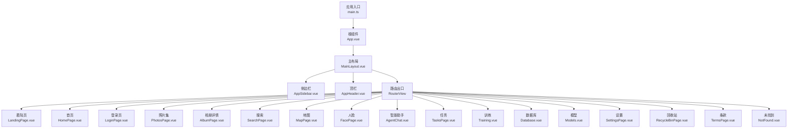
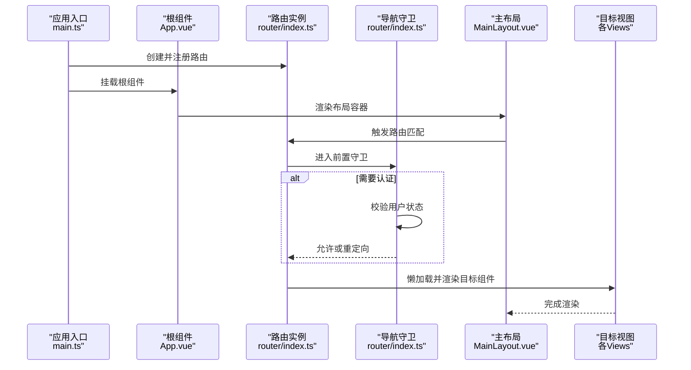
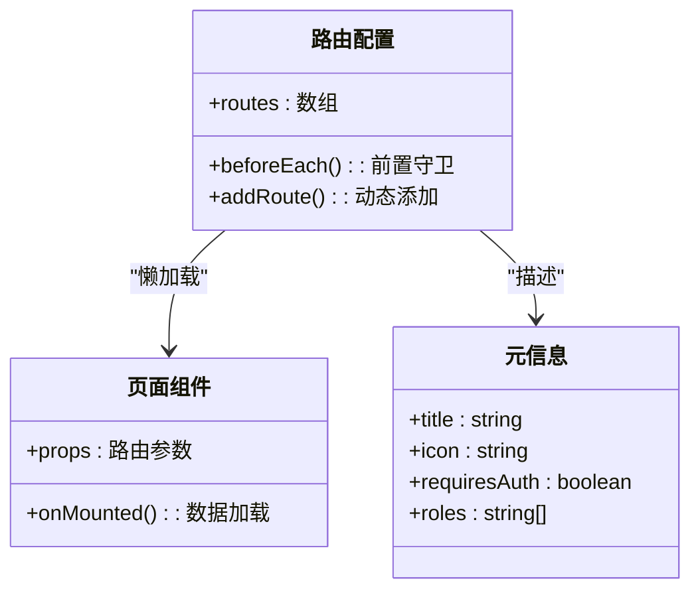
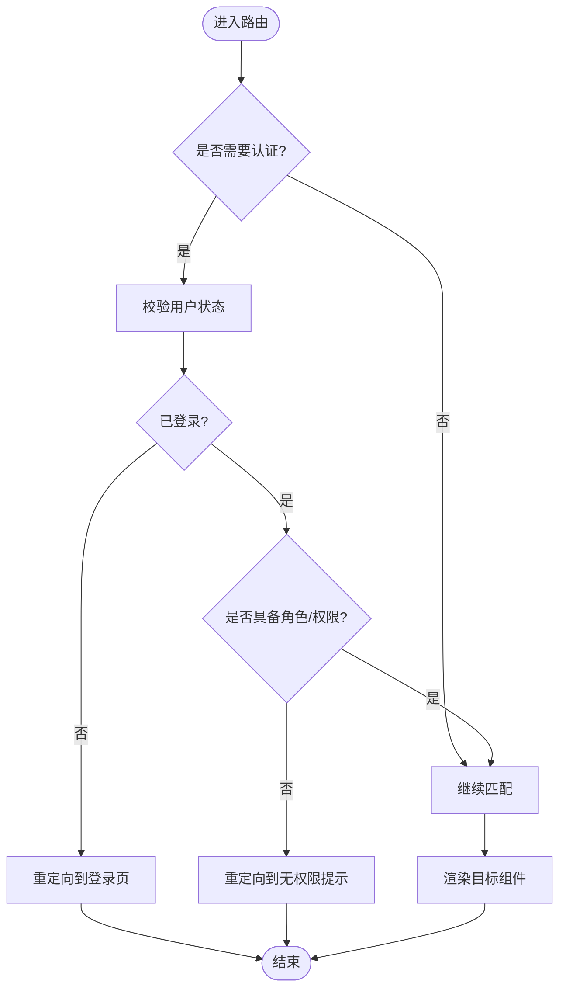
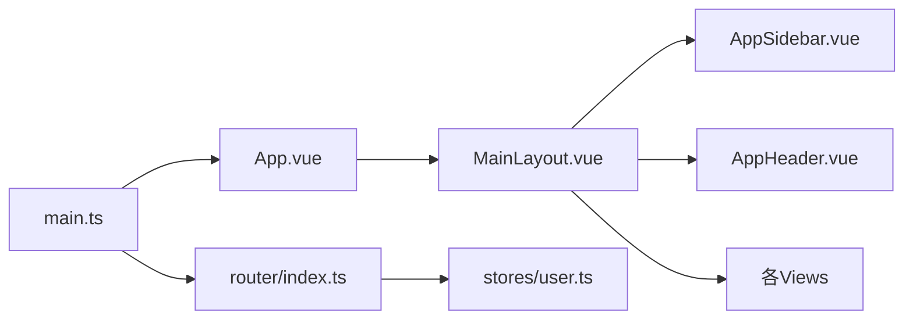

# 路由设计与导航

<cite>
**本文引用的文件**   
- [frontend/src/router/index.ts](file://frontend/src/router/index.ts)
- [frontend/src/main.ts](file://frontend/src/main.ts)
- [frontend/src/App.vue](file://frontend/src/App.vue)
- [frontend/src/layouts/MainLayout.vue](file://frontend/src/layouts/MainLayout.vue)
- [frontend/src/components/layout/AppHeader.vue](file://frontend/src/components/layout/AppHeader.vue)
- [frontend/src/components/layout/AppSidebar.vue](file://frontend/src/components/layout/AppSidebar.vue)
- [frontend/src/views/LandingPage.vue](file://frontend/src/views/LandingPage.vue)
- [frontend/src/views/HomePage.vue](file://frontend/src/views/HomePage.vue)
- [frontend/src/views/LoginPage.vue](file://frontend/src/views/LoginPage.vue)
- [frontend/src/views/PhotosPage.vue](file://frontend/src/views/PhotosPage.vue)
- [frontend/src/views/AlbumPage.vue](file://frontend/src/views/AlbumPage.vue)
- [frontend/src/views/SearchPage.vue](file://frontend/src/views/SearchPage.vue)
- [frontend/src/views/MapPage.vue](file://frontend/src/views/MapPage.vue)
- [frontend/src/views/FacePage.vue](file://frontend/src/views/FacePage.vue)
- [frontend/src/views/AgentChat.vue](file://frontend/src/views/AgentChat.vue)
- [frontend/src/views/TasksPage.vue](file://frontend/src/views/TasksPage.vue)
- [frontend/src/views/Training.vue](file://frontend/src/views/Training.vue)
- [frontend/src/views/Database.vue](file://frontend/src/views/Database.vue)
- [frontend/src/views/Models.vue](file://frontend/src/views/Models.vue)
- [frontend/src/views/SettingsPage.vue](file://frontend/src/views/SettingsPage.vue)
- [frontend/src/views/RecycleBinPage.vue](file://frontend/src/views/RecycleBinPage.vue)
- [frontend/src/views/TermsPage.vue](file://frontend/src/views/TermsPage.vue)
- [frontend/src/views/NotFound.vue](file://frontend/src/views/NotFound.vue)
- [frontend/src/stores/user.ts](file://frontend/src/stores/user.ts)
</cite>

## 目录
1. [简介](#简介)
2. [项目结构](#项目结构)
3. [核心组件](#核心组件)
4. [架构总览](#架构总览)
5. [详细组件分析](#详细组件分析)
6. [依赖分析](#依赖分析)
7. [性能考虑](#性能考虑)
8. [故障排查指南](#故障排查指南)
9. [结论](#结论)
10. [附录](#附录)

## 简介
本文件面向AI智能相册管理系统的前端路由设计与导航实现，聚焦于Vue Router的配置策略与最佳实践。内容涵盖：
- 路由懒加载、嵌套路由与动态参数传递
- 页面级组件组织与路由守卫（认证、权限控制、元信息）
- 导航栏集成、面包屑导航与路由动画
- 路由性能优化、SEO友好配置与移动端适配方案
- 具体配置示例与导航最佳实践

## 项目结构
前端采用Vite + Vue 3 + TypeScript技术栈，路由定义位于router目录，页面视图集中在views目录，布局与通用导航组件位于layouts与components/layout目录。

图表来源
- [frontend/src/main.ts](file://frontend/src/main.ts)
- [frontend/src/App.vue](file://frontend/src/App.vue)
- [frontend/src/layouts/MainLayout.vue](file://frontend/src/layouts/MainLayout.vue)
- [frontend/src/components/layout/AppHeader.vue](file://frontend/src/components/layout/AppHeader.vue)
- [frontend/src/components/layout/AppSidebar.vue](file://frontend/src/components/layout/AppSidebar.vue)
- [frontend/src/views/LandingPage.vue](file://frontend/src/views/LandingPage.vue)
- [frontend/src/views/HomePage.vue](file://frontend/src/views/HomePage.vue)
- [frontend/src/views/LoginPage.vue](file://frontend/src/views/LoginPage.vue)
- [frontend/src/views/PhotosPage.vue](file://frontend/src/views/PhotosPage.vue)
- [frontend/src/views/AlbumPage.vue](file://frontend/src/views/AlbumPage.vue)
- [frontend/src/views/SearchPage.vue](file://frontend/src/views/SearchPage.vue)
- [frontend/src/views/MapPage.vue](file://frontend/src/views/MapPage.vue)
- [frontend/src/views/FacePage.vue](file://frontend/src/views/FacePage.vue)
- [frontend/src/views/AgentChat.vue](file://frontend/src/views/AgentChat.vue)
- [frontend/src/views/TasksPage.vue](file://frontend/src/views/TasksPage.vue)
- [frontend/src/views/Training.vue](file://frontend/src/views/Training.vue)
- [frontend/src/views/Database.vue](file://frontend/src/views/Database.vue)
- [frontend/src/views/Models.vue](file://frontend/src/views/Models.vue)
- [frontend/src/views/SettingsPage.vue](file://frontend/src/views/SettingsPage.vue)
- [frontend/src/views/RecycleBinPage.vue](file://frontend/src/views/RecycleBinPage.vue)
- [frontend/src/views/TermsPage.vue](file://frontend/src/views/TermsPage.vue)
- [frontend/src/views/NotFound.vue](file://frontend/src/views/NotFound.vue)

章节来源
- [frontend/src/main.ts](file://frontend/src/main.ts)
- [frontend/src/App.vue](file://frontend/src/App.vue)
- [frontend/src/layouts/MainLayout.vue](file://frontend/src/layouts/MainLayout.vue)
- [frontend/src/components/layout/AppHeader.vue](file://frontend/src/components/layout/AppHeader.vue)
- [frontend/src/components/layout/AppSidebar.vue](file://frontend/src/components/layout/AppSidebar.vue)
- [frontend/src/views/LandingPage.vue](file://frontend/src/views/LandingPage.vue)
- [frontend/src/views/HomePage.vue](file://frontend/src/views/HomePage.vue)
- [frontend/src/views/LoginPage.vue](file://frontend/src/views/LoginPage.vue)
- [frontend/src/views/PhotosPage.vue](file://frontend/src/views/PhotosPage.vue)
- [frontend/src/views/AlbumPage.vue](file://frontend/src/views/AlbumPage.vue)
- [frontend/src/views/SearchPage.vue](file://frontend/src/views/SearchPage.vue)
- [frontend/src/views/MapPage.vue](file://frontend/src/views/MapPage.vue)
- [frontend/src/views/FacePage.vue](file://frontend/src/views/FacePage.vue)
- [frontend/src/views/AgentChat.vue](file://frontend/src/views/AgentChat.vue)
- [frontend/src/views/TasksPage.vue](file://frontend/src/views/TasksPage.vue)
- [frontend/src/views/Training.vue](file://frontend/src/views/Training.vue)
- [frontend/src/views/Database.vue](file://frontend/src/views/Database.vue)
- [frontend/src/views/Models.vue](file://frontend/src/views/Models.vue)
- [frontend/src/views/SettingsPage.vue](file://frontend/src/views/SettingsPage.vue)
- [frontend/src/views/RecycleBinPage.vue](file://frontend/src/views/RecycleBinPage.vue)
- [frontend/src/views/TermsPage.vue](file://frontend/src/views/TermsPage.vue)
- [frontend/src/views/NotFound.vue](file://frontend/src/views/NotFound.vue)

## 核心组件
- 路由定义与注册：集中管理所有路由规则、懒加载、嵌套结构与元信息。
- 应用入口与根组件：初始化路由实例并挂载到DOM，提供全局过渡与布局容器。
- 主布局与导航：统一承载侧边栏、顶栏与路由出口，支撑面包屑与导航高亮。
- 页面视图：按功能域划分，配合路由懒加载按需加载。

章节来源
- [frontend/src/router/index.ts](file://frontend/src/router/index.ts)
- [frontend/src/main.ts](file://frontend/src/main.ts)
- [frontend/src/App.vue](file://frontend/src/App.vue)
- [frontend/src/layouts/MainLayout.vue](file://frontend/src/layouts/MainLayout.vue)
- [frontend/src/components/layout/AppHeader.vue](file://frontend/src/components/layout/AppHeader.vue)
- [frontend/src/components/layout/AppSidebar.vue](file://frontend/src/components/layout/AppSidebar.vue)

## 架构总览
下图展示从应用启动到渲染页面的关键流程，包括路由初始化、导航守卫执行与页面渲染。

图表来源
- [frontend/src/main.ts](file://frontend/src/main.ts)
- [frontend/src/App.vue](file://frontend/src/App.vue)
- [frontend/src/router/index.ts](file://frontend/src/router/index.ts)
- [frontend/src/layouts/MainLayout.vue](file://frontend/src/layouts/MainLayout.vue)

## 详细组件分析

### 路由配置与懒加载
- 路由表组织：将公共路由、受保护路由与404兜底路由分层管理，便于维护与扩展。
- 懒加载策略：使用异步组件或动态导入方式按需加载页面，减少首屏体积。
- 嵌套路由：在“照片”等模块下构建子路由，如列表、详情、上传等，提升模块化程度。
- 动态参数：通过路径参数与查询参数组合传递上下文，例如相册ID、搜索关键词、时间范围等。
- 路由元信息：为每个路由附加title、icon、requiresAuth、roles等元数据，供导航与守卫消费。

章节来源
- [frontend/src/router/index.ts](file://frontend/src/router/index.ts)

#### 路由类图（概念映射）

[此图为概念映射，不直接对应具体源码文件]

### 导航守卫与权限控制
- 认证守卫：在进入受保护路由前检查用户登录态，未登录则跳转至登录页。
- 权限控制：基于角色或资源标识进行二次校验，拒绝无权限访问。
- 元信息管理：根据路由元信息动态更新页面标题、导航高亮与面包屑。
- 全局错误处理：对未知路由返回404页面，避免白屏。

图表来源
- [frontend/src/router/index.ts](file://frontend/src/router/index.ts)
- [frontend/src/stores/user.ts](file://frontend/src/stores/user.ts)

章节来源
- [frontend/src/router/index.ts](file://frontend/src/router/index.ts)
- [frontend/src/stores/user.ts](file://frontend/src/stores/user.ts)

### 页面级组件组织与路由映射
- 着陆页与首页：用于品牌展示与快速导航入口。
- 认证相关：登录页作为受保护路由的入口点。
- 业务模块：
  - 照片与相册：支持列表、详情、上传、批量操作等子路由。
  - 搜索与地图：结合查询参数实现筛选与定位。
  - 人脸与智能助手：独立功能域，适合懒加载。
  - 系统管理：任务、训练、数据库、模型、设置、回收站、条款等。
- 未找到页：兜底处理非法路由。

章节来源
- [frontend/src/views/LandingPage.vue](file://frontend/src/views/LandingPage.vue)
- [frontend/src/views/HomePage.vue](file://frontend/src/views/HomePage.vue)
- [frontend/src/views/LoginPage.vue](file://frontend/src/views/LoginPage.vue)
- [frontend/src/views/PhotosPage.vue](file://frontend/src/views/PhotosPage.vue)
- [frontend/src/views/AlbumPage.vue](file://frontend/src/views/AlbumPage.vue)
- [frontend/src/views/SearchPage.vue](file://frontend/src/views/SearchPage.vue)
- [frontend/src/views/MapPage.vue](file://frontend/src/views/MapPage.vue)
- [frontend/src/views/FacePage.vue](file://frontend/src/views/FacePage.vue)
- [frontend/src/views/AgentChat.vue](file://frontend/src/views/AgentChat.vue)
- [frontend/src/views/TasksPage.vue](file://frontend/src/views/TasksPage.vue)
- [frontend/src/views/Training.vue](file://frontend/src/views/Training.vue)
- [frontend/src/views/Database.vue](file://frontend/src/views/Database.vue)
- [frontend/src/views/Models.vue](file://frontend/src/views/Models.vue)
- [frontend/src/views/SettingsPage.vue](file://frontend/src/views/SettingsPage.vue)
- [frontend/src/views/RecycleBinPage.vue](file://frontend/src/views/RecycleBinPage.vue)
- [frontend/src/views/TermsPage.vue](file://frontend/src/views/TermsPage.vue)
- [frontend/src/views/NotFound.vue](file://frontend/src/views/NotFound.vue)

### 导航栏集成与面包屑导航
- 侧边栏与顶栏：在主布局中引入，依据路由元信息生成菜单项与高亮当前项。
- 面包屑：根据路由层级与元信息动态计算，支持点击回退与快捷跳转。
- 响应式行为：移动端折叠侧边栏，保留顶部导航与返回按钮。

章节来源
- [frontend/src/layouts/MainLayout.vue](file://frontend/src/layouts/MainLayout.vue)
- [frontend/src/components/layout/AppSidebar.vue](file://frontend/src/components/layout/AppSidebar.vue)
- [frontend/src/components/layout/AppHeader.vue](file://frontend/src/components/layout/AppHeader.vue)

### 路由动画效果
- 页面切换过渡：在根组件或布局层包裹过渡容器，为不同路由切换提供入场/出场动画。
- 局部过渡：针对抽屉、弹窗等场景使用细粒度过渡，避免全局动画带来的性能开销。
- 移动端优化：在低性能设备上降级动画强度或关闭复杂动画。

章节来源
- [frontend/src/App.vue](file://frontend/src/App.vue)

## 依赖分析
- 入口依赖：应用入口负责创建并挂载路由实例；根组件提供全局过渡与布局容器。
- 布局依赖：主布局依赖侧边栏与顶栏，同时持有路由出口。
- 视图依赖：各页面组件仅依赖自身业务逻辑与必要的状态存储。
- 状态依赖：认证与权限判断依赖用户状态存储。

图表来源
- [frontend/src/main.ts](file://frontend/src/main.ts)
- [frontend/src/App.vue](file://frontend/src/App.vue)
- [frontend/src/router/index.ts](file://frontend/src/router/index.ts)
- [frontend/src/layouts/MainLayout.vue](file://frontend/src/layouts/MainLayout.vue)
- [frontend/src/components/layout/AppHeader.vue](file://frontend/src/components/layout/AppHeader.vue)
- [frontend/src/components/layout/AppSidebar.vue](file://frontend/src/components/layout/AppSidebar.vue)
- [frontend/src/stores/user.ts](file://frontend/src/stores/user.ts)

章节来源
- [frontend/src/main.ts](file://frontend/src/main.ts)
- [frontend/src/App.vue](file://frontend/src/App.vue)
- [frontend/src/router/index.ts](file://frontend/src/router/index.ts)
- [frontend/src/layouts/MainLayout.vue](file://frontend/src/layouts/MainLayout.vue)
- [frontend/src/components/layout/AppHeader.vue](file://frontend/src/components/layout/AppHeader.vue)
- [frontend/src/components/layout/AppSidebar.vue](file://frontend/src/components/layout/AppSidebar.vue)
- [frontend/src/stores/user.ts](file://frontend/src/stores/user.ts)

## 性能考虑
- 路由懒加载：对大体积页面使用异步组件或动态导入，降低首屏包体。
- 预取与预加载：对高频访问的路由进行预取，平衡体验与带宽。
- 路由缓存：对返回列表类页面启用keep-alive，避免重复请求与重建成本。
- 动画降级：在低端设备或弱网环境下禁用或简化过渡动画。
- 路由拆分：按功能域拆分子路由，减少单文件体积。
- SEO友好：为静态页面配置meta标签与结构化数据，确保搜索引擎可索引。

[本节为通用指导，不涉及具体源码分析]

## 故障排查指南
- 无法进入受保护路由：检查用户状态是否正确初始化，确认前置守卫中的重定向逻辑。
- 404页面频繁出现：核对路由表是否存在遗漏或拼写错误，确认通配符路由位置正确。
- 面包屑不正确：检查路由层级与元信息是否完整，确认导航组件读取逻辑。
- 移动端导航异常：验证侧边栏折叠状态与路由高亮同步逻辑。
- 动画卡顿：在移动端或低端设备上关闭复杂动画，或改用CSS硬件加速属性。

章节来源
- [frontend/src/router/index.ts](file://frontend/src/router/index.ts)
- [frontend/src/layouts/MainLayout.vue](file://frontend/src/layouts/MainLayout.vue)
- [frontend/src/components/layout/AppSidebar.vue](file://frontend/src/components/layout/AppSidebar.vue)
- [frontend/src/components/layout/AppHeader.vue](file://frontend/src/components/layout/AppHeader.vue)
- [frontend/src/views/NotFound.vue](file://frontend/src/views/NotFound.vue)

## 结论
通过将路由配置、导航守卫、布局与页面组件解耦，并结合懒加载与元信息管理，本项目实现了可扩展、易维护且高性能的前端导航体系。建议在后续迭代中持续完善权限模型、增强SEO能力，并根据实际用户反馈优化移动端体验与动画表现。

[本节为总结性内容，不涉及具体源码分析]

## 附录

### 路由配置示例要点
- 基础路由：包含着陆页、首页、登录页与404页。
- 受保护路由：为需要认证的路由设置requiresAuth元信息，并在前置守卫中校验。
- 嵌套路由：在“照片”模块下定义子路由，如列表、详情、上传。
- 动态参数：在路径中使用占位符，并通过props或query传递上下文。
- 元信息：为每个路由设置title、icon、requiresAuth、roles等字段，供导航与守卫消费。

章节来源
- [frontend/src/router/index.ts](file://frontend/src/router/index.ts)

### 导航最佳实践
- 统一入口：所有导航行为通过路由API触发，避免直接修改URL。
- 明确层级：合理设计路由层级，保证面包屑与返回逻辑清晰。
- 安全优先：敏感操作需二次确认，并在服务端再次校验权限。
- 用户体验：为长耗时操作提供进度反馈，避免阻塞导航。
- 可访问性：为导航元素提供语义化标签与键盘支持。

[本节为通用指导，不涉及具体源码分析]