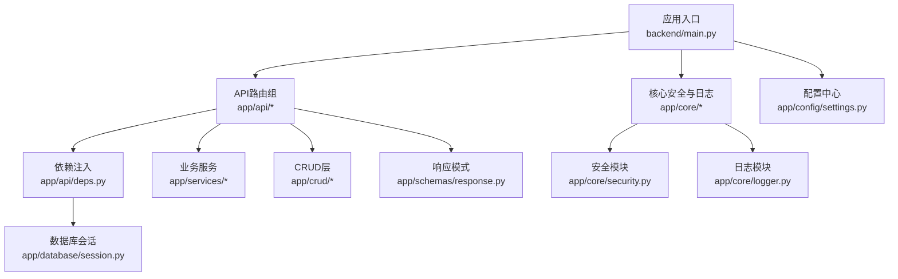
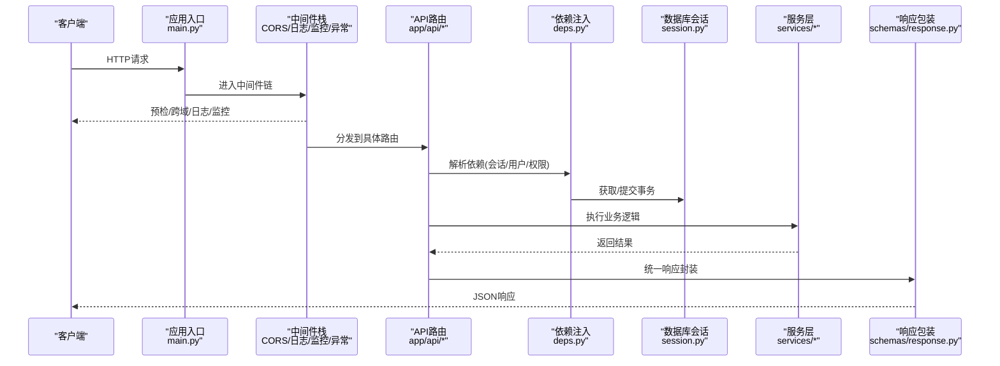
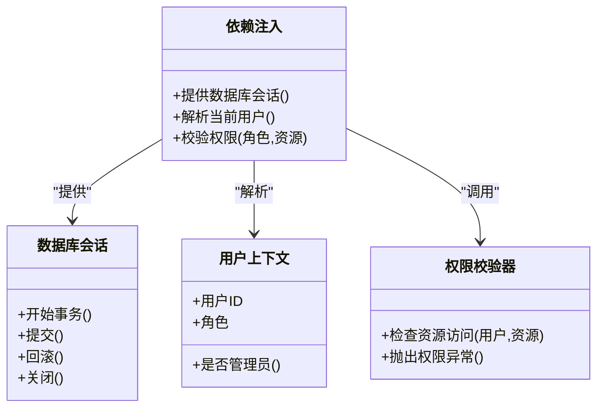
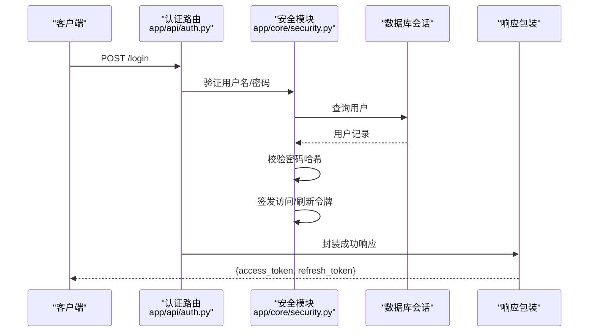
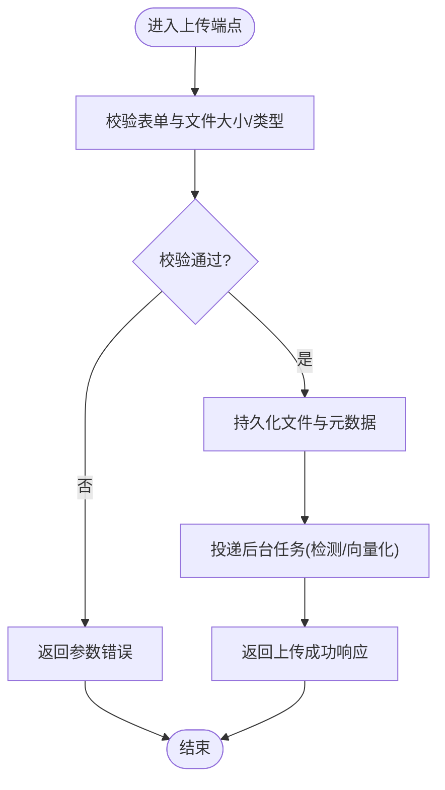
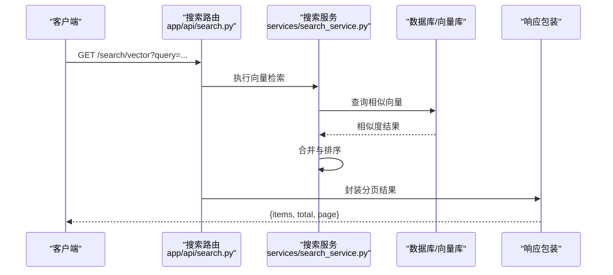
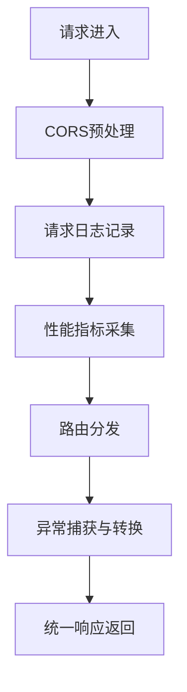
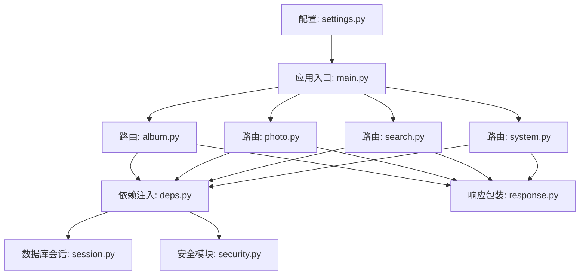

# API层设计

<cite>
**本文引用的文件**   
- [main.py](file://backend/main.py)
- [app/api/deps.py](file://backend/app/api/deps.py)
- [app/api/auth.py](file://backend/app/api/auth.py)
- [app/api/album.py](file://backend/app/api/album.py)
- [app/api/photo.py](file://backend/app/api/photo.py)
- [app/api/search.py](file://backend/app/api/search.py)
- [app/api/system.py](file://backend/app/api/system.py)
- [app/core/security.py](file://backend/app/core/security.py)
- [app/core/logger.py](file://backend/app/core/logger.py)
- [app/database/session.py](file://backend/app/database/session.py)
- [app/schemas/response.py](file://backend/app/schemas/response.py)
- [app/config/settings.py](file://backend/app/config/settings.py)
</cite>

## 目录
1. [简介](#简介)
2. [项目结构](#项目结构)
3. [核心组件](#核心组件)
4. [架构总览](#架构总览)
5. [详细组件分析](#详细组件分析)
6. [依赖关系分析](#依赖关系分析)
7. [性能考虑](#性能考虑)
8. [故障排查指南](#故障排查指南)
9. [结论](#结论)
10. [附录](#附录)

## 简介
本文件聚焦AI智能相册管理系统的API层设计与实现，围绕FastAPI路由组织、请求验证、响应格式化与错误处理展开，深入说明依赖注入（数据库会话、用户认证上下文、权限校验）、中间件（CORS、日志、监控、异常捕获）以及最佳实践（参数校验、分页、文件上传、批量操作），并给出API版本控制与向后兼容策略。

## 项目结构
后端采用分层架构：API路由层位于 app/api，业务服务在 app/services，数据访问在 app/crud，模型与Schema分别在 app/models 与 app/schemas，配置与核心工具在 app/config 与 app/core，数据库会话在 app/database。入口为 backend/main.py，负责应用初始化、中间件注册、路由挂载与全局异常处理。

图表来源
- [main.py:1-200](file://backend/main.py#L1-L200)
- [app/api/deps.py:1-200](file://backend/app/api/deps.py#L1-L200)
- [app/database/session.py:1-200](file://backend/app/database/session.py#L1-L200)
- [app/core/security.py:1-200](file://backend/app/core/security.py#L1-L200)
- [app/core/logger.py:1-200](file://backend/app/core/logger.py#L1-L200)
- [app/config/settings.py:1-200](file://backend/app/config/settings.py#L1-L200)

章节来源
- [main.py:1-200](file://backend/main.py#L1-L200)
- [app/config/settings.py:1-200](file://backend/app/config/settings.py#L1-L200)

## 核心组件
- 路由组织与RESTful风格
  - 按领域划分路由模块：相册 album、照片 photo、搜索 search、系统 system、认证 auth 等，统一挂载到应用根路径或版本前缀下。
  - 使用 FastAPI 的 APIRouter 聚合资源端点，遵循 REST 语义：GET/POST/PUT/PATCH/DELETE 对应查询、创建、更新、部分更新、删除。
- 请求验证机制
  - 基于 Pydantic Schema 进行入参校验，包括必填字段、类型约束、范围与正则表达式等。
  - 对复杂对象（如分页、过滤条件）提供专用 Schema，确保前端传参与后端期望一致。
- 响应格式化
  - 统一响应包装器，包含状态码、消息、数据体与可选元信息（如分页计数）。
  - 通过 Response Model 定义输出结构，屏蔽内部模型细节，保证接口契约稳定。
- 错误处理策略
  - 自定义异常类映射到HTTP状态码，集中返回统一错误格式。
  - 全局异常处理器捕获未处理异常，记录结构化日志并返回友好错误响应。

章节来源
- [app/api/album.py:1-200](file://backend/app/api/album.py#L1-L200)
- [app/api/photo.py:1-200](file://backend/app/api/photo.py#L1-L200)
- [app/api/search.py:1-200](file://backend/app/api/search.py#L1-L200)
- [app/api/system.py:1-200](file://backend/app/api/system.py#L1-L200)
- [app/schemas/response.py:1-200](file://backend/app/schemas/response.py#L1-L200)
- [app/core/exceptions.py:1-200](file://backend/app/core/exceptions.py#L1-L200)

## 架构总览
API层整体流程：客户端请求进入应用入口，经过中间件栈（CORS、日志、监控、异常捕获），到达路由层；路由通过依赖注入获取数据库会话、当前用户与权限上下文，调用服务层完成业务逻辑，最终经统一响应包装返回。

图表来源
- [main.py:1-200](file://backend/main.py#L1-L200)
- [app/api/deps.py:1-200](file://backend/app/api/deps.py#L1-L200)
- [app/database/session.py:1-200](file://backend/app/database/session.py#L1-L200)
- [app/schemas/response.py:1-200](file://backend/app/schemas/response.py#L1-L200)

## 详细组件分析

### 依赖注入系统（数据库会话、用户认证、权限验证）
- 数据库会话管理
  - 通过依赖函数提供可重用的数据库会话，支持自动开启/关闭事务，失败时回滚。
  - 路由中声明式注入会话，避免手动管理连接生命周期。
- 用户认证上下文
  - 从请求头或Cookie中提取令牌，解码后生成当前用户上下文。
  - 将用户ID、角色等信息注入到后续处理函数，供权限校验使用。
- 权限验证
  - 基于角色的访问控制（RBAC）装饰器或依赖项，检查当前用户对资源的访问权限。
  - 针对相册、照片等资源提供细粒度权限判断（所有者、协作者、管理员）。

图表来源
- [app/api/deps.py:1-200](file://backend/app/api/deps.py#L1-L200)
- [app/database/session.py:1-200](file://backend/app/database/session.py#L1-L200)
- [app/core/security.py:1-200](file://backend/app/core/security.py#L1-L200)

章节来源
- [app/api/deps.py:1-200](file://backend/app/api/deps.py#L1-L200)
- [app/database/session.py:1-200](file://backend/app/database/session.py#L1-L200)
- [app/core/security.py:1-200](file://backend/app/core/security.py#L1-L200)

### 认证与安全（JWT、密码哈希、令牌刷新）
- 令牌签发与验证
  - 登录成功后签发短期访问令牌与长期刷新令牌，支持无感续期。
  - 令牌中包含用户标识与过期时间，服务端验签并检查有效性。
- 密码安全
  - 使用强哈希算法存储密码，禁止明文保存。
- 安全中间件
  - 设置安全相关响应头（如HSTS、X-Frame-Options），防止常见Web攻击。

图表来源
- [app/api/auth.py:1-200](file://backend/app/api/auth.py#L1-L200)
- [app/core/security.py:1-200](file://backend/app/core/security.py#L1-L200)
- [app/schemas/response.py:1-200](file://backend/app/schemas/response.py#L1-L200)

章节来源
- [app/api/auth.py:1-200](file://backend/app/api/auth.py#L1-L200)
- [app/core/security.py:1-200](file://backend/app/core/security.py#L1-L200)

### 相册与照片API（RESTful端点、分页、批量操作、文件上传）
- 相册资源
  - GET /albums：列表查询，支持分页、排序与过滤。
  - POST /albums：创建相册，校验名称与描述。
  - PUT /albums/{id}：更新相册信息。
  - DELETE /albums/{id}：删除相册（软删除或物理删除）。
- 照片资源
  - GET /photos：列表查询，支持按相册、标签、时间范围筛选。
  - POST /photos：上传单张照片，生成缩略图与向量。
  - PATCH /photos/{id}：部分更新（如标签、描述）。
  - DELETE /photos/{id}：删除照片。
  - POST /photos/batch：批量操作（批量添加标签、批量移动至相册）。
- 文件上传
  - 使用 multipart/form-data 接收文件，限制大小与类型，异步处理大图与视频。
  - 上传成功后触发后台任务（人脸检测、特征提取、索引构建）。

图表来源
- [app/api/photo.py:1-200](file://backend/app/api/photo.py#L1-L200)
- [app/api/album.py:1-200](file://backend/app/api/album.py#L1-L200)
- [app/schemas/response.py:1-200](file://backend/app/schemas/response.py#L1-L200)

章节来源
- [app/api/album.py:1-200](file://backend/app/api/album.py#L1-L200)
- [app/api/photo.py:1-200](file://backend/app/api/photo.py#L1-L200)

### 搜索与检索API（全文、向量、多模态）
- 文本搜索
  - GET /search/text：关键词匹配，支持高亮与分页。
- 向量检索
  - GET /search/vector：以图搜图或语义检索，返回相似照片列表。
- 组合查询
  - GET /search/advanced：结合标签、时间、地点等多维条件。

图表来源
- [app/api/search.py:1-200](file://backend/app/api/search.py#L1-L200)
- [app/schemas/response.py:1-200](file://backend/app/schemas/response.py#L1-L200)

章节来源
- [app/api/search.py:1-200](file://backend/app/api/search.py#L1-L200)

### 系统与监控API（健康检查、指标、配置）
- 健康检查
  - GET /system/health：返回服务可用性与依赖状态（数据库、缓存、外部服务）。
- 指标与统计
  - GET /system/metrics：暴露关键指标（QPS、延迟、错误率）。
- 配置读取
  - GET /system/config：只读配置（脱敏），便于前端动态调整。

章节来源
- [app/api/system.py:1-200](file://backend/app/api/system.py#L1-L200)

### 中间件架构（CORS、日志、监控、异常捕获）
- CORS配置
  - 允许指定域名、方法与头部，生产环境严格白名单。
- 请求日志
  - 记录请求方法、路径、耗时、状态码与用户代理，敏感字段脱敏。
- 性能监控
  - 采集端点级耗时与错误率，上报到监控系统。
- 异常捕获
  - 全局异常处理器统一捕获未处理异常，记录堆栈并返回标准错误格式。

图表来源
- [main.py:1-200](file://backend/main.py#L1-L200)
- [app/core/logger.py:1-200](file://backend/app/core/logger.py#L1-L200)

章节来源
- [main.py:1-200](file://backend/main.py#L1-L200)
- [app/core/logger.py:1-200](file://backend/app/core/logger.py#L1-L200)

### API版本控制与向后兼容
- 版本前缀
  - 使用 /api/v1、/api/v2 等前缀区分大版本，逐步迁移旧接口。
- 弃用策略
  - 对即将废弃的端点返回警告头，保留至少一个主版本周期。
- 兼容性保证
  - 新增字段默认可选，不破坏现有客户端解析。
  - 变更响应结构时提供过渡期双写或适配器。

章节来源
- [main.py:1-200](file://backend/main.py#L1-L200)

## 依赖关系分析
API层依赖关系如下：路由模块依赖依赖注入与响应包装；依赖注入依赖数据库会话与安全模块；服务层依赖CRUD与外部服务；配置由settings统一管理。

图表来源
- [app/api/album.py:1-200](file://backend/app/api/album.py#L1-L200)
- [app/api/photo.py:1-200](file://backend/app/api/photo.py#L1-L200)
- [app/api/search.py:1-200](file://backend/app/api/search.py#L1-L200)
- [app/api/system.py:1-200](file://backend/app/api/system.py#L1-L200)
- [app/api/deps.py:1-200](file://backend/app/api/deps.py#L1-L200)
- [app/database/session.py:1-200](file://backend/app/database/session.py#L1-L200)
- [app/core/security.py:1-200](file://backend/app/core/security.py#L1-L200)
- [app/schemas/response.py:1-200](file://backend/app/schemas/response.py#L1-L200)
- [app/config/settings.py:1-200](file://backend/app/config/settings.py#L1-L200)
- [main.py:1-200](file://backend/main.py#L1-L200)

章节来源
- [app/api/deps.py:1-200](file://backend/app/api/deps.py#L1-L200)
- [app/database/session.py:1-200](file://backend/app/database/session.py#L1-L200)
- [app/core/security.py:1-200](file://backend/app/core/security.py#L1-L200)
- [app/schemas/response.py:1-200](file://backend/app/schemas/response.py#L1-L200)
- [app/config/settings.py:1-200](file://backend/app/config/settings.py#L1-L200)
- [main.py:1-200](file://backend/main.py#L1-L200)

## 性能考虑
- 数据库层面
  - 合理使用索引与分页，避免全表扫描与大偏移量查询。
  - 使用连接池与会话复用，减少连接开销。
- 计算密集型任务
  - 将人脸检测、特征提取、缩略图生成等放入后台任务队列，避免阻塞请求。
- 缓存策略
  - 热点数据（如相册列表、热门照片）使用内存缓存或分布式缓存。
- 限流与熔断
  - 对上传与搜索等高负载端点进行速率限制，保护后端稳定性。

[本节为通用指导，无需特定文件引用]

## 故障排查指南
- 常见问题定位
  - 参数校验失败：检查Pydantic Schema与前端传参一致性。
  - 认证失败：确认令牌有效性与签名，检查用户状态。
  - 权限不足：核对角色与资源访问策略。
  - 上传失败：检查文件大小、类型与存储路径权限。
- 日志与监控
  - 查看请求日志中的耗时与错误堆栈，定位慢查询与异常路径。
  - 使用系统指标观察QPS、延迟与错误率趋势。
- 恢复建议
  - 对幂等接口重试，非幂等接口需去抖与补偿。
  - 对后台任务失败进行重试与告警。

章节来源
- [app/core/logger.py:1-200](file://backend/app/core/logger.py#L1-L200)
- [app/core/exceptions.py:1-200](file://backend/app/core/exceptions.py#L1-L200)

## 结论
API层通过清晰的分层与依赖注入实现了高内聚低耦合的设计，配合统一的响应包装与全局异常处理提升了可维护性与可观测性。RESTful端点组织、严格的参数校验与完善的中间件栈保障了接口的稳定性与安全性。版本控制与向后兼容策略为持续演进提供了保障。

[本节为总结，无需特定文件引用]

## 附录
- 最佳实践清单
  - 使用Pydantic Schema进行输入输出校验。
  - 统一响应结构与错误码规范。
  - 依赖注入管理数据库会话与用户上下文。
  - 中间件覆盖CORS、日志、监控与异常。
  - 对文件上传与批量操作进行限流与异步处理。
  - 明确API版本前缀与弃用策略。

[本节为补充说明，无需特定文件引用]