# 后端架构设计

<cite>
**本文引用的文件**   
- [main.py](file://backend/main.py)
- [settings.py](file://backend/app/config/settings.py)
- [session.py](file://backend/app/database/session.py)
- [storage.py](file://backend/app/database/storage.py)
- [deps.py](file://backend/app/api/deps.py)
- [auth.py](file://backend/app/api/auth.py)
- [security.py](file://backend/app/core/security.py)
- [exceptions.py](file://backend/app/core/exceptions.py)
- [logger.py](file://backend/app/core/logger.py)
- [album.py](file://backend/app/api/album.py)
- [photo.py](file://backend/app/api/photo.py)
- [search.py](file://backend/app/api/search.py)
- [tasks.py](file://backend/app/api/tasks.py)
- [agent.py](file://backend/app/api/agent.py)
- [face.py](file://backend/app/api/face.py)
- [albums_service.py](file://backend/app/services/album_service.py)
- [photo_service.py](file://backend/app/services/photo_service.py)
- [search_service.py](file://backend/app/services/search_service.py)
- [detection_service.py](file://backend/app/services/detection_service.py)
- [face_cluster_service.py](file://backend/app/services/face_cluster_service.py)
- [exif_service.py](file://backend/app/services/exif_service.py)
- [geocode_service.py](file://backend/app/services/geocode_service.py)
- [name_confirmation_service.py](file://backend/app/services/name_confirmation_service.py)
- [tag_service.py](file://backend/app/services/tag_service.py)
- [thumbnail.py](file://backend/app/services/thumbnail.py)
- [training_service.py](file://backend/app/services/training_service.py)
- [trainer.py](file://backend/app/services/trainer.py)
- [chat_agent.py](file://backend/app/services/agent/chat_agent.py)
- [detection_agent.py](file://backend/app/services/agent/detection_agent.py)
- [face_agent.py](file://backend/app/services/agent/face_agent.py)
- [llm_agent.py](file://backend/app/services/agent/llm_agent.py)
- [metadata_agent.py](file://backend/app/services/agent/metadata_agent.py)
- [search_agent.py](file://backend/app/services/agent/search_agent.py)
- [supervisor.py](file://backend/app/services/agent/supervisor.py)
- [embedding.py](file://backend/app/services/ai_providers/embedding.py)
- [task_worker.py](file://backend/app/tasks/task_worker.py)
- [dispatcher.py](file://backend/app/tasks/dispatcher.py)
- [scheduler.py](file://backend/app/tasks/scheduler.py)
- [detection_tasks.py](file://backend/app/tasks/detection_tasks.py)
- [vector_tasks.py](file://backend/app/tasks/vector_tasks.py)
- [user.py](file://backend/app/models/user.py)
- [photo_model.py](file://backend/app/models/photo.py)
- [album_model.py](file://backend/app/models/album.py)
- [face_model.py](file://backend/app/models/face.py)
- [task_model.py](file://backend/app/models/task.py)
- [agent_model.py](file://backend/app/models/agent.py)
- [description_model.py](file://backend/app/models/description.py)
- [training_model.py](file://backend/app/models/training.py)
- [user_schema.py](file://backend/app/schemas/user.py)
- [photo_schema.py](file://backend/app/schemas/photo.py)
- [album_schema.py](file://backend/app/schemas/album.py)
- [face_schema.py](file://backend/app/schemas/face.py)
- [task_schema.py](file://backend/app/schemas/task.py)
- [response_schema.py](file://backend/app/schemas/response.py)
</cite>

## 目录
1. [简介](#简介)
2. [项目结构](#项目结构)
3. [核心组件](#核心组件)
4. [架构总览](#架构总览)
5. [详细组件分析](#详细组件分析)
6. [依赖关系分析](#依赖关系分析)
7. [性能考虑](#性能考虑)
8. [故障排查指南](#故障排查指南)
9. [结论](#结论)
10. [附录](#附录)

## 简介
本文件面向AI智能相册管理系统的后端，系统性阐述FastAPI分层架构与关键机制：API层、服务层、模型层的职责分离与交互；依赖注入、中间件、安全认证、配置管理；数据库连接池、缓存策略、任务队列集成；错误处理、日志记录与性能监控。文档同时提供调用序列与数据流转的图示，帮助读者快速理解系统结构与扩展方式。

## 项目结构
后端采用按“功能域+层次”组织的方式：
- API层：路由定义、请求校验、响应封装、依赖注入
- 服务层：业务编排、外部能力调用（AI/向量/地理编码等）、事务边界
- 模型层：SQLAlchemy ORM实体映射
- 模式层：Pydantic请求/响应Schema
- 配置与安全：集中式配置、JWT鉴权、异常与日志
- 任务系统：异步任务调度、分发器与工作进程
- 数据库与存储：会话管理、对象存储抽象

```mermaid
graph TB
subgraph "应用入口"
M["main.py"]
end
subgraph "API层"
A1["api/album.py"]
A2["api/photo.py"]
A3["api/search.py"]
A4["api/tasks.py"]
A5["api/agent.py"]
A6["api/face.py"]
D["api/deps.py"]
end
subgraph "服务层"
S1["services/album_service.py"]
S2["services/photo_service.py"]
S3["services/search_service.py"]
S4["services/detection_service.py"]
S5["services/face_cluster_service.py"]
S6["services/exif_service.py"]
S7["services/geocode_service.py"]
S8["services/name_confirmation_service.py"]
S9["services/tag_service.py"]
S10["services/thumbnail.py"]
S11["services/training_service.py"]
S12["services/trainer.py"]
SA["services/agent/*"]
SP["services/ai_providers/embedding.py"]
end
subgraph "模型与模式"
MD["models/*"]
SC["schemas/*"]
end
subgraph "基础设施"
CFG["config/settings.py"]
SEC["core/security.py"]
EXC["core/exceptions.py"]
LOG["core/logger.py"]
DBS["database/session.py"]
STO["database/storage.py"]
DEP["api/deps.py"]
end
subgraph "任务系统"
TWD["tasks/task_worker.py"]
DSP["tasks/dispatcher.py"]
SCH["tasks/scheduler.py"]
DT["tasks/detection_tasks.py"]
VT["tasks/vector_tasks.py"]
end
M --> A1 & A2 & A3 & A4 & A5 & A6
A1 --> S1
A2 --> S2
A3 --> S3
A4 --> TWD
A5 --> SA
A6 --> S5
S1 --> MD & SC
S2 --> MD & SC
S3 --> MD & SC
S4 --> MD & SC
S5 --> MD & SC
S6 --> MD & SC
S7 --> MD & SC
S8 --> MD & SC
S9 --> MD & SC
S10 --> MD & SC
S11 --> MD & SC
S12 --> MD & SC
SA --> SP
A1 --> DEP
A2 --> DEP
A3 --> DEP
A4 --> DEP
A5 --> DEP
A6 --> DEP
DEP --> DBS
DEP --> STO
DEP --> SEC
DEP --> CFG
M --> CFG
M --> LOG
M --> EXC
M --> DBS
M --> STO
M --> SEC
M --> DEP
TWD --> DSP
TWD --> SCH
DSP --> DT
DSP --> VT
```

图表来源
- [main.py](file://backend/main.py)
- [settings.py](file://backend/app/config/settings.py)
- [session.py](file://backend/app/database/session.py)
- [storage.py](file://backend/app/database/storage.py)
- [deps.py](file://backend/app/api/deps.py)
- [security.py](file://backend/app/core/security.py)
- [exceptions.py](file://backend/app/core/exceptions.py)
- [logger.py](file://backend/app/core/logger.py)
- [album.py](file://backend/app/api/album.py)
- [photo.py](file://backend/app/api/photo.py)
- [search.py](file://backend/app/api/search.py)
- [tasks.py](file://backend/app/api/tasks.py)
- [agent.py](file://backend/app/api/agent.py)
- [face.py](file://backend/app/api/face.py)
- [albums_service.py](file://backend/app/services/album_service.py)
- [photo_service.py](file://backend/app/services/photo_service.py)
- [search_service.py](file://backend/app/services/search_service.py)
- [detection_service.py](file://backend/app/services/detection_service.py)
- [face_cluster_service.py](file://backend/app/services/face_cluster_service.py)
- [exif_service.py](file://backend/app/services/exif_service.py)
- [geocode_service.py](file://backend/app/services/geocode_service.py)
- [name_confirmation_service.py](file://backend/app/services/name_confirmation_service.py)
- [tag_service.py](file://backend/app/services/tag_service.py)
- [thumbnail.py](file://backend/app/services/thumbnail.py)
- [training_service.py](file://backend/app/services/training_service.py)
- [trainer.py](file://backend/app/services/trainer.py)
- [chat_agent.py](file://backend/app/services/agent/chat_agent.py)
- [detection_agent.py](file://backend/app/services/agent/detection_agent.py)
- [face_agent.py](file://backend/app/services/agent/face_agent.py)
- [llm_agent.py](file://backend/app/services/agent/llm_agent.py)
- [metadata_agent.py](file://backend/app/services/agent/metadata_agent.py)
- [search_agent.py](file://backend/app/services/agent/search_agent.py)
- [supervisor.py](file://backend/app/services/agent/supervisor.py)
- [embedding.py](file://backend/app/services/ai_providers/embedding.py)
- [task_worker.py](file://backend/app/tasks/task_worker.py)
- [dispatcher.py](file://backend/app/tasks/dispatcher.py)
- [scheduler.py](file://backend/app/tasks/scheduler.py)
- [detection_tasks.py](file://backend/app/tasks/detection_tasks.py)
- [vector_tasks.py](file://backend/app/tasks/vector_tasks.py)

章节来源
- [main.py](file://backend/main.py)
- [settings.py](file://backend/app/config/settings.py)
- [session.py](file://backend/app/database/session.py)
- [storage.py](file://backend/app/database/storage.py)
- [deps.py](file://backend/app/api/deps.py)
- [auth.py](file://backend/app/api/auth.py)
- [security.py](file://backend/app/core/security.py)
- [exceptions.py](file://backend/app/core/exceptions.py)
- [logger.py](file://backend/app/core/logger.py)

## 核心组件
- 应用入口与生命周期
  - 启动时加载配置、注册中间件、挂载路由、初始化日志与异常处理器、创建数据库引擎与会话工厂、准备对象存储客户端。
- 配置管理
  - 集中式配置类，支持环境变量覆盖，提供数据库URL、存储路径、JWT密钥、第三方服务凭据等。
- 依赖注入
  - 通过FastAPI的Depends提供DB会话、存储客户端、当前用户上下文、权限校验等可复用依赖。
- 安全认证
  - JWT签发与验证、密码哈希、基于角色的访问控制（RBAC）装饰器或依赖。
- 错误处理
  - 统一异常类型与HTTP状态码映射、全局异常处理器、结构化错误响应。
- 日志记录
  - 结构化日志、分级输出、请求链路追踪ID注入。
- 数据库与存储
  - 连接池化Session工厂、ORM模型映射、对象存储抽象（本地/云存储）。
- 任务系统
  - 任务定义、调度器、分发器与工作进程，解耦耗时操作（检测、向量化、训练等）。

章节来源
- [main.py](file://backend/main.py)
- [settings.py](file://backend/app/config/settings.py)
- [deps.py](file://backend/app/api/deps.py)
- [security.py](file://backend/app/core/security.py)
- [exceptions.py](file://backend/app/core/exceptions.py)
- [logger.py](file://backend/app/core/logger.py)
- [session.py](file://backend/app/database/session.py)
- [storage.py](file://backend/app/database/storage.py)

## 架构总览
系统遵循清晰的分层与关注点分离：
- API层仅负责协议适配、参数校验、依赖解析与响应包装
- 服务层承载业务编排与跨领域协作
- 模型层专注数据持久化映射
- 任务系统异步化长耗时流程
- 安全与配置贯穿各层

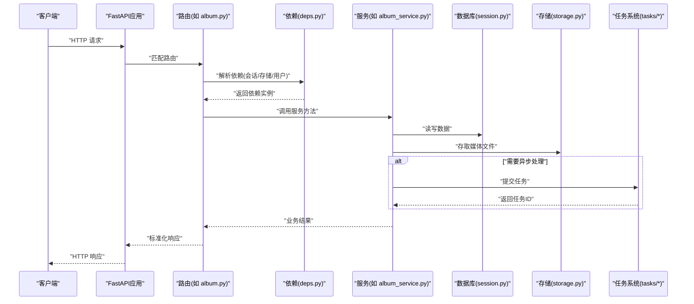

图表来源
- [main.py](file://backend/main.py)
- [deps.py](file://backend/app/api/deps.py)
- [album.py](file://backend/app/api/album.py)
- [albums_service.py](file://backend/app/services/album_service.py)
- [session.py](file://backend/app/database/session.py)
- [storage.py](file://backend/app/database/storage.py)
- [task_worker.py](file://backend/app/tasks/task_worker.py)
- [dispatcher.py](file://backend/app/tasks/dispatcher.py)
- [scheduler.py](file://backend/app/tasks/scheduler.py)

## 详细组件分析

### API层与依赖注入
- 路由职责
  - 接收并校验请求体/查询参数，调用服务层，返回统一响应格式。
- 依赖注入要点
  - 使用Depends提供DB会话、存储客户端、当前用户、权限检查等。
  - 将共享资源（如配置、日志器）以单例形式注入，避免重复初始化。
- 典型调用链
  - 路由 -> 依赖解析 -> 服务 -> 模型/存储 -> 响应

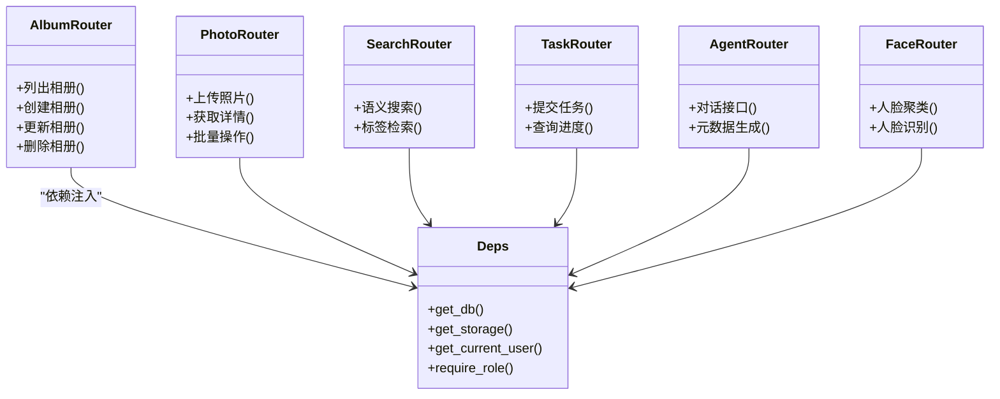

图表来源
- [album.py](file://backend/app/api/album.py)
- [photo.py](file://backend/app/api/photo.py)
- [search.py](file://backend/app/api/search.py)
- [tasks.py](file://backend/app/api/tasks.py)
- [agent.py](file://backend/app/api/agent.py)
- [face.py](file://backend/app/api/face.py)
- [deps.py](file://backend/app/api/deps.py)

章节来源
- [album.py](file://backend/app/api/album.py)
- [photo.py](file://backend/app/api/photo.py)
- [search.py](file://backend/app/api/search.py)
- [tasks.py](file://backend/app/api/tasks.py)
- [agent.py](file://backend/app/api/agent.py)
- [face.py](file://backend/app/api/face.py)
- [deps.py](file://backend/app/api/deps.py)

### 服务层与业务编排
- 职责边界
  - 聚合多个模型/存储/外部服务的调用，保证事务一致性与错误回滚。
- 典型服务
  - 相册服务：CRUD、成员管理、排序与筛选
  - 照片服务：上传、转缩略图、EXIF提取、标签/描述生成
  - 搜索服务：文本/向量检索、过滤条件组合
  - 检测服务：目标/场景检测、属性抽取
  - 人脸服务：人脸检测、聚类、识别
  - 训练服务：数据集准备、模型训练、评估
  - 代理服务：多Agent协同（聊天、检测、人脸、LLM、元数据、搜索、监督）
- 与外部能力集成
  - AI提供者（如嵌入向量）、地理编码、缩略图生成、任务队列

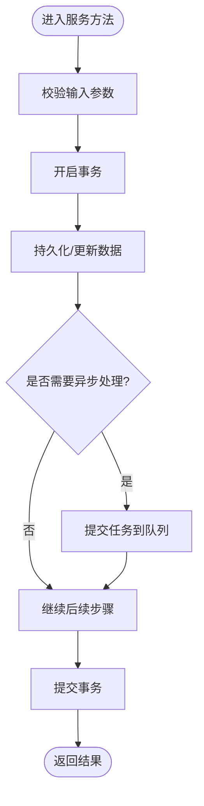

图表来源
- [albums_service.py](file://backend/app/services/album_service.py)
- [photo_service.py](file://backend/app/services/photo_service.py)
- [search_service.py](file://backend/app/services/search_service.py)
- [detection_service.py](file://backend/app/services/detection_service.py)
- [face_cluster_service.py](file://backend/app/services/face_cluster_service.py)
- [exif_service.py](file://backend/app/services/exif_service.py)
- [geocode_service.py](file://backend/app/services/geocode_service.py)
- [name_confirmation_service.py](file://backend/app/services/name_confirmation_service.py)
- [tag_service.py](file://backend/app/services/tag_service.py)
- [thumbnail.py](file://backend/app/services/thumbnail.py)
- [training_service.py](file://backend/app/services/training_service.py)
- [trainer.py](file://backend/app/services/trainer.py)
- [chat_agent.py](file://backend/app/services/agent/chat_agent.py)
- [detection_agent.py](file://backend/app/services/agent/detection_agent.py)
- [face_agent.py](file://backend/app/services/agent/face_agent.py)
- [llm_agent.py](file://backend/app/services/agent/llm_agent.py)
- [metadata_agent.py](file://backend/app/services/agent/metadata_agent.py)
- [search_agent.py](file://backend/app/services/agent/search_agent.py)
- [supervisor.py](file://backend/app/services/agent/supervisor.py)

章节来源
- [albums_service.py](file://backend/app/services/album_service.py)
- [photo_service.py](file://backend/app/services/photo_service.py)
- [search_service.py](file://backend/app/services/search_service.py)
- [detection_service.py](file://backend/app/services/detection_service.py)
- [face_cluster_service.py](file://backend/app/services/face_cluster_service.py)
- [exif_service.py](file://backend/app/services/exif_service.py)
- [geocode_service.py](file://backend/app/services/geocode_service.py)
- [name_confirmation_service.py](file://backend/app/services/name_confirmation_service.py)
- [tag_service.py](file://backend/app/services/tag_service.py)
- [thumbnail.py](file://backend/app/services/thumbnail.py)
- [training_service.py](file://backend/app/services/training_service.py)
- [trainer.py](file://backend/app/services/trainer.py)
- [chat_agent.py](file://backend/app/services/agent/chat_agent.py)
- [detection_agent.py](file://backend/app/services/agent/detection_agent.py)
- [face_agent.py](file://backend/app/services/agent/face_agent.py)
- [llm_agent.py](file://backend/app/services/agent/llm_agent.py)
- [metadata_agent.py](file://backend/app/services/agent/metadata_agent.py)
- [search_agent.py](file://backend/app/services/agent/search_agent.py)
- [supervisor.py](file://backend/app/services/agent/supervisor.py)

### 模型层与模式层
- 模型层
  - 使用ORM映射表结构，定义字段、索引、关联关系与约束。
- 模式层
  - 使用Pydantic定义请求/响应结构，实现自动校验与序列化。
- 典型实体
  - 用户、照片、相册、人脸、任务、代理、描述、训练记录等

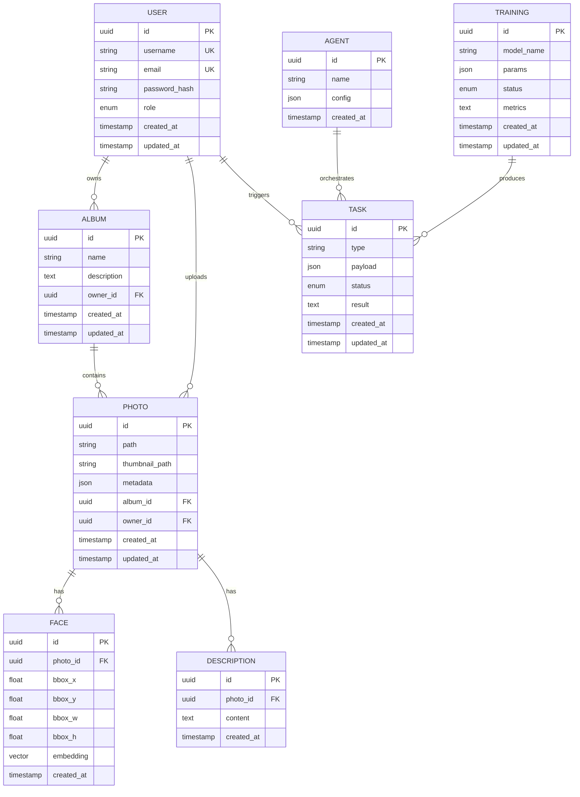

图表来源
- [user.py](file://backend/app/models/user.py)
- [photo_model.py](file://backend/app/models/photo.py)
- [album_model.py](file://backend/app/models/album.py)
- [face_model.py](file://backend/app/models/face.py)
- [task_model.py](file://backend/app/models/task.py)
- [agent_model.py](file://backend/app/models/agent.py)
- [description_model.py](file://backend/app/models/description.py)
- [training_model.py](file://backend/app/models/training.py)

章节来源
- [user.py](file://backend/app/models/user.py)
- [photo_model.py](file://backend/app/models/photo.py)
- [album_model.py](file://backend/app/models/album.py)
- [face_model.py](file://backend/app/models/face.py)
- [task_model.py](file://backend/app/models/task.py)
- [agent_model.py](file://backend/app/models/agent.py)
- [description_model.py](file://backend/app/models/description.py)
- [training_model.py](file://backend/app/models/training.py)
- [user_schema.py](file://backend/app/schemas/user.py)
- [photo_schema.py](file://backend/app/schemas/photo.py)
- [album_schema.py](file://backend/app/schemas/album.py)
- [face_schema.py](file://backend/app/schemas/face.py)
- [task_schema.py](file://backend/app/schemas/task.py)
- [response_schema.py](file://backend/app/schemas/response.py)

### 安全认证与授权
- 认证流程
  - 登录接口校验用户名/密码，签发JWT令牌；后续请求携带令牌进行身份核验。
- 授权策略
  - 基于角色/资源的访问控制，在依赖中注入当前用户并进行权限判断。
- 安全实践
  - 密码哈希、令牌过期时间、最小权限原则、敏感配置从环境变量读取。

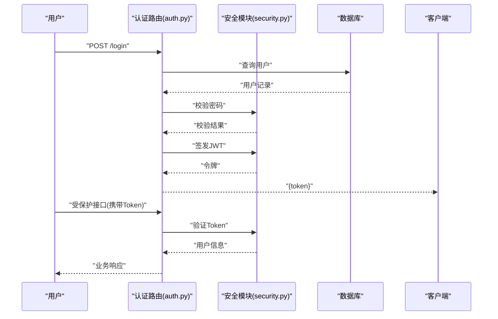

图表来源
- [auth.py](file://backend/app/api/auth.py)
- [security.py](file://backend/app/core/security.py)
- [session.py](file://backend/app/database/session.py)

章节来源
- [auth.py](file://backend/app/api/auth.py)
- [security.py](file://backend/app/core/security.py)

### 配置管理与中间件
- 配置管理
  - 集中式设置类，支持默认值与环境变量覆盖；为数据库、存储、第三方服务提供统一入口。
- 中间件
  - 请求日志、CORS、速率限制、请求ID注入、安全头设置等。
- 启动装配
  - 应用入口注册中间件、挂载路由、初始化全局资源。

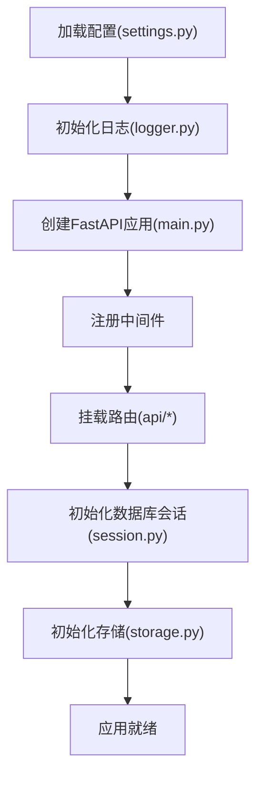

图表来源
- [settings.py](file://backend/app/config/settings.py)
- [logger.py](file://backend/app/core/logger.py)
- [main.py](file://backend/main.py)
- [session.py](file://backend/app/database/session.py)
- [storage.py](file://backend/app/database/storage.py)

章节来源
- [settings.py](file://backend/app/config/settings.py)
- [logger.py](file://backend/app/core/logger.py)
- [main.py](file://backend/main.py)

### 数据库连接池与对象存储
- 数据库连接池
  - 使用连接池化的会话工厂，确保并发安全与资源复用；提供依赖注入的会话获取器。
- 对象存储
  - 抽象存储接口，支持本地文件系统与云存储；提供上传、下载、删除、URL生成等方法。

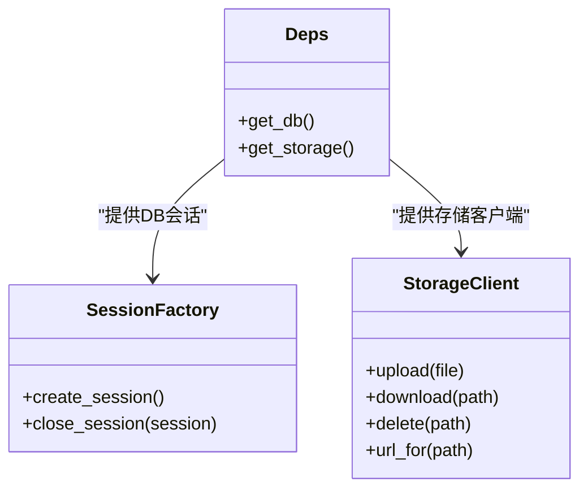

图表来源
- [session.py](file://backend/app/database/session.py)
- [storage.py](file://backend/app/database/storage.py)
- [deps.py](file://backend/app/api/deps.py)

章节来源
- [session.py](file://backend/app/database/session.py)
- [storage.py](file://backend/app/database/storage.py)
- [deps.py](file://backend/app/api/deps.py)

### 任务队列与异步处理
- 任务定义
  - 检测、向量化、训练等耗时操作定义为任务类型，包含负载与状态。
- 调度与分发
  - 调度器定时触发任务，分发器根据类型路由至具体工作进程。
- 工作进程
  - 独立进程执行任务，更新任务状态与结果，支持重试与失败告警。

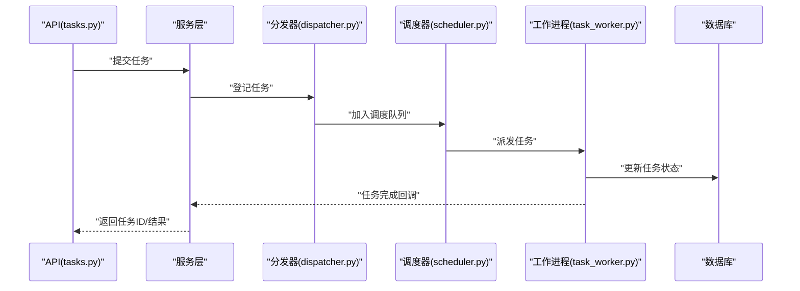

图表来源
- [tasks.py](file://backend/app/api/tasks.py)
- [dispatcher.py](file://backend/app/tasks/dispatcher.py)
- [scheduler.py](file://backend/app/tasks/scheduler.py)
- [task_worker.py](file://backend/app/tasks/task_worker.py)
- [detection_tasks.py](file://backend/app/tasks/detection_tasks.py)
- [vector_tasks.py](file://backend/app/tasks/vector_tasks.py)

章节来源
- [tasks.py](file://backend/app/api/tasks.py)
- [dispatcher.py](file://backend/app/tasks/dispatcher.py)
- [scheduler.py](file://backend/app/tasks/scheduler.py)
- [task_worker.py](file://backend/app/tasks/task_worker.py)
- [detection_tasks.py](file://backend/app/tasks/detection_tasks.py)
- [vector_tasks.py](file://backend/app/tasks/vector_tasks.py)

### 错误处理与日志记录
- 错误处理
  - 自定义异常类型与HTTP状态码映射；全局异常处理器统一返回结构化错误。
- 日志记录
  - 结构化日志、分级输出、请求链路ID注入，便于问题定位与审计。

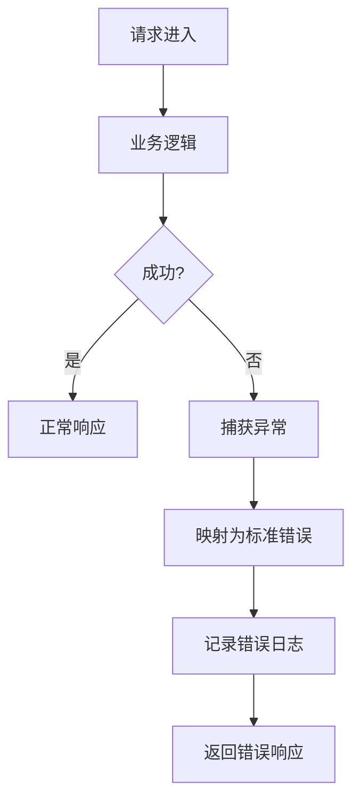

图表来源
- [exceptions.py](file://backend/app/core/exceptions.py)
- [logger.py](file://backend/app/core/logger.py)
- [main.py](file://backend/main.py)

章节来源
- [exceptions.py](file://backend/app/core/exceptions.py)
- [logger.py](file://backend/app/core/logger.py)
- [main.py](file://backend/main.py)

### 示例：照片上传与处理的端到端流程
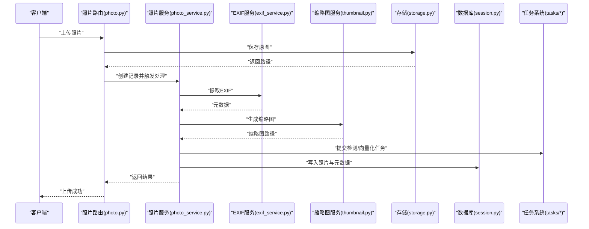

图表来源
- [photo.py](file://backend/app/api/photo.py)
- [photo_service.py](file://backend/app/services/photo_service.py)
- [exif_service.py](file://backend/app/services/exif_service.py)
- [thumbnail.py](file://backend/app/services/thumbnail.py)
- [storage.py](file://backend/app/database/storage.py)
- [session.py](file://backend/app/database/session.py)
- [task_worker.py](file://backend/app/tasks/task_worker.py)
- [dispatcher.py](file://backend/app/tasks/dispatcher.py)
- [scheduler.py](file://backend/app/tasks/scheduler.py)

## 依赖关系分析
- 耦合与内聚
  - API层对服务层低耦合，通过依赖注入获得DB/存储/用户上下文，提升可测试性。
  - 服务层内聚业务规则，对外暴露稳定接口，屏蔽底层细节。
- 外部依赖
  - 数据库、对象存储、AI提供者、任务队列等通过抽象接口接入，便于替换与扩展。
- 潜在循环依赖
  - 服务层之间应避免直接相互引用，必要时通过事件或任务解耦。

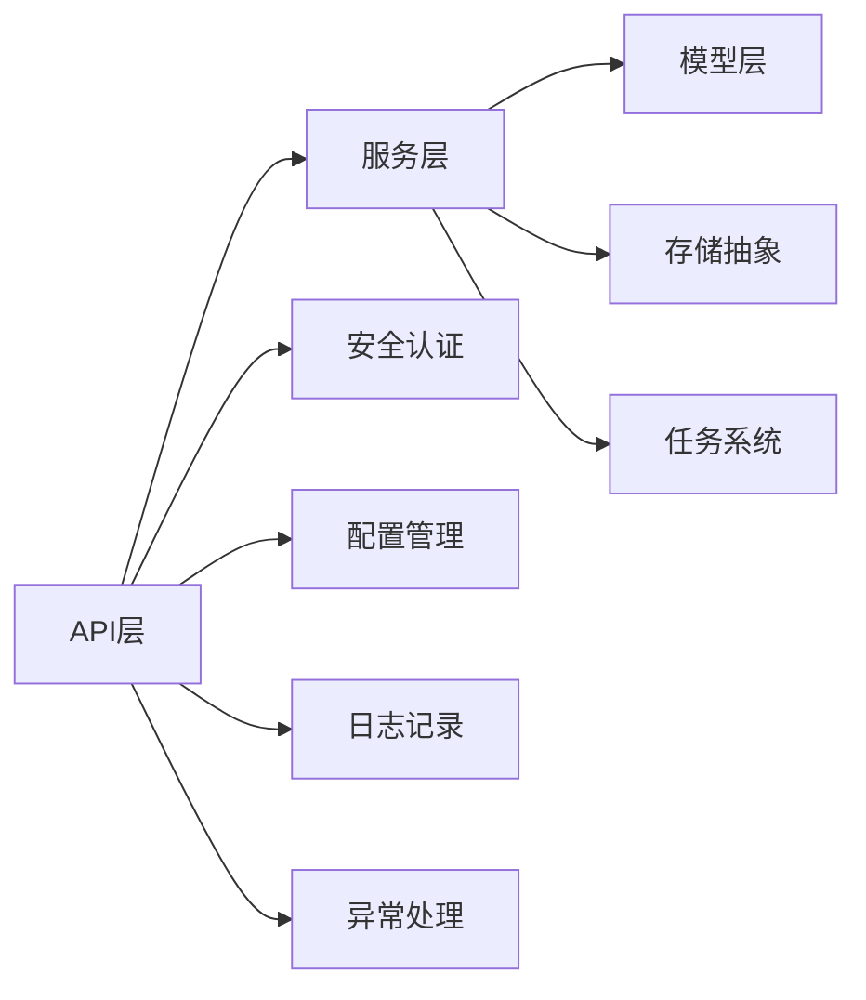

图表来源
- [deps.py](file://backend/app/api/deps.py)
- [security.py](file://backend/app/core/security.py)
- [settings.py](file://backend/app/config/settings.py)
- [logger.py](file://backend/app/core/logger.py)
- [exceptions.py](file://backend/app/core/exceptions.py)
- [storage.py](file://backend/app/database/storage.py)
- [task_worker.py](file://backend/app/tasks/task_worker.py)

章节来源
- [deps.py](file://backend/app/api/deps.py)
- [security.py](file://backend/app/core/security.py)
- [settings.py](file://backend/app/config/settings.py)
- [logger.py](file://backend/app/core/logger.py)
- [exceptions.py](file://backend/app/core/exceptions.py)
- [storage.py](file://backend/app/database/storage.py)
- [task_worker.py](file://backend/app/tasks/task_worker.py)

## 性能考虑
- 数据库
  - 合理设置连接池大小与超时；对高频查询建立合适索引；分页与选择性字段减少IO。
- 存储
  - 缩略图与CDN加速；大文件分块上传与断点续传；冷热数据分层。
- 任务系统
  - 并行度与限流；任务幂等与重试策略；失败隔离与降级。
- 缓存策略
  - 热点数据缓存（如相册列表、热门照片）；缓存失效与一致性保障。
- 监控与可观测性
  - 指标采集（请求延迟、错误率、队列积压）；分布式追踪；告警阈值。

[本节为通用指导，不直接分析具体文件]

## 故障排查指南
- 常见问题
  - 数据库连接失败：检查连接字符串、网络连通、账号权限。
  - 存储不可用：检查路径/桶权限、网络、凭证。
  - 任务堆积：检查工作进程数量、任务耗时、重试风暴。
  - 认证失败：检查JWT密钥、过期时间、客户端携带令牌。
- 定位手段
  - 查看结构化日志与错误堆栈；结合请求ID追踪链路；检查任务状态与结果。

章节来源
- [exceptions.py](file://backend/app/core/exceptions.py)
- [logger.py](file://backend/app/core/logger.py)
- [task_worker.py](file://backend/app/tasks/task_worker.py)

## 结论
本架构通过清晰的层次划分与依赖注入，实现了高内聚、低耦合的可维护系统。服务层聚焦业务编排，模型层专注数据映射，任务系统解耦耗时流程，配合统一的安全、配置、错误与日志体系，形成可扩展、可观测的后端平台。建议在生产环境完善监控告警与容量规划，持续优化数据库与存储性能，逐步引入缓存与更细粒度的限流策略。

## 附录
- 术语
  - API层：负责HTTP协议适配与请求/响应转换
  - 服务层：承载业务逻辑与跨领域协作
  - 模型层：ORM实体映射与数据约束
  - 任务系统：异步任务定义、调度与执行
- 参考文件
  - 入口与配置：[main.py](file://backend/main.py)、[settings.py](file://backend/app/config/settings.py)
  - 依赖与安全：[deps.py](file://backend/app/api/deps.py)、[security.py](file://backend/app/core/security.py)
  - 异常与日志：[exceptions.py](file://backend/app/core/exceptions.py)、[logger.py](file://backend/app/core/logger.py)
  - 数据库与存储：[session.py](file://backend/app/database/session.py)、[storage.py](file://backend/app/database/storage.py)
  - 任务系统：[task_worker.py](file://backend/app/tasks/task_worker.py)、[dispatcher.py](file://backend/app/tasks/dispatcher.py)、[scheduler.py](file://backend/app/tasks/scheduler.py)