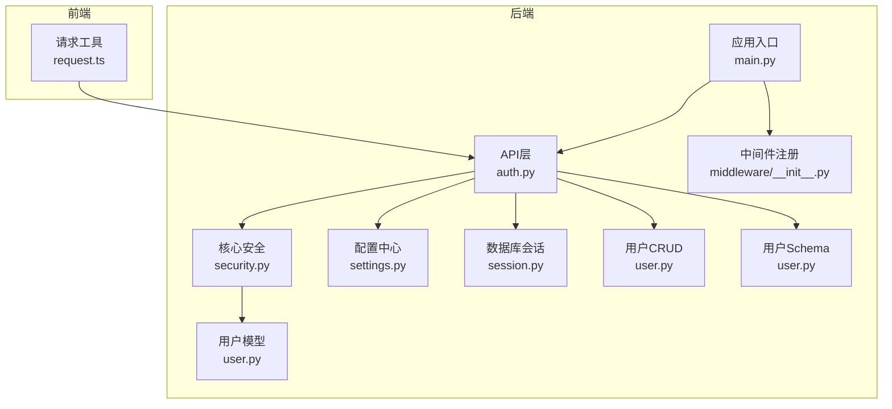
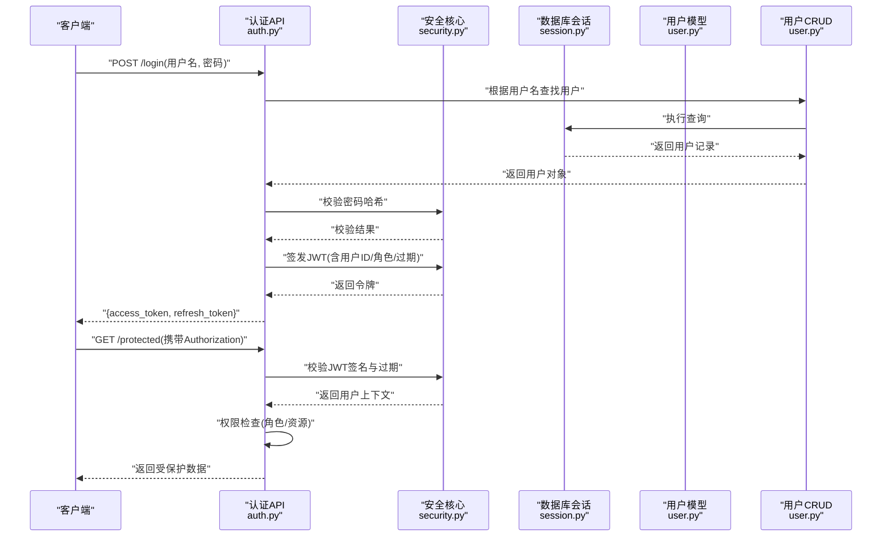
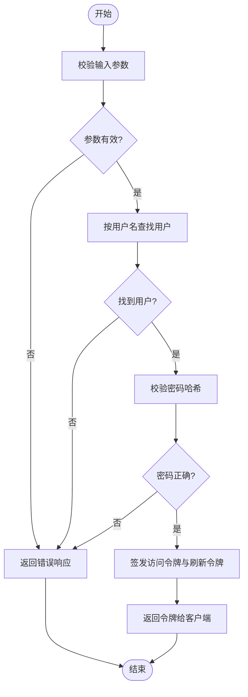
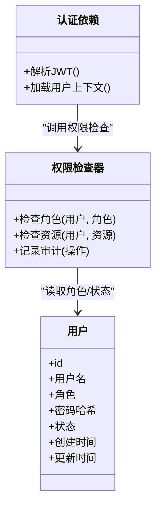
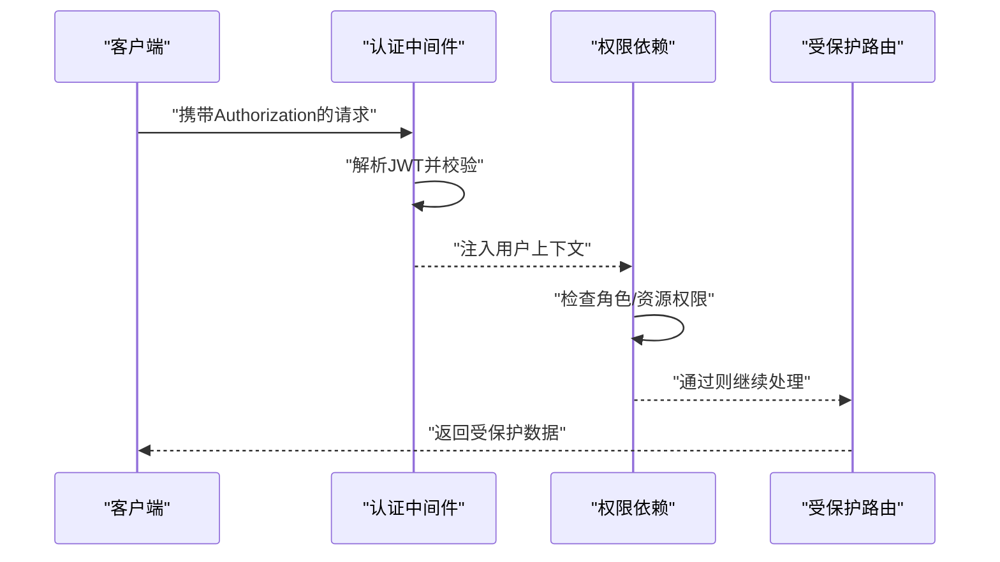
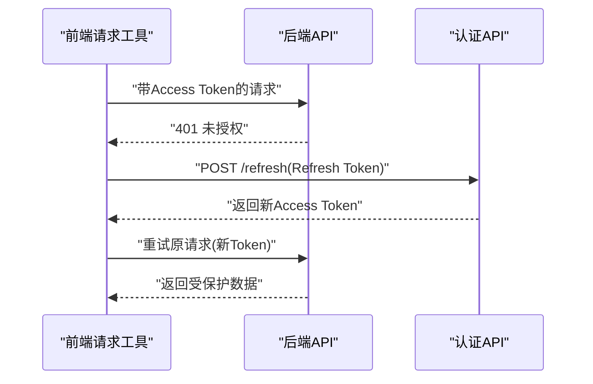
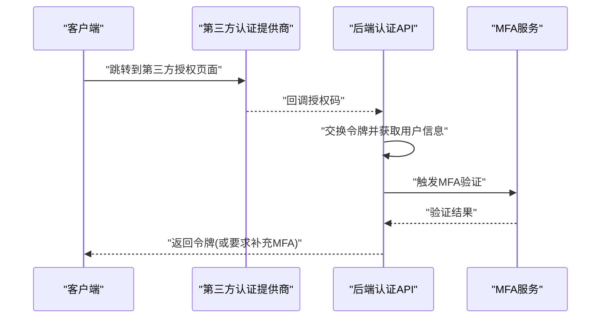
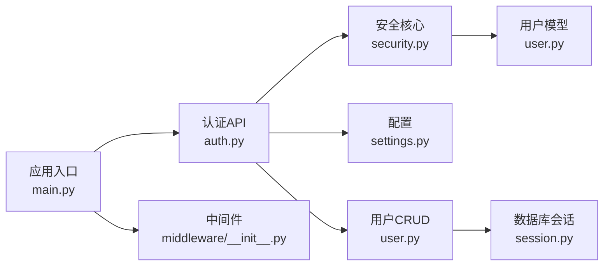

# 安全与认证

<cite>
**本文引用的文件**   
- [backend/app/api/auth.py](file://backend/app/api/auth.py)
- [backend/app/core/security.py](file://backend/app/core/security.py)
- [backend/app/config/settings.py](file://backend/app/config/settings.py)
- [backend/app/models/user.py](file://backend/app/models/user.py)
- [backend/app/crud/user.py](file://backend/app/crud/user.py)
- [backend/app/schemas/user.py](file://backend/app/schemas/user.py)
- [backend/app/database/session.py](file://backend/app/database/session.py)
- [backend/app/middleware/__init__.py](file://backend/app/middleware/__init__.py)
- [backend/main.py](file://backend/main.py)
- [frontend/src/utils/request.ts](file://frontend/src/utils/request.ts)
</cite>

## 目录
1. [简介](#简介)
2. [项目结构](#项目结构)
3. [核心组件](#核心组件)
4. [架构总览](#架构总览)
5. [详细组件分析](#详细组件分析)
6. [依赖关系分析](#依赖关系分析)
7. [性能考虑](#性能考虑)
8. [故障排查指南](#故障排查指南)
9. [结论](#结论)
10. [附录](#附录)

## 简介
本章节面向AI智能相册管理系统的安全与认证子系统，聚焦以下目标：
- JWT令牌认证机制：令牌的签发、校验与刷新流程
- 用户权限控制：角色管理、资源访问控制与操作审计
- 密码加密存储与会话管理
- 安全防护措施：输入验证、SQL注入防护、XSS防护与安全头配置
- 中间件与装饰器：认证中间件实现、权限装饰器使用与安全最佳实践
- 第三方认证集成与多因素认证（MFA）扩展方案

## 项目结构
后端采用分层架构：API层暴露REST接口，服务层封装业务逻辑，数据访问层通过CRUD与ORM模型交互。安全相关能力集中在core/security模块，并通过API路由与依赖注入进行组合。前端在HTTP请求工具中统一处理JWT的附加与刷新策略。

**图示来源**
- [backend/app/api/auth.py](file://backend/app/api/auth.py)
- [backend/app/core/security.py](file://backend/app/core/security.py)
- [backend/app/config/settings.py](file://backend/app/config/settings.py)
- [backend/app/models/user.py](file://backend/app/models/user.py)
- [backend/app/crud/user.py](file://backend/app/crud/user.py)
- [backend/app/schemas/user.py](file://backend/app/schemas/user.py)
- [backend/app/database/session.py](file://backend/app/database/session.py)
- [backend/main.py](file://backend/main.py)
- [backend/app/middleware/__init__.py](file://backend/app/middleware/__init__.py)
- [frontend/src/utils/request.ts](file://frontend/src/utils/request.ts)

**章节来源**
- [backend/main.py](file://backend/main.py)
- [backend/app/middleware/__init__.py](file://backend/app/middleware/__init__.py)
- [backend/app/api/auth.py](file://backend/app/api/auth.py)
- [backend/app/core/security.py](file://backend/app/core/security.py)
- [backend/app/config/settings.py](file://backend/app/config/settings.py)
- [backend/app/database/session.py](file://backend/app/database/session.py)
- [backend/app/models/user.py](file://backend/app/models/user.py)
- [backend/app/crud/user.py](file://backend/app/crud/user.py)
- [backend/app/schemas/user.py](file://backend/app/schemas/user.py)
- [frontend/src/utils/request.ts](file://frontend/src/utils/request.ts)

## 核心组件
- 认证与授权核心
  - 令牌签发与校验：基于对称/非对称算法生成与验证JWT，支持过期时间、主题与自定义声明
  - 密码哈希：使用强哈希算法对密码进行加盐存储，避免明文或弱哈希
  - 依赖注入：在FastAPI中通过依赖项解析当前用户与权限上下文
- 配置中心
  - JWT密钥、算法、过期时间、刷新令牌策略等集中管理
- 数据模型与CRUD
  - 用户实体包含角色、状态、密码哈希等字段；提供创建、查询、更新方法
- 前端请求工具
  - 自动附加Authorization头、处理401/403响应并触发刷新或登出流程

**章节来源**
- [backend/app/core/security.py](file://backend/app/core/security.py)
- [backend/app/config/settings.py](file://backend/app/config/settings.py)
- [backend/app/models/user.py](file://backend/app/models/user.py)
- [backend/app/crud/user.py](file://backend/app/crud/user.py)
- [backend/app/schemas/user.py](file://backend/app/schemas/user.py)
- [frontend/src/utils/request.ts](file://frontend/src/utils/request.ts)

## 架构总览
下图展示从登录到受保护资源访问的整体流程，包括JWT签发、携带、校验与权限检查。

**图示来源**
- [backend/app/api/auth.py](file://backend/app/api/auth.py)
- [backend/app/core/security.py](file://backend/app/core/security.py)
- [backend/app/database/session.py](file://backend/app/database/session.py)
- [backend/app/models/user.py](file://backend/app/models/user.py)
- [backend/app/crud/user.py](file://backend/app/crud/user.py)

## 详细组件分析

### JWT令牌认证机制
- 令牌生成
  - 输入：用户标识、角色、可选自定义声明
  - 输出：访问令牌与可选刷新令牌
  - 要点：设置合理过期时间、使用强密钥、包含必要声明（如子、角色、签发时间、过期时间）
- 令牌校验
  - 校验签名、过期时间、撤销列表（若启用）
  - 将用户上下文注入到请求依赖中供后续路由使用
- 令牌刷新
  - 使用刷新令牌换取新的访问令牌
  - 支持一次性使用、滑动过期与黑名单策略

**图示来源**
- [backend/app/api/auth.py](file://backend/app/api/auth.py)
- [backend/app/core/security.py](file://backend/app/core/security.py)
- [backend/app/crud/user.py](file://backend/app/crud/user.py)
- [backend/app/models/user.py](file://backend/app/models/user.py)

**章节来源**
- [backend/app/api/auth.py](file://backend/app/api/auth.py)
- [backend/app/core/security.py](file://backend/app/core/security.py)
- [backend/app/crud/user.py](file://backend/app/crud/user.py)
- [backend/app/models/user.py](file://backend/app/models/user.py)

### 用户权限控制系统
- 角色管理
  - 用户实体包含角色字段，支持管理员与普通用户等角色划分
  - 可在配置中定义角色白名单与默认角色
- 资源访问控制
  - 基于角色的访问控制（RBAC）：在依赖项中检查用户角色是否具备访问某资源的权限
  - 可结合资源维度（如相册归属、标签可见性）做细粒度控制
- 操作审计
  - 记录关键操作的主体、动作、资源与时间戳，便于追踪与合规
  - 审计日志建议落盘并保留一定周期

**图示来源**
- [backend/app/models/user.py](file://backend/app/models/user.py)
- [backend/app/core/security.py](file://backend/app/core/security.py)

**章节来源**
- [backend/app/models/user.py](file://backend/app/models/user.py)
- [backend/app/core/security.py](file://backend/app/core/security.py)

### 密码加密存储与会话管理
- 密码加密存储
  - 使用强哈希算法（如bcrypt/argon2）对用户密码进行加盐哈希存储
  - 禁止明文存储与可逆加密
- 会话管理
  - 无状态会话：通过JWT承载身份与权限，服务端不保存会话状态
  - 可选刷新令牌：用于续期访问令牌，支持一次性使用与黑名单撤销

**章节来源**
- [backend/app/core/security.py](file://backend/app/core/security.py)
- [backend/app/models/user.py](file://backend/app/models/user.py)

### 输入验证、SQL注入防护、XSS防护与安全头配置
- 输入验证
  - 使用Pydantic Schema对请求体与路径参数进行严格类型与格式校验
  - 限制长度、枚举值、正则表达式匹配等
- SQL注入防护
  - 通过ORM与参数化查询避免拼接SQL
  - 所有外部输入必须经过Schema校验后再进入数据层
- XSS防护
  - 前端渲染时避免直接插入未转义HTML
  - 后端返回JSON而非HTML片段，必要时设置Content-Type为application/json
- 安全头配置
  - 设置CSP、HSTS、X-Frame-Options、Referrer-Policy等安全响应头
  - 在中间件或应用入口处统一添加

**章节来源**
- [backend/app/schemas/user.py](file://backend/app/schemas/user.py)
- [backend/app/database/session.py](file://backend/app/database/session.py)
- [backend/app/middleware/__init__.py](file://backend/app/middleware/__init__.py)
- [backend/main.py](file://backend/main.py)

### 认证中间件与权限装饰器
- 认证中间件
  - 在请求到达路由前解析Authorization头中的JWT
  - 校验失败返回401，成功则注入用户上下文
- 权限装饰器
  - 在路由或依赖项上声明所需角色或资源
  - 未授权返回403，已授权继续执行业务逻辑

**图示来源**
- [backend/app/middleware/__init__.py](file://backend/app/middleware/__init__.py)
- [backend/app/core/security.py](file://backend/app/core/security.py)
- [backend/app/api/auth.py](file://backend/app/api/auth.py)

**章节来源**
- [backend/app/middleware/__init__.py](file://backend/app/middleware/__init__.py)
- [backend/app/core/security.py](file://backend/app/core/security.py)
- [backend/app/api/auth.py](file://backend/app/api/auth.py)

### 前端JWT处理与刷新策略
- 自动附加Authorization头
- 捕获401/403响应
  - 401：尝试刷新令牌；失败则跳转登录页
  - 403：提示无权限并退出敏感操作
- 刷新令牌
  - 使用刷新端点获取新访问令牌
  - 成功后重试原请求

**图示来源**
- [frontend/src/utils/request.ts](file://frontend/src/utils/request.ts)
- [backend/app/api/auth.py](file://backend/app/api/auth.py)

**章节来源**
- [frontend/src/utils/request.ts](file://frontend/src/utils/request.ts)
- [backend/app/api/auth.py](file://backend/app/api/auth.py)

### 第三方认证集成与多因素认证（MFA）
- 第三方认证集成
  - 支持OAuth2/OIDC提供商（如微信、Google、GitHub）
  - 后端提供回调路由，完成授权码交换、用户信息拉取与本地账户绑定
- 多因素认证（MFA）
  - 在登录成功后要求二次验证（短信/邮箱验证码、TOTP）
  - 将MFA状态写入用户上下文，受保护资源需检查MFA完成标志

**图示来源**
- [backend/app/api/auth.py](file://backend/app/api/auth.py)
- [backend/app/core/security.py](file://backend/app/core/security.py)

**章节来源**
- [backend/app/api/auth.py](file://backend/app/api/auth.py)
- [backend/app/core/security.py](file://backend/app/core/security.py)

## 依赖关系分析
- 模块耦合
  - API层依赖安全核心与配置中心
  - 安全核心依赖用户模型与配置
  - 数据层通过会话与ORM交互，避免SQL拼接
- 外部依赖
  - JWT库、密码哈希库、ORM框架、HTTP服务器中间件

**图示来源**
- [backend/app/api/auth.py](file://backend/app/api/auth.py)
- [backend/app/core/security.py](file://backend/app/core/security.py)
- [backend/app/config/settings.py](file://backend/app/config/settings.py)
- [backend/app/models/user.py](file://backend/app/models/user.py)
- [backend/app/crud/user.py](file://backend/app/crud/user.py)
- [backend/app/database/session.py](file://backend/app/database/session.py)
- [backend/main.py](file://backend/main.py)
- [backend/app/middleware/__init__.py](file://backend/app/middleware/__init__.py)

**章节来源**
- [backend/app/api/auth.py](file://backend/app/api/auth.py)
- [backend/app/core/security.py](file://backend/app/core/security.py)
- [backend/app/config/settings.py](file://backend/app/config/settings.py)
- [backend/app/models/user.py](file://backend/app/models/user.py)
- [backend/app/crud/user.py](file://backend/app/crud/user.py)
- [backend/app/database/session.py](file://backend/app/database/session.py)
- [backend/main.py](file://backend/main.py)
- [backend/app/middleware/__init__.py](file://backend/app/middleware/__init__.py)

## 性能考虑
- JWT校验开销低，适合无状态鉴权；注意避免在每次请求中进行昂贵的权限计算
- 刷新令牌策略应限制频率与次数，防止滥用
- 密码哈希选择合适强度，平衡安全性与性能
- 缓存热点用户上下文（如角色、权限集），减少重复查询
- 审计日志异步写入，避免阻塞主流程

[本节为通用指导，无需特定文件引用]

## 故障排查指南
- 常见问题
  - 401未授权：检查Authorization头是否正确、令牌是否过期、密钥是否一致
  - 403无权限：确认用户角色与资源访问策略
  - 刷新失败：检查刷新令牌是否被撤销或过期
- 定位步骤
  - 查看认证API日志与错误响应
  - 核对配置中心的密钥与算法
  - 检查中间件是否正确注入用户上下文
  - 审查前端请求工具的错误处理与重试逻辑

**章节来源**
- [backend/app/api/auth.py](file://backend/app/api/auth.py)
- [backend/app/core/security.py](file://backend/app/core/security.py)
- [backend/app/config/settings.py](file://backend/app/config/settings.py)
- [frontend/src/utils/request.ts](file://frontend/src/utils/request.ts)

## 结论
本系统通过JWT无状态认证、RBAC权限控制与严格的输入验证，构建了较为完善的安全体系。建议在后续迭代中引入更细粒度的资源级权限、完善的审计日志与MFA增强，以提升整体安全性与合规性。

[本节为总结性内容，无需特定文件引用]

## 附录
- 安全最佳实践清单
  - 使用强密钥与合适的算法签发JWT
  - 设置合理的令牌过期时间与刷新策略
  - 对所有输入进行Schema校验与白名单过滤
  - 使用ORM参数化查询，杜绝SQL拼接
  - 设置安全响应头，启用HTTPS与HSTS
  - 记录关键操作审计日志并定期归档
  - 前端避免直接渲染不可信HTML，统一错误处理与重定向

[本节为通用指导，无需特定文件引用]