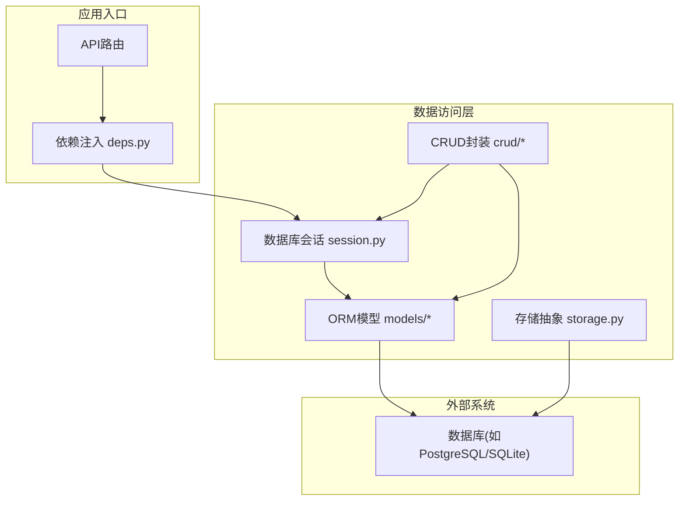
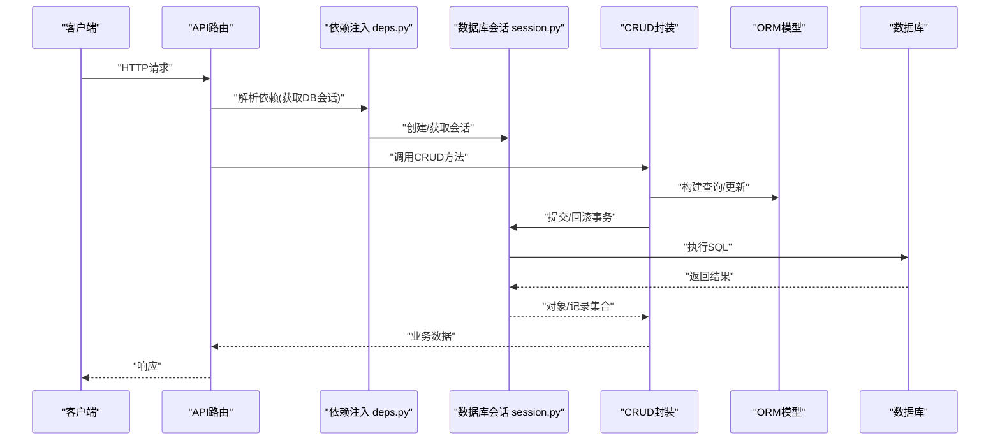
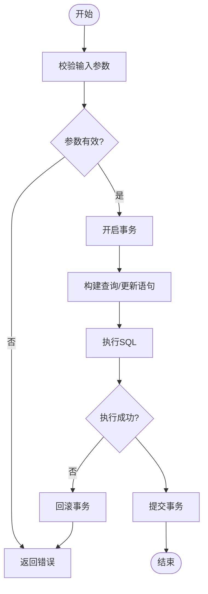
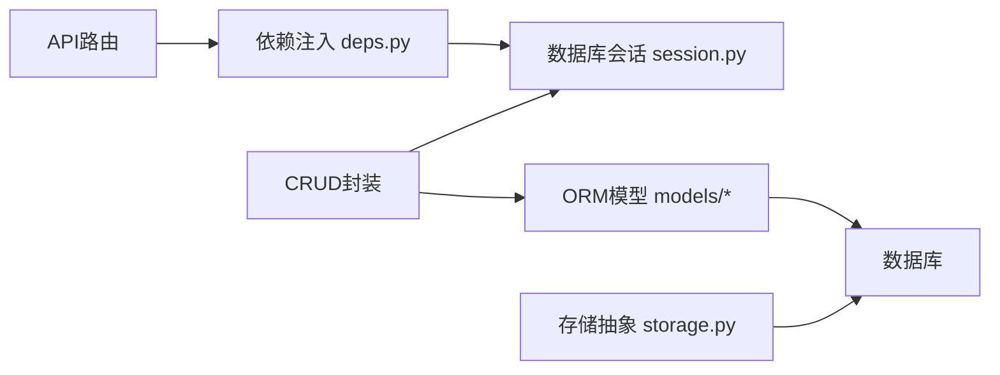

# 数据访问层

<cite>
**本文引用的文件**   
- [backend/app/database/session.py](file://backend/app/database/session.py)
- [backend/app/database/storage.py](file://backend/app/database/storage.py)
- [backend/app/models/__init__.py](file://backend/app/models/__init__.py)
- [backend/app/models/album.py](file://backend/app/models/album.py)
- [backend/app/models/photo.py](file://backend/app/models/photo.py)
- [backend/app/models/user.py](file://backend/app/models/user.py)
- [backend/app/models/face.py](file://backend/app/models/face.py)
- [backend/app/models/description.py](file://backend/app/models/description.py)
- [backend/app/models/task.py](file://backend/app/models/task.py)
- [backend/app/models/training.py](file://backend/app/models/training.py)
- [backend/app/models/agent.py](file://backend/app/models/agent.py)
- [backend/app/crud/album.py](file://backend/app/crud/album.py)
- [backend/app/crud/photo.py](file://backend/app/crud/photo.py)
- [backend/app/crud/user.py](file://backend/app/crud/user.py)
- [backend/app/crud/task.py](file://backend/app/crud/task.py)
- [backend/app/api/deps.py](file://backend/app/api/deps.py)
- [backend/app/config/settings.py](file://backend/app/config/settings.py)
</cite>

## 目录
1. [简介](#简介)
2. [项目结构](#项目结构)
3. [核心组件](#核心组件)
4. [架构总览](#架构总览)
5. [详细组件分析](#详细组件分析)
6. [依赖关系分析](#依赖关系分析)
7. [性能考虑](#性能考虑)
8. [故障排查指南](#故障排查指南)
9. [结论](#结论)
10. [附录](#附录)

## 简介
本章节面向AI智能相册管理系统的数据访问层，聚焦于SQLAlchemy ORM模型设计、CRUD实现模式、事务与并发控制、连接池配置、迁移与备份策略、索引与查询优化、以及与业务服务之间的交互方式。文档旨在帮助开发者快速理解并高效扩展数据访问能力，同时提供可操作的调优与排障建议。

## 项目结构
数据访问层主要分布在以下模块：
- 数据库会话与存储抽象：session.py、storage.py
- ORM模型定义：models/*（用户、相册、照片、人脸、描述、任务、训练、智能体等）
- CRUD封装：crud/*（按领域划分）
- API依赖注入：api/deps.py（为请求生命周期提供DB会话）
- 配置：config/settings.py（数据库URL、连接池参数等）



图表来源
- [backend/app/api/deps.py](file://backend/app/api/deps.py)
- [backend/app/database/session.py](file://backend/app/database/session.py)
- [backend/app/database/storage.py](file://backend/app/database/storage.py)
- [backend/app/models/__init__.py](file://backend/app/models/__init__.py)

章节来源
- [backend/app/database/session.py](file://backend/app/database/session.py)
- [backend/app/database/storage.py](file://backend/app/database/storage.py)
- [backend/app/models/__init__.py](file://backend/app/models/__init__.py)
- [backend/app/api/deps.py](file://backend/app/api/deps.py)

## 核心组件
- 数据库会话管理：负责创建、复用和释放SQLAlchemy引擎与会话，支持连接池参数与事务边界。
- 存储抽象：对底层存储进行统一抽象，便于后续扩展或替换。
- ORM模型：以类映射表结构，定义字段、约束、关系与索引。
- CRUD封装：将常用增删改查逻辑封装为函数，保证一致性、可测试性与复用性。
- 依赖注入：在API层通过FastAPI的依赖注入机制获取会话，确保每个请求拥有独立的事务上下文。

章节来源
- [backend/app/database/session.py](file://backend/app/database/session.py)
- [backend/app/database/storage.py](file://backend/app/database/storage.py)
- [backend/app/models/__init__.py](file://backend/app/models/__init__.py)
- [backend/app/crud/album.py](file://backend/app/crud/album.py)
- [backend/app/crud/photo.py](file://backend/app/crud/photo.py)
- [backend/app/crud/user.py](file://backend/app/crud/user.py)
- [backend/app/crud/task.py](file://backend/app/crud/task.py)
- [backend/app/api/deps.py](file://backend/app/api/deps.py)

## 架构总览
数据访问层采用“API -> 依赖注入 -> 会话 -> CRUD -> ORM模型 -> 数据库”的分层结构。会话由依赖注入提供，CRUD函数使用会话执行查询与写入，ORM模型负责表结构与关系映射。



图表来源
- [backend/app/api/deps.py](file://backend/app/api/deps.py)
- [backend/app/database/session.py](file://backend/app/database/session.py)
- [backend/app/crud/album.py](file://backend/app/crud/album.py)
- [backend/app/models/album.py](file://backend/app/models/album.py)

## 详细组件分析

### 数据库会话与连接池
- 会话生命周期：每个请求通过依赖注入获取会话，请求结束时自动关闭，避免连接泄漏。
- 连接池配置：通过配置项设置最大连接数、空闲超时、预创建连接等，适配不同数据库类型与负载。
- 事务边界：CRUD内部通常包裹事务，成功则提交，异常则回滚，保证一致性。
- 并发控制：基于数据库锁与唯一约束防止重复写入；长事务需避免持有锁过久。

章节来源
- [backend/app/database/session.py](file://backend/app/database/session.py)
- [backend/app/config/settings.py](file://backend/app/config/settings.py)
- [backend/app/api/deps.py](file://backend/app/api/deps.py)

### 存储抽象
- 职责：对文件/对象存储进行抽象，便于切换后端或增加多存储策略。
- 集成点：与ORM模型中的路径字段配合，用于定位媒体资源。
- 扩展性：新增存储类型时仅需实现接口契约，不影响上层CRUD与API。

章节来源
- [backend/app/database/storage.py](file://backend/app/database/storage.py)

### ORM模型设计
- 表结构定义：每个模型对应一张表，包含主键、外键、字段类型、默认值与约束。
- 关系映射：一对多、多对一等关系通过外键与relationship声明，便于级联加载与查询。
- 数据约束：唯一约束、非空约束、检查约束保障数据完整性。
- 索引设计：针对高频查询字段建立索引，提升检索性能。

```mermaid
classDiagram
class User {
+id
+username
+email
+created_at
+updated_at
}
class Album {
+id
+name
+owner_id
+created_at
+updated_at
}
class Photo {
+id
+album_id
+user_id
+path
+exif_data
+created_at
+updated_at
}
class Face {
+id
+photo_id
+embedding
+bbox
+created_at
}
class Description {
+id
+photo_id
+text
+created_at
}
class Task {
+id
+type
+status
+payload
+result
+created_at
+updated_at
}
class Training {
+id
+model_name
+status
+metrics
+created_at
+updated_at
}
class Agent {
+id
+name
+config
+created_at
+updated_at
}
User ||--o{ Album : "拥有"
User ||--o{ Photo : "上传"
Album ||--o{ Photo : "包含"
Photo ||--o{ Face : "包含"
Photo ||--o{ Description : "包含"
Task ..> Photo : "处理"
Training ..> Photo : "训练"
Agent ..> Task : "调度"
```

图表来源
- [backend/app/models/user.py](file://backend/app/models/user.py)
- [backend/app/models/album.py](file://backend/app/models/album.py)
- [backend/app/models/photo.py](file://backend/app/models/photo.py)
- [backend/app/models/face.py](file://backend/app/models/face.py)
- [backend/app/models/description.py](file://backend/app/models/description.py)
- [backend/app/models/task.py](file://backend/app/models/task.py)
- [backend/app/models/training.py](file://backend/app/models/training.py)
- [backend/app/models/agent.py](file://backend/app/models/agent.py)

章节来源
- [backend/app/models/__init__.py](file://backend/app/models/__init__.py)
- [backend/app/models/album.py](file://backend/app/models/album.py)
- [backend/app/models/photo.py](file://backend/app/models/photo.py)
- [backend/app/models/user.py](file://backend/app/models/user.py)
- [backend/app/models/face.py](file://backend/app/models/face.py)
- [backend/app/models/description.py](file://backend/app/models/description.py)
- [backend/app/models/task.py](file://backend/app/models/task.py)
- [backend/app/models/training.py](file://backend/app/models/training.py)
- [backend/app/models/agent.py](file://backend/app/models/agent.py)

### CRUD操作实现模式
- 查询优化：
  - 选择性加载：按需加载关联对象，避免N+1问题。
  - 分页与过滤：结合排序与索引字段，减少全表扫描。
  - 聚合与统计：使用数据库原生聚合函数，降低内存压力。
- 事务处理：
  - 单条写入：短事务，失败即回滚。
  - 批量写入：分批提交，控制事务大小，避免长时间持锁。
- 并发控制：
  - 唯一约束：防止重复插入。
  - 乐观锁：版本号字段，冲突重试。
  - 悲观锁：必要时使用行级锁，注意死锁风险。



图表来源
- [backend/app/crud/album.py](file://backend/app/crud/album.py)
- [backend/app/crud/photo.py](file://backend/app/crud/photo.py)
- [backend/app/crud/user.py](file://backend/app/crud/user.py)
- [backend/app/crud/task.py](file://backend/app/crud/task.py)

章节来源
- [backend/app/crud/album.py](file://backend/app/crud/album.py)
- [backend/app/crud/photo.py](file://backend/app/crud/photo.py)
- [backend/app/crud/user.py](file://backend/app/crud/user.py)
- [backend/app/crud/task.py](file://backend/app/crud/task.py)

### 复杂查询示例（代码片段路径）
- 条件组合与分页：[backend/app/crud/album.py](file://backend/app/crud/album.py)
- 关联加载与去重：[backend/app/crud/photo.py](file://backend/app/crud/photo.py)
- 聚合统计与分组：[backend/app/crud/user.py](file://backend/app/crud/user.py)
- 任务状态流转与幂等：[backend/app/crud/task.py](file://backend/app/crud/task.py)

### 批量操作与一致性保证（代码片段路径）
- 批量插入与分批提交：[backend/app/crud/photo.py](file://backend/app/crud/photo.py)
- 事务内多表更新与回滚：[backend/app/crud/album.py](file://backend/app/crud/album.py)
- 任务队列消费与补偿：[backend/app/crud/task.py](file://backend/app/crud/task.py)

### 数据验证规则
- 字段约束：非空、长度限制、格式校验（邮箱、路径等）。
- 业务规则：相册归属权校验、照片路径唯一性、任务状态机约束。
- 校验位置：在CRUD入口处进行参数校验，失败直接返回错误，避免无效事务。

章节来源
- [backend/app/crud/album.py](file://backend/app/crud/album.py)
- [backend/app/crud/photo.py](file://backend/app/crud/photo.py)
- [backend/app/crud/user.py](file://backend/app/crud/user.py)
- [backend/app/crud/task.py](file://backend/app/crud/task.py)

### 索引设计与性能调优方案
- 索引策略：
  - 外键字段：album_id、user_id、photo_id等建立索引，加速关联查询。
  - 高频过滤：名称、时间戳、状态字段建立B树索引。
  - 复合索引：常见组合条件（如用户+相册+时间范围）建立复合索引。
- 查询优化：
  - 避免SELECT *，仅选择必要字段。
  - 使用EXPLAIN分析慢查询，调整索引与查询计划。
  - 合理分页，避免大偏移量导致的性能退化。
- 连接池调优：
  - 根据并发量与数据库容量设置max_connections、pool_size、max_overflow。
  - 监控连接等待与超时，动态调整参数。

章节来源
- [backend/app/database/session.py](file://backend/app/database/session.py)
- [backend/app/config/settings.py](file://backend/app/config/settings.py)

### 迁移管理与备份策略
- 迁移管理：
  - 使用Alembic或等效工具维护版本化迁移脚本。
  - 每次模型变更生成迁移，并在CI中执行迁移测试。
- 备份策略：
  - 定期全量备份与增量备份结合。
  - 备份文件加密存储，保留多份副本在不同介质。
  - 恢复演练：定期进行恢复测试，确保RTO/RPO达标。

章节来源
- [backend/app/config/settings.py](file://backend/app/config/settings.py)

### 数据访问层与业务服务的交互
- 交互模式：
  - API层通过依赖注入获取会话，调用CRUD完成数据读写。
  - 业务服务（services/*）编排多个CRUD调用，形成业务流程。
- 异常处理：
  - 捕获数据库异常，转换为业务错误码与消息。
  - 记录关键日志，便于追踪与排障。

章节来源
- [backend/app/api/deps.py](file://backend/app/api/deps.py)
- [backend/app/crud/album.py](file://backend/app/crud/album.py)
- [backend/app/crud/photo.py](file://backend/app/crud/photo.py)
- [backend/app/crud/user.py](file://backend/app/crud/user.py)
- [backend/app/crud/task.py](file://backend/app/crud/task.py)

## 依赖关系分析
数据访问层内部依赖关系如下：
- API依赖注入依赖会话管理。
- CRUD依赖ORM模型与会话。
- ORM模型依赖数据库驱动与配置。
- 存储抽象独立于ORM，但被模型或CRUD间接使用。



图表来源
- [backend/app/api/deps.py](file://backend/app/api/deps.py)
- [backend/app/database/session.py](file://backend/app/database/session.py)
- [backend/app/database/storage.py](file://backend/app/database/storage.py)
- [backend/app/models/__init__.py](file://backend/app/models/__init__.py)

章节来源
- [backend/app/api/deps.py](file://backend/app/api/deps.py)
- [backend/app/database/session.py](file://backend/app/database/session.py)
- [backend/app/database/storage.py](file://backend/app/database/storage.py)
- [backend/app/models/__init__.py](file://backend/app/models/__init__.py)

## 性能考虑
- 连接池参数应根据实际负载与数据库容量调优，避免连接耗尽或过度占用。
- 查询层面优先使用索引与选择性加载，减少网络与内存开销。
- 批量操作分批提交，控制事务大小，降低锁竞争与回滚成本。
- 监控关键指标：QPS、延迟、连接池使用率、慢查询数量。

## 故障排查指南
- 常见问题：
  - 连接泄漏：检查会话是否正确关闭，依赖注入是否生效。
  - 死锁：缩短事务时长，避免循环依赖锁。
  - N+1查询：启用选择性加载或使用joinedload/selectinload。
  - 索引缺失：使用EXPLAIN分析慢查询，补充合适索引。
- 日志与追踪：
  - 记录关键SQL与参数，便于复现与分析。
  - 在异常分支输出堆栈与上下文信息。

章节来源
- [backend/app/database/session.py](file://backend/app/database/session.py)
- [backend/app/api/deps.py](file://backend/app/api/deps.py)

## 结论
数据访问层通过清晰的会话管理、严谨的ORM模型设计、可复用的CRUD封装以及完善的索引与事务策略，为AI智能相册管理系统提供了稳定高效的数据支撑。建议在持续迭代中关注性能监控与索引优化，并结合业务场景完善迁移与备份流程，确保系统的可靠性与可扩展性。

## 附录
- 相关代码片段路径：
  - 复杂查询与分页：[backend/app/crud/album.py](file://backend/app/crud/album.py)、[backend/app/crud/photo.py](file://backend/app/crud/photo.py)
  - 批量操作与一致性：[backend/app/crud/photo.py](file://backend/app/crud/photo.py)、[backend/app/crud/album.py](file://backend/app/crud/album.py)
  - 任务状态与幂等：[backend/app/crud/task.py](file://backend/app/crud/task.py)
  - 会话与连接池配置：[backend/app/database/session.py](file://backend/app/database/session.py)、[backend/app/config/settings.py](file://backend/app/config/settings.py)
  - 依赖注入与会话生命周期：[backend/app/api/deps.py](file://backend/app/api/deps.py)