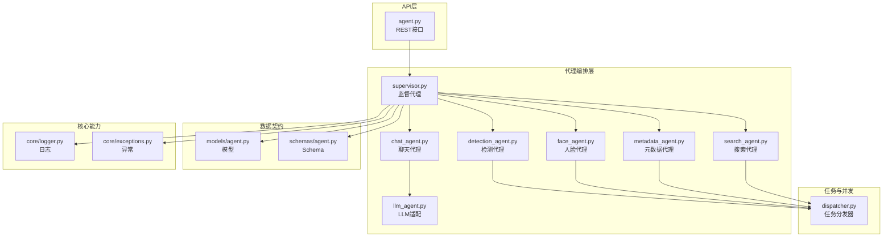
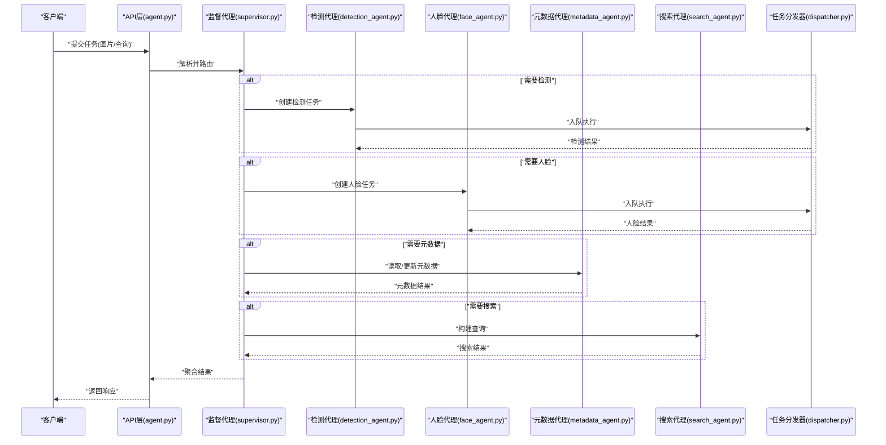
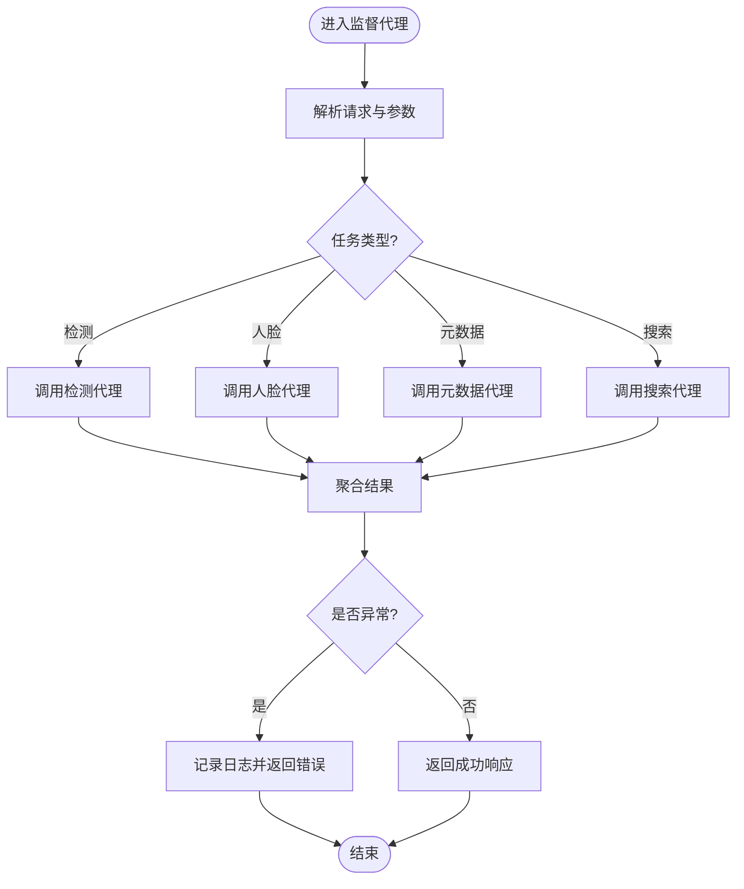
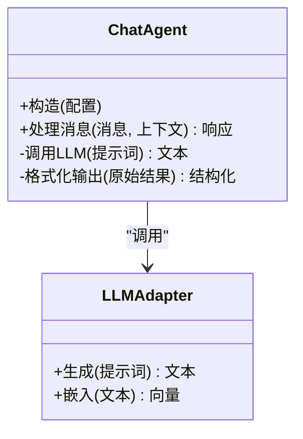
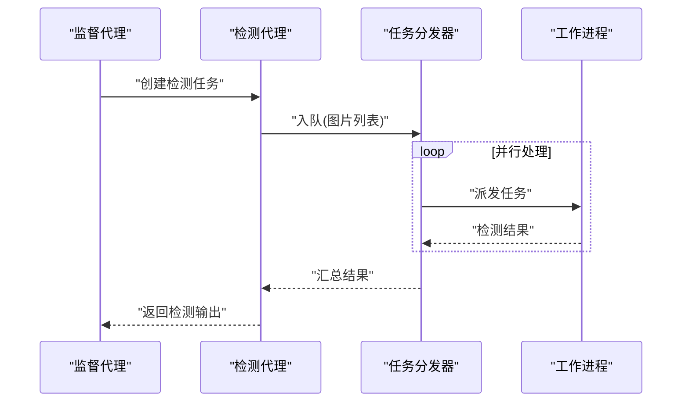
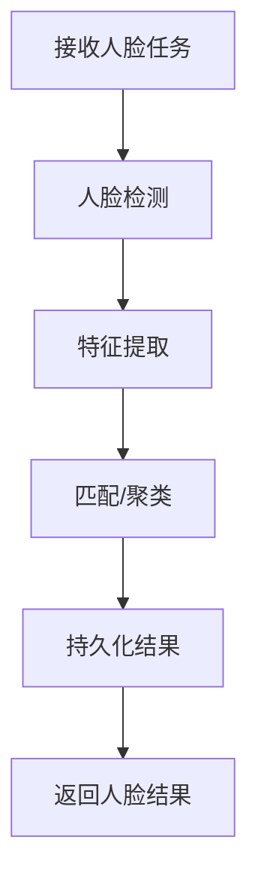
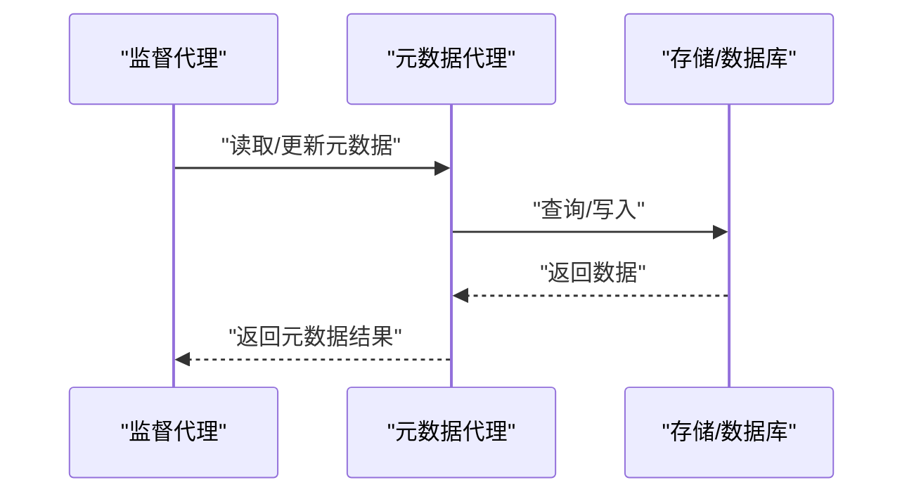
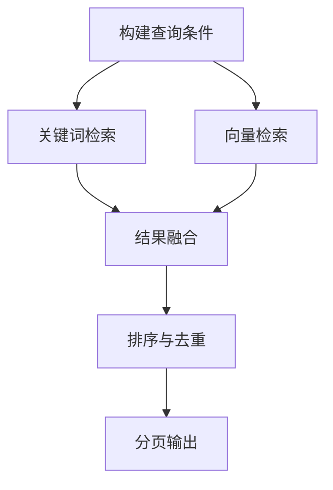
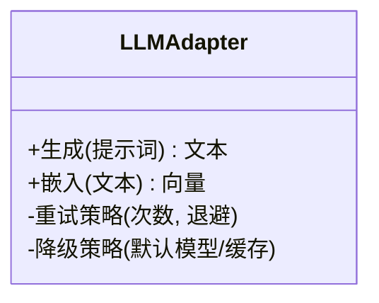
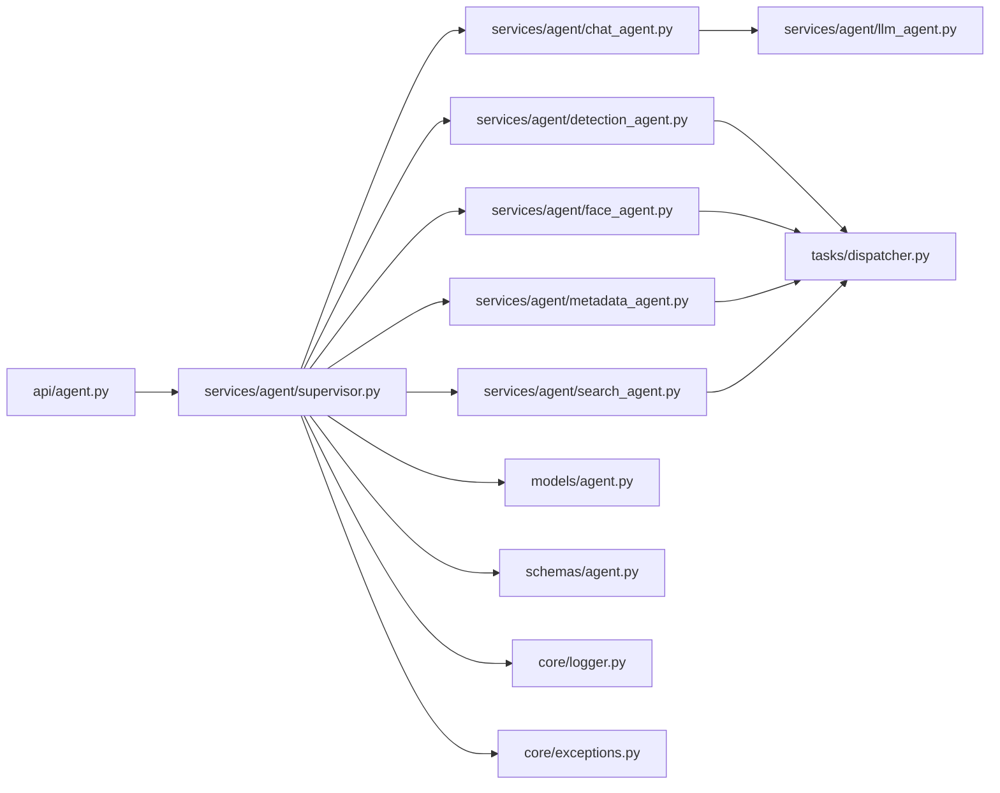

# AI代理系统

<cite>
**本文引用的文件**
- [backend/app/services/agent/supervisor.py](file://backend/app/services/agent/supervisor.py)
- [backend/app/services/agent/chat_agent.py](file://backend/app/services/agent/chat_agent.py)
- [backend/app/services/agent/detection_agent.py](file://backend/app/services/agent/detection_agent.py)
- [backend/app/services/agent/face_agent.py](file://backend/app/services/agent/face_agent.py)
- [backend/app/services/agent/metadata_agent.py](file://backend/app/services/agent/metadata_agent.py)
- [backend/app/services/agent/search_agent.py](file://backend/app/services/agent/search_agent.py)
- [backend/app/services/agent/llm_agent.py](file://backend/app/services/agent/llm_agent.py)
- [backend/app/api/agent.py](file://backend/app/api/agent.py)
- [backend/app/models/agent.py](file://backend/app/models/agent.py)
- [backend/app/schemas/agent.py](file://backend/app/schemas/agent.py)
- [backend/app/tasks/dispatcher.py](file://backend/app/tasks/dispatcher.py)
- [backend/app/core/logger.py](file://backend/app/core/logger.py)
- [backend/app/core/exceptions.py](file://backend/app/core/exceptions.py)
</cite>

## 目录
1. [简介](#简介)
2. [项目结构](#项目结构)
3. [核心组件](#核心组件)
4. [架构总览](#架构总览)
5. [详细组件分析](#详细组件分析)
6. [依赖关系分析](#依赖关系分析)
7. [性能考量](#性能考量)
8. [故障排查指南](#故障排查指南)
9. [结论](#结论)
10. [附录](#附录)

## 简介
本文件面向AI智能相册管理系统的“AI代理系统”，聚焦多Agent协作架构的设计理念与实现机制。文档将深入说明聊天代理、检测代理、人脸代理、元数据代理和搜索代理的职责分工与通信协议，并阐述监督代理的任务分发、结果聚合与错误处理策略。同时提供Agent间消息传递格式、状态同步与并发控制机制，以及扩展性设计与自定义Agent开发指南，最后给出性能监控、日志记录与调试工具的使用建议。

## 项目结构
AI代理系统位于后端服务的services/agent模块中，由监督代理统一编排各功能Agent；API层暴露REST接口供前端或外部系统调用；模型与Schema定义持久化与校验契约；任务调度器负责异步执行与并发控制；核心模块提供日志与异常能力。

图表来源
- [backend/app/api/agent.py](file://backend/app/api/agent.py)
- [backend/app/services/agent/supervisor.py](file://backend/app/services/agent/supervisor.py)
- [backend/app/services/agent/chat_agent.py](file://backend/app/services/agent/chat_agent.py)
- [backend/app/services/agent/detection_agent.py](file://backend/app/services/agent/detection_agent.py)
- [backend/app/services/agent/face_agent.py](file://backend/app/services/agent/face_agent.py)
- [backend/app/services/agent/metadata_agent.py](file://backend/app/services/agent/metadata_agent.py)
- [backend/app/services/agent/search_agent.py](file://backend/app/services/agent/search_agent.py)
- [backend/app/services/agent/llm_agent.py](file://backend/app/services/agent/llm_agent.py)
- [backend/app/tasks/dispatcher.py](file://backend/app/tasks/dispatcher.py)
- [backend/app/models/agent.py](file://backend/app/models/agent.py)
- [backend/app/schemas/agent.py](file://backend/app/schemas/agent.py)
- [backend/app/core/logger.py](file://backend/app/core/logger.py)
- [backend/app/core/exceptions.py](file://backend/app/core/exceptions.py)

章节来源
- [backend/app/api/agent.py](file://backend/app/api/agent.py)
- [backend/app/services/agent/supervisor.py](file://backend/app/services/agent/supervisor.py)
- [backend/app/tasks/dispatcher.py](file://backend/app/tasks/dispatcher.py)
- [backend/app/models/agent.py](file://backend/app/models/agent.py)
- [backend/app/schemas/agent.py](file://backend/app/schemas/agent.py)
- [backend/app/core/logger.py](file://backend/app/core/logger.py)
- [backend/app/core/exceptions.py](file://backend/app/core/exceptions.py)

## 核心组件
- 监督代理：作为编排中心，接收上层请求，解析意图，分派到具体功能Agent，聚合结果并返回。负责错误重试、超时控制与状态跟踪。
- 聊天代理：负责自然语言对话与指令理解，必要时调用LLM进行语义推理与生成回复。
- 检测代理：负责图像内容检测（如物体、场景等），通过任务分发器异步执行，支持批量与并发。
- 人脸代理：负责人脸检测、识别与聚类，协调底层服务完成人脸特征提取与匹配。
- 元数据代理：负责读取与更新照片EXIF、地理位置、时间线等元信息。
- 搜索代理：负责向量检索与关键词检索，组合多种查询条件返回排序后的结果。
- LLM适配：封装大模型调用，提供统一的文本生成与嵌入接口。
- 任务分发器：基于队列的异步任务调度，提供并发控制、重试与失败隔离。
- 模型与Schema：定义Agent任务、结果、状态的数据结构与校验规则。
- 日志与异常：统一日志输出与异常类型，便于追踪与排障。

章节来源
- [backend/app/services/agent/supervisor.py](file://backend/app/services/agent/supervisor.py)
- [backend/app/services/agent/chat_agent.py](file://backend/app/services/agent/chat_agent.py)
- [backend/app/services/agent/detection_agent.py](file://backend/app/services/agent/detection_agent.py)
- [backend/app/services/agent/face_agent.py](file://backend/app/services/agent/face_agent.py)
- [backend/app/services/agent/metadata_agent.py](file://backend/app/services/agent/metadata_agent.py)
- [backend/app/services/agent/search_agent.py](file://backend/app/services/agent/search_agent.py)
- [backend/app/services/agent/llm_agent.py](file://backend/app/services/agent/llm_agent.py)
- [backend/app/tasks/dispatcher.py](file://backend/app/tasks/dispatcher.py)
- [backend/app/models/agent.py](file://backend/app/models/agent.py)
- [backend/app/schemas/agent.py](file://backend/app/schemas/agent.py)
- [backend/app/core/logger.py](file://backend/app/core/logger.py)
- [backend/app/core/exceptions.py](file://backend/app/core/exceptions.py)

## 架构总览
多Agent协作采用“监督代理+专用Agent”的编排模式。API层仅与监督代理交互，屏蔽内部复杂性。监督代理根据请求类型选择目标Agent，必要时并行调用多个Agent，并通过任务分发器执行耗时操作。所有Agent遵循统一的消息协议与状态机，确保可观测性与可恢复性。

图表来源
- [backend/app/api/agent.py](file://backend/app/api/agent.py)
- [backend/app/services/agent/supervisor.py](file://backend/app/services/agent/supervisor.py)
- [backend/app/services/agent/detection_agent.py](file://backend/app/services/agent/detection_agent.py)
- [backend/app/services/agent/face_agent.py](file://backend/app/services/agent/face_agent.py)
- [backend/app/services/agent/metadata_agent.py](file://backend/app/services/agent/metadata_agent.py)
- [backend/app/services/agent/search_agent.py](file://backend/app/services/agent/search_agent.py)
- [backend/app/tasks/dispatcher.py](file://backend/app/tasks/dispatcher.py)

## 详细组件分析

### 监督代理（Supervisor）
职责
- 接收API请求，解析意图与参数
- 选择并调用相应Agent
- 并行编排与结果聚合
- 错误重试、超时与降级
- 状态跟踪与日志记录

关键流程
- 任务解析：从请求体中提取任务类型、资源ID、参数
- Agent路由：按类型映射到对应Agent实例
- 并发执行：对独立子任务使用并发控制
- 结果合并：按约定格式聚合各Agent输出
- 异常处理：捕获并转换异常为统一响应

图表来源
- [backend/app/services/agent/supervisor.py](file://backend/app/services/agent/supervisor.py)
- [backend/app/core/logger.py](file://backend/app/core/logger.py)
- [backend/app/core/exceptions.py](file://backend/app/core/exceptions.py)

章节来源
- [backend/app/services/agent/supervisor.py](file://backend/app/services/agent/supervisor.py)
- [backend/app/core/logger.py](file://backend/app/core/logger.py)
- [backend/app/core/exceptions.py](file://backend/app/core/exceptions.py)

### 聊天代理（Chat Agent）
职责
- 理解用户自然语言指令
- 与LLM适配层交互，生成对话或执行动作
- 维护会话上下文（可选）

交互要点
- 输入：用户消息、历史上下文
- 输出：结构化指令或直接回复
- 错误：LLM不可用时的降级策略

图表来源
- [backend/app/services/agent/chat_agent.py](file://backend/app/services/agent/chat_agent.py)
- [backend/app/services/agent/llm_agent.py](file://backend/app/services/agent/llm_agent.py)

章节来源
- [backend/app/services/agent/chat_agent.py](file://backend/app/services/agent/chat_agent.py)
- [backend/app/services/agent/llm_agent.py](file://backend/app/services/agent/llm_agent.py)

### 检测代理（Detection Agent）
职责
- 接收图片资源，执行内容检测
- 通过任务分发器异步执行，支持批量
- 返回检测结果（类别、置信度、边界框等）

并发与容错
- 批量拆分与限流
- 失败重试与部分失败容忍
- 进度回调与状态上报

图表来源
- [backend/app/services/agent/detection_agent.py](file://backend/app/services/agent/detection_agent.py)
- [backend/app/tasks/dispatcher.py](file://backend/app/tasks/dispatcher.py)

章节来源
- [backend/app/services/agent/detection_agent.py](file://backend/app/services/agent/detection_agent.py)
- [backend/app/tasks/dispatcher.py](file://backend/app/tasks/dispatcher.py)

### 人脸代理（Face Agent）
职责
- 执行人脸检测、识别与聚类
- 协调特征提取、比对与存储
- 返回人脸标签、相似度与分组结果

关键点
- 大规模人脸数据的索引与检索优化
- 增量更新与冲突解决
- 隐私与安全考虑（脱敏、权限）

图表来源
- [backend/app/services/agent/face_agent.py](file://backend/app/services/agent/face_agent.py)

章节来源
- [backend/app/services/agent/face_agent.py](file://backend/app/services/agent/face_agent.py)

### 元数据代理（Metadata Agent）
职责
- 读取与更新照片EXIF、地理位置、拍摄时间等
- 与文件系统或对象存储交互
- 保证元数据一致性与幂等更新

并发与一致性
- 读写锁或事务保障
- 冲突检测与合并策略
- 缓存热点元数据提升性能

图表来源
- [backend/app/services/agent/metadata_agent.py](file://backend/app/services/agent/metadata_agent.py)

章节来源
- [backend/app/services/agent/metadata_agent.py](file://backend/app/services/agent/metadata_agent.py)

### 搜索代理（Search Agent）
职责
- 组合关键词与向量检索
- 支持多条件过滤与排序
- 返回分页结果与相关性评分

优化策略
- 预计算向量与倒排索引
- 查询重写与同义词扩展
- 缓存高频查询结果

图表来源
- [backend/app/services/agent/search_agent.py](file://backend/app/services/agent/search_agent.py)

章节来源
- [backend/app/services/agent/search_agent.py](file://backend/app/services/agent/search_agent.py)

### LLM适配（LLM Adapter）
职责
- 统一封装不同大模型的调用接口
- 提供文本生成与嵌入能力
- 处理速率限制、重试与降级

图表来源
- [backend/app/services/agent/llm_agent.py](file://backend/app/services/agent/llm_agent.py)

章节来源
- [backend/app/services/agent/llm_agent.py](file://backend/app/services/agent/llm_agent.py)

## 依赖关系分析
- 低耦合：API层仅依赖监督代理；监督代理通过接口与各Agent解耦
- 高内聚：每个Agent专注单一职责，内部逻辑自包含
- 异步解耦：任务分发器将耗时操作与工作进程分离
- 数据契约：模型与Schema确保跨模块数据结构一致

图表来源
- [backend/app/api/agent.py](file://backend/app/api/agent.py)
- [backend/app/services/agent/supervisor.py](file://backend/app/services/agent/supervisor.py)
- [backend/app/services/agent/chat_agent.py](file://backend/app/services/agent/chat_agent.py)
- [backend/app/services/agent/detection_agent.py](file://backend/app/services/agent/detection_agent.py)
- [backend/app/services/agent/face_agent.py](file://backend/app/services/agent/face_agent.py)
- [backend/app/services/agent/metadata_agent.py](file://backend/app/services/agent/metadata_agent.py)
- [backend/app/services/agent/search_agent.py](file://backend/app/services/agent/search_agent.py)
- [backend/app/services/agent/llm_agent.py](file://backend/app/services/agent/llm_agent.py)
- [backend/app/tasks/dispatcher.py](file://backend/app/tasks/dispatcher.py)
- [backend/app/models/agent.py](file://backend/app/models/agent.py)
- [backend/app/schemas/agent.py](file://backend/app/schemas/agent.py)
- [backend/app/core/logger.py](file://backend/app/core/logger.py)
- [backend/app/core/exceptions.py](file://backend/app/core/exceptions.py)

章节来源
- [backend/app/api/agent.py](file://backend/app/api/agent.py)
- [backend/app/services/agent/supervisor.py](file://backend/app/services/agent/supervisor.py)
- [backend/app/tasks/dispatcher.py](file://backend/app/tasks/dispatcher.py)
- [backend/app/models/agent.py](file://backend/app/models/agent.py)
- [backend/app/schemas/agent.py](file://backend/app/schemas/agent.py)
- [backend/app/core/logger.py](file://backend/app/core/logger.py)
- [backend/app/core/exceptions.py](file://backend/app/core/exceptions.py)

## 性能考量
- 并发控制：任务分发器应设置最大并发数与队列长度，避免资源耗尽
- 批处理：检测与人脸任务支持批量入队，减少上下文切换开销
- 缓存：热点元数据与搜索结果应启用缓存，降低重复计算
- 超时与重试：为外部依赖（LLM、存储）设置合理超时与指数退避重试
- 内存管理：大对象（图片、向量）及时释放，避免内存泄漏
- 水平扩展：无状态Agent与服务可通过增加实例提升吞吐

[本节为通用指导，不直接分析具体文件]

## 故障排查指南
- 日志定位：在监督代理与各Agent入口与出口处记录关键步骤与耗时，结合唯一任务ID追踪链路
- 异常分类：区分业务异常与系统异常，统一转换为标准响应码与消息
- 重试策略：针对瞬时错误（网络抖动、限流）实施重试，避免雪崩
- 降级方案：当某Agent不可用时，返回部分结果或提示用户稍后重试
- 指标采集：收集任务成功率、平均耗时、队列积压等指标，辅助容量规划

章节来源
- [backend/app/core/logger.py](file://backend/app/core/logger.py)
- [backend/app/core/exceptions.py](file://backend/app/core/exceptions.py)
- [backend/app/services/agent/supervisor.py](file://backend/app/services/agent/supervisor.py)

## 结论
本AI代理系统以监督代理为核心，围绕聊天、检测、人脸、元数据与搜索五大专用Agent构建多Agent协作架构。通过统一消息协议、任务分发与并发控制，系统在可扩展性、可观测性与稳定性方面具备良好基础。后续可在Agent注册发现、动态编排与更细粒度的权限控制方面持续演进。

[本节为总结性内容，不直接分析具体文件]

## 附录

### Agent间消息传递格式（建议）
- 任务消息
  - 字段：任务ID、类型、资源标识、参数、优先级、超时
  - 用途：监督代理向Agent下发任务
- 结果消息
  - 字段：任务ID、状态、数据载荷、错误信息、耗时
  - 用途：Agent向监督代理回传结果
- 状态同步
  - 字段：任务ID、阶段、进度百分比、更新时间
  - 用途：长任务的状态上报与前端展示

[本节为概念性规范，不直接分析具体文件]

### 状态同步与并发控制机制（建议）
- 状态机：待处理→进行中→已完成/失败
- 并发控制：令牌桶或信号量限制并发数
- 幂等性：基于任务ID的去重与重试安全
- 顺序性：对需有序处理的子任务使用单消费者队列

[本节为概念性规范，不直接分析具体文件]

### 扩展性与自定义Agent开发指南
- 设计原则
  - 单一职责：每个Agent只关注一个领域
  - 接口稳定：通过Schema定义输入输出，保持向后兼容
  - 可插拔：通过注册表或配置加载新Agent
- 开发步骤
  - 定义Schema：新增输入输出结构
  - 实现Agent类：实现处理逻辑与错误处理
  - 集成监督代理：在路由表中注册新Agent
  - 编写测试：覆盖正常路径与异常路径
- 最佳实践
  - 使用任务分发器执行耗时操作
  - 记录结构化日志与指标
  - 对外部依赖做超时与重试保护

[本节为概念性规范，不直接分析具体文件]

### 监控、日志与调试工具（建议）
- 监控指标
  - 任务成功率、P95/P99延迟、队列长度、错误率
- 日志规范
  - 统一JSON格式，包含任务ID、Agent名、阶段、耗时、错误堆栈
- 调试工具
  - 本地回放：保存任务消息与结果用于复现问题
  - 断点与采样：对关键路径添加采样点，降低开销

[本节为概念性规范，不直接分析具体文件]