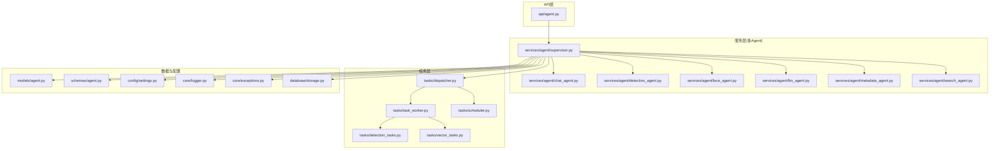
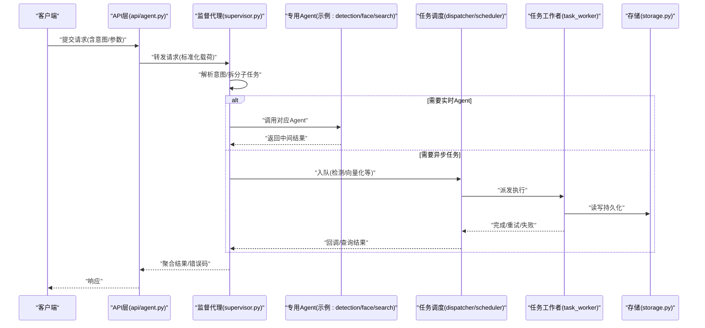
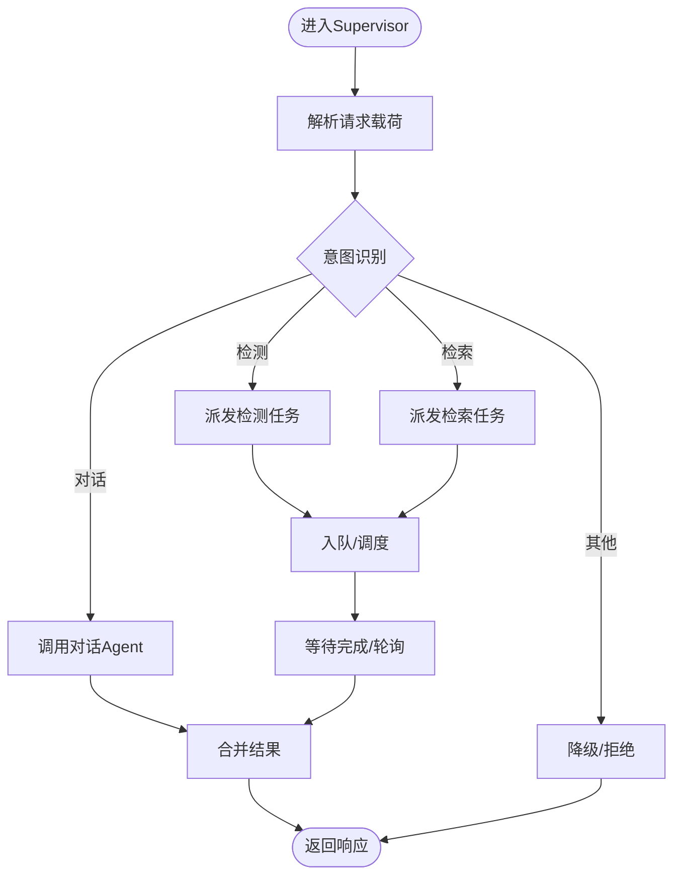
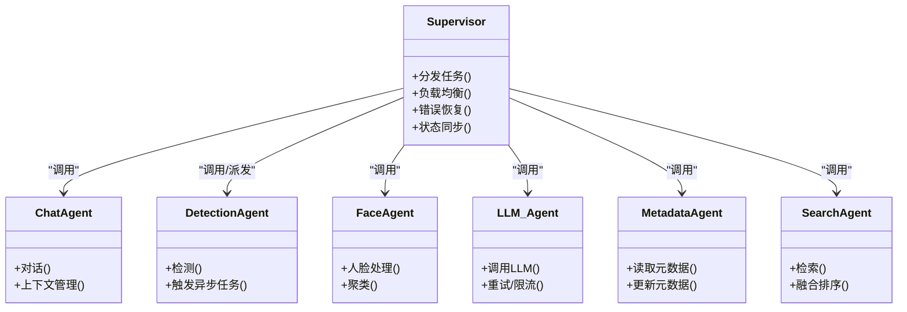
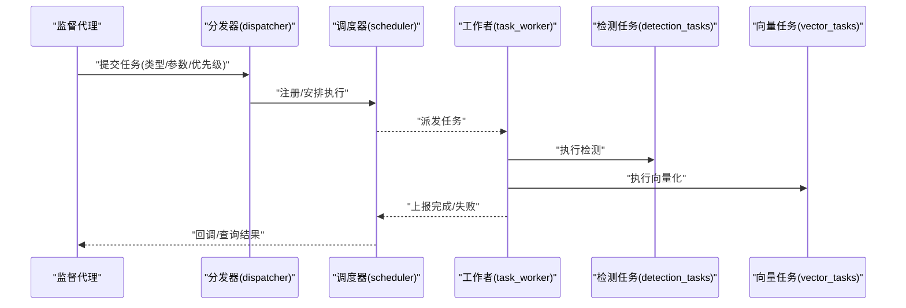
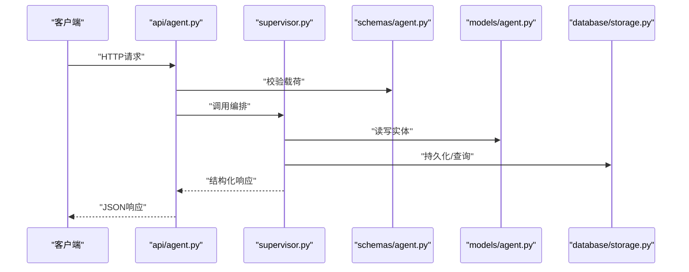
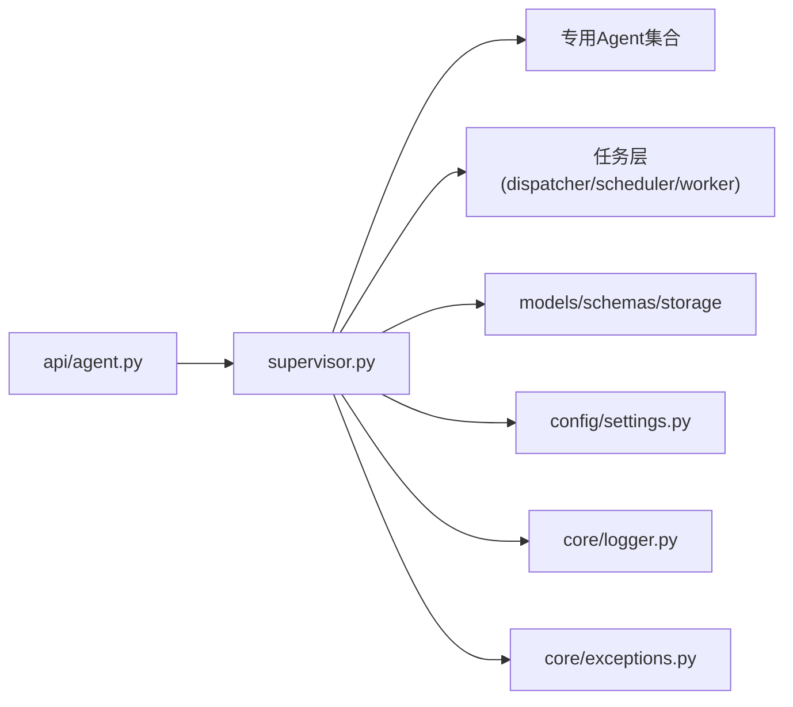

# Agent架构设计

<cite>
**本文引用的文件**   
- [backend/app/services/agent/supervisor.py](file://backend/app/services/agent/supervisor.py)
- [backend/app/services/agent/chat_agent.py](file://backend/app/services/agent/chat_agent.py)
- [backend/app/services/agent/detection_agent.py](file://backend/app/services/agent/detection_agent.py)
- [backend/app/services/agent/face_agent.py](file://backend/app/services/agent/face_agent.py)
- [backend/app/services/agent/llm_agent.py](file://backend/app/services/agent/llm_agent.py)
- [backend/app/services/agent/metadata_agent.py](file://backend/app/services/agent/metadata_agent.py)
- [backend/app/services/agent/search_agent.py](file://backend/app/services/agent/search_agent.py)
- [backend/app/tasks/dispatcher.py](file://backend/app/tasks/dispatcher.py)
- [backend/app/tasks/task_worker.py](file://backend/app/tasks/task_worker.py)
- [backend/app/tasks/scheduler.py](file://backend/app/tasks/scheduler.py)
- [backend/app/tasks/detection_tasks.py](file://backend/app/tasks/detection_tasks.py)
- [backend/app/tasks/vector_tasks.py](file://backend/app/tasks/vector_tasks.py)
- [backend/app/api/agent.py](file://backend/app/api/agent.py)
- [backend/app/models/agent.py](file://backend/app/models/agent.py)
- [backend/app/schemas/agent.py](file://backend/app/schemas/agent.py)
- [backend/app/config/settings.py](file://backend/app/config/settings.py)
- [backend/app/core/logger.py](file://backend/app/core/logger.py)
- [backend/app/core/exceptions.py](file://backend/app/core/exceptions.py)
- [backend/app/database/storage.py](file://backend/app/database/storage.py)
- [backend/app/services/README.md](file://backend/app/services/README.md)
</cite>

## 目录
1. [简介](#简介)
2. [项目结构](#项目结构)
3. [核心组件](#核心组件)
4. [架构总览](#架构总览)
5. [详细组件分析](#详细组件分析)
6. [依赖关系分析](#依赖关系分析)
7. [性能与并发](#性能与并发)
8. [故障排查指南](#故障排查指南)
9. [结论](#结论)
10. [附录：扩展与自定义Agent开发指南](#附录扩展与自定义agent开发指南)

## 简介
本文件面向AI代理系统的整体架构设计，聚焦多Agent协作、监督代理(Supervisor)的任务分发与负载均衡、错误恢复、Agent间通信协议与消息格式、状态同步、生命周期管理、资源分配与并发控制，以及系统扩展性与自定义Agent开发规范。文档以代码仓库中的实际实现为依据，提供可视化图示与可操作的实践建议，帮助读者快速理解并扩展系统能力。

## 项目结构
后端采用分层与模块化组织：API层暴露HTTP接口；服务层包含各Agent与业务服务；任务层负责异步调度与执行；数据模型与Schema定义持久化结构与校验；配置与日志贯穿全栈。

图表来源
- [backend/app/api/agent.py](file://backend/app/api/agent.py)
- [backend/app/services/agent/supervisor.py](file://backend/app/services/agent/supervisor.py)
- [backend/app/services/agent/chat_agent.py](file://backend/app/services/agent/chat_agent.py)
- [backend/app/services/agent/detection_agent.py](file://backend/app/services/agent/detection_agent.py)
- [backend/app/services/agent/face_agent.py](file://backend/app/services/agent/face_agent.py)
- [backend/app/services/agent/llm_agent.py](file://backend/app/services/agent/llm_agent.py)
- [backend/app/services/agent/metadata_agent.py](file://backend/app/services/agent/metadata_agent.py)
- [backend/app/services/agent/search_agent.py](file://backend/app/services/agent/search_agent.py)
- [backend/app/tasks/dispatcher.py](file://backend/app/tasks/dispatcher.py)
- [backend/app/tasks/task_worker.py](file://backend/app/tasks/task_worker.py)
- [backend/app/tasks/scheduler.py](file://backend/app/tasks/scheduler.py)
- [backend/app/tasks/detection_tasks.py](file://backend/app/tasks/detection_tasks.py)
- [backend/app/tasks/vector_tasks.py](file://backend/app/tasks/vector_tasks.py)
- [backend/app/models/agent.py](file://backend/app/models/agent.py)
- [backend/app/schemas/agent.py](file://backend/app/schemas/agent.py)
- [backend/app/config/settings.py](file://backend/app/config/settings.py)
- [backend/app/core/logger.py](file://backend/app/core/logger.py)
- [backend/app/core/exceptions.py](file://backend/app/core/exceptions.py)
- [backend/app/database/storage.py](file://backend/app/database/storage.py)

章节来源
- [backend/app/services/README.md](file://backend/app/services/README.md)

## 核心组件
- 监督代理(Supervisor)：作为编排中心，负责接收上游请求、解析意图、拆分任务、选择目标Agent或任务队列、协调执行顺序、聚合结果与错误处理。
- 专用Agent：包括对话Agent、检测Agent、人脸Agent、LLM调用Agent、元数据Agent、检索Agent等，各自专注单一职责，通过统一接口与Supervisor交互。
- 任务调度器与工作者：将耗时或批处理任务（如检测、向量计算）异步化，支持延迟执行、重试与失败回退。
- 数据与配置：统一的模型与Schema保证输入输出一致性；配置项集中管理；日志与异常体系贯穿全流程。

章节来源
- [backend/app/services/agent/supervisor.py](file://backend/app/services/agent/supervisor.py)
- [backend/app/services/agent/chat_agent.py](file://backend/app/services/agent/chat_agent.py)
- [backend/app/services/agent/detection_agent.py](file://backend/app/services/agent/detection_agent.py)
- [backend/app/services/agent/face_agent.py](file://backend/app/services/agent/face_agent.py)
- [backend/app/services/agent/llm_agent.py](file://backend/app/services/agent/llm_agent.py)
- [backend/app/services/agent/metadata_agent.py](file://backend/app/services/agent/metadata_agent.py)
- [backend/app/services/agent/search_agent.py](file://backend/app/services/agent/search_agent.py)
- [backend/app/tasks/dispatcher.py](file://backend/app/tasks/dispatcher.py)
- [backend/app/tasks/task_worker.py](file://backend/app/tasks/task_worker.py)
- [backend/app/tasks/scheduler.py](file://backend/app/tasks/scheduler.py)
- [backend/app/tasks/detection_tasks.py](file://backend/app/tasks/detection_tasks.py)
- [backend/app/tasks/vector_tasks.py](file://backend/app/tasks/vector_tasks.py)
- [backend/app/models/agent.py](file://backend/app/models/agent.py)
- [backend/app/schemas/agent.py](file://backend/app/schemas/agent.py)
- [backend/app/config/settings.py](file://backend/app/config/settings.py)
- [backend/app/core/logger.py](file://backend/app/core/logger.py)
- [backend/app/core/exceptions.py](file://backend/app/core/exceptions.py)
- [backend/app/database/storage.py](file://backend/app/database/storage.py)

## 架构总览
系统采用“API入口 + 监督代理编排 + 专用Agent + 任务队列”的分层协作模式。API层仅做参数校验与路由，核心逻辑下沉至Supervisor与各Agent；长耗时操作通过任务层异步执行，保障主流程响应性。

图表来源
- [backend/app/api/agent.py](file://backend/app/api/agent.py)
- [backend/app/services/agent/supervisor.py](file://backend/app/services/agent/supervisor.py)
- [backend/app/tasks/dispatcher.py](file://backend/app/tasks/dispatcher.py)
- [backend/app/tasks/scheduler.py](file://backend/app/tasks/scheduler.py)
- [backend/app/tasks/task_worker.py](file://backend/app/tasks/task_worker.py)
- [backend/app/database/storage.py](file://backend/app/database/storage.py)

## 详细组件分析

### 监督代理(Supervisor)
- 职责
  - 接收并标准化请求载荷，进行意图识别与任务拆解。
  - 根据负载策略选择具体Agent或任务队列。
  - 维护任务上下文与状态，聚合多Agent结果。
  - 错误分类、重试与降级策略。
- 关键流程
  - 任务分发：基于规则或权重选择执行路径。
  - 负载均衡：结合Agent可用度、队列深度与历史成功率动态调整。
  - 错误恢复：区分可重试与不可重试错误，设置最大重试次数与退避策略。
- 状态同步：通过统一的状态字段记录任务阶段、进度与最终结果，供上层查询。

图表来源
- [backend/app/services/agent/supervisor.py](file://backend/app/services/agent/supervisor.py)
- [backend/app/tasks/dispatcher.py](file://backend/app/tasks/dispatcher.py)
- [backend/app/tasks/scheduler.py](file://backend/app/tasks/scheduler.py)
- [backend/app/tasks/task_worker.py](file://backend/app/tasks/task_worker.py)

章节来源
- [backend/app/services/agent/supervisor.py](file://backend/app/services/agent/supervisor.py)
- [backend/app/tasks/dispatcher.py](file://backend/app/tasks/dispatcher.py)
- [backend/app/tasks/scheduler.py](file://backend/app/tasks/scheduler.py)
- [backend/app/tasks/task_worker.py](file://backend/app/tasks/task_worker.py)

### 专用Agent族
- 对话Agent：负责自然语言交互、上下文管理与提示词组装。
- 检测Agent：封装图像/视频检测能力，可能触发异步任务。
- 人脸Agent：负责人脸识别、聚类与关联。
- LLM Agent：抽象外部大模型调用，统一超时、重试与限流。
- 元数据Agent：读取与更新媒体元数据。
- 检索Agent：组合向量检索与关键词检索，返回排序结果。

图表来源
- [backend/app/services/agent/supervisor.py](file://backend/app/services/agent/supervisor.py)
- [backend/app/services/agent/chat_agent.py](file://backend/app/services/agent/chat_agent.py)
- [backend/app/services/agent/detection_agent.py](file://backend/app/services/agent/detection_agent.py)
- [backend/app/services/agent/face_agent.py](file://backend/app/services/agent/face_agent.py)
- [backend/app/services/agent/llm_agent.py](file://backend/app/services/agent/llm_agent.py)
- [backend/app/services/agent/metadata_agent.py](file://backend/app/services/agent/metadata_agent.py)
- [backend/app/services/agent/search_agent.py](file://backend/app/services/agent/search_agent.py)

章节来源
- [backend/app/services/agent/chat_agent.py](file://backend/app/services/agent/chat_agent.py)
- [backend/app/services/agent/detection_agent.py](file://backend/app/services/agent/detection_agent.py)
- [backend/app/services/agent/face_agent.py](file://backend/app/services/agent/face_agent.py)
- [backend/app/services/agent/llm_agent.py](file://backend/app/services/agent/llm_agent.py)
- [backend/app/services/agent/metadata_agent.py](file://backend/app/services/agent/metadata_agent.py)
- [backend/app/services/agent/search_agent.py](file://backend/app/services/agent/search_agent.py)

### 任务调度与工作者
- 调度器：负责任务的创建、优先级、延迟与周期性执行。
- 分发器：将任务按类型路由到不同工作队列与消费者。
- 工作者：消费任务、执行业务逻辑、持久化结果与上报状态。
- 典型任务：检测任务、向量任务等。

图表来源
- [backend/app/tasks/dispatcher.py](file://backend/app/tasks/dispatcher.py)
- [backend/app/tasks/scheduler.py](file://backend/app/tasks/scheduler.py)
- [backend/app/tasks/task_worker.py](file://backend/app/tasks/task_worker.py)
- [backend/app/tasks/detection_tasks.py](file://backend/app/tasks/detection_tasks.py)
- [backend/app/tasks/vector_tasks.py](file://backend/app/tasks/vector_tasks.py)

章节来源
- [backend/app/tasks/dispatcher.py](file://backend/app/tasks/dispatcher.py)
- [backend/app/tasks/scheduler.py](file://backend/app/tasks/scheduler.py)
- [backend/app/tasks/task_worker.py](file://backend/app/tasks/task_worker.py)
- [backend/app/tasks/detection_tasks.py](file://backend/app/tasks/detection_tasks.py)
- [backend/app/tasks/vector_tasks.py](file://backend/app/tasks/vector_tasks.py)

### API与数据契约
- API入口：对请求进行基础校验后交由Supervisor处理。
- 模型与Schema：统一Agent输入输出结构，确保跨组件一致性。
- 存储：提供统一的持久化访问点，屏蔽底层细节。

图表来源
- [backend/app/api/agent.py](file://backend/app/api/agent.py)
- [backend/app/schemas/agent.py](file://backend/app/schemas/agent.py)
- [backend/app/models/agent.py](file://backend/app/models/agent.py)
- [backend/app/database/storage.py](file://backend/app/database/storage.py)

章节来源
- [backend/app/api/agent.py](file://backend/app/api/agent.py)
- [backend/app/schemas/agent.py](file://backend/app/schemas/agent.py)
- [backend/app/models/agent.py](file://backend/app/models/agent.py)
- [backend/app/database/storage.py](file://backend/app/database/storage.py)

## 依赖关系分析
- 低耦合高内聚：Supervisor仅依赖Agent的统一接口与任务队列，避免直接耦合具体实现。
- 明确边界：API层不承载业务逻辑；任务层与实时Agent解耦，通过状态与回调沟通。
- 外部依赖：LLM调用、向量检索、对象存储等通过配置与适配器接入。

图表来源
- [backend/app/api/agent.py](file://backend/app/api/agent.py)
- [backend/app/services/agent/supervisor.py](file://backend/app/services/agent/supervisor.py)
- [backend/app/tasks/dispatcher.py](file://backend/app/tasks/dispatcher.py)
- [backend/app/tasks/scheduler.py](file://backend/app/tasks/scheduler.py)
- [backend/app/tasks/task_worker.py](file://backend/app/tasks/task_worker.py)
- [backend/app/models/agent.py](file://backend/app/models/agent.py)
- [backend/app/schemas/agent.py](file://backend/app/schemas/agent.py)
- [backend/app/database/storage.py](file://backend/app/database/storage.py)
- [backend/app/config/settings.py](file://backend/app/config/settings.py)
- [backend/app/core/logger.py](file://backend/app/core/logger.py)
- [backend/app/core/exceptions.py](file://backend/app/core/exceptions.py)

章节来源
- [backend/app/services/agent/supervisor.py](file://backend/app/services/agent/supervisor.py)
- [backend/app/tasks/dispatcher.py](file://backend/app/tasks/dispatcher.py)
- [backend/app/tasks/scheduler.py](file://backend/app/tasks/scheduler.py)
- [backend/app/tasks/task_worker.py](file://backend/app/tasks/task_worker.py)
- [backend/app/models/agent.py](file://backend/app/models/agent.py)
- [backend/app/schemas/agent.py](file://backend/app/schemas/agent.py)
- [backend/app/database/storage.py](file://backend/app/database/storage.py)
- [backend/app/config/settings.py](file://backend/app/config/settings.py)
- [backend/app/core/logger.py](file://backend/app/core/logger.py)
- [backend/app/core/exceptions.py](file://backend/app/core/exceptions.py)

## 性能与并发
- 异步优先：将CPU/IO密集型任务（检测、向量化）放入任务队列，避免阻塞主线程。
- 并发控制：为Agent与外部调用设置并发上限、超时与熔断，防止雪崩。
- 负载均衡：依据Agent健康度、队列长度与历史成功率动态选择执行路径。
- 缓存与去重：对热点查询与重复任务进行缓存与幂等处理。
- 资源隔离：按任务类型划分队列与消费者组，避免相互干扰。

[本节为通用指导，无需特定文件引用]

## 故障排查指南
- 日志定位：使用统一日志模块记录关键节点、参数与耗时，便于问题回溯。
- 异常分类：区分网络、认证、参数、资源不足等错误，配合不同的恢复策略。
- 重试与退避：对瞬时错误实施指数退避重试，超过阈值则告警与降级。
- 状态追踪：在任务与Agent中维护状态机，支持查询当前阶段与失败原因。
- 常见症状
  - 任务堆积：检查消费者数量、任务复杂度与下游依赖可用性。
  - 超时频繁：调整超时阈值、优化I/O路径或引入缓存。
  - 结果不一致：确认幂等性与状态同步机制是否生效。

章节来源
- [backend/app/core/logger.py](file://backend/app/core/logger.py)
- [backend/app/core/exceptions.py](file://backend/app/core/exceptions.py)
- [backend/app/tasks/task_worker.py](file://backend/app/tasks/task_worker.py)
- [backend/app/tasks/dispatcher.py](file://backend/app/tasks/dispatcher.py)
- [backend/app/tasks/scheduler.py](file://backend/app/tasks/scheduler.py)

## 结论
本架构以Supervisor为核心编排者，结合专用Agent与任务队列，实现了高内聚、低耦合的多Agent协作体系。通过明确的通信协议、状态同步与错误恢复机制，系统在可扩展性、稳定性与可观测性方面具备良好基础。后续可在负载均衡策略、弹性伸缩与可观测性指标上持续增强。

[本节为总结性内容，无需特定文件引用]

## 附录：扩展与自定义Agent开发指南

### 接口规范
- 统一方法约定
  - 初始化：接受配置与环境依赖注入。
  - 执行：接收标准化输入，返回结构化输出。
  - 健康检查：返回可用性状态与资源占用信息。
  - 销毁：释放资源与清理临时状态。
- 输入输出
  - 输入遵循统一Schema，包含必要字段、可选字段与约束说明。
  - 输出包含结果数据、元信息与错误码。
- 错误与状态
  - 使用统一异常类型与错误码。
  - 在任务型Agent中维护状态机，支持查询与重试。

章节来源
- [backend/app/schemas/agent.py](file://backend/app/schemas/agent.py)
- [backend/app/core/exceptions.py](file://backend/app/core/exceptions.py)

### 配置选项
- 全局配置
  - 并发上限、超时时间、重试次数与退避策略。
  - 日志级别与采样率。
- Agent级配置
  - 端点地址、鉴权信息、模型参数与阈值。
  - 队列绑定与消费者数量。
- 存储与外部依赖
  - 数据库连接、对象存储、向量库与第三方服务URL。

章节来源
- [backend/app/config/settings.py](file://backend/app/config/settings.py)
- [backend/app/database/storage.py](file://backend/app/database/storage.py)

### 最佳实践
- 幂等设计：确保任务可安全重试，避免副作用。
- 超时与熔断：对外部依赖设置合理超时与熔断阈值。
- 可观测性：埋点关键指标（吞吐、延迟、错误率），接入监控与告警。
- 版本兼容：保持Schema向后兼容，逐步演进。
- 测试覆盖：为Agent编写单元与集成测试，模拟外部依赖失败场景。

章节来源
- [backend/app/core/logger.py](file://backend/app/core/logger.py)
- [backend/app/tasks/task_worker.py](file://backend/app/tasks/task_worker.py)
- [backend/app/services/README.md](file://backend/app/services/README.md)