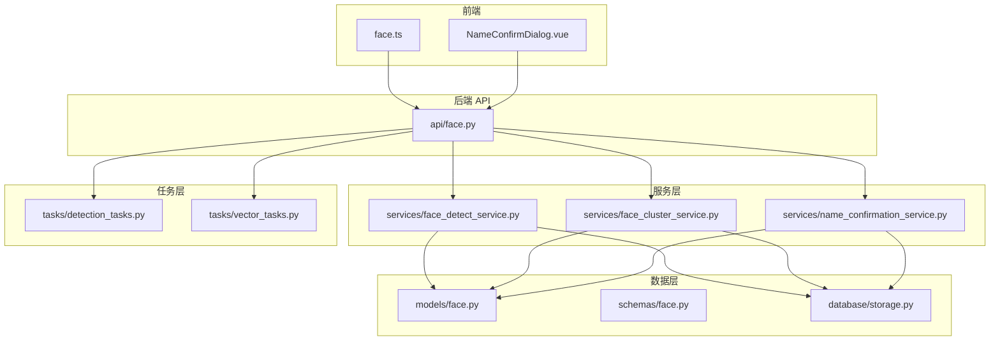
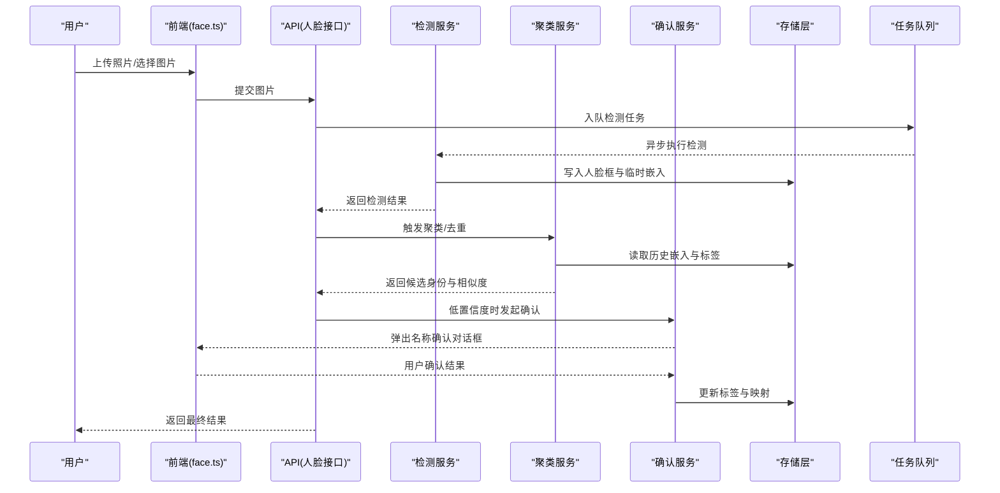
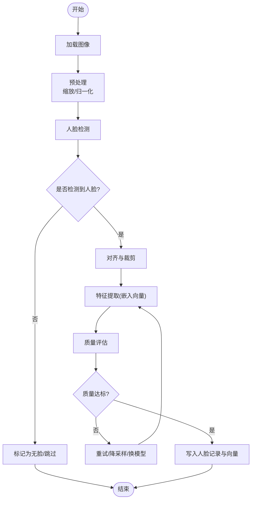
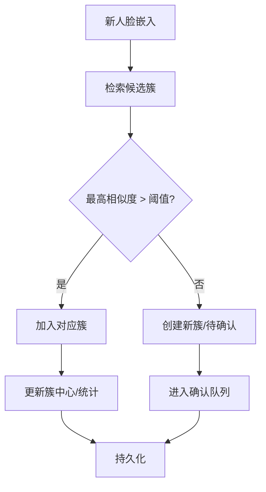
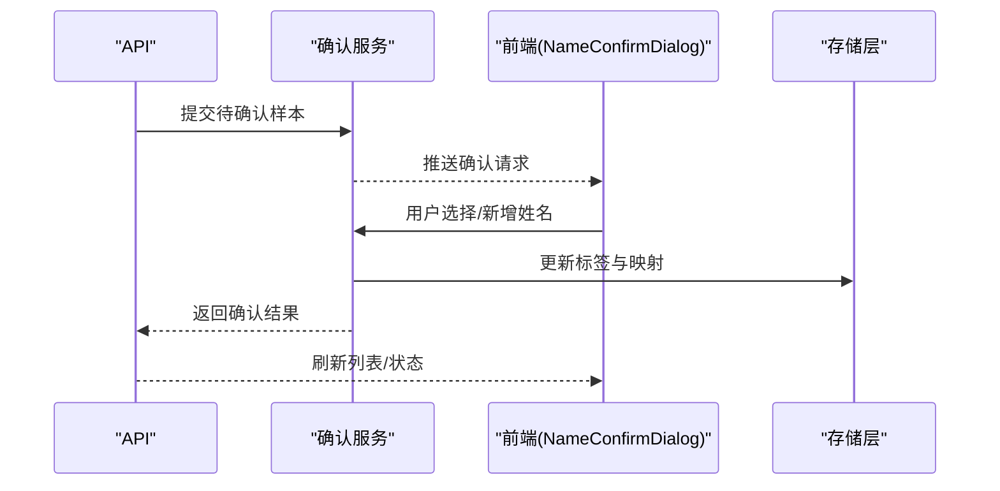
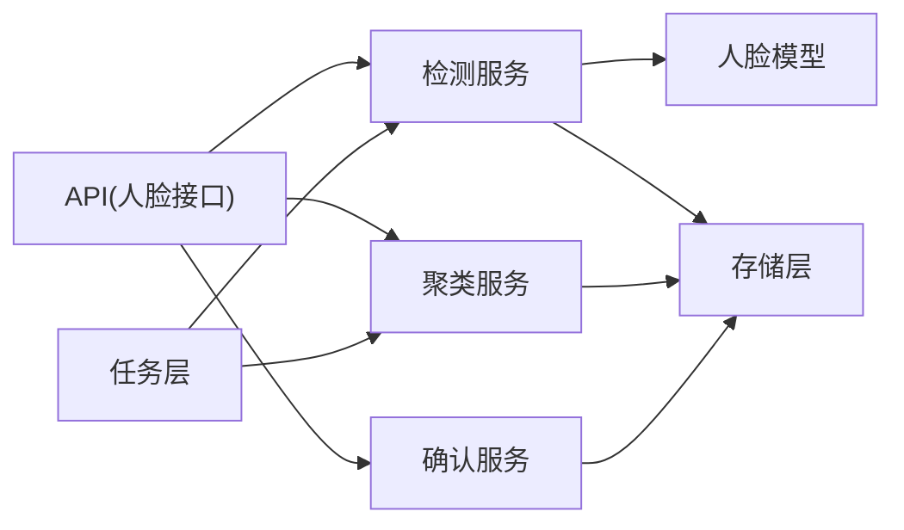

# 人脸代理

<cite>
**本文引用的文件**   
- [backend/app/api/face.py](file://backend/app/api/face.py)
- [backend/app/services/face_detect_service.py](file://backend/app/services/face_detect_service.py)
- [backend/app/services/face_cluster_service.py](file://backend/app/services/face_cluster_service.py)
- [backend/app/services/name_confirmation_service.py](file://backend/app/services/name_confirmation_service.py)
- [backend/app/models/face.py](file://backend/app/models/face.py)
- [backend/app/schemas/face.py](file://backend/app/schemas/face.py)
- [backend/app/database/storage.py](file://backend/app/database/storage.py)
- [backend/app/tasks/detection_tasks.py](file://backend/app/tasks/detection_tasks.py)
- [backend/app/tasks/vector_tasks.py](file://backend/app/tasks/vector_tasks.py)
- [backend/app/config/settings.py](file://backend/app/config/settings.py)
- [frontend/src/components/chat/NameConfirmDialog.vue](file://frontend/src/components/chat/NameConfirmDialog.vue)
- [frontend/src/api/face.ts](file://frontend/src/api/face.ts)
</cite>

## 目录
1. [简介](#简介)
2. [项目结构](#项目结构)
3. [核心组件](#核心组件)
4. [架构总览](#架构总览)
5. [详细组件分析](#详细组件分析)
6. [依赖关系分析](#依赖关系分析)
7. [性能考虑](#性能考虑)
8. [故障排查指南](#故障排查指南)
9. [结论](#结论)
10. [附录](#附录)

## 简介
本文件面向“人脸代理(Face Agent)”子系统，系统性阐述人脸识别、聚类和身份确认的完整流程。内容覆盖：
- 人脸检测算法与特征提取技术
- 聚类策略与相似度计算、阈值设定、误识别处理
- 人脸数据库的增删改查、索引优化与查询调优
- 配置项、批量处理能力与错误恢复策略
- 人脸确认工作流与用户交互集成示例

## 项目结构
后端采用分层架构：API层暴露REST接口，服务层封装业务逻辑（检测、聚类、确认），模型与Schema定义数据契约，存储层负责持久化，任务层提供异步批处理。前端通过API调用完成交互，并提供名称确认对话框。

图表来源
- [backend/app/api/face.py](file://backend/app/api/face.py)
- [backend/app/services/face_detect_service.py](file://backend/app/services/face_detect_service.py)
- [backend/app/services/face_cluster_service.py](file://backend/app/services/face_cluster_service.py)
- [backend/app/services/name_confirmation_service.py](file://backend/app/services/name_confirmation_service.py)
- [backend/app/models/face.py](file://backend/app/models/face.py)
- [backend/app/schemas/face.py](file://backend/app/schemas/face.py)
- [backend/app/database/storage.py](file://backend/app/database/storage.py)
- [backend/app/tasks/detection_tasks.py](file://backend/app/tasks/detection_tasks.py)
- [backend/app/tasks/vector_tasks.py](file://backend/app/tasks/vector_tasks.py)

章节来源
- [backend/app/api/face.py](file://backend/app/api/face.py)
- [backend/app/services/face_detect_service.py](file://backend/app/services/face_detect_service.py)
- [backend/app/services/face_cluster_service.py](file://backend/app/services/face_cluster_service.py)
- [backend/app/services/name_confirmation_service.py](file://backend/app/services/name_confirmation_service.py)
- [backend/app/models/face.py](file://backend/app/models/face.py)
- [backend/app/schemas/face.py](file://backend/app/schemas/face.py)
- [backend/app/database/storage.py](file://backend/app/database/storage.py)
- [backend/app/tasks/detection_tasks.py](file://backend/app/tasks/detection_tasks.py)
- [backend/app/tasks/vector_tasks.py](file://backend/app/tasks/vector_tasks.py)

## 核心组件
- 人脸检测服务：负责从图像中定位人脸、裁剪与预处理、生成嵌入向量。
- 人脸聚类服务：基于嵌入向量进行聚类，合并重复身份，维护身份-人脸映射。
- 名称确认服务：在低置信度或新身份场景下触发人工确认，更新标签并回写数据库。
- 模型与Schema：定义人脸实体、属性、关联关系及请求/响应结构。
- 存储层：提供人脸记录、向量索引与元数据的读写能力。
- 任务层：异步执行大规模检测与向量化，支持重试与进度上报。

章节来源
- [backend/app/services/face_detect_service.py](file://backend/app/services/face_detect_service.py)
- [backend/app/services/face_cluster_service.py](file://backend/app/services/face_cluster_service.py)
- [backend/app/services/name_confirmation_service.py](file://backend/app/services/name_confirmation_service.py)
- [backend/app/models/face.py](file://backend/app/models/face.py)
- [backend/app/schemas/face.py](file://backend/app/schemas/face.py)
- [backend/app/database/storage.py](file://backend/app/database/storage.py)
- [backend/app/tasks/detection_tasks.py](file://backend/app/tasks/detection_tasks.py)
- [backend/app/tasks/vector_tasks.py](file://backend/app/tasks/vector_tasks.py)

## 架构总览
整体流程分为“检测-嵌入-聚类-确认-入库”五阶段，前后端协作完成。

图表来源
- [backend/app/api/face.py](file://backend/app/api/face.py)
- [backend/app/services/face_detect_service.py](file://backend/app/services/face_detect_service.py)
- [backend/app/services/face_cluster_service.py](file://backend/app/services/face_cluster_service.py)
- [backend/app/services/name_confirmation_service.py](file://backend/app/services/name_confirmation_service.py)
- [backend/app/database/storage.py](file://backend/app/database/storage.py)
- [backend/app/tasks/detection_tasks.py](file://backend/app/tasks/detection_tasks.py)
- [frontend/src/api/face.ts](file://frontend/src/api/face.ts)
- [frontend/src/components/chat/NameConfirmDialog.vue](file://frontend/src/components/chat/NameConfirmDialog.vue)

## 详细组件分析

### 人脸检测与特征提取
- 输入：原始图像或视频帧
- 输出：人脸边界框、关键点（可选）、归一化子图、嵌入向量
- 关键步骤：
  - 图像预处理（缩放、归一化）
  - 人脸检测（多尺度/多方向）
  - 对齐与裁剪
  - 特征提取（嵌入向量）
  - 质量评估（遮挡、模糊、姿态等）
- 异常处理：无脸、多人脸、低质量裁剪时的降级策略与重试

图表来源
- [backend/app/services/face_detect_service.py](file://backend/app/services/face_detect_service.py)
- [backend/app/tasks/detection_tasks.py](file://backend/app/tasks/detection_tasks.py)
- [backend/app/database/storage.py](file://backend/app/database/storage.py)

章节来源
- [backend/app/services/face_detect_service.py](file://backend/app/services/face_detect_service.py)
- [backend/app/tasks/detection_tasks.py](file://backend/app/tasks/detection_tasks.py)
- [backend/app/database/storage.py](file://backend/app/database/storage.py)

### 人脸聚类与相似度计算
- 相似度度量：余弦相似度或欧氏距离（取决于嵌入空间）
- 阈值策略：
  - 硬阈值：超过阈值即判定同一人
  - 软阈值+规则：结合簇大小、时间衰减、质量分动态调整
- 聚类算法：
  - 增量式聚类：新样本与现有簇中心比较，决定加入或新建
  - 层次/密度聚类：离线批量优化
- 冲突与合并：
  - 同簇内重复检测的去重
  - 跨簇合并（人工确认后）
- 性能优化：
  - 近似最近邻检索(AISS/HNSW/FAISS)
  - 分桶/分区索引（按日期、相册、分辨率）
  - 缓存热点身份向量

图表来源
- [backend/app/services/face_cluster_service.py](file://backend/app/services/face_cluster_service.py)
- [backend/app/database/storage.py](file://backend/app/database/storage.py)

章节来源
- [backend/app/services/face_cluster_service.py](file://backend/app/services/face_cluster_service.py)
- [backend/app/database/storage.py](file://backend/app/database/storage.py)

### 身份确认工作流与用户交互
- 触发条件：
  - 新身份首次出现
  - 相似度处于“不确定区间”
  - 人工修正后的再训练/再聚类
- 交互流程：
  - 后端将待确认样本推送至前端
  - 前端展示候选人脸与历史样本，供用户选择或新增姓名
  - 确认后回写标签与映射，触发后续聚类合并
- 容错机制：
  - 超时自动退回“待确认”
  - 并发确认锁避免重复编辑
  - 操作日志可追溯

图表来源
- [backend/app/services/name_confirmation_service.py](file://backend/app/services/name_confirmation_service.py)
- [frontend/src/components/chat/NameConfirmDialog.vue](file://frontend/src/components/chat/NameConfirmDialog.vue)
- [backend/app/database/storage.py](file://backend/app/database/storage.py)

章节来源
- [backend/app/services/name_confirmation_service.py](file://backend/app/services/name_confirmation_service.py)
- [frontend/src/components/chat/NameConfirmDialog.vue](file://frontend/src/components/chat/NameConfirmDialog.vue)
- [backend/app/database/storage.py](file://backend/app/database/storage.py)

### 数据模型与接口契约
- 人脸实体：包含唯一标识、所属照片、边界框、嵌入向量、标签、质量分、时间戳等
- 身份实体：聚合多个相似人脸，维护主样本与统计信息
- 请求/响应：
  - 上传与检测：返回人脸列表、嵌入ID、质量评分
  - 聚类：返回簇ID、成员ID、相似度
  - 确认：返回确认结果与受影响记录

章节来源
- [backend/app/models/face.py](file://backend/app/models/face.py)
- [backend/app/schemas/face.py](file://backend/app/schemas/face.py)

### API 与任务编排
- 同步接口：用于小批量快速反馈（如单张检测、即时确认）
- 异步任务：大批量扫描、离线聚类、向量索引重建
- 任务特性：
  - 幂等设计：重复提交不产生副作用
  - 断点续跑：失败重试与进度持久化
  - 资源隔离：GPU/CPU任务分离

章节来源
- [backend/app/api/face.py](file://backend/app/api/face.py)
- [backend/app/tasks/detection_tasks.py](file://backend/app/tasks/detection_tasks.py)
- [backend/app/tasks/vector_tasks.py](file://backend/app/tasks/vector_tasks.py)

## 依赖关系分析
- 模块耦合：
  - API层仅依赖服务层，服务层依赖模型与存储层，职责清晰
  - 任务层与服务层解耦，通过消息队列/调度器通信
- 外部依赖：
  - 向量检索库（如HNSW/FAISS）
  - 深度学习推理框架（检测/嵌入模型）
  - 对象存储（人脸子图与缩略图）

图表来源
- [backend/app/api/face.py](file://backend/app/api/face.py)
- [backend/app/services/face_detect_service.py](file://backend/app/services/face_detect_service.py)
- [backend/app/services/face_cluster_service.py](file://backend/app/services/face_cluster_service.py)
- [backend/app/services/name_confirmation_service.py](file://backend/app/services/name_confirmation_service.py)
- [backend/app/database/storage.py](file://backend/app/database/storage.py)
- [backend/app/tasks/detection_tasks.py](file://backend/app/tasks/detection_tasks.py)
- [backend/app/tasks/vector_tasks.py](file://backend/app/tasks/vector_tasks.py)

章节来源
- [backend/app/api/face.py](file://backend/app/api/face.py)
- [backend/app/services/face_detect_service.py](file://backend/app/services/face_detect_service.py)
- [backend/app/services/face_cluster_service.py](file://backend/app/services/face_cluster_service.py)
- [backend/app/services/name_confirmation_service.py](file://backend/app/services/name_confirmation_service.py)
- [backend/app/database/storage.py](file://backend/app/database/storage.py)
- [backend/app/tasks/detection_tasks.py](file://backend/app/tasks/detection_tasks.py)
- [backend/app/tasks/vector_tasks.py](file://backend/app/tasks/vector_tasks.py)

## 性能考虑
- 检测阶段
  - 使用高分辨率金字塔与自适应阈值减少漏检
  - 批量并行推理，利用GPU多实例
- 特征与索引
  - 嵌入维度压缩（PCA/白化）降低IO与内存
  - 构建HNSW/FAISS索引，设置efConstruction与M参数平衡召回与速度
- 聚类阶段
  - 先做粗筛（Top-K候选）再做精排（二次打分）
  - 增量聚类优先，离线全量聚类定期运行
- 存储与查询
  - 对人脸表建立复合索引（照片ID、时间、质量分）
  - 向量字段独立索引，冷热数据分层存储
- 任务与并发
  - 任务分片与限流，避免打满GPU/磁盘IO
  - 失败指数退避重试，死信队列兜底

[本节为通用指导，无需代码引用]

## 故障排查指南
- 常见问题
  - 检测不到人脸：检查光照、遮挡、分辨率；开启多尺度检测与质量过滤
  - 误识别率高：调整相似度阈值、引入姿态/遮挡惩罚、增加负样本
  - 聚类不稳定：增大簇最小规模、启用合并策略、定期重训
  - 确认阻塞：检查并发锁、超时配置、前端轮询/长连接
- 日志与追踪
  - 记录每步耗时、相似度分布、阈值命中情况
  - 为每次确认生成审计日志，便于回溯
- 恢复策略
  - 任务失败重试与补偿
  - 索引重建与一致性校验
  - 灰度发布与回滚

章节来源
- [backend/app/services/face_detect_service.py](file://backend/app/services/face_detect_service.py)
- [backend/app/services/face_cluster_service.py](file://backend/app/services/face_cluster_service.py)
- [backend/app/services/name_confirmation_service.py](file://backend/app/services/name_confirmation_service.py)
- [backend/app/tasks/detection_tasks.py](file://backend/app/tasks/detection_tasks.py)
- [backend/app/tasks/vector_tasks.py](file://backend/app/tasks/vector_tasks.py)

## 结论
人脸代理以“检测-嵌入-聚类-确认-入库”为主线，结合异步任务与用户交互，形成高可用、可扩展的人脸识别系统。通过合理的相似度阈值、聚类策略与索引优化，可在保证准确率的同时提升吞吐与稳定性。建议在生产环境持续监控指标、定期校准阈值与模型，并结合业务反馈完善确认流程。

[本节为总结性内容，无需代码引用]

## 附录

### 配置选项参考
- 检测相关
  - 模型路径、设备选择、批量大小、置信度阈值、NMS阈值
- 聚类相关
  - 相似度阈值、簇最小成员数、合并阈值、增量/离线模式开关
- 确认相关
  - 超时时间、并发上限、提示文案模板
- 存储与索引
  - 向量索引类型与参数、分片策略、冷热分层
- 任务相关
  - 重试次数、退避策略、队列容量、资源配额

章节来源
- [backend/app/config/settings.py](file://backend/app/config/settings.py)

### 前端集成要点
- 上传与进度：分片上传、断点续传、进度回调
- 确认弹窗：实时预览、历史样本对比、一键确认/取消
- 错误提示：网络异常、服务不可用、超时重试

章节来源
- [frontend/src/api/face.ts](file://frontend/src/api/face.ts)
- [frontend/src/components/chat/NameConfirmDialog.vue](file://frontend/src/components/chat/NameConfirmDialog.vue)