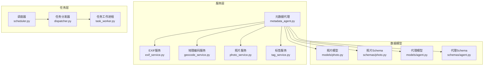
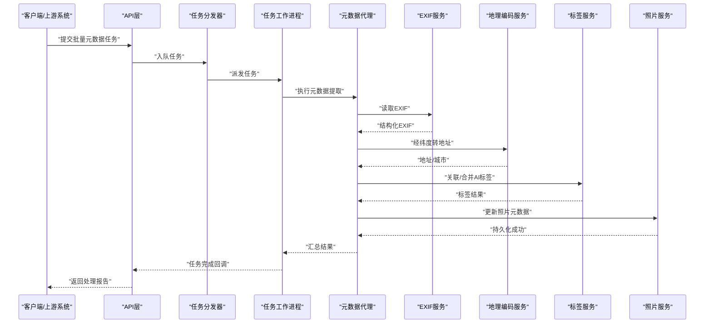
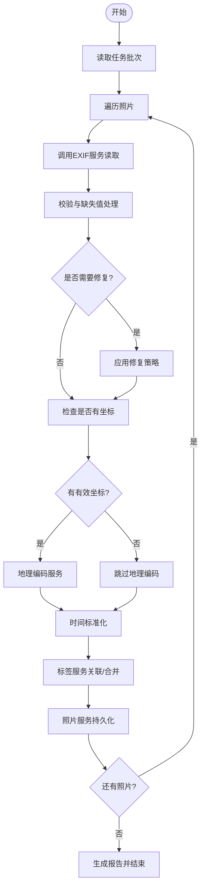
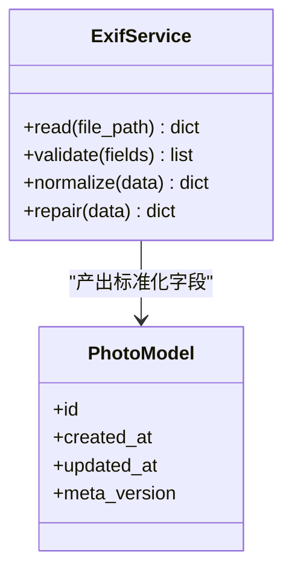
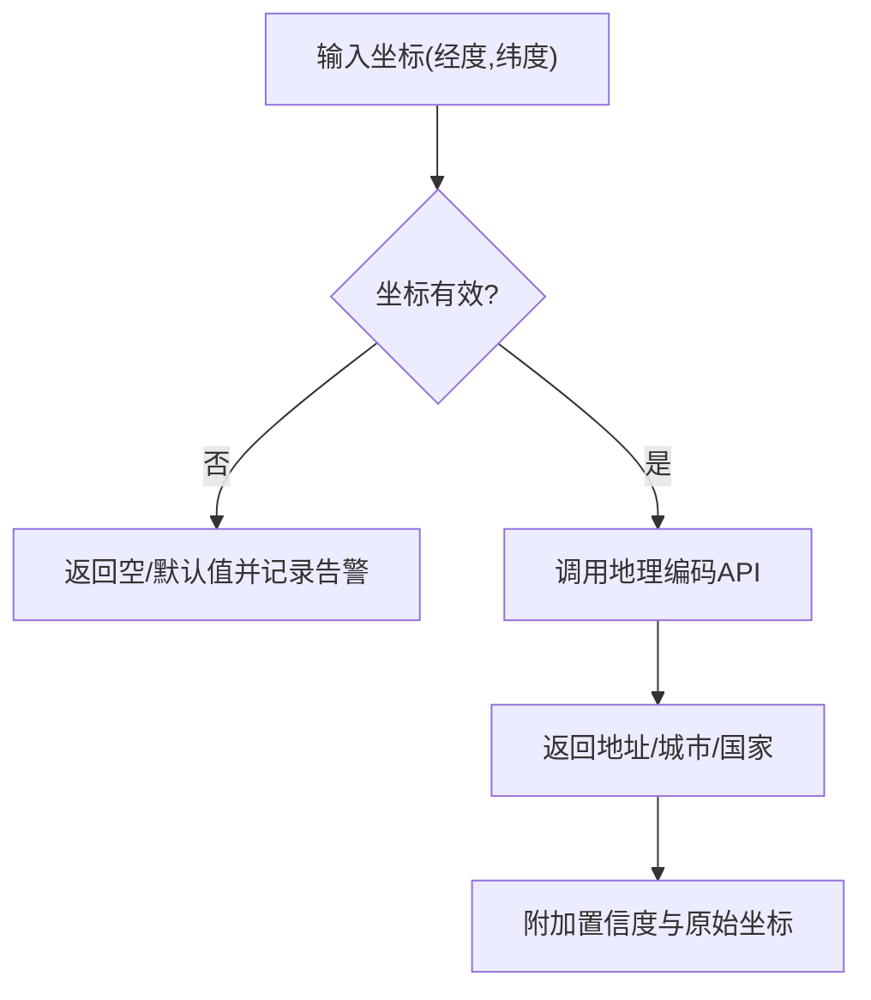
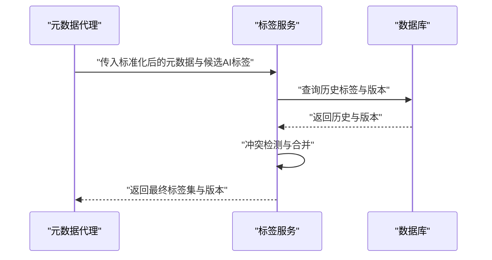
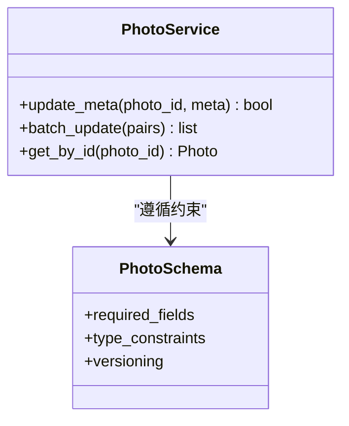
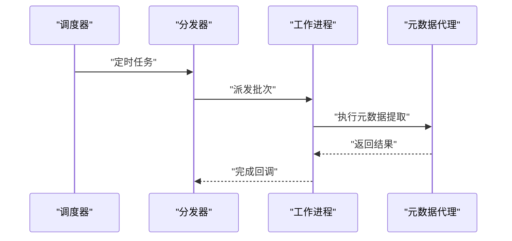
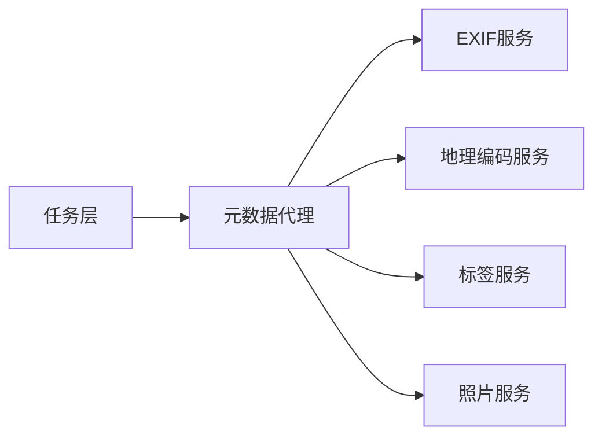

# 元数据代理

<cite>
**本文引用的文件**   
- [metadata_agent.py](file://backend/app/services/agent/metadata_agent.py)
- [exif_service.py](file://backend/app/services/exif_service.py)
- [geocode_service.py](file://backend/app/services/geocode_service.py)
- [photo_service.py](file://backend/app/services/photo_service.py)
- [tag_service.py](file://backend/app/services/tag_service.py)
- [photo.py](file://backend/app/models/photo.py)
- [photo.py](file://backend/app/schemas/photo.py)
- [agent.py](file://backend/app/models/agent.py)
- [agent.py](file://backend/app/schemas/agent.py)
- [supervisor.py](file://backend/app/services/agent/supervisor.py)
- [tasks.py](file://backend/app/api/tasks.py)
- [dispatcher.py](file://backend/app/tasks/dispatcher.py)
- [task_worker.py](file://backend/app/tasks/task_worker.py)
- [scheduler.py](file://backend/app/tasks/scheduler.py)
- [test_exif.py](file://backend/app/services/test/test_exif.py)
- [test_geocode.py](file://backend/app/services/test/test_geocode.py)
</cite>

## 目录
1. [简介](#简介)
2. [项目结构](#项目结构)
3. [核心组件](#核心组件)
4. [架构总览](#架构总览)
5. [详细组件分析](#详细组件分析)
6. [依赖关系分析](#依赖关系分析)
7. [性能考虑](#性能考虑)
8. [故障排查指南](#故障排查指南)
9. [结论](#结论)
10. [附录](#附录)

## 简介
本文件为“元数据代理（Metadata Agent）”的权威技术文档，聚焦照片元数据的提取、解析与标准化处理。内容覆盖：
- EXIF信息类型支持范围与字段映射
- 地理位置数据处理与时区/时间戳转换逻辑
- 元数据验证规则、缺失值处理与异常修复策略
- 元数据与AI标签的关联机制、冲突解决与版本管理
- 配置项、批量处理能力与性能优化技巧
- 与其他Agent协作的实际工作流示例

## 项目结构
围绕元数据代理的相关代码主要分布在服务层与任务调度层：
- 服务层
  - 元数据代理：负责编排EXIF读取、地理编码、时间标准化、与标签/照片模型交互等
  - EXIF服务：从媒体文件中抽取EXIF并做基础校验
  - 地理编码服务：将经纬度转换为地址或城市信息
  - 照片服务：读写照片记录、更新元数据字段
  - 标签服务：管理与AI标签的关联与冲突处理
- 任务层
  - 任务分发器与工作进程：异步执行元数据提取与更新
  - 调度器：定时或事件触发批量处理
- 模型与模式
  - 照片模型与Schema：定义元数据字段、约束与版本
  - 代理模型与Schema：定义代理能力、输入输出契约

图表来源
- [metadata_agent.py:1-200](file://backend/app/services/agent/metadata_agent.py#L1-L200)
- [exif_service.py:1-200](file://backend/app/services/exif_service.py#L1-L200)
- [geocode_service.py:1-200](file://backend/app/services/geocode_service.py#L1-L200)
- [photo_service.py:1-200](file://backend/app/services/photo_service.py#L1-L200)
- [tag_service.py:1-200](file://backend/app/services/tag_service.py#L1-L200)
- [dispatcher.py:1-200](file://backend/app/tasks/dispatcher.py#L1-L200)
- [task_worker.py:1-200](file://backend/app/tasks/task_worker.py#L1-L200)
- [scheduler.py:1-200](file://backend/app/tasks/scheduler.py#L1-L200)
- [photo.py](file://backend/app/models/photo.py)
- [photo.py](file://backend/app/schemas/photo.py)
- [agent.py](file://backend/app/models/agent.py)
- [agent.py](file://backend/app/schemas/agent.py)

章节来源
- [metadata_agent.py:1-200](file://backend/app/services/agent/metadata_agent.py#L1-L200)
- [exif_service.py:1-200](file://backend/app/services/exif_service.py#L1-L200)
- [geocode_service.py:1-200](file://backend/app/services/geocode_service.py#L1-L200)
- [photo_service.py:1-200](file://backend/app/services/photo_service.py#L1-L200)
- [tag_service.py:1-200](file://backend/app/services/tag_service.py#L1-L200)
- [dispatcher.py:1-200](file://backend/app/tasks/dispatcher.py#L1-L200)
- [task_worker.py:1-200](file://backend/app/tasks/task_worker.py#L1-L200)
- [scheduler.py:1-200](file://backend/app/tasks/scheduler.py#L1-L200)
- [photo.py](file://backend/app/models/photo.py)
- [photo.py](file://backend/app/schemas/photo.py)
- [agent.py](file://backend/app/models/agent.py)
- [agent.py](file://backend/app/schemas/agent.py)

## 核心组件
- 元数据代理
  - 职责：协调EXIF读取、地理编码、时间标准化、与标签服务联动、写入照片记录；提供批量处理入口与错误聚合。
  - 关键流程：接收任务→调用EXIF服务→校验与补全→地理编码→时间转换→标签关联→持久化→返回结果。
- EXIF服务
  - 职责：从图片中读取EXIF字段，进行格式校验、单位换算、缺失值标记与异常修复建议。
- 地理编码服务
  - 职责：将经纬度转换为可读地址/城市，处理无效坐标与边界情况。
- 照片服务
  - 职责：按Schema对照片记录进行增删改查，维护元数据版本与审计字段。
- 标签服务
  - 职责：管理AI标签与元数据字段的映射、冲突检测与合并策略。
- 任务层（分发器/工作进程/调度器）
  - 职责：将元数据提取任务异步化，支持并发与重试，提供批量扫描与定时任务。

章节来源
- [metadata_agent.py:1-200](file://backend/app/services/agent/metadata_agent.py#L1-L200)
- [exif_service.py:1-200](file://backend/app/services/exif_service.py#L1-L200)
- [geocode_service.py:1-200](file://backend/app/services/geocode_service.py#L1-L200)
- [photo_service.py:1-200](file://backend/app/services/photo_service.py#L1-L200)
- [tag_service.py:1-200](file://backend/app/services/tag_service.py#L1-L200)
- [dispatcher.py:1-200](file://backend/app/tasks/dispatcher.py#L1-L200)
- [task_worker.py:1-200](file://backend/app/tasks/task_worker.py#L1-L200)
- [scheduler.py:1-200](file://backend/app/tasks/scheduler.py#L1-L200)

## 架构总览
下图展示了元数据代理在系统中的位置与交互关系，包括与EXIF、地理编码、标签、照片服务的协作，以及通过任务层实现的异步批量处理。

图表来源
- [tasks.py:1-200](file://backend/app/api/tasks.py#L1-L200)
- [dispatcher.py:1-200](file://backend/app/tasks/dispatcher.py#L1-L200)
- [task_worker.py:1-200](file://backend/app/tasks/task_worker.py#L1-L200)
- [metadata_agent.py:1-200](file://backend/app/services/agent/metadata_agent.py#L1-L200)
- [exif_service.py:1-200](file://backend/app/services/exif_service.py#L1-L200)
- [geocode_service.py:1-200](file://backend/app/services/geocode_service.py#L1-L200)
- [tag_service.py:1-200](file://backend/app/services/tag_service.py#L1-L200)
- [photo_service.py:1-200](file://backend/app/services/photo_service.py#L1-L200)

## 详细组件分析

### 元数据代理（Metadata Agent）
- 功能要点
  - 编排EXIF读取、地理编码、时间标准化、标签关联与持久化
  - 提供批量处理接口，支持分片与并发控制
  - 统一错误收集与重试策略
- 关键流程
  - 输入：照片ID列表或任务批次
  - 处理：EXIF→校验/修复→地理编码→时间转换→标签合并→写入
  - 输出：处理结果、失败明细、统计指标
- 配置项（示例）
  - 并发数、超时、重试次数、是否启用地理编码、是否强制时间校正、标签合并策略等

图表来源
- [metadata_agent.py:1-200](file://backend/app/services/agent/metadata_agent.py#L1-L200)
- [exif_service.py:1-200](file://backend/app/services/exif_service.py#L1-L200)
- [geocode_service.py:1-200](file://backend/app/services/geocode_service.py#L1-L200)
- [tag_service.py:1-200](file://backend/app/services/tag_service.py#L1-L200)
- [photo_service.py:1-200](file://backend/app/services/photo_service.py#L1-L200)

章节来源
- [metadata_agent.py:1-200](file://backend/app/services/agent/metadata_agent.py#L1-L200)

### EXIF服务
- 支持的EXIF信息类型（常见）
  - 拍摄时间、相机型号、镜头、光圈、快门速度、ISO、焦距、白平衡、闪光灯、GPS坐标、方向、分辨率、色彩空间等
- 解析与标准化
  - 字段映射到内部结构，单位换算（如角度、长度），时区识别与UTC归一化
- 验证与修复
  - 缺失值标记、越界值修正、重复字段去重、损坏段容错
- 测试用例参考
  - 见测试文件中的典型场景与断言

图表来源
- [exif_service.py:1-200](file://backend/app/services/exif_service.py#L1-L200)
- [photo.py](file://backend/app/models/photo.py)

章节来源
- [exif_service.py:1-200](file://backend/app/services/exif_service.py#L1-L200)
- [test_exif.py:1-200](file://backend/app/services/test/test_exif.py#L1-L200)

### 地理编码服务
- 功能要点
  - 将经纬度转换为地址/城市/国家
  - 处理无效坐标、越界、精度不足等情况
- 输出规范
  - 结构化地址对象、置信度评分、原始坐标保留
- 测试用例参考
  - 见测试文件中的边界条件与异常路径

图表来源
- [geocode_service.py:1-200](file://backend/app/services/geocode_service.py#L1-L200)
- [test_geocode.py:1-200](file://backend/app/services/test/test_geocode.py#L1-L200)

章节来源
- [geocode_service.py:1-200](file://backend/app/services/geocode_service.py#L1-L200)
- [test_geocode.py:1-200](file://backend/app/services/test/test_geocode.py#L1-L200)

### 标签服务（与AI标签关联）
- 功能要点
  - 将AI生成的标签与元数据字段建立映射
  - 冲突检测：当元数据与AI标签不一致时的优先级与合并策略
  - 版本管理：记录标签来源、时间与版本
- 冲突解决策略
  - 基于可信度评分、来源权重、时间新鲜度进行决策
- 与元数据代理协作
  - 代理在时间标准化后调用标签服务，确保时间上下文一致

图表来源
- [tag_service.py:1-200](file://backend/app/services/tag_service.py#L1-L200)
- [metadata_agent.py:1-200](file://backend/app/services/agent/metadata_agent.py#L1-L200)

章节来源
- [tag_service.py:1-200](file://backend/app/services/tag_service.py#L1-L200)

### 照片服务（持久化与版本）
- 功能要点
  - 根据Schema更新照片元数据字段
  - 维护元数据版本、审计字段（创建/更新时间）
  - 支持批量更新与事务回滚
- Schema约束
  - 必填字段、数据类型、取值范围、唯一性约束等

图表来源
- [photo_service.py:1-200](file://backend/app/services/photo_service.py#L1-L200)
- [photo.py](file://backend/app/schemas/photo.py)

章节来源
- [photo_service.py:1-200](file://backend/app/services/photo_service.py#L1-L200)
- [photo.py](file://backend/app/schemas/photo.py)

### 任务层（异步与批量）
- 任务分发器
  - 将元数据任务入队，分配给工作进程
- 工作进程
  - 执行具体任务，调用元数据代理与服务
- 调度器
  - 定时触发批量扫描与增量更新

图表来源
- [scheduler.py:1-200](file://backend/app/tasks/scheduler.py#L1-L200)
- [dispatcher.py:1-200](file://backend/app/tasks/dispatcher.py#L1-L200)
- [task_worker.py:1-200](file://backend/app/tasks/task_worker.py#L1-L200)
- [metadata_agent.py:1-200](file://backend/app/services/agent/metadata_agent.py#L1-L200)

章节来源
- [scheduler.py:1-200](file://backend/app/tasks/scheduler.py#L1-L200)
- [dispatcher.py:1-200](file://backend/app/tasks/dispatcher.py#L1-L200)
- [task_worker.py:1-200](file://backend/app/tasks/task_worker.py#L1-L200)

## 依赖关系分析
- 组件耦合
  - 元数据代理强依赖EXIF服务、地理编码服务、标签服务与照片服务
  - 任务层解耦业务逻辑，提升可伸缩性与容错性
- 外部依赖
  - 地理编码API、文件系统IO、数据库存储
- 潜在循环依赖
  - 当前设计以单向调用为主，避免循环依赖

图表来源
- [metadata_agent.py:1-200](file://backend/app/services/agent/metadata_agent.py#L1-L200)
- [exif_service.py:1-200](file://backend/app/services/exif_service.py#L1-L200)
- [geocode_service.py:1-200](file://backend/app/services/geocode_service.py#L1-L200)
- [tag_service.py:1-200](file://backend/app/services/tag_service.py#L1-L200)
- [photo_service.py:1-200](file://backend/app/services/photo_service.py#L1-L200)
- [dispatcher.py:1-200](file://backend/app/tasks/dispatcher.py#L1-L200)

章节来源
- [metadata_agent.py:1-200](file://backend/app/services/agent/metadata_agent.py#L1-L200)
- [dispatcher.py:1-200](file://backend/app/tasks/dispatcher.py#L1-L200)

## 性能考虑
- 并发与批处理
  - 使用任务队列并行处理多张照片，合理设置并发度与批次大小
- I/O优化
  - 减少不必要的文件读取，缓存已解析的EXIF片段
- 网络请求
  - 地理编码服务增加重试与超时控制，必要时引入本地缓存
- 数据库写入
  - 批量更新与事务合并，降低锁竞争
- 监控与度量
  - 记录耗时、失败率、重试次数，便于定位瓶颈

[本节为通用指导，不直接分析具体文件]

## 故障排查指南
- 常见问题
  - EXIF读取失败：检查文件格式、权限、损坏段
  - 地理编码失败：检查坐标有效性、网络连通性、配额限制
  - 时间戳异常：检查时区设置、夏令时、设备时间偏差
  - 标签冲突：检查来源权重与置信度阈值
- 日志与诊断
  - 查看任务层日志、服务层错误堆栈、数据库变更审计
- 恢复策略
  - 重试与降级、回滚部分更新、人工复核与手动修复

章节来源
- [tasks.py:1-200](file://backend/app/api/tasks.py#L1-L200)
- [task_worker.py:1-200](file://backend/app/tasks/task_worker.py#L1-L200)
- [metadata_agent.py:1-200](file://backend/app/services/agent/metadata_agent.py#L1-L200)

## 结论
元数据代理通过分层服务与任务调度实现了高效、稳健的照片元数据处理流水线。其核心价值在于：
- 统一的EXIF解析与标准化
- 可靠的地理编码与时间转换
- 与AI标签的协同与冲突治理
- 可扩展的批量处理与性能优化

[本节为总结，不直接分析具体文件]

## 附录
- 配置选项清单（示例）
  - 并发数、超时、重试次数、地理编码开关、时间校正策略、标签合并策略
- 实际工作流示例
  - 上传照片→触发任务→EXIF读取→地理编码→时间标准化→标签关联→持久化→报告返回

[本节为概念性说明，不直接分析具体文件]