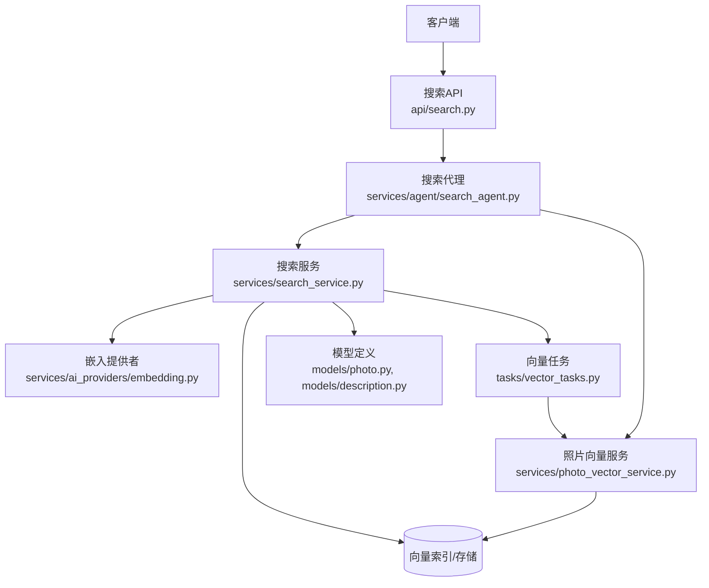
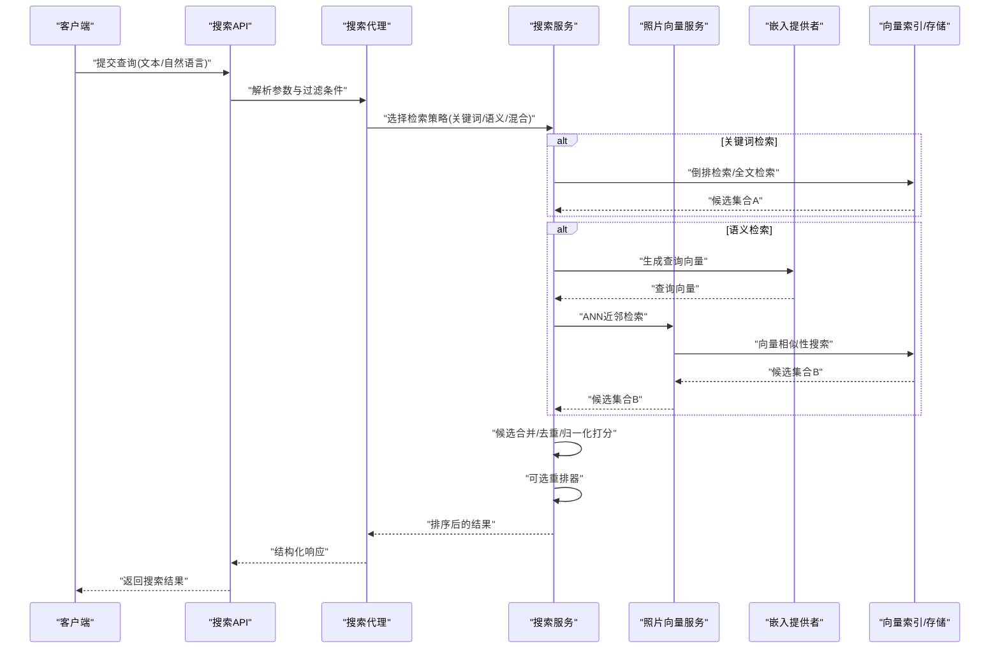
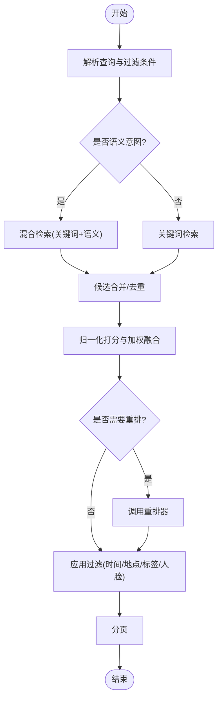
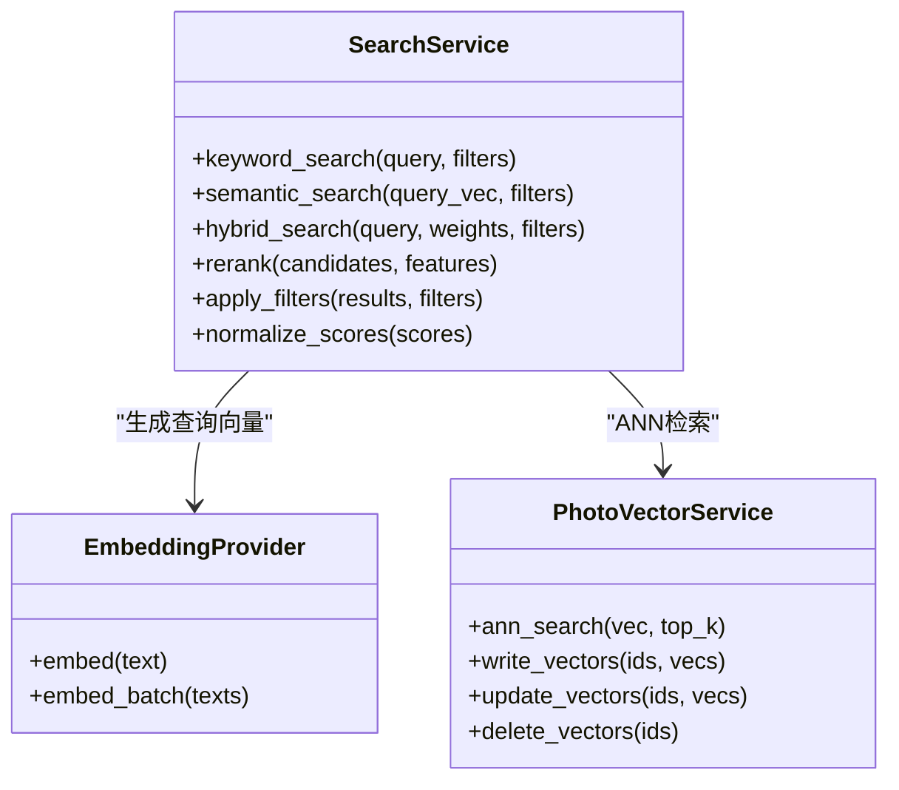
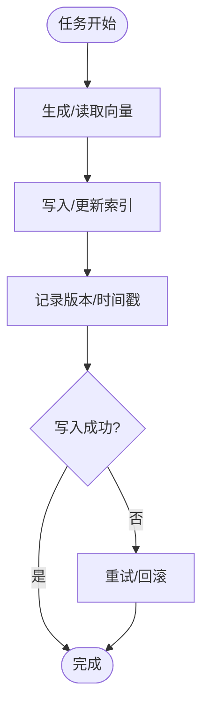
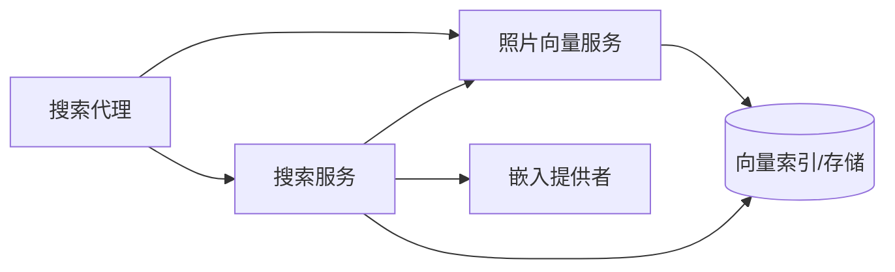

# 搜索代理

<cite>
**本文引用的文件**   
- [search_agent.py](file://backend/app/services/agent/search_agent.py)
- [search_service.py](file://backend/app/services/search_service.py)
- [photo_vector_service.py](file://backend/app/services/photo_vector_service.py)
- [embedding.py](file://backend/app/services/ai_providers/embedding.py)
- [search.py](file://backend/app/api/search.py)
- [vector_tasks.py](file://backend/app/tasks/vector_tasks.py)
- [photo.py](file://backend/app/models/photo.py)
- [description.py](file://backend/app/models/description.py)
</cite>

## 目录
1. [简介](#简介)
2. [项目结构](#项目结构)
3. [核心组件](#核心组件)
4. [架构总览](#架构总览)
5. [详细组件分析](#详细组件分析)
6. [依赖关系分析](#依赖关系分析)
7. [性能考量](#性能考量)
8. [故障排查指南](#故障排查指南)
9. [结论](#结论)
10. [附录](#附录)

## 简介
本文件面向“搜索代理(Search Agent)”的完整技术文档，覆盖语义搜索、向量检索与混合搜索的实现原理；阐述向量嵌入生成、相似度计算与排序策略；说明关键词匹配、语义理解与自然语言查询处理的融合方案；解释索引构建与维护、增量更新与性能优化；并提供配置参数、查询语法与高级筛选能力；最后给出相关性调优、缓存策略与分布式搜索实现建议。

## 项目结构
搜索代理位于后端服务中，围绕“API层 -> 服务层 -> 任务层 -> 模型/存储”的分层组织：
- API 层：对外暴露搜索接口，解析查询参数并调用服务层。
- 服务层：封装搜索业务逻辑，包括语义检索、向量检索、混合检索、结果排序与重排。
- 任务层：异步处理向量嵌入生成与索引维护等耗时任务。
- 模型/存储：持久化照片元数据、描述文本以及向量索引（由外部向量库或本地存储承载）。

图表来源
- [search.py](file://backend/app/api/search.py)
- [search_agent.py](file://backend/app/services/agent/search_agent.py)
- [search_service.py](file://backend/app/services/search_service.py)
- [photo_vector_service.py](file://backend/app/services/photo_vector_service.py)
- [embedding.py](file://backend/app/services/ai_providers/embedding.py)
- [vector_tasks.py](file://backend/app/tasks/vector_tasks.py)
- [photo.py](file://backend/app/models/photo.py)
- [description.py](file://backend/app/models/description.py)

章节来源
- [search.py](file://backend/app/api/search.py)
- [search_agent.py](file://backend/app/services/agent/search_agent.py)
- [search_service.py](file://backend/app/services/search_service.py)
- [photo_vector_service.py](file://backend/app/services/photo_vector_service.py)
- [embedding.py](file://backend/app/services/ai_providers/embedding.py)
- [vector_tasks.py](file://backend/app/tasks/vector_tasks.py)
- [photo.py](file://backend/app/models/photo.py)
- [description.py](file://backend/app/models/description.py)

## 核心组件
- 搜索代理(Search Agent)
  - 职责：统一入口，负责解析自然语言查询、路由到不同检索模式（关键词、语义、混合）、协调排序与重排、返回结构化结果。
  - 关键行为：查询预处理、意图识别、检索策略选择、结果聚合与去重、分页与过滤。
- 搜索服务(Search Service)
  - 职责：实现具体检索算法与流程，包括关键词倒排检索、向量近似最近邻(ANN)检索、混合评分与排序、过滤条件应用。
  - 关键行为：分词与停用词处理、BM25/TF-IDF打分、向量相似度计算、多路召回与融合、重排器调用。
- 照片向量服务(Photo Vector Service)
  - 职责：管理图片向量的生命周期，包括生成、写入、更新、删除与批量同步。
  - 关键行为：触发异步任务、幂等写入、版本控制、一致性校验。
- 嵌入提供者(Embedding Provider)
  - 职责：提供统一的文本/图像嵌入生成接口，屏蔽底层模型差异。
  - 关键行为：模型加载、批处理、缓存、错误重试与降级。
- 向量任务(Vector Tasks)
  - 职责：后台任务调度与执行，确保高吞吐与容错。
  - 关键行为：队列消费、失败重试、进度上报、断点续算。

章节来源
- [search_agent.py](file://backend/app/services/agent/search_agent.py)
- [search_service.py](file://backend/app/services/search_service.py)
- [photo_vector_service.py](file://backend/app/services/photo_vector_service.py)
- [embedding.py](file://backend/app/services/ai_providers/embedding.py)
- [vector_tasks.py](file://backend/app/tasks/vector_tasks.py)

## 架构总览
搜索代理采用“多路召回 + 融合排序”的架构：
- 多路召回：关键词检索、语义向量检索并行执行，各自产出候选集。
- 融合排序：对候选集进行归一化打分与加权融合，必要时引入重排器提升相关性。
- 过滤与分页：在召回后应用时间、地点、标签等过滤，再分页返回。

图表来源
- [search.py](file://backend/app/api/search.py)
- [search_agent.py](file://backend/app/services/agent/search_agent.py)
- [search_service.py](file://backend/app/services/search_service.py)
- [photo_vector_service.py](file://backend/app/services/photo_vector_service.py)
- [embedding.py](file://backend/app/services/ai_providers/embedding.py)
- [vector_tasks.py](file://backend/app/tasks/vector_tasks.py)

## 详细组件分析

### 搜索代理(Search Agent)
- 功能要点
  - 查询解析：支持关键词、短语、布尔表达式与自然语言语句。
  - 意图识别：判断是否需要语义理解（如“找去年在海边拍的日落”），或纯关键词匹配。
  - 策略路由：根据意图与配置选择关键词、语义或混合检索。
  - 结果聚合：合并多路候选，去重与分页。
  - 过滤与排序：应用时间、地点、标签、人脸等过滤；按相关性得分排序。
- 关键流程
  - 输入规范化 -> 意图分类 -> 检索策略选择 -> 多路召回 -> 融合排序 -> 过滤 -> 分页输出。

图表来源
- [search_agent.py](file://backend/app/services/agent/search_agent.py)
- [search_service.py](file://backend/app/services/search_service.py)

章节来源
- [search_agent.py](file://backend/app/services/agent/search_agent.py)
- [search_service.py](file://backend/app/services/search_service.py)

### 搜索服务(Search Service)
- 功能要点
  - 关键词检索：基于倒排索引或全文检索引擎，使用BM25/TF-IDF打分。
  - 语义检索：将查询转换为向量，通过ANN检索相近向量。
  - 混合检索：对关键词与语义结果进行融合，支持权重可调。
  - 排序与重排：先粗排再精排，可接入学习排序模型或规则重排。
  - 过滤：支持多维度过滤组合，短路优化减少无效扫描。
- 关键算法
  - BM25/TF-IDF：衡量词频与逆文档频率，适合精确匹配与短查询。
  - 余弦相似度/内积：用于向量空间中的语义相似度。
  - 融合公式：线性加权或非线性融合，结合位置衰减与多样性惩罚。
  - 重排：基于特征的多因子打分，如点击率、新鲜度、多样性。

图表来源
- [search_service.py](file://backend/app/services/search_service.py)
- [embedding.py](file://backend/app/services/ai_providers/embedding.py)
- [photo_vector_service.py](file://backend/app/services/photo_vector_service.py)

章节来源
- [search_service.py](file://backend/app/services/search_service.py)
- [embedding.py](file://backend/app/services/ai_providers/embedding.py)
- [photo_vector_service.py](file://backend/app/services/photo_vector_service.py)

### 照片向量服务(Photo Vector Service)
- 功能要点
  - 向量生命周期：生成、写入、更新、删除、批量同步。
  - 幂等与一致性：避免重复写入，保证向量与元数据一致。
  - 索引维护：增量更新、重建索引、健康检查。
- 关键流程
  - 接收任务 -> 生成/获取向量 -> 写入索引 -> 记录版本 -> 返回成功/失败。

图表来源
- [photo_vector_service.py](file://backend/app/services/photo_vector_service.py)
- [vector_tasks.py](file://backend/app/tasks/vector_tasks.py)

章节来源
- [photo_vector_service.py](file://backend/app/services/photo_vector_service.py)
- [vector_tasks.py](file://backend/app/tasks/vector_tasks.py)

### 嵌入提供者(Embedding Provider)
- 功能要点
  - 统一接口：文本/图像嵌入生成，支持批处理与并发。
  - 缓存策略：查询向量缓存、结果缓存、模型热重载。
  - 错误处理：超时、限流、降级到备用模型。
- 关键特性
  - 批大小自适应：根据内存与延迟目标调整批次。
  - 维度对齐：确保向量维度与下游索引一致。
  - 度量选择：默认余弦相似度，可切换为内积或欧氏距离。

章节来源
- [embedding.py](file://backend/app/services/ai_providers/embedding.py)

### 向量任务(Vector Tasks)
- 功能要点
  - 任务队列：解耦生成与写入，提高吞吐与稳定性。
  - 失败重试：指数退避与死信队列。
  - 进度上报：便于监控与恢复。
- 关键流程
  - 入队 -> 消费 -> 生成/更新向量 -> 落盘/写索引 -> 状态更新。

章节来源
- [vector_tasks.py](file://backend/app/tasks/vector_tasks.py)

### 模型与数据
- 照片模型
  - 字段：ID、路径、时间、地点、标签、人脸等。
  - 用途：作为检索结果的元数据与过滤依据。
- 描述模型
  - 字段：文本描述、摘要、关键词等。
  - 用途：用于关键词检索与语义理解的输入。

章节来源
- [photo.py](file://backend/app/models/photo.py)
- [description.py](file://backend/app/models/description.py)

## 依赖关系分析
- 组件耦合
  - 搜索代理依赖搜索服务与向量服务，低耦合、高内聚。
  - 搜索服务依赖嵌入提供者与向量服务，通过接口抽象降低替换成本。
- 外部依赖
  - 向量索引/存储：ANN库或数据库插件。
  - 全文检索：倒排索引或搜索引擎。
  - 任务队列：消息队列或进程内队列。
- 潜在循环依赖
  - 通过分层与接口隔离避免循环引用。

图表来源
- [search_agent.py](file://backend/app/services/agent/search_agent.py)
- [search_service.py](file://backend/app/services/search_service.py)
- [photo_vector_service.py](file://backend/app/services/photo_vector_service.py)
- [embedding.py](file://backend/app/services/ai_providers/embedding.py)

章节来源
- [search_agent.py](file://backend/app/services/agent/search_agent.py)
- [search_service.py](file://backend/app/services/search_service.py)
- [photo_vector_service.py](file://backend/app/services/photo_vector_service.py)
- [embedding.py](file://backend/app/services/ai_providers/embedding.py)

## 性能考量
- 索引构建与维护
  - 增量更新：仅对新增/修改的照片生成向量并写入索引，避免全量重建。
  - 批量写入：合并小批次写入，减少IO开销。
  - 索引压缩与分区：按时间或标签分区，缩小搜索范围。
- 查询优化
  - 预取与缓存：热点查询向量缓存、结果缓存（TTL控制）。
  - 过滤前置：尽早应用强约束过滤，减少候选规模。
  - 并行召回：关键词与语义检索并行执行，缩短端到端延迟。
- 资源管理
  - 批大小自适应：根据负载动态调整嵌入批大小。
  - 线程池与连接池：合理设置并发度与连接数。
  - 监控与告警：QPS、延迟、错误率、向量写入积压。

## 故障排查指南
- 常见问题
  - 向量维度不匹配：检查嵌入模型与索引配置的维度一致性。
  - 写入失败：查看任务队列重试次数与死信队列，确认索引可用性。
  - 查询超时：评估批大小、并发度与索引规模，考虑增加缓存命中率。
  - 结果相关性差：调整融合权重、启用重排器、优化分词与停用词表。
- 诊断步骤
  - 检查日志：定位异常堆栈与慢查询。
  - 验证索引健康：运行健康检查与抽样比对。
  - 回放任务：对失败任务进行重试与对比。

章节来源
- [vector_tasks.py](file://backend/app/tasks/vector_tasks.py)
- [photo_vector_service.py](file://backend/app/services/photo_vector_service.py)
- [search_service.py](file://backend/app/services/search_service.py)

## 结论
搜索代理通过“多路召回 + 融合排序”的架构，有效兼顾了关键词匹配的精确性与语义检索的泛化能力。配合增量索引、缓存与任务队列，系统在大规模数据下仍保持良好性能与可扩展性。后续可通过引入学习排序与更丰富的过滤维度进一步提升用户体验。

## 附录

### 配置参数（示例）
- 检索策略
  - 混合权重：关键词权重、语义权重、多样性惩罚系数。
  - 召回数量：各路召回Top-K，最终返回Top-N。
- 嵌入与索引
  - 模型名称、维度、度量类型（余弦/内积/欧氏）。
  - 批大小、并发度、超时时间。
- 任务与缓存
  - 队列容量、重试次数、指数退避倍数。
  - 查询向量缓存TTL、结果缓存TTL。

### 查询语法与高级筛选
- 查询语法
  - 关键词：单字、短语、布尔表达式（AND/OR/NOT）。
  - 自然语言：时间、地点、人物、事件等实体抽取与映射。
- 高级筛选
  - 时间范围、地理位置、标签集合、人脸ID、拍摄设备、分辨率区间。
  - 组合条件：支持嵌套与优先级控制。

### 相关性调优
- 融合策略
  - 线性加权：score = w1*BM25 + w2*Cosine。
  - 非线性融合：引入位置衰减、多样性惩罚、新鲜度因子。
- 重排器
  - 基于特征的学习排序模型或规则重排（点击率、收藏率、评论数）。
- A/B测试
  - 在线实验评估指标：NDCG、MRR、CTR、停留时长。

### 缓存策略
- 查询向量缓存：按查询指纹缓存，TTL与失效策略。
- 结果缓存：热门查询短期缓存，注意数据一致性。
- 模型缓存：嵌入模型热重载与灰度发布。

### 分布式搜索实现方案
- 水平扩展
  - 分片索引：按时间或标签分片，查询广播或路由。
  - 读写分离：索引写入与查询读路径分离。
- 一致性
  - 版本号与冲突解决：写入时携带版本，冲突时重试或合并。
- 容错
  - 副本与故障转移：索引副本与自动切换。
  - 背压与限流：保护下游服务与索引。